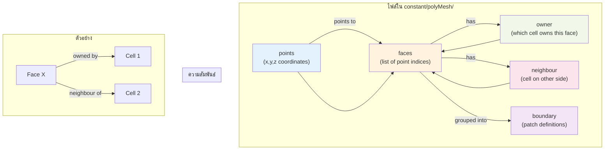

# โครงสร้างไฟล์เมชของ OpenFOAM (OpenFOAM Mesh Structure)

ในซอฟต์แวร์ CFD ทั่วไป ไฟล์ Mesh มักจะรวมเป็นไฟล์ก้อนเดียวใหญ่ๆ (Binary monolith) แต่ OpenFOAM ใช้ปรัชญาที่ต่างออกไป คือ **"Distributed Text Files"** โดยเก็บข้อมูล Mesh ไว้ในโฟลเดอร์ `constant/polyMesh/` ซึ่งประกอบด้วยไฟล์ย่อยๆ หลายไฟล์

การเข้าใจโครงสร้างนี้สำคัญมากเมื่อคุณต้องการ:
*   Debug ปัญหา Mesh (เช่น หาว่า Cell ที่ error อยู่ตรงไหน)
*   เขียนโปรแกรม Manipulate Mesh ด้วย Python/C++
*   ทำความเข้าใจ Error ของ `checkMesh`

## 1. แนวคิด Face-Addressing Format

OpenFOAM ไม่ได้เก็บ Mesh แบบ Element-based (เช่น Cell 1 ประกอบด้วย Node A, B, C, D) แต่ใช้ **Face-based** หรือ Face-Addressing ซึ่งมีประสิทธิภาพสูงกว่าในการคำนวณ Flux

โครงสร้างหลักประกอบด้วย 5 ไฟล์พื้นฐาน (Primitives):

### 1.1 `points` (จุดยอด)
เก็บพิกัด $(x, y, z)$ ของจุดยอดทั้งหมดในระบบ
*   **Format:** `vectorField` (List of vectors)
*   **Index:** บรรทัดแรกคือจุด index 0, ถัดมาคือ 1, 2, ...
*   **หน่วย:** เมตร (Meters) (หลังจากคูณ `convertToMeters` ใน blockMesh แล้ว)

```cpp
// constant/polyMesh/points
(
    (0 0 0)       // Point 0
    (1 0 0)       // Point 1
    (1 1 0)       // Point 2
    (0 1 0)       // Point 3
    ...
)
```

### 1.2 `faces` (หน้า)
นิยามหน้าโดยการระบุ **List ของ Point Indices** ที่ประกอบกันเป็นหน้านั้น
*   **กฎสำคัญ:** ลำดับจุดต้องเรียงตาม **กฎมือขวา (Right-Hand Rule)** เพื่อกำหนดทิศทางของ Normal Vector
    *   Normal vector จะพุ่งออกจากหน้า
*   **Format:** `faceList` (List of dynamic lists)

```cpp
// constant/polyMesh/faces
(
    4(0 1 2 3)    // Face 0: สี่เหลี่ยม (4 จุด)
    3(1 5 2)      // Face 1: สามเหลี่ยม (3 จุด)
    ...
)
```

### 1.3 `owner` (เจ้าของหน้า)
ระบุว่าแต่ละ Face "เป็นของ" Cell ไหน
*   **ขนาด:** เท่ากับจำนวน Faces ทั้งหมด
*   **ความหมาย:** Face $i$ เป็นหน้าของ Cell $C_{owner}$
*   **กฎ:** สำหรับ Internal Face, Normal Vector จะพุ่ง **ออกจาก** Owner Cell เสมอ
*   **Format:** `labelList` (List of integers)

### 1.4 `neighbour` (เพื่อนบ้าน)
ระบุว่า "อีกฝั่ง" ของ Face คือ Cell ไหน
*   **ขนาด:** เท่ากับจำนวน **Internal Faces** เท่านั้น (น้อยกว่า `owner` และ `faces`)
*   **หมายเหตุ:** Boundary Faces (หน้าที่อยู่ขอบ) จะ **ไม่มี** ข้อมูลในไฟล์นี้ (เพราะอีกฝั่งไม่ใช่ Cell แต่เป็นขอบเขต)
*   **Format:** `labelList`

### 1.5 `boundary` (ขอบเขต)
นิยามกลุ่มของ Boundary Faces ว่าเป็น Patch ชื่ออะไร และประเภทไหน
*   **Format:** `polyBoundaryMesh`

```cpp
// constant/polyMesh/boundary
(
    inlet           // ชื่อ Patch
    {
        type patch;     // ชนิด (Physical type)
        nFaces 50;      // จำนวนหน้าใน Patch นี้
        startFace 2000; // เริ่มต้นที่ Face index 2000 ในไฟล์ faces
    }
    ...
)
```
> [!NOTE]
> OpenFOAM เรียง Faces ในไฟล์ `faces` โดยเอา **Internal Faces ไว้ก่อน** แล้วตามด้วย Boundary Faces ของแต่ละ Patch เรียงกันไป ดังนั้น `startFace` ของ Patch แรกจะเท่ากับจำนวน Internal Faces พอดี

## 2. ความสัมพันธ์ (Connectivity)



> **ลิงก์ที่เกี่ยวข้อง**:
> - ทบทวนเรื่อง Mesh Components → [01_Introduction_to_Meshing.md](./01_Introduction_to_Meshing.md)
> - ดูวิธีตรวจสอบคุณภาพ Mesh → [../05_MESH_QUALITY_AND_MANIPULATION/01_Mesh_Quality_Criteria.md](../05_MESH_QUALITY_AND_MANIPULATION/01_Mesh_Quality_Criteria.md)

## 3. ประเภทของ Boundary (Patch Types)

ในไฟล์ `boundary` เราต้องกำหนด `type` ให้ถูกต้อง ซึ่งแบ่งเป็น 2 กลุ่ม:

### 3.1 Base Types (Geometry/Topological Constraint)
*   `patch`: ขอบเขตทั่วไป (ทางเข้า, ทางออก, เปิดสู่บรรยากาศ)
*   `wall`: ผนัง (ของแข็ง) จำเป็นสำหรับการคำนวณ Distance to wall ($y+$)
*   `symmetry` / `symmetryPlane`: ระนาบสมมาตร (บังคับเวกเตอร์ขนานกับผิว)
*   `empty`: สำหรับ 2D Simulation (ใช้ปิดหน้าประกบหน้า-หลัง)
*   `wedge`: สำหรับ 2D Axisymmetric (ชิ้นส่วนเค้ก < 5 องศา)
*   `cyclic`: เชื่อมต่อหน้าสองฝั่งเข้าด้วยกัน (Flow ไหลออกฝั่งนี้ ไปโผล่ฝั่งนู้น)

### 3.2 Numeric Types (ในไฟล์ 0/...)
นี่คือคนละส่วนกับ `polyMesh/boundary` อันนี้คือการกำหนดค่าตัวแปร (BCs) เช่น `fixedValue`, `zeroGradient`

## 4. โซน (Zones)

นอกจาก 5 ไฟล์หลัก ยังมีโฟลเดอร์ `constant/polyMesh/sets` และ `.../zones` (ถ้าสร้างไว้)
*   **CellZones:** กลุ่มของ Cells (ใช้กำหนด Porous media, MRF region)
*   **FaceZones:** กลุ่มของ Faces (ใช้กำหนด Baffles, Fan, หรือ Interior monitoring surface)
*   **PointZones:** กลุ่มของ Points

## 5. การอ่านข้อมูล Mesh ด้วยตนเอง (ถ้าจำเป็น)

คุณสามารถใช้คำสั่ง `foamToVTK` เพื่อแปลง Mesh ไปดูใน ParaView ได้ แต่ถ้าอยากดูสถิติ:
*   `checkMesh`: ตรวจสอบคุณภาพและ Topology
*   `renumberMesh`: จัดเรียงลำดับ Cell ใหม่เพื่อลด Bandwidth ของ Matrix (ช่วยให้รันเร็วขึ้น)
*   `transformPoints`: ย่อ/ขยาย/หมุน/ย้าย Mesh (แก้ไฟล์ `points` โดยตรง)

---

## 📝 แบบฝึกหัด (Exercises)

### แบบฝึกหัดระดับง่าย (Easy)
1. **True/False**: ไฟล์ `neighbour` มีขนาดเท่ากับจำนวน Faces ทั้งหมด
   <details>
   <summary>คำตอบ</summary>
   ❌ เท็จ - ไฟล์ `neighbour` มีขนาดเท่ากับจำนวน **Internal Faces** เท่านั้น (Boundary Faces ไม่มี neighbour)
   </details>

2. **เลือกตอบ**: ไฟล์ไหนที่เก็บพิกัด (x, y, z) ของจุดยอดทั้งหมด?
   - a) faces
   - b) points
   - c) owner
   - d) boundary
   <details>
   <summary>คำตอบ</summary>
   ✅ b) points
   </details>

### แบบฝึกหัดระดับปานกลาง (Medium)
3. **อธิบาย**: ทำไฟล์ `owner` และ `neighbour` จึงสำคัญต่อการคำนวณ Flux ระหว่างเซลล์?
   <details>
   <summary>คำตอบ</summary>
   เพราะ Solver ต้องรู้ว่า Face นั้นเชื่อมระหว่าง Cell ไหนกับ Cell ไหน เพื่อคำนวณการไหลของค่า (Flux) จาก Owner ไปยัง Neighbour ตามทิศทางของ Normal Vector
   </details>

4. **วิเคราะห์**: ถ้าหน้าสามเหลี่ยมถูกนิยามด้วยจุด `(0 0 0), (1 0 0), (0 1 0)` Normal Vector จะชี้ไปทางไหน?
   <details>
   <summary>คำตอบ</summary>
   ใช้กฎมือขวา (Right-Hand Rule) → ชี้ไปทาง +Z (ออกจากหน้าจอ)
   </details>

### แบบฝึกหัดระดับสูง (Hard)
5. **Hands-on**: เปิดไฟล์ `constant/polyMesh/faces` และ `constant/polyMesh/owner` จาก Tutorial case ใดๆ แล้ว:
   - นับจำนวน Internal Faces และ Boundary Faces
   - ตรวจสอบว่า `startFace` ในไฟล์ `boundary` ถูกต้องหรือไม่

6. **วิเคราะห์**: เปรียบเทียบข้อดีของ Face-addressing format (ของ OpenFOAM) กับ Element-based format (ของ FEM) ในแง่ของ:
   - หน่วยความจำที่ใช้ (Memory Usage)
   - ความเร็วในการคำนวณ Flux

---

การเข้าใจโครงสร้างนี้จะช่วยให้คุณไม่งงเวลาเจอ Error เช่น "Face ... area does not match neighbour" หรือเมื่อต้องใช้ `topoSet` ในการเลือกกลุ่ม Cells เพื่อตั้งค่าขั้นสูง → [../05_MESH_QUALITY_AND_MANIPULATION/02_Using_TopoSet_and_CellZones.md](../05_MESH_QUALITY_AND_MANIPULATION/02_Using_TopoSet_and_CellZones.md)