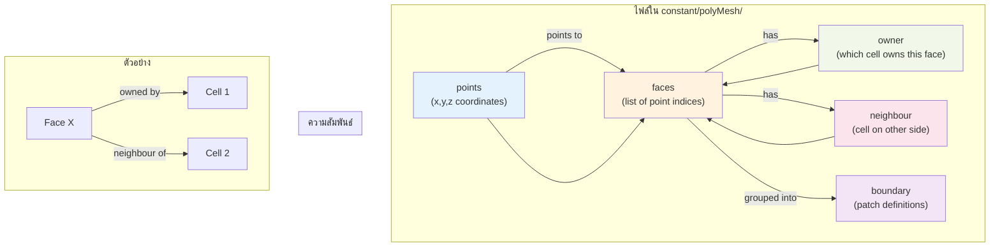

# โครงสร้างไฟล์เมชของ OpenFOAM (OpenFOAM Mesh Structure)

> [!TIP]
> **ทำไมเรื่องนี้สำคัญ?**
> การเข้าใจโครงสร้างไฟล์ Mesh ของ OpenFOAM จะช่วยให้คุณ:
> - **แก้ปัญหาเมื่อ Simulation ล้มเหลว** เช่น หา Cell ที่มีค่า non-orthogonality สูงเกินไป หรือหาว่า Mesh มีปัญหาที่บริเวณไหน
> - **เขียนโปรแกรมหรือ Script ปรับแต่ง Mesh** ได้อย่างมีประสิทธิภาพ เช่น สร้าง refinement region แบบ dynamic หรือแก้ไข mesh ด้วย Python/C++
> - **ทำความเข้าใจ Output ของ `checkMesh`** ว่ามันบอกอะไร และควรแก้ไขตรงไหนใน mesh generation process
> - **สร้าง Custom Mesh Utilities** หรือทำงานกับ `cellZones`, `faceZones` สำหรับ porous media, MRF zones, หรือ monitoring surfaces
>
> ในบทนี้คุณจะได้เรียนรู้ว่า OpenFOAM เก็บข้อมูล Mesh ในไฟล์ไหนบ้าง และแต่ละไฟล์ทำหน้าที่อะไร

ในซอฟต์แวร์ CFD ทั่วไป ไฟล์ Mesh มักจะรวมเป็นไฟล์ก้อนเดียวใหญ่ๆ (Binary monolith) แต่ OpenFOAM ใช้ปรัชญาที่ต่างออกไป คือ **"Distributed Text Files"** โดยเก็บข้อมูล Mesh ไว้ในโฟลเดอร์ `constant/polyMesh/` ซึ่งประกอบด้วยไฟล์ย่อยๆ หลายไฟล์

การเข้าใจโครงสร้างนี้สำคัญมากเมื่อคุณต้องการ:
*   Debug ปัญหา Mesh (เช่น หาว่า Cell ที่ error อยู่ตรงไหน)
*   เขียนโปรแกรม Manipulate Mesh ด้วย Python/C++
*   ทำความเข้าใจ Error ของ `checkMesh`

## 1. แนวคิด Face-Addressing Format

> [!NOTE]
> **📂 OpenFOAM Context: การเชื่อมโยงกับ Case Structure**
>
> แนวคิด Face-Addressing Format นี้เป็นพื้นฐานของการเก็บข้อมูล Mesh ใน OpenFOAM ซึ่งส่งผลกระทบต่อ:
> - **ไฟล์ Mesh ใน `constant/polyMesh/`**: ทุกไฟล์ (`points`, `faces`, `owner`, `neighbour`, `boundary`) ถูกออกแบบมาเพื่อรองรับ Face-based approach
> - **การทำงานของ Solver**: Finite Volume Method ของ OpenFOAM คำนวณ Flux ผ่าน Face แต่ละหน้า ดังนั้นโครงสร้างนี้จึงถูกออกแบบมาเพื่อให้เข้าถึงข้อมูล Face ได้รวดเร็ว
> - **Mesh Generation Tools**: ทั้ง `blockMesh` และ `snappyHexMesh` จะสร้างไฟล์เหล่านี้ให้อัตโนมัติหลังจากการรันเสร็จสิ้น
> - **Mesh Quality Checks**: คำสั่ง `checkMesh` จะตรวจสอบความถูกต้องของ connectivity ระหว่างไฟล์เหล่านี้ เช่น ตรวจว่าทุก Face มี Owner หรือไม่
>
> **Keywords**: `constant/polyMesh/points`, `constant/polyMesh/faces`, `constant/polyMesh/owner`, `constant/polyMesh/neighbour`, `constant/polyMesh/boundary`

OpenFOAM ไม่ได้เก็บ Mesh แบบ Element-based (เช่น Cell 1 ประกอบด้วย Node A, B, C, D) แต่ใช้ **Face-based** หรือ Face-Addressing ซึ่งมีประสิทธิภาพสูงกว่าในการคำนวณ Flux

โครงสร้างหลักประกอบด้วย 5 ไฟล์พื้นฐาน (Primitives):

### 1.1 `points` (จุดยอด)
เก็บพิกัด $(x, y, z)$ ของจุดยอดทั้งหมดในระบบ
*   **Format:** `vectorField` (List of vectors)
*   **Index:** บรรทัดแรกคือจุด index 0, ถัดมาคือ 1, 2, ...
*   **หน่วย:** เมตร (Meters) (หลังจากคูณ `convertToMeters` ใน blockMesh แล้ว)

```cpp
// constant/polyMesh/points
(
    (0 0 0)       // Point 0
    (1 0 0)       // Point 1
    (1 1 0)       // Point 2
    (0 1 0)       // Point 3
    ...
)
```

### 1.2 `faces` (หน้า)
นิยามหน้าโดยการระบุ **List ของ Point Indices** ที่ประกอบกันเป็นหน้านั้น
*   **กฎสำคัญ:** ลำดับจุดต้องเรียงตาม **กฎมือขวา (Right-Hand Rule)** เพื่อกำหนดทิศทางของ Normal Vector
    *   Normal vector จะพุ่งออกจากหน้า
*   **Format:** `faceList` (List of dynamic lists)

```cpp
// constant/polyMesh/faces
(
    4(0 1 2 3)    // Face 0: สี่เหลี่ยม (4 จุด)
    3(1 5 2)      // Face 1: สามเหลี่ยม (3 จุด)
    ...
)
```

### 1.3 `owner` (เจ้าของหน้า)
ระบุว่าแต่ละ Face "เป็นของ" Cell ไหน
*   **ขนาด:** เท่ากับจำนวน Faces ทั้งหมด
*   **ความหมาย:** Face $i$ เป็นหน้าของ Cell $C_{owner}$
*   **กฎ:** สำหรับ Internal Face, Normal Vector จะพุ่ง **ออกจาก** Owner Cell เสมอ
*   **Format:** `labelList` (List of integers)

### 1.4 `neighbour` (เพื่อนบ้าน)
ระบุว่า "อีกฝั่ง" ของ Face คือ Cell ไหน
*   **ขนาด:** เท่ากับจำนวน **Internal Faces** เท่านั้น (น้อยกว่า `owner` และ `faces`)
*   **หมายเหตุ:** Boundary Faces (หน้าที่อยู่ขอบ) จะ **ไม่มี** ข้อมูลในไฟล์นี้ (เพราะอีกฝั่งไม่ใช่ Cell แต่เป็นขอบเขต)
*   **Format:** `labelList`

### 1.5 `boundary` (ขอบเขต)
นิยามกลุ่มของ Boundary Faces ว่าเป็น Patch ชื่ออะไร และประเภทไหน
*   **Format:** `polyBoundaryMesh`

```cpp
// constant/polyMesh/boundary
(
    inlet           // ชื่อ Patch
    {
        type patch;     // ชนิด (Physical type)
        nFaces 50;      // จำนวนหน้าใน Patch นี้
        startFace 2000; // เริ่มต้นที่ Face index 2000 ในไฟล์ faces
    }
    ...
)
```
> [!NOTE]
> OpenFOAM เรียง Faces ในไฟล์ `faces` โดยเอา **Internal Faces ไว้ก่อน** แล้วตามด้วย Boundary Faces ของแต่ละ Patch เรียงกันไป ดังนั้น `startFace` ของ Patch แรกจะเท่ากับจำนวน Internal Faces พอดี

## 2. ความสัมพันธ์ (Connectivity)

> [!NOTE]
> **📂 OpenFOAM Context: การใช้งาน Connectivity ในการคำนวณ**
>
> ความสัมพันธ์ระหว่างไฟล์ต่างๆ เหล่านี้เป็นหัวใจของการคำนวณใน OpenFOAM:
> - **การคำนวณ Flux**: Solver ใช้ `owner` และ `neighbour` หา Cell ข้างเคียง แล้วใช้ `faces` คำนวณพื้นที่ ใช้ `points` หาทิศทาง Normal Vector
> - **การตรวจสอบคุณภาพ Mesh**: เครื่องมือ `checkMesh` ใช้ connectivity นี้คำนวณค่าต่างๆ เช่น non-orthogonality, skewness, aspect ratio
> - **Mesh Manipulation**: คำสั่งอย่าง `createBaffles`, `createPatch`, หรือ `refineMesh` ต้องอัปเดต connectivity ทั้งหมดให้สอดคล้องกัน
> - **Parallel Processing**: เมื่อแบ่ง Case ด้วย `decomposePar` OpenFOAM จะแบ่ง Cell และสร้าง processor patches โดยใช้ข้อมูล connectivity นี้
>
> **Keywords**: `checkMesh`, `decomposePar`, `createBaffles`, `refineMesh`, Mesh connectivity, Face flux calculation



> **ลิงก์ที่เกี่ยวข้อง**:
> - ทบทวนเรื่อง Mesh Components → [01_Introduction_to_Meshing.md](./01_Introduction_to_Meshing.md)
> - ดูวิธีตรวจสอบคุณภาพ Mesh → [../05_MESH_QUALITY_AND_MANIPULATION/01_Mesh_Quality_Criteria.md](../05_MESH_QUALITY_AND_MANIPULATION/01_Mesh_Quality_Criteria.md)

## 3. ประเภทของ Boundary (Patch Types)

> [!NOTE]
> **📂 OpenFOAM Context: การกำหนด Boundary ใน Case**
>
> ประเภทของ Boundary ที่กล่าวถึงในส่วนนี้คือ **Geometric Types** ที่กำหนดใน `constant/polyMesh/boundary`:
> - **การสร้าง Mesh**: เมื่อรัน `blockMesh` หรือ `snappyHexMesh` คุณต้องระบุ Patch types ใน dictionary files (เช่น `boundary` ใน `blockMeshDict` หรือ `boundary` layers ใน `snappyHexMeshDict`)
> - **ความสำคัญของ Type ที่ถูกต้อง**: การกำหนด type ผิด เช่น ใส่ `patch` แทนที่จะเป็น `wall` จะทำให้ Solver ไม่สามารถคำนวณ wall functions ได้ หรือใส่ `symmetryPlane` ผิดที่จะทำให้ผลลัพธ์ไม่ถูกต้อง
> - **การกำหนดค่าฟิสิกส์**: หลังจากกำหนด geometric type แล้ว คุณต้องไปกำหนด Boundary Conditions ในไฟล์ที่ `0/` directory (เช่น `0/U`, `0/p`, `0/T`) ซึ่งจะเป็น **Numeric Types** อีกชุดหนึ่ง
> - **Common Pitfalls**: หลายคนสับสนระหว่าง `wall` (geometric type ใน `polyMesh/boundary`) กับ `noSlip` (numeric BC ใน `0/U`) ซึ่งเป็นคนละสิ่งกัน
>
> **Keywords**: `constant/polyMesh/boundary`, `system/blockMeshDict`, `system/snappyHexMeshDict`, `0/U`, `0/p`, `wall`, `patch`, `symmetryPlane`, `cyclic`, `empty`, `wedge`

ในไฟล์ `boundary` เราต้องกำหนด `type` ให้ถูกต้อง ซึ่งแบ่งเป็น 2 กลุ่ม:

### 3.1 Base Types (Geometry/Topological Constraint)
*   `patch`: ขอบเขตทั่วไป (ทางเข้า, ทางออก, เปิดสู่บรรยากาศ)
*   `wall`: ผนัง (ของแข็ง) จำเป็นสำหรับการคำนวณ Distance to wall ($y+$)
*   `symmetry` / `symmetryPlane`: ระนาบสมมาตร (บังคับเวกเตอร์ขนานกับผิว)
*   `empty`: สำหรับ 2D Simulation (ใช้ปิดหน้าประกบหน้า-หลัง)
*   `wedge`: สำหรับ 2D Axisymmetric (ชิ้นส่วนเค้ก < 5 องศา)
*   `cyclic`: เชื่อมต่อหน้าสองฝั่งเข้าด้วยกัน (Flow ไหลออกฝั่งนี้ ไปโผล่ฝั่งนู้น)

### 3.2 Numeric Types (ในไฟล์ 0/...)
นี่คือคนละส่วนกับ `polyMesh/boundary` อันนี้คือการกำหนดค่าตัวแปร (BCs) เช่น `fixedValue`, `zeroGradient`

## 4. โซน (Zones)

> [!NOTE]
> **📂 OpenFOAM Context: การใช้งาน Zones ใน Advanced Features**
>
> Zones คือกลุ่มของ Mesh entities ที่ถูกตั้งชื่อและจัดกลุ่มไว้เพื่อการใช้งานเฉพาะทาง:
> - **การสร้าง Zones**: ใช้คำสั่ง `topoSet`, `setSet` หรือกำหนดโดยตรงใน `snappyHexMeshDict` (สำหรับ refinement zones)
> - **Porous Media**: ใช้ `cellZones` ระบุบริเวณที่เป็น porous แล้วกำหนดค่าใน `constant/porousZone` หรือ `constant/fvOptions`
> - **MRF (Multiple Reference Frame)**: ใช้ `cellZones` ระบุบริเวณที่หมุน เช่น impeller zone ใน `constant/MRFProperties`
> - **Sliding Mesh / Dynamic Mesh**: ใช้ `cellZones` และ `faceZones` กำหนดบริเวณที่เคลื่อนที่
> - **Baffles & Interior Surfaces**: ใช้ `faceZones` สร้างผนังบางๆ ภายในโดเมน หรือใช้ monitor flux ผ่านพื้นที่ตัดผ่าน
> - **Source Terms**: ใช้ `cellZones` ร่วมกับ `fvOptions` เพื่อเพิ่ม source terms เช่น ความร้อน หรือ momentum sources ในบริเวณเฉพาะ
>
> **Keywords**: `constant/polyMesh/cellZones`, `constant/polyMesh/faceZones`, `constant/polyMesh/pointZones`, `topoSetDict`, `system/snappyHexMeshDict`, `constant/MRFProperties`, `constant/fvOptions`, `constant/porousZone`

นอกจาก 5 ไฟล์หลัก ยังมีโฟลเดอร์ `constant/polyMesh/sets` และ `.../zones` (ถ้าสร้างไว้)
*   **CellZones:** กลุ่มของ Cells (ใช้กำหนด Porous media, MRF region)
*   **FaceZones:** กลุ่มของ Faces (ใช้กำหนด Baffles, Fan, หรือ Interior monitoring surface)
*   **PointZones:** กลุ่มของ Points

## 5. การอ่านข้อมูล Mesh ด้วยตนเอง (ถ้าจำเป็น)

> [!NOTE]
> **📂 OpenFOAM Context: Mesh Utilities และ Diagnostic Tools**
>
> เครื่องมือที่กล่าวถึงในส่วนนี้เป็นส่วนหนึ่งของ **Mesh Utilities** ของ OpenFOAM:
> - **`checkMesh`**: เครื่องมือสำคัญที่สุดในการตรวจสอบคุณภาพ Mesh ก่อนรัน simulation โดยจะอ่านไฟล์ทั้งหมดใน `constant/polyMesh/` แล้วตรวจสอบ connectivity, mesh quality metrics, และศักยภาพในการเกิดปัญหาขณะรัน
> - **`renumberMesh`**: เครื่องมือปรับปรุงประสิทธิภาพโดยการจัดลำดับ Cell ใหม่เพื่อลด bandwidth ของ matrix ซึ่งจะช่วยให้ linear solver ทำงานเร็วขึ้นและใช้หน่วยความจำน้อยลง
> - **`transformPoints`**: เครื่องมือปรับแต่ง geometry โดยตรงโดยไม่ต้องสร้าง mesh ใหม่ เช่น ย้าย mesh ไปยังตำแหน่งใหม่, หมุน, หรือสะท้อน ซึ่งจะแก้ไขไฟล์ `points` โดยตรง
> - **`foamToVTK`**: แปลง OpenFOAM mesh ไปเป็นรูปแบบ VTK เพื่อ visualization ใน ParaView หรือ software อื่นๆ
> - **เครื่องมืออื่นๆ**: ยังมี `mergeMeshes`, `splitMeshRegions`, `createPatch`, `refineMesh` และอื่นๆ สำหรับ manipulation เพิ่มเติม
>
> **Keywords**: `checkMesh`, `renumberMesh`, `transformPoints`, `foamToVTK`, `constant/polyMesh/`, Mesh quality metrics, Matrix bandwidth, Cell renumbering

คุณสามารถใช้คำสั่ง `foamToVTK` เพื่อแปลง Mesh ไปดูใน ParaView ได้ แต่ถ้าอยากดูสถิติ:
*   `checkMesh`: ตรวจสอบคุณภาพและ Topology
*   `renumberMesh`: จัดเรียงลำดับ Cell ใหม่เพื่อลด Bandwidth ของ Matrix (ช่วยให้รันเร็วขึ้น)
*   `transformPoints`: ย่อ/ขยาย/หมุน/ย้าย Mesh (แก้ไฟล์ `points` โดยตรง)

---

## 🧠 Concept Check: ทดสอบความเข้าใจ

### แบบฝึกหัดระดับง่าย (Easy)
1. **True/False**: ไฟล์ `neighbour` มีขนาดเท่ากับจำนวน Faces ทั้งหมด
   <details>
   <summary>คำตอบ</summary>
   ❌ เท็จ - ไฟล์ `neighbour` มีขนาดเท่ากับจำนวน **Internal Faces** เท่านั้น (Boundary Faces ไม่มี neighbour)
   </details>

2. **เลือกตอบ**: ไฟล์ไหนที่เก็บพิกัด (x, y, z) ของจุดยอดทั้งหมด?
   - a) faces
   - b) points
   - c) owner
   - d) boundary
   <details>
   <summary>คำตอบ</summary>
   ✅ b) points
   </details>

### แบบฝึกหัดระดับปานกลาง (Medium)
3. **อธิบาย**: ทำไฟล์ `owner` และ `neighbour` จึงสำคัญต่อการคำนวณ Flux ระหว่างเซลล์?
   <details>
   <summary>คำตอบ</summary>
   เพราะ Solver ต้องรู้ว่า Face นั้นเชื่อมระหว่าง Cell ไหนกับ Cell ไหน เพื่อคำนวณการไหลของค่า (Flux) จาก Owner ไปยัง Neighbour ตามทิศทางของ Normal Vector
   </details>

4. **วิเคราะห์**: ถ้าหน้าสามเหลี่ยมถูกนิยามด้วยจุด `(0 0 0), (1 0 0), (0 1 0)` Normal Vector จะชี้ไปทางไหน?
   <details>
   <summary>คำตอบ</summary>
   ใช้กฎมือขวา (Right-Hand Rule) → ชี้ไปทาง +Z (ออกจากหน้าจอ)
   </details>

### แบบฝึกหัดระดับสูง (Hard)
5. **Hands-on**: เปิดไฟล์ `constant/polyMesh/faces` และ `constant/polyMesh/owner` จาก Tutorial case ใดๆ แล้ว:
   - นับจำนวน Internal Faces และ Boundary Faces
   - ตรวจสอบว่า `startFace` ในไฟล์ `boundary` ถูกต้องหรือไม่

6. **วิเคราะห์**: เปรียบเทียบข้อดีของ Face-addressing format (ของ OpenFOAM) กับ Element-based format (ของ FEM) ในแง่ของ:
   - หน่วยความจำที่ใช้ (Memory Usage)
   - ความเร็วในการคำนวณ Flux

---


---

## 📖 เอกสารที่เกี่ยวข้อง

*   **บทก่อนหน้า**: [01_Introduction_to_Meshing.md](01_Introduction_to_Meshing.md)
*   **บทถัดไป**: [../02_BLOCKMESH_MASTERY/01_BlockMesh_Deep_Dive.md](../02_BLOCKMESH_MASTERY/01_BlockMesh_Deep_Dive.md)