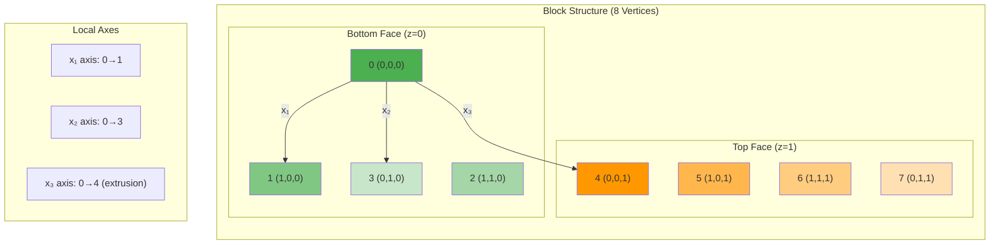

# เจาะลึก blockMesh (BlockMesh Deep Dive)

`blockMesh` คือเครื่องมือสร้าง Structured Mesh (Hexahedral) ขั้นพื้นฐานที่สุดของ OpenFOAM แม้จะดูเหมือนเครื่องมือโบราณที่ต้องกำหนดพิกัดด้วยมือ แต่ความจริงแล้วมันคือเครื่องมือที่ **"สะอาด"** และ **"ควบคุมได้ดีที่สุด"** สำหรับรูปทรงที่ไม่ซับซ้อน หรือใช้สร้าง Background Mesh สำหรับ `snappyHexMesh`

> **ลิงก์ที่เกี่ยวข้อง**:
> - ดูการใช้งานแบบ Parametric → [02_Parametric_Meshing.md](./02_Parametric_Meshing.md)
> - ดูการสร้าง Mesh อัตโนมัติ → [../03_SNAPPYHEXMESH_BASICS/01_The_sHM_Workflow.md](../03_SNAPPYHEXMESH_BASICS/01_The_sHM_Workflow.md)

## 1. โครงสร้างไฟล์ `system/blockMeshDict` แบบละเอียด

ไฟล์ `blockMeshDict` แบ่งออกเป็นส่วนๆ ดังนี้:

### 1.1 Scaling
```cpp
convertToMeters 0.001; // คูณพิกัดทั้งหมดด้วยค่านี้ (เช่น 0.001 คือเปลี่ยน mm เป็น m)
```

### 1.2 Vertices (จุดมุม)
กำหนดจุดยอดของ Block ทั้งหมด
```cpp
vertices
(
    (0 0 0)     // 0
    (1 0 0)     // 1
    ...
);
```

### 1.3 Edges (เส้นขอบ)
โดยปกติเส้นเชื่อมระหว่าง Vertex จะเป็นเส้นตรง หากต้องการเส้นโค้ง ต้องกำหนดในส่วนนี้:

*   **arc:** ส่วนโค้งวงกลม (ระบุจุดผ่าน 1 จุด)
    ```cpp
    arc <v1> <v2> (point_on_arc)
    // arc 1 5 (1.1 0.5 0)
    ```
*   **spline:** เส้นโค้ง Spline ผ่านหลายจุด (Smooth)
*   **polyLine:** เส้นหักหลายท่อนผ่านจุดต่างๆ (Sharp segments)
*   **BSpline:** เส้นโค้ง Bezier Spline
*   **line:** เส้นตรง (ค่า default ไม่ต้องระบุ ก็ได้)

### 1.4 Blocks (ก้อน Mesh)
หัวใจสำคัญคือการนิยาม Block จาก 8 จุด
```cpp
blocks
(
    hex (0 1 2 3 4 5 6 7) (nx ny nz) simpleGrading (gx gy gz)
);
```

**Vertex Ordering Visualization:**


**กฎสำคัญ:**
*   **Vertex Ordering:** ต้องตามกฎมือขวา:
    *   วิธีจำง่ายๆ:
        *   แกน $x_1$: 0 -> 1
        *   แกน $x_2$: 0 -> 3 (หรือ 1 -> 2)
        *   แกน $x_3$ (Extrude): 0 -> 4
*   **(nx ny nz):** จำนวน cell ในแต่ละทิศทาง $x_1, x_2, x_3$

### 1.5 Grading (การอัด/ขยาย Cell)
ใช้ควบคุมความหนาแน่นของ Cell (เช่น อัดแน่นที่ผนัง)

**SimpleGrading:**
รูปแบบ `simpleGrading (gx gy gz)`
ค่า $g$ คือ **Expansion Ratio** = $\frac{\text{ขนาด Cell สุดท้าย}}{\text{ขนาด Cell แรก}}$

*   $g = 1$: ขนาดเท่ากันหมด (Uniform)
*   $g > 1$: Cell ใหญ่ขึ้นเรื่อยๆ
*   $g < 1$: Cell เล็กลงเรื่อยๆ (หรือ 1/g)

**EdgeGrading (Multi-grading):**
หากต้องการกำหนด Grading แยกแต่ละเส้นขอบ (12 เส้น) ของ Block
```cpp
blocks
(
    hex (...) (...) edgeGrading (g1 g2 g3 g4 g5 g6 g7 g8 g9 g10 g11 g12)
);
```
ลำดับ Edge ตามมาตรฐาน OpenFOAM documentation

## 2. เทคนิค Multi-Block และ Topology

สำหรับการสร้างรูปทรงที่ซับซ้อนกว่ากล่องสี่เหลี่ยม (เช่น ท่อตัว Y, ท่อโค้ง, Airfoil C-grid) เราต้องใช้หลาย Block มาต่อกัน

### กฎการเชื่อมต่อ (Connectivity Rules)
1.  **Shared Vertices:** หน้าสัมผัสต้องใช้จุด Vertex เดียวกัน (หรือจุดที่พิกัดตรงกันเป๊ะ)
2.  **Matching Face Count:** จำนวนการแบ่ง Cell ($N$) บนหน้าสัมผัสต้องเท่ากัน
3.  **Matching Grading:** อัตราส่วน Grading ควรจะต่อเนื่องกันเพื่อความสวยงาม (แต่ไม่บังคับทางเทคนิค)

เมื่อทำตามกฎนี้ OpenFOAM จะ **Merge** หน้าสัมผัสให้กลายเป็น Internal Face อัตโนมัติ (เนื้อเดียวกัน)

### 2.1 mergePatchPairs
ในกรณีที่เราต้องการเชื่อม Block ที่ **Topology ไม่ตรงกัน** (เช่น เอา Block เล็กไปแปะใน Block ใหญ่) หรือขี้เกียจไล่ Vertex
เราสามารถกำหนด Boundary ของแต่ละ Block แยกกัน แล้วสั่ง `mergePatchPairs` ให้มันเชื่อมกันเอง (คล้ายๆ AMI หรือ GGI แต่ทำระดับ Mesh generation)

```cpp
mergePatchPairs
(
    (masterPatch slavePatch)
);
```
*ข้อควรระวัง:* อาจทำให้เกิด Mesh quality แย่ตรงรอยต่อได้ แนะนำให้ใช้ Shared Vertices ดีที่สุด

## 3. การสร้าง Baffles (ผนังบางภายใน)

บางครั้งเราต้องการแผ่นกั้นบางๆ (Zero-thickness wall) ภายในโดเมน เราสามารถทำได้โดยกำหนด `faces` ใน blockMeshDict

```cpp
faces
(
    wall baffleFace // กำหนดชื่อและประเภท
    (
        (0 1 5 4)   // ระบุจุดที่เป็นหน้า
    )
);
```
สิ่งนี้จะสร้าง Boundary face ขึ้นมาภายในเนื้อ Mesh เลย

## 4. Debugging blockMesh

1.  **วาดรูป!** อย่าเขียนสด ให้วาดจุด 0-7 ลงกระดาษแล้วลากเส้นเชื่อม
2.  **รัน `blockMesh` ดู log:** อ่าน Warning ว่ามี Inside-out cells หรือไม่ (เกิดจากเรียงลำดับจุดผิดกฎมือขวา)
3.  **ใช้ ParaView:** เปิดดู Mesh ถ้าเห็น Block บิดเบี้ยว หรือหายไป แสดงว่าเรียงจุดผิด หรือจำนวน Cell ไม่แมตช์กัน

> [!TIP]
> สำหรับงาน 2D ให้สร้าง Block ที่มีความหนา 1 Cell ในแกน Z เสมอ และกำหนด Boundary หน้า-หลัง เป็น type `empty`

---

## 📝 แบบฝึกหัด (Exercises)

### แบบฝึกหัดระดับง่าย (Easy)
1. **True/False**: ค่า Grading = 2 หมายถึง Cell แรกเล็กกว่า Cell สุดท้าย 2 เท่า
   <details>
   <summary>คำตอบ</summary>
   ❌ เท็จ - Grading = 2 หมายถึง Cell สุดท้าย **ใหญ่กว่า** Cell แรก 2 เท่า
   </details>

2. **เลือกตอบ**: Edge ประเภทไหนที่เหมาะสำหรับเส้นโค้งที่ผ่านหลายจุดและเรียบเนียน?
   - a) arc
   - b) spline
   - c) polyLine
   - d) line
   <details>
   <summary>คำตอบ</summary>
   ✅ b) spline - เส้นโค้ง Spline ผ่านหลายจุดแบบ Smooth
   </details>

### แบบฝึกหัดระดับปานกลาง (Medium)
3. **อธิบาย**: ทำไมการเชื่อมหลาย Block ต้องมีจำนวน Cell ที่หน้าสัมผัสเท่ากัน?
   <details>
   <summary>คำตอบ</summary>
   เพื่อให้ OpenFOAM สามารถ Merge หน้าสัมผัสเหล่านั้นให้กลายเป็น Internal Face ได้อัตโนมัติ หากจำนวนไม่เท่ากันจะเกิดปัญหา Non-conformal mesh
   </details>

4. **คำนวณ**: ถ้ากำหนด Grading = 1.5 และมี 10 Cells Cell แรกมีขนาด 0.1 m Cell สุดท้ายจะมีขนาดเท่าไหร่?
   <details>
   <summary>คำตอบ</summary>
   Cell สุดท้าย ≈ 0.1 × 1.5 = 0.15 m (แต่จริงๆ คือ 0.1 × 1.5^(9) เนื่องจากเป็น geometric progression)
   </details>

### แบบฝึกหัดระดับสูง (Hard)
5. **Hands-on**: สร้าง `blockMeshDict` สำหรับกล่อง 2D (1 หน้า厚度) ที่มี Grading อัดแน่นที่ผนังซ้ายและขวา แล้วรัน `blockMesh` และตรวจสอบด้วย ParaView

6. **วิเคราะห์**: เปรียบเทียบข้อดี-ข้อเสียระหว่างการใช้ `mergePatchPairs` กับการใช้ Shared Vertices สำหรับ Multi-block topology

---

หากรูปทรงเริ่มซับซ้อนเกินกว่าจะจัดการด้วยมือ (เช่น มี 50 blocks) ควรขยับไปใช้ **Parametric Meshing (M4/Python)** ในบทถัดไป → [02_Parametric_Meshing.md](./02_Parametric_Meshing.md)

```