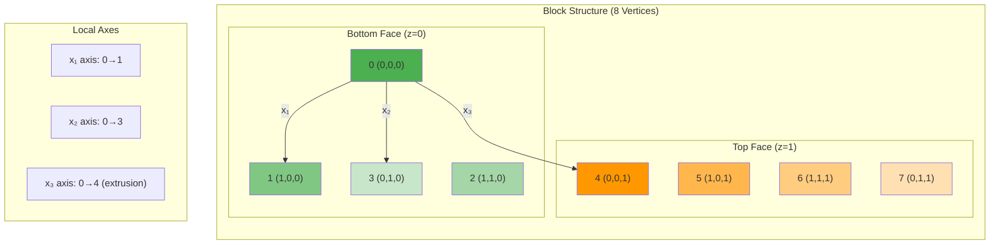

# เจาะลึก blockMesh (BlockMesh Deep Dive)

> [!TIP] ทำไม blockMesh สำคัญต่อการจำลอง?
> blockMesh เป็นเครื่องมือสร้างโครงเริ่มต้นที่ **สะอาดและมีประสิทธิภาพ** สำหรับ OpenFOAM:
> - **ความเสถียรของเกณฑ์**: Structured hexahedral mesh ที่สร้างด้วย blockMesh มีคุณภาพสูง (orthogonality ดี) ทำให้การคำนวณลู่เข้าเร็วและเสถียร
> - **ความแม่นยำ**: สามารถควบคุมความละเอียดของเซลล์ได้อย่างแม่นยำ (grading) โดยเฉพาะบริเวณผนังที่มี gradient สูง
> - **พื้นฐานสำคัญ**: เป็น Background mesh ที่จำเป็นสำหรับ `snappyHexMesh` ในการสร้าง mesh ที่ซับซ้อน
>
> **📂 ไฟล์ที่เกี่ยวข้อง**: `system/blockMeshDict` - ไฟล์ที่กำหนด topology, geometry, และการกระจายตัวของเซลล์ mesh

`blockMesh` คือเครื่องมือสร้าง Structured Mesh (Hexahedral) ขั้นพื้นฐานที่สุดของ OpenFOAM แม้จะดูเหมือนเครื่องมือโบราณที่ต้องกำหนดพิกัดด้วยมือ แต่ความจริงแล้วมันคือเครื่องมือที่ **"สะอาด"** และ **"ควบคุมได้ดีที่สุด"** สำหรับรูปทรงที่ไม่ซับซ้อน หรือใช้สร้าง Background Mesh สำหรับ `snappyHexMesh`

> **ลิงก์ที่เกี่ยวข้อง**:
> - ดูการใช้งานแบบ Parametric → [02_Parametric_Meshing.md](./02_Parametric_Meshing.md)
> - ดูการสร้าง Mesh อัตโนมัติ → [../03_SNAPPYHEXMESH_BASICS/01_The_sHM_Workflow.md](../03_SNAPPYHEXMESH_BASICS/01_The_sHM_Workflow.md)

## 1. โครงสร้างไฟล์ `system/blockMeshDict` แบบละเอียด

> [!NOTE] **📂 OpenFOAM Context**
> หัวข้อนี้คือ **โครงสร้างของไฟล์ `system/blockMeshDict`** ซึ่งเป็นไฟล์หลักที่ใช้กำหนดค่าทั้งหมดสำหรับการสร้าง mesh ด้วย `blockMesh`
>
> **🎯 ส่วนประกอบสำคัญใน blockMeshDict**:
> - `convertToMeters`: การ scaling หน่วยของ geometry
> - `vertices`: พิกัดจุดยอดทั้งหมดของ block
> - `edges`: การกำหนดเส้นโค้ง (arc, spline, polyLine, BSpline)
> - `blocks`: การนิยาม block topology และจำนวนเซลล์
> - `boundary`: การกำหนด boundary conditions ของแต่ละหน้าผ้า
>
> **🔧 คำสั่งรัน**: `blockMesh` - อ่านค่าจาก `system/blockMeshDict` และสร้าง mesh ไปยัง `constant/polyMesh`

ไฟล์ `blockMeshDict` แบ่งออกเป็นส่วนๆ ดังนี้:

### 1.1 Scaling
```cpp
convertToMeters 0.001; // คูณพิกัดทั้งหมดด้วยค่านี้ (เช่น 0.001 คือเปลี่ยน mm เป็น m)
```

### 1.2 Vertices (จุดมุม)
> [!NOTE] **📂 OpenFOAM Context**
> **Vertices** คือจุดยอด (nodes) ทั้งหมดของ block topology ใน `system/blockMeshDict`
>
> **🎯 คำสั่งที่เกี่ยวข้อง**:
> - `vertices`: ลิสต์พิกัด $(x, y, z)$ ของแต่ละจุดยอด
> - แต่ละจุดจะถูกอ้างอิงด้วย **index number** (เริ่มจาก 0) ในส่วน `blocks`
>
> **⚠️ ข้อควรระวัง**: พิกัดต้องเป็น **SI unit (เมตร)** เสมอ หรือจะใช้ `convertToMeters` ปรับหน่วย
กำหนดจุดยอดของ Block ทั้งหมด
```cpp
vertices
(
    (0 0 0)     // 0
    (1 0 0)     // 1
    ...
);
```

### 1.3 Edges (เส้นขอบ)
> [!NOTE] **📂 OpenFOAM Context**
> **Edges** ใช้กำหนดรูปร่างของเส้นเชื่อมระหว่าง vertices ใน `system/blockMeshDict`
>
> **🎯 ประเภทของ Edges**:
> - `line` (default): เส้นตรง
> - `arc`: เส้นโค้งวงกลมผ่าน 1 จุดกลาง
> - `spline`: เส้นโค้งเรียบผ่านหลายจุด
> - `polyLine`: เส้นหักหลายท่อน
> - `BSpline`: Bezier Spline curve
>
> **💡 Use case**: สำคัญมากสำหรับสร้าง mesh ของท่อโค้ง, airfoil, หรือรูปทรงโค้ง
โดยปกติเส้นเชื่อมระหว่าง Vertex จะเป็นเส้นตรง หากต้องการเส้นโค้ง ต้องกำหนดในส่วนนี้:

*   **arc:** ส่วนโค้งวงกลม (ระบุจุดผ่าน 1 จุด)
    ```cpp
    arc <v1> <v2> (point_on_arc)
    // arc 1 5 (1.1 0.5 0)
    ```
*   **spline:** เส้นโค้ง Spline ผ่านหลายจุด (Smooth)
*   **polyLine:** เส้นหักหลายท่อนผ่านจุดต่างๆ (Sharp segments)
*   **BSpline:** เส้นโค้ง Bezier Spline
*   **line:** เส้นตรง (ค่า default ไม่ต้องระบุ ก็ได้)

### 1.4 Blocks (ก้อน Mesh)
> [!NOTE] **📂 OpenFOAM Context**
> **Blocks** คือการนิยาม topology และความละเอียดของ mesh ใน `system/blockMeshDict`
>
> **🎯 ไวยากรณ์**:
> ```cpp
> hex (v0 v1 v2 v3 v4 v5 v6 v7) (nx ny nz) simpleGrading (gx gy gz)
> ```
>
> **📊 พารามิเตอร์สำคัญ**:
> - `(v0...v7)`: ลำดับ 8 vertices ตาม right-hand rule
> - `(nx ny nz)`: จำนวนเซลล์ในแต่ละทิศทาง
> - `simpleGrading`: อัตราส่วนการขยายเซลล์ (expansion ratio)
>
> **⚠️ ข้อควรระวัง**: ลำดับ vertices ผิด = mesh บิดเบี้ยน หรือ inside-out cells
หัวใจสำคัญคือการนิยาม Block จาก 8 จุด
```cpp
blocks
(
    hex (0 1 2 3 4 5 6 7) (nx ny nz) simpleGrading (gx gy gz)
);
```

**Vertex Ordering Visualization:**


**กฎสำคัญ:**
*   **Vertex Ordering:** ต้องตามกฎมือขวา:
    *   วิธีจำง่ายๆ:
        *   แกน $x_1$: 0 -> 1
        *   แกน $x_2$: 0 -> 3 (หรือ 1 -> 2)
        *   แกน $x_3$ (Extrude): 0 -> 4
*   **(nx ny nz):** จำนวน cell ในแต่ละทิศทาง $x_1, x_2, x_3$

### 1.5 Grading (การอัด/ขยาย Cell)
> [!NOTE] **📂 OpenFOAM Context**
> **Grading** ใช้ควบคุมการกระจายตัวของเซลล์ใน `system/blockMeshDict` เพื่อให้ได้ความละเอียดที่เหมาะสมในบริเวณสำคัญ
>
> **🎯 ประเภทของ Grading**:
> - `simpleGrading (gx gy gz)`: อัตราขยายเดียวต่อทิศทาง
> - `edgeGrading (g1...g12)`: กำหนดต่างหากแต่ละ edge (12 edges)
>
> **📊 Expansion Ratio**:
> - $g = 1$: เซลล์เท่ากันหมด (uniform)
> - $g > 1$: เซลล์โตขึ้นเรื่อยๆ (เหมาะอัดแน่นบริเวณ inlet/wall)
> - $g < 1$: เซลล์เล็กลงเรื่อยๆ
>
> **💡 Use case**: อัดแน่นเซลล์บริเวณชั้นขอบ (boundary layer) เพื่อจับ gradient สูง
ใช้ควบคุมความหนาแน่นของ Cell (เช่น อัดแน่นที่ผนัง)

**SimpleGrading:**
รูปแบบ `simpleGrading (gx gy gz)`
ค่า $g$ คือ **Expansion Ratio** = $\frac{\text{ขนาด Cell สุดท้าย}}{\text{ขนาด Cell แรก}}$

*   $g = 1$: ขนาดเท่ากันหมด (Uniform)
*   $g > 1$: Cell ใหญ่ขึ้นเรื่อยๆ
*   $g < 1$: Cell เล็กลงเรื่อยๆ (หรือ 1/g)

**EdgeGrading (Multi-grading):**
หากต้องการกำหนด Grading แยกแต่ละเส้นขอบ (12 เส้น) ของ Block
```cpp
blocks
(
    hex (...) (...) edgeGrading (g1 g2 g3 g4 g5 g6 g7 g8 g9 g10 g11 g12)
);
```
ลำดับ Edge ตามมาตรฐาน OpenFOAM documentation

## 2. เทคนิค Multi-Block และ Topology

> [!NOTE] **📂 OpenFOAM Context**
> **Multi-Block Topology** ใช้สร้าง mesh ที่ซับซ้อนใน `system/blockMeshDict` โดยการเชื่อมต่อหลาย blocks เข้าด้วยกัน
>
> **🎯 กฎการเชื่อมต่อ**:
> - **Shared Vertices**: ใช้ vertices เดียวกันบริเวณ interface
> - **Matching Cell Count**: จำนวนเซลล์ตรง interface ต้องเท่ากัน
> - **Matching Grading**: อัตราการขยายควรต่อเนื่องกัน
>
> **🔧 คำสั่งที่เกี่ยวข้อง**:
> - `mergePatchPairs`: เชื่อม blocks ที่ topology ไม่ตรงกัน (optional)
>
> **💡 Use case**: ท่อตัว Y, C-grid airfoil, O-grid, หรือรูปทรงที่ซับซ้อน
สำหรับการสร้างรูปทรงที่ซับซ้อนกว่ากล่องสี่เหลี่ยม (เช่น ท่อตัว Y, ท่อโค้ง, Airfoil C-grid) เราต้องใช้หลาย Block มาต่อกัน

### กฎการเชื่อมต่อ (Connectivity Rules)
1.  **Shared Vertices:** หน้าสัมผัสต้องใช้จุด Vertex เดียวกัน (หรือจุดที่พิกัดตรงกันเป๊ะ)
2.  **Matching Face Count:** จำนวนการแบ่ง Cell ($N$) บนหน้าสัมผัสต้องเท่ากัน
3.  **Matching Grading:** อัตราส่วน Grading ควรจะต่อเนื่องกันเพื่อความสวยงาม (แต่ไม่บังคับทางเทคนิค)

เมื่อทำตามกฎนี้ OpenFOAM จะ **Merge** หน้าสัมผัสให้กลายเป็น Internal Face อัตโนมัติ (เนื้อเดียวกัน)

### 2.1 mergePatchPairs
> [!NOTE] **📂 OpenFOAM Context**
> **mergePatchPairs** คือคำสั่งใน `system/blockMeshDict` สำหรับเชื่อมต่อ patches ที่ไม่ได้ใช้ vertices เดียวกัน
>
> **🎯 ไวยากรณ์**:
> ```cpp
> mergePatchPairs
> (
>     (masterPatch slavePatch)
> );
> ```
>
> **⚠️ ข้อควรระวัง**: อาจทำให้เกิด mesh quality แย่ตรง interface แนะนำให้ใช้ Shared Vertices แทน
ในกรณีที่เราต้องการเชื่อม Block ที่ **Topology ไม่ตรงกัน** (เช่น เอา Block เล็กไปแปะใน Block ใหญ่) หรือขี้เกียจไล่ Vertex
เราสามารถกำหนด Boundary ของแต่ละ Block แยกกัน แล้วสั่ง `mergePatchPairs` ให้มันเชื่อมกันเอง (คล้ายๆ AMI หรือ GGI แต่ทำระดับ Mesh generation)

```cpp
mergePatchPairs
(
    (masterPatch slavePatch)
);
```
*ข้อควรระวัง:* อาจทำให้เกิด Mesh quality แย่ตรงรอยต่อได้ แนะนำให้ใช้ Shared Vertices ดีที่สุด

## 3. การสร้าง Baffles (ผนังบางภายใน)

> [!NOTE] **📂 OpenFOAM Context**
> **Baffles** คือ internal faces ที่ทำหน้าที่เป็นผนังบาง กำหนดในส่วน `faces` ของ `system/blockMeshDict`
>
> **🎯 ไวยากรณ์**:
> ```cpp
> faces
> (
>     wall baffleFace
>     (
>         (0 1 5 4)   // ระบุ vertices ที่เป็นหน้า
>     )
> );
> ```
>
> **💡 Use case**: แผ่นกั้นภายใน (perforated plate), heat exchanger fins, หรือ internal obstacles
บางครั้งเราต้องการแผ่นกั้นบางๆ (Zero-thickness wall) ภายในโดเมน เราสามารถทำได้โดยกำหนด `faces` ใน blockMeshDict

```cpp
faces
(
    wall baffleFace // กำหนดชื่อและประเภท
    (
        (0 1 5 4)   // ระบุจุดที่เป็นหน้า
    )
);
```
สิ่งนี้จะสร้าง Boundary face ขึ้นมาภายในเนื้อ Mesh เลย

## 4. Debugging blockMesh

> [!NOTE] **📂 OpenFOAM Context**
> **Debugging** คือกระบวนการตรวจสอบความถูกต้องของ mesh ที่สร้างด้วย `blockMesh`
>
> **🔧 เครื่องมือช่วย Debug**:
> - `blockMesh > log.blockMesh`: เซฟ log ไว้ตรวจสอบ error/warning
> - `checkMesh`: ตรวจสอบคุณภาพ mesh หลังสร้างเสร็จ
> - **ParaView**: เปิดไฟล์ mesh ใน `constant/polyMesh` ตรวจสอบ topology
>
> **⚠️ ปัญหาที่พบบ่อย**:
> - **Inside-out cells**: ลำดับ vertices ผิด right-hand rule
> - **Non-matching faces**: จำนวนเซลล์ไม่เท่ากันตรง interface
> - **Degenerated blocks**: จุด vertices ซ้ำกัน
1.  **วาดรูป!** อย่าเขียนสด ให้วาดจุด 0-7 ลงกระดาษแล้วลากเส้นเชื่อม
2.  **รัน `blockMesh` ดู log:** อ่าน Warning ว่ามี Inside-out cells หรือไม่ (เกิดจากเรียงลำดับจุดผิดกฎมือขวา)
3.  **ใช้ ParaView:** เปิดดู Mesh ถ้าเห็น Block บิดเบี้ยว หรือหายไป แสดงว่าเรียงจุดผิด หรือจำนวน Cell ไม่แมตช์กัน

> [!TIP]
> สำหรับงาน 2D ให้สร้าง Block ที่มีความหนา 1 Cell ในแกน Z เสมอ และกำหนด Boundary หน้า-หลัง เป็น type `empty`

---

## 🧠 Concept Check: ทดสอบความเข้าใจ

### แบบฝึกหัดระดับง่าย (Easy)
1. **True/False**: ค่า Grading = 2 หมายถึง Cell แรกเล็กกว่า Cell สุดท้าย 2 เท่า
   <details>
   <summary>คำตอบ</summary>
   ❌ เท็จ - Grading = 2 หมายถึง Cell สุดท้าย **ใหญ่กว่า** Cell แรก 2 เท่า
   </details>

2. **เลือกตอบ**: Edge ประเภทไหนที่เหมาะสำหรับเส้นโค้งที่ผ่านหลายจุดและเรียบเนียน?
   - a) arc
   - b) spline
   - c) polyLine
   - d) line
   <details>
   <summary>คำตอบ</summary>
   ✅ b) spline - เส้นโค้ง Spline ผ่านหลายจุดแบบ Smooth
   </details>

### แบบฝึกหัดระดับปานกลาง (Medium)
3. **อธิบาย**: ทำไมการเชื่อมหลาย Block ต้องมีจำนวน Cell ที่หน้าสัมผัสเท่ากัน?
   <details>
   <summary>คำตอบ</summary>
   เพื่อให้ OpenFOAM สามารถ Merge หน้าสัมผัสเหล่านั้นให้กลายเป็น Internal Face ได้อัตโนมัติ หากจำนวนไม่เท่ากันจะเกิดปัญหา Non-conformal mesh
   </details>

4. **คำนวณ**: ถ้ากำหนด Grading = 1.5 และมี 10 Cells Cell แรกมีขนาด 0.1 m Cell สุดท้ายจะมีขนาดเท่าไหร่?
   <details>
   <summary>คำตอบ</summary>
   Cell สุดท้าย ≈ 0.1 × 1.5 = 0.15 m (แต่จริงๆ คือ 0.1 × 1.5^(9) เนื่องจากเป็น geometric progression)
   </details>

### แบบฝึกหัดระดับสูง (Hard)
5. **Hands-on**: สร้าง `blockMeshDict` สำหรับกล่อง 2D (1 หน้า厚度) ที่มี Grading อัดแน่นที่ผนังซ้ายและขวา แล้วรัน `blockMesh` และตรวจสอบด้วย ParaView

6. **วิเคราะห์**: เปรียบเทียบข้อดี-ข้อเสียระหว่างการใช้ `mergePatchPairs` กับการใช้ Shared Vertices สำหรับ Multi-block topology

---


---

## 📖 เอกสารที่เกี่ยวข้อง

*   **บทก่อนหน้า**: [../01_MESHING_FUNDAMENTALS/02_OpenFOAM_Mesh_Structure.md](../01_MESHING_FUNDAMENTALS/02_OpenFOAM_Mesh_Structure.md)
*   **บทถัดไป**: [02_Parametric_Meshing.md](02_Parametric_Meshing.md)


```