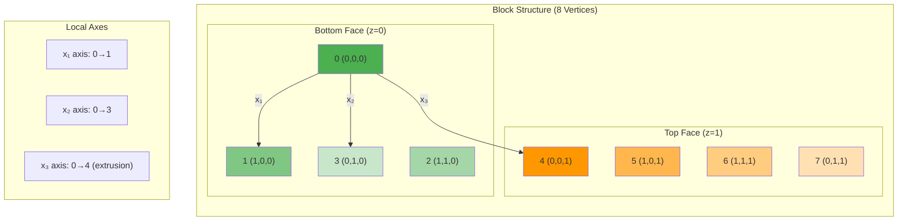

# เจาะลึก blockMesh (BlockMesh Deep Dive)

## 🎯 Learning Objectives

หลังจากอ่านบทนี้ คุณจะสามารถ:
- **อธิบาย** บทบาทและความสำคัญของ `blockMesh` ในกระบวนการสร้าง mesh ของ OpenFOAM (What & Why)
- **เขียน** ไฟล์ `blockMeshDict` ที่สมบูรณ์สำหรับรูปทรงเรขาคณิตพื้นฐานและขั้นสูง (How)
- **ประยุกต์ใช้** เทคนิค multi-block topology, grading และ edges สำหรับกรณีศึกษาที่หลากหลาย
- **ดีบัก** และแก้ไขปัญหาที่พบบ่อยในการสร้าง blockMesh
- **สร้าง** practical worked examples พร้อมรันได้จริง

---

## 📋 3W Framework: What, Why, How

### 🔍 What: blockMesh คืออะไร?

`blockMesh` คือเครื่องมือสร้าง **Structured Hexahedral Mesh** ขั้นพื้นฐานที่สุดของ OpenFOAM ซึ่ง:
- สร้าง mesh จากการนิยาม **blocks** (ก้อนพื้นที่ 6 หน้า) ที่เชื่อมต่อกัน
- ใช้ **vertices** (จุดยอด), **edges** (เส้นขอบ), และ **grading** (การกระจายเซลล์) ในการควบคุมรูปร่าง
- อ่านค่าจากไฟล์ `system/blockMeshDict` และสร้าง mesh ไปยัง `constant/polyMesh`

> [!NOTE] **📂 OpenFOAM Context**
> **blockMesh** เป็น utility ตัวแรกที่ใช้ใน meshing workflow ของ OpenFOAM
>
> **🎯 ไฟล์ที่เกี่ยวข้อง**:
> - Input: `system/blockMeshDict` - กำหนด topology, geometry, และการกระจายตัวของเซลล์
> - Output: `constant/polyMesh/points`, `faces`, `owner`, `neighbour` - ไฟล์ mesh ของ OpenFOAM
>
> **🔧 คำสั่งรัน**: `blockMesh` - อ่านค่าจาก `system/blockMeshDict` และสร้าง mesh

### 💡 Why: ทำไมต้องใช้ blockMesh?

> [!TIP] ทำไม blockMesh สำคัญต่อการจำลอง?
> blockMesh เป็นเครื่องมือสร้างโครงเริ่มต้นที่ **สะอาดและมีประสิทธิภาพ** สำหรับ OpenFOAM:
> - **ความเสถียรของเกณฑ์**: Structured hexahedral mesh ที่สร้างด้วย blockMesh มีคุณภาพสูง (orthogonality ดี) ทำให้การคำนวณลู่เข้าเร็วและเสถียร
> - **ความแม่นยำ**: สามารถควบคุมความละเอียดของเซลล์ได้อย่างแม่นยำ (grading) โดยเฉพาะบริเวณผนังที่มี gradient สูง
> - **พื้นฐานสำคัญ**: เป็น Background mesh ที่จำเป็นสำหรับ `snappyHexMesh` ในการสร้าง mesh ที่ซับซ้อน

**ข้อดีของ blockMesh:**
1. **คุณภาพ Mesh สูง**: Orthogonality และ skewness ดีเยี่ยม เหมาะสำหรับ CFD ที่ต้องการความแม่นยำ
2. **ควบคุมได้ละเอียด**: กำหนด grading ได้อย่างแม่นยำตามตำแหน่งที่ต้องการ
3. **Predictable**: ผลลัพธ์คำนวณได้ล่วงหน้า เหมาะสำหรับ parametric studies
4. **เร็ว**: สร้าง mesh ได้เร็วมากสำหรับรูปทรงง่ายๆ
5. **Foundation**: เป็นพื้นฐานสำหรับ snappyHexMesh และเทคนิคขั้นสูงอื่นๆ

**ข้อจำกัด:**
1. **รูปทรงซับซ้อน**: ไม่เหมาะกับ geometry ที่มีความโค้งมากหรือซับซ้อนมาก
2. **Manual effort**: ต้องกำหนด vertices ด้วยมือ (แต่สามารถ automate ด้วย scripting)

### 🛠️ How: ใช้ blockMesh อย่างไร?

**Workflow พื้นฐาน:**
1. **วางแผน Topology**: แบ่งโดเมนเป็น blocks และกำหนด vertices
2. **สร้าง blockMeshDict**: เขียนไฟล์ `system/blockMeshDict` พร้อม:
   - `convertToMeters`: scaling หน่วย
   - `vertices`: พิกัดจุดยอด
   - `edges`: เส้นโค้ง (ถ้าต้องการ)
   - `blocks`: นิยาม blocks และจำนวนเซลล์
   - `boundary`: กำหนด boundary conditions
3. **รัน blockMesh**: สร้าง mesh
4. **ตรวจสอบ**: ใช้ ParaView หรือ checkMesh ตรวจสอบคุณภาพ

> **ลิงก์ที่เกี่ยวข้อง**:
> - ดูการใช้งานแบบ Parametric → [02_Parametric_Meshing.md](./02_Parametric_Meshing.md)
> - ดูการสร้าง Mesh อัตโนมัติ → [../03_SNAPPYHEXMESH_BASICS/01_The_sHM_Workflow.md](../03_SNAPPYHEXMESH_BASICS/01_The_sHM_Workflow.md)
> - ดู Mesh Structure → [../01_MESHING_FUNDAMENTALS/02_OpenFOAM_Mesh_Structure.md](../01_MESHING_FUNDAMENTALS/02_OpenFOAM_Mesh_Structure.md)

---

## 📐 1. โครงสร้างไฟล์ `system/blockMeshDict` แบบละเอียด

> [!NOTE] **📂 OpenFOAM Context**
> หัวข้อนี้คือ **โครงสร้างของไฟล์ `system/blockMeshDict`** ซึ่งเป็นไฟล์หลักที่ใช้กำหนดค่าทั้งหมดสำหรับการสร้าง mesh ด้วย `blockMesh`
>
> **🎯 ส่วนประกอบสำคัญใน blockMeshDict**:
> - `convertToMeters`: การ scaling หน่วยของ geometry
> - `vertices`: พิกัดจุดยอดทั้งหมดของ block
> - `edges`: การกำหนดเส้นโค้ง (arc, spline, polyLine, BSpline)
> - `blocks`: การนิยาม block topology และจำนวนเซลล์
> - `boundary`: การกำหนด boundary conditions ของแต่ละหน้าผ้า

ไฟล์ `blockMeshDict` แบ่งออกเป็นส่วนๆ ดังนี้:

### 1.1 Scaling หน่วย (convertToMeters)

```cpp
convertToMeters 0.001; // คูณพิกัดทั้งหมดด้วยค่านี้ (เช่น 0.001 คือเปลี่ยน mm เป็น m)
```

**ตัวอย่างการใช้งาน:**
- `0.001` - แปลง mm → m (พิกัดให้ใส่เป็น mm)
- `1.0` - ไม่แปลง (พิกัดใส่เป็น m ตั้งแต่แรก)
- `0.01` - แปลง cm → m

### 1.2 Vertices (จุดมุม)

> [!NOTE] **📂 OpenFOAM Context**
> **Vertices** คือจุดยอด (nodes) ทั้งหมดของ block topology ใน `system/blockMeshDict`
>
> **🎯 คำสั่งที่เกี่ยวข้อง**:
> - `vertices`: ลิสต์พิกัด $(x, y, z)$ ของแต่ละจุดยอด
> - แต่ละจุดจะถูกอ้างอิงด้วย **index number** (เริ่มจาก 0) ในส่วน `blocks`
>
> **⚠️ ข้อควรระวัง**: พิกัดต้องเป็น **SI unit (เมตร)** เสมอ หรือจะใช้ `convertToMeters` ปรับหน่วย

กำหนดจุดยอดของ Block ทั้งหมด:

```cpp
vertices
(
    (0 0 0)     // 0 - ตำแหน่งมุมเริ่มต้น
    (1 0 0)     // 1
    (1 1 0)     // 2
    (0 1 0)     // 3
    (0 0 1)     // 4 - จุดบน (z-direction)
    (1 0 1)     // 5
    (1 1 1)     // 6
    (0 1 1)     // 7
);
```

**แนวทางปฏิบัติที่ดี:**
- ใส่ comment หมายเลข index ถัดจากแต่ละจุด เพื่อให้อ้างอิงง่ายในส่วน `blocks`
- วาด diagram ก่อนเขียน code เพื่อไม่ให้สับสน
- เริ่มจากมุมล่างซ้าย (0,0,0) และไล่ตามลำดับ

### 1.3 Edges (เส้นขอบ)

> [!NOTE] **📂 OpenFOAM Context**
> **Edges** ใช้กำหนดรูปร่างของเส้นเชื่อมระหว่าง vertices ใน `system/blockMeshDict`
>
> **🎯 ประเภทของ Edges**:
> - `line` (default): เส้นตรง
> - `arc`: เส้นโค้งวงกลมผ่าน 1 จุดกลาง
> - `spline`: เส้นโค้งเรียบผ่านหลายจุด
> - `polyLine`: เส้นหักหลายท่อน
> - `BSpline`: Bezier Spline curve
>
> **💡 Use case**: สำคัญมากสำหรับสร้าง mesh ของท่อโค้ง, airfoil, หรือรูปทรงโค้ง

โดยปกติเส้นเชื่อมระหว่าง Vertex จะเป็นเส้นตรง หากต้องการเส้นโค้ง ต้องกำหนดในส่วนนี้:

**ประเภทของ Edges:**

*   **arc:** ส่วนโค้งวงกลม (ระบุจุดผ่าน 1 จุด)
    ```cpp
    arc 1 5 (1.1 0.5 0)  // สร้างเส้นโค้งจาก vertex 1 ถึง 5 ผ่านจุด (1.1, 0.5, 0)
    ```

*   **spline:** เส้นโค้ง Spline ผ่านหลายจุด (Smooth)
    ```cpp
    spline 2 6
    (
        (1.2 0.5 0)
        (1.3 0.8 0)
        (1.2 1.1 0)
    )
    ```

*   **polyLine:** เส้นหักหลายท่อนผ่านจุดต่างๆ (Sharp segments)
    ```cpp
    polyLine 3 7
    (
        (0 1.2 0)
        (0.5 1.4 0)
        (0 1.6 0)
    )
    ```

*   **BSpline:** เส้นโค้ง Bezier Spline
    ```cpp
    BSpline 0 4
    (
        (0.1 0 0.3)
        (0.2 0 0.6)
        (0.1 0 0.9)
    )
    ```

*   **line:** เส้นตรง (ค่า default ไม่ต้องระบุ ก็ได้)

**ตัวอย่างการใช้งานจริง:**
```cpp
edges
(
    // สร้างเส้นโค้งรอบท่อ (pipe bend)
    arc 1 2 (1.0 0.5 0.0)    // โค้งด้านล่าง
    arc 5 6 (1.0 0.5 1.0)    // โค้งด้านบน
);
```

### 1.4 Blocks (ก้อน Mesh)

> [!NOTE] **📂 OpenFOAM Context**
> **Blocks** คือการนิยาม topology และความละเอียดของ mesh ใน `system/blockMeshDict`
>
> **🎯 ไวยากรณ์**:
> ```cpp
> hex (v0 v1 v2 v3 v4 v5 v6 v7) (nx ny nz) simpleGrading (gx gy gz)
> ```
>
> **📊 พารามิเตอร์สำคัญ**:
> - `(v0...v7)`: ลำดับ 8 vertices ตาม right-hand rule
> - `(nx ny nz)`: จำนวนเซลล์ในแต่ละทิศทาง
> - `simpleGrading`: อัตราส่วนการขยายเซลล์ (expansion ratio)
>
> **⚠️ ข้อควรระวัง**: ลำดับ vertices ผิด = mesh บิดเบี้ยน หรือ inside-out cells

หัวใจสำคัญคือการนิยาม Block จาก 8 จุด:

```cpp
blocks
(
    hex (0 1 2 3 4 5 6 7) (20 20 1) simpleGrading (1 1 1)
    //   └─vertices─┘  └─cells─┘   └─────grading─────┘
);
```

**Vertex Ordering Visualization:**



**กฎสำคัญของ Vertex Ordering:**
*   **ต้องตามกฎมือขวา (Right-Hand Rule)**:
    *   แกน $x_1$ (local direction 1): 0 → 1
    *   แกน $x_2$ (local direction 2): 0 → 3 (หรือ 1 → 2)
    *   แกน $x_3$ (extrusion direction): 0 → 4
*   **(nx ny nz)**: จำนวน cell ในแต่ละทิศทาง $x_1, x_2, x_3$

**วิธีจำลำดับ vertices ง่ายๆ:**
1. เริ่มที่มุมล่างซ้ายหน้า = **Vertex 0**
2. ไปทางขวา ($x_1$) = **Vertex 1**
3. ไปข้างบน ($x_2$) = **Vertex 3** (ไม่ใช่ 2!)
4. วนกลับมาทางซ้าย = **Vertex 2**
5. ยกขึ้น ($x_3$) เพื่อสร้างหน้าบน = **Vertices 4-7**

### 1.5 Grading (การอัด/ขยาย Cell)

> [!NOTE] **📂 OpenFOAM Context**
> **Grading** ใช้ควบคุมการกระจายตัวของเซลล์ใน `system/blockMeshDict` เพื่อให้ได้ความละเอียดที่เหมาะสมในบริเวณสำคัญ
>
> **🎯 ประเภทของ Grading**:
> - `simpleGrading (gx gy gz)`: อัตราขยายเดียวต่อทิศทาง
> - `edgeGrading (g1...g12)`: กำหนดต่างหากแต่ละ edge (12 edges)
>
> **📊 Expansion Ratio**:
> - $g = 1$: เซลล์เท่ากันหมด (uniform)
> - $g > 1$: เซลล์โตขึ้นเรื่อยๆ (เหมาะอัดแน่นบริเวณ inlet/wall)
> - $g < 1$: เซลล์เล็กลงเรื่อยๆ
>
> **💡 Use case**: อัดแน่นเซลล์บริเวณชั้นขอบ (boundary layer) เพื่อจับ gradient สูง

ใช้ควบคุมความหนาแน่นของ Cell (เช่น อัดแน่นที่ผนัง)

**SimpleGrading:**

รูปแบบ `simpleGrading (gx gy gz)`

ค่า $g$ คือ **Expansion Ratio** = $\frac{\text{ขนาด Cell สุดท้าย}}{\text{ขนาด Cell แรก}}$

*   $g = 1$: ขนาดเท่ากันหมด (Uniform)
*   $g > 1$: Cell ใหญ่ขึ้นเรื่อยๆ (เริ่มเล็ก โตขึ้นเรื่อยๆ)
*   $g < 1$: Cell เล็กลงเรื่อยๆ (เริ่มโต เล็กลงเรื่อยๆ)

**ตัวอย่าง:**
```cpp
// อัดแน่นที่ผนังซ้าย (x-direction)
hex (0 1 2 3 4 5 6 7) (50 20 1) simpleGrading (5 1 1)
//                                └─อัดแน่น 5 เท่าที่ผนังซ้าย

// อัดแน่นทั้งสองผนัง (symmetric)
hex (0 1 2 3 4 5 6 7) (50 20 1) simpleGrading (0.2 1 1)
//                                └─เล็กที่ผนัง ใหญ่ตรงกลาง
```

**EdgeGrading (Multi-grading):**

หากต้องการกำหนด Grading แยกแต่ละเส้นขอบ (12 เส้น) ของ Block:

```cpp
blocks
(
    hex (0 1 2 3 4 5 6 7) (20 20 1) edgeGrading 
    (
        1 2 1 2     // edges 0-3 (bottom face)
        1 2 1 2     // edges 4-7 (top face)
        1 1 1 1     // edges 8-11 (vertical edges)
    )
);
```

ลำดับ Edge ตามมาตรฐาน OpenFOAM documentation:
- Edges 0-3: bottom face (0→1, 1→2, 2→3, 3→0)
- Edges 4-7: top face (4→5, 5→6, 6→7, 7→4)
- Edges 8-11: vertical edges (0→4, 1→5, 2→6, 3→7)

### 1.6 Boundary Definition

> [!NOTE] **📂 OpenFOAM Context**
> **Boundary** คือการกำหนดประเภทของแต่ละหน้าผ้า (patch) ใน `system/blockMeshDict`
>
> **🎯 ประเภทของ Boundary**:
> - `patch`: ปกติ (สำหรับ U, p, T, etc.)
> - `wall`: ผนัง (no-slip)
> - `empty`: สำหรับ 2D cases (หน้า-หลัง)
> - `symmetryPlane`: ระนาบสมมาตร
> - `cyclic`: ระนาบ cyclic (periodic)
>
> **💡 Use case**: กำหนด boundary conditions สำหรับ solver

```cpp
boundary
(
    inlet
    {
        type patch;
        faces
        (
            (0 4 7 3)  // หน้าผนังซ้าย
        );
    }

    outlet
    {
        type patch;
        faces
        (
            (1 2 6 5)  // หน้าผนังขวา
        );
    }

    walls
    {
        type wall;
        faces
        (
            (0 1 5 4)  // หน้าล่าง
            (3 7 6 2)  // หน้าบน
        );
    }

    frontAndBack
    {
        type empty;   // สำหรับ 2D case
        faces
        (
            (0 1 2 3)  // หน้าหลัง
            (4 5 6 7)  // หน้าหน้า
        );
    }
);
```

---

## 🧩 2. เทคนิค Multi-Block และ Topology

> [!NOTE] **📂 OpenFOAM Context**
> **Multi-Block Topology** ใช้สร้าง mesh ที่ซับซ้อนใน `system/blockMeshDict` โดยการเชื่อมต่อหลาย blocks เข้าด้วยกัน
>
> **🎯 กฎการเชื่อมต่อ**:
> - **Shared Vertices**: ใช้ vertices เดียวกันบริเวณ interface
> - **Matching Cell Count**: จำนวนเซลล์ตรง interface ต้องเท่ากัน
> - **Matching Grading**: อัตราการขยายควรต่อเนื่องกัน
>
> **🔧 คำสั่งที่เกี่ยวข้อง**:
> - `mergePatchPairs`: เชื่อม blocks ที่ topology ไม่ตรงกัน (optional)
>
> **💡 Use case**: ท่อตัว Y, C-grid airfoil, O-grid, หรือรูปทรงที่ซับซ้อน

สำหรับการสร้างรูปทรงที่ซับซ้อนกว่ากล่องสี่เหลี่ยม (เช่น ท่อตัว Y, ท่อโค้ง, Airfoil C-grid) เราต้องใช้หลาย Block มาต่อกัน

### 2.1 กฎการเชื่อมต่อ (Connectivity Rules)

1.  **Shared Vertices:** หน้าสัมผัสต้องใช้จุด Vertex เดียวกัน (หรือจุดที่พิกัดตรงกันเป๊ะ)
2.  **Matching Face Count:** จำนวนการแบ่ง Cell ($N$) บนหน้าสัมผัสต้องเท่ากัน
3.  **Matching Grading:** อัตราส่วน Grading ควรจะต่อเนื่องกันเพื่อความสวยงาม (แต่ไม่บังคับทางเทคนิค)

เมื่อทำตามกฎนี้ OpenFOAM จะ **Merge** หน้าสัมผัสให้กลายเป็น Internal Face อัตโนมัติ (เนื้อเดียวกัน)

### 2.2 mergePatchPairs

> [!NOTE] **📂 OpenFOAM Context**
> **mergePatchPairs** คือคำสั่งใน `system/blockMeshDict` สำหรับเชื่อมต่อ patches ที่ไม่ได้ใช้ vertices เดียวกัน
>
> **🎯 ไวยากรณ์**:
> ```cpp
> mergePatchPairs
> (
>     (masterPatch slavePatch)
> );
> ```
>
> **⚠️ ข้อควรระวัง**: อาจทำให้เกิด mesh quality แย่ตรง interface แนะนำให้ใช้ Shared Vertices แทน

ในกรณีที่เราต้องการเชื่อม Block ที่ **Topology ไม่ตรงกัน** (เช่น เอา Block เล็กไปแปะใน Block ใหญ่) หรือขี้เกียจไล่ Vertex
เราสามารถกำหนด Boundary ของแต่ละ Block แยกกัน แล้วสั่ง `mergePatchPairs` ให้มันเชื่อมกันเอง (คล้ายๆ AMI หรือ GGI แต่ทำระดับ Mesh generation)

```cpp
mergePatchPairs
(
    (masterPatch slavePatch)
);
```

**ข้อควรระวัง:** อาจทำให้เกิด Mesh quality แย่ตรงรอยต่อได้ แนะนำให้ใช้ Shared Vertices ดีที่สุด

---

## 🚪 3. การสร้าง Baffles (ผนังบางภายใน)

> [!NOTE] **📂 OpenFOAM Context**
> **Baffles** คือ internal faces ที่ทำหน้าที่เป็นผนังบาง กำหนดในส่วน `boundary` ของ `system/blockMeshDict`
>
> **🎯 ไวยากรณ์**:
> ```cpp
> faces
> (
>     wall baffleFace
>     (
>         (0 1 5 4)   // ระบุ vertices ที่เป็นหน้า
>     )
> );
> ```
>
> **💡 Use case**: แผ่นกั้นภายใน (perforated plate), heat exchanger fins, หรือ internal obstacles

บางครั้งเราต้องการแผ่นกั้นบางๆ (Zero-thickness wall) ภายในโดเมน เราสามารถทำได้โดยกำหนด `faces` ใน blockMeshDict

```cpp
boundary
(
    baffleWall
    {
        type wall;
        faces
        (
            (8 9 13 12)  // internal baffle face
        );
    }
);
```

สิ่งนี้จะสร้าง Boundary face ขึ้นมาภายในเนื้อ Mesh เลย

**Use Cases:**
- แผ่นกั้น (perforated plate)
- Heat exchanger fins
- Internal obstacles
- Flow dividers

---

## 🐛 4. Debugging blockMesh

> [!NOTE] **📂 OpenFOAM Context**
> **Debugging** คือกระบวนการตรวจสอบความถูกต้องของ mesh ที่สร้างด้วย `blockMesh`
>
> **🔧 เครื่องมือช่วย Debug**:
> - `blockMesh > log.blockMesh`: เซฟ log ไว้ตรวจสอบ error/warning
> - `checkMesh`: ตรวจสอบคุณภาพ mesh หลังสร้างเสร็จ
> - **ParaView**: เปิดไฟล์ mesh ใน `constant/polyMesh` ตรวจสอบ topology
>
> **⚠️ ปัญหาที่พบบ่อย**:
> - **Inside-out cells**: ลำดับ vertices ผิด right-hand rule
> - **Non-matching faces**: จำนวนเซลล์ไม่เท่ากันตรง interface
> - **Degenerated blocks**: จุด vertices ซ้ำกัน

### 4.1 ขั้นตอนการ Debug

1.  **วาดรูป!** อย่าเขียนสด ให้วาดจุด 0-7 ลงกระดาษแล้วลากเส้นเชื่อม
2.  **รัน `blockMesh` ดู log:**
    ```bash
    blockMesh > log.blockMesh 2>&1
    ```
    อ่าน Warning ว่ามี Inside-out cells หรือไม่ (เกิดจากเรียงลำดับจุดผิดกฎมือขวา)
3.  **ใช้ ParaView:** เปิดดู Mesh ถ้าเห็น Block บิดเบี้ยว หรือหายไป แสดงว่าเรียงจุดผิด หรือจำนวน Cell ไม่แมตช์กัน

### 4.2 ปัญหาที่พบบ่อยและวิธีแก้

| ปัญหา | สาเหตุ | วิธีแก้ |
|--------|---------|---------|
| **Inside-out cells** | เรียง vertices ผิด right-hand rule | ตรวจสอบลำดับ vertices ใหม่ |
| **Non-matching faces** | จำนวนเซลล์ไม่เท่ากันตรง interface | ปรับจำนวนเซลล์ให้ตรงกัน |
| **Degenerated blocks** | จุด vertices ซ้ำกัน | ตรวจสอบพิกัด vertices ซ้ำ |
| **Block หายไป** | ลำดับ vertices ผิดจนมองไม่เห็น | วาด diagram และเช็คลำดับใหม่ |
| **Mesh บิดเบี้ยว** | Grading ไม่ต่อเนื่องกัน | ปรับ grading ให้ต่อเนื่อง |

> [!TIP]
> สำหรับงาน 2D ให้สร้าง Block ที่มีความหนา 1 Cell ในแกน Z เสมอ และกำหนด Boundary หน้า-หลัง เป็น type `empty`

---

## 💼 5. Practical Worked Examples

### 5.1 Example 1: กล่อง 2D ง่ายๆ (2D Box)

**สถานการณ์:** สร้าง mesh สำหรับ Lid-Driven Cavity problem

> [!NOTE] **📂 OpenFOAM Context**
> ตัวอย่างนี้สร้าง mesh 2D สำหรับ **Lid-Driven Cavity** ซึ่งเป็น benchmark problem ที่นิยมใช้ทดสอบ solver
>
> **🎯 ไฟล์ที่เกี่ยวข้อง**:
> - `system/blockMeshDict`: กำหนด topology
> - `system/controlDict`: กำหนด solver (icoFoam)
> - `0/`: กำหนด initial/boundary conditions

**ไฟล์ `system/blockMeshDict`:**
```cpp
/*--------------------------------*- C++ -*----------------------------------*\
| =========                 |                                                 |
| \\      /  F ield         | OpenFOAM: The Open Source CFD Toolbox           |
|  \\    /   O peration     | Version:  v2306                                 |
|   \\  /    A nd           | Website:  www.openfoam.com                      |
|    \\/     M anipulation  |                                                 |
\*---------------------------------------------------------------------------*/
FoamFile
{
    version     2.0;
    format      ascii;
    class       dictionary;
    object      blockMeshDict;
}
// * * * * * * * * * * * * * * * * * * * * * * * * * * * * * * * * * * * * * //

convertToMeters 0.1;  // Scale: 1 unit = 0.1 m

// กำหนดจุดยอด (0-7) สำหรับกล่อง 1x1
vertices
(
    (0 0 0)     // 0 - มุมล่างซ้าย
    (1 0 0)     // 1 - มุมล่างขวา
    (1 1 0)     // 2 - มุมบนขวา
    (0 1 0)     // 3 - มุมบนซ้าย
    (0 0 0.1)   // 4 - หน้าหน้า (z-direction)
    (1 0 0.1)   // 5
    (1 1 0.1)   // 6
    (0 1 0.1)   // 7
);

// ไม่ต้องกำหนด edges (เป็นเส้นตรงหมด)

// นิยาม block และจำนวนเซลล์
blocks
(
    hex (0 1 2 3 4 5 6 7) (20 20 1) simpleGrading (1 1 1)
    //   └─vertices─┘  └─cells──┘  └─uniform grading─┘
);

// กำหนด boundary
boundary
(
    movingWall
    {
        type wall;
        faces
        (
            (3 7 6 2)  // หน้าบน
        );
    }

    fixedWalls
    {
        type wall;
        faces
        (
            (0 4 7 3)  // หน้าซ้าย
            (0 1 5 4)  // หน้าล่าง
            (1 2 6 5)  // หน้าขวา
        );
    }

    frontAndBack
    {
        type empty;   // สำหรับ 2D case
        faces
        (
            (0 1 2 3)  // หน้าหลัง
            (4 5 6 7)  // หน้าหน้า
        );
    }
);

// ************************************************************************* //
```

**วิธีรัน:**
```bash
# สร้าง mesh
blockMesh

# ตรวจสอบ mesh
checkMesh

# เปิดใน ParaView
parafoam
```

### 5.2 Example 2: ท่อโค้ง (Curved Pipe)

**สถานการณ์:** สร้าง mesh สำหรับท่อโค้ง 90 องศา

> [!NOTE] **📂 OpenFOAM Context**
> ตัวอย่างนี้สร้าง mesh สำหรับ **Pipe Bend** ซึ่งแสดงการใช้งาน **arc edges**
>
> **🎯 เทคนิคที่ใช้**:
> - `arc` edges: สร้างเส้นโค้งวงกลม
> - `simpleGrading`: อัดแน่นเซลล์บริเวณผนัง

**ไฟล์ `system/blockMeshDict`:**
```cpp
/*--------------------------------*- C++ -*----------------------------------*\
| =========                 |                                                 |
| \\      /  F ield         | OpenFOAM: The Open Source CFD Toolbox           |
|  \\    /   O peration     | Version:  v2306                                 |
|   \\  /    A nd           | Website:  www.openfoam.com                      |
|    \\/     M anipulation  |                                                 |
\*---------------------------------------------------------------------------*/
FoamFile
{
    version     2.0;
    format      ascii;
    class       dictionary;
    object      blockMeshDict;
}
// * * * * * * * * * * * * * * * * * * * * * * * * * * * * * * * * * * * * * //

convertToMeters 0.01;  // Scale: 1 unit = 1 cm

// กำหนดจุดยอดสำหรับท่อโค้ง 90 องศา
vertices
(
    // หน้า inlet (z=0)
    (0 0 0)         // 0
    (1 0 0)         // 1
    (1 1 0)         // 2
    (0 1 0)         // 3
    
    // หน้า outlet (z=1)
    (0 0 1)         // 4
    (1 1 1)         // 5
    (2 2 1)         // 6
    (1 2 1)         // 7
);

// สร้างเส้นโค้ง
edges
(
    arc 1 2 (1.414 0 0)    // โค้งด้านล่าง (inlet)
    arc 5 6 (1.414 1.414 1)  // โค้งด้านบน (outlet)
);

// นิยาม block
blocks
(
    hex (0 1 2 3 4 5 6 7) (30 10 20) simpleGrading (1 1.5 1)
    //   └─vertices─┘  └─cells──┘   └─อัดแน่นที่ผนัง─┘
);

// กำหนด boundary
boundary
(
    inlet
    {
        type patch;
        faces
        (
            (0 1 2 3)
        );
    }

    outlet
    {
        type patch;
        faces
        (
            (4 5 6 7)
        );
    }

    walls
    {
        type wall;
        faces
        (
            (0 1 5 4)  // ผนังล่าง
            (1 2 6 5)  // ผนังนอก
            (2 3 7 6)  // ผนังบน
            (3 0 4 7)  // ผนังใน
        );
    }
);

// ************************************************************************* //
```

### 5.3 Example 3: Multi-Block (Y-Junction)

**สถานการณ์:** สร้าง mesh สำหรับท่อแยก Y-shape

> [!NOTE] **📂 OpenFOAM Context**
> ตัวอย่างนี้สร้าง mesh สำหรับ **Y-Junction** ซึ่งแสดงการใช้งาน **multi-block topology**
>
> **🎯 เทคนิคที่ใช้**:
> - **Multi-block**: ใช้ 3 blocks เชื่อมต่อกัน
> - **Shared vertices**: ใช้ vertices เดียวกันตรง interface

**ไฟล์ `system/blockMeshDict`:**
```cpp
/*--------------------------------*- C++ -*----------------------------------*\
| =========                 |                                                 |
| \\      /  F ield         | OpenFOAM: The Open Source CFD Toolbox           |
|  \\    /   O peration     | Version:  v2306                                 |
|   \\  /    A nd           | Website:  www.openfoam.com                      |
|    \\/     M anipulation  |                                                 |
\*---------------------------------------------------------------------------*/
FoamFile
{
    version     2.0;
    format      ascii;
    class       dictionary;
    object      blockMeshDict;
}
// * * * * * * * * * * * * * * * * * * * * * * * * * * * * * * * * * * * * * //

convertToMeters 0.01;

// กำหนด vertices สำหรับ Y-junction
vertices
(
    // Block 0: inlet pipe
    (0 0 0)     // 0
    (1 0 0)     // 1
    (1 1 0)     // 2
    (0 1 0)     // 3
    
    // Block 1: branch 1 (upper)
    (1 0 0)     // 4  - เชื่อมกับ Block 0
    (2 0 0)     // 5
    (2 1 0)     // 6
    (1 1 0)     // 7  - เชื่อมกับ Block 0
    
    // z-direction
    (0 0 1)     // 8
    (1 0 1)     // 9
    (1 1 1)     // 10
    (0 1 1)     // 11
    (1 0 1)     // 12 - เชื่อมกับ Block 0
    (2 0 1)     // 13
    (2 1 1)     // 14
    (1 1 1)     // 15 - เชื่อมกับ Block 0
);

// ไม่มี edges (เส้นตรงหมด)

// นิยาม blocks (3 blocks)
blocks
(
    // Block 0: inlet pipe
    hex (0 1 2 3 8 9 10 11) (20 10 10) simpleGrading (1 1 1)
    
    // Block 1: branch 1
    hex (4 5 6 7 12 13 14 15) (20 10 10) simpleGrading (1 1 1)
);

// กำหนด boundary
boundary
(
    inlet
    {
        type patch;
        faces
        (
            (0 1 2 3)
        );
    }

    outlet1
    {
        type patch;
        faces
        (
            (5 6 14 13)
        );
    }

    outlet2
    {
        type patch;
        faces
        (
            (4 5 6 7)
        );
    }

    walls
    {
        type wall;
        faces
        (
            (0 1 9 8) (8 9 10 11) (11 10 2 3)  // inlet pipe walls
            (4 5 13 12) (12 13 14 15) (15 14 6 7)  // branch walls
        );
    }

    frontAndBack
    {
        type empty;
        faces
        (
            (0 1 2 3) (8 9 10 11)
        );
    }
);

// ************************************************************************* //
```

---

## 🧠 Concept Check: ทดสอบความเข้าใจ

### แบบฝึกหัดระดับง่าย (Easy)

1. **True/False**: ค่า Grading = 2 หมายถึง Cell แรกเล็กกว่า Cell สุดท้าย 2 เท่า
   <details>
   <summary>คำตอบ</summary>
   
   ❌ **เท็จ** - Grading = 2 หมายถึง Cell สุดท้าย **ใหญ่กว่า** Cell แรก 2 เท่า
   
   **คำอธิบายเพิ่มเติม:**
   - Expansion Ratio = Cell สุดท้าย / Cell แรก
   - Grading = 2: Cell เริ่มเล็ก และโตขึ้นเรื่อยๆ (เหมาะสำหรับอัดแน่นบริเวณ inlet/wall)
   - Grading = 0.5: Cell เริ่มโต และเล็กลงเรื่อยๆ (เหมาะสำหรับอัดแน่นบริเวณ outlet)
   </details>

2. **เลือกตอบ**: Edge ประเภทไหนที่เหมาะสำหรับเส้นโค้งที่ผ่านหลายจุดและเรียบเนียน?
   - a) arc
   - b) spline
   - c) polyLine
   - d) line
   
   <details>
   <summary>คำตอบ</summary>
   
   ✅ **b) spline** - เส้นโค้ง Spline ผ่านหลายจุดแบบ Smooth
   
   **คำอธิบายเพิ่มเติม:**
   - **arc**: ผ่าน 1 จุดกลาง (วงกลม)
   - **spline**: ผ่านหลายจุดแบบ smooth (เหมาะ airfoil, ท่อโค้งซับซ้อน)
   - **polyLine**: ผ่านหลายจุดแบบหักๆ (sharp segments)
   - **line**: เส้นตรง
   </details>

### แบบฝึกหัดระดับปานกลาง (Medium)

3. **อธิบาย**: ทำไมการเชื่อมหลาย Block ต้องมีจำนวน Cell ที่หน้าสัมผัสเท่ากัน?
   
   <details>
   <summary>คำตอบ</summary>
   
   **เพื่อให้ OpenFOAM สามารถ Merge หน้าสัมผัสเหล่านั้นให้กลายเป็น Internal Face ได้อัตโนมัติ**
   
   **คำอธิบายเพิ่มเติม:**
   - หากจำนวน Cell เท่ากัน: OpenFOAM จะ merge faces ให้เป็น internal face เดียว (conformal mesh)
   - หากจำนวน Cell ไม่เท่ากัน: จะเกิดปัญหา non-conformal mesh ซึ่งต้องใช้ `mergePatchPairs` หรือ AMI
   - Matching Grading ช่วยให้ mesh quality ดีขึ้น (แต่ไม่บังคับ)
   </details>

4. **คำนวณ**: ถ้ากำหนด Grading = 1.5 และมี 10 Cells Cell แรกมีขนาด 0.1 m Cell สุดท้ายจะมีขนาดเท่าไหร่?
   
   <details>
   <summary>คำตอบ</summary>
   
   **Cell สุดท้าย ≈ 0.1 × 1.5^9 ≈ 0.1 × 38.44 ≈ 3.84 m**
   
   **คำอธิบายเพิ่มเติม:**
   - Grading = 1.5 หมายถึงแต่ละ Cell ใหญ่กว่า Cell ก่อนหน้า 1.5 เท่า
   - มี 10 Cells: Cell 1, 2, 3, ..., 10
   - Cell 1 = 0.1 m
   - Cell 2 = 0.1 × 1.5
   - Cell 3 = 0.1 × 1.5^2
   - ...
   - Cell 10 = 0.1 × 1.5^9 ≈ 3.84 m
   
   **เรื่องนี้แสดงว่า:** การใช้ grading สูงๆ อาจทำให้ cell มีขนาดต่างกันมากเกินไป ควรใช้อย่างระมัดระวัง
   </details>

### แบบฝึกหัดระดับสูง (Hard)

5. **Hands-on**: สร้าง `blockMeshDict` สำหรับกล่อง 2D (1 หน้า厚度) ที่มี Grading อัดแน่นที่ผนังซ้ายและขวา แล้วรัน `blockMesh` และตรวจสอบด้วย ParaView
   
   <details>
   <summary>คำตอบ</summary>
   
   **ไฟล์ `system/blockMeshDict`:**
   ```cpp
   /*--------------------------------*- C++ -*----------------------------------*\
   | =========                 |                                                 |
   | \\      /  F ield         | OpenFOAM: The Open Source CFD Toolbox           |
   |  \\    /   O peration     | Version:  v2306                                 |
   |   \\  /    A nd           | Website:  www.openfoam.com                      |
   |    \\/     M anipulation  |                                                 |
   \*---------------------------------------------------------------------------*/
   FoamFile
   {
       version     2.0;
       format      ascii;
       class       dictionary;
       object      blockMeshDict;
   }
   // * * * * * * * * * * * * * * * * * * * * * * * * * * * * * * * * * * * * * //
   
   convertToMeters 0.1;
   
   vertices
   (
       (0 0 0)     // 0
       (1 0 0)     // 1
       (1 1 0)     // 2
       (0 1 0)     // 3
       (0 0 0.1)   // 4
       (1 0 0.1)   // 5
       (1 1 0.1)   // 6
       (0 1 0.1)   // 7
   );
   
   blocks
   (
       hex (0 1 2 3 4 5 6 7) (50 20 1) simpleGrading (0.2 1 1)
       //                                └─อัดแน่นที่ผนังซ้ายและขวา
   );
   
   boundary
   (
       inlet
       {
           type patch;
           faces
           (
               (0 4 7 3)
           );
       }
   
       outlet
       {
           type patch;
           faces
           (
               (1 2 6 5)
           );
       }
   
       walls
       {
           type wall;
           faces
           (
               (0 1 5 4)
               (3 7 6 2)
           );
       }
   
       frontAndBack
       {
           type empty;
           faces
           (
               (0 1 2 3)
               (4 5 6 7)
           );
       }
   );
   
   // ************************************************************************* //
   ```
   
   **วิธีรัน:**
   ```bash
   # สร้าง mesh
   blockMesh
   
   # ตรวจสอบ mesh
   checkMesh
   
   # เปิดใน ParaView
   parafoam
   
   # ใน ParaView: ดูขนาดเซลล์โดย:
   # 1. เลือก "Mesh Region" ใน Pipeline Browser
   # 2. คลิก "Volume" ใน Display
   # 3. เลือก "Cell Size" ใน Coloring
   ```
   
   **ผลลัพธ์:**
   - เซลล์จะเล็กมากบริเวณผนังซ้าย (x=0)
   - เซลล์จะเล็กมากบริเวณผนังขวา (x=1)
   - เซลล์จะใหญ่ตรงกลาง (x=0.5)
   </details>

6. **วิเคราะห์**: เปรียบเทียบข้อดี-ข้อเสียระหว่างการใช้ `mergePatchPairs` กับการใช้ Shared Vertices สำหรับ Multi-block topology
   
   <details>
   <summary>คำตอบ</summary>
   
   **Shared Vertices (แนะนำ):**
   
   **ข้อดี:**
   - ✅ Mesh quality ดีกว่า (conformal mesh)
   - ✅ ไม่มีรอยต่อ (seamless interface)
   - ✅ Orthogonality ดีกว่า
   - ✅ Solver เสถียรกว่า
   - ✅ เหมาะกับ CFD ที่ต้องการความแม่นยำ
   
   **ข้อเสีย:**
   - ❌ ต้องวางแผน vertices อย่างละเอียด
   - ❌ ใช้เวลาเขียน code นานกว่า
   - ❌ ซับซ้อนถ้า topology ซับซ้อนมาก
   - ❌ ยากต่อการแก้ไขถ้ามีการเปลี่ยน topology
   
   ---
   
   **mergePatchPairs (ใช้เฉพาะกรณี):**
   
   **ข้อดี:**
   - ✅ เขียนง่ายกว่า (ไม่ต้องละเอียด vertices)
   - ✅ เหมาะกับ prototyping
   - ✅ ยืดหยุ่นกว่า (ใช้ blocks ต่าง sizes ได้)
   
   **ข้อเสีย:**
   - ❌ Mesh quality แย่กว่า (non-conformal mesh)
   - ❌ มีรอยต่อตรง interface
   - ❌ อาจทำให้ solver ไม่เสถียร
   - ❌ ไม่เหมาะกับ CFD ที่ต้องการความแม่นยำสูง
   - ❌ อาจมีปัญหา conservation ตรง interface
   
   ---
   
   **คำแนะนำ:**
   - **ใช้ Shared Vertices** เสมอถ้าเป็นไปได้ (สำหรับ production runs)
   - **ใช้ mergePatchPairs** เฉพาะในกรณี:
     - Prototyping/Testing
     - Geometry ที่ไม่สามารถใช้ shared vertices ได้
     - Cases ที่ไม่ต้องการความแม่นยำสูงมาก
   </details>

---

## 📝 Key Takeaways

### สิ่งสำคัญที่ต้องจำจากบทนี้:

1. **blockMesh คืออะไร?**
   - เครื่องมือสร้าง Structured Hexahedral Mesh ของ OpenFOAM
   - ใช้ vertices, edges, blocks และ grading ในการควบคุมรูปร่าง
   - เหมาะสำหรับรูปทรงง่ายๆ หรือเป็น background mesh สำหรับ snappyHexMesh

2. **ทำไมต้อง blockMesh?**
   - **คุณภาพสูง**: Orthogonality และ skewness ดีเยี่ยม
   - **ควบคุมได้ละเอียด**: กำหนด grading ได้อย่างแม่นยำ
   - **Predictable**: ผลลัพธ์คำนวณได้ล่วงหน้า
   - **เร็ว**: สร้าง mesh ได้เร็วสำหรับรูปทรงง่าย

3. **โครงสร้าง blockMeshDict:**
   - `convertToMeters`: scaling หน่วย
   - `vertices`: พิกัดจุดยอด (8 จุดต่อ block)
   - `edges`: เส้นโค้ง (arc, spline, polyLine, BSpline)
   - `blocks`: นิยาม topology และจำนวนเซลล์
   - `boundary`: กำหนด boundary conditions

4. **Vertex Ordering:**
   - ต้องตาม **right-hand rule** (0→1, 0→3, 0→4)
   - ลำดับผิด = mesh บิดเบี้ยน หรือ inside-out cells

5. **Grading:**
   - `simpleGrading (gx gy gz)`: อัตราขยายเดียวต่อทิศทาง
   - `edgeGrading (g1...g12)`: กำหนดต่างหากแต่ละ edge
   - g = 1: uniform, g > 1: โตขึ้น, g < 1: เล็กลง

6. **Multi-Block Topology:**
   - **Shared Vertices**: แนะนำ (mesh quality ดี)
   - **mergePatchPairs**: ใช้เฉพาะกรณี (prototyping)

7. **Debugging:**
   - วาด diagram ก่อนเขียน code
   - รัน `blockMesh > log.blockMesh` และอ่าน log
   - ใช้ ParaView ตรวจสอบ topology

8. **Practical Tips:**
   - สำหรับ 2D: สร้าง 1 cell ใน z-direction และกำหนด `empty`
   - อัดแน่นเซลล์บริเวณผนัง (boundary layer)
   - ใช้ grading อย่างระมัดระวัง (อาจทำให้ cell ขนาดต่างกันมาก)

---

## 📖 เอกสารที่เกี่ยวข้อง

*   **บทก่อนหน้า**: [../01_MESHING_FUNDAMENTALS/02_OpenFOAM_Mesh_Structure.md](../01_MESHING_FUNDAMENTALS/02_OpenFOAM_Mesh_Structure.md)
*   **บทถัดไป**: [02_Parametric_Meshing.md](02_Parametric_Meshing.md)
*   **ดูเพิ่มเติม**: [../03_SNAPPYHEXMESH_BASICS/01_The_sHM_Workflow.md](../03_SNAPPYHEXMESH_BASICS/01_The_sHM_Workflow.md)

---

## 🎯 Exercises

### Exercise 1: สร้าง Mesh สำหรับ Backward Facing Step

**สถานการณ์:** สร้าง mesh 2D สำหรับ backward facing step problem

**Requirements:**
- ขนาด: inlet height = 1, outlet height = 2, length = 10
- ใช้ 2 blocks (inlet section และ outlet section)
- อัดแน่นเซลล์บริเวณ step (x = 0)
- สร้าง boundary conditions: inlet, outlet, walls, frontAndBack

<details>
<summary>คำแนะนำ (Hint)</summary>

**Topology:**
- Block 0: inlet section (x: -5 to 0, y: 0 to 1)
- Block 1: outlet section (x: 0 to 5, y: 0 to 2)
- Shared vertices at x = 0

**Grading:**
- อัดแน่นบริเวณ step (x = 0) ด้วย grading
- ใช้ grading 2-3 เท่าทาง x-direction
</details>

<details>
<summary>คำตอบ</summary>

**ไฟล์ `system/blockMeshDict`:**
```cpp
/*--------------------------------*- C++ -*----------------------------------*\
| =========                 |                                                 |
| \\      /  F ield         | OpenFOAM: The Open Source CFD Toolbox           |
|  \\    /   O peration     | Version:  v2306                                 |
|   \\  /    A nd           | Website:  www.openfoam.com                      |
|    \\/     M anipulation  |                                                 |
\*---------------------------------------------------------------------------*/
FoamFile
{
    version     2.0;
    format      ascii;
    class       dictionary;
    object      blockMeshDict;
}
// * * * * * * * * * * * * * * * * * * * * * * * * * * * * * * * * * * * * * //

convertToMeters 0.1;

vertices
(
    // Block 0: inlet section (y: 0 to 1)
    (-5 0 0)     // 0
    (0 0 0)      // 1
    (0 1 0)      // 2
    (-5 1 0)     // 3
    
    // Block 1: outlet section (y: 0 to 2)
    (0 0 0)      // 4  - เชื่อมกับ vertex 1
    (5 0 0)      // 5
    (5 2 0)      // 6
    (0 2 0)      // 7
    
    // z-direction
    (-5 0 0.1)   // 8
    (0 0 0.1)    // 9
    (0 1 0.1)    // 10
    (-5 1 0.1)   // 11
    (0 0 0.1)    // 12 - เชื่อมกับ vertex 9
    (5 0 0.1)    // 13
    (5 2 0.1)    // 14
    (0 2 0.1)    // 15
);

blocks
(
    // Block 0: inlet
    hex (0 1 2 3 8 9 10 11) (50 10 1) simpleGrading (0.5 1 1)
    
    // Block 1: outlet
    hex (4 5 6 7 12 13 14 15) (50 20 1) simpleGrading (2 1 1)
);

boundary
(
    inlet
    {
        type patch;
        faces
        (
            (0 8 11 3)
        );
    }

    outlet
    {
        type patch;
        faces
        (
            (5 13 14 6)
        );
    }

    walls
    {
        type wall;
        faces
        (
            (0 1 9 8) (8 9 10 11) (11 10 2 3)  // inlet walls
            (4 5 13 12) (12 13 14 15) (15 14 6 7)  // outlet walls
            (1 4 12 9)  // step face
        );
    }

    frontAndBack
    {
        type empty;
        faces
        (
            (0 1 2 3) (4 5 6 7)
        );
    }
);

// ************************************************************************* //
```

**วิธีรัน:**
```bash
blockMesh
checkMesh
parafoam
```
</details>

### Exercise 2: สร้าง Mesh สำหรับ Airfoil (NACA0012)

**สถานการณ์:** สร้าง mesh 2D สำหรับ airfoil NACA0012 โดยใช้ C-grid topology

**Requirements:**
- ใช้ O-grid หรือ C-grid topology
- อัดแน่นเซลล์บริเวณผิว airfoil
- ใช้ arc edges สำหรับโค้งด้านนอก

<details>
<summary>คำแนะนำ (Hint)</summary>

**Topology:**
- ใช้ C-grid: block 1 อ้อมด้านหน้า, block 2 อ้อมด้านหลัง, block 3 รอบ airfoil
- ใช้ arc edges สำหรับ outer boundary
- Shared vertices ที่ interfaces

**Grading:**
- อัดแน่นบริเวณ airfoil surface
- ใช้ grading 5-10 เท่า
</details>

<details>
<summary>คำตอบ (Simplified)</summary>

**ไฟล์ `system/blockMeshDict` (Simplified C-grid):**
```cpp
/*--------------------------------*- C++ -*----------------------------------*\
| =========                 |                                                 |
| \\      /  F ield         | OpenFOAM: The Open Source CFD Toolbox           |
|  \\    /   O peration     | Version:  v2306                                 |
|   \\  /    A nd           | Website:  www.openfoam.com                      |
|    \\/     M anipulation  |                                                 |
\*---------------------------------------------------------------------------*/
FoamFile
{
    version     2.0;
    format      ascii;
    class       dictionary;
    object      blockMeshDict;
}
// * * * * * * * * * * * * * * * * * * * * * * * * * * * * * * * * * * * * * //

convertToMeters 1.0;

vertices
(
    // Outer boundary
    (-5 -5 0)    // 0
    (5 -5 0)     // 1
    (5 5 0)      // 2
    (-5 5 0)     // 3
    
    // Inner boundary (around airfoil)
    (-0.5 -0.1 0)  // 4
    (0.5 -0.1 0)   // 5
    (0.5 0.1 0)    // 6
    (-0.5 0.1 0)   // 7
    
    // z-direction
    (-5 -5 0.1)  // 8
    (5 -5 0.1)   // 9
    (5 5 0.1)    // 10
    (-5 5 0.1)   // 11
    (-0.5 -0.1 0.1)  // 12
    (0.5 -0.1 0.1)   // 13
    (0.5 0.1 0.1)    // 14
    (-0.5 0.1 0.1)   // 15
);

edges
(
    arc 1 2 (7.07 0 0)    // โค้งด้านนอก
    arc 9 10 (7.07 0 0.1)
);

blocks
(
    // Block 0: outer region
    hex (0 1 2 3 8 9 10 11) (100 100 1) simpleGrading (5 5 1)
    
    // Block 1: inner region (around airfoil)
    hex (4 5 6 7 12 13 14 15) (50 20 1) simpleGrading (1 5 1)
);

boundary
(
    inlet
    {
        type patch;
        faces
        (
            (0 8 11 3)
        );
    }

    outlet
    {
        type patch;
        faces
        (
            (1 9 10 2)
        );
    }

    airfoil
    {
        type wall;
        faces
        (
            (4 12 15 7)
            (12 13 14 15)
            (5 6 14 13)
            (4 5 13 12)
        );
    }

    frontAndBack
    {
        type empty;
        faces
        (
            (0 1 2 3) (8 9 10 11)
        );
    }
);

// ************************************************************************* //
```

**หมายเหตุ:** นี่เป็น simplified version สำหรับ NACA0012 จริงๆ จำเป็นต้องใช้หลาย blocks และ vertices ที่แม่นยำกว่านี้
</details>

---

**สรุป:** บทนี้ครอบคลุม blockMesh อย่างละเอียด ตั้งแต่พื้นฐานไปจนถึงเทคนิคขั้นสูง พร้อม worked examples และ exercises ที่สามารถนำไปประยุกต์ใช้ได้จริง