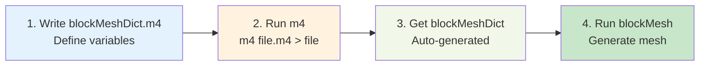
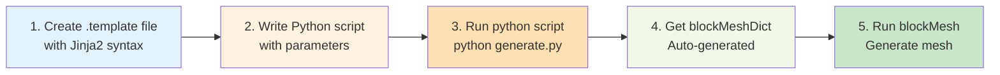
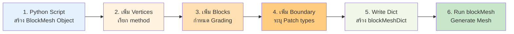

# การสร้างเมชแบบป้อนค่าตัวแปร (Parametric Meshing)

> [!TIP] ทำไมต้องสร้าง Mesh แบบ Parametric?
> การสร้าง Mesh แบบ Parametric ช่วยให้คุณ **ปรับเปลี่ยน Geometry และความละเอียดของ Mesh ได้อย่างรวดเร็ว** โดยไม่ต้องคำนวณพิกัดทุกจุดใหม่ ซึ่งมีประโยชน์อย่างมากสำหรับ:
> - **Grid Independence Study**: เปลี่ยนขนาด Mesh ทีละนิดๆ เพื่อหาค่าที่เหมาะสม
> - **Design Exploration**: ทดลองเปลี่ยนรูปร่าง Geometry เพื่อหา Design ที่ดีที่สุด
> - **Reproducibility**: เก็บ Script ไว้เพื่อให้มั่นใจว่า Mesh ถูกสร้างด้วย Logic เดิมเสมอ

จุดอ่อนสำคัญของการเขียน `blockMeshDict` ด้วยมือคือ **"การแก้ไขยาก"** หากคุณสร้างท่อเสร็จแล้ว แต่อยากเปลี่ยนรัศมีจาก 10cm เป็น 15cm คุณอาจต้องมานั่งแก้พิกัดจุด (Vertices) ใหม่เกือบทั้งหมด

**Parametric Meshing** คือทางออก โดยการเขียนสคริปต์ที่ใช้ **ตัวแปร (Variables)** แทนค่าคงที่

## 1. M4 Macro Preprocessor (The Classic Way)

> [!NOTE] **📂 OpenFOAM Context**
> หัวข้อนี้เกี่ยวข้องกับ **การสร้างไฟล์ Template** สำหรับ `system/blockMeshDict`
> - **ไฟล์ที่เกี่ยวข้อง**: `system/blockMeshDict.m4` (Template) → `system/blockMeshDict` (ไฟล์ที่รันได้)
> - **คำสั่งสำคัญ**: `m4 system/blockMeshDict.m4 > system/blockMeshDict` (Compile template → ไฟล์จริง)
> - **Keywords**: `define()`, `calc()`, `changecom()`, `changequote()` ใน M4 macro
> - **การรัน**: หลังจาก compile แล้ว รัน `blockMesh` ตามปกติ

OpenFOAM มาพร้อมกับความสามารถในการใช้ `m4` ซึ่งเป็น Macro processor เก่าแก่แต่ทรงพลังของ Unix

### M4 Workflow:


### Workflow Steps:
1.  สร้างไฟล์ `system/blockMeshDict.m4` (แทนไฟล์เดิม)
2.  ประกาศตัวแปรและสูตรคำนวณในไฟล์
3.  Compile เป็นไฟล์จริงด้วยคำสั่ง: `m4 system/blockMeshDict.m4 > system/blockMeshDict`

### Syntax พื้นฐานของ M4
*   `define(VAR, value)`: ประกาศตัวแปร
*   `calc(expression)`: คำนวณคณิตศาสตร์ (ต้องมี macro เสริม)
*   `changecom(//)changequote([,])`: ตั้งค่า comment และ quote ให้ไม่ตีกับ syntax ของ OpenFOAM

### ตัวอย่าง: ท่อทรงกระบอก (Cylinder) ปรับรัศมีได้

```m4
changecom(//)changequote([,])
define(calc, [esyscmd(perl -e 'printf ($1)')])
define(PI, 3.14159265359)

// --- Parameters ---
define(R, 1.0)      // Radius
define(L, 5.0)      // Length
define(N_R, 10)     // Cells radially
define(N_L, 50)     // Cells axially
define(N_C, 20)     // Cells circumferentially (quarter)

// --- Derived Calculations ---
define(X_POS, calc(R * cos(45 * PI / 180)))
define(Y_POS, calc(R * sin(45 * PI / 180)))

convertToMeters 1;

vertices
(
    // Center square
    (-0.5 -0.5 0)  // 0
    ( 0.5 -0.5 0)  // 1
    ( 0.5  0.5 0)  // 2
    (-0.5  0.5 0)  // 3
    
    // Outer circle points (Projection)
    (-X_POS -Y_POS 0) // 4
    ( X_POS -Y_POS 0) // 5
    ... (และจุดอื่นๆ สำหรับ Layer บน Z=L)
);

blocks
(
    // O-Grid Topology blocks
    hex (0 1 5 4 ...) ...
);
```

## 2. Python + Jinja2 (The Modern Way)

> [!NOTE] **📂 OpenFOAM Context**
> หัวข้อนี้เกี่ยวข้องกับ **การใช้ Python Script** สร้าง `blockMeshDict` แบบอัตโนมัติ
> - **ไฟล์ที่เกี่ยวข้อง**: `system/blockMeshDict.template` (Template) + `generateMesh.py` (Script สร้างไฟล์) → `system/blockMeshDict` (ไฟล์ที่รันได้)
> - **คำสั่งสำคัญ**: `python generateMesh.py` (รัน Script → สร้าง blockMeshDict)
> - **Keywords**: `jinja2.Template`, `template.render()`, ``, `{{ variable }}` ใน Jinja2 syntax
> - **การรัน**: หลังจากสร้าง blockMeshDict แล้ว รัน `blockMesh` ตามปกติ
> - **Library ที่ใช้**: `jinja2`, `numpy`, `scipy` (สำหรับคำนวณ Geometry ซับซ้อน)

ในยุคปัจจุบัน การใช้ Python ร่วมกับ Template Engine อย่าง **Jinja2** ได้รับความนิยมมากกว่า เพราะอ่านง่ายกว่า M4 และมีความยืดหยุ่นสูง (ใช้ numpy, scipy คำนวณได้เลย)

### Python/Jinja2 Workflow:


### Workflow Steps:
1.  สร้างไฟล์ Template `system/blockMeshDict.template`
2.  เขียน Python script `generateMesh.py` เพื่อ Render template
3.  รัน `python generateMesh.py`

### ตัวอย่าง: `blockMeshDict.template`
```cpp
// นี่คือไฟล์ Template
convertToMeters 1;

vertices
(

    ({{ p.x }} {{ p.y }} {{ p.z }}) // Point {{ loop.index0 }}

);

blocks
(
    hex (0 1 2 3 4 5 6 7) ({{ nx }} {{ ny }} {{ nz }}) simpleGrading (1 1 1)
);
```

### ตัวอย่าง: `generateMesh.py`
```python
from jinja2 import Template
import numpy as np

# Parameters
L = 10.0
H = 2.0
nx = 50

# Logic
points = [
    {'x': 0, 'y': 0, 'z': 0},
    {'x': L, 'y': 0, 'z': 0},
    # ... สร้าง list ของจุด
]

# Render
with open('system/blockMeshDict.template') as f:
    template = Template(f.read())

output = template.render(points=points, nx=nx, ny=10, nz=1)

with open('system/blockMeshDict', 'w') as f:
    f.write(output)
```

## 3. PyFoam

> [!NOTE] **📂 OpenFOAM Context**
> หัวข้อนี้เกี่ยวข้องกับ **การใช้ Python Library (PyFoam)** สร้าง `blockMeshDict` แบบ Object-Oriented
> - **ไฟล์ที่เกี่ยวข้อง**: Python script (.py) → `system/blockMeshDict` (ไฟล์ที่รันได้)
> - **คำสั่งสำคัญ**: `from PyFoam.RunDictionary.BlockMesh import BlockMesh` (Import module)
> - **Keywords**: `BlockMesh`, `ParsedParameterFile` ใน PyFoam API
> - **ข้อดี**: ไม่ต้องเขียน Template เอง ใช้วิธีเรียก Method ของ Object แทน (Object-Oriented approach)
> - **เหมาะสำหรับ**: โปรแกรมเมอร์ที่คุ้นเคยกับ Python และ OOP

Library **PyFoam** มี module `PyFoam.RunDictionary.BlockMesh` ที่ช่วยเขียน Dictionary โดยไม่ต้องสร้าง Template เอง แต่ใช้วิธีเรียก Method ของ Object แทน (เหมาะกับโปรแกรมเมอร์จ๋าๆ)

### 3.1 การติดตั้ง PyFoam

```bash
# การติดตั้งผ่าน pip (แนะนำ)
pip install PyFoam

# หรือผ่าน conda
conda install -c conda-forge pyfoam
```

### 3.2 โครงสร้างการใช้งานพื้นฐาน

**PyFoam Workflow:**


### 3.3 ตัวอย่าง: สร้าง Box Mesh อย่างง่าย

```python
#!/usr/bin/env python
from PyFoam.RunDictionary.BlockMesh import BlockMesh
from PyFoam.Basics.FoamFileGenerator import FoamFileGenerator
import os

# 1. กำหนดพารามิเตอร์
L = 1.0  # ความยาว (m)
H = 0.5  # ความสูง (m)
W = 0.3  # ความกว้าง (m)
nx = 20  # จำนวน cell ทิศทาง X
ny = 10  # จำนวน cell ทิศทาง Y
nz = 5   # จำนวน cell ทิศทาง Z

# 2. สร้าง BlockMesh Object
blockMesh = BlockMesh(".")

# 3. เพิ่ม Vertices (8 จุดสำหรับกล่อง)
vertices = [
    [0, 0, 0],       # 0
    [L, 0, 0],       # 1
    [L, H, 0],       # 2
    [0, H, 0],       # 3
    [0, 0, W],       # 4
    [L, 0, W],       # 5
    [L, H, W],       # 6
    [0, H, W],       # 7
]

for i, v in enumerate(vertices):
    blockMesh.addVertex(v, index=i)

# 4. เพิ่ม Block (กำหนด topology และจำนวน cell)
blockMesh.addBlock(
    vertices=[0, 1, 2, 3, 4, 5, 6, 7],  # 8 vertices ตามลำดับ
    cells=(nx, ny, nz),                   # จำนวน cell
    grading=[1, 1, 1]                     # simpleGrading (uniform)
)

# 5. เพิ่ม Boundary Patches
blockMesh.addPatch("inlet", "patch", faces=[[0, 4, 7, 3]])
blockMesh.addPatch("outlet", "patch", faces=[[1, 2, 6, 5]])
blockMesh.addPatch("walls", "wall", faces=[
    [0, 1, 5, 4],  # bottom
    [3, 7, 6, 2],  # top
    [0, 3, 2, 1],  # left
    [4, 5, 6, 7],  # right
])

# 6. เขียนไฟล์ blockMeshDict
outputDir = "system"
os.makedirs(outputDir, exist_ok=True)

blockMesh.write(os.path.join(outputDir, "blockMeshDict"))

print("✅ blockMeshDict generated successfully!")
print(f"   Location: {outputDir}/blockMeshDict")
print(f"   Mesh: {nx}×{ny}×{nz} = {nx*ny*nz} cells")
```

### 3.4 ตัวอย่างขั้นสูง: O-Grid สำหรับ Airfoil

```python
#!/usr/bin/env python
from PyFoam.RunDictionary.BlockMesh import BlockMesh
import numpy as np

def generate_ogrid_airfoil(chord=1.0, n_cells=50):
    """
    สร้าง O-Grid Mesh สำหรับ Airfoil ด้วย PyFoam
    """
    blockMesh = BlockMesh(".")

    # คำนวณจุดรอบๆ (Parameterized)
    n_angle = 16  # จำนวนจุดรอบวงกลม
    radius = chord * 0.1

    for i in range(n_angle):
        theta = 2 * np.pi * i / n_angle
        x = radius * np.cos(theta)
        y = radius * np.sin(theta)
        blockMesh.addVertex([x, y, 0], index=i)

    # เพิ่ม Blocks รอบๆ (12 blocks สำหรับ O-Grid)
    # ... (โค้ดเต็มจะยาวกว่านี้)

    return blockMesh

# ใช้งาน
mesh = generate_ogrid_airfoil(chord=1.0, n_cells=50)
mesh.write("system/blockMeshDict")
```

### 3.5 ข้อดีและข้อเสียของ PyFoam

| ประเด็น | PyFoam | Jinja2 |
|:---|:---|:---|
| **การเรียนรู้** | ยากกว่า (OOP) | ง่ายกว่า (Template) |
| **ความยืดหยุ่น** | สูงมาก (Full Python) | สูง (Python + Template) |
| **Debugging** | ง่าย (Python IDE) | ปานกลาง |
| **การดูแลรักษา** | ดี (Object-Oriented) | ดี (Template-based) |
| **การแชร์** | ยาก (ต้องรู้ Python) | ง่าย (Template อ่านง่าย) |

### 3.6 การใช้ PyFoam ร่วมกับ OpenFOAM Utilities

```python
from PyFoam.Execution.AnalyzedRunner import AnalyzedRunner
from PyFoam.RunDictionary.ParsedParameterFile import ParsedParameterFile

# อ่านและแก้ไข blockMeshDict
blockDict = ParsedParameterFile("system/blockMeshDict")

# เปลี่ยนค่าพารามิเตอร์แบบ Dynamic
blockDict["blocks"][0]["nCells"] = [100, 50, 10]  # เพิ่มความละเอียด
blockDict.writeFile()

# รัน blockMesh ผ่าน PyFoam
blockmesh = AnalyzedRunner("blockMesh")
blockmesh.start()
```

> [!TIP] **เมื่อไหนควรใช้ PyFoam?**
> - ต้องการ **Automated Mesh Generation** แบบ Advanced (เช่น Loop เปลี่ยน Geometry)
> - ต้องการ **Integration** กับ Optimization Algorithms (เช่น Genetic Algorithm, Bayesian Optimization)
> - ต้องการ **Post-processing** และ **Analysis** ผลลัพธ์แบบ Auto
>
> หากแค่เปลี่ยนค่า nx, ny, nz ง่ายๆ ให้ใช้ M4 หรือ Jinja2 จะเร็วกว่า

## ข้อดีของ Parametric Meshing

> [!NOTE] **📂 OpenFOAM Context**
> หัวข้อนี้เกี่ยวข้องกับ **ประโยชน์ที่ได้จากการใช้ Parametric Meshing** ใน OpenFOAM Workflow
> - **Grid Independence Study**: เปลี่ยนค่า `nx`, `ny`, `nz` ใน blockMeshDict → รัน `blockMesh` + Solver → เปรียบเทียบผลลัพธ์
> - **Design Exploration**: เปลี่ยน Geometry parameters (เช่น `R`, `L`) → รัน `blockMesh` + Solver → วิเคราะห์ผลลัพธ์
> - **Reproducibility**: เก็บ Script ไว้ในระบบ Version Control (Git) เพื่อให้มั่นใจว่า Mesh ถูกสร้างด้วย Logic เดิมเสมอ
> - **Automation**: สามารถเขียน Shell script รัน Loop ทดลองค่าต่างๆ ได้อัตโนมัติ

1.  **Optimization:** สามารถเขียน Loop รันเคสโดยเปลี่ยนขนาด Mesh ทีละนิดเพื่อทำ Grid Independence Study ได้อัตโนมัติ
2.  **Design Exploration:** เปลี่ยนรูปร่าง Geometry เพื่อหา Optimal Design
3.  **Reproducibility:** เก็บ Script ไว้ รู้เลยว่า Mesh นี้สร้างมาด้วย Logic อะไร

> [!RECOMMENDATION]
> เริ่มต้นด้วย **M4** สำหรับการแก้ไขง่ายๆ (เช่น เปลี่ยนขนาดกล่อง) แต่ถ้าต้องทำ Geometry ซับซ้อน แนะนำให้ข้ามไปใช้ **Python Script** เขียนไฟล์โดยตรง หรือใช้ **Jinja2** จะคุ้มค่าการเรียนรู้มากกว่า

---

## 🧠 Concept Check: ทดสอบความเข้าใจ

### แบบฝึกหัดระดับง่าย (Easy)
1. **True/False**: M4 คือภาษาโปรแกรมมิ่งสำหรับเขียน OpenFOAM
   <details>
   <summary>คำตอบ</summary>
   ❌ เท็จ - M4 เป็น Macro Preprocessor ของ Unix ใช้สำหรับประมวลผล text ไม่ใช่ภาษาโปรแกรมมิ่ง
   </details>

2. **เลือกตอบ**: วิธีไหนที่เหมาะสมที่สุดสำหรับการทำ Grid Independence Study (เปลี่ยนขนาด Mesh หลายๆ ครั้ง)?
   - a) เขียน blockMeshDict ด้วยมือทุกครั้ง
   - b) ใช้ M4 หรือ Python แบบ Parametric
   - c) ใช้ snappyHexMesh
   - d) ใช้ CAD software
   <details>
   <summary>คำตอบ</summary>
   ✅ b) ใช้ M4 หรือ Python แบบ Parametric - สามารถ Loop เปลี่ยนค่าแล้วรันอัตโนมัติ
   </details>

### แบบฝึกหัดระดับปานกลาง (Medium)
3. **อธิบาย**: ทำไม Python + Jinja2 จึงได้รับความนิยมมากกว่า M4 ในปัจจุบัน?
   <details>
   <summary>คำตอบ</summary>
   เพราะ Python อ่านง่ายกว่า, มี library ทรงพลัง (numpy, scipy), สามารถ debug ได้ง่าย, และมี community ที่ใหญ่กว่า
   </details>

4. **ออกแบบ**: สมมติต้องการสร้างท่อรูปวงกลมที่สามารถปรับรัศมี (R) และความยาว (L) ได้ จงเขียนโครงสร้าง M4 macro ที่จำเป็นต้องประกาศ
   <details>
   <summary>คำตอบ</summary>
   ```m4
   define(R, 1.0)
   define(L, 5.0)
   define(PI, 3.14159265359)
   define(X_POS, calc(R * cos(45 * PI / 180)))
   define(Y_POS, calc(R * sin(45 * PI / 180)))
   ```
   </details>

### แบบฝึกหัดระดับสูง (Hard)
5. **Hands-on**: เขียน Python + Jinja2 script สำหรับสร้าง Box mesh ที่มี parameters: L, H, W, nx, ny, nz แล้วทดลองเปลี่ยนค่าและรัน 3 ครั้ง


---

## 📖 เอกสารที่เกี่ยวข้อง

*   **บทก่อนหน้า**: [01_BlockMesh_Deep_Dive.md](01_BlockMesh_Deep_Dive.md)
*   **บทถัดไป**: [../03_SNAPPYHEXMESH_BASICS/01_The_sHM_Workflow.md](../03_SNAPPYHEXMESH_BASICS/01_The_sHM_Workflow.md)