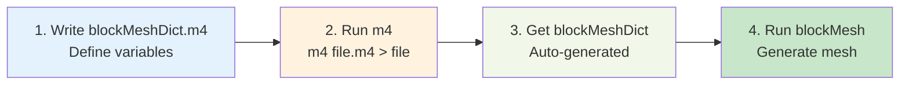
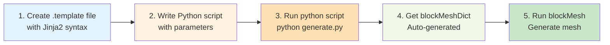
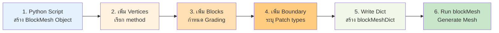

# การสร้างเมชแบบป้อนค่าตัวแปร (Parametric Meshing)

> [!TIP] ทำไมต้องสร้าง Mesh แบบ Parametric?
> การสร้าง Mesh แบบ Parametric ช่วยให้คุณ **ปรับเปลี่ยน Geometry และความละเอียดของ Mesh ได้อย่างรวดเร็ว** โดยไม่ต้องคำนวณพิกัดทุกจุดใหม่ ซึ่งมีประโยชน์อย่างมากสำหรับ:
> - **Grid Independence Study**: เปลี่ยนขนาด Mesh ทีละนิดๆ เพื่อหาค่าที่เหมาะสม
> - **Design Exploration**: ทดลองเปลี่ยนรูปร่าง Geometry เพื่อหา Design ที่ดีที่สุด
> - **Reproducibility**: เก็บ Script ไว้เพื่อให้มั่นใจว่า Mesh ถูกสร้างด้วย Logic เดิมเสมอ

จุดอ่อนสำคัญของการเขียน `blockMeshDict` ด้วยมือคือ **"การแก้ไขยาก"** หากคุณสร้างท่อเสร็จแล้ว แต่อยากเปลี่ยนรัศมีจาก 10cm เป็น 15cm คุณอาจต้องมานั่งแก้พิกัดจุด (Vertices) ใหม่เกือบทั้งหมด

**Parametric Meshing** คือทางออก โดยการเขียนสคริปต์ที่ใช้ **ตัวแปร (Variables)** แทนค่าคงที่

## 🎯 Learning Objectives

หลังจากอ่านบทนี้ คุณควรจะสามารถ:

1. **เข้าใจแนวคิด** (What) ของการสร้าง Mesh แบบ Parametric และประโยชน์ที่ได้รับ
2. **อธิบายได้** (Why) ว่าทำไมต้องใช้ Macro/Template แทนการเขียนด้วยมือ
3. **ประยุกต์ใช้** (How) ทั้ง 3 วิธี: M4, Python+Jinja2, และ PyFoam ได้อย่างถูกต้อง
4. **เลือกใช้** เครื่องมือที่เหมาะสมกับงานของคุณ
5. **สร้าง Script** สำหรับ Grid Independence Study และ Design Exploration ได้ด้วยตนเอง

---

## 1. M4 Macro Preprocessor (The Classic Way)

### 1.1 What - M4 คืออะไร?

> [!NOTE] **📂 OpenFOAM Context**
> หัวข้อนี้เกี่ยวข้องกับ **การสร้างไฟล์ Template** สำหรับ `system/blockMeshDict`
> - **ไฟล์ที่เกี่ยวข้อง**: `system/blockMeshDict.m4` (Template) → `system/blockMeshDict` (ไฟล์ที่รันได้)
> - **คำสั่งสำคัญ**: `m4 system/blockMeshDict.m4 > system/blockMeshDict` (Compile template → ไฟล์จริง)
> - **Keywords**: `define()`, `calc()`, `changecom()`, `changequote()` ใน M4 macro
> - **การรัน**: หลังจาก compile แล้ว รัน `blockMesh` ตามปกติ

**M4** เป็น Macro Preprocessor แบบ Unix ดั้งเดิมที่มีมาตั้งแต่ยุค 1970s ใช้สำหรับประมวลผล Text แบบ Text Substitution โดยอ้างอิงจาก Macro ที่ประกาศไว้

OpenFOAM มาพร้อมกับความสามารถในการใช้ `m4` ซึ่งเป็นเครื่องมือที่เก่าแก่แต่ทรงพลังของ Unix

### 1.2 Why - ทำไมต้องใช้ M4?

**ข้อดี:**
- ✅ **ไม่ต้องติดตั้งเพิ่ม** - มาพร้อมกับระบบ Unix/Linux ทุกตัว
- ✅ **เร็วมาก** - Compile ได้ทันทีในเสี้ยววินาที
- ✅ **เข้ากันได้ดี** - ทำงานร่วมกับ OpenFOAM workflow ได้โดยตรง
- ✅ **เรียนรู้ง่าย** - Syntax สั้นๆ ไม่ซับซ้อน

**ข้อเสีย:**
- ❌ **Debug ยาก** - Error message ไม่ชัดเจน
- ❌ **คณิตศาสตร์จำกัด** - ต้องใช้ `esyscmd()` เรียก perl/python ช่วย
- ❌ **อ่านยาก** - Macro syntax ดูยุ่งเหยิงเมื่อโค้ดยาวๆ

### 1.3 How - M4 Workflow ทำงานอย่างไร?



#### Workflow Steps:
1. **สร้างไฟล์ Template** `system/blockMeshDict.m4` (แทนไฟล์เดิม)
2. **ประกาศตัวแปรและสูตรคำนวณ** ในไฟล์
3. **Compile เป็นไฟล์จริง** ด้วยคำสั่ง: `m4 system/blockMeshDict.m4 > system/blockMeshDict`
4. **รัน blockMesh** ตามปกติ

#### Syntax พื้นฐานของ M4:

| คำสั่ง | การใช้งาน | ตัวอย่าง |
|:---|:---|:---|
| `define(VAR, value)` | ประกาศตัวแปร | `define(L, 10.0)` |
| `calc(expression)` | คำนวณคณิตศาสตร์ | `calc(L/2)` |
| `changecom(//)` | เปลี่ยน comment symbol | `changecom(//)` |
| `changequote([,])` | เปลี่ยน quote symbol | `changequote([,])` |
| `esyscmd(cmd)` | รันคำสั่ง shell | `esyscmd(perl -e '...')` |

### 1.4 ตัวอย่างที่ 1: ท่อทรงกระบอก (Cylinder) ปรับรัศมีได้

#### ไฟล์ `system/blockMeshDict.m4`:

```m4
changecom(//)changequote([,])
define(calc, [esyscmd(perl -e 'printf ($1)')])
define(PI, 3.14159265359)

// --- Parameters ---
define(R, 1.0)      // Radius (m)
define(L, 5.0)      // Length (m)
define(N_R, 10)     // Cells radially
define(N_L, 50)     // Cells axially
define(N_C, 20)     // Cells circumferentially (quarter circle)

// --- Derived Calculations ---
define(X_POS, calc(R * cos(45 * PI / 180)))
define(Y_POS, calc(R * sin(45 * PI / 180)))

// --- Center square size ---
define(CS, 0.3)     // Center square half-size

convertToMeters 1;

vertices
(
    // Center square (z=0)
    (-CS -CS 0)  // 0
    ( CS -CS 0)  // 1
    ( CS  CS 0)  // 2
    (-CS  CS 0)  // 3
    
    // Outer circle points at 45° (z=0)
    (-X_POS -Y_POS 0) // 4
    ( X_POS -Y_POS 0) // 5
    ( X_POS  Y_POS 0) // 6
    (-X_POS  Y_POS 0) // 7
    
    // Center square (z=L)
    (-CS -CS L)  // 8
    ( CS -CS L)  // 9
    ( CS  CS L)  // 10
    (-CS  CS L)  // 11
    
    // Outer circle points at 45° (z=L)
    (-X_POS -Y_POS L) // 12
    ( X_POS -Y_POS L) // 13
    ( X_POS  Y_POS L) // 14
    (-X_POS  Y_POS L) // 15
);

blocks
(
    // 4 blocks around center (O-Grid topology)
    hex (0 1 5 4 8 9 13 12) (N_R N_C N_L) simpleGrading (1 1 1)
    hex (1 2 6 5 9 10 14 13) (N_R N_C N_L) simpleGrading (1 1 1)
    hex (2 3 7 6 10 11 15 14) (N_R N_C N_L) simpleGrading (1 1 1)
    hex (3 0 4 7 11 8 12 15) (N_R N_C N_L) simpleGrading (1 1 1)
);

edges
(
);

boundary
(
    inlet
    {
        type patch;
        faces
        (
            (0 4 7 3)
            (3 7 6 2)
            (2 6 5 1)
            (1 5 4 0)
        );
    }
    
    outlet
    {
        type patch;
        faces
        (
            (8 12 15 11)
            (11 15 14 10)
            (10 14 13 9)
            (9 13 12 8)
        );
    }
    
    walls
    {
        type wall;
        faces
        (
            (0 1 9 8)
            (1 5 13 9)
            (5 6 14 13)
            (6 2 10 14)
            (2 3 11 10)
            (3 7 15 11)
            (7 4 12 15)
            (4 0 8 12)
        );
    }
);

mergePatchPairs
(
);
```

#### การใช้งาน:

```bash
# 1. Compile M4 template → blockMeshDict
m4 system/blockMeshDict.m4 > system/blockMeshDict

# 2. ตรวจสอบไฟล์ที่สร้าง
cat system/blockMeshDict

# 3. รัน blockMesh
blockMesh

# 4. ตรวจสอบ Mesh
checkMesh
```

### 1.5 ตัวอย่างที่ 2: กล่อง (Box) ปรับขนาดได้

#### ไฟล์ `system/blockMeshDict.m4`:

```m4
changecom(//)changequote([,])
define(calc, [esyscmd(perl -e 'printf ($1)')])

// --- Parameters ---
define(L, 10.0)     // Length (m)
define(H, 2.0)      // Height (m)
define(W, 1.0)      // Width (m)
define(NX, 50)      // Cells in X
define(NY, 20)      // Cells in Y
define(NZ, 10)      // Cells in Z

convertToMeters 1;

vertices
(
    (0 0 0)         // 0
    (L 0 0)         // 1
    (L H 0)         // 2
    (0 H 0)         // 3
    (0 0 W)         // 4
    (L 0 W)         // 5
    (L H W)         // 6
    (0 H W)         // 7
);

blocks
(
    hex (0 1 2 3 4 5 6 7) (NX NY NZ) simpleGrading (1 1 1)
);

boundary
(
    inlet
    {
        type patch;
        faces ((0 4 7 3));
    }
    
    outlet
    {
        type patch;
        faces ((1 2 6 5));
    }
    
    walls
    {
        type wall;
        faces
        (
            (0 1 5 4)
            (3 7 6 2)
            (0 3 2 1)
            (4 5 6 7)
        );
    }
);

mergePatchPairs
(
);
```

### 1.6 Script สำหรับ Grid Independence Study

#### ไฟล์ `runGridStudy.sh`:

```bash
#!/bin/bash
# Grid Independence Study ด้วย M4
# เปลี่ยนขนาด Mesh 4 ระดับ: Coarse → Medium → Fine → Very Fine

CASE_BASE="gridStudy"
RESOLUTIONS=(20 40 80 160)  # nx values

for i in "${!RESOLUTIONS[@]}"; do
    NX=${RESOLUTIONS[$i]}
    NY=$((NX / 2))
    NZ=$((NX / 5))
    
    CASE_DIR="${CASE_BASE}_${NX}x${NY}x${NZ}"
    
    echo "========================================"
    echo "Creating case: $CASE_DIR"
    echo "Mesh resolution: ${NX}x${NY}x${NZ}"
    echo "========================================"
    
    # Copy base case
    cp -r base_case $CASE_DIR
    
    # Modify blockMeshDict.m4 ด้วย sed
    cd $CASE_DIR
    sed -i "s/define(NX,.*)/define(NX, $NX)/" system/blockMeshDict.m4
    sed -i "s/define(NY,.*)/define(NY, $NY)/" system/blockMeshDict.m4
    sed -i "s/define(NZ,.*)/define(NZ, $NZ)/" system/blockMeshDict.m4
    
    # Compile and run blockMesh
    m4 system/blockMeshDict.m4 > system/blockMeshDict
    blockMesh > log.blockMesh 2>&1
    
    echo "✅ Mesh created for $CASE_DIR"
    cd ..
done

echo "========================================"
echo "All cases created successfully!"
echo "Run simulations with:"
echo "  for dir in ${CASE_BASE}_*; do cd \$dir && simpleFoam && cd ..; done"
echo "========================================"
```

---

## 2. Python + Jinja2 (The Modern Way)

### 2.1 What - Python + Jinja2 คืออะไร?

> [!NOTE] **📂 OpenFOAM Context**
> หัวข้อนี้เกี่ยวข้องกับ **การใช้ Python Script** สร้าง `blockMeshDict` แบบอัตโนมัติ
> - **ไฟล์ที่เกี่ยวข้อง**: `system/blockMeshDict.template` (Template) + `generateMesh.py` (Script สร้างไฟล์) → `system/blockMeshDict` (ไฟล์ที่รันได้)
> - **คำสั่งสำคัญ**: `python generateMesh.py` (รัน Script → สร้าง blockMeshDict)
> - **Keywords**: `jinja2.Template`, `template.render()`, ``, `{{ variable }}` ใน Jinja2 syntax
> - **การรัน**: หลังจากสร้าง blockMeshDict แล้ว รัน `blockMesh` ตามปกติ
> - **Library ที่ใช้**: `jinja2`, `numpy`, `scipy` (สำหรับคำนวณ Geometry ซับซ้อน)

**Python + Jinja2** คือแนวทางสมัยใหม่ที่ใช้:
- **Python**: ภาษาโปรแกรมมิ่งที่ทรงพลังและอ่านง่าย
- **Jinja2**: Template Engine ยอดนิยมสำหรับการสร้างไฟล์ Text แบบ Dynamic

ในยุคปัจจุบัน การใช้ Python ร่วมกับ Template Engine อย่าง **Jinja2** ได้รับความนิยมมากกว่า เพราะอ่านง่ายกว่า M4 และมีความยืดหยุ่นสูง (ใช้ numpy, scipy คำนวณได้เลย)

### 2.2 Why - ทำถึงได้รับความนิยม?

**ข้อดี:**
- ✅ **อ่านง่ายมาก** - Python syntax ชัดเจน
- ✅ **คณิตศาสตร์เต็มรูปแบบ** - ใช้ numpy, scipy ได้เลย
- ✅ **Debug ง่าย** - ใช้ Python IDE ได้
- ✅ **Community ใหญ่** - มีตัวอย่างและคำแนะนำเยอะ
- ✅ **ยืดหยุ่นสูง** - ทำได้ทุกอย่างที่ Python ทำได้

**ข้อเสีย:**
- ❌ **ต้องติดตั้ง** - ต้องลง Python และ Library เพิ่ม
- ❌ **แก้ไข 2 ไฟล์** - Template + Script
- ❌ **Overkill** สำหรับงานง่ายๆ

### 2.3 How - Python/Jinja2 Workflow



#### Workflow Steps:
1. **สร้างไฟล์ Template** `system/blockMeshDict.template` พร้อม Jinja2 syntax
2. **เขียน Python script** `generateMesh.py` เพื่อ Render template
3. **รัน `python generateMesh.py`** เพื่อสร้าง blockMeshDict
4. **รัน `blockMesh`** ตามปกติ

#### Jinja2 Syntax พื้นฐาน:

| Syntax | การใช้งาน | ตัวอย่าง |
|:---|:---|:---|
| `{{ var }}` | แสดงค่าตัวแปร | `{{ L }}` → `10.0` |
| `` | Loop ผ่าน list | `` |
| `` | Condition | `` |
| `{# comment #}` | Comment | `{# This is comment #}` |
| `` | ไม่ render | `}` |

### 2.4 ตัวอย่างที่ 1: Box Mesh พื้นฐาน

#### ไฟล์ `system/blockMeshDict.template`:

```cpp
// Auto-generated by Jinja2 - DO NOT EDIT MANUALLY
convertToMeters 1;

vertices
(

    ({{ p.x }} {{ p.y }} {{ p.z }}) // {{ p.label }}

);

blocks
(
    hex (0 1 2 3 4 5 6 7) ({{ nx }} {{ ny }} {{ nz }}) simpleGrading (1 1 1)
);

edges
(
);

boundary
(
    inlet
    {
        type patch;
        faces ((0 4 7 3));
    }
    
    outlet
    {
        type patch;
        faces ((1 2 6 5));
    }
    
    walls
    {
        type wall;
        faces
        (
            (0 1 5 4)
            (3 7 6 2)
            (0 3 2 1)
            (4 5 6 7)
        );
    }
);

mergePatchPairs
(
);
```

#### ไฟล์ `generateBoxMesh.py`:

```python
#!/usr/bin/env python3
"""
Generate parametric box mesh using Python + Jinja2
Author: Your Name
Date: 2024
"""

from jinja2 import Template
import numpy as np
import json
import os

# ========================================
# PARAMETERS - แก้ไขตรงนี้เพื่อเปลี่ยน Mesh
# ========================================
params = {
    'L': 10.0,      # Length (m)
    'H': 2.0,       # Height (m)
    'W': 1.0,       # Width (m)
    'nx': 50,       # Cells in X
    'ny': 20,       # Cells in Y
    'nz': 10,       # Cells in Z
}

# ========================================
# VERTEX GENERATION
# ========================================
def generate_box_vertices(L, H, W):
    """Generate 8 vertices for a box"""
    return [
        {'x': 0, 'y': 0, 'z': 0, 'label': 'origin'},
        {'x': L, 'y': 0, 'z': 0, 'label': 'x-axis'},
        {'x': L, 'y': H, 'z': 0, 'label': 'xy-plane'},
        {'x': 0, 'y': H, 'z': 0, 'label': 'y-axis'},
        {'x': 0, 'y': 0, 'z': W, 'label': 'z-axis'},
        {'x': L, 'y': 0, 'z': W, 'label': 'xz-plane'},
        {'x': L, 'y': H, 'z': W, 'label': 'far-corner'},
        {'x': 0, 'y': H, 'z': W, 'label': 'yz-plane'},
    ]

# ========================================
# TEMPLATE RENDERING
# ========================================
def render_template(params):
    """Render Jinja2 template with parameters"""
    
    # Generate vertices
    points = generate_box_vertices(params['L'], params['H'], params['W'])
    
    # Read template
    template_path = 'system/blockMeshDict.template'
    with open(template_path, 'r') as f:
        template = Template(f.read())
    
    # Render
    output = template.render(
        points=points,
        nx=params['nx'],
        ny=params['ny'],
        nz=params['nz'],
        L=params['L'],
        H=params['H'],
        W=params['W']
    )
    
    return output

# ========================================
# MAIN EXECUTION
# ========================================
if __name__ == '__main__':
    print("=" * 50)
    print("Parametric Box Mesh Generator")
    print("=" * 50)
    print(f"Dimensions: {params['L']} x {params['H']} x {params['W']} m")
    print(f"Cells: {params['nx']} x {params['ny']} x {params['nz']}")
    print(f"Total cells: {params['nx'] * params['ny'] * params['nz']:,}")
    print()
    
    # Create system directory
    os.makedirs('system', exist_ok=True)
    
    # Render template
    output = render_template(params)
    
    # Write blockMeshDict
    output_path = 'system/blockMeshDict'
    with open(output_path, 'w') as f:
        f.write(output)
    
    print(f"✅ Generated: {output_path}")
    print()
    print("Next steps:")
    print("  1. Check: cat system/blockMeshDict")
    print("  2. Run: blockMesh")
    print("  3. Verify: checkMesh")
    print("=" * 50)
```

#### การใช้งาน:

```bash
# 1. ทำให้ script รันได้
chmod +x generateBoxMesh.py

# 2. รัน script
python3 generateBoxMesh.py

# 3. ตรวจสอบไฟล์ที่สร้าง
cat system/blockMeshDict

# 4. รัน blockMesh
blockMesh
```

### 2.5 ตัวอย่างที่ 2: Cylinder Mesh ด้วย O-Grid

#### ไฟล์ `system/blockMeshDict.template`:

```cpp
// Auto-generated by Jinja2 - O-Grid Cylinder
convertToMeters 1;

vertices
(

    ({{ p.x }} {{ p.y }} {{ p.z }}) // {{ p.label }}

);

blocks
(

    hex ({{ block.vertices|join(' ') }}) ({{ block.nx }} {{ block.ny }} {{ block.nz }}) simpleGrading (1 1 1)
 

);

edges
(

    arc {{ edge.start }} {{ edge.end }} ({{ edge.mid.x }} {{ edge.mid.y }} {{ edge.mid.z }})

);

boundary
(
    inlet
    {
        type patch;
        faces
        (

            ({{ face|join(' ') }})

        );
    }
    
    outlet
    {
        type patch;
        faces
        (

            ({{ face|join(' ') }})

        );
    }
    
    wall
    {
        type wall;
        faces
        (

            ({{ face|join(' ') }})

        );
    }
);

mergePatchPairs
(
);
```

#### ไฟล์ `generateCylinderMesh.py`:

```python
#!/usr/bin/env python3
"""
Generate parametric O-Grid cylinder mesh using Python + Jinja2
"""

from jinja2 import Template
import numpy as np
import os

# ========================================
# PARAMETERS
# ========================================
params = {
    'R': 1.0,           # Radius (m)
    'L': 5.0,           # Length (m)
    'center_size': 0.3, # Center square size
    'n_radial': 10,     # Cells radial
    'n_circum': 16,     # Cells circumferential (per quadrant)
    'n_axial': 50,      # Cells axial
}

# ========================================
# GEOMETRY GENERATION
# ========================================
def generate_ogrid_cylinder(params):
    """Generate vertices, blocks, and faces for O-Grid cylinder"""
    
    R = params['R']
    L = params['L']
    cs = params['center_size']
    
    points = []
    blocks = []
    arcs = []
    
    # --- Z=0 plane ---
    # Center square (4 points)
    labels_center = ['sw', 'se', 'ne', 'nw']
    for i, (x, y) in enumerate([(-cs, -cs), (cs, -cs), (cs, cs), (-cs, cs)]):
        points.append({'x': x, 'y': y, 'z': 0, 'label': f'center_{labels_center[i]}_0'})
    
    # Outer circle (4 points at 45°)
    angles_45 = [45, 135, 225, 315]
    for i, angle in enumerate(angles_45):
        rad = np.deg2rad(angle)
        x = R * np.cos(rad)
        y = R * np.sin(rad)
        points.append({'x': x, 'y': y, 'z': 0, 'label': f'outer_{i}_0'})
    
    # --- Z=L plane ---
    # Center square
    for i, (x, y) in enumerate([(-cs, -cs), (cs, -cs), (cs, cs), (-cs, cs)]):
        points.append({'x': x, 'y': y, 'z': L, 'label': f'center_{labels_center[i]}_L'})
    
    # Outer circle
    for i, angle in enumerate(angles_45):
        rad = np.deg2rad(angle)
        x = R * np.cos(rad)
        y = R * np.sin(rad)
        points.append({'x': x, 'y': y, 'z': L, 'label': f'outer_{i}_L'})
    
    # --- Arc edges (Z=0) ---
    for i in range(4):
        start = 4 + i
        end = 4 + (i + 1) % 4
        mid_angle = np.deg2rad((angles_45[i] + angles_45[(i + 1) % 4]) / 2)
        arcs.append({
            'start': start,
            'end': end,
            'mid': {
                'x': R * np.cos(mid_angle),
                'y': R * np.sin(mid_angle),
                'z': 0
            }
        })
    
    # --- Arc edges (Z=L) ---
    for i in range(4):
        start = 12 + i
        end = 12 + (i + 1) % 4
        mid_angle = np.deg2rad((angles_45[i] + angles_45[(i + 1) % 4]) / 2)
        arcs.append({
            'start': start,
            'end': end,
            'mid': {
                'x': R * np.cos(mid_angle),
                'y': R * np.sin(mid_angle),
                'z': L
            }
        })
    
    # --- Blocks (4 blocks around center) ---
    n_radial = params['n_radial']
    n_circum = params['n_circum']
    n_axial = params['n_axial']
    
    for i in range(4):
        c0 = i           # center vertex
        c1 = (i + 1) % 4
        o1 = 4 + (i + 1) % 4
        o0 = 4 + i
        
        c0_L = 8 + i
        c1_L = 8 + (i + 1) % 4
        o1_L = 12 + (i + 1) % 4
        o0_L = 12 + i
        
        blocks.append({
            'vertices': [c0, c1, o1, o0, c0_L, c1_L, o1_L, o0_L],
            'nx': n_radial,
            'ny': n_circum,
            'nz': n_axial
        })
    
    # --- Boundary faces ---
    inlet_faces = [[0, 1, 2, 3]]
    outlet_faces = [[8, 9, 10, 11]]
    
    wall_faces = [
        [4, 5, 6, 7],   # Z=0 arc
        [12, 13, 14, 15],  # Z=L arc
    ]
    
    return points, blocks, arcs, inlet_faces, outlet_faces, wall_faces

# ========================================
# RENDER
# ========================================
def render_template(params):
    """Render Jinja2 template"""
    
    points, blocks, arcs, inlet_faces, outlet_faces, wall_faces = \
        generate_ogrid_cylinder(params)
    
    template_path = 'system/blockMeshDict.template'
    with open(template_path, 'r') as f:
        template = Template(f.read())
    
    output = template.render(
        points=points,
        blocks=blocks,
        arcs=arcs,
        inlet_faces=inlet_faces,
        outlet_faces=outlet_faces,
        wall_faces=wall_faces
    )
    
    return output

# ========================================
# MAIN
# ========================================
if __name__ == '__main__':
    print("=" * 50)
    print("O-Grid Cylinder Mesh Generator")
    print("=" * 50)
    print(f"Radius: {params['R']} m")
    print(f"Length: {params['L']} m")
    print(f"Cells: {params['n_radial']} x {params['n_circum']*4} x {params['n_axial']}")
    print()
    
    os.makedirs('system', exist_ok=True)
    
    output = render_template(params)
    
    with open('system/blockMeshDict', 'w') as f:
        f.write(output)
    
    print("✅ Generated: system/blockMeshDict")
    print()
    print("Next: blockMesh")
    print("=" * 50)
```

### 2.6 Script สำหรับ Grid Independence Study

#### ไฟล์ `runGridStudy.py`:

```python
#!/usr/bin/env python3
"""
Automated Grid Independence Study with Python + Jinja2
"""

import subprocess
import os
import shutil
import json

# ========================================
# CONFIGURATION
# ========================================
BASE_CASE = "base_case"
CASE_PREFIX = "gridStudy"
RESOLUTIONS = [
    {'nx': 20, 'name': 'coarse'},
    {'nx': 40, 'name': 'medium'},
    {'nx': 80, 'name': 'fine'},
    {'nx': 160, 'name': 'very_fine'},
]

# ========================================
# FUNCTIONS
# ========================================
def run_command(cmd, cwd=None):
    """Run shell command and return output"""
    print(f"  Running: {cmd}")
    result = subprocess.run(
        cmd, shell=True, cwd=cwd, capture_output=True, text=True
    )
    return result.returncode == 0

def create_case(nx, ny, nz, case_name):
    """Create and setup a new case"""
    
    print(f"\n{'='*50}")
    print(f"Creating case: {case_name}")
    print(f"Resolution: {nx} x {ny} x {nz}")
    print(f"{'='*50}")
    
    # Copy base case
    if os.path.exists(case_name):
        shutil.rmtree(case_name)
    shutil.copytree(BASE_CASE, case_name)
    
    # Modify parameters in generate script
    params = {'L': 10.0, 'H': 2.0, 'W': 1.0, 'nx': nx, 'ny': ny, 'nz': nz}
    
    with open(f'{case_name}/params.json', 'w') as f:
        json.dump(params, f, indent=2)
    
    # Generate mesh
    os.chdir(case_name)
    
    # Update generateMesh.py with new params
    success = run_command("python3 generateMesh.py")
    
    if success:
        success = run_command("blockMesh")
        
        if success:
            print(f"✅ Case {case_name} created successfully!")
        else:
            print(f"❌ blockMesh failed for {case_name}")
    else:
        print(f"❌ Mesh generation failed for {case_name}")
    
    os.chdir("..")
    return success

def run_simulation(case_name):
    """Run OpenFOAM solver"""
    print(f"\nRunning simulation for {case_name}...")
    os.chdir(case_name)
    success = run_command("simpleFoam")
    os.chdir("..")
    return success

# ========================================
# MAIN
# ========================================
if __name__ == '__main__':
    print("=" * 50)
    print("Grid Independence Study")
    print("=" * 50)
    
    results = []
    
    for res in RESOLUTIONS:
        nx = res['nx']
        ny = nx // 2
        nz = nx // 5
        case_name = f"{CASE_PREFIX}_{res['name']}"
        
        # Create case
        success = create_case(nx, ny, nz, case_name)
        results.append({'case': case_name, 'success': success})
    
    # Summary
    print("\n" + "=" * 50)
    print("SUMMARY")
    print("=" * 50)
    for r in results:
        status = "✅" if r['success'] else "❌"
        print(f"{status} {r['case']}")
    print("=" * 50)
    
    print("\nNext steps:")
    print("  1. Run simulations:")
    print("     for dir in gridStudy_*; do cd $dir && simpleFoam && cd ..; done")
    print("  2. Compare results with:")
    print("     python3 compareResults.py")
```

---

## 3. PyFoam (The Object-Oriented Way)

### 3.1 What - PyFoam คืออะไร?

> [!NOTE] **📂 OpenFOAM Context**
> หัวข้อนี้เกี่ยวข้องกับ **การใช้ Python Library (PyFoam)** สร้าง `blockMeshDict` แบบ Object-Oriented
> - **ไฟล์ที่เกี่ยวข้อง**: Python script (.py) → `system/blockMeshDict` (ไฟล์ที่รันได้)
> - **คำสั่งสำคัญ**: `from PyFoam.RunDictionary.BlockMesh import BlockMesh` (Import module)
> - **Keywords**: `BlockMesh`, `ParsedParameterFile` ใน PyFoam API
> - **ข้อดี**: ไม่ต้องเขียน Template เอง ใช้วิธีเรียก Method ของ Object แทน (Object-Oriented approach)
> - **เหมาะสำหรับ**: โปรแกรมเมอร์ที่คุ้นเคยกับ Python และ OOP

**PyFoam** คือ Python Library ที่พัฒนาขึ้นเพื่อทำงานร่วมกับ OpenFOAM โดยเฉพาะ มี module มากมาย เช่น:
- `BlockMesh`: สร้าง blockMeshDict แบบ OOP
- `ParsedParameterFile`: อ่าน/เขียน OpenFOAM dictionary files
- `AnalyzedRunner`: รัน OpenFOAM solvers ผ่าน Python

Library **PyFoam** มี module `PyFoam.RunDictionary.BlockMesh` ที่ช่วยเขียน Dictionary โดยไม่ต้องสร้าง Template เอง แต่ใช้วิธีเรียก Method ของ Object แทน (เหมาะกับโปรแกรมเมอร์จ๋าๆ)

### 3.2 Why - เมื่อไหรควรใช้ PyFoam?

**เหมาะสำหรับ:**
- ✅ โปรแกรมเมอร์ Python ที่คุ้นเคยกับ OOP
- ✅ งานที่ต้อง Integration กับ Python ecosystem
- ✅ งานที่ต้องการ Automated workflow ซับซ้อน
- ✅ งานที่ต้อง Post-processing และ Analysis แบบ Auto

**ไม่เหมาะสำหรับ:**
- ❌ ผู้เริ่มต้นที่ไม่คุ้นเคยกับ Python
- ❌ งานง่ายๆ ที่ M4 ทำได้เร็วกว่า
- ❌ ผู้ที่ต้องการ Template ที่อ่านง่าย

### 3.3 How - PyFoam Workflow



### 3.4 การติดตั้ง PyFoam

```bash
# การติดตั้งผ่าน pip (แนะนำ)
pip install PyFoam

# หรือผ่าน conda
conda install -c conda-forge pyfoam

# ตรวจสอบการติดตั้ง
python3 -c "from PyFoam.RunDictionary.BlockMesh import BlockMesh; print('PyFoam installed!')"
```

### 3.5 ตัวอย่างที่ 1: Box Mesh อย่างง่าย

#### ไฟล์ `generateBoxMesh_PyFoam.py`:

```python
#!/usr/bin/env python3
"""
Generate Box Mesh using PyFoam
"""

from PyFoam.RunDictionary.BlockMesh import BlockMesh
from PyFoam.Basics.FoamFileGenerator import FoamFileGenerator
import os

# ========================================
# PARAMETERS
# ========================================
L = 1.0  # ความยาว (m)
H = 0.5  # ความสูง (m)
W = 0.3  # ความกว้าง (m)
nx = 20  # จำนวน cell ทิศทาง X
ny = 10  # จำนวน cell ทิศทาง Y
nz = 5   # จำนวน cell ทิศทาง Z

# ========================================
# CREATE BLOCKMESH
# ========================================
print("=" * 50)
print("PyFoam Box Mesh Generator")
print("=" * 50)
print(f"Dimensions: {L} x {H} x {W} m")
print(f"Cells: {nx} x {ny} x {nz}")
print()

# 1. สร้าง BlockMesh Object
blockMesh = BlockMesh(".")

# 2. เพิ่ม Vertices (8 จุดสำหรับกล่อง)
vertices = [
    [0, 0, 0],       # 0: origin
    [L, 0, 0],       # 1: +x
    [L, H, 0],       # 2: +xy
    [0, H, 0],       # 3: +y
    [0, 0, W],       # 4: +z
    [L, 0, W],       # 5: +xz
    [L, H, W],       # 6: +xyz
    [0, H, W],       # 7: +yz
]

print("Adding vertices...")
for i, v in enumerate(vertices):
    blockMesh.addVertex(v, index=i)
    print(f"  Vertex {i}: {v}")

# 3. เพิ่ม Block (กำหนด topology และจำนวน cell)
print("\nAdding block...")
blockMesh.addBlock(
    vertices=[0, 1, 2, 3, 4, 5, 6, 7],  # 8 vertices ตามลำดับ
    cells=(nx, ny, nz),                   # จำนวน cell
    grading=[1, 1, 1]                     # simpleGrading (uniform)
)
print(f"  Block with {nx}x{ny}x{nz} cells")

# 4. เพิ่ม Boundary Patches
print("\nAdding boundary patches...")
blockMesh.addPatch("inlet", "patch", faces=[[0, 4, 7, 3]])
blockMesh.addPatch("outlet", "patch", faces=[[1, 2, 6, 5]])
blockMesh.addPatch("walls", "wall", faces=[
    [0, 1, 5, 4],  # bottom
    [3, 7, 6, 2],  # top
    [0, 3, 2, 1],  # left
    [4, 5, 6, 7],  # right
])
print("  inlet (patch)")
print("  outlet (patch)")
print("  walls (wall)")

# 5. เขียนไฟล์ blockMeshDict
outputDir = "system"
os.makedirs(outputDir, exist_ok=True)

outputPath = os.path.join(outputDir, "blockMeshDict")
blockMesh.write(outputPath)

print()
print("=" * 50)
print("✅ blockMeshDict generated successfully!")
print(f"   Location: {outputPath}")
print(f"   Total cells: {nx*ny*nz:,}")
print("=" * 50)
print("\nNext steps:")
print("  1. Check: cat system/blockMeshDict")
print("  2. Run: blockMesh")
```

### 3.6 ตัวอย่างที่ 2: ใช้ ParsedParameterFile แก้ไขไฟล์

#### ไฟล์ `modifyMeshParams.py`:

```python
#!/usr/bin/env python3
"""
Modify existing blockMeshDict parameters using PyFoam
"""

from PyFoam.RunDictionary.ParsedParameterFile import ParsedParameterFile
import sys

# ========================================
# MODIFY PARAMETERS
# ========================================
def modify_blockmesh(filepath, nx, ny, nz):
    """Modify cell counts in blockMeshDict"""
    
    print(f"Reading: {filepath}")
    blockDict = ParsedParameterFile(filepath)
    
    # Check if blocks exist
    if "blocks" in blockDict.content:
        blocks = blockDict.content["blocks"]
        
        # Modify first block
        if isinstance(blocks, list) and len(blocks) > 0:
            blocks[0]["nCells"] = [nx, ny, nz]
            print(f"  Modified nCells to: {nx} x {ny} x {nz}")
        
        # Write back
        blockDict.writeFile()
        print("✅ File updated successfully!")
        return True
    else:
        print("❌ No 'blocks' entry found!")
        return False

# ========================================
# MAIN
# ========================================
if __name__ == '__main__':
    if len(sys.argv) < 4:
        print("Usage: python3 modifyMeshParams.py <nx> <ny> <nz>")
        print("Example: python3 modifyMeshParams.py 100 50 20")
        sys.exit(1)
    
    nx = int(sys.argv[1])
    ny = int(sys.argv[2])
    nz = int(sys.argv[3])
    
    filepath = "system/blockMeshDict"
    
    modify_blockmesh(filepath, nx, ny, nz)
```

### 3.7 ตัวอย่างที่ 3: รัน blockMesh ผ่าน PyFoam

#### ไฟล์ `runBlockMesh_PyFoam.py`:

```python
#!/usr/bin/env python3
"""
Run blockMesh using PyFoam with automatic monitoring
"""

from PyFoam.Execution.AnalyzedRunner import AnalyzedRunner
from PyFoam.RunDictionary.ParsedParameterFile import ParsedParameterFile
import os

# ========================================
# FUNCTIONS
# ========================================
def generate_mesh_with_pyfoam():
    """Generate mesh using PyFoam"""
    
    print("=" * 50)
    print("PyFoam Mesh Generation & Execution")
    print("=" * 50)
    
    # Check if blockMeshDict exists
    if not os.path.exists("system/blockMeshDict"):
        print("❌ system/blockMeshDict not found!")
        print("   Please create it first.")
        return False
    
    # Read mesh info
    blockDict = ParsedParameterFile("system/blockMeshDict")
    if "blocks" in blockDict.content:
        blocks = blockDict.content["blocks"]
        if isinstance(blocks, list) and len(blocks) > 0:
            nCells = blocks[0]["nCells"]
            total = nCells[0] * nCells[1] * nCells[2]
            print(f"Mesh: {nCells[0]} x {nCells[1]} x {nCells[2]} = {total:,} cells")
    
    print()
    
    # Run blockMesh via PyFoam
    print("Running blockMesh...")
    blockmesh = AnalyzedRunner(
        "blockMesh",
        silent=False,
        lam=None,
        logname="log.blockMesh"
    )
    
    blockmesh.start()
    
    if blockmesh.state == "finished":
        print("\n✅ Mesh generated successfully!")
        
        # Check mesh quality
        print("\nRunning checkMesh...")
        checkmesh = AnalyzedRunner(
            "checkMesh",
            silent=False,
            logname="log.checkMesh"
        )
        checkmesh.start()
        
        return True
    else:
        print("\n❌ blockMesh failed!")
        return False

# ========================================
# MAIN
# ========================================
if __name__ == '__main__':
    success = generate_mesh_with_pyfoam()
    
    if success:
        print("\n" + "=" * 50)
        print("SUCCESS!")
        print("=" * 50)
        print("\nNext: Run your solver (e.g., simpleFoam)")
    else:
        print("\n" + "=" * 50)
        print("FAILED!")
        print("=" * 50)
        print("Check log.blockMesh for errors")
```

### 3.8 ข้อดีและข้อเสียของ PyFoam

| ประเด็น | PyFoam | Jinja2 | M4 |
|:---|:---:|:---:|:---:|
| **การเรียนรู้** | ⭐⭐⭐ ยากกว่า (OOP) | ⭐⭐ ง่ายกว่า (Template) | ⭐ ง่ายที่สุด |
| **ความยืดหยุ่น** | ⭐⭐⭐ สูงมาก (Full Python) | ⭐⭐⭐ สูง (Python + Template) | ⭐⭐ ปานกลาง |
| **Debugging** | ⭐⭐⭐ ง่าย (Python IDE) | ⭐⭐ ปานกลาง | ⭐ ยาก |
| **การดูแลรักษา** | ⭐⭐⭐ ดี (OOP) | ⭐⭐⭐ ดี (Template) | ⭐⭐ ปานกลาง |
| **การแชร์** | ⭐⭐ ยาก (ต้องรู้ Python) | ⭐⭐⭐ ง่าย (Template) | ⭐⭐⭐ ง่าย |
| **Dependencies** | ⭐ ต้องติดตั้ง | ⭐⭐ ต้องติดตั้ง | ⭐⭐⭐ ไม่ต้อง |
| **Speed** | ⭐⭐ ปานกลาง | ⭐⭐ ปานกลาง | ⭐⭐⭐ เร็ว |

### 3.9 เมื่อไหรควรใช้อะไร?

> [!TIP] **คำแนะนำในการเลือกใช้**
>
> **ใช้ M4 เมื่อ:**
> - ต้องการแก้ไขง่ายๆ (เช่น เปลี่ยนขนาดกล่อง)
> - ไม่ต้องการติดตั้ง dependencies พิเศษ
> - Script สั้นๆ ไม่ซับซ้อน
>
> **ใช้ Python + Jinja2 เมื่อ:**
> - ต้องการความยืดหยุ่นสูง
> - ต้องคำนวณ Geometry ซับซ้อน
> - ต้องการ Template ที่อ่านง่าย
> - ต้องการ Debug และ Maintenance ที่ดี
>
> **ใช้ PyFoam เมื่อ:**
> - ต้องการ **Automated Mesh Generation** แบบ Advanced
> - ต้องการ **Integration** กับ Optimization Algorithms
> - ต้องการ **Post-processing** และ **Analysis** ผลลัพธ์แบบ Auto
> - คุ้นเคยกับ Python OOP
>
> หากแค่เปลี่ยนค่า nx, ny, nz ง่ายๆ ให้ใช้ M4 จะเร็วกว่า

---

## 4. เปรียบเทียบทั้ง 3 วิธี (Comparison)

### 4.1 ตารางเปรียบเทียบแบบละเอียด

| ด้าน | M4 Macro | Python + Jinja2 | PyFoam |
|:---|:---|:---|:---|
| **เทคโนโลยี** | Unix Macro Preprocessor | Python + Template Engine | Python Library (OOP) |
| **การติดตั้ง** | มาพร้อมระบบ | `pip install jinja2` | `pip install PyFoam` |
| **Learning Curve** | ต่ำ | ปานกลาง | สูง |
| **Syntax Clarity** | ⭐⭐ ยากต่อการอ่าน | ⭐⭐⭐ อ่านง่ายมาก | ⭐⭐⭐ ชัดเจน (Python) |
| **Mathematics** | ⭐⭐ จำกัด (ต้องใช้ esyscmd) | ⭐⭐⭐ เต็มรูปแบบ (numpy) | ⭐⭐⭐ เต็มรูปแบบ |
| **Debugging** | ⭐ ยาก (Error ไม่ชัดเจน) | ⭐⭐⭐ ง่าย (Python IDE) | ⭐⭐⭐ ง่าย (Python IDE) |
| **Flexibility** | ⭐⭐ ปานกลาง | ⭐⭐⭐ สูงมาก | ⭐⭐⭐ สูงมาก |
| **Template Sharing** | ⭐⭐⭐ ง่าย | ⭐⭐⭐ ง่าย | ⭐⭐ ยาก (ต้องรู้ Python) |
| **Execution Speed** | ⭐⭐⭐ เร็วมาก (< 1ms) | ⭐⭐ ปานกลาง (~100ms) | ⭐⭐ ปานกลาง (~100ms) |
| **Maintenance** | ⭐⭐ ปานกลาง | ⭐⭐⭐ ดี | ⭐⭐⭐ ดีมาก (OOP) |
| **Community Support** | ⭐⭐ น้อย | ⭐⭐⭐ ใหญ่มาก | ⭐⭐ ปานกลาง |
| **Best For** | งานง่ายๆ, Quick fix | งานทั่วไป, ซับซ้อน | Advanced automation |
| **File Count** | 1 (.m4) | 2 (.template + .py) | 1 (.py) |
| **Code Reusability** | ⭐⭐ ปานกลาง | ⭐⭐⭐ ดี | ⭐⭐⭐ ดีมาก |
| **IDE Support** | ⭐ น้อย | ⭐⭐⭐ ดี | ⭐⭐⭐ ดี |
| **Version Control** | ⭐⭐⭐ ดี | ⭐⭐⭐ ดี | ⭐⭐⭐ ดี |

### 4.2 Use Case แนะนำ

| Use Case | แนะนำ | เหตุผล |
|:---|:---:|:---|
| **เริ่มต้นเรียน OpenFOAM** | M4 | เรียนรู้ง่าย, ไม่ต้องติดตั้งอะไร |
| **Grid Independence Study ง่ายๆ** | M4 | เร็ว, Script สั้นๆ |
| **สร้าง Mesh ทั่วไป** | Jinja2 | อ่านง่าย, ยืดหยุ่น, แชร์ง่าย |
| **Geometry ซับซ้อน (Airfoil, etc.)** | Jinja2 | ใช้ numpy/scipy คำนวณได้ |
| **Automation ขั้นสูง** | PyFoam | OOP, Integration ได้ดี |
| **Optimization Loop** | PyFoam | รวมกับ optimization library ได้ |
| **Production Workflow** | PyFoam | Maintenance ดี, Scalable |
| **Quick Prototyping** | M4 | เร็วที่สุด |

---

## 5. Best Practices และ Tips

### 5.1 การเขียน Script ที่ดี

```python
# ✅ ดี - มี Documentation และ Structure
#!/usr/bin/env python3
"""
Parametric Mesh Generator for Box Geometry
Author: ...
Date: ...
Description: ...
"""

# Parameters section ชัดเจน
PARAMS = {
    'L': 10.0,
    'H': 2.0,
    'nx': 50,
}

# Functions แยกส่วนชัดเจน
def generate_vertices():
    """Generate vertices for box"""
    pass

def main():
    """Main execution"""
    pass

if __name__ == '__main__':
    main()
```

```python
# ❌ ไม่ดี - ไม่มี Structure
# โค้ดทั้งหมดอยู่ใน global scope
L = 10.0
vertices = [...]
# ... โค้ดอีก 100 บรรทัด
```

### 5.2 การตั้งชื่อตัวแปร

```m4
// ✅ ดี - ชื่อชัดเจน
define(PIPE_RADIUS, 0.5)
define(PIPE_LENGTH, 10.0)
define(N_CELLS_RADIAL, 20)

// ❌ ไม่ดี - ไม่ชัดเจน
define(R, 0.5)
define(L, 10.0)
define(N, 20)
```

### 5.3 การใส่ Comment

```cpp
// ✅ ดี - มี Comment อธิบาย
vertices
(
    // Center square at z=0
    (-CS -CS 0)  // 0: Southwest
    ( CS -CS 0)  // 1: Southeast
    
    // Outer circle at z=0
    (-X_POS -Y_POS 0) // 4: Outer SW
);
```

```cpp
// ❌ ไม่ดี - ไม่มี Comment
vertices
(
    (-CS -CS 0)
    ( CS -CS 0)
    (-X_POS -Y_POS 0)
);
```

### 5.4 การจัดเก็บ Script

```
project/
├── scripts/
│   ├── generateBoxMesh.py
│   ├── generateCylinderMesh.py
│   └── runGridStudy.py
├── templates/
│   ├── blockMeshDict_box.template
│   └── blockMeshDict_cylinder.template
└── cases/
    ├── base_case/
    └── gridStudy_*/
```

---

## 6. ข้อดีของ Parametric Meshing

> [!NOTE] **📂 OpenFOAM Context**
> หัวข้อนี้เกี่ยวข้องกับ **ประโยชน์ที่ได้จากการใช้ Parametric Meshing** ใน OpenFOAM Workflow
> - **Grid Independence Study**: เปลี่ยนค่า `nx`, `ny`, `nz` ใน blockMeshDict → รัน `blockMesh` + Solver → เปรียบเทียบผลลัพธ์
> - **Design Exploration**: เปลี่ยน Geometry parameters (เช่น `R`, `L`) → รัน `blockMesh` + Solver → วิเคราะห์ผลลัพธ์
> - **Reproducibility**: เก็บ Script ไว้ในระบบ Version Control (Git) เพื่อให้มั่นใจว่า Mesh ถูกสร้างด้วย Logic เดิมเสมอ
> - **Automation**: สามารถเขียน Shell script รัน Loop ทดลองค่าต่างๆ ได้อัตโนมัติ

1. **Optimization:** สามารถเขียน Loop รันเคสโดยเปลี่ยนขนาด Mesh ทีละนิดเพื่อทำ Grid Independence Study ได้อัตโนมัติ
2. **Design Exploration:** เปลี่ยนรูปร่าง Geometry เพื่อหา Optimal Design
3. **Reproducibility:** เก็บ Script ไว้ รู้เลยว่า Mesh นี้สร้างมาด้วย Logic อะไร

### 6.1 Grid Independence Study อัตโนมัติ

```bash
#!/bin/bash
# Grid Independence Study อัตโนมัติ
for nx in 20 40 80 160; do
    ny=$((nx / 2))
    nz=$((nx / 5))
    
    # Generate mesh
    python3 generateMesh.py --nx $nx --ny $ny --nz $nz
    
    # Run solver
    simpleFoam > log.simpleFoam
    
    # Extract results
    python3 extractResults.py > results_${nx}.dat
done
```

### 6.2 Design Optimization

```python
#!/usr/bin/env python3
"""
Design Optimization: หารัศมีท่อที่เหมาะสม
"""

import numpy as np
from scipy.optimize import minimize

def objective(R):
    """Objective function: minimize pressure drop"""
    # Generate mesh with radius R
    generate_mesh(radius=R)
    
    # Run solver
    run_solver()
    
    # Extract pressure drop
    dp = extract_pressure_drop()
    
    return dp

# Initial guess
R0 = 1.0

# Optimize
result = minimize(objective, R0, bounds=[(0.1, 2.0)])

print(f"Optimal radius: {result.x[0]:.3f} m")
```

---

## 🧠 Concept Check: ทดสอบความเข้าใจ

### แบบฝึกหัดระดับง่าย (Easy)

**1. True/False**: M4 คือภาษาโปรแกรมมิ่งสำหรับเขียน OpenFOAM

<details>
<summary>คำตอบ</summary>

❌ **เท็จ** - M4 เป็น Macro Preprocessor ของ Unix ใช้สำหรับประมวลผล text ไม่ใช่ภาษาโปรแกรมมิ่ง

</details>

---

**2. เลือกตอบ**: วิธีไหนที่เหมาะสมที่สุดสำหรับการทำ Grid Independence Study (เปลี่ยนขนาด Mesh หลายๆ ครั้ง)?

- a) เขียน blockMeshDict ด้วยมือทุกครั้ง
- b) ใช้ M4 หรือ Python แบบ Parametric
- c) ใช้ snappyHexMesh
- d) ใช้ CAD software

<details>
<summary>คำตอบ</summary>

✅ **b) ใช้ M4 หรือ Python แบบ Parametric** - สามารถ Loop เปลี่ยนค่าแล้วรันอัตโนมัติ

</details>

---

**3. เติมคำ**: ใน Jinja2, syntax `{{ variable }}` ใช้สำหรับ______ ส่วน `` ใช้สำหรับ______

<details>
<summary>คำตอบ</summary>

- `{{ variable }}`: แสดงค่าตัวแปร (Variable Interpolation)
- ``: Loop ผ่าน List/Iterator

</details>

---

### แบบฝึกหัดระดับปานกลาง (Medium)

**4. อธิบาย**: ทำไม Python + Jinja2 จึงได้รับความนิยมมากกว่า M4 ในปัจจุบัน?

<details>
<summary>คำตอบ</summary>

**เหตุผลหลักๆ:**
1. **อ่านง่ายกว่า** - Python syntax ชัดเจน ไม่ซับซ้อนเหมือน M4 macro
2. **คณิตศาสตร์เต็มรูปแบบ** - ใช้ numpy, scipy ได้เลย ไม่ต้อง esyscmd()
3. **Debug ง่าย** - ใช้ Python IDE ได้ มี error message ชัดเจน
4. **Community ใหญ่** - มีตัวอย่างและคำแนะนำเยอะ
5. **ยืดหยุ่นสูง** - ทำได้ทุกอย่างที่ Python ทำได้

</details>

---

**5. ออกแบบ**: สมมติต้องการสร้างท่อรูปวงกลมที่สามารถปรับรัศมี (R) และความยาว (L) ได้ จงเขียนโครงสร้าง M4 macro ที่จำเป็นต้องประกาศ

<details>
<summary>คำตอบ</summary>

```m4
changecom(//)changequote([,])
define(calc, [esyscmd(perl -e 'printf ($1)')])
define(PI, 3.14159265359)

// --- Parameters ---
define(R, 1.0)      // Radius (m)
define(L, 5.0)      // Length (m)
define(N_R, 10)     // Cells radially
define(N_L, 50)     // Cells axially
define(N_C, 20)     // Cells circumferentially

// --- Derived Calculations ---
define(X_POS, calc(R * cos(45 * PI / 180)))
define(Y_POS, calc(R * sin(45 * PI / 180)))
define(CS, calc(R * 0.3))  // Center square size
```

</details>

---

**6. เปรียบเทียบ**: จงเปรียบเทียบ M4, Jinja2, และ PyFoam ใน 3 ด้าน: Learning Curve, Flexibility, และ Execution Speed

<details>
<summary>คำตอบ</summary>

| ด้าน | M4 | Jinja2 | PyFoam |
|:---|:---:|:---:|:---:|
| **Learning Curve** | ต่ำ | ปานกลาง | สูง |
| **Flexibility** | ปานกลาง | สูงมาก | สูงมาก |
| **Execution Speed** | เร็วมาก | ปานกลาง | ปานกลาง |

</details>

---

### แบบฝึกหัดระดับสูง (Hard)

**7. Hands-on**: เขียน Python + Jinja2 script สำหรับสร้าง Box mesh ที่มี parameters: L, H, W, nx, ny, nz แล้วทดลองเปลี่ยนค่าและรัน 3 ครั้ง

<details>
<summary>คำตอบ</summary>

#### ไฟล์ `boxMesh.template`:
```cpp
convertToMeters 1;

vertices
(

    ({{ p.x }} {{ p.y }} {{ p.z }}) // {{ p.label }}

);

blocks
(
    hex (0 1 2 3 4 5 6 7) ({{ nx }} {{ ny }} {{ nz }}) simpleGrading (1 1 1)
);

boundary
(
    inlet { type patch; faces ((0 4 7 3)); }
    outlet { type patch; faces ((1 2 6 5)); }
    walls { type wall; faces ((0 1 5 4)(3 7 6 2)(0 3 2 1)(4 5 6 7)); }
);
```

#### ไฟล์ `generateBox.py`:
```python
#!/usr/bin/env python3
from jinja2 import Template
import sys

# Parameters
L, H, W = float(sys.argv[1]), float(sys.argv[2]), float(sys.argv[3])
nx, ny, nz = int(sys.argv[4]), int(sys.argv[5]), int(sys.argv[6])

# Generate vertices
points = [
    {'x': 0, 'y': 0, 'z': 0, 'label': '0'},
    {'x': L, 'y': 0, 'z': 0, 'label': '1'},
    {'x': L, 'y': H, 'z': 0, 'label': '2'},
    {'x': 0, 'y': H, 'z': 0, 'label': '3'},
    {'x': 0, 'y': 0, 'z': W, 'label': '4'},
    {'x': L, 'y': 0, 'z': W, 'label': '5'},
    {'x': L, 'y': H, 'z': W, 'label': '6'},
    {'x': 0, 'y': H, 'z': W, 'label': '7'},
]

# Render
with open('boxMesh.template') as f:
    template = Template(f.read())

output = template.render(points=points, nx=nx, ny=ny, nz=nz)

with open('system/blockMeshDict', 'w') as f:
    f.write(output)

print(f"Generated: {L}x{H}x{W} m, {nx}x{ny}x{nz} cells")
```

#### การใช้งาน:
```bash
# รัน 3 ครั้ง
python3 generateBox.py 10 2 1 20 10 5
blockMesh

python3 generateBox.py 10 2 1 40 20 10
blockMesh

python3 generateBox.py 10 2 1 80 40 20
blockMesh
```

</details>

---

**8. วิเคราะห์**: จงอธิบายขั้นตอนการทำ Grid Independence Study อัตโนมัติสมบูรณ์ ตั้งแต่การสร้าง Mesh ไปจนถึงการวิเคราะห์ผลลัพธ์

<details>
<summary>คำตอบ</summary>

### Grid Independence Study Workflow:

#### 1. **Planning Phase**
- กำหนดค่า Mesh resolution ที่จะทดสอบ (เช่น 20, 40, 80, 160 cells)
- กำหนด Quantity ที่จะวัด (เช่น Drag coefficient, Pressure drop)

#### 2. **Mesh Generation Phase**
```bash
for nx in 20 40 80 160; do
    ny=$((nx / 2))
    nz=$((nx / 5))
    
    # Generate mesh
    python3 generateMesh.py --nx $nx --ny $ny --nz $nz
    blockMesh
    
    # Verify mesh quality
    checkMesh
done
```

#### 3. **Simulation Phase**
```bash
for case in mesh_*; do
    cd $case
    simpleFoam > log.simpleFoam
    cd ..
done
```

#### 4. **Post-processing Phase**
```python
# Extract results
import matplotlib.pyplot as plt

resolutions = [20, 40, 80, 160]
results = []

for nx in resolutions:
    # Extract quantity of interest
    cd = extract_coefficient(f"mesh_{nx}/postProcessing/...")
    results.append(cd)

# Plot convergence
plt.plot(resolutions, results, 'o-')
plt.xlabel('Mesh Resolution (nx)')
plt.ylabel('Drag Coefficient')
plt.savefig('grid_convergence.png')
```

#### 5. **Analysis Phase**
- ดูว่าผลลัพธ์ Converge หรือยัง (ค่าไม่เปลี่ยนมากเมื่อละเอียดขึ้น)
- คำนวณ Grid Convergence Index (GCI) ถ้าต้องการ
- เลือก Mesh resolution ที่ Balance ระหว่างความแม่นยำและเวลาคำนวณ

</details>

---

## 🎓 Key Takeaways

### สิ่งสำคัญที่ต้องจำ:

1. **3W Framework**
   - **What**: Parametric Meshing คือการใช้ตัวแปรแทนค่าคงที่ในการสร้าง Mesh
   - **Why**: เพื่อให้แก้ไขง่าย, ทำ Grid Independence Study ได้, และเพิ่ม Reproducibility
   - **How**: ใช้ M4, Python+Jinja2, หรือ PyFoam

2. **เลือกเครื่องมือให้เหมาะกับงาน**
   - **M4**: เร็ว, ง่าย, เหมาะกับงานเล็กๆ
   - **Jinja2**: ยืดหยุ่น, อ่านง่าย, เหมาะกับงานทั่วไป
   - **PyFoam**: ทรงพลัง, OOP, เหมาะกับงานขั้นสูง

3. **Best Practices**
   - เขียน Comment อธิบายโค้ด
   - ตั้งชื่อตัวแปรให้ชัดเจน
   - แยก Parameters section ไว้บนสุด
   - ใช้ Version Control (Git)

4. **Grid Independence Study**
   - เริ่มจาก Mesh หยาบ → ละเอียด
   - เปรียบเทียบ Quantity ที่สนใจ
   - ดู Convergence และเลือก Mesh ที่เหมาะสม

5. **Practical Tips**
   - เริ่มต้นด้วย M4 ถ้าเริ่มเรียน
   - ข้ามไป Jinja2 ถ้าต้องการความยืดหยุ่น
   - ใช้ PyFoam สำหรับ Advanced automation

---

## 📖 เอกสารที่เกี่ยวข้อง

*   **บทก่อนหน้า**: [01_BlockMesh_Deep_Dive.md](01_BlockMesh_Deep_Dive.md) - ศึกษา BlockMesh แบบลึก
*   **บทถัดไป**: [../03_SNAPPYHEXMESH_BASICS/01_The_sHM_Workflow.md](../03_SNAPPYHEXMESH_BASICS/01_The_sHM_Workflow.md) - เรียนรู้ snappyHexMesh สำหรับ Complex Geometry
*   **เอกสารอ้างอิง**:
    - [OpenFOAM User Guide: blockMesh](https://cfd.direct/openfoam/user-guide/v9-blockmesh/)
    - [M4 Macro Processor](https://www.gnu.org/software/m4/manual/)
    - [Jinja2 Documentation](https://jinja.palletsprojects.com/)
    - [PyFoam Documentation](https://openfoamwiki.net/index.php/PyFoam)