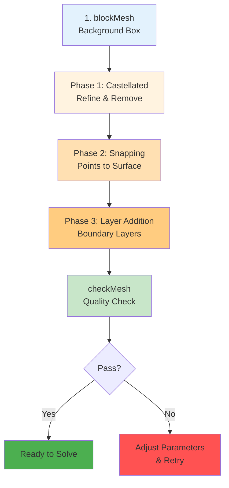

# กระบวนการทำงานของ snappyHexMesh (The snappyHexMesh Workflow)

> [!TIP] **ทำไมต้องเข้าใจ snappyHexMesh?**
> `snappyHexMesh` เป็นเครื่องมือสร้าง Mesh อัตโนมัติที่ทรงพลังที่สุดใน OpenFOAM การเข้าใจ Workflow 3 ขั้นตอนนี้จะช่วยให้คุณ:
> - **ประหยัดเวลา** ในการสร้าง Mesh สำหรับเรขาคณิตที่ซับซ้อน (Complex Geometry)
> - **ควบคุมคุณภาพ Mesh** ได้อย่างแม่นยำ โดยเลือกความละเอียดตามตำแหน่งที่ต้องการ
> - **สร้าง Boundary Layer** ที่เหมาะสมกับแบบจำลองความปั่น (Turbulence Models) ซึ่งสำคัญมากต่อความแม่นยำของการคำนวณ
> - **ลดข้อผิดพลาด** จากการตั้งค่าผิดพลาดที่ทำให้ Mesh พัง (Mesh Collapse) หรือ Quality ต่ำเกินไป
>
> ไฟล์ควบคุมหลัก: `system/snappyHexMeshDict` | เรียกใช้ด้วยคำสั่ง: `snappyHexMesh`

`snappyHexMesh` (sHM) คือเครื่องมือสร้าง Grid แบบอัตโนมัติ (Automated Meshing Tool) ที่ทรงพลังที่สุดของ OpenFOAM โดยใช้วิธีการ **Cut-Cell Method** บนพื้นฐานของ Cartesian Grid เพื่อสร้าง Mesh ที่มีคุณภาพสูง (Hex-dominant) สำหรับเรขาคณิตที่ซับซ้อน

## 1. แนวคิดเปรียบเทียบ (Analogy): ประติมากรรมเลโก้

จงจินตนาการว่าคุณต้องการสร้างรูปปั้น "รถยนต์" จากตัวต่อ LEGO:

1.  **Background Mesh (blockMesh)**: คุณก่อกองภูเขา LEGO สี่เหลี่ยมก้อนใหญ่ๆ ครอบคลุมพื้นที่ที่จะมีรถอยู่
2.  **Castellated Mesh**: คุณเอาเลื่อยมาตัดบล็อก LEGO ส่วนที่ไม่ได้เป็นรูปรถออกไป จนเหลือรูปร่างรถแบบ "ขั้นบันได" (หยักๆ แบบ Pixel)
3.  **Snapping**: คุณใช้ความร้อนละลายผิว LEGO ด้านนอกที่หยักๆ ให้ละลายแนบสนิทไปกับผิวรถจริงๆ จนเรียบเนียน
4.  **Layer Addition**: คุณทาสีพ่นเคลือบผิวรถหลายๆ ชั้น เพื่อเก็บรายละเอียดที่ผิว

นี่คือกระบวนการเป๊ะๆ ของ `snappyHexMesh`

## 2. โครงสร้างไฟล์ `system/snappyHexMeshDict`

> [!NOTE] **📂 OpenFOAM Context: โครงสร้าง snappyHexMeshDict**
> ไฟล์ `system/snappyHexMeshDict` เป็น Dictionary File ที่ควบคุมทั้ง 3 Phase ของการสร้าง Mesh โดยแต่ละส่วนประกอบด้วย:
>
> **Keywords หลัก:**
> - `castellatedMesh`, `snap`, `addLayers` → เปิด/ปิดการทำงานแต่ละ Phase
> - `geometry` → กำหนด Surface (STL/OBJ) และ Refinement Regions
> - `castellatedMeshControls` → ควบคุม Refinement Levels, LocationInMesh, และการลบ Cell
> - `snapControls` → ควบคุมความเรียบของผิว (nSmoothPatch, tolerance)
> - `addLayersControls` → ควบคุม Layer Thickness, Expansion Ratio, และ Layer Settings
>
> การเข้าใจโครงสร้างนี้จำเป็นต่อการ Debug เมื่อ Mesh ไม่สำเร็จ

ไฟล์ควบคุมหลักจะแบ่งออกเป็น 3 ส่วนใหญ่ๆ ตามกระบวนการทำงาน:

```cpp
castellatedMesh true; // เปิด/ปิด Phase 1
snap            true; // เปิด/ปิด Phase 2
addLayers       true; // เปิด/ปิด Phase 3

geometry
{
    car.stl { type triSurfaceMesh; name car; }
    refinementBox { type box; min (0 0 0); max (1 1 1); }
};

castellatedMeshControls { ... } // ควบคุมความละเอียด
snapControls { ... }            // ควบคุมการเข้าผิว
addLayersControls { ... }       // ควบคุมชั้น Boundary Layer
```

## 3. ขั้นตอนการทำงานแบบเจาะลึก (Detailed Phases)

> [!NOTE] **📂 OpenFOAM Context: การเลือก Phase ในการรัน**
> ใน `system/snappyHexMeshDict` คุณสามารถเลือกรันแต่ละ Phase แยกกันได้ โดยการตั้งค่า:
>
> ```cpp
> castellatedMesh true;  // Phase 1: Refinement + Removal
> snap            true;  // Phase 2: Surface Snapping
> addLayers       true;  // Phase 3: Boundary Layer
> ```
>
> **เทคนิคการ Debug:** แนะนำให้รันทีละ Phase เพื่อตรวจสอบผลลัพธ์ ก่อนจะรันทั้งหมดในครั้งเดียว
>
> **การตรวจสอบ:**
> - ใช้ `checkMesh -latestTime` เพื่อตรวจสอบคุณภาพ Mesh หลังจากแต่ละ Phase
> - เปิดดูใน ParaView ที่ Time directories: 0/, 1/, 2/, 3/

**snappyHexMesh 3-Phase Workflow:**


### Phase 1: Castellated Mesh (การขึ้นรูปหยาบ)

> [!NOTE] **📂 OpenFOAM Context: การตั้งค่า Castellated Mesh**
> Phase 1 นี้ถูกควบคุมโดย `castellatedMeshControls` ใน `system/snappyHexMeshDict`:
>
> **Keywords สำคัญ:**
> - `locationInMesh` → พิกัด (x y z) ที่ระบุตำแหน่ง Fluid Domain
> - `refinementSurfaces` → กำหนด Level ของความละเอียดบนผิวแต่ละส่วน
> - `refinementRegions` → กำหนด Refinement Box/Sphere สำหรับเพิ่มความละเอียดเฉพาะจุด
> - `maxGlobalCells` → จำกัดจำนวน Cell สูงสุดทั้งหมด (ป้องกัน Memory Overflow)
> - `nCellsBetweenLevels` → ควบคุมการลดขนาด Cell ระหว่างระดับความละเอียด (ปกติ = 1-3)
>
> **ผลลัพธ์:** Mesh จะถูกเก็บใน Time directory `1/` สามารถเปิดดูใน ParaView ได้

ขั้นตอนที่เป็นเหมือนการ "แกะสลัก" บล็อกพื้นฐาน

1.  **Refinement:** โปรแกรมจะวนลูปตรวจสอบว่า Cell ไหนตัดผ่าน Geometry หรืออยู่ใน Refinement Region ถ้าใช่ จะทำการแตก Cell แม่ (Parent) เป็น 8 Cell ลูก (Children)
2.  **Level Control:** ความละเอียดจะถูกกำหนดเป็น "Level" (ระดับ 0 = พื้นฐาน, ระดับ 1 = แตก 1 ครั้ง, ระดับ 2 = แตก 2 ครั้ง...)
3.  **Removal:** เมื่อ Refine จนพอใจ โปรแกรมจะลบ Cell ที่อยู่ผิดฝั่งทิ้ง (กำหนดโดย `locationInMesh`)

> [!WARNING] **จุดตาย:**
> `locationInMesh` ต้องเป็นพิกัด (x y z) ที่ **ไม่อยู่** บนผิวและ **ไม่อยู่** บนขอบของ Cell (ควรเลี่ยงจุดอย่าง 0, 0.5, 1 ให้ใช้ 0.00134 แทน)

### Phase 2: Snapping (การดึงผิวให้เรียบ)

> [!NOTE] **📂 OpenFOAM Context: การตั้งค่า Snapping Phase**
> Phase 2 นี้ถูกควบคุมโดย `snapControls` ใน `system/snappyHexMeshDict`:
>
> **Keywords สำคัญ:**
> - `nSmoothPatch` → จำนวนครั้งที่ Smooth ผิว (ปกติ = 3-5)
> - `tolerance` → ค่าความคลาดเคลื่อนที่ยอมรับได้ (ปกติ = 1.0-4.0)
> - `nSolveIter` → จำนวนรอบการแก้ปัญหา (Solver Iterations)
> - `nRelaxIter` → จำนวนรอบการผ่อนคลาย (Relaxation Iterations)
> - `nFeatureSnapIter` → จำนวนรอบการดึงผิวตาม Feature Edges
>
> **ความสำคัญ:** Snapping จะสำเร็จได้ต้องอาศัย Castellated Mesh ที่ละเอียดพอ (Level สูงพอ) มิฉะนั้นจะไม่สามารถดึงผิวให้เรียบได้
>
> **ผลลัพธ์:** Mesh จะถูกเก็บใน Time directory `2/`

การเปลี่ยนผิว "ขั้นบันได" ให้เป็น "ผิวเรียบ"

1.  **Point Displacement:** จุดยอด (Vertices) ของเซลล์ที่อยู่ติดผิวจะถูก "ดีด" เข้าไปหาพื้นผิวของ STL
2.  **Smoothing:** เมื่อจุดขยับ Cell อาจเบี้ยว (Skewness) โปรแกรมจะทำการ Smooth (เกลี่ย) จุดภายในเพื่อกระจายความเครียด
3.  **Iterative Morphing:** ทำซ้ำหลายรอบจนกว่า Error จะต่ำกว่าเกณฑ์

### Phase 3: Layer Addition (การเพิ่มชั้นผิว)

> [!NOTE] **📂 OpenFOAM Context: การตั้งค่า Layer Addition**
> Phase 3 นี้ถูกควบคุมโดย `addLayersControls` ใน `system/snappyHexMeshDict`:
>
> **Keywords สำคัญ:**
> - `layers` → ระบุ Patch ไหนที่ต้องการ Layer และจำนวน Layer
> - `expansionRatio` → อัตราส่วนการขยายตัวของ Layer (ปกติ = 1.0-1.5)
> - `finalLayerThickness` → ความหนาของ Layer ชั้นนอกสุด
> - `minThickness` → ความหนาขั้นต่ำที่ยอมรับได้
> - `nGrow` → จำนวนรอบการขยาย Layer (Layer Growing)
> - `maxFaceThicknessRatio` → อัตราส่วนความหนาสูงสุดระหว่าง Faces ต่างๆ
> - `nSmoothSurfaceNormals` → จำนวนรอบการ Smooth Normal Vector
>
> **เทคนิค:** Layer Addition เป็น Phase ที่ล้มเหลวง่ายที่สุด แนะนำให้เริ่มจาก `expansionRatio = 1.0` แล้วค่อยๆ เพิ่ม ถ้า Layer ไม่ขึ้น
>
> **ผลลัพธ์:** Mesh สุดท้ายจะถูกเก็บใน Time directory `3/` ซึ่งเป็น Mesh ที่พร้อมใช้งาน

ขั้นตอนที่ยากที่สุดและมักล้มเหลวบ่อยที่สุด

1.  **Push Back:** Mesh ที่สร้างเสร็จแล้วจะถูกดันถอยหลังออกมาในแนว Normal
2.  **Insertion:** สร้าง Cell ใหม่แทรกเข้าไปในช่องว่างนั้น
3.  **Quality Check:** ถ้าแทรกแล้ว Mesh Quality แย่ โปรแกรมจะยกเลิกการสร้าง Layer ตรงนั้น (Layer Collapse)

## 4. Workflow การรันคำสั่ง (Execution Guide)

> [!NOTE] **📂 OpenFOAM Context: ไฟล์และคำสั่งที่เกี่ยวข้อง**
> การรัน `snappyHexMesh` จำเป็นต้องใช้ไฟล์และคำสั่งต่อไปนี้:
>
> **ไฟล์ที่ต้องมี:**
> - `system/blockMeshDict` → สร้าง Background Mesh
> - `system/snappyHexMeshDict` → ควบคุมการสร้าง Mesh ทั้ง 3 Phase
> - `system/surfaceFeatureExtractDict` → สกัด Feature Edges (สำคัญมากสำหรับ Snapping)
> - `constant/triSurface/<geometry>.stl` → ไฟล์ Geometry (STL/OBJ)
> - `system/decomposeParDict` → สำหรับการรันแบบ Parallel
>
> **คำสั่งที่ใช้:**
> - `blockMesh` → สร้าง Background Mesh
> - `surfaceFeatureExtract` → สกัด Feature Edges
> - `decomposePar` → แยก Domain
> - `mpirun -np N snappyHexMesh -parallel` → รัน Parallel
> - `checkMesh` → ตรวจสอบคุณภาพ Mesh
> - `reconstructParMesh` → รวมผลลัพธ์กลับ

การรัน `snappyHexMesh` สำหรับงานจริง (Mesh > 500k cells) ควรใช้โหมด Parallel:

```bash
# 1. สร้าง Background Mesh (ต้องครอบคลุม Geometry ทั้งหมด)
blockMesh

# 2. สกัด Feature Edges (สำคัญมากเพื่อให้มุมคมชัด!)
# อ่านไฟล์ surfaceFeatureExtractDict
surfaceFeatureExtract

# 3. แยกโดเมนเพื่อคำนวณแบบขนาน
decomposePar

# 4. รัน sHM (แบบทับโฟลเดอร์เดิม -overwrite)
# ใช้ mpirun -np <จำนวน Core>
mpirun -np 4 snappyHexMesh -overwrite -parallel > log.shm

# 5. ตรวจสอบคุณภาพ
checkMesh -latestTime

# 6. รวมผลลัพธ์กลับ (ถ้าต้องการดูผลเต็มๆ)
reconstructParMesh -constant
```

## 5. การ Debug ด้วย ParaView

> [!NOTE] **📂 OpenFOAM Context: การตรวจสอบ Mesh ด้วย ParaView**
> `snappyHexMesh` สามารถเขียนผลลัพธ์ออกมาทีละขั้นตอน โดยไม่ใช้ `-overwrite` flag:
>
> **Time Directories:**
> - `0/` → Background Mesh จาก `blockMesh` (ตรวจสอบว่าครอบคลุม Geometry)
> - `1/` → Castellated Mesh (ตรวจสอบ Refinement Level และการลบ Cell)
> - `2/` → Snapped Mesh (ตรวจสอบความเรียบของผิว)
> - `3/` → Final Mesh with Layers (ตรวจสอบ Layer Quality)
>
> **เทคนิคการ Visualize:**
> 1. เปิด ParaView → File → Open → เลือก `case.foam`
> 2. ใช้ `Mesh Regions` เพื่อดูเฉพาะส่วนที่ต้องการ
> 3. ใช้ `Extract Surface` เพื่อดูผิว Mesh ชัดขึ้น
> 4. ใช้ `Cell Size` Coloring เพื่อดูความละเอียดของ Mesh
>
> **ตัวช่วยการ Debug:**
> - ใช้ `checkMesh -latestTime -allGeometry -allTopology` เพื่อดูรายงานคุณภาพ Mesh แบบละเอียด
> - ตรวจสอบ Log file (`log.shm`) สำหรับ Layer collapse warnings

`snappyHexMesh` สามารถเขียนผลลัพธ์ออกมาทีละขั้นตอนได้ ถ้าคุณไม่ใส่ `-overwrite` มันจะสร้าง Time folder:
*   `0/`: Background Mesh
*   `1/`: Castellated Mesh (ดูว่าละเอียดพอไหม)
*   `2/`: Snapped Mesh (ดูว่าผิวเรียบไหม)
*   `3/`: Layer Mesh (ดูว่า Layer ขึ้นครบไหม)

> [!TIP]
> ให้เช็คทีละ Step เสมอ! อย่าพยายามแก้ Layer (Step 3) ถ้า Castellated (Step 1) ยังหยาบเกินไป เพราะ Snap จะไม่มีทางสวยถ้า Cell ต้นทางไม่ละเอียดพอ

> **ลิงก์ที่เกี่ยวข้อง**:
> - ดูวิธีเตรียม Geometry ที่สะอาด → [02_Geometry_Preparation.md](./02_Geometry_Preparation.md)
> - ดูการตั้งค่า Castellated Mesh → [03_Castellated_Mesh_Settings.md](./03_Castellated_Mesh_Settings.md)
> - ดูเทคนิค Layer Addition → [../04_SNAPPYHEXMESH_ADVANCED/01_Layer_Addition_Strategy.md](../04_SNAPPYHEXMESH_ADVANCED/01_Layer_Addition_Strategy.md)

---

## 🧠 Concept Check: ทดสอบความเข้าใจ

### แบบฝึกหัดระดับง่าย (Easy)
1. **True/False**: `snappyHexMesh` สามารถรันได้โดยไม่ต้องสร้าง Background Mesh ด้วย `blockMesh` ก่อน
   <details>
   <summary>คำตอบ</summary>
   ❌ เท็จ - ต้องมี Background Mesh จาก `blockMesh` ก่อนเสมอ
   </details>

2. **เลือกตอบ**: Phase ไหนที่ตัด Geometry ออกตามรูปร่างจริง?
   - a) Phase 1: Castellated
   - b) Phase 2: Snapping
   - c) Phase 3: Layer Addition
   - d) ทุก Phase
   <details>
   <summary>คำตอบ</summary>
   ✅ a) Phase 1: Castellated - เป็นขั้นตอนที่ลบ Cell ที่อยู่ภายนอก Geometry
   </details>

### แบบฝึกหัดระดับปานกลาง (Medium)
3. **อธิบาย**: ทำไม `locationInMesh` ถึงเป็นจุดสำคัญมาก?
   <details>
   <summary>คำตอบ</summary>
   เพราะ sHM ใช้จุดนี้เพื่อตัดสินใจว่า Cell ไหนคือ Fluid (คงไว้) และ Cell ไหนคือ Solid (ลบทิ้ง) ถ้าระบุผิด Mesh จะหายหมด
   </details>

4. **สังเกต**: เมื่อรัน `snappyHexMesh` โดยไม่ใส่ `-overwrite` จะมีโฟลเดอร์ Time กี่โฟลเดอร์?
   <details>
   <summary>คำตอบ</summary>
   4 โฟลเดอร์: 0/ (Background), 1/ (Castellated), 2/ (Snapped), 3/ (Layer)
   </details>

### แบบฝึกหัดระดับสูง (Hard)
5. **Hands-on**: รัน `snappyHexMesh` จาก Tutorial ใดๆ แล้วเปิดดู Time folders ทั้ง 4 ใน ParaView เพื่อดูการเปลี่ยนแปลงของ Mesh ทีละ Phase

6. **วิเคราะห์**: เปรียบเทียบข้อดี-ข้อเสียระหว่างการรัน `snappyHexMesh` แบบ Serial กับ Parallel (ใช้ `decomposePar` + `mpirun`)

---


---

## 📖 เอกสารที่เกี่ยวข้อง

*   **บทก่อนหน้า**: [../02_BLOCKMESH_MASTERY/02_Parametric_Meshing.md](../02_BLOCKMESH_MASTERY/02_Parametric_Meshing.md)
*   **บทถัดไป**: [02_Geometry_Preparation.md](02_Geometry_Preparation.md)