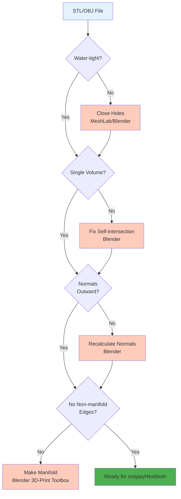

# การเตรียม Geometry (Geometry Preparation)

> [!TIP] ทำไมคุณต้องสนใจเรื่องนี้?
> **ความสำคัญต่อการจำลอง**: การเตรียม Geometry ที่สะอาด (Clean Geometry) เป็นขั้นตอนที่ **สำคัญที่สุด** ในขั้นตอนการสร้าง Mesh ด้วย `snappyHexMesh` หากไฟล์ STL มีรูรั่ว (Holes) หรือผิวไม่ต่อเนื่อง (Non-manifold edges) จะทำให้:
> - Mesh รั่ว (Leak) ทำให้ Solver คำนวณผิดพลาด
> - `snappyHexMesh` ทำงานล้มเหลว (Failed)
> - คุณภาพ Mesh ต่ำ ทำให้ผลลัพธ์การจำลองไม่แม่นยำ
>
> **การลงทุนเวลาในการเตรียม Geometry ที่ดี จะช่วยประหยัดเวลาในการ Debug และแก้ไข Mesh ในภายหลัง**

"Garbage In, Garbage Out" (ขยะเข้า ขยะออก) คือกฎเหล็กของ `snappyHexMesh` หากไฟล์ Geometry ต้นทาง (.stl, .obj) ของคุณมีคุณภาพต่ำ ไม่ว่าคุณจะปรับตั้งค่า sHM เก่งแค่ไหน ผลลัพธ์ก็จะออกมาแย่หรือ Error

> **ลิงก์ที่เกี่ยวข้อง**:
> - ดู Workflow การใช้ sHM → [01_The_sHM_Workflow.md](./01_The_sHM_Workflow.md)
> - ดูการตั้งค่า Refinement → [03_Castellated_Mesh_Settings.md](./03_Castellated_Mesh_Settings.md)

## 1. ลักษณะของ Geometry ที่ดี (The "Clean" Geometry)

> [!NOTE] **📂 OpenFOAM Context**
> **สิ่งที่คุณต้องตรวจสอบ**:
> - **ตำแหน่งไฟล์**: `constant/triSurface/` (วางไฟล์ STL/OBJ ไว้ที่นี่)
> - **ข้อกำหนด**: ไฟล์ต้องเป็น **Water-tight** (ไม่มีรูรั่ว) และ **Manifold** (ผิวต่อเนื่อง)
> - **ผลกระทบ**: หากไม่ผ่านเกณฑ์นี้ `snappyHexMesh` จะไม่สามารถสร้าง Mesh ที่ถูกต้องได้
> - **การตรวจสอบ**: ใช้คำสั่ง `surfaceCheck` (ดูรายละเอียดใน Section 5)

**Geometry Checklist:**


Geometry ที่พร้อมสำหรับ OpenFOAM ต้องมีคุณสมบัติ **Water-tight** และ **Manifold**:

1.  **Closed Surface (ผิวปิดสนิท):** ต้องไม่มี "รูรั่ว" (Holes) หรือช่องว่างระหว่างรอยต่อ แม้แต่รูเล็กๆ ระดับไมครอน `snappyHexMesh` ก็จะหาเจอและทำให้ Mesh รั่ว (Inside leak to Outside)
2.  **Single Volume:** พื้นผิวควรประกอบเป็นชิ้นเดียวที่ต่อเนื่อง ไม่ใช่เอาผิวหลายแผ่นมาเสียบทะลุกัน (Self-intersection)
3.  **Correct Normal Orientation:** เวกเตอร์ตั้งฉาก (Normal vector) ของทุกหน้าสามเหลี่ยมต้องชี้ออกนอกวัตถุ (หรือชี้ทางเดียวกัน)
4.  **No Non-manifold Edges:** ขอบหนึ่งขอบต้องถูกแชร์โดยหน้าสามเหลี่ยม 2 หน้าเท่านั้น (ห้ามมี 3 หน้ามาจุกอยู่ที่ขอบเดียว)

## 2. รูปแบบไฟล์ (File Formats)

> [!NOTE] **📂 OpenFOAM Context**
> **สิ่งที่คุณต้องตั้งค่า**:
> - **ตำแหน่งไฟล์**: `constant/triSurface/<filename>.stl` หรือ `<filename>.obj`
> - **การระบุ Patch**:
>   - **STL (ASCII)**: ใช้ชื่อ `solid` เป็นชื่อ Patch (เช่น `solid inlet`)
>   - **OBJ**: ใช้ `group` หรือ `object` ในไฟล์เป็นชื่อ Patch
> - **การใช้งานใน snappyHexMesh**: ระบุชื่อไฟล์ใน `geometry` ของ `system/snappyHexMeshDict`

*   **STL (Stereolithography):** รูปแบบมาตรฐานที่สุด เก็บเฉพาะผิวสามเหลี่ยม (ASCII หรือ Binary)
    *   *ข้อดี:* ง่าย รองรับทุกโปรแกรม
    *   *ข้อเสีย:* ไม่มีข้อมูล Patch name (ต้องมาแยกทีหลังหรือแยกไฟล์)
*   **OBJ (Wavefront):** เก็บ Patch name (Group) มาด้วยได้ ทำให้สะดวกกว่า
*   **TRISURFACE (.ftr):** รูปแบบของ OpenFOAM เอง

## 3. เครื่องมือเตรียม Geometry (Recommended Tools)

> [!NOTE] **📂 OpenFOAM Context**
> **สิ่งที่คุณต้องทำ**:
> - **ขั้นตอนก่อนเรียก snappyHexMesh**: ใช้เครื่องมือเหล่านี้เพื่อ **Clean Geometry** ก่อนนำไปใช้ใน OpenFOAM
> - **การตรวจสอบ**: หลังจาก Clean แล้วต้องรัน `surfaceCheck` เพื่อยืนยันคุณภาพ
> - **ไฟล์ที่ได้**: นำไฟล์ STL/OBJ ที่ Clean แล้วไปวางใน `constant/triSurface/`
>
> **เครื่องมือแนะนำ**:
> - **Blender** (ฟรี): เหมาะสำหรับการ Clean mesh ทั่วไป และตรวจสอบ Non-manifold edges
> - **MeshLab** (ฟรี): เหมาะสำหรับการซ่อม STL ที่พังหนัก
> - **Salome** (ฟรี): เหมาะสำหรับการสร้าง CAD และ export เป็น STL คุณภาพสูง

### 3.1 Blender (Open Source)
เครื่องมือ 3D Modeling ที่ดีที่สุดสำหรับการ Clean mesh
*   **ฟีเจอร์เด็ด:** `3D-Print Toolbox` (Add-on)
    *   กดปุ่ม "Check All" จะบอกเลยว่ามี Non-manifold edges กี่จุด
    *   กดปุ่ม "Make Manifold" เพื่อซ่อมแซมอัตโนมัติ

### 3.2 MeshLab (Open Source)
เหมาะสำหรับการซ่อมไฟล์ STL ที่พังยับเยิน
*   Filters > Cleaning and Repairing > ...
    *   Remove Duplicate Faces
    *   Remove Unreferenced Vertices
    *   Close Holes

### 3.3 Salome (Open Source)
เหมาะสำหรับการสร้าง Geometry ทางวิศวกรรม (CAD) และ export เป็น STL คุณภาพสูง
*   สามารถสร้าง Group (Patch) ตั้งแต่ใน CAD ได้เลย

## 4. การแยก Patch (Surface Splitting)

> [!NOTE] **📂 OpenFOAM Context**
> **สิ่งที่คุณต้องตั้งค่าใน snappyHexMesh**:
> - **ไฟล์**: `system/snappyHexMeshDict`
> - **ส่วน `geometry`**: ระบุไฟล์ STL แต่ละไฟล์ตามชื่อ Patch
> - **ส่วน `refinementSurfaces`**: กำหนดระดับการละเอียดของแต่ละ Patch
> - **ตัวอย่าง**:
>   ```cpp
>   geometry
>   {
>       inlet.stl { type triSurfaceMesh; }
>       outlet.stl { type triSurfaceMesh; }
>       car_body.stl { type triSurfaceMesh; }
>   }
>   ```
> - **การตั้งชื่อ**: ชื่อไฟล์ STL หรือชื่อ `solid` ใน ASCII STL จะถูกใช้เป็นชื่อ **Patch** ใน `boundary` file

`snappyHexMesh` ต้องการให้เราแยกไฟล์ STL ตาม Boundary Condition เช่น `inlet.stl`, `outlet.stl`, `car_body.stl`, `wheels.stl` หรือรวมเป็นไฟล์เดียวแล้วใช้ชื่อ Solid

### วิธีการตั้งชื่อใน ASCII STL:
```
solid inlet          <-- ชื่อ Patch จะถูกดึงจากตรงนี้
  facet normal ...
    outer loop
      vertex ...
    endloop
  endfacet
endsolid inlet
```

### การรวมไฟล์ (ถ้าจำเป็น):
คุณสามารถใช้คำสั่ง Linux: `cat inlet.stl outlet.stl walls.stl > combined.stl` (ใช้ได้เฉพาะ ASCII STL)

## 5. การตรวจสอบด้วย OpenFOAM (`surfaceCheck`)

> [!NOTE] **📂 OpenFOAM Context**
> **คำสั่งที่คุณต้องรัน**:
> - **คำสั่ง**: `surfaceCheck constant/triSurface/<filename>.stl`
> - **วัตถุประสงค์**: ตรวจสอบความสะอาดของ Geometry ก่อนเรียก `snappyHexMesh`
> - **สิ่งที่ต้องตรวจสอบ**:
>   - **Number of connected parts**: ควรเป็น 1 (หรือตามจำนวนชิ้นงานจริง)
>   - **Open edges**: ต้องเป็น 0 (ถ้า > 0 แสดงว่ามีรูรั่ว)
>   - **Min/Max box**: ตรวจหน่วยของขนาด (เมตร หรือ มม.)
> - **ถ้าไม่ผ่าน**: กลับไปใช้ Blender/MeshLab ซ่อมแซม

ก่อนเริ่ม Mesh ให้รันคำสั่งนี้เสมอ:

```bash
surfaceCheck constant/triSurface/myGeometry.stl
```

**สิ่งที่ต้องดูใน Output:**
1.  **Number of connected parts:** ควรเป็น 1 (หรือตามจำนวนชิ้นงานจริง) ถ้าเป็น 100 แสดงว่าผิวแตก
2.  **Open edges:** ต้องเป็น 0 (ถ้า > 0 แสดงว่ามีรูรั่ว)
3.  **Min/Max box:** เช็คขนาด (Bounding Box) ว่าหน่วยถูกต้องไหม (เมตร หรือ มิลลิเมตร)

## 6. การสกัด Feature Edges (`surfaceFeatureExtract`)

> [!NOTE] **📂 OpenFOAM Context**
> **สิ่งที่คุณต้องตั้งค่า**:
> - **ไฟล์**: `system/surfaceFeatureExtractDict`
> - **คำสั่ง**: `surfaceFeatureExtract`
> - **ไฟล์ที่ได้**: `constant/triSurface/<filename>.eMesh`
> - **การใช้งานใน snappyHexMesh**: ระบุในส่วน `features` ของ `castellatedMeshControls`
> - **ตัวอย่าง**:
>   ```cpp
>   castellatedMeshControls
>   {
>       features
>       (
>           { file "myGeometry.eMesh"; level 2; }
>       );
>   }
>   ```
> - **วัตถุประสงค์**: ให้ `snappyHexMesh` เก็บขอบมุมที่คมชัด (Sharp Edges) ไว้ใน Mesh

เพื่อให้ sHM เก็บขอบมุมที่คมชัด (Sharp Edges) เราต้องสร้างไฟล์ `.eMesh`

**ไฟล์ `system/surfaceFeatureExtractDict`:**
```cpp
myGeometry.stl
{
    extractionMethod    extractFromSurface;
    includedAngle       150; // มุมที่ถือว่าเป็นมุมคม (150-180 คือเรียบ, <150 คือคม)
    writeObj            yes;
}
```
รันคำสั่ง `surfaceFeatureExtract` จะได้ไฟล์ `myGeometry.eMesh` ไปใช้ใน sHM

---
เมื่อ Geometry สะอาดแล้ว เราก็พร้อมที่จะไปตั้งค่า `castellatedMeshControls` ในบทต่อไป → [03_Castellated_Mesh_Settings.md](./03_Castellated_Mesh_Settings.md)

## 🧠 Concept Check: ทดสอบความเข้าใจ

### แบบฝึกหัดระดับง่าย (Easy)
1. **True/False**: ไฟล์ STL ที่มีรูรั่ว (Holes) ไม่สามารถใช้กับ `snappyHexMesh` ได้
   <details>
   <summary>คำตอบ</summary>
   ✅ จริง - จะทำให้เกิด Mesh leak และ sHM จะ fail
   </details>

2. **เลือกตอบ**: Format ไหนที่รองรับการแยก Patch name ได้โดยตรง?
   - a) STL (ASCII)
   - b) STL (Binary)
   - c) OBJ
   - d) ทุกอย่าง
   <details>
   <summary>คำตอบ</summary>
   ✅ c) OBJ - รองรับ Group name สำหรับแยก Patch
   </details>

### แบบฝึกหัดระดับปานกลาง (Medium)
3. **อธิบาย**: ทำไม `includedAngle` ใน `surfaceFeatureExtract` ถึงสำคัญ?
   <details>
   <summary>คำตอบ</summary>
   ใช้กำหนดว่ามุมเท่าไหร่ควรถือว่าเป็น "Sharp edge" (เช่น 150 องศา = มุมที่แหลมกว่า 30 องศาจะถือว่าคม)
   </details>

4. **สังเกต**: คำสั่ง `surfaceCheck` รายงานค่าอะไรบ้างที่บอกถึงความสะอาดของ Geometry?
   <details>
   <summary>คำตอบ</summary>
   - Number of connected parts (ควร = 1)
   - Open edges (ควร = 0)
   - Min/Max box (ตรวจหน่วย)
   </details>

### แบบฝึกหัดระดับสูง (Hard)
5. **Hands-on**: ใช้ Blender เปิดไฟล์ STL จาก Tutorial ใดๆ แล้วใช้ 3D-Print Toolbox เช็คว่ามี Non-manifold edges กี่จุด แล้วซ่อมให้เรียบร้อย


---

## 📖 เอกสารที่เกี่ยวข้อง

*   **บทก่อนหน้า**: [01_The_sHM_Workflow.md](01_The_sHM_Workflow.md)
*   **บทถัดไป**: [03_Castellated_Mesh_Settings.md](03_Castellated_Mesh_Settings.md)