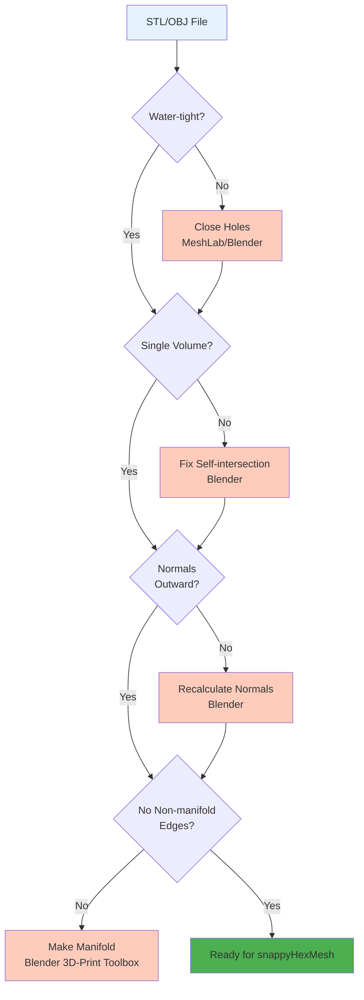

I'll refactor this OpenFOAM documentation file according to the 3W Framework and add the requested elements.

```markdown
# การเตรียม Geometry (Geometry Preparation)

> [!TIP] ทำไมคุณต้องสนใจเรื่องนี้?
> **ความสำคัญต่อการจำลอง**: การเตรียม Geometry ที่สะอาด (Clean Geometry) เป็นขั้นตอนที่ **สำคัญที่สุด** ในขั้นตอนการสร้าง Mesh ด้วย `snappyHexMesh` หากไฟล์ STL มีรูรั่ว (Holes) หรือผิวไม่ต่อเนื่อง (Non-manifold edges) จะทำให้:
> - Mesh รั่ว (Leak) ทำให้ Solver คำนวณผิดพลาด
> - `snappyHexMesh` ทำงานล้มเหลว (Failed)
> - คุณภาพ Mesh ต่ำ ทำให้ผลลัพธ์การจำลองไม่แม่นยำ
>
> **การลงทุนเวลาในการเตรียม Geometry ที่ดี จะช่วยประหยัดเวลาในการ Debug และแก้ไข Mesh ในภายหลัง**

## 🎯 Learning Objectives

หลังจากอ่านบทนี้ คุณจะสามารถ:
- อธิบายลักษณะของ Geometry ที่ดี (Clean Geometry) ที่เหมาะสมกับ `snappyHexMesh`
- ตรวจสอบความสะอาดของ Geometry ด้วย `surfaceCheck` และแก้ไขปัญหาที่พบ
- เลือกรูปแบบไฟล์ที่เหมาะสม (STL/OBJ) และจัดการ Patch names อย่างถูกต้อง
- ใช้เครื่องมือ Blender และ MeshLab ในการเตรียม Geometry คุณภาพสูง
- สกัด Feature Edges ด้วย `surfaceFeatureExtract` เพื่อรักษาความคมชัดของขอบมุม

---

## 1. ลักษณะของ Geometry ที่ดี (The "Clean" Geometry)

### What - คืออะไร?

"Garbage In, Garbage Out" (ขยะเข้า ขยะออก) คือกฎเหล็กของ `snappyHexMesh` หากไฟล์ Geometry ต้นทาง (.stl, .obj) ของคุณมีคุณภาพต่ำ ไม่ว่าคุณจะปรับตั้งค่า sHM เก่งแค่ไหน ผลลัพธ์ก็จะออกมาแย่หรือ Error

Geometry ที่พร้อมสำหรับ OpenFOAM ต้องมีคุณสมบัติ **Water-tight** และ **Manifold**:

1. **Closed Surface (ผิวปิดสนิท):** ต้องไม่มี "รูรั่ว" (Holes) หรือช่องว่างระหว่างรอยต่อ แม้แต่รูเล็กๆ ระดับไมครอน `snappyHexMesh` ก็จะหาเจอและทำให้ Mesh รั่ว (Inside leak to Outside)

2. **Single Volume:** พื้นผิวควรประกอบเป็นชิ้นเดียวที่ต่อเนื่อง ไม่ใช่เอาผิวหลายแผ่นมาเสียบทะลุกัน (Self-intersection)

3. **Correct Normal Orientation:** เวกเตอร์ตั้งฉาก (Normal vector) ของทุกหน้าสามเหลี่ยมต้องชี้ออกนอกวัตถุ (หรือชี้ทางเดียวกัน)

4. **No Non-manifold Edges:** ขอบหนึ่งขอบต้องถูกแชร์โดยหน้าสามเหลี่ยม 2 หน้าเท่านั้น (ห้ามมี 3 หน้ามาจุกอยู่ที่ขอบเดียว)

### Why - ทำไมสำคัญ?

> [!NOTE] **📂 OpenFOAM Context**
> **สิ่งที่คุณต้องตรวจสอบ**:
> - **ตำแหน่งไฟล์**: `constant/triSurface/` (วางไฟล์ STL/OBJ ไว้ที่นี่)
> - **ข้อกำหนด**: ไฟล์ต้องเป็น **Water-tight** (ไม่มีรูรั่ว) และ **Manifold** (ผิวต่อเนื่อง)
> - **ผลกระทบ**: หากไม่ผ่านเกณฑ์นี้ `snappyHexMesh` จะไม่สามารถสร้าง Mesh ที่ถูกต้องได้
> - **การตรวจสอบ**: ใช้คำสั่ง `surfaceCheck` (ดูรายละเอียดใน Section 5)

หาก Geometry ไม่สะอาด จะเกิดปัญหาต่อไปนี้:
- **Mesh Leaks**: รูรั่วจะทำให้โซลูชัน "รั่ว" ออกไปนอกโดเมน ทำให้ Solver คำนวณผิดพลาด
- **sHM Failed**: `snappyHexMesh` อาจหยุดทำงานกลางคัน เสียเวลา Debug
- **Poor Mesh Quality**: แม้จะได้ Mesh มา แต่คุณภาพต่ำ ทำให้ผลลัพธ์การจำลองไม่แม่นยำ

### How - ตรวจสอบอย่างไร?

**Geometry Checklist:**


---

## 2. รูปแบบไฟล์ (File Formats)

### What - มีรูปแบบให้เลือกอะไรบ้าง?

> [!NOTE] **📂 OpenFOAM Context**
> **สิ่งที่คุณต้องตั้งค่า**:
> - **ตำแหน่งไฟล์**: `constant/triSurface/<filename>.stl` หรือ `<filename>.obj`
> - **การระบุ Patch**:
>   - **STL (ASCII)**: ใช้ชื่อ `solid` เป็นชื่อ Patch (เช่น `solid inlet`)
>   - **OBJ**: ใช้ `group` หรือ `object` ในไฟล์เป็นชื่อ Patch
> - **การใช้งานใน snappyHexMesh**: ระบุชื่อไฟล์ใน `geometry` ของ `system/snappyHexMeshDict`

### 1. STL (Stereolithography)
รูปแบบมาตรฐานที่สุด เก็บเฉพาะผิวสามเหลี่ยม (ASCII หรือ Binary)

**ข้อดี:**
- ง่าย รองรับทุกโปรแกรม CAD
- ไฟล์ขนาดเล็ก (Binary)
- มาตรฐานอุตสาหกรรม

**ข้อเสีย:**
- ไม่มีข้อมูล Patch name (ต้องมาแยกทีหลังหรือแยกไฟล์)
- Binary STL อ่านยาก

**การตั้งชื่อใน ASCII STL:**
```
solid inlet          <-- ชื่อ Patch จะถูกดึงจากตรงนี้
  facet normal ...
    outer loop
      vertex ...
    endloop
  endfacet
endsolid inlet
```

### 2. OBJ (Wavefront)
เก็บ Patch name (Group) มาด้วยได้ ทำให้สะดวกกว่า

**ข้อดี:**
- รองรับ Group name สำหรับแยก Patch
- อ่านง่าย (Text-based)
- รองรับหลาย mesh ในไฟล์เดียว

**ข้อเสีย:**
- ไฟล์ขนาดใหญ่กว่า STL
- ไม่รองรับในบางโปรแกรมเก่า

### 3. TRISURFACE (.ftr)
รูปแบบของ OpenFOAM เอง

**ข้อดี:**
- เป็น Native format ของ OpenFOAM
- รองรับทุกฟีเจอร์

**ข้อเสีย:**
- ไม่สามารถสร้างจากโปรแกรม CAD อื่นๆ ได้โดยตรง

### Why - เลือกอะไรดี?

| สถานการณ์ | แนะนำ | เหตุผล |
|-----------|--------|---------|
| งานเริ่มต้น ไม่มี Patch | STL | ง่ายที่สุด รองรับทุกที่ |
| ต้องแยก Patch หลายชิ้น | OBJ | รองรับ Group name |
| Geometry ซับซ้อน | STL แยกไฟล์ | ควบคุมง่ายกว่า |

### How - ใช้งานอย่างไร?

**การรวมไฟล์ (ถ้าจำเป็น):**
คุณสามารถใช้คำสั่ง Linux: `cat inlet.stl outlet.stl walls.stl > combined.stl` (ใช้ได้เฉพาะ ASCII STL)

---

## 3. เครื่องมือเตรียม Geometry (Recommended Tools)

### What - มีเครื่องมืออะไรให้ใช้?

> [!NOTE] **📂 OpenFOAM Context**
> **สิ่งที่คุณต้องทำ**:
> - **ขั้นตอนก่อนเรียก snappyHexMesh**: ใช้เครื่องมือเหล่านี้เพื่อ **Clean Geometry** ก่อนนำไปใช้ใน OpenFOAM
> - **การตรวจสอบ**: หลังจาก Clean แล้วต้องรัน `surfaceCheck` เพื่อยืนยันคุณภาพ
> - **ไฟล์ที่ได้**: นำไฟล์ STL/OBJ ที่ Clean แล้วไปวางใน `constant/triSurface/`
>
> **เครื่องมือแนะนำ**:
> - **Blender** (ฟรี): เหมาะสำหรับการ Clean mesh ทั่วไป และตรวจสอบ Non-manifold edges
> - **MeshLab** (ฟรี): เหมาะสำหรับการซ่อม STL ที่พังหนัก
> - **Salome** (ฟรี): เหมาะสำหรับการสร้าง CAD และ export เป็น STL คุณภาพสูง

### 3.1 Blender (Open Source)
เครื่องมือ 3D Modeling ที่ดีที่สุดสำหรับการ Clean mesh

**ฟีเจอร์เด็ด:** `3D-Print Toolbox` (Add-on)

**วิธีใช้:**
1. เปิด Blender > File > Import > Stl
2. ไปที่ Edit Mode
3. ปุ่ม `N` เพื่อเปิด Sidebar
4. แท็บ View > กดเปิด "3D-Print Toolbox"
5. แท็บ 3D-Print Toolbox:
   - กด **"Check All"** → จะบอกเลยว่ามี Non-manifold edges กี่จุด
   - กด **"Make Manifold"** → เพื่อซ่อมแซมอัตโนมัติ

**ข้อดี:**
- ฟรี และ Open Source
- มี Tool ครบถ้วนสำหรับ Mesh Repair
- รองรับไฟล์หลายรูปแบบ

### 3.2 MeshLab (Open Source)
เหมาะสำหรับการซ่อมไฟล์ STL ที่พังยับเยิน

**ฟีเจอร์หลัก:**
- Filters > Cleaning and Repairing > ...
  - Remove Duplicate Faces
  - Remove Unreferenced Vertices
  - Close Holes
  - Remove Self-Intersections

**วิธีใช้:**
1. File > Import Mesh
2. Filters > Cleaning and Repairing > เลือก Tool ที่ต้องการ
3. File > Export Mesh As

**ข้อดี:**
- ฟรี และ Open Source
- เหมาะกับไฟล์ขนาดใหญ่ (Millions of triangles)
- มี Tool ซ่อมเฉพาะทางมากมาย

### 3.3 Salome (Open Source)
เหมาะสำหรับการสร้าง Geometry ทางวิศวกรรม (CAD) และ export เป็น STL คุณภาพสูง

**ฟีเจอร์หลัก:**
- สามารถสร้าง Group (Patch) ตั้งแต่ใน CAD ได้เลย
- รองรับ Parametric Modeling
- Export STL ได้คุณภาพสูง

**วิธีใช้:**
1. สร้าง Geometry ใน Geometry Module
2. สร้าง Group สำหรับแต่ละ Patch
3. Export > STL > เลือก Group

**ข้อดี:**
- ฟรี และ Open Source
- เหมาะกับงานวิศวกรรม
- สามารถสร้าง Patch ตั้งแต่ใน CAD

### Why - ทำไมต้องใช้เครื่องมือพวกนี้?

**ตารางเปรียบเทียบ:**

| เครื่องมือ | เหมาะกับ | ความยากในการใช้ | ราคา |
|------------|----------|------------------|------|
| Blender | Clean mesh ทั่วไป | ปานกลาง | ฟรี |
| MeshLab | ซ่อม STL พังหนัก | ง่าย | ฟรี |
| Salome | สร้าง CAD และ export STL | ยาก | ฟรี |

### How - เลือกใช้อย่างไร?

**Workflow แนะนำ:**
1. **สร้าง CAD** → ใช้ Salome หรือโปรแกรม CAD อื่นๆ
2. **Export STL** → ระบุ Patch ตั้งแต่ใน CAD
3. **Clean Mesh** → ใช้ Blender ตรวจสอบและซ่อม
4. **Final Check** → ใช้ `surfaceCheck` ตรวจสอบ

---

## 4. การแยก Patch (Surface Splitting)

### What - คืออะไร?

> [!NOTE] **📂 OpenFOAM Context**
> **สิ่งที่คุณต้องตั้งค่าใน snappyHexMesh**:
> - **ไฟล์**: `system/snappyHexMeshDict`
> - **ส่วน `geometry`**: ระบุไฟล์ STL แต่ละไฟล์ตามชื่อ Patch
> - **ส่วน `refinementSurfaces`**: กำหนดระดับการละเอียดของแต่ละ Patch
> - **ตัวอย่าง**:
>   ```cpp
>   geometry
>   {
>       inlet.stl { type triSurfaceMesh; }
>       outlet.stl { type triSurfaceMesh; }
>       car_body.stl { type triSurfaceMesh; }
>   }
>   ```
> - **การตั้งชื่อ**: ชื่อไฟล์ STL หรือชื่อ `solid` ใน ASCII STL จะถูกใช้เป็นชื่อ **Patch** ใน `boundary` file

`snappyHexMesh` ต้องการให้เราแยกไฟล์ STL ตาม Boundary Condition เช่น `inlet.stl`, `outlet.stl`, `car_body.stl`, `wheels.stl` หรือรวมเป็นไฟล์เดียวแล้วใช้ชื่อ Solid

### Why - ทำไมต้องแยก Patch?

**เหตุผล:**
1. **กำหนด Boundary Condition ต่างกัน**: เช่น inlet ใช้ velocity inlet, outlet ใช้ pressure outlet
2. **Refinement ต่างกัน**: บางส่วนต้องละเอียดกว่า เช่น car body ละเอียดกว่า walls
3. **ความสะดวกในการจัดการ**: แยกไฟล์ทำให้แก้ไขง่ายกว่า

### How - ทำอย่างไร?

**วิธีที่ 1: แยกไฟล์ (Recommended)**
```bash
inlet.stl
outlet.stl
walls.stl
car_body.stl
```

ข้อดี: ชัดเจน ง่ายต่อการจัดการ

**วิธีที่ 2: รวมไฟล์แล้วใช้ชื่อ Solid**
```
solid inlet
  ... (triangles)
endsolid inlet

solid outlet
  ... (triangles)
endsolid outlet
```

ข้อดี: ไฟล์เดียวจบ

**การรวมไฟล์ (ถ้าจำเป็น):**
คุณสามารถใช้คำสั่ง Linux: `cat inlet.stl outlet.stl walls.stl > combined.stl` (ใช้ได้เฉพาะ ASCII STL)

---

## 5. การตรวจสอบด้วย OpenFOAM (`surfaceCheck`)

### What - คืออะไร?

> [!NOTE] **📂 OpenFOAM Context**
> **คำสั่งที่คุณต้องรัน**:
> - **คำสั่ง**: `surfaceCheck constant/triSurface/<filename>.stl`
> - **วัตถุประสงค์**: ตรวจสอบความสะอาดของ Geometry ก่อนเรียก `snappyHexMesh`
> - **สิ่งที่ต้องตรวจสอบ**:
>   - **Number of connected parts**: ควรเป็น 1 (หรือตามจำนวนชิ้นงานจริง)
>   - **Open edges**: ต้องเป็น 0 (ถ้า > 0 แสดงว่ามีรูรั่ว)
>   - **Min/Max box**: ตรวจหน่วยของขนาด (เมตร หรือ มม.)
> - **ถ้าไม่ผ่าน**: กลับไปใช้ Blender/MeshLab ซ่อมแซม

`surfaceCheck` เป็น Utility ของ OpenFOAM ที่ใช้ตรวจสอบความสะอาดของ Geometry ก่อนนำไปใช้ใน `snappyHexMesh`

### Why - ทำไมต้องตรวจสอบ?

**เหตุผล:**
1. **ประหยัดเวลา**: ตรวจเจอตั้งแต่แรก ดีกว่ารอ sHM fail แล้วค่อยแก้
2. **ความมั่นใจ**: แน่ใจว่า Geometry พร้อมใช้งาน
3. **Debug ง่าย**: รู้ว่าปัญหาเกิดจากตรงไหน

### How - ใช้อย่างไร?

**ขั้นตอน:**

1. **วางไฟล์ STL ในตำแหน่งที่ถูกต้อง:**
```bash
cp myGeometry.stl $FOAM_RUN/constant/triSurface/
```

2. **รันคำสั่ง:**
```bash
surfaceCheck constant/triSurface/myGeometry.stl
```

**สิ่งที่ต้องดูใน Output:**

#### 1. Number of connected parts
```bash
Number of connected parts: 1
```
- **ควรเป็น**: 1 (หรือตามจำนวนชิ้นงานจริง)
- **ถ้าเป็น 100**: แสดงว่าผิวแตก หรือ mesh ไม่ต่อเนื่อง

#### 2. Open edges
```bash
Open edges: 0
```
- **ควรเป็น**: 0
- **ถ้า > 0**: แสดงว่ามีรูรั่ว (Holes)
- **วิธีแก้**: ใช้ MeshLab > Filters > Cleaning and Repairing > Close Holes

#### 3. Min/Max box
```bash
Min box: (-0.5 -0.3 -0.1)
Max box: (1.5 0.8 0.3)
```
- **วัตถุประสงค์**: ตรวจหน่วยของขนาด (เมตร หรือ มิลลิเมตร)
- **ถ้าผิดปกติ**: แสดงว่าหน่วยไม่ถูกต้อง
- **วิธีแก้**: กลับไป Scale ใน CAD หรือใช้ `transformPoints` ของ OpenFOAM

**ตัวอย่าง Output ที่ดี:**
```bash
Reading surface from "constant/triSurface/myGeometry.stl"
...
Number of connected parts: 1
Open edges: 0
...
Min box: (-0.5 -0.3 -0.1)
Max box: (1.5 0.8 0.3)
```

**ตัวอย่าง Output ที่ไม่ดี:**
```bash
Number of connected parts: 127  <-- ผิวแตก
Open edges: 4532                <-- มีรูรั่ว
...
```

---

## 6. การสกัด Feature Edges (`surfaceFeatureExtract`)

### What - คืออะไร?

> [!NOTE] **📂 OpenFOAM Context**
> **สิ่งที่คุณต้องตั้งค่า**:
> - **ไฟล์**: `system/surfaceFeatureExtractDict`
> - **คำสั่ง**: `surfaceFeatureExtract`
> - **ไฟล์ที่ได้**: `constant/triSurface/<filename>.eMesh`
> - **การใช้งานใน snappyHexMesh**: ระบุในส่วน `features` ของ `castellatedMeshControls`
> - **ตัวอย่าง**:
>   ```cpp
>   castellatedMeshControls
>   {
>       features
>       (
>           { file "myGeometry.eMesh"; level 2; }
>       );
>   }
>   ```
> - **วัตถุประสงค์**: ให้ `snappyHexMesh` เก็บขอบมุมที่คมชัด (Sharp Edges) ไว้ใน Mesh

Feature Edges คือเส้นขอบที่มีความคมชัด (Sharp Edges) บนผิว Geometry เช่น ขอบของ Cube, ขอบของ Car body, ฯลฯ

### Why - ทำไมต้องสกัด Feature Edges?

**เหตุผล:**
1. **รักษารูปร่าง**: ให้ Mesh ตัดตามขอบมุมที่คมชัด ไม่ให้โค้งมนเกินไป
2. **ความแม่นยำ**: ขอบคมชัดเป็นสิ่งสำคัญในการจำลองทางอากาศพลศาสตร์ (Aerodynamics)
3. **คุณภาพ Mesh**: Feature Edges ช่วยให้ Mesh มีคุณภาพสูงขึ้น

**ตัวอย่าง:**
- ถ้าไม่ใช้ Feature Edges: ขอบของ Cube จะโค้งมน
- ถ้าใช้ Feature Edges: ขอบของ Cube จะคมชัดตามเดิม

### How - ทำอย่างไร?

**ขั้นตอนที่ 1: สร้างไฟล์ Dictionary**

สร้างไฟล์ `system/surfaceFeatureExtractDict`:

```cpp
// ไฟล์: system/surfaceFeatureExtractDict

myGeometry.stl
{
    // วิธีการสกัด Feature Edges
    extractionMethod    extractFromSurface;
    
    // มุมที่ถือว่าเป็ะมุมคม (150-180 คือเรียบ, <150 คือคม)
    // 150 องศา = มุมที่แหลมกว่า 30 องศาจะถือว่าคม
    includedAngle       150;
    
    // เขียนไฟล์ OBJ เพื่อดูผลลัพธ์
    writeObj            yes;
    
    // ระดับการละเอียดของ Edge
    // มากขึ้น = Edge ละเอียดขึ้น แต่ไฟล์ใหญ่ขึ้น
    edgeTolerance       0.1;
    
    // ความละเอียดของ sampling
    minSampleEdgePoints 0;
    maxSampleEdgePoints 10;
    samplingTolerance   0.1;
}
```

**คำอธิบาย Parameter:**

| Parameter | ความหมาย | ค่าแนะนำ |
|-----------|----------|----------|
| `extractionMethod` | วิธีการสกัด | `extractFromSurface` (สกัดจากผิว), `extractFromSurface` |
| `includedAngle` | มุมที่ถือว่าคม | 150-160 (ลดลง = Feature เพิ่มขึ้น) |
| `writeObj` | เขียนไฟล์ OBJ หรือไม่ | `yes` (ดูผลลัพธ์ใน ParaView) |
| `edgeTolerance` | ความคมชัดของ Edge | 0.1 (ค่าเริ่มต้น) |
| `minSampleEdgePoints` | จำนวนจุดต่ำสุดต่อ Edge | 0 (ค่าเริ่มต้น) |
| `maxSampleEdgePoints` | จำนวนจุดสูงสุดต่อ Edge | 10 (ค่าเริ่มต้น) |

**ขั้นตอนที่ 2: รันคำสั่ง**

```bash
surfaceFeatureExtract
```

หรือ

```bash
surfaceFeatureExtract > log.surfaceFeatureExtract 2>&1
```

**ขั้นตอนที่ 3: ตรวจสอบผลลัพธ์**

ไฟล์ที่ได้:
- `constant/triSurface/myGeometry.eMesh` - ไฟล์ Feature Edges สำหรับ sHM
- `constant/triSurface/myGeometry.obj` - ไฟล์ OBJ สำหรับดูผลลัพธ์ (ถ้า `writeObj yes`)

**การดูผลลัพธ์ใน ParaView:**

1. เปิด ParaView
2. File > Open > `constant/triSurface/myGeometry.obj`
3. ดู Feature Edges ที่ถูกสกัดออกมา

**ขั้นตอนที่ 4: ใช้ใน snappyHexMesh**

เพิ่มใน `system/snappyHexMeshDict`:

```cpp
castellatedMeshControls
{
    features
    (
        { file "myGeometry.eMesh"; level 2; }
    );
    
    // ... ส่วนอื่นๆ
}
```

**Parameter ใน sHM:**

| Parameter | ความหมาย | ค่าแนะนำ |
|-----------|----------|----------|
| `file` | ชื่อไฟล์ eMesh | `"myGeometry.eMesh"` |
| `level` | ระดับการละเอียดของ Edge | 0-5 (มากขึ้น = ละเอียดขึ้น) |

### เคล็ดลับ (Tips):

**1. การเลือก includedAngle:**
- **150 องศา**: เหมาะสำหรับงานทั่วไป
- **140 องศา**: Feature เพิ่มขึ้น (ระวังไฟล์ใหญ่)
- **160 องศา**: Feature ลดลง (เหมาะกับงานเรียบ)

**2. การทดสอบ:**
- เริ่มจาก `includedAngle 150`
- รัน sHM แล้วดูผลลัพธ์
- ถ้าขอบไม่คมพอ → ลด `includedAngle` (เช่น 140)
- ถ้าไฟล์ใหญ่เกินไป → เพิ่ม `includedAngle` (เช่น 160)

**3. การ Debug:**
- ใช้ `writeObj yes` เพื่อดู Feature Edges ใน ParaView
- ถ้า Feature Edges ไม่ถูกต้อง → แก้ `includedAngle`
- ถ้า Feature Edges มากเกินไป → เพิ่ม `includedAngle`

**ตัวอย่าง Workflow:**

```bash
# 1. สกัด Feature Edges
surfaceFeatureExtract

# 2. ดูผลลัพธ์ (ถ้า writeObj yes)
paraview constant/triSurface/myGeometry.obj

# 3. แก้ไข includedAngle ถ้าจำเป็น
vim system/surfaceFeatureExtractDict

# 4. รันใหม่
surfaceFeatureExtract

# 5. รัน snappyHexMesh
snappyHexMesh -overwrite
```

---

เมื่อ Geometry สะอาดแล้ว เราก็พร้อมที่จะไปตั้งค่า `castellatedMeshControls` ในบทต่อไป → [03_Castellated_Mesh_Settings.md](./03_Castellated_Mesh_Settings.md)

---

## 📋 Key Takeaways

สรุปสิ่งสำคัญที่ต้องจำ:

### 1. Geometry Quality Checklist

| รายการตรวจสอบ | เกณฑ์ที่ดี | วิธีตรวจสอบ | เครื่องมือแก้ไข |
|--------------|----------|-----------|------------|
| **Water-tight** | ไม่มีรูรั่ว | `surfaceCheck` (Open edges = 0) | MeshLab: Close Holes |
| **Manifold** | ผิวต่อเนื่อง | `surfaceCheck` (Connected parts = 1) | Blender: Make Manifold |
| **Normals** | ชี้ออกนอก | Blender: Display Normals | Blender: Recalculate Normals |
| **Single Volume** | ไม่ซ้อนทับ | Blender: Check Self-intersection | Blender: Remove Duplicates |
| **หน่วย** | เมตร (SI) | `surfaceCheck` (Min/Max box) | `transformPoints` หรือ CAD |

### 2. Workflow ที่แนะนำ

```
CAD → Export STL/OBJ → Blender (Clean) → surfaceCheck → surfaceFeatureExtract → snappyHexMesh
```

### 3. หลีกเลี่ยงข้อผิดพลาดทั่วไป

| ข้อผิดพลาด | ผลกระทบ | วิธีป้องกัน |
|----------|--------|-----------|
| ไม่ตรวจสอบด้วย `surfaceCheck` | sHM fail, Mesh leak | ตรวจสอบเสมอก่อนรัน sHM |
| ใช้ `includedAngle` ผิดค่า | Feature Edges ไม่ถูกต้อง | เริ่มจาก 150 แล้วปรับ |
| ไม่แยก Patch | BC ผิด, Refinement ผิด | แยกไฟล์ตาม Patch |
| ลืม Scale Geometry | หน่วยผิด | ตรวจ Min/Max box |

### 4. สูตรสำเร็จ

> **"Clean Geometry First, Mesh Second"** - Geometry ที่ดีคือรากฐานของ Mesh ที่ดี

---

## 🧠 Concept Check: ทดสอบความเข้าใจ

### แบบฝึกหัดระดับง่าย (Easy)

1. **True/False**: ไฟล์ STL ที่มีรูรั่ว (Holes) ไม่สามารถใช้กับ `snappyHexMesh` ได้
   <details>
   <summary>คำตอบ</summary>
   ✅ จริง - จะทำให้เกิด Mesh leak และ sHM จะ fail
   </details>

2. **เลือกตอบ**: Format ไหนที่รองรับการแยก Patch name ได้โดยตรง?
   - a) STL (ASCII)
   - b) STL (Binary)
   - c) OBJ
   - d) ทุกอย่าง
   <details>
   <summary>คำตอบ</summary>
   ✅ c) OBJ - รองรับ Group name สำหรับแยก Patch
   </details>

### แบบฝึกหัดระดับปานกลาง (Medium)

3. **อธิบาย**: ทำไม `includedAngle` ใน `surfaceFeatureExtract` ถึงสำคัญ?
   <details>
   <summary>คำตอบ</summary>
   ใช้กำหนดว่ามุมเท่าไหร่ควรถือว่าเป็น "Sharp edge" (เช่น 150 องศา = มุมที่แหลมกว่า 30 องศาจะถือว่าคม)
   </details>

4. **สังเกต**: คำสั่ง `surfaceCheck` รายงานค่าอะไรบ้างที่บอกถึงความสะอาดของ Geometry?
   <details>
   <summary>คำตอบ</summary>
   - Number of connected parts (ควร = 1)
   - Open edges (ควร = 0)
   - Min/Max box (ตรวจหน่วย)
   </details>

### แบบฝึกหัดระดับสูง (Hard)

5. **Hands-on**: ใช้ Blender เปิดไฟล์ STL จาก Tutorial ใดๆ แล้วใช้ 3D-Print Toolbox เช็คว่ามี Non-manifold edges กี่จุด แล้วซ่อมให้เรียบร้อย

6. **ออกแบบ**: คุณมี Geometry ของรถยนต์ และต้องการรักษาขอบคมของกระจกหน้ารถ คุณจะตั้งค่า `includedAngle` อย่างไร?
   <details>
   <summary>คำตอบ</summary>
   - เริ่มจาก `includedAngle 150` (ค่าเริ่มต้น)
   - ถ้าขอบกระจกไม่คมพอ → ลดเหลือ `140` หรือ `130`
   - ถ้า Feature เยอะเกินไป → เพิ่มเป็น `160`
   - ใช้ `writeObj yes` เพื่อดูผลลัพธ์ใน ParaView
   </details>

---

## 📖 เอกสารที่เกี่ยวข้อง

*   **บทก่อนหน้า**: [01_The_sHM_Workflow.md](01_The_sHM_Workflow.md)
*   **บทถัดไป**: [03_Castellated_Mesh_Settings.md](03_Castellated_Mesh_Settings.md)

---

## 🔗 References

*   OpenFOAM User Guide: `surfaceCheck`
*   OpenFOAM User Guide: `surfaceFeatureExtract`
*   Blender 3D-Print Toolbox: https://docs.blender.org/manual/en/latest/addons/mesh/3d_print_toolbox.html
*   MeshLab Filters: https://www.meshlab.net/#filters
```