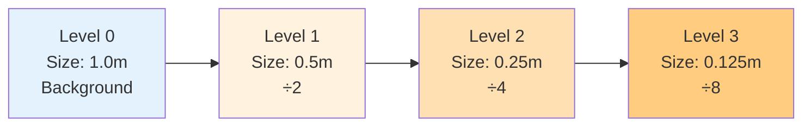

# การตั้งค่า Castellated Mesh (Castellated Mesh Settings)

> [!TIP] **ทำไมต้องให้ความสำคัญกับเรื่องนี้?**
> `castellatedMeshControls` คือ **"สมอง"** ของ SnappyHexMesh ที่กำหนดว่าความละเอียดของ Mesh จะกระจายตัวอย่างไรรอบๆ เรขาคณิต
>
> **ส่งผลโดยตรง:**
> - **ความแม่นยำของการจำลอง**: ความสามารถในการจับ Gradient และ Boundary Layer
> - **ต้นทุนการคำนวณ**: จำนวน Cell ส่งผลต่อเวลาที่ Solver ใช้
> - **คุณภาพ Mesh**: Refinement ที่ไม่เหมาะสมจะทำให้เกิด Skewness หรือ Non-orthogonality สูง
>
> **โดยสรุป**: นี่คือ "การตัดสินใจเชิงกลยุทธ์" ว่า "ตรงไหนควรละเอียด ตรงไหนควรหยาบ" เพื่อหาสมดุลระหว่างความแม่นยำและประสิทธิภาพ

หัวใจของการควบคุมความละเอียด (Resolution) ของ Mesh อยู่ที่ Dict ย่อยชื่อ `castellatedMeshControls` ในไฟล์ `snappyHexMeshDict`

ขั้นตอนนี้คือการระบุว่า "ตรงไหนควรละเอียดเท่าไหร่"

> **ลิงก์ที่เกี่ยวข้อง:**
> - ดูภาพรวม Workflow → [01_The_sHM_Workflow.md](./01_The_sHM_Workflow.md)
> - ดูวิธีเตรียม Geometry → [02_Geometry_Preparation.md](./02_Geometry_Preparation.md)
> - ดูเทคนิค Refinement Regions → [../04_SNAPPYHEXMESH_ADVANCED/02_Refinement_Regions.md](../04_SNAPPYHEXMESH_ADVANCED/02_Refinement_Regions.md)

---

## Learning Objectives

หลังจากอ่านบทนี้ คุณจะสามารถ:

- **อธิบาย** บทบาทและความสำคัญของ `castellatedMeshControls` ในกระบวนการสร้าง Mesh
- **ตั้งค่า** พารามิเตอร์พื้นฐาน (`maxGlobalCells`, `nCellsBetweenLevels`, `minRefinementCells`) ได้อย่างเหมาะสม
- **ประยุกต์** ใช้ `features`, `refinementSurfaces`, `refinementRegions` เพื่อกำหนดความละเอียด Mesh แบบ Local Refinement
- **เข้าใจ** ความแตกต่างระหว่าง Min Level และ Max Level ใน `refinementSurfaces`
- **คำนวณ** ขนาด Cell จาก Refinement Level และ Background Cell Size
- **กำหนด** `locationInMesh` และ `resolveFeatureAngle` เพื่อควบคุมคุณภาพ Mesh
- **แก้ไขปัญหา** ที่เกิดจากการตั้งค่า `castellatedMeshControls` ที่ไม่เหมาะสม

---

## 1. Parameters พื้นฐาน (Basic Parameters)

> [!NOTE] **📂 OpenFOAM Context**
>
> **ตำแหน่งไฟล์ (File Location):**
> - `system/snappyHexMeshDict` → `castellatedMeshControls` พจนานุกรมย่อย
>
> **คำสำคัญหลัก (Key Keywords):**
> - `maxGlobalCells` - จำนวน Cell สูงสุดทั้งหมด (ป้องกัน Memory Overflow)
> - `nCellsBetweenLevels` - จำนวนชั้น Buffer ระหว่าง Refinement level ต่างๆ
> - `maxLoadUnbalance` - พารามิเตอร์ Load Balancing สำหรับ Parallel
> - `minRefinementCells` - ค่า threshold จำนวน Cell ขั้นต่ำสำหรับ Refinement (กรอง Noise)
>
> **ขอบเขตผลกระทบ:**
> พารามิเตอร์เหล่านี้ควบคุม **พฤติกรรมทั่วไปของอัลกอริทึม SnappyHexMesh** ไม่ได้เจาะจงเฉพาะเรขาคณิต แต่ควบคุมการจัดสรรทรัพยากรและข้อจำกัดคุณภาพของกระบวนการสร้าง Mesh ทั้งหมด

### 1.1 โครงสร้างและตัวอย่างการตั้งค่า

```cpp
castellatedMeshControls
{
    // --- Global Resource Controls ---
    maxGlobalCells 2000000;    // จำนวน Cell สูงสุดทั้งหมด (Safety limit)
    minRefinementCells 10;     // ถ้า Refine แล้วได้ Cell น้อยกว่านี้ ไม่ต้องทำ (กรอง Noise)
    maxLoadUnbalance 0.10;     // สำหรับ Parallel running (0.0-1.0)
    nCellsBetweenLevels 3;     // Buffer layers ระหว่างความละเอียดต่างกัน
    
    // --- Features & Refinement Settings ---
    features
    (
        { file "car.eMesh"; level 3; }
    );
    
    refinementSurfaces
    {
        car_body
        {
            level (3 4);              // (min max)
            patchInfo { type wall; }
        }
    }
    
    refinementRegions
    {
        wakeBox { mode inside; levels ((1E15 2)); }
    }
    
    resolveFeatureAngle 30;
    
    locationInMesh (1.5 2.0 0.5);
}
```

### 1.2 `maxGlobalCells` - จำกัดจำนวน Cell สูงสุด

**What (อะไร):** จำนวน Cell สูงสุดทั้งหมดที่ SnappyHexMesh จะสร้าง

**Why (ทำไม):** เพื่อป้องกัน Memory Overflow และควบคุมขนาด Mesh ไม่ให้ใหญ่เกินไป

**How (อย่างไร):**
- สำหรับเครื่อง 8-16 GB RAM: 2-5 ล้าน Cell
- สำหรับเครื่อง 32-64 GB RAM: 10-20 ล้าน Cell
- หาก Mesh ถึงค่านี้ Refinement จะหยุดทันที แม้ยังไม่ถึง Level สูงสุด

**ค่าแนะนำ:**
| RAM | maxGlobalCells |
|-----|----------------|
| 8 GB | 2,000,000 |
| 16 GB | 5,000,000 |
| 32 GB | 10,000,000 |
| 64 GB+ | 20,000,000+ |

### 1.3 `minRefinementCells` - กรอง Noise

**What (อะไร):** ค่า threshold จำนวน Cell ขั้นต่ำสำหรับ Refinement

**Why (ทำไม):** เพื่อป้องกันการสร้าง Refinement ที่เล็กเกินไปและไม่มีประโยชน์

**How (อย่างไร):**
- ถ้าการ Refine แต่ละครั้งได้ Cell น้อยกว่าค่านี้ → ไม่ Refine
- ช่วยลดจำนวน Region เล็กๆ ที่ไม่จำเป็น

**ค่าแนะนำ:** 10 (Default)

### 1.4 `nCellsBetweenLevels` - Buffer Layers

**What (อะไร):** จำนวน Cell ที่ต้องแทรกระหว่าง Level $N$ และ Level $N+1$

**Why (ทำไม):** เพื่อให้การเปลี่ยนขนาด Cell นุ่มนวล (Smooth Grading)

**How (อย่างไร):**
- ค่านี้สำคัญมากต่อ Mesh Quality (Grading)
- สูงขึ้น = Grading นุ่มนวลขึ้น แต่จำนวน Cell เพิ่มขึ้น
- ต่ำเกินไป = ปัญหา 2:1 Refinement pattern ที่ทำให้เกิด Skewness

**ค่าแนะนำ:**
| ค่า | ผลลัพธ์ |
|-----|----------|
| 1 | กระชากมาก ไม่แนะนำ |
| 2 | ปานกลาง |
| **3** | **ค่าแนะนำ (Default)** |
| 4-5 | Grading นุ่มนวลมาก แต่ Cell จำนวนเพิ่ม |

### 1.5 `maxLoadUnbalance` - Load Balancing สำหรับ Parallel

**What (อะไร):** พารามิเตอร์ Load Balancing สำหรับ Parallel Running

**Why (ทำไม):** เพื่อกระจาย workload ให้สมดุลระหว่าง Processors

**How (อย่างไร):**
- ค่า 0.10 = 10% ความไม่สมดุลย์
- ค่าต่ำ = Load Balancing ดีขึ้น แต่ Decomposition ซับซ้อนขึ้น

**ค่าแนะนำ:** 0.10 (Default)

---

## 2. Explicit Feature Refinement (`features`)

> [!NOTE] **📂 OpenFOAM Context**
>
> **ตำแหน่งไฟล์ (File Location):**
> - `system/snappyHexMeshDict` → `castellatedMeshControls` → `features` รายการ
> - **ขั้นตอนก่อนหน้า**: ต้องรัน `surfaceFeatureExtract` เพื่อสร้างไฟล์ `.eMesh` ก่อน
>
> **คำสำคัญหลัก (Key Keywords):**
> - `file` - ระบุไฟล์ Feature Edge (รูปแบบ `.eMesh`)
> - `level` - ระบุ Refinement level รอบๆ เส้น Feature
>
> **ขอบเขตผลกระทบ:**
> การตั้งค่านี้ควบคุม **วิธีการจับเส้นขอบและเส้น Feature ของเรขาคณิต** เพื่อให้ Mesh สามารถอธิบายรายละเอียดของเรขาคณิตได้อย่างแม่นยำ โดยเฉพาะบริเวณที่มีการเปลี่ยนแปลงของความโค้งสูง

**What (อะไร):** การบังคับให้ Mesh ละเอียดรอบๆ เส้นขอบคม (Feature Edges) ที่สกัดมาจาก `surfaceFeatureExtract`

**Why (ทำไม):**
- เส้นขอบ (Feature Edges) เป็นส่วนสำคัญที่กำหนดรูปร่างของเรขาคณิต
- หากไม่ Refine เพียงพอ ผิวจะดูลื่นไหลไป (Smoothed out)
- สำคัญมากสำหรับ Snapping Phase

**How (อย่างไร):**

```cpp
features
(
    {
        file "car.eMesh";
        level 3; // Refine รอบๆ เส้นนี้ที่ Level 3
    }
    
    {
        file "wheel.eMesh";
        level 4;
    }
);
```

**สถานการณ์การใช้งานทั่วไป:**
| สถานการณ์ | ตัวอย่าง |
|-----------|---------|
| รถยนต์ Aerodynamics | ร่องรถ, ขอบหน้าต่าง |
| การบิน | ปลายปีกด้านหน้า, ด้านหลัง |
| เครื่องจักรที่หมุน | ขอบใบพัด |
| อุปกรณ์ Heat Exchanger | ขอบ Fin |

---

## 3. Surface Refinement (`refinementSurfaces`)

> [!NOTE] **📂 OpenFOAM Context**
>
> **ตำแหน่งไฟล์ (File Location):**
> - `system/snappyHexMeshDict` → `castellatedMeshControls` → `refinementSurfaces` พจนานุกรม
>
> **คำสำคัญหลัก (Key Keywords):**
> - `level (min max)` - ระบุ Refinement level ต่ำสุดและสูงสุดสำหรับแต่ละ patch
> - `patchInfo` - นิยามประเภท Boundary Condition (สร้างไฟล์ `polyMesh/boundary` อัตโนมัติ)
> - `type wall` / `type patch` - นิยามประเภท Boundary
>
> **ขอบเขตผลกระทบ:**
> นี่คือ **การตั้งค่าที่สำคัญที่สุดของ SnappyHexMesh** ที่กำหนดโดยตรง:
> - ความละเอียดของ Mesh บนผิวเรขาคณิต
> - คุณภาพเริ่มต้นของ Boundary Layer (ทำงานร่วมกับ `addLayersControls`)
> - การตั้งค่า Boundary Condition ของ Solver (สร้างอัตโนมัติผ่าน `patchInfo`)
>
> **การเชื่อมต่อกับ Solver:**
> ชื่อและประเภท Patch ที่ระบุใน `refinementSurfaces` จะปรากฏโดยตรงใน Boundary Condition ของไฟล์ `0/U`, `0/p`, `0/k` ฯลฯ ในขั้นตอน Solver!

**What (อะไร):** การกำหนดความละเอียดของพื้นผิวแต่ละ Patch

**Why (ทำไม):**
- ความละเอียดบนผิวส่งผลโดยตรงต่อความแม่นยำของการคำนวณ
- ผิวที่ละเอียดจะช่วยจับ Gradient และ Shear Stress ได้ดีกว่า
- เป็นฐานสำคัญสำหรับการสร้าง Boundary Layer

**How (อย่างไร):**

```cpp
refinementSurfaces
{
    car_body
    {
        level (3 4); // (min max)

        patchInfo
        {
            type wall; // กำหนด Type ใน polyMesh/boundary ให้อัตโนมัติ
        }
    }

    inlet
    {
        level (2 2);
    }
    
    outlet
    {
        level (2 2);
        patchInfo
        {
            type patch;
        }
    }
}
```

### 3.1 ความหมายของ Level (min max)

**Level System:**
- **Level 0:** ขนาดเท่า Background Mesh (blockMesh)
- **Level 1:** ขนาด $\frac{1}{2}$ ของเดิม (แตกเป็น 8 cell ย่อย)
- **Level 2:** ขนาด $\frac{1}{4}$ ของเดิม
- **Level $L$:** ขนาด $\frac{1}{2^L}$ ของเดิม

**สูตรคำนวณขนาด Cell:**
$$ \text{Cell Size at Level } L = \frac{\text{Background Cell Size}}{2^{\text{Level}}} $$

**ตัวอย่างการคำนวณ:**
| Background | Level | Cell Size |
|-----------|-------|-----------|
| 1.0 m | 0 | 1.000 m |
| 1.0 m | 1 | 0.500 m |
| 1.0 m | 2 | 0.250 m |
| 1.0 m | 3 | 0.125 m |
| 1.0 m | 4 | 0.0625 m |

**Refinement Levels Visualization:**


### 3.2 Min vs Max Level

**What (อะไร):** ระดับความละเอียดต่ำสุดและสูงสุดสำหรับแต่ละ Patch

**How (อย่างไร):**
- ปกติ sHM จะใช้ **Min Level** ก่อน
- จะใช้ **Max Level** ก็ต่อเมื่อ:
  1.  Curvature สูง (มุมหักศอก)
  2.  Cell ไม่สามารถจับ Shape ได้ดีพอ (ตามเกณฑ์ `resolveFeatureAngle`)

**ตัวอย่างการใช้งาน:**
```cpp
// รถยนต์: ผิวส่วนใหญ่ Level 3, บริเวณโค้งมาก Level 4
car_body
{
    level (3 4);
}

// ท่อ: ผิวทั้งหมด Level 2 สม่ำเสมอ
pipe_wall
{
    level (2 2);
}
```

### 3.3 `patchInfo` - กำหนดประเภท Boundary

**What (อะไร):** การนิยามประเภท Boundary Condition สำหรับแต่ละ Patch

**Why (ทำไม):** เพื่อให้ SnappyHexMesh สร้างไฟล์ `polyMesh/boundary` อัตโนมัติ

**How (อย่างไร):**

```cpp
refinementSurfaces
{
    wall_surface
    {
        level (3 4);
        patchInfo
        {
            type wall;           // ผิวกำแพง
        }
    }
    
    inlet_surface
    {
        level (2 2);
        patchInfo
        {
            type patch;          // ผิว Inlet/Outlet
        }
    }
    
    symmetry_surface
    {
        level (3 3);
        patchInfo
        {
            type symmetryPlane;  // ผิวสมมาตร
        }
    }
}
```

---

## 4. Feature Angle (`resolveFeatureAngle`)

> [!NOTE] **📂 OpenFOAM Context**
>
> **ตำแหน่งไฟล์ (File Location):**
> - `system/snappyHexMeshDict` → `castellatedMeshControls` → `resolveFeatureAngle`
>
> **คำสำคัญหลัก (Key Keywords):**
> - `resolveFeatureAngle` - ค่า Threshold ของมุม (หน่วย: องศา)
> - ใช้ร่วมกับ `(min max)` level ใน `refinementSurfaces`
>
> **กลไกการทำงาน:**
> พารามิเตอร์นี้ควบคุม **เมื่อไรที่จะอัปเกรดเป็น Max Level โดยอัตโนมัติ**:
> - SnappyHexMesh จะคำนวณค่ามุมของ Normal Vector บนผิวภายในแต่ละ Cell
> - หากการเปลี่ยนแปลงของมุม **เกิน** `resolveFeatureAngle` แสดงว่าบริเวณนั้นมีความโค้งสูงหรือเรขาคณิตซับซ้อน
> - อัลกอริทึมจะใช้ **Max Level** เพื่อ Refinement อัตโนมัติ
>
> **การทำงานร่วมกับ `refinementSurfaces`:**
> พารามิเตอร์นี้กำหนด **เงื่อนไขการทำงาน** ของ Max level ใน `level (min max)`!

**What (อะไร):** ค่ามุม (องศา) ที่ใช้ตัดสินใจว่าจะใช้ Max Level หรือไม่

**Why (ทำไม):** เพื่อให้ Mesh ละเอียดขึ้นโดยอัตโนมัติบริเวณที่มีความโค้งสูง

**How (อย่างไร):**
- SnappyHexMesh จะคำนวณค่ามุมของ Normal Vector บนผิวภายในแต่ละ Cell
- หากมุมระหว่าง Normal vector ของผิวภายใน Cell เดียวกันต่างกันเกินค่าที่กำหนด
- แสดงว่าบริเวณนั้นมีความโค้งสูง → **Refine เพิ่มเป็น Max Level!**

```cpp
resolveFeatureAngle 30;
```

**การตั้งค่าทั่วไป:**
| ค่า | กรณีใช้งาน | ผลลัพธ์ |
|-----|-------------|---------|
| **30** | ค่า Default | เหมาะสำหรับงานวิศวกรรมส่วนใหญ่ |
| **15-20** | เรขาคณิตซับซ้อน | เช่น ภายในห้องเครื่องยนต์ที่ซับซ้อน |
| **45-60** | เรขาคณิตง่าย | ลด Refinement ที่ไม่จำเป็น |

**ตัวอย่าง:**
```cpp
// เรขาคณิตซับซ้อน (มีมุมคมเยอะ)
resolveFeatureAngle 15;

// เรขาคณิตทั่วไป
resolveFeatureAngle 30;

// เรขาคณิตเรียบ (ทรงกลม, ทรงกระบอก)
resolveFeatureAngle 45;
```

**การเชื่อมโยงกับ Max Level:**
```
resolveFeatureAngle ─────► เงื่อนไขการใช้ Max Level
       │                           │
       ▼                           ▼
   ถ้ามุม > threshold ──► ใช้ Max Level (refinementSurfaces)
```

---

## 5. Region Refinement (`refinementRegions`)

> [!NOTE] **📂 OpenFOAM Context**
>
> **ตำแหน่งไฟล์ (File Location):**
> - `system/snappyHexMeshDict` → `castellatedMeshControls` → `refinementRegions` พจนานุกรม
> - ทำงานร่วมกับไฟล์เรขาคณิตใน `constant/triSurface/` หรือ `searchableSurface` ในส่วน `geometry`
>
> **คำสำคัญหลัก (Key Keywords):**
> - `mode` - ระบุโหมด Refinement (`inside`/`outside`/`distance`)
> - `levels` - ระบุ refinement level
>
> **ขอบเขตผลกระทบ:**
> การตั้งค่านี้ควบคุม **ความละเอียดของ Mesh ในปริมาตร** เสริมให้กับ `refinementSurfaces` (surface refinement):
>
> **การเชื่อมต่อกับ Solver:**
> `refinementRegions` ส่งผลต่อความสามารถในการจับกระแสการไหล:
> - Wake refinement → ส่งผลต่อความแม่นยำของการคำนวณ Lift, Drag
> - Shear Layer refinement → ส่งผลต่อประสิทธิภาพของ Turbulence Model
> - Boundary Layer 附近 refinement → ให้ฐานที่ดีกว่าสำหรับ `addLayersControls`

**What (อะไร):** การกำหนดความละเอียด **ภายในปริมาตร** (Volume Refinement) ไม่ใช่แค่ผิว

**Why (ทำไม):**
- เพื่อจับกระแสการไหลในบริเวณสำคัญ เช่น Wake, Shear Layer
- เพื่อเพิ่มความละเอียดในบริเวณที่มีการไหลซับซ้อน
- เสริมให้กับ `refinementSurfaces` (surface refinement)

**How (อย่างไร):**
- ใช้รูปทรง (`searchableSurface`) เช่น box, sphere, cylinder มากำหนดโซน
- ระบุโหมด (`mode`) และระดับความละเอียด (`levels`)

### 5.1 โครงสร้างและตัวอย่าง

```cpp
// ในส่วน geometry ก่อน
geometry
{
    wakeBox
    {
        type searchableBox;
        min (2.0 -0.5 -0.5);
        max (5.0 0.5 0.5);
    }
    
    refinementSphere
    {
        type searchableSphere;
        centre (1.0 0.0 0.0);
        radius 0.5;
    }
}

// ใน castellatedMeshControls
refinementRegions
{
    wakeBox
    {
        mode inside;
        levels ((1E15 2)); // Refine level 2 ภายใน Box
    }
    
    refinementSphere
    {
        mode distance;
        levels ((0.1 3) (0.2 2) (0.5 1)); // 3 ชั้นตามระยะ
    }
}
```

### 5.2 Modes ของ RefinementRegions

| Mode | ความหมาย | ตัวอย่างการใช้งาน |
|------|----------|-------------------|
| **inside** | ภายในผิวปิด | Wake region ด้านหลังรถ, ภายในห้องเผาไหม้ |
| **outside** | ภายนอกผิวปิด | ใกล้ขอบเขต Domain |
| **distance** | ตามระยะห่างจากผิว | สร้างหลายชั้นรอบๆ วัตถุ |

### 5.3 สถานการณ์การใช้งานจริง

**รถยนต์ Aerodynamics:**
```cpp
refinementRegions
{
    wakeBox
    {
        mode inside;
        levels ((1E15 2)); // Level 2 ใน Wake
    }
}
```

**กังหันลม:**
```cpp
refinementRegions
{
    rotorZone
    {
        mode distance;
        // 0-10m: Level 4, 10-20m: Level 3, 20-50m: Level 2
        levels ((10.0 4) (20.0 3) (50.0 2));
    }
}
```

**Heat Exchanger:**
```cpp
refinementRegions
{
    coreRegion
    {
        mode inside;
        levels ((1E15 3)); // Level 3 ในแกนกลาง
    }
}
```

### 5.4 Distance Mode แบบละเอียด

```cpp
refinementRegions
{
    sphereAroundObject
    {
        mode distance;
        // (ระยะทาง Level)
        // 0-0.05m: Level 5
        // 0.05-0.1m: Level 4
        // 0.1-0.2m: Level 3
        // 0.2-0.5m: Level 2
        levels ((0.05 5) (0.1 4) (0.2 3) (0.5 2));
    }
}
```

---

## 6. Location In Mesh (`locationInMesh`)

> [!NOTE] **📂 OpenFOAM Context**
>
> **ตำแหน่งไฟล์ (File Location):**
> - `system/snappyHexMeshDict` → `castellatedMeshControls` → `locationInMesh`
>
> **คำสำคัญหลัก (Key Keywords):**
> - `locationInMesh` - พิกัดจุด `(x y z)`
> - ทำงานร่วมกับอัลกอริทึมการลบของ `castellatedMesh`
>
> **กลไกการทำงาน:**
> นี่คือ **"Seed Point" (จุดเริ่มต้น)** ของ SnappyHexMesh:
> - SnappyHexMesh เริ่ม "เติมเต็ม" Fluid Domain จากจุดนี้
> - บริเวณที่จุดนี้อยู่จะถูกเก็บเป็น **Fluid**
> - บริเวณที่เรขาคณิตครอบครองจะถูกลบ (กลายเป็น Solid)
>
> **เทคนิคการ Debug:**
> หากการสร้าง Mesh ล้มเหลว ให้ตรวจสอบ `locationInMesh` ก่อนเป็นอันดับแรก! นี่คือ **แหล่งที่มาของข้อผิดพลาดที่พบบ่อยที่สุด**

**What (อะไร):** จุดพิกัดที่ระบุว่า "ตรงไหนคือ Fluid"

**Why (ทำไม):** SnappyHexMesh ใช้จุดนี้เพื่อตัดสินใจว่า Cell ไหนคือ Fluid (คงไว้) และ Cell ไหนคือ Solid (ลบทิ้ง)

**How (อย่างไร):**

```cpp
locationInMesh (1.5 2.0 0.5);
```

**กฎการตั้งค่า:**
| สถานการณ์ | ตำแหน่งจุด | ตัวอย่าง |
|-----------|------------|---------|
| **External Flow** | ใน Fluid Domain (ไม่ใช่ภายในเรขาคณิต) | ด้านหน้ารถ |
| **Internal Flow** | ใน Fluid (ไม่ใช่ภายในผนังท่อ) | ตรงกลางท่อ |
| **Multi-region** | ใช้ `locationInMesh` รายการ | หนึ่งจุดต่อบริเวณ |

**ข้อควรระวัง:**
- ❌ จุดตกอยู่บนผิวเรขาคณิต → จะทำให้ล้มเหลว
- ❌ จุดตกอยู่บน Face หรือ Node ของ Background Mesh → ต้องปรับพิกัดเล็กน้อย
- ✅ แนะนำให้ใช้ ParaView ดูเรขาคณิต แล้วเลือกจุดใน Fluid Domain ที่ชัดเจน

**เทคนิคการตั้งค่าที่ดี:**
```cpp
// ❌ ไม่ดี - อาจไปทับ Face/Node ของ Background mesh
locationInMesh (1.0 0.5 0.0);

// ✅ ดี - เลขทศนิยมหลีกเลี่ยงจุดอย่าง 0.0, 0.5, 1.0
locationInMesh (1.00134 0.50287 0.00123);
```

**Multi-region Mesh:**
```cpp
// สำหรับ Multi-region (เช่น 2 fluids คนละชนิด)
locationInMesh
(
    (1.5 2.0 0.5)    // Fluid region 1
    (3.0 1.0 0.5)    // Fluid region 2
);
```

---

## 📌 Key Takeaways: คำแนะนำการตั้งค่า

### สรุปพารามิเตอร์สำคัญ

| พารามิเตอร์ | ค่าแนะนำ | ผลกระทบ |
|-----------|----------|---------|
| **maxGlobalCells** | 2M-20M (ตาม RAM) | ป้องกัน Memory Overflow |
| **nCellsBetweenLevels** | 3 (Default) | Grading นุ่มนวล |
| **minRefinementCells** | 10 | กรอง Noise |
| **resolveFeatureAngle** | 15-45 | ควบคุมการใช้ Max Level |
| **locationInMesh** | ใช้เลขทศนิยมหลีกเลี่ยง 0.0, 0.5 | ป้องกัน Mesh หาย |

### แนวทางการตั้งค่าตามสถานการณ์

**External Aerodynamics (รถยนต์, อากาศยาน):**
```cpp
maxGlobalCells 10000000;
nCellsBetweenLevels 3;
resolveFeatureAngle 20;

refinementSurfaces
{
    vehicle_body { level (4 5); }
}

refinementRegions
{
    wakeBox { mode inside; levels ((1E15 3)); }
}

locationInMesh (0.00134 0.50287 0.00123);
```

**Internal Flow (ท่อ, Heat Exchanger):**
```cpp
maxGlobalCells 5000000;
nCellsBetweenLevels 2;
resolveFeatureAngle 30;

refinementSurfaces
{
    pipe_wall { level (3 3); }
}

refinementRegions
{
    coreRegion { mode inside; levels ((1E15 4)); }
}

locationInMesh (0.0 0.0 0.00123); // ตรงกลางท่อ
```

**Complex Geometry (เครื่องยนต์, ภายในซับซ้อน):**
```cpp
maxGlobalCells 20000000;
nCellsBetweenLevels 4;
resolveFeatureAngle 15; // ต่ำ เพราะซับซ้อน

features
(
    { file "complex.eMesh"; level 4; }
);

refinementSurfaces
{
    complex_surface { level (4 6); }
}

locationInMesh (1.23456 2.34567 0.12345);
```

### กลยุทธ์การเริ่มต้น (Starting Strategy)

1. **เริ่มจากความหยาบ**: ใช้ Level ต่ำๆ ก่อน (เช่น 1-2)
2. **ทดสอบ locationInMesh**: ตรวจสอบว่า Mesh ถูกต้อง
3. **เพิ่มความละเอียด**: ค่อยๆ เพิ่ม Level ขึ้น
4. **ตรวจสอบ maxGlobalCells**: ไม่ให้เกินข้อจำกัด
5. **ปรับ resolveFeatureAngle**: ตามความซับซ้อนของเรขาคณิต

---

## 🧠 Concept Check: ทดสอบความเข้าใจ

### แบบฝึกหัดระดับง่าย (Easy)

1. **True/False**: `nCellsBetweenLevels` คือจำนวน Cell ระหว่าง Level ต่างๆ
   <details>
   <summary>คำตอบ</summary>
   ✅ จริง - เป็น buffer layers เพื่อให้ grading นุ่มนวลขึ้น
   </details>

2. **เลือกตอบ**: ถ้า Background Mesh ขนาด 1m และกำหนด Level = 3 ขนาด Cell จะเป็นเท่าไหร่?
   - a) 0.5 m
   - b) 0.25 m
   - c) 0.125 m
   - d) 0.0625 m
   <details>
   <summary>คำตอบ</summary>
   ✅ c) 0.125 m = 1/2³ = 1/8
   </details>

### แบบฝึกหัดระดับปานกลาง (Medium)

3. **อธิบาย**: แตกต่างระหว่าง Min Level กับ Max Level ใน `refinementSurfaces` คืออะไร?
   <details>
   <summary>คำตอบ</summary>
   Min Level = ความละเอียดพื้นฐาน (ใช้กับทั้ง Patch)<br/>
   Max Level = ความละเอียดสูงสุด (ใช้เมื่อผิวโค้งจัดหรือมีมุมคม ตาม `resolveFeatureAngle`)
   </details>

4. **คำนวณ**: ถ้า `resolveFeatureAngle = 30` และผิวมีมุมหัก 45 องศา sHM จะใช้ Level ไหน?
   <details>
   <summary>คำตอบ</summary>
   Max Level - เพราะมุมเปลี่ยน 45° ซึ่ง **เกินกว่า** 30° (resolveFeatureAngle) แปลว่าเป็นบริเวณโค้งจัดที่ต้องการความละเอียดเพิ่ม
   </details>

5. **อธิบาย**: Mode ทั้ง 3 ของ `refinementRegions` แตกต่างกันอย่างไร?
   <details>
   <summary>คำตอบ</summary>
   - **inside**: Refine ภายในโซนที่กำหนด (เช่น wake box)<br/>
   - **outside**: Refine ภายนอกโซน (ใกล้ขอบ Domain)<br/>
   - **distance**: Refine ตามระยะห่างจากผิว (สร้างหลายชั้น)
   </details>

### แบบฝึกหัดระดับสูง (Hard)

6. **Hands-on**: สร้าง `snappyHexMeshDict` สำหรับกล่องที่มี sphere ตรงกลาง โดยกำหนด refinement levels 3 ระดับ (ภายใน, กลาง, นอก) แล้วรันดูผล
   <details>
   <summary>คำใบ้</summary>
   ใช้ `refinementRegions` 3 อัน แต่ละอันใช้ `mode inside` และกำหนด `level` ต่างกัน หรือใช้ `mode distance` กับ `levels` หลายค่า
   </details>

7. **วิเคราะห์**: เปรียบเทียบผลกระทบของการเพิ่ม `nCellsBetweenLevels` จาก 2 เป็น 5 ต่อคุณภาพ Mesh และเวลาคำนวณ
   <details>
   <summary>คำตอบ</summary>
   - **คุณภาพ Mesh**: ดีขึ้น เพราะ Grading นุ่มนวลขึ้น ลด Skewness<br/>
   - **เวลาคำนวณ**: เพิ่มขึ้น เพราะจำนวน Cell เพิ่มขึ้นในบริเวณ Transition<br/>
   - **การใช้งาน**: ควร Balance ระหว่างคุณภาพและเวลา ค่า 3-4 มักเหมาะสม
   </details>

8. **Debug**: หาก Mesh ถูกสร้างแต่ Fluid Domain หายไปหมด (เหลือแต่ Solid) ปัญหาน่าจะเกิดจากอะไร?
   <details>
   <summary>คำตอบ</summary>
   ปัญหาน่าจะเกิดจาก `locationInMesh` ถูกตั้งไว้ **ภายใน** Solid (เรขาคณิต) แทนที่จะอยู่ใน Fluid Domain ให้ตรวจสอบพิกัดและย้ายจุดไปยัง Fluid Region
   </details>

---

## 📖 เอกสารที่เกี่ยวข้อง

- **บทก่อนหน้า**: [02_Geometry_Preparation.md](02_Geometry_Preparation.md)
- **บทถัดไป**: [../04_SNAPPYHEXMESH_ADVANCED/01_Layer_Addition_Strategy.md](../04_SNAPPYHEXMESH_ADVANCED/01_Layer_Addition_Strategy.md)
- **ดู Refinement Regions ขั้นสูง**: [../04_SNAPPYHEXMESH_ADVANCED/02_Refinement_Regions.md](../04_SNAPPYHEXMESH_ADVANCED/02_Refinement_Regions.md)