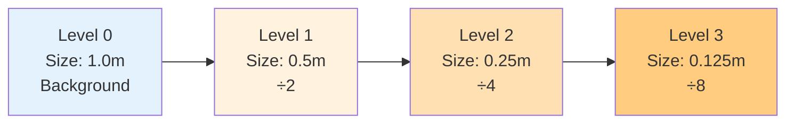

# การตั้งค่า Castellated Mesh (Castellated Mesh Settings)

> [!TIP]为什么这很重要？
> **为什么这很重要？**
>
> `castellatedMeshControls` 是 **SnappyHexMesh 的核心大脑**，决定了网格分辨率如何在几何体周围分布。
> 直接影响：
> - **仿真精度**：梯度、边界层的捕捉能力
> - **计算成本**：cell 数量直接影响求解时间
> - **网格质量**：不合理的 refinement 会导致高 skewness 或 non-orthogonality
>
> **简单来说**：这是"在哪里要多细、在哪里可以粗"的战略决策，平衡精度与效率的关键。

หัวใจของการควบคุมความละเอียด (Resolution) ของ Mesh อยู่ที่ Dict ย่อยชื่อ `castellatedMeshControls` ในไฟล์ `snappyHexMeshDict`

ขั้นตอนนี้คือการระบุว่า "ตรงไหนควรละเอียดเท่าไหร่"

> **ลิงก์ที่เกี่ยวข้อง**:
> - ดูวิธีเตรียม Geometry → [02_Geometry_Preparation.md](./02_Geometry_Preparation.md)
> - ดูเทคนิค Refinement Regions → [../04_SNAPPYHEXMESH_ADVANCED/02_Refinement_Regions.md](../04_SNAPPYHEXMESH_ADVANCED/02_Refinement_Regions.md)

## 1. Parameters พื้นฐาน

> [!NOTE] **📂 OpenFOAM Context**
>
> **文件位置 (File Location):**
> - `system/snappyHexMeshDict` → `castellatedMeshControls` 子字典
>
> **核心关键词 (Key Keywords):**
> - `maxGlobalCells` - 全局 cell 数量上限（防止内存溢出）
> - `nCellsBetweenLevels` - 不同 refinement level 之间的缓冲层数量
> - `maxLoadUnbalance` - 并行计算时的负载平衡参数
> - `minRefinementCells` - 最小 refinement cell 数量阈值（过滤噪声）
>
> **影响范围：**
> 这些参数控制 **SnappyHexMesh 算法的全局行为**，不针对特定几何，而是控制整个网格生成过程的资源分配和质量约束。

```cpp
castellatedMeshControls
{
    maxGlobalCells 2000000; // ถ้าเกินนี้จะหยุด Mesh (Safety limit)
    minRefinementCells 10;  // ถ้า Refine แล้วได้ Cell น้อยกว่านี้ ไม่ต้องทำ (กรอง Noise)
    maxLoadUnbalance 0.10;  // สำหรับ Parallel running
    nCellsBetweenLevels 3;  // Buffer layers ระหว่างความละเอียดต่างกัน

    // ... features & refinementSurfaces ...
}
```

### `nCellsBetweenLevels` (Buffer Layers)
ค่านี้สำคัญมากต่อ Mesh Quality (Grading)
*   คือจำนวน Cell ที่ต้องแทรกระหว่าง Level $N$ และ Level $N+1$
*   **ค่าแนะนำ:** อย่างน้อย 3 (Default) หรือมากกว่า
*   **ผลลัพธ์:** ช่วยให้การเปลี่ยนขนาด Cell ไม่กระชากเกินไป ลดปัญหา 2:1 Refinement pattern ที่ทำให้เกิด Skewness

## 2. Explicit Feature Refinement (`features`)

> [!NOTE] **📂 OpenFOAM Context**
>
> **文件位置 (File Location):**
> - `system/snappyHexMeshDict` → `castellatedMeshControls` → `features` 列表
> - **前置步骤**：需要先运行 `surfaceFeatureExtract` 生成 `.eMesh` 文件
>
> **核心关键词 (Key Keywords):**
> - `file` - 指定特征边文件（`.eMesh` 格式）
> - `level` - 指定特征边周围的 refinement level
>
> **影响范围：**
> 这个设置控制 **如何捕捉几何体的尖锐边缘和特征线**，确保网格能准确描述几何细节，特别是在曲率突变区域（如汽车车身的棱边、翼型前缘等）。
>
> **典型应用场景：**
> - 汽车外气动：车身腰线、车窗边缘
> - 航空航天：机翼前缘、后缘
> - 旋转机械：叶片边缘

ใช้เพื่อบังคับให้ Mesh ละเอียดรอบๆ เส้นขอบคม (Feature Edges) ที่สกัดมาจาก `surfaceFeatureExtract`

```cpp
features
(
    {
        file "car.eMesh";
        level 3; // Refine รอบๆ เส้นนี้ที่ Level 3
    }
);
```

## 3. Surface Refinement (`refinementSurfaces`)

> [!NOTE] **📂 OpenFOAM Context**
>
> **文件位置 (File Location):**
> - `system/snappyHexMeshDict` → `castellatedMeshControls` → `refinementSurfaces` 字典
>
> **核心关键词 (Key Keywords):**
> - `level (min max)` - 指定每个 patch 的最小和最大 refinement level
> - `patchInfo` - 定义边界条件类型（自动创建 `polyMesh/boundary` 文件）
> - `type wall` / `type patch` - 边界类型定义
>
> **影响范围：**
> 这是 **SnappyHexMesh 最关键的设置**，直接决定：
> - 几何表面的网格分辨率
> - 边界层的起始质量（与后续 `addLayersControls` 配合）
> - 求解器的边界条件设置（通过 `patchInfo` 自动生成）
>
> **关键点：**
> - Min level：基础分辨率，用于大部分表面
> - Max level：高曲率或尖锐区域自动使用
> - `patchInfo` 直接影响后续 `0/` 目录中的边界条件文件
>
> **与求解器的连接：**
> `refinementSurfaces` 中定义的 patch 名称和类型会直接出现在求解阶段的 `0/U`、`0/p`、`0/k` 等文件的边界条件中！

ส่วนที่สำคัญที่สุด ใช้กำหนดความละเอียดของพื้นผิวแต่ละ Patch

```cpp
refinementSurfaces
{
    car_body
    {
        level (3 4); // (min max)

        patchInfo
        {
            type wall; // กำหนด Type ใน polyMesh/boundary ให้อัตโนมัติ
        }
    }

    inlet
    {
        level (2 2);
    }
}
```

### ความหมายของ Level (min max)
*   **Level 0:** ขนาดเท่า Background Mesh (blockMesh)
*   **Level 1:** ขนาด $\frac{1}{2}$ ของเดิม (แบ่ง 8 cell ย่อย)
*   **Level $L$:** ขนาด $\frac{1}{2^L}$

### สูตรคำนวณขนาด Cell:
$$ \text{Cell Size} = \frac{\text{Background Cell Size}}{2^{\text{Level}}} $$

**Refinement Levels Visualization:**


**Min vs Max Level:**
*   ปกติ sHM จะใช้ **Min Level** ก่อน
*   จะใช้ **Max Level** ก็ต่อเมื่อ:
    1.  Curvature สูง (มุมหักศอก)
    2.  Cell ไม่สามารถจับ Shape ได้ดีพอ (ตามเกณฑ์ `resolveFeatureAngle`)

## 4. Feature Angle (`resolveFeatureAngle`)

> [!NOTE] **📂 OpenFOAM Context**
>
> **文件位置 (File Location):**
> - `system/snappyHexMeshDict` → `castellatedMeshControls` → `resolveFeatureAngle`
>
> **核心关键词 (Key Keywords):**
> - `resolveFeatureAngle` - 角度阈值（单位：度）
> - 与 `refinementSurfaces` 中的 `(min max)` level 配合使用
>
> **工作机制：**
> 这个参数控制 **何时自动升级到 Max Level**：
> - SnappyHexMesh 会计算每个 cell 内表面的法向量变化角度
> - 如果角度变化 **超过** `resolveFeatureAngle`，说明该区域曲率高或几何特征复杂
> - 算法自动使用 **Max Level** 进行 refinement
>
> **典型设置：**
> - `30`（默认值）：适用于大多数工程应用
> - `15-20`：复杂几何（如复杂的发动机舱内部）
> - `45-60`：简单几何，减少不必要的 refinement
>
> **与 `refinementSurfaces` 的协同：**
> 这个参数决定了 `level (min max)` 中 Max level 的 **触发条件**！

```cpp
resolveFeatureAngle 30;
```
*   ค่ามุม (องศา) ที่ใช้ตัดสินใจว่าจะใช้ Max Level หรือไม่
*   ถ้ามุมระหว่าง Normal vector ของผิว ภายใน Cell เดียวกัน มันต่างกันเกิน 30 องศา (ผิวโค้งจัด) -> **Refine เพิ่มเป็น Max Level!**
*   **ค่าแนะนำ:** 30 (Default) หรือลดลงเหลือ 15-20 สำหรับผิวที่ซับซ้อนมาก

## 5. Region Refinement (`refinementRegions`)

> [!NOTE] **📂 OpenFOAM Context**
>
> **文件位置 (File Location):**
> - `system/snappyHexMeshDict` → `castellatedMeshControls` → `refinementRegions` 字典
>
> **核心关键词 (Key Keywords):**
> - `mode` - 指定 refinement 模式（`inside`/`outside`/`distance`）
> - `levels` - 指定 refinement level
> - 与 `constant/triSurface/` 中的几何文件配合使用
>
> **影响范围：**
> 这个设置控制 **体积区域的网格分辨率**，与 `refinementSurfaces`（表面 refinement）形成互补：
>
> **三种模式的应用场景：**
> - `inside`：尾迹区域、燃烧室内部、管道核心流区
> - `outside`：外场（Domain 边界附近）
> - `distance`：基于距离的梯度 refinement（例如：在物体周围创建多层加密区域）
>
> **典型应用案例：**
> - **汽车外气动**：在车身后方创建 `wakeBox`，`mode inside`，捕捉尾迹涡流
> - **风力发电机**：在转子周围创建圆柱形 `distance` refinement，捕捉叶片尾迹
> - **换热器**：在管束之间创建 `box` refinement，捕捉复杂流动
>
> **与求解器的连接：**
> `refinementRegions` 直接影响流动现象的捕捉能力：
> - 尾迹 refinement → 影响升力、阻力的计算精度
> - 剪切层 refinement → 影响湍流模型的性能
> - 边界层附近 refinement → 为 `addLayersControls` 提供更好的基础网格

ใช้กำหนดความละเอียด **ภายในปริมาตร** (Volume Refinement) ไม่ใช่แค่ผิว
*   ใช้รูปทรง (`searchableSurface`) เช่น box, sphere, cylinder มากำหนดโซน

```cpp
refinementRegions
{
    wakeBox
    {
        mode inside;
        levels ((1E15 2)); // Refine level 2 ภายใน Box
    }
}
```
*   **Modes:**
    *   `inside`: ภายในผิวปิด
    *   `outside`: ภายนอกผิวปิด
    *   `distance`: ตามระยะห่างจากผิว (Distance-based refinement)

## 6. Location In Mesh (`locationInMesh`)

> [!NOTE] **📂 OpenFOAM Context**
>
> **文件位置 (File Location):**
> - `system/snappyHexMeshDict` → `castellatedMeshControls` → `locationInMesh`
>
> **核心关键词 (Key Keywords):**
> - `locationInMesh` - 坐标点 `(x y z)`
> - 与 `castellatedMesh` 删除算法配合使用
>
> **工作机制：**
> 这是 **SnappyHexMesh 的"种子点"（Seed Point）**：
> - SnappyHexMesh 从这个点开始"填充"流体域
> - 该点所在区域会被保留为 **Fluid**
> - 其他被几何体占据的区域会被删除（变成 Solid）
>
> **关键点：**
> - **External Flow**：点必须在流体域中（不在几何体内部）
> - **Internal Flow**：点必须在流体区域内（不在管道壁内）
> - **Multi-region**：需要使用 `locationInMesh` 列表为每个区域指定种子点
>
> **常见错误：**
> - ❌ 点落在几何体表面上（会导致失败）
> - ❌ 点落在背景网格的 face 或 node 上（需要微调坐标）
> - ✅ 建议使用 ParaView 查看几何，然后手动选取一个清晰的流体域点
>
> **调试技巧：**
> 如果网格生成失败，首先检查 `locationInMesh` 是否正确！这是 **最常见的错误源**。

```cpp
locationInMesh (1.5 2.0 0.5);
```
*   จุดพิกัดที่ระบุว่า "ตรงไหนคือ Fluid"
*   จุดนี้ต้องไม่อยู่ใน Solid part (ถ้าเราทำ External Aerodynamics)
*   จุดนี้ต้องไม่อยู่ใน Fluid part (ถ้าเราทำ Internal Flow... เอ๊ะ เดี๋ยว! ต้องอยู่ใน Fluid เสมอสิ!)
*   **สรุป:** จุดนี้ต้องอยู่ใน Domain ที่เราต้องการคำนวณ
*   **ข้อควรระวัง:** ห้ามให้จุดนี้ไปทับกับ Face หรือ Node ของ Background mesh เป๊ะๆ ให้ขยับเลขทศนิยมหนีหน่อย

---
การตั้งค่า Castellated Mesh ที่ดี คือการหาจุดสมดุลระหว่าง "รายละเอียดที่ต้องการ" กับ "จำนวน Cell ที่รับไหว" (Cost)

> **ลิงก์เพิ่มเติม**:
> - ดูตัวอย่าง Refinement Regions ขั้นสูง → [../04_SNAPPYHEXMESH_ADVANCED/02_Refinement_Regions.md](../04_SNAPPYHEXMESH_ADVANCED/02_Refinement_Regions.md)

## 🧠 Concept Check: ทดสอบความเข้าใจ

### แบบฝึกหัดระดับง่าย (Easy)
1. **True/False**: `nCellsBetweenLevels` คือจำนวน Cell ระหว่าง Level ต่างๆ
   <details>
   <summary>คำตอบ</summary>
   ✅ จริง - เป็น buffer layers เพื่อให้ grading นุ่มนวลขึ้น
   </details>

2. **เลือกตอบ**: ถ้า Background Mesh ขนาด 1m และกำหนด Level = 3 ขนาด Cell จะเป็นเท่าไหร่?
   - a) 0.5 m
   - b) 0.25 m
   - c) 0.125 m
   - d) 0.0625 m
   <details>
   <summary>คำตอบ</summary>
   ✅ c) 0.125 m = 1/2³ = 1/8
   </details>

### แบบฝึกหัดระดับปานกลาง (Medium)
3. **อธิบาย**: แตกต่างระหว่าง Min Level กับ Max Level ใน `refinementSurfaces` คืออะไร?
   <details>
   <summary>คำตอบ</summary>
   Min Level = ความละเอียดพื้นฐาน, Max Level = ความละเอียดสูงสุด (ใช้เมื่อผิวโค้งจัดหรือมีมุมคม)
   </details>

4. **คำนวณ**: ถ้า `resolveFeatureAngle = 30` และผิวมีมุมหัก 45 องศา sHM จะใช้ Level ไหน?
   <details>
   <summary>คำตอบ</summary>
   Max Level - เพราะ 45° < 30° แปลว่าเป็นมุมคมที่ต้องการความละเอียดเพิ่ม
   </details>

### แบบฝึกหัดระดับสูง (Hard)
5. **Hands-on**: สร้าง `snappyHexMeshDict` สำหรับกล่องที่มี sphere ตรงกลาง โดยกำหนด refinement levels 3 ระดับ (ภายนำ, กลาง, นอก) แล้วรันดูผล


---

## 📖 เอกสารที่เกี่ยวข้อง

*   **บทก่อนหน้า**: [02_Geometry_Preparation.md](02_Geometry_Preparation.md)
*   **บทถัดไป**: [../04_SNAPPYHEXMESH_ADVANCED/01_Layer_Addition_Strategy.md](../04_SNAPPYHEXMESH_ADVANCED/01_Layer_Addition_Strategy.md)