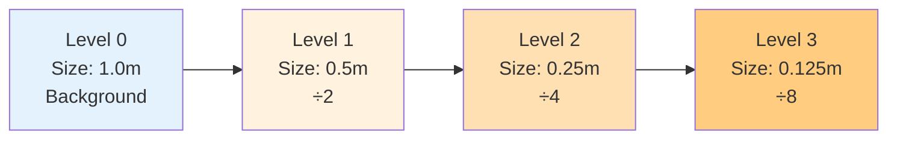

# การตั้งค่า Castellated Mesh (Castellated Mesh Settings)

หัวใจของการควบคุมความละเอียด (Resolution) ของ Mesh อยู่ที่ Dict ย่อยชื่อ `castellatedMeshControls` ในไฟล์ `snappyHexMeshDict`

ขั้นตอนนี้คือการระบุว่า "ตรงไหนควรละเอียดเท่าไหร่"

> **ลิงก์ที่เกี่ยวข้อง**:
> - ดูวิธีเตรียม Geometry → [02_Geometry_Preparation.md](./02_Geometry_Preparation.md)
> - ดูเทคนิค Refinement Regions → [../04_SNAPPYHEXMESH_ADVANCED/02_Refinement_Regions.md](../04_SNAPPYHEXMESH_ADVANCED/02_Refinement_Regions.md)

## 1. Parameters พื้นฐาน

```cpp
castellatedMeshControls
{
    maxGlobalCells 2000000; // ถ้าเกินนี้จะหยุด Mesh (Safety limit)
    minRefinementCells 10;  // ถ้า Refine แล้วได้ Cell น้อยกว่านี้ ไม่ต้องทำ (กรอง Noise)
    maxLoadUnbalance 0.10;  // สำหรับ Parallel running
    nCellsBetweenLevels 3;  // Buffer layers ระหว่างความละเอียดต่างกัน
    
    // ... features & refinementSurfaces ...
}
```

### `nCellsBetweenLevels` (Buffer Layers)
ค่านี้สำคัญมากต่อ Mesh Quality (Grading)
*   คือจำนวน Cell ที่ต้องแทรกระหว่าง Level $N$ และ Level $N+1$
*   **ค่าแนะนำ:** อย่างน้อย 3 (Default) หรือมากกว่า
*   **ผลลัพธ์:** ช่วยให้การเปลี่ยนขนาด Cell ไม่กระชากเกินไป ลดปัญหา 2:1 Refinement pattern ที่ทำให้เกิด Skewness

## 2. Explicit Feature Refinement (`features`)

ใช้เพื่อบังคับให้ Mesh ละเอียดรอบๆ เส้นขอบคม (Feature Edges) ที่สกัดมาจาก `surfaceFeatureExtract`

```cpp
features
(
    {
        file "car.eMesh";
        level 3; // Refine รอบๆ เส้นนี้ที่ Level 3
    }
);
```

## 3. Surface Refinement (`refinementSurfaces`)

ส่วนที่สำคัญที่สุด ใช้กำหนดความละเอียดของพื้นผิวแต่ละ Patch

```cpp
refinementSurfaces
{
    car_body
    {
        level (3 4); // (min max)
        
        patchInfo
        {
            type wall; // กำหนด Type ใน polyMesh/boundary ให้อัตโนมัติ
        }
    }
    
    inlet
    {
        level (2 2);
    }
}
```

### ความหมายของ Level (min max)
*   **Level 0:** ขนาดเท่า Background Mesh (blockMesh)
*   **Level 1:** ขนาด $\frac{1}{2}$ ของเดิม (แบ่ง 8 cell ย่อย)
*   **Level $L$:** ขนาด $\frac{1}{2^L}$

### สูตรคำนวณขนาด Cell:
$$ \text{Cell Size} = \frac{\text{Background Cell Size}}{2^{\text{Level}}} $$

**Refinement Levels Visualization:**


**Min vs Max Level:**
*   ปกติ sHM จะใช้ **Min Level** ก่อน
*   จะใช้ **Max Level** ก็ต่อเมื่อ:
    1.  Curvature สูง (มุมหักศอก)
    2.  Cell ไม่สามารถจับ Shape ได้ดีพอ (ตามเกณฑ์ `resolveFeatureAngle`)

## 4. Feature Angle (`resolveFeatureAngle`)

```cpp
resolveFeatureAngle 30;
```
*   ค่ามุม (องศา) ที่ใช้ตัดสินใจว่าจะใช้ Max Level หรือไม่
*   ถ้ามุมระหว่าง Normal vector ของผิว ภายใน Cell เดียวกัน มันต่างกันเกิน 30 องศา (ผิวโค้งจัด) -> **Refine เพิ่มเป็น Max Level!**
*   **ค่าแนะนำ:** 30 (Default) หรือลดลงเหลือ 15-20 สำหรับผิวที่ซับซ้อนมาก

## 5. Region Refinement (`refinementRegions`)

ใช้กำหนดความละเอียด **ภายในปริมาตร** (Volume Refinement) ไม่ใช่แค่ผิว
*   ใช้รูปทรง (`searchableSurface`) เช่น box, sphere, cylinder มากำหนดโซน

```cpp
refinementRegions
{
    wakeBox
    {
        mode inside;
        levels ((1E15 2)); // Refine level 2 ภายใน Box
    }
}
```
*   **Modes:**
    *   `inside`: ภายในผิวปิด
    *   `outside`: ภายนอกผิวปิด
    *   `distance`: ตามระยะห่างจากผิว (Distance-based refinement)

## 6. Location In Mesh (`locationInMesh`)

```cpp
locationInMesh (1.5 2.0 0.5);
```
*   จุดพิกัดที่ระบุว่า "ตรงไหนคือ Fluid"
*   จุดนี้ต้องไม่อยู่ใน Solid part (ถ้าเราทำ External Aerodynamics)
*   จุดนี้ต้องไม่อยู่ใน Fluid part (ถ้าเราทำ Internal Flow... เอ๊ะ เดี๋ยว! ต้องอยู่ใน Fluid เสมอสิ!)
*   **สรุป:** จุดนี้ต้องอยู่ใน Domain ที่เราต้องการคำนวณ
*   **ข้อควรระวัง:** ห้ามให้จุดนี้ไปทับกับ Face หรือ Node ของ Background mesh เป๊ะๆ ให้ขยับเลขทศนิยมหนีหน่อย

---
การตั้งค่า Castellated Mesh ที่ดี คือการหาจุดสมดุลระหว่าง "รายละเอียดที่ต้องการ" กับ "จำนวน Cell ที่รับไหว" (Cost)

> **ลิงก์เพิ่มเติม**:
> - ดูตัวอย่าง Refinement Regions ขั้นสูง → [../04_SNAPPYHEXMESH_ADVANCED/02_Refinement_Regions.md](../04_SNAPPYHEXMESH_ADVANCED/02_Refinement_Regions.md)

## 📝 แบบฝึกหัด (Exercises)

### แบบฝึกหัดระดับง่าย (Easy)
1. **True/False**: `nCellsBetweenLevels` คือจำนวน Cell ระหว่าง Level ต่างๆ
   <details>
   <summary>คำตอบ</summary>
   ✅ จริง - เป็น buffer layers เพื่อให้ grading นุ่มนวลขึ้น
   </details>

2. **เลือกตอบ**: ถ้า Background Mesh ขนาด 1m และกำหนด Level = 3 ขนาด Cell จะเป็นเท่าไหร่?
   - a) 0.5 m
   - b) 0.25 m
   - c) 0.125 m
   - d) 0.0625 m
   <details>
   <summary>คำตอบ</summary>
   ✅ c) 0.125 m = 1/2³ = 1/8
   </details>

### แบบฝึกหัดระดับปานกลาง (Medium)
3. **อธิบาย**: แตกต่างระหว่าง Min Level กับ Max Level ใน `refinementSurfaces` คืออะไร?
   <details>
   <summary>คำตอบ</summary>
   Min Level = ความละเอียดพื้นฐาน, Max Level = ความละเอียดสูงสุด (ใช้เมื่อผิวโค้งจัดหรือมีมุมคม)
   </details>

4. **คำนวณ**: ถ้า `resolveFeatureAngle = 30` และผิวมีมุมหัก 45 องศา sHM จะใช้ Level ไหน?
   <details>
   <summary>คำตอบ</summary>
   Max Level - เพราะ 45° < 30° แปลว่าเป็นมุมคมที่ต้องการความละเอียดเพิ่ม
   </details>

### แบบฝึกหัดระดับสูง (Hard)
5. **Hands-on**: สร้าง `snappyHexMeshDict` สำหรับกล่องที่มี sphere ตรงกลาง โดยกำหนด refinement levels 3 ระดับ (ภายนำ, กลาง, นอก) แล้วรันดูผล

6. **วิเคราะห์**: เปรียบเทียบ mode `inside`, `outside`, และ `distance` ใน `refinementRegions` ว่าแต่ละแบบเหมาะกับ use case ไหนบ้าง