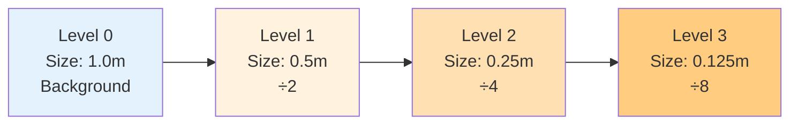

# การตั้งค่า Castellated Mesh (Castellated Mesh Settings)

> [!TIP] ทำไมต้องให้ความสำคัญกับเรื่องนี้?
> **ทำไมต้องให้ความสำคัญกับเรื่องนี้?**
>
> `castellatedMeshControls` คือ **"สมอง" ของ SnappyHexMesh** ที่กำหนดว่าความละเอียดของ Mesh จะกระจายตัวอย่างไรรอบๆ เรขาคณิต
> ส่งผลโดยตรง:
> - **ความแม่นยำของการจำลอง**: ความสามารถในการจับ Gradient และ Boundary Layer
> - **ต้นทุนการคำนวณ**: จำนวน Cell ส่งผลต่อเวลาที่ Solver ใช้
> - **คุณภาพ Mesh**: Refinement ที่ไม่เหมาะสมจะทำให้เกิด Skewness หรือ Non-orthogonality สูง
>
> **โดยสรุป**: นี่คือ "การตัดสินใจเชิงกลยุทธ์" ว่า "ตรงไหนควรละเอียด ตรงไหนควรหยาบ" เพื่อหาสมดุลระหว่างความแม่นยำและประสิทธิภาพ

หัวใจของการควบคุมความละเอียด (Resolution) ของ Mesh อยู่ที่ Dict ย่อยชื่อ `castellatedMeshControls` ในไฟล์ `snappyHexMeshDict`

ขั้นตอนนี้คือการระบุว่า "ตรงไหนควรละเอียดเท่าไหร่"

> **ลิงก์ที่เกี่ยวข้อง**:
> - ดูวิธีเตรียม Geometry → [02_Geometry_Preparation.md](./02_Geometry_Preparation.md)
> - ดูเทคนิค Refinement Regions → [../04_SNAPPYHEXMESH_ADVANCED/02_Refinement_Regions.md](../04_SNAPPYHEXMESH_ADVANCED/02_Refinement_Regions.md)

## 1. Parameters พื้นฐาน

> [!NOTE] **📂 OpenFOAM Context**
>
> **ตำแหน่งไฟล์ (File Location):**
> - `system/snappyHexMeshDict` → `castellatedMeshControls` พจนานุกรมย่อย
>
> **คำสำคัญหลัก (Key Keywords):**
> - `maxGlobalCells` - จำนวน Cell สูงสุดทั้งหมด (ป้องกัน Memory Overflow)
> - `nCellsBetweenLevels` - จำนวนชั้น Buffer ระหว่าง Refinement level ต่างๆ
> - `maxLoadUnbalance` - พารามิเตอร์ Load Balancing สำหรับ Parallel
> - `minRefinementCells` - ค่า threshold จำนวน Cell ขั้นต่ำสำหรับ Refinement (กรอง Noise)
>
> **ขอบเขตผลกระทบ:**
> พารามิเตอร์เหล่านี้ควบคุม **พฤติกรรมทั่วไปของอัลกอริทึม SnappyHexMesh** ไม่ได้เจาะจงเฉพาะเรขาคณิต แต่ควบคุมการจัดสรรทรัพยากรและข้อจำกัดคุณภาพของกระบวนการสร้าง Mesh ทั้งหมด

```cpp
castellatedMeshControls
{
    maxGlobalCells 2000000; // ถ้าเกินนี้จะหยุด Mesh (Safety limit)
    minRefinementCells 10;  // ถ้า Refine แล้วได้ Cell น้อยกว่านี้ ไม่ต้องทำ (กรอง Noise)
    maxLoadUnbalance 0.10;  // สำหรับ Parallel running
    nCellsBetweenLevels 3;  // Buffer layers ระหว่างความละเอียดต่างกัน

    // ... features & refinementSurfaces ...
}
```

### `nCellsBetweenLevels` (Buffer Layers)
ค่านี้สำคัญมากต่อ Mesh Quality (Grading)
*   คือจำนวน Cell ที่ต้องแทรกระหว่าง Level $N$ และ Level $N+1$
*   **ค่าแนะนำ:** อย่างน้อย 3 (Default) หรือมากกว่า
*   **ผลลัพธ์:** ช่วยให้การเปลี่ยนขนาด Cell ไม่กระชากเกินไป ลดปัญหา 2:1 Refinement pattern ที่ทำให้เกิด Skewness

## 2. Explicit Feature Refinement (`features`)

> [!NOTE] **📂 OpenFOAM Context**
>
> **ตำแหน่งไฟล์ (File Location):**
> - `system/snappyHexMeshDict` → `castellatedMeshControls` → `features` รายการ
> - **ขั้นตอนก่อนหน้า**: ต้องรัน `surfaceFeatureExtract` เพื่อสร้างไฟล์ `.eMesh` ก่อน
>
> **คำสำคัญหลัก (Key Keywords):**
> - `file` - ระบุไฟล์ Feature Edge (รูปแบบ `.eMesh`)
> - `level` - ระบุ Refinement level รอบๆ เส้น Feature
>
> **ขอบเขตผลกระทบ:**
> การตั้งค่านี้ควบคุม **วิธีการจับเส้นขอบและเส้น Feature ของเรขาคณิต** เพื่อให้ Mesh สามารถอธิบายรายละเอียดของเรขาคณิตได้อย่างแม่นยำ โดยเฉพาะบริเวณที่มีการเปลี่ยนแปลงของความโค้งสูง (เช่น ขอบรถ, ปลายปีก)
>
> **สถานการณ์การใช้งานทั่วไป:**
> - รถยนต์ Aerodynamics: ร่องรถ, ขอบหน้าต่าง
> - การบิน: ปลายปีกด้านหน้า, ด้านหลัง
> - เครื่องจักรที่หมุน: ขอบใบพัด

ใช้เพื่อบังคับให้ Mesh ละเอียดรอบๆ เส้นขอบคม (Feature Edges) ที่สกัดมาจาก `surfaceFeatureExtract`

```cpp
features
(
    {
        file "car.eMesh";
        level 3; // Refine รอบๆ เส้นนี้ที่ Level 3
    }
);
```

## 3. Surface Refinement (`refinementSurfaces`)

> [!NOTE] **📂 OpenFOAM Context**
>
> **ตำแหน่งไฟล์ (File Location):**
> - `system/snappyHexMeshDict` → `castellatedMeshControls` → `refinementSurfaces` พจนานุกรม
>
> **คำสำคัญหลัก (Key Keywords):**
> - `level (min max)` - ระบุ Refinement level ต่ำสุดและสูงสุดสำหรับแต่ละ patch
> - `patchInfo` - นิยามประเภท Boundary Condition (สร้างไฟล์ `polyMesh/boundary` อัตโนมัติ)
> - `type wall` / `type patch` - นิยามประเภท Boundary
>
> **ขอบเขตผลกระทบ:**
> นี่คือ **การตั้งค่าที่สำคัญที่สุดของ SnappyHexMesh** ที่กำหนดโดยตรง:
> - ความละเอียดของ Mesh บนผิวเรขาคณิต
> - คุณภาพเริ่มต้นของ Boundary Layer (ทำงานร่วมกับ `addLayersControls`)
> - การตั้งค่า Boundary Condition ของ Solver (สร้างอัตโนมัติผ่าน `patchInfo`)
>
> **จุดสำคัญ:**
> - Min level: ความละเอียดพื้นฐาน สำหรับผิวส่วนใหญ่
> - Max level: ใช้กับบริเวณที่มีความโค้งสูงหรือมุมแหลมโดยอัตโนมัติ
> - `patchInfo` ส่งผลต่อไฟล์ Boundary Condition ในโฟลเดอร์ `0/` โดยตรง
>
> **การเชื่อมต่อกับ Solver:**
> ชื่อและประเภท Patch ที่ระบุใน `refinementSurfaces` จะปรากฏโดยตรงใน Boundary Condition ของไฟล์ `0/U`, `0/p`, `0/k` ฯลฯ ในขั้นตอน Solver!

ส่วนที่สำคัญที่สุด ใช้กำหนดความละเอียดของพื้นผิวแต่ละ Patch

```cpp
refinementSurfaces
{
    car_body
    {
        level (3 4); // (min max)

        patchInfo
        {
            type wall; // กำหนด Type ใน polyMesh/boundary ให้อัตโนมัติ
        }
    }

    inlet
    {
        level (2 2);
    }
}
```

### ความหมายของ Level (min max)
*   **Level 0:** ขนาดเท่า Background Mesh (blockMesh)
*   **Level 1:** ขนาด $\frac{1}{2}$ ของเดิม (แบ่ง 8 cell ย่อย)
*   **Level $L$:** ขนาด $\frac{1}{2^L}$

### สูตรคำนวณขนาด Cell:
$$ \text{Cell Size} = \frac{\text{Background Cell Size}}{2^{\text{Level}}} $$

**Refinement Levels Visualization:**


**Min vs Max Level:**
*   ปกติ sHM จะใช้ **Min Level** ก่อน
*   จะใช้ **Max Level** ก็ต่อเมื่อ:
    1.  Curvature สูง (มุมหักศอก)
    2.  Cell ไม่สามารถจับ Shape ได้ดีพอ (ตามเกณฑ์ `resolveFeatureAngle`)

## 4. Feature Angle (`resolveFeatureAngle`)

> [!NOTE] **📂 OpenFOAM Context**
>
> **ตำแหน่งไฟล์ (File Location):**
> - `system/snappyHexMeshDict` → `castellatedMeshControls` → `resolveFeatureAngle`
>
> **คำสำคัญหลัก (Key Keywords):**
> - `resolveFeatureAngle` - ค่า Threshold ของมุม (หน่วย: องศา)
> - ใช้ร่วมกับ `(min max)` level ใน `refinementSurfaces`
>
> **กลไกการทำงาน:**
> พารามิเตอร์นี้ควบคุม **เมื่อไรที่จะอัปเกรดเป็น Max Level โดยอัตโนมัติ**:
> - SnappyHexMesh จะคำนวณค่ามุมของ Normal Vector บนผิวภายในแต่ละ Cell
> - หากการเปลี่ยนแปลงของมุม **เกิน** `resolveFeatureAngle` แสดงว่าบริเวณนั้นมีความโค้งสูงหรือเรขาคณิตซับซ้อน
> - อัลกอริทึมจะใช้ **Max Level** เพื่อ Refinement อัตโนมัติ
>
> **การตั้งค่าทั่วไป:**
> - `30` (ค่า Default): เหมาะสำหรับงานวิศวกรรมส่วนใหญ่
> - `15-20`: เรขาคณิตซับซ้อน (เช่น ภายในห้องเครื่องยนต์ที่ซับซ้อน)
> - `45-60`: เรขาคณิตง่าย ลด Refinement ที่ไม่จำเป็น
>
> **การทำงานร่วมกับ `refinementSurfaces`:**
> พารามิเตอร์นี้กำหนด **เงื่อนไขการทำงาน** ของ Max level ใน `level (min max)`!

```cpp
resolveFeatureAngle 30;
```
*   ค่ามุม (องศา) ที่ใช้ตัดสินใจว่าจะใช้ Max Level หรือไม่
*   ถ้ามุมระหว่าง Normal vector ของผิว ภายใน Cell เดียวกัน มันต่างกันเกิน 30 องศา (ผิวโค้งจัด) -> **Refine เพิ่มเป็น Max Level!**
*   **ค่าแนะนำ:** 30 (Default) หรือลดลงเหลือ 15-20 สำหรับผิวที่ซับซ้อนมาก

## 5. Region Refinement (`refinementRegions`)

> [!NOTE] **📂 OpenFOAM Context**
>
> **ตำแหน่งไฟล์ (File Location):**
> - `system/snappyHexMeshDict` → `castellatedMeshControls` → `refinementRegions` พจนานุกรม
>
> **คำสำคัญหลัก (Key Keywords):**
> - `mode` - ระบุโหมด Refinement (`inside`/`outside`/`distance`)
> - `levels` - ระบุ refinement level
> - ทำงานร่วมกับไฟล์เรขาคณิตใน `constant/triSurface/`
>
> **ขอบเขตผลกระทบ:**
> การตั้งค่านี้ควบคุม **ความละเอียดของ Mesh ในปริมาตร** เสริมให้กับ `refinementSurfaces` (surface refinement):
>
> **สถานการณ์การใช้งาน 3 โหมด:**
> - `inside`: บริเวณ Wake, ภายในห้องเผาไหม้, ส่วนกลางของท่อ
> - `outside`: ภายนอก (ใกล้ขอบเขต Domain)
> - `distance`: Refinement แบบ Gradient ตามระยะห่าง (เช่น สร้างหลายชั้นรอบวัตถุ)
>
> **ตัวอย่างการใช้งาน:**
> - **รถยนต์ Aerodynamics**: สร้าง `wakeBox` ด้านหลังรถ, `mode inside`, เพื่อจับ Wake Vortex
> - **กังหันลม**: สร้าง `distance` refinement ทรงกระบอกรอบๆ Rotor, เพื่อจับ Wake ใบพัด
> - **เครื่องแลกเปลี่ยนความร้อน**: สร้าง `box` refinement ระหว่างท่อ, เพื่อจับการไหลที่ซับซ้อน
>
> **การเชื่อมต่อกับ Solver:**
> `refinementRegions` ส่งผลต่อความสามารถในการจับกระแสการไหล:
> - Wake refinement → ส่งผลต่อความแม่นยำของการคำนวณ Lift, Drag
> - Shear Layer refinement → ส่งผลต่อประสิทธิภาพของ Turbulence Model
> - Boundary Layer 附近 refinement → ให้ฐานที่ดีกว่าสำหรับ `addLayersControls`

ใช้กำหนดความละเอียด **ภายในปริมาตร** (Volume Refinement) ไม่ใช่แค่ผิว
*   ใช้รูปทรง (`searchableSurface`) เช่น box, sphere, cylinder มากำหนดโซน

```cpp
refinementRegions
{
    wakeBox
    {
        mode inside;
        levels ((1E15 2)); // Refine level 2 ภายใน Box
    }
}
```
*   **Modes:**
    *   `inside`: ภายในผิวปิด
    *   `outside`: ภายนอกผิวปิด
    *   `distance`: ตามระยะห่างจากผิว (Distance-based refinement)

## 6. Location In Mesh (`locationInMesh`)

> [!NOTE] **📂 OpenFOAM Context**
>
> **ตำแหน่งไฟล์ (File Location):**
> - `system/snappyHexMeshDict` → `castellatedMeshControls` → `locationInMesh`
>
> **คำสำคัญหลัก (Key Keywords):**
> - `locationInMesh` - พิกัดจุด `(x y z)`
> - ทำงานร่วมกับอัลกอริทึมการลบของ `castellatedMesh`
>
> **กลไกการทำงาน:**
> นี่คือ **"Seed Point" (จุดเริ่มต้น)** ของ SnappyHexMesh:
> - SnappyHexMesh เริ่ม "เติมเต็ม" Fluid Domain จากจุดนี้
> - บริเวณที่จุดนี้อยู่จะถูกเก็บเป็น **Fluid**
> - บริเวณที่เรขาคณิตครอบครองจะถูกลบ (กลายเป็น Solid)
>
> **จุดสำคัญ:**
> - **External Flow**: จุดต้องอยู่ใน Fluid Domain (ไม่ใช่ภายในเรขาคณิต)
> - **Internal Flow**: จุดต้องอยู่ในบริเวณ Fluid (ไม่ใช่ภายในผนังท่อ)
> - **Multi-region**: ต้องใช้ `locationInMesh` รายการเพื่อระบุจุดเริ่มต้นสำหรับแต่ละบริเวณ
>
> **ข้อผิดพลาดที่พบบ่อย:**
> - ❌ จุดตกอยู่บนผิวเรขาคณิต (จะทำให้ล้มเหลว)
> - ❌ จุดตกอยู่บน Face หรือ Node ของ Background Mesh (ต้องปรับพิกัดเล็กน้อย)
> - ✅ แนะนำให้ใช้ ParaView ดูเรขาคณิต แล้วเลือกจุดใน Fluid Domain ที่ชัดเจน
>
> **เทคนิคการ Debug:**
> หากการสร้าง Mesh ล้มเหลว ให้ตรวจสอบ `locationInMesh` ก่อนเป็นอันดับแรก! นี่คือ **แหล่งที่มาของข้อผิดพลาดที่พบบ่อยที่สุด**

```cpp
locationInMesh (1.5 2.0 0.5);
```
*   จุดพิกัดที่ระบุว่า "ตรงไหนคือ Fluid"
*   จุดนี้ต้องไม่อยู่ใน Solid part (ถ้าเราทำ External Aerodynamics)
*   จุดนี้ต้องไม่อยู่ใน Fluid part (ถ้าเราทำ Internal Flow... เอ๊ะ เดี๋ยว! ต้องอยู่ใน Fluid เสมอสิ!)
*   **สรุป:** จุดนี้ต้องอยู่ใน Domain ที่เราต้องการคำนวณ
*   **ข้อควรระวัง:** ห้ามให้จุดนี้ไปทับกับ Face หรือ Node ของ Background mesh เป๊ะๆ ให้ขยับเลขทศนิยมหนีหน่อย

---
การตั้งค่า Castellated Mesh ที่ดี คือการหาจุดสมดุลระหว่าง "รายละเอียดที่ต้องการ" กับ "จำนวน Cell ที่รับไหว" (Cost)

> **ลิงก์เพิ่มเติม**:
> - ดูตัวอย่าง Refinement Regions ขั้นสูง → [../04_SNAPPYHEXMESH_ADVANCED/02_Refinement_Regions.md](../04_SNAPPYHEXMESH_ADVANCED/02_Refinement_Regions.md)

## 🧠 Concept Check: ทดสอบความเข้าใจ

### แบบฝึกหัดระดับง่าย (Easy)
1. **True/False**: `nCellsBetweenLevels` คือจำนวน Cell ระหว่าง Level ต่างๆ
   <details>
   <summary>คำตอบ</summary>
   ✅ จริง - เป็น buffer layers เพื่อให้ grading นุ่มนวลขึ้น
   </details>

2. **เลือกตอบ**: ถ้า Background Mesh ขนาด 1m และกำหนด Level = 3 ขนาด Cell จะเป็นเท่าไหร่?
   - a) 0.5 m
   - b) 0.25 m
   - c) 0.125 m
   - d) 0.0625 m
   <details>
   <summary>คำตอบ</summary>
   ✅ c) 0.125 m = 1/2³ = 1/8
   </details>

### แบบฝึกหัดระดับปานกลาง (Medium)
3. **อธิบาย**: แตกต่างระหว่าง Min Level กับ Max Level ใน `refinementSurfaces` คืออะไร?
   <details>
   <summary>คำตอบ</summary>
   Min Level = ความละเอียดพื้นฐาน, Max Level = ความละเอียดสูงสุด (ใช้เมื่อผิวโค้งจัดหรือมีมุมคม)
   </details>

4. **คำนวณ**: ถ้า `resolveFeatureAngle = 30` และผิวมีมุมหัก 45 องศา sHM จะใช้ Level ไหน?
   <details>
   <summary>คำตอบ</summary>
   Max Level - เพราะ 45° < 30° แปลว่าเป็นมุมคมที่ต้องการความละเอียดเพิ่ม
   </details>

### แบบฝึกหัดระดับสูง (Hard)
5. **Hands-on**: สร้าง `snappyHexMeshDict` สำหรับกล่องที่มี sphere ตรงกลาง โดยกำหนด refinement levels 3 ระดับ (ภายนำ, กลาง, นอก) แล้วรันดูผล


---

## 📖 เอกสารที่เกี่ยวข้อง

*   **บทก่อนหน้า**: [02_Geometry_Preparation.md](02_Geometry_Preparation.md)
*   **บทถัดไป**: [../04_SNAPPYHEXMESH_ADVANCED/01_Layer_Addition_Strategy.md](../04_SNAPPYHEXMESH_ADVANCED/01_Layer_Addition_Strategy.md)