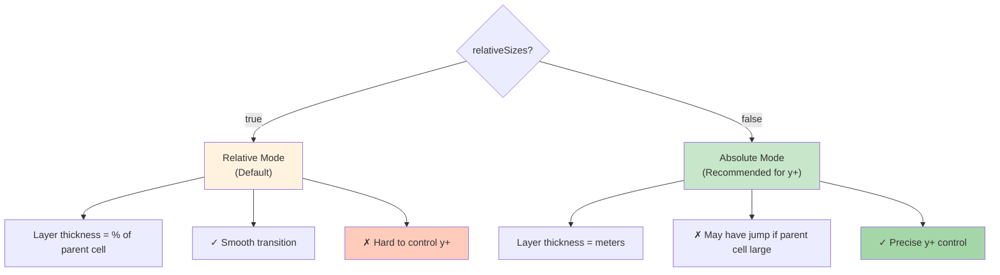

# กลยุทธ์การเพิ่มชั้น Boundary Layer (Layer Addition Strategy)

> [!TIP]
> **ทำไม Boundary Layer ถึงสำคัญ?**
>
> Boundary Layer Mesh ช่วยให้การจำลอง CFD แม่นยำขึ้นอย่างมาก โดยเฉพาะ:
> * **การทำนายแรงเสียดทาน (Skin Friction)**: ต้องการความละเอียดสูงเพื่อจับ Velocity Gradient ข้างผนัง ($\partial u/\partial y$) ให้แม่นยำ
> * **การถ่ายเทความร้อน (Heat Transfer)**: ต้องการจับ Temperature Gradient ที่ผิว ($\partial T/\partial y$) เพื่อคำนวณ Nusselt Number ได้ถูกต้อง
> * **Turbulence Modeling**: ค่า $y+$ ที่เหมาะสม (เช่น $y+ \approx 1$ สำหรับ Low-Re Models) ขึ้นอยู่กับความหนาของ Layer ชั้นแรกโดยตรง
>
> **หาก Layer ไม่ได้คุณภาพ**: จะเกิด Error ในการคำนวณแรงดันและแรงเสียดทาน ทำให้ผลลัพธ์การจำลองผิดไปจากความเป็นจริง
>
> **ไฟล์ที่เกี่ยวข้อง**: `system/snappyHexMeshDict` → ส่วน `addLayersControls`

การสร้าง Boundary Layer Mesh (Prism Layer) ใน Phase 3 ของ `snappyHexMesh` เป็นขั้นตอนที่ "ปราบเซียน" ที่สุด เพราะมักเกิดปัญหา Layer ยุบ (Collapse), เบี้ยว, หรือไม่ขึ้นเลย

> **ลิงก์ที่เกี่ยวข้อง**:
> - ดู Workflow การใช้ sHM → [../03_SNAPPYHEXMESH_BASICS/01_The_sHM_Workflow.md](../03_SNAPPYHEXMESH_BASICS/01_The_sHM_Workflow.md)
> - ดู Mesh Quality Criteria → [../05_MESH_QUALITY_AND_MANIPULATION/01_Mesh_Quality_Criteria.md](../05_MESH_QUALITY_AND_MANIPULATION/01_Mesh_Quality_Criteria.md)

## 1. ความสำคัญของ Boundary Layer

> [!NOTE]
> **📂 OpenFOAM Context**
>
> **ไฟล์**: `system/snappyHexMeshDict`
> **ส่วน**: `addLayersControls`
>
> **คำสั่งหลักที่ต้องใช้**:
> - `layers`: ระบุ Patch ที่ต้องการเพิ่ม Layer (รองรับ Regex เช่น `"car_.*"`)
> - `nSurfaceLayers`: จำนวนชั้นของ Boundary Layer
> - `expansionRatio`: อัตราการขยายตัวของความหนาแต่ละชั้น
> - `relativeSizes`: เลือกโหมด Relative (true) หรือ Absolute (false)
> - `firstLayerThickness` / `finalLayerThickness`: ความหนาของ Layer แรก/สุดท้าย
>
> **ผลลัพธ์**: เมื่อรัน `snappyHexMesh` จะสร้างไฟล์ Mesh ใหม่ใน `constant/polyMesh` ที่มี Prism Layers ติดกับผนังที่ระบุ

ใน CFD การจำลอง Turbulence และ Heat Transfer ต้องการความละเอียดสูงมากที่ผิวผนัง (Wall) เพื่อ:
*   จับ Velocity Gradient ($du/dy$) ให้แม่นยำ -> แรงเสียดทาน (Skin Friction)
*   จับ Temperature Gradient ($dT/dy$) ให้แม่นยำ -> การถ่ายเทความร้อน (Nusselt Number)
*   ให้ค่า $y+$ อยู่ในช่วงที่เหมาะสมกับ Turbulence Model (เช่น $y+ < 1$ หรือ $30 < y+ < 300$)

## 2. การตั้งค่าใน `addLayersControls`

> [!NOTE]
> **📂 OpenFOAM Context**
>
> **ไฟล์**: `system/snappyHexMeshDict`
> **ตำแหน่ง**: อยู่ภายใน `addLayersControls` sub-dictionary
>
> **การใช้งานจริง**:
> ```cpp
> addLayersControls
> {
>     layers
>     {
>         "wall_patch_name"  // ชื่อ Patch จาก Geometry
>         {
>             nSurfaceLayers 5;  // จำนวนชั้น Layer
>         }
>     }
>     expansionRatio 1.2;        // อัตราขยายตัว
>     relativeSizes true;        // หรือ false สำหรับ Absolute
> }
> ```
> **หมายเหตุ**: Patch names ต้องตรงกับที่ระบุใน `geometry` หรือที่สร้างจาก `triSurfaceMesh`

```cpp
addLayersControls
{
    relativeSizes true; // ขนาด Layer คิดเป็น % ของ Cell ข้างเคียง?
    
    layers
    {
        "car_.*" // ใช้ Regex เลือก Patch ได้
        {
            nSurfaceLayers 3; // จำนวนชั้น
        }
    }

    expansionRatio 1.2;      // อัตราการขยายตัว (Layer นอก / Layer ใน)
    finalLayerThickness 0.5; // ความหนา Layer สุดท้าย (relative หรือ absolute)
    minThickness 0.1;        // ถ้า Layer บางกว่านี้ ให้ยุบทิ้ง (Minimum Thickness) 
    
    // ... Quality Controls ...
}
```

## 3. Relative vs Absolute Sizes

> [!NOTE]
> **📂 OpenFOAM Context**
>
> **ไฟล์**: `system/snappyHexMeshDict`
> **คำสั่ง**: `relativeSizes` (boolean)
>
> **โหมดที่ 1 - Relative (`true`)**:
> - `finalLayerThickness 0.5` → Layer หนา 50% ของ Cell ข้างเคียง
> - เหมาะสำหรับ: General purpose, Smooth transition
>
> **โหมดที่ 2 - Absolute (`false`)**:
> - `firstLayerThickness 0.0001` → Layer หนา 0.1 mm (หน่วยเป็นเมตร)
> - เหมาะสำหรับ: y+ control, High-fidelity turbulence simulation
>
> **ตัวอย่างการคำนวณ y+**:
> - Target $y+ = 1$, Flow velocity = 10 m/s
> - ใช้ Absolute mode กำหนด `firstLayerThickness = 1e-5` m
> - ตรวจสอบด้วย `yPlusRAS` functionObject หลังจำลอง

นี่คือจุดที่คนสับสนที่สุด: `relativeSizes true/false`

### แบบ Relative (`true`) - Default
*   หน่วยของความหนาจะคิดเป็น **"สัดส่วนของ Cell ตัวแม่ที่ติดกัน"**
*   **ตัวอย่าง:** `finalLayerThickness 0.5` หมายถึง Layer นอกสุดหนาเป็น 50% ของ Cell ใน Castellated mesh
*   **ข้อดี:** Smooth transition จาก Layer ไปหา Internal mesh ดีมาก
*   **ข้อเสีย:** คุม $y+$ ยากมาก เพราะถ้า Cell แม่ใหญ่ Layer แรกก็จะใหญ่ตาม ($y+$ ไม่คงที่)

### แบบ Absolute (`false`) - Recommended for High Fidelity
*   หน่วยของความหนาจะเป็น **"เมตร"** (หรือหน่วยของ Mesh)
*   **ตัวอย่าง:** `firstLayerThickness 0.0001` (1 mm)
*   **ข้อดี:** คุม $y+$ ได้เป๊ะๆ ตามที่คำนวณมา
*   **ข้อเสีย:** ถ้า Cell แม่ใหญ่มากๆ แล้ว Layer เล็กมากๆ จะเกิด Volume Ratio jump ที่รุนแรง (Mesh Quality เสีย)

> [!TIP]
> **สูตรแนะนำ:**
> ใช้ `relativeSizes false` (Absolute) แล้วกำหนด:
> 1.  `nSurfaceLayers` (เช่น 5-10 ชั้น)
> 2.  `firstLayerThickness` (คำนวณจาก $y+$ target)
> 3.  `expansionRatio` (1.1 - 1.3)

**Layer Size Modes Comparison:**


## 4. การจัดการปัญหา Layer Collapse (Quality Controls)

> [!NOTE]
> **📂 OpenFOAM Context**
>
> **ไฟล์**: `system/snappyHexMeshDict`
> **ส่วนที่เกี่ยวข้อง**:
> 1. `meshQualityControls` (กำหนดเกณฑ์คุณภาพ)
> 2. `addLayersControls` → `nRelaxIter` (จำนวนรอบปรับ Layer)
>
> **คำสั่งสำคัญ**:
> ```cpp
> meshQualityControls
> {
>     maxNonOrtho 75;              // Default 65, เพิ่มเพื่อรองรับ Layer
>     maxBoundarySkewness 20;      // Default 4, เพิ่มเพื่ออนุญาต Layer เบี้ยว
> }
>
> addLayersControls
> {
>     nRelaxIter 20;               // Default 5, เพิ่มเพื่อให้เวลาจัด Layer
>     featureAngle 130;            // มุมที่ Layer จะหยุด
> }
> ```
>
> **การตรวจสอบผล**:
> - ดู log ของ snappyHexMesh คำว่า "Layer insertion failed"
> - ใช้ ParaView ดู Mesh: **Mesh Quality** → **Non-Orthogonality**

ถ้า sHM พบว่าใส่ Layer แล้ว Mesh Quality แย่ลง มันจะ **"ไม่ใส่"** (Collapse) ทันที เราสามารถผ่อนปรนเกณฑ์ได้ในส่วน `meshQualityControls` (ท้ายไฟล์):

1.  **maxNonOrtho:** เพิ่มเป็น 75 (เดิม 65) เพื่อยอมรับ Layer ที่เอียงหน่อย
2.  **maxBoundarySkewness:** เพิ่มเป็น 20 (เดิม 4)
3.  **nRelaxIter:** เพิ่มจำนวนรอบการจัดระเบียบ Layer (ใน `addLayersControls`) เป็น 10-20 รอบ

### Feature Angle Limitation
ถ้ามุมหักศอกเกินค่า `featureAngle` (เช่น มุม 90 องศาที่กล่อง), sHM จะหยุดสร้าง Layer ตรงมุมนั้นเพื่อป้องกัน Layer บิดเบี้ยวจน Self-intersect
*   ค่าปกติ: 130-150
*   ถ้าอยากให้ Layer หุ้มมุมฉากได้: อาจต้องลดค่าลง แต่เสี่ยง Mesh พัง

## 5. เทคนิคการคำนวณ First Layer Height ($\\Delta y$)

> [!NOTE]
> **📂 OpenFOAM Context**
>
> **ไฟล์**: `system/snappyHexMeshDict` → `addLayersControls`
> **การใช้ค่าที่คำนวณ**:
> ```cpp
> addLayersControls
> {
>     relativeSizes false;          // เปลี่ยนเป็น Absolute mode
>     firstLayerThickness 0.0001;   // ใส่ค่าที่คำนวณได้ (เมตร)
> }
> ```
>
> **การตรวจสอบหลังจำลอง**:
> **ไฟล์**: `system/controlDict`
> ```cpp
> functions
> {
>     yPlus
>     {
>         type            yPlusRAS;
>         functionObjectLibs ("libfieldFunctionObjects.so");
>         writeControl    timeStep;
>         writeInterval   1;
>     }
> }
> ```
> รัน `simpleFoam` หรือ `pimpleFoam` แล้วเปิดดู field `yPlus` ใน ParaView

ต้องใช้สูตร $y+$:
$$ \\Delta y = \\frac{y^+ \\mu}{\\rho u_\\tau} $$
โดย $u_\\tau = \\sqrt{\\frac{\\tau_w}{\\rho}}$

โชคดีที่เราไม่ต้องกดเครื่องคิดเอง มีเว็บช่วยคำนวณเยอะมาก (search "CFD Y+ Calculator")
*   Input: Free stream velocity, Density, Viscosity, Target y+
*   Output: First layer height

## 6. สรุป Checklist สำหรับ Layer

> [!NOTE]
> **📂 OpenFOAM Context**
>
> **ขั้นตอนการตรวจสอบ Layer ใน OpenFOAM**:
>
> **1. ตรวจสอบ Log**:
> ```bash
> # รัน snappyHexMesh
> snappyHexMesh -overwrite
>
> # ดูข้อความเหล่านี้ใน log.snappyHexMesh:
> grep "Layer" log.snappyHexMesh
> # ควรเห็น: "Layer mesh added" ไม่ใช่ "Layer insertion failed"
> ```
>
> **2. ตรวจสอบ Mesh ใน ParaView**:
> - เปิดไฟล์ `constant/polyMesh`
> - ใช้ **Mesh Quality** filter
> - ตรวจ **Non-Orthogonality** และ **Aspect Ratio**
> - Slice ผ่าน Layer เพื่อดูว่า Layer ขึ้นครบไหม
>
> **3. ตรวจสอบ y+ หลังจำลอง**:
> ```bash
> # เพิ่ม yPlus functionObject ใน controlDict
> # รัน solver เช่น simpleFoam
> simpleFoam
>
> # ดูค่า y+ ใน ParaView
> # ค่าควรอยู่ในช่วงที่ต้องการ (เช่น y+ < 1)
> ```
>
> **ไฟล์ที่ต้องตรวจสอบ**:
> - `system/snappyHexMeshDict` → ตั้งค่า Layer
> - `log.snappyHexMesh` → ดูว่า Layer สร้างสำเร็จไหม
> - `constant/polyMesh` → Mesh ที่ได้
> - `system/controlDict` → เพิ่ม yPlus functionObject

1.  Background Mesh ต้องละเอียดพอ (Aspect Ratio ตรงผิวไม่ควรสูงเกินไป)
2.  Snapping ต้องเนียน (Phase 2 ผ่านฉลุย)
3.  เลือกโหมด Absolute Size ถ้าต้องการคุม $y+$
4.  ถ้า Layer ไม่ขึ้น ให้ลองผ่อนปรน `meshQualityControls` หรือตรวจสอบ `featureAngle`

---

## 🧠 Concept Check: ทดสอบความเข้าใจ

### แบบฝึกหัดระดับง่าย (Easy)
1. **True/False**: `relativeSizes true` เหมาะสำหรับการคุมค่า $y+$ ที่แม่นยำ
   <details>
   <summary>คำตอบ</summary>
   ❌ เท็จ - `relativeSizes false` (Absolute) ถึงเหมาะสำหรับคุม $y+$
   </details>

2. **เลือกตอบ**: `expansionRatio` คืออะไร?
   - a) อัตราส่วนขนาด Layer นอก / Layer ใน
   - b) จำนวน Layer ทั้งหมด
   - c) ความหนาของ Layer แรก
   - d) ค่า y+
   <details>
   <summary>คำตอบ</summary>
   ✅ a) อัตราส่วนขนาด Layer นอก / Layer ใน
   </details>

### แบบฝึกหัดระดับปานกลาง (Medium)
3. **อธิบาย**: ทำไม Layer อาจ "ยุบ" (Collapse) ไม่ขึ้น?
   <details>
   <summary>คำตอบ</summary>
   เพราะ sHM ตรวจพบว่าการใส่ Layer จะทำให้ Mesh Quality แย่ลง (เช่น Non-orthogonality สูงเกินไป) จึงตัดสินใจไม่สร้าง Layer ตรงนั้น
   </details>

4. **คำนวณ**: ถ้ากำหนด `firstLayerThickness = 0.0001` และ `expansionRatio = 1.2` ชั้นที่ 3 จะหนาเท่าไหร่?
   <details>
   <summary>คำตอบ</summary>
   Layer 2 = 0.00012, Layer 3 = 0.000144 m
   </details>

### แบบฝึกหัดระดับสูง (Hard)
5. **Hands-on**: ใช้ snappyHexMesh สร้าง Mesh บน sphere โดยกำหนด Layer 5 ชั้น แล้วใช้ ParaView ตรวจสอบว่า Layer ขึ้นครบไหม


---

## 📖 เอกสารที่เกี่ยวข้อง

*   **บทก่อนหน้า**: [../03_SNAPPYHEXMESH_BASICS/03_Castellated_Mesh_Settings.md](../03_SNAPPYHEXMESH_BASICS/03_Castellated_Mesh_Settings.md)
*   **บทถัดไป**: [02_Refinement_Regions.md](02_Refinement_Regions.md)