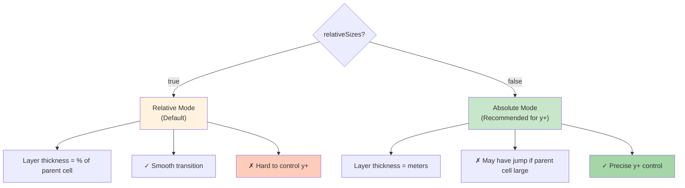
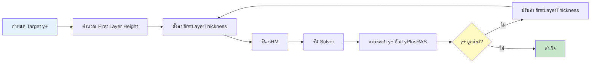

# กลยุทธ์การเพิ่มชั้น Boundary Layer (Layer Addition Strategy)

## 🎯 Learning Objectives

หลังจากอ่านบทนี้ คุณควรจะสามารถ:
- **อธิบาย** ความสำคัญของ Boundary Layer Mesh ต่อการทำนาย Skin Friction และ Heat Transfer
- **เลือก** โหมดที่เหมาะสมระหว่าง `relativeSizes true` (Relative) และ `false` (Absolute) สำหรับ use case ของคุณ
- **คำนวณ** First Layer Thickness เพื่อควบคุมค่า $y+$ ให้ได้ตามเป้าหมาย Turbulence Model
- **ตั้งค่า** Quality Controls ใน `meshQualityControls` และ `addLayersControls` เพื่อป้องกัน Layer Collapse
- **ตรวจสอบ** คุณภาพของ Boundary Layer ที่สร้างขึ้นด้วย ParaView และ Log Files

## 📋 Prerequisites

ควรมีความเข้าใจพื้นฐานเกี่ยวกับ:
- Workflow การใช้งาน `snappyHexMesh` → [../03_SNAPPYHEXMESH_BASICS/01_The_sHM_Workflow.md](../03_SNAPPYHEXMESH_BASICS/01_The_sHM_Workflow.md)
- Mesh Quality Criteria (Non-orthogonality, Aspect Ratio) → [../05_MESH_QUALITY_AND_MANIPULATION/01_Mesh_Quality_Criteria.md](../05_MESH_QUALITY_AND_MANIPULATION/01_Mesh_Quality_Criteria.md)
- แนวคิดเรื่อง Turbulence Modeling และค่า $y+$

---

## 🤔 ทำไม Boundary Layer ถึงสำคัญ? (WHY)

> [!TIP]
> **ทำไม Boundary Layer ถึงสำคัญ?**
>
> Boundary Layer Mesh ช่วยให้การจำลอง CFD แม่นยำขึ้นอย่างมาก โดยเฉพาะ:
> * **การทำนายแรงเสียดทาน (Skin Friction)**: ต้องการความละเอียดสูงเพื่อจับ Velocity Gradient ข้างผนัง ($\partial u/\partial y$) ให้แม่นยำ
> * **การถ่ายเทความร้อน (Heat Transfer)**: ต้องการจับ Temperature Gradient ที่ผิว ($\partial T/\partial y$) เพื่อคำนวณ Nusselt Number ได้ถูกต้อง
> * **Turbulence Modeling**: ค่า $y+$ ที่เหมาะสม (เช่น $y+ \approx 1$ สำหรับ Low-Re Models) ขึ้นอยู่กับความหนาของ Layer ชั้นแรกโดยตรง
>
> **หาก Layer ไม่ได้คุณภาพ**: จะเกิด Error ในการคำนวณแรงดันและแรงเสียดทาน ทำให้ผลลัพธ์การจำลองผิดไปจากความเป็นจริง
>
> **ไฟล์ที่เกี่ยวข้อง**: `system/snappyHexMeshDict` → ส่วน `addLayersControls`

**ใน CFD**, การจำลอง Turbulence และ Heat Transfer ต้องการความละเอียดสูงมากที่ผิวผนัง (Wall) เพื่อ:
* จับ Velocity Gradient ($du/dy$) ให้แม่นยำ → แรงเสียดทาน (Skin Friction)
* จับ Temperature Gradient ($dT/dy$) ให้แม่นยำ → การถ่ายเทความร้อน (Nusselt Number)
* ให้ค่า $y+$ อยู่ในช่วงที่เหมาะสมกับ Turbulence Model (เช่น $y+ < 1$ หรือ $30 < y+ < 300$)

---

## 📐 โครงสร้าง Boundary Layer Mesh (WHAT)

<!-- IMAGE: IMG_02_005 -->
<!-- 
Purpose: เพื่ออธิบายโครงสร้างของ Boundary Layer Mesh (Prism Layers) และความเชื่อมโยงกับค่า $y^+$. ภาพนี้ต้องแสดงให้เห็นการ "ซ้อนกัน" ของ Layer ที่มีความหนาเพิ่มขึ้นเรื่อยๆ (Expansion) จากผนัง และซ้อนทับด้วยกราฟ Velocity Profile ($u^+$ vs $y^+$) เพื่อให้เห็นว่า Mesh ต้องละเอียดที่สุดตรง Viscous Sublayer
Prompt: "2D Schematic of Boundary Layer Mesh and Velocity Profile. **Geometry:** A vertical stack of rectangular cells starting from a bottom Wall. **Mesh:** The bottom-most cell is very thin (dy1). The cells above it get progressively thicker (Expansion). **Physics:** A red curve overlay showing a turbulent velocity profile (log-law). The curve starts at 0 at the wall and rises steeply through the thin cells. **Labels:** Label the first cell height 'dy1'. Label the curve 'Velocity Profile'. **Style:** Engineering textbook diagram, 2D side view, clear lines, white background."
-->
![[IMG_02_005.jpg]]

### Boundary Layer คืออะไร?

Boundary Layer Mesh (หรือ Prism Layer) เป็นการสร้างชั้นของ Cell ที่มีความหนาแตกต่างกัน (Gradual Thickness) ติดกับผนัง:
- **Layer ชั้นแรก**: บางที่สุด เพื่อจับ Gradient สูงสุด
- **Layer ชั้นถัดไป**: ขยายหนาขึ้นตาม `expansionRatio`
- **Layer ชั้นสุดท้าย**: เชื่อมต่อกับ Internal Mesh อย่าง Smooth

> **ลิงก์ที่เกี่ยวข้อง**:
> - ดู Workflow การใช้ sHM → [../03_SNAPPYHEXMESH_BASICS/01_The_sHM_Workflow.md](../03_SNAPPYHEXMESH_BASICS/01_The_sHM_Workflow.md)
> - ดู Mesh Quality Criteria → [../05_MESH_QUALITY_AND_MANIPULATION/01_Mesh_Quality_Criteria.md](../05_MESH_QUALITY_AND_MANIPULATION/01_Mesh_Quality_Criteria.md)

---

## ⚙️ การตั้งค่าใน `addLayersControls` (HOW)

> [!NOTE]
> **📂 OpenFOAM Context**
>
> **ไฟล์**: `system/snappyHexMeshDict`
> **ส่วน**: `addLayersControls`
>
> **คำสั่งหลักที่ต้องใช้**:
> - `layers`: ระบุ Patch ที่ต้องการเพิ่ม Layer (รองรับ Regex เช่น `"car_.*"`)
> - `nSurfaceLayers`: จำนวนชั้นของ Boundary Layer
> - `expansionRatio`: อัตราการขยายตัวของความหนาแต่ละชั้น
> - `relativeSizes`: เลือกโหมด Relative (true) หรือ Absolute (false)
> - `firstLayerThickness` / `finalLayerThickness`: ความหนาของ Layer แรก/สุดท้าย
>
> **ผลลัพธ์**: เมื่อรัน `snappyHexMesh` จะสร้างไฟล์ Mesh ใหม่ใน `constant/polyMesh` ที่มี Prism Layers ติดกับผนังที่ระบุ

```cpp
addLayersControls
{
    relativeSizes true; // ขนาด Layer คิดเป็น % ของ Cell ข้างเคียง?
    
    layers
    {
        "car_.*" // ใช้ Regex เลือก Patch ได้
        {
            nSurfaceLayers 3; // จำนวนชั้น
        }
    }

    expansionRatio 1.2;      // อัตราการขยายตัว (Layer นอก / Layer ใน)
    finalLayerThickness 0.5; // ความหนา Layer สุดท้าย (relative หรือ absolute)
    minThickness 0.1;        // ถ้า Layer บางกว่านี้ ให้ยุบทิ้ง (Minimum Thickness) 
    
    // ... Quality Controls ...
}
```

### ขั้นตอนการตั้งค่าพื้นฐาน

**Step 1: เลือก Patch ที่ต้องการเพิ่ม Layer**
```cpp
layers
{
    "wall_.*"           // Regex: เลือกทุก Patch ที่ขึ้นต้นด้วย "wall_"
    {
        nSurfaceLayers 5; // สร้าง 5 ชั้น
    }
    
    "inlet"             // หรือระบุชื่อเฉพาะ
    {
        nSurfaceLayers 3;
    }
}
```

**Step 2: กำหนด Expansion Ratio**
```cpp
expansionRatio 1.2;  // แนะนำ: 1.1 - 1.3
```

**Step 3: เลือกโหมด Size** (ดูรายละเอียดใน Section 3)
```cpp
relativeSizes true;  // หรือ false สำหรับ Absolute mode
```

---

## 🔀 Relative vs Absolute Sizes

> [!NOTE]
> **📂 OpenFOAM Context**
>
> **ไฟล์**: `system/snppyHexMeshDict`
> **คำสั่ง**: `relativeSizes` (boolean)
>
> **โหมดที่ 1 - Relative (`true`)**:
> - `finalLayerThickness 0.5` → Layer หนา 50% ของ Cell ข้างเคียง
> - เหมาะสำหรับ: General purpose, Smooth transition
>
> **โหมดที่ 2 - Absolute (`false`)**:
> - `firstLayerThickness 0.0001` → Layer หนา 0.1 mm (หน่วยเป็นเมตร)
> - เหมาะสำหรับ: y+ control, High-fidelity turbulence simulation
>
> **ตัวอย่างการคำนวณ y+**:
> - Target $y+ = 1$, Flow velocity = 10 m/s
> - ใช้ Absolute mode กำหนด `firstLayerThickness = 1e-5` m
> - ตรวจสอบด้วย `yPlusRAS` functionObject หลังจำลอง

นี่คือจุดที่คนสับสนที่สุด: `relativeSizes true/false`

### แบบ Relative (`true`) - Default

**หลักการ**: หน่วยของความหนาจะคิดเป็น **"สัดส่วนของ Cell ตัวแม่ที่ติดกัน"**

**ตัวอย่าง**: `finalLayerThickness 0.5` หมายถึง Layer นอกสุดหนาเป็น 50% ของ Cell ใน Castellated mesh

| ข้อดี | ข้อเสีย |
|--------|---------|
| ✓ Smooth transition จาก Layer ไปหา Internal mesh ดีมาก | ✗ คุม $y+$ ยากมาก เพราะถ้า Cell แม่ใหญ่ Layer แรกก็จะใหญ่ตาม ($y+$ ไม่คงที่) |

### แบบ Absolute (`false`) - Recommended for High Fidelity

**หลักการ**: หน่วยของความหนาจะเป็น **"เมตร"** (หรือหน่วยของ Mesh)

**ตัวอย่าง**: `firstLayerThickness 0.0001` (0.1 mm)

| ข้อดี | ข้อเสีย |
|--------|---------|
| ✓ คุม $y+$ ได้เป๊ะๆ ตามที่คำนวณมา | ✗ ถ้า Cell แม่ใหญ่มากๆ แล้ว Layer เล็กมากๆ จะเกิด Volume Ratio jump ที่รุนแรง (Mesh Quality เสีย) |

> [!TIP]
> **สูตรแนะนำ:**
> ใช้ `relativeSizes false` (Absolute) แล้วกำหนด:
> 1. `nSurfaceLayers` (เช่น 5-10 ชั้น)
> 2. `firstLayerThickness` (คำนวณจาก $y+$ target)
> 3. `expansionRatio` (1.1 - 1.3)

**Layer Size Modes Comparison:**


---

## 🛡️ การจัดการปัญหา Layer Collapse (Quality Controls)

> [!NOTE]
> **📂 OpenFOAM Context**
>
> **ไฟล์**: `system/snppyHexMeshDict`
> **ส่วนที่เกี่ยวข้อง**:
> 1. `meshQualityControls` (กำหนดเกณฑ์คุณภาพ)
> 2. `addLayersControls` → `nRelaxIter` (จำนวนรอบปรับ Layer)
>
> **คำสั่งสำคัญ**:
> ```cpp
> meshQualityControls
> {
>     maxNonOrtho 75;              // Default 65, เพิ่�เพื่อรองรับ Layer
>     maxBoundarySkewness 20;      // Default 4, เพิ่มเพื่ออนุญาต Layer เบี้ยว
> }
>
> addLayersControls
> {
>     nRelaxIter 20;               // Default 5, เพิ่มเพื่อให้เวลาจัด Layer
>     featureAngle 130;            // มุมที่ Layer จะหยุด
> }
> ```
>
> **การตรวจสอบผล**:
> - ดู log ของ snppyHexMesh คำว่า "Layer insertion failed"
> - ใช้ ParaView ดู Mesh: **Mesh Quality** → **Non-Orthogonality**

### ทำไม Layer ถึงยุบ (Collapse)?

ถ้า sHM พบว่าใส่ Layer แล้ว Mesh Quality แย่ลง มันจะ **"ไม่ใส่"** (Collapse) ทันที

### วิธีการแก้ปัญหา

**1. ผ่อนปรน Mesh Quality Criteria**

เราสามารถผ่อนปรนเกณฑ์ได้ในส่วน `meshQualityControls` (ท้ายไฟล์):

```cpp
meshQualityControls
{
    maxNonOrtho 75;              // เดิม 65 → เพิ่มเพื่อยอมรับ Layer ที่เอียงหน่อย
    maxBoundarySkewness 20;      // เดิม 4 → เพิ่มเพื่ออนุญาต Layer เบี้ยว
}
```

**2. เพิ่มจำนวนรอบการจัดระเบียบ Layer**

```cpp
addLayersControls
{
    nRelaxIter 20;  // เดิม 5 → เพิ่มเป็น 10-20 รอบ
}
```

**3. ปรับ Feature Angle**

ถ้ามุมหักศอกเกินค่า `featureAngle` (เช่น มุม 90 องศาที่กล่อง), sHM จะหยุดสร้าง Layer ตรงมุมนั้นเพื่อป้องกัน Layer บิดเบี้ยวจน Self-intersect

| ค่า | ความหมาย |
|-----|-----------|
| **130-150** | ค่าปกติ (แนะนำ) |
| **ลดค่า** | Layer หุ้มมุมฉากได้ แต่เสี่ยง Mesh พัง |

---

## 🧮 เทคนิคการคำนวณ First Layer Height ($\Delta y$)

> [!NOTE]
> **📂 OpenFOAM Context**
>
> **ไฟล์**: `system/snppyHexMeshDict` → `addLayersControls`
> **การใช้ค่าที่คำนวณ**:
> ```cpp
> addLayersControls
> {
>     relativeSizes false;          // เปลี่ยนเป็น Absolute mode
>     firstLayerThickness 0.0001;   // ใส่ค่าที่คำนวณได้ (เมตร)
> }
> ```
>
> **การตรวจสอบหลังจำลอง**:
> **ไฟล์**: `system/controlDict`
> ```cpp
> functions
> {
>     yPlus
>     {
>         type            yPlusRAS;
>         functionObjectLibs ("libfieldFunctionObjects.so");
>         writeControl    timeStep;
>         writeInterval   1;
>     }
> }
> ```
> รัน `simpleFoam` หรือ `pimpleFoam` แล้วเปิดดู field `yPlus` ใน ParaView

### สูตรการคำนวณ $y+$

ต้องใช้สูตร $y+$:
$$ \Delta y = \frac{y^+ \mu}{\rho u_\tau} $$
โดย $u_\tau = \sqrt{\frac{\tau_w}{\rho}}$

### เครื่องมือช่วยคำนวณ

โชคดีที่เราไม่ต้องกดเครื่องคิดเอง มีเว็บช่วยคำนวณเยอะมาก (search "CFD Y+ Calculator")

**Input:**
- Free stream velocity
- Density
- Viscosity
- Target y+

**Output:**
- First layer height

### Workflow การคำนวณ



---

## 🎯 Expected Outcomes

เมื่อสร้าง Boundary Layer Mesh ที่ดี คุณควรจะได้ผลลัพธ์ดังนี้:

### ✅ Good Layer Characteristics

| ลักษณะ | คำอธิบาย |
|---------|-----------|
| **Gradual Expansion** | Layer แต่ละชั้นขยายหนาขึ้นอย่าง Smooth (expansionRatio 1.1-1.3) |
| **No Collapses** | Layer ขึ้นครบทุก Patch ที่กำหนด ไม่มีบริเวณที่ Layer ยุบ |
| **Smooth Transition** | Layer ชั้นสุดท้ายเชื่อมต่อกับ Internal Mesh อย่างราบรื่น |
| **Acceptable Quality** | Non-orthogonality < 75, Aspect Ratio < 5 |
| **Correct y+** | ค่า y+ อยู่ในช่วงเป้าหมาย (เช่น y+ < 1 สำหรับ Low-Re Model) |

### ❌ Bad Layer Characteristics

| ปัญหา | สาเหตุ | วิธีแก้ |
|--------|--------|---------|
| **Layer Collapse** | Mesh Quality แย่เกินไป | ผ่อนปรน `maxNonOrtho`, `maxBoundarySkewness` |
| **Layer Distortion** | Feature Angle ต่ิ | ปรับ `featureAngle` |
| **High Volume Ratio Jump** | Cell แม่ใหญ่เกินไป | Refine Background Mesh ตรงผนัง |
| **Incorrect y+** | ใช้ Relative mode หรือคำนวณผิด | ใช้ Absolute mode และคำนวณใหม่ |

### Visual Examples

**Good Layer** (ใน ParaView):
- Slice ผ่าน Layer → เห็น Layer เป็นแนวขนานกับผนัง
- Mesh Quality → Non-orthogonality สีเขียว/เหลือง (< 75)
- y+ Field → ค่าสม่ำเสมอทั่วผนัง

**Bad Layer** (ใน ParaView):
- Layer ไม่ขึ้นบางช่วง (Holes)
- Non-orthogonality สีแดง (> 75)
- y+ แกว่งมากหรือเกินเป้าหมาย

---

## ✅ สรุป Checklist สำหรับ Layer

> [!NOTE]
> **📂 OpenFOAM Context**
>
> **ขั้นตอนการตรวจสอบ Layer ใน OpenFOAM**:
>
> **1. ตรวจสอบ Log**:
> ```bash
> # รัน snppyHexMesh
> snppyHexMesh -overwrite
>
> # ดูข้อความเหล่านี้ใน log.snppyHexMesh:
> grep "Layer" log.snppyHexMesh
> # ควรเห็น: "Layer mesh added" ไม่ใช่ "Layer insertion failed"
> ```
>
> **2. ตรวจสอบ Mesh ใน ParaView**:
> - เปิดไฟล์ `constant/polyMesh`
> - ใช้ **Mesh Quality** filter
> - ตรวจ **Non-Orthogonality** และ **Aspect Ratio**
> - Slice ผ่าน Layer เพื่อดูว่า Layer ขึ้นครบไหม
>
> **3. ตรวจสอบ y+ หลังจำลอง**:
> ```bash
> # เพิ่ม yPlus functionObject ใน controlDict
> # รัน solver เช่น simpleFoam
> simpleFoam
>
> # ดูค่า y+ ใน ParaView
> # ค่าควรอยู่ในช่วงที่ต้องการ (เช่น y+ < 1)
> ```
>
> **ไฟล์ที่ต้องตรวจสอบ**:
> - `system/snppyHexMeshDict` → ตั้งค่า Layer
> - `log.snppyHexMesh` → ดูว่า Layer สร้างสำเร็จไหม
> - `constant/polyMesh` → Mesh ที่ได้
> - `system/controlDict` → เพิ่ม yPlus functionObject

### ก่อนรัน `snappyHexMesh`

- [ ] Background Mesh ละเอียดพอ (Aspect Ratio ตรงผิวไม่ควรสูงเกินไป)
- [ ] Snapping ต้องเนียน (Phase 2 ผ่านฉลุย)
- [ ] เลือกโหมด Absolute Size ถ้าต้องการคุม $y+$
- [ ] ตรวจสอบ `featureAngle` ว่าเหมาะสมกับ Geometry

### ระหว่างตั้งค่า Quality Controls

- [ ] เพิ่ม `maxNonOrtho` ถ้า Layer ยุบ (65 → 75)
- [ ] เพิ่ม `maxBoundarySkewness` ถ้า Layer เบี้ยว (4 → 20)
- [ ] เพิ่ม `nRelaxIter` ถ้า Layer ไม่เรียบ (5 → 20)

### หลังรัน `snappyHexMesh`

- [ ] ตรวจ Log: "Layer mesh added" (ไม่ใช่ "Layer insertion failed")
- [ ] เปิด ParaView: Slice ดู Layer ขึ้นครบไหม
- [ ] ตรวจ Mesh Quality: Non-orthogonality < 75
- [ ] รัน Solver: ตรวจ y+ ด้วย `yPlusRAS` functionObject

---

## 🚨 Common Pitfalls

### 1. ใช้ Relative Mode แต่อยากคุม y+

**ปัญหา**: `relativeSizes true` ทำให้ Layer แรกมีขนาดแปรผันตาม Cell แม่ → y+ ไม่คงที่

**วิธีแก้**: ใช้ `relativeSizes false` และกำหนด `firstLayerThickness` ที่คำนวณจาก y+

### 2. Layer ยุบ (Collapse) ที่มุม

**ปัญหา**: `featureAngle` สูงเกินไป → sHM หยุด Layer ก่อนถึงมุม

**วิธีแก้**: ลด `featureAngle` (130 → 100) แต่ระวัง Mesh พัง

### 3. Volume Ratio Jump สูง

**ปัญหา**: Cell แม่ใหญ่มาก + Layer เล็กมาก → Aspect Ratio jump

**วิธีแก้**: Refine Background Mesh ตรงผนัง หรือใช้ Relative Mode

### 4. ไม่ตรวจ y+ หลังจำลอง

**ปัญหา**: สร้าง Layer แล้วเสร็จ แต่ไม่รู้ว่า y+ ถูกต้องไหม

**วิธีแก้**: เพิ่ม `yPlusRAS` functionObject ใน `controlDict` ทุกครั้ง

---

## 🔑 Key Takeaways

| หัวข้อสำคัญ | สิ่งที่ต้องจำ |
|-------------|--------------|
| **1. การเลือกโหมด Size** | - `relativeSizes true` → General purpose, Smooth transition<br>- `relativeSizes false` → High-fidelity, Control y+ |
| **2. การคำนวณ y+** | - ใช้ Absolute mode + `firstLayerThickness`<br>- ตรวจสอบด้วย `yPlusRAS` functionObject<br>- ปรับค่าจนกว่า y+ จะถูกต้อง |
| **3. Quality Control** | - ผ่อนปรน `maxNonOrtho` (65 → 75)<br>- เพิ่ม `maxBoundarySkewness` (4 → 20)<br>- เพิ่ม `nRelaxIter` (5 → 20) |

---

## 🧠 Concept Check: ทดสอบความเข้าใจ

### แบบฝึกหัดระดับง่าย (Easy)

1. **True/False**: `relativeSizes true` เหมาะสำหรับการคุมค่า $y+$ ที่แม่นยำ
   <details>
   <summary>คำตอบ</summary>
   ❌ เท็จ - `relativeSizes false` (Absolute) ถึงเหมาะสำหรับคุม $y+$
   </details>

2. **เลือกตอบ**: `expansionRatio` คืออะไร?
   - a) อัตราส่วนขนาด Layer นอก / Layer ใน
   - b) จำนวน Layer ทั้งหมด
   - c) ความหนาของ Layer แรก
   - d) ค่า y+
   <details>
   <summary>คำตอบ</summary>
   ✅ a) อัตราส่วนขนาด Layer นอก / Layer ใน
   </details>

### แบบฝึกหัดระดับปานกลาง (Medium)

3. **อธิบาย**: ทำไม Layer อาจ "ยุบ" (Collapse) ไม่ขึ้น?
   <details>
   <summary>คำตอบ</summary>
   เพราะ sHM ตรวจพบว่าการใส่ Layer จะทำให้ Mesh Quality แย่ลง (เช่น Non-orthogonality สูงเกินไป) จึงตัดสินใจไม่สร้าง Layer ตรงนั้น
   </details>

4. **คำนวณ**: ถ้ากำหนด `firstLayerThickness = 0.0001` และ `expansionRatio = 1.2` ชั้นที่ 3 จะหนาเท่าไหร่?
   <details>
   <summary>คำตอบ</summary>
   Layer 1 = 0.0001 m<br>Layer 2 = 0.0001 × 1.2 = 0.00012 m<br>Layer 3 = 0.00012 × 1.2 = **0.000144 m**
   </details>

### แบบฝึกหัดระดับสูง (Hard)

5. **Hands-on**: ใช้ snppyHexMesh สร้าง Mesh บน sphere โดยกำหนด Layer 5 ชั้น แล้วใช้ ParaView ตรวจสอบว่า Layer ขึ้นครบไหม
   <details>
   <summary>เฉลย</summary>
   1. สร้าง `snppyHexMeshDict` กำหนด `nSurfaceLayers 5`<br>
   2. รัน `snppyHexMesh -overwrite`<br>
   3. เปิด ParaView → Slice ผ่าน Sphere<br>
   4. ดูว่า Layer ขึ้นครบ 5 ชั้นไหม<br>
   5. ใช้ Mesh Quality filter → ตรวจ Non-orthogonality
   </details>

---

## 📚 เอกสารที่เกี่ยวข้อง

*   **บทก่อนหน้า**: [../03_SNAPPYHEXMESH_BASICS/03_Castellated_Mesh_Settings.md](../03_SNAPPYHEXMESH_BASICS/03_Castellated_Mesh_Settings.md)
*   **บทถัดไป**: [02_Refinement_Regions.md](02_Refinement_Regions.md)