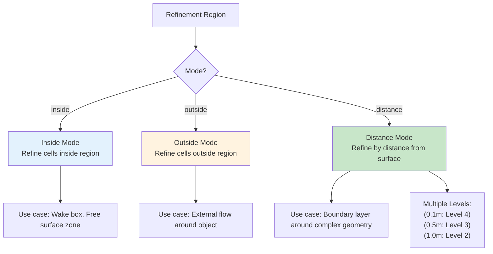

# เขตการปรับความละเอียด (Refinement Regions)

> [!TIP]
> **ทำไม Refinement Regions ถึงสำคัญ?**
>
> ในการจำลอง CFD ที่มีประสิทธิภาพ การ "โยนเม็ด Mesh ละเอียดๆ ไปทั่วทั้งโดเมน" คือการสิ้นเปลืองทรัพยากร! Refinement Regions ช่วยให้เรา:
> *   เน้นความละเอียดเฉพาะ **"จุดสำคัญ"** (เช่น Wake หลังรถ, บริเวณผสมกันของของไหล)
> *   ประหยัดเวลาคำนวณและหน่วยความจำได้ **50-80%** เมื่อเทียบกับการ refine ทั่วทั้งโดเมน
> *   จับลมพายุที่มีขนาดเล็ก (Small-scale vortices) ได้แม่นยำขึ้น โดยไม่ต้องแลกกับความละเอียดรวม
>
> **ไฟล์ที่เกี่ยวข้อง**: `system/snappyHexMeshDict` → ส่วน `geometry` และ `castellatedMeshControls/refinementRegions`

นอกจากการกำหนดความละเอียดที่พื้นผิว (Surface Refinement) แล้ว บ่อยครั้งเราต้องการกำหนดความละเอียดใน **"พื้นที่ว่าง" (Volume)** ด้วย เช่น:
*   บริเวณ Wake หลังรถยนต์ (ต้องการจับ Vortices)
*   บริเวณรอยต่อของ Free surface ในงาน VOF
*   บริเวณที่เกิดปฏิกิริยาเคมีรุนแรง

`refinementRegions` ใน `snappyHexMeshDict` คือเครื่องมือสำหรับงานนี้

> **ลิงก์ที่เกี่ยวข้อง**:
> - ดูการตั้งค่า Castellated → [../03_SNAPPYHEXMESH_BASICS/03_Castellated_Mesh_Settings.md](../03_SNAPPYHEXMESH_BASICS/03_Castellated_Mesh_Settings.md)
> - ดูการสร้าง Multi-region → [03_Multi_Region_Meshing.md](./03_Multi_Region_Meshing.md)

## 1. ประเภทของรูปทรง (Searchable Surfaces)

> [!NOTE] **📂 OpenFOAM Context**
>
> ส่วนนี้เกี่ยวข้องกับ **`geometry` block** ในไฟล์ `system/snappyHexMeshDict`
>
> **Keywords ที่ต้องรู้**:
> *   `type` → ชนิดของรูปทรง (box, sphere, cylinder, searchablePlate, triSurfaceMesh)
> *   การ import STL files → สำหรับรูปทรงที่ซับซ้อนที่สร้างจาก CAD
> *   `name` → ชื่อที่ใช้อ้างอิงใน `refinementRegions` ถ้าเป็น external file
>
> **ตำแหน่งในไฟล์**: อยู่ใน `system/snappyHexMeshDict` → บล็อก `geometry` (ก่อน `castellatedMeshControls`)

เราต้องนิยามรูปทรงเรขาคณิตในส่วน `geometry` ก่อนนำมาใช้เป็น Region:

```cpp
geometry
{
    // 1. Basic Shapes (สร้างใน Dict ได้เลย)
    refineBox
    {
        type box;
        min (0 0 0);
        max (1 1 1);
    }
    
    refineSphere
    {
        type sphere;
        centre (0 0 0);
        radius 1.5;
    }

    // 2. External Files
    wakeRegion.stl
    {
        type triSurfaceMesh;
        name wakeRegion;
    }
};
```

## 2. โหมดการ Refine (Modes)

> [!NOTE] **📂 OpenFOAM Context**
>
> ส่วนนี้เกี่ยวข้องกับ **`refinementRegions` block** ภายใน `castellatedMeshControls` ในไฟล์ `system/snappyHexMeshDict`
>
> **Keywords สำคัญ**:
> *   `mode` → inside, outside, หรือ distance
> *   `levels` → ระดับการ refine (อ้างอิงจาก `refinementLevels` ใน `castellatedMeshControls`)
> *   รูปแบบ `levels ((distance level))` หรือ `((minDistance maxDistance level))`
>
> **ตำแหน่งในไฟล์**: อยู่ใน `system/snappyHexMeshDict` → `castellatedMeshControls` → `refinementRegions`

ในส่วน `castellatedMeshControls.refinementRegions`:

### 2.1 Mode: `inside`
Refine ทุก Cell ที่จุดศูนย์กลางอยู่ **ข้างใน** รูปทรงที่กำหนด

```cpp
refinementRegions
{
    refineBox
    {
        mode inside;
        levels ((1E15 3)); // Refine เป็น Level 3 ทั้งหมด
    }
}
```
*Note:* `1E15` เป็นค่า dummy สำหรับ maxLevel (ใส่ไว้โก้ๆ ปกติ sHM ดูแค่ตัวหลังถ้าเป็น mode inside)

### 2.2 Mode: `outside`
Refine ทุก Cell ที่อยู่ **ข้างนอก** (ตรงข้ามกับ inside)

### 2.3 Mode: `distance` (ทรงพลังที่สุด!)
Refine ตาม **ระยะห่าง** จากพื้นผิว (ไล่ระดับความละเอียดได้)

```cpp
refinementRegions
{
    car.stl // อ้างอิง Geometry รถ
    {
        mode distance;
        levels 
        (
            (0.1 4)  // ระยะ 0 - 0.1 เมตร: Level 4
            (0.5 3)  // ระยะ 0.1 - 0.5 เมตร: Level 3
            (1.0 2)  // ระยะ 0.5 - 1.0 เมตร: Level 2
        );
    }
}
```
วิธีนี้ช่วยให้ Mesh ค่อยๆ หยาบลงเมื่อห่างจากวัตถุ (Grading) ประหยัดจำนวน Cell ได้มหาศาล และ Mesh Quality ดีกว่าการเปลี่ยน Level กระทันหัน

## 3. ตัวอย่างการใช้งานจริง

> [!NOTE] **📂 OpenFOAM Context**
>
> ส่วนนี้แสดง **Best Practices** ในการประยุกต์ใช้ `refinementRegions` กับปัญหา CFD ที่แตกต่างกัน
>
> **การประยุกต์ใช้**:
> *   **External Aerodynamics** → Wake refinement (mode: inside ด้วย box ยาวๆ)
> *   **Multiphase (VOF)** → Free surface refinement (mode: inside ด้วย searchablePlate หรือ box แบนๆ)
> *   **Conjugate Heat Transfer** → Solid-fluid interface refinement (mode: distance)
>
> **ตำแหน่งในไฟล์**: เหมือนกับ Section 2 → `refinementRegions` block

### ตัวอย่าง 1: Wake Region หลังรถ
สร้าง Box ยาวๆ ต่อท้ายรถ
*   Geometry: `type box`
*   Mode: `inside`
*   Level: 3 (ละเอียดปานกลาง เพื่อจับ Eddy structures)

### ตัวอย่าง 2: Free Surface (VOF)
สมมติระดับน้ำอยู่ที่ $y=0.5$ เราต้องการ Mesh ละเอียดเฉพาะช่วง $y=0.45$ ถึง $0.55$
*   Geometry: `type searchablePlate` หรือ Box แบนๆ
*   Mode: `inside`
*   Level: สูงสุด (เช่น 5) เพื่อให้ Interface คมชัด

## 4. ข้อควรระวัง

> [!NOTE] **📂 OpenFOAM Context**
>
> ส่วนนี้เกี่ยวข้องกับ **Mesh Quality Control** และ **Troubleshooting** ของ `refinementRegions`
>
> **ประเด็นสำคัญ**:
> *   **Overlapping logic** → OpenFOAM จะเลือก **Level สูงสุด** โดยอัตโนมัติ (ไม่ใช่ค่าเฉลี่ย)
> *   **Background mesh sizing** → ขนาดเซลล์เริ่มต้นส่งผลต่อรูปร่างของ refinement region ที่เห็น (จะเป็นขั้นบันได)
> *   **Visualization** → ใช้ ParaView เปิดไฟล์ STL/OBJ เพื่อตรวจสอบตำแหน่งก่อนรัน
>
> **การตรวจสอบ**: หลังจากรัน snappyHexMesh แล้ว ให้เปิดไฟล์ `constant/polyMesh/` ใน ParaView เพื่อดูผลลัพธ์

1.  **Overlapping Regions:** ถ้า Cell หนึ่งอยู่ในหลาย Region มันจะเลือก **Level สูงสุด** เสมอ
2.  **Background Mesh Dependency:** Region จะทำงานได้ดีก็ต่อเมื่อ Background mesh มีขนาดเหมาะสม การ Refine จะแบ่ง Cell เดิมเป็น 2, 4, 8 ส่วน ดังนั้นรูปร่างของ Region ใน Mesh จริงจะเป็นขั้นบันไดตาม Background mesh
3.  **Visualizing Regions:** ควรเปิด ParaView โหลดไฟล์ `.stl` หรือ `.obj` ของ Region เหล่านั้นมาดูเทียบกับ Geometry จริงก่อนรัน เพื่อให้แน่ใจว่าตำแหน่งถูกต้อง

## 5. Advanced: `searchableCylinder` และ `searchablePlane`

> [!NOTE] **📂 OpenFOAM Context**
>
> ส่วนนี้เกี่ยวข้องกับ **Advanced Geometry Types** ใน `geometry` block ของ `system/snappyHexMeshDict`
>
> **Keywords ขั้นสูง**:
> *   `searchableCylinder` → สำหรับท่อ (pipe flow) หรือทรงกระบอก
> *   `searchablePlane` → สำหรับแบ่งครึ่งโดเมนหรือกำหนดระนาบ
> *   `searchableSurface` → สำหรับพื้นผิวที่ซับซ้อน
>
> **ข้อดี**: ไม่ต้องสร้าง STL แยก สามารถกำหนดพิกัดได้โดยตรงใน dictionary
>
> **ตำแหน่งในไฟล์**: `system/snappyHexMeshDict` → `geometry` block

OpenFOAM เวอร์ชันใหม่ๆ รองรับ shape ที่หลากหลายขึ้น เช่น Cylinder (เหมาะกับท่อ) หรือ Plane (เหมาะกับการแบ่งครึ่งโดเมน) ช่วยให้ไม่ต้องไปวาด STL แยกข้างนอก

**Refinement Region Modes:**


---

## 🧠 Concept Check: ทดสอบความเข้าใจ

### แบบฝึกหัดระดับง่าย (Easy)
1. **True/False**: ถ้า Cell อยู่ในหลาย Overlapping Regions จะใช้ Level เฉลี่ยจากทุก Region
   <details>
   <summary>คำตอบ</summary>
   ❌ เท็จ - จะเลือก **Level สูงสุด** เสมอ
   </details>

2. **เลือกตอบ**: Mode ไหนที่เหมาะสำหรับสร้าง Wake region หลังรถยนต์?
   - a) inside
   - b) outside
   - c) distance
   - d) ทุกอย่างได้
   <details>
   <summary>คำตอบ</summary>
   ✅ a) inside - สร้าง Box ยาวๆ แล้วใช้ mode inside
   </details>

### แบบฝึกหัดระดับปานกลาง (Medium)
3. **อธิบาย**: ข้อดีของ `distance` mode เทียบกับ `inside` mode คืออะไร?
   <details>
   <summary>คำตอบ</summary>
   distance mode ช่วยให้สามารถไล่ระดับความละเอียด (grading) จากผิวออกไปได้อัตโนมัติ ประหยัดจำนวน Cell มาก
   </details>

4. **สร้าง**: จงเขียน `refinementRegions` block สำหรับ sphere รัศมี 1m โดย refine รอบๆ sphere (distance 0-0.5m) เป็น Level 3
   <details>
   <summary>คำตอบ</summary>
   ```cpp
   refinementRegions
   {
       sphere.stl
       {
           mode distance;
           levels ((0.5 3));
       }
   }
   ```
   </details>

### แบบฝึกหัดระดับสูง (Hard)
5. **Hands-on**: สร้าง Wake refinement region หลังกล่อง (หรือ sphere) แล้วเปรียบผลลัพธ์กับการไม่ใช้ wake region


---

## 📖 เอกสารที่เกี่ยวข้อง

*   **บทก่อนหน้า**: [01_Layer_Addition_Strategy.md](01_Layer_Addition_Strategy.md)
*   **บทถัดไป**: [03_Multi_Region_Meshing.md](03_Multi_Region_Meshing.md)

