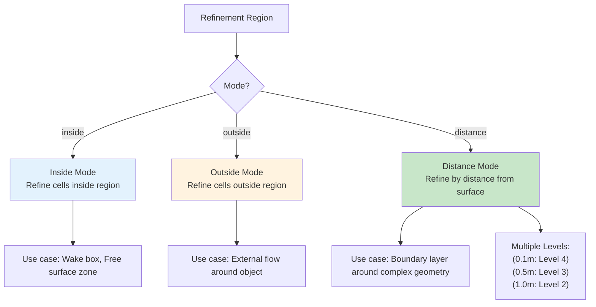

# เขตการปรับความละเอียด (Refinement Regions)

## 🎯 Learning Objectives

หลังจากศึกษาบทนี้ คุณจะสามารถ:
-  **เลือกโหมดที่เหมาะสม** (inside/outside/distance) สำหรับสถานการณ์ CFD ที่แตกต่างกัน
-  **สร้าง refinement regions** ด้วย searchable surfaces และ external STL files
-  **ประยุกต์ใช้ refinement regions** กับปัญหาจริง เช่น Wake refinement, Free surface tracking
-  **หลีกเลี่ยงข้อผิดพลาดทั่วไป** เกี่ยวกับ overlapping regions และ background mesh dependency
-  **ตรวจสอบผลลัพธ์** ด้วย ParaView ก่อนและหลังการรัน snappyHexMesh

## ✅ Expected Outcomes

เมื่อสิ้นสุดบทนี้ คุณจะได้:
- Mesh ที่มีความละเอียดเฉพาะที่ (Adaptive refinement) ประหยัด 50-80% ของจำนวน Cell
- ความเข้าใจที่ชัดเจนเกี่ยวกับพฤติกรรมของทั้ง 3 โหมด และเมื่อไรที่ควรใช้โหมดใด
- การตั้งค่า `refinementRegions` ที่ถูกต้องใน `snappyHexMeshDict`
- ความสามารถในการแก้ปัญหาเมื่อ refinement regions ทำงานไม่ตามที่คาดหวัง

## 📋 Prerequisites

ควรมีความรู้พื้นฐานดังนี้:
- **บทก่อนหน้า**: [01_Layer_Addition_Strategy.md](01_Layer_Addition_Strategy.md) - ความเข้าใจเกี่ยวกับ boundary layer meshing
- **ไฟล์พื้นฐาน**: ความคุ้นเคยกับ `system/snappyHexMeshDict` และ `castellatedMeshControls`
- **ParaView**: ความสามารถในการเปิดและตรวจสอบ STL files และ mesh results
- **Mesh Fundamentals**: ความเข้าใจเกี่ยวกับ cell levels, refinement hierarchy ใน OpenFOAM

---

> [!TIP]
> **ทำไม Refinement Regions ถึงสำคัญ?**
>
> ในการจำลอง CFD ที่มีประสิทธิภาพ การ "โยนเม็ด Mesh ละเอียดๆ ไปทั่วทั้งโดเมน" คือการสิ้นเปลืองทรัพยากร! Refinement Regions ช่วยให้เรา:
> *   เน้นความละเอียดเฉพาะ **"จุดสำคัญ"** (เช่น Wake หลังรถ, บริเวณผสมกันของของไหล)
> *   ประหยัดเวลาคำนวณและหน่วยความจำได้ **50-80%** เมื่อเทียบกับการ refine ทั่วทั้งโดเมน
> *   จับลมพายุที่มีขนาดเล็ก (Small-scale vortices) ได้แม่นยำขึ้น โดยไม่ต้องแลกกับความละเอียดรวม
>
> **ไฟล์ที่เกี่ยวข้อง**: `system/snappyHexMeshDict` → ส่วน `geometry` และ `castellatedMeshControls/refinementRegions`

นอกจากการกำหนดความละเอียดที่พื้นผิว (Surface Refinement) แล้ว บ่อยครั้งเราต้องการกำหนดความละเอียดใน **"พื้นที่ว่าง" (Volume)** ด้วย เช่น:
*   บริเวณ Wake หลังรถยนต์ (ต้องการจับ Vortices)
*   บริเวณรอยต่อของ Free surface ในงาน VOF
*   บริเวณที่เกิดปฏิกิริยาเคมีรุนแรง

`refinementRegions` ใน `snappyHexMeshDict` คือเครื่องมือสำหรับงานนี้

> **ลิงก์ที่เกี่ยวข้อง**:
> - ดูการตั้งค่า Castellated → [../03_SNAPPYHEXMESH_BASICS/03_Castellated_Mesh_Settings.md](../03_SNAPPYHEXMESH_BASICS/03_Castellated_Mesh_Settings.md)
> - ดูการสร้าง Multi-region → [03_Multi_Region_Meshing.md](./03_Multi_Region_Meshing.md)

---

## 1. ประเภทของรูปทรง (Searchable Surfaces)

> [!NOTE] **📂 OpenFOAM Context**
>
> ส่วนนี้เกี่ยวข้องกับ **`geometry` block** ในไฟล์ `system/snappyHexMeshDict`
>
> **Keywords ที่ต้องรู้**:
> *   `type` → ชนิดของรูปทรง (box, sphere, cylinder, searchablePlate, triSurfaceMesh)
> *   การ import STL files → สำหรับรูปทรงที่ซับซ้อนที่สร้างจาก CAD
> *   `name` → ชื่อที่ใช้อ้างอิงใน `refinementRegions` ถ้าเป็น external file
>
> **ตำแหน่งในไฟล์**: อยู่ใน `system/snappyHexMeshDict` → บล็อก `geometry` (ก่อน `castellatedMeshControls`)

### 1.1 วิธีการสร้าง (HOW - Step-by-Step)

**ขั้นตอนที่ 1: เลือกชนิดของรูปทรง**

| ประเภท | เหมาะสำหรับ | ข้อดี | ข้อเสีย |
|--------|-------------|--------|---------|
| `box` | พื้นที่สี่เหลี่ยม (wake, zone แน่นอน) | ง่าย, รวดเร็ว | จำกัดรูปทรง |
| `sphere` | พื้นที่รอบจุด/ทรงกลม | เรียบง่าย | จำกัดรูปทรง |
| `searchableCylinder` | ท่อ, flow รอบทรงกระบอก | ไม่ต้องสร้าง STL | จำกัดรูปทรง |
| `searchablePlate` | ระนาบ 2D, free surface | กำหนดระนาบได้ | จำกัดรูปทรง |
| `triSurfaceMesh` | รูปทรงซับซ้อนจาก CAD | ยืดหยุ่นที่สุด | ต้องมีไฟล์ STL |

**ขั้นตอนที่ 2: นิยามรูปทรงใน `geometry` block**

เราต้องนิยามรูปทรงเรขาคณิตในส่วน `geometry` ก่อนนำมาใช้เป็น Region:

```cpp
geometry
{
    // 1. Basic Shapes (สร้างใน Dict ได้เลย)
    refineBox
    {
        type box;
        min (0 0 0);
        max (1 1 1);
    }
    
    refineSphere
    {
        type sphere;
        centre (0 0 0);
        radius 1.5;
    }

    // 2. Advanced Shapes
    wakeCylinder
    {
        type searchableCylinder;
        point1 (0 0 0);
        point2 (5 0 0);  // ทิศทางแกน
        radius 0.5;
    }

    // 3. External Files
    wakeRegion.stl
    {
        type triSurfaceMesh;
        name wakeRegion;
    }
};
```

**ขั้นตอนที่ 3: ตรวจสอบรูปทรงด้วย ParaView**
1. เปิด ParaView
2. โหลดไฟล์ STL หรือใช้ `Box`/`Sphere` source เปรียบเทียบ
3. ตรวจสอบว่ารูปทรงครอบคลุมพื้นที่ที่ต้องการ refine ได้ครบถ้วน

---

## 2. โหมดการ Refine (Modes)

> [!NOTE] **📂 OpenFOAM Context**
>
> ส่วนนี้เกี่ยวข้องกับ **`refinementRegions` block** ภายใน `castellatedMeshControls` ในไฟล์ `system/snappyHexMeshDict`
>
> **Keywords สำคัญ**:
> *   `mode` → inside, outside, หรือ distance
> *   `levels` → ระดับการ refine (อ้างอิงจาก `refinementLevels` ใน `castellatedMeshControls`)
> *   รูปแบบ `levels ((distance level))` หรือ `((minDistance maxDistance level))`
>
> **ตำแหน่งในไฟล์**: อยู่ใน `system/snappyHexMeshDict` → `castellatedMeshControls` → `refinementRegions`

### 2.1 สรุปเปรียบเทียบทั้ง 3 โหมด

| โหมด | การทำงาน | Use Case หลัก | ข้อดี | ข้อเสีย | ตัวอย่าง |
|------|----------|--------------|--------|---------|----------|
| **inside** | Refine cell ที่จุดศูนย์กลางอยู่ภายในรูปทรง | Wake region, Free surface zone | ง่าย, ชัดเจน | ไม่สามารถ grading | กล่อง wake หลังรถ |
| **outside** | Refine cell ที่อยู่ภายนอกรูปทรง | External flow รอบวัตถุ | กำหนด domain ภายนอกได้ | ใช้หาย | ลมรอบอาคาร |
| **distance** | Refine ตามระยะห่างจากพื้นผิว | Boundary layer, รอบ geometry ซับซ้อน | Grading อัตโนมัติ, ประหยัด cell | เขียนยาก | รอบรถยนต์/เครื่องบิน |

### 2.2 Mode: `inside`

**เมื่อไรควรใช้**: ต้องการ refine ใน "กล่อง" หรือพื้นที่จำกัดที่รู้ขอบเขตแน่นอน

**HOW - ขั้นตอนการตั้งค่า**:
```cpp
refinementRegions
{
    refineBox
    {
        mode inside;
        levels ((1E15 3)); // Refine เป็น Level 3 ทั้งหมด
    }
}
```

*Note:* `1E15` เป็นค่า dummy สำหรับ maxLevel (ใส่ไว้โก้ๆ ปกติ sHM ดูแค่ตัวหลังถ้าเป็น mode inside)

### 2.3 Mode: `outside`

**เมื่อไรควรใช้**: ต้องการ refine ทุกที่ **ยกเว้น** พื้นที่ภายในรูปทรง (หายากในงานจริง)

**HOW - ขั้นตอนการตั้งค่า**:
```cpp
refinementRegions
{
    excludeBox
    {
        mode outside;
        levels ((1E15 2)); // Level 2 ทั้งหมดที่อยู่นอก
    }
}
```

### 2.4 Mode: `distance` (ทรงพลังที่สุด!)

**เมื่อไรควรใช้**: ต้องการไล่ระดับความละเอียดจากพื้นผิวออกไป (Grading) ประหยัด cell

**HOW - ขั้นตอนการตั้งค่า**:

ขั้นตอนที่ 1: กำหนดระยะและระดับ
```cpp
refinementRegions
{
    car.stl // อ้างอิง Geometry รถ
    {
        mode distance;
        levels 
        (
            (0.1 4)  // ระยะ 0 - 0.1 เมตร: Level 4
            (0.5 3)  // ระยะ 0.1 - 0.5 เมตร: Level 3
            (1.0 2)  // ระยะ 0.5 - 1.0 เมตร: Level 2
        );
    }
}
```

ขั้นตอนที่ 2: ทำความเข้าใจรูปแบบระดับ
- รูปแบบพื้นฐาน: `((distance level))` - refine จาก 0 ถึงระยะ distance
- รูปแบบขั้นสูง: `((minDistance maxDistance level))` - refine ในช่วงระยะที่กำหนด

ขั้นตอนที่ 3: ตรวจสอบผลลัพธ์
- เปิด ParaView ดูว่า grading เรียบหรือไม่
- ปรับระยะถ้าเห็นการเปลี่ยน level กระทันหันเกินไป

วิธีนี้ช่วยให้ Mesh ค่อยๆ หยาบลงเมื่อห่างจากวัตถุ (Grading) ประหยัดจำนวน Cell ได้มหาศาล และ Mesh Quality ดีกว่าการเปลี่ยน Level กระทันหัน

**Refinement Region Modes:**


---

## 3. ตัวอย่างการใช้งานจริง (Practical Applications)

> [!NOTE] **📂 OpenFOAM Context**
>
> ส่วนนี้แสดง **Best Practices** ในการประยุกต์ใช้ `refinementRegions` กับปัญหา CFD ที่แตกต่างกัน
>
> **การประยุกต์ใช้**:
> *   **External Aerodynamics** → Wake refinement (mode: inside ด้วย box ยาวๆ)
> *   **Multiphase (VOF)** → Free surface refinement (mode: inside ด้วย searchablePlate หรือ box แบนๆ)
> *   **Conjugate Heat Transfer** → Solid-fluid interface refinement (mode: distance)
>
> **ตำแหน่งในไฟล์**: เหมือนกับ Section 2 → `refinementRegions` block

### ตัวอย่าง 1: Wake Region หลังรถ (External Aerodynamics)

**สถานการณ์**: ต้องการจับ vortices และ wake structures หลังรถยนต์

**HOW - ขั้นตอนการตั้งค่า**:

**ขั้นตอนที่ 1: สร้าง Geometry**
```cpp
geometry
{
    wakeBox
    {
        type box;
        min (2.0 -1.0 0.0);   // เริ่มหลังรถ 2 เมตร
        max (8.0  1.0 1.5);   // ยาว 6 เมตร กว้าง 2 เมตร
    }
}
```

**ขั้นตอนที่ 2: ตั้งค่า Refinement**
```cpp
refinementRegions
{
    wakeBox
    {
        mode inside;
        levels ((1E15 3)); // Level 3 สำหรับจับ eddy
    }
}
```

**ขั้นตอนที่ 3: ตรวจสอบ**
- เปิด ParaView → โหลด `wakeBox` เปรียบเทียบกับ `car.stl`
- ตรวจสอบว่า wake box ยาวพอ (ทั่วไป 5-10 เท่าของความยาวรถ)

### ตัวอย่าง 2: Free Surface (VOF Method)

**สถานการณ์**: สมมติระดับน้ำอยู่ที่ $y=0.5$ ต้องการ Mesh ละเอียดเฉพาะช่วง $y=0.45$ ถึง $0.55$

**HOW - ขั้นตอนการตั้งค่า**:

**ขั้นตอนที่ 1: สร้าง searchablePlate**
```cpp
geometry
{
    freeSurfaceZone
    {
        type searchablePlate;
        point (0 0.45 0);    // มุมล่าง
        normal (0 1 0);      // ทิศทางตั้งฉากกับระนาบ
        span (10 0.1 5);     // ขนาด (x thickness z)
    }
}
```

**ขั้นตอนที่ 2: ตั้งค่า Refinement**
```cpp
refinementRegions
{
    freeSurfaceZone
    {
        mode inside;
        levels ((1E15 5)); // Level สูงสุด เช่น 5
    }
}
```

**ขั้นตอนที่ 3: ตรวจสอบ**
- ตรวจสอบว่า searchablePlane อยู่ที่ตำแหน่ง $y=0.5$ จริงๆ
- ปรับ `span` ให้ครอบคลุม domain ทั้งหมด

---

## 4. Common Pitfalls (ข้อผิดพลาดที่พบบ่อย)

> [!NOTE] **📂 OpenFOAM Context**
>
> ส่วนนี้เกี่ยวข้องกับ **Mesh Quality Control** และ **Troubleshooting** ของ `refinementRegions`
>
> **ประเด็นสำคัญ**:
> *   **Overlapping logic** → OpenFOAM จะเลือก **Level สูงสุด** โดยอัตโนมัติ (ไม่ใช่ค่าเฉลี่ย)
> *   **Background mesh sizing** → ขนาดเซลล์เริ่มต้นส่งผลต่อรูปร่างของ refinement region ที่เห็น (จะเป็นขั้นบันได)
> *   **Visualization** → ใช้ ParaView เปิดไฟล์ STL/OBJ เพื่อตรวจสอบตำแหน่งก่อนรัน
>
> **การตรวจสอบ**: หลังจากรัน snappyHexMesh แล้ว ให้เปิดไฟล์ `constant/polyMesh/` ใน ParaView เพื่อดูผลลัพธ์

### 4.1 Overlapping Regions

**ปัญหา**: Cell อยู่ในหลาย Region พร้อมกัน

**พฤติกรรมที่คาดหวัง**: OpenFOAM จะเลือก **Level สูงสุด** เสมอ (ไม่ใช่ค่าเฉลี่ย)

**ตัวอย่าง**:
```cpp
refinementRegions
{
    box1
    {
        mode inside;
        levels ((1E15 2));
    }
    box2  // ซ้อนทับกับ box1
    {
        mode inside;
        levels ((1E15 4)); // ชนะ! Cell ในพื้นที่ซ้อนทับจะได้ Level 4
    }
}
```

**วิธีแก้**: วางแผน regions ให้ไม่ซ้อนทับ หรือยอมรับว่า region ที่มี level สูงกว่าจะ "ชน"

### 4.2 Background Mesh Dependency

**ปัญหา**: Refinement region ใน mesh จริงดูไม่เรียบ เป็นขั้นบันได

**สาเหตุ**: Refinement แบ่ง Cell เดิมเป็น 2, 4, 8 ส่วน รูปร่างของ Region จึงเป็นขั้นบันไดตาม Background mesh

**วิธีแก้**:
- เลือกขนาด background mesh ให้เล็กพอ (ไม่เกิน 1/5 ของขนาด region)
- ใช้ `distance` mode แทน `inside` mode ถ้าต้องการ grading ที่เรียบกว่า

### 4.3 การตรวจสอบไม่ดี

**ปัญหา**: Region อยู่ผิดตำแหน่ง หรือไม่ครอบคลุมพื้นที่ที่ต้องการ

**วิธีแก้ (HOW - Workflow)**:

ขั้นตอนที่ 1: ตรวจสอบก่อนรัน
```bash
# ใน ParaView
1. File → Open → เลือกไฟล์ .stl ของ region
2. File → Open → เลือกไฟล์ .stl ของ geometry หลัก
3. ตรวจสอบตำแหน่งและขนาด
```

ขั้นตอนที่ 2: ตรวจสอบหลังรัน
```bash
# หลังจากรัน snappyHexMesh
paraFoam -builtin
# ดูว่า region ปรากฏใน mesh จริงหรือไม่
```

### 4.4 ใช้โหมดผิดงาน

**ปัญหา**: ใช้ `inside` mode สำหรับงานที่ควรใช้ `distance` mode (หรือกลับกัน)

**ตัวอย่างผิด**:
- ใช้ `distance` mode สำหรับ wake box (ควรใช้ `inside`)
- ใช้ `inside` mode สำหรับ boundary layer รอบรถ (ควรใช้ `distance`)

**วิธีแก้**: ดูตารางเปรียบเทียบใน Section 2.1

---

## 5. Advanced: `searchableCylinder` และ `searchablePlane`

> [!NOTE] **📂 OpenFOAM Context**
>
> ส่วนนี้เกี่ยวข้องกับ **Advanced Geometry Types** ใน `geometry` block ของ `system/snappyHexMeshDict`
>
> **Keywords ขั้นสูง**:
> *   `searchableCylinder` → สำหรับท่อ (pipe flow) หรือทรงกระบอก
> *   `searchablePlane` → สำหรับแบ่งครึ่งโดเมนหรือกำหนดระนาบ
> *   `searchableSurface` → สำหรับพื้นผิวที่ซับซ้อน
>
> **ข้อดี**: ไม่ต้องสร้าง STL แยก สามารถกำหนดพิกัดได้โดยตรงใน dictionary
>
> **ตำแหน่งในไฟล์**: `system/snappyHexMeshDict` → `geometry` block

OpenFOAM เวอร์ชันใหม่ๆ รองรับ shape ที่หลากหลายขึ้น เช่น Cylinder (เหมาะกับท่อ) หรือ Plane (เหมาะกับการแบ่งครึ่งโดเมน) ช่วยให้ไม่ต้องไปวาด STL แยกข้างนอก

### 5.1 searchableCylinder สำหรับ Pipe Flow

**เมื่อไรควรใช้**: ต้องการ refine รอบๆ ท่อหรือทรงกระบอก

**HOW - ขั้นตอนการตั้งค่า**:

**ขั้นตอนที่ 1: กำหนด Cylinder**
```cpp
geometry
{
    pipeRefinement
    {
        type searchableCylinder;
        point1 (0 0 0);      // จุดเริ่มต้นแกน
        point2 (0 0 10);     // จุดสิ้นสุดแกน (ยาว 10 เมตร)
        radius 0.5;          // รัศมี 0.5 เมตร
    }
}
```

**ขั้นตอนที่ 2: ตั้งค่า Refinement**
```cpp
refinementRegions
{
    pipeRefinement
    {
        mode distance;
        levels 
        (
            (0.1 4)  // ใกล้ผิวท่อ
            (0.3 3)  // กึ่งกลาง
        );
    }
}
```

### 5.2 searchablePlane สำหรับ Domain Splitting

**เมื่อไรควรใช้**: ต้องการ refine เฉพาะครึ่ง domain หรือระนาบใดระนาบหนึ่ง

**HOW - ขั้นตอนการตั้งค่า**:

**ขั้นตอนที่ 1: กำหนด Plane**
```cpp
geometry
{
    symmetryPlane
    {
        type searchablePlate;
        point (0 0 0);       // จุดบนระนาบ
        normal (0 1 0);      // ทิศทางตั้งฉาก (Y-axis)
        span (10 0.001 10);  // ขนาด (X thickness Z)
    }
}
```

**ขั้นตอนที่ 2: ตั้งค่า Refinement**
```cpp
refinementRegions
{
    symmetryPlane
    {
        mode inside;
        levels ((1E15 3)); // Level 3 บนระนาบ
    }
}
```

---

## 📌 Key Takeaways

1. **เลือกโหมดให้เหมาะกับงาน**: 
   - `inside` → wake, free surface (ง่าย, ชัดเจน)
   - `outside` → external flow (หายาก)
   - `distance` → boundary layer, รอบ geometry ซับซ้อน (ประหยัด cell สุด)

2. **Overlapping Regions**: ถ้า Cell อยู่ในหลาย Region จะเลือก **Level สูงสุด** เสมอ (ไม่ใช่ค่าเฉลี่ย)

3. **Background Mesh Dependency**: ขนาด background mesh ส่งผลต่อรูปร่าง refinement region จะเป็นขั้นบันได เลือกขนาดเริ่มต้นให้เหมาะสม

4. **Grading กับ `distance` mode**: โหมดนี้ช่วยให้ mesh ค่อยๆ หยาบลง ประหยัด cell และ mesh quality ดีกว่าการเปลี่ยน level กระทันหัน

5. **ตรวจสอบก่อนรัน**: เปิด ParaView → โหลด STL → เปรียบเทียบกับ geometry → ตรวจสอบตำแหน่ง → รัน snappyHexMesh

6. **Searchable Surfaces**: ใช้ `box`, `sphere`, `cylinder`, `plate` สำหรับงานง่ายๆ และ `triSurfaceMesh` (.stl) สำหรับรูปทรงซับซ้อน

---

## 🧠 Concept Check: ทดสอบความเข้าใจ

### แบบฝึกหัดระดับง่าย (Easy)
1. **True/False**: ถ้า Cell อยู่ในหลาย Overlapping Regions จะใช้ Level เฉลี่ยจากทุก Region
   <details>
   <summary>คำตอบ</summary>
   ❌ เท็จ - จะเลือก **Level สูงสุด** เสมอ
   </details>

2. **เลือกตอบ**: Mode ไหนที่เหมาะสำหรับสร้าง Wake region หลังรถยนต์?
   - a) inside
   - b) outside
   - c) distance
   - d) ทุกอย่างได้
   <details>
   <summary>คำตอบ</summary>
   ✅ a) inside - สร้าง Box ยาวๆ แล้วใช้ mode inside
   </details>

### แบบฝึกหัดระดับปานกลาง (Medium)
3. **อธิบาย**: ข้อดีของ `distance` mode เทียบกับ `inside` mode คืออะไร?
   <details>
   <summary>คำตอบ</summary>
   distance mode ช่วยให้สามารถไล่ระดับความละเอียด (grading) จากผิวออกไปได้อัตโนมัติ ประหยัดจำนวน Cell มาก
   </details>

4. **สร้าง**: จงเขียน `refinementRegions` block สำหรับ sphere รัศมี 1m โดย refine รอบๆ sphere (distance 0-0.5m) เป็น Level 3
   <details>
   <summary>คำตอบ</summary>
   ```cpp
   refinementRegions
   {
       sphere.stl
       {
           mode distance;
           levels ((0.5 3));
       }
   }
   ```
   </details>

### แบบฝึกหัดระดับสูง (Hard)
5. **อธิบาย**: ทำไม Background mesh size ถึงส่งผลต่อรูปร่างของ refinement region?
   <details>
   <summary>คำตอบ</summary>
   เพราะ snappyHexMesh refine โดยการแบ่ง cell เดิมเป็น 2, 4, 8 ส่วน ดังนั้นขอบเขตของ region จะเป็นขั้นบันไดตาม cell boundaries ของ background mesh
   </details>

---

## 🛠️ Practical Exercises

### แบบฝึกหัด 1: Wake Refinement สำหรับรถยนต์

**เป้าหมาย**: สร้าง wake refinement region และเปรียบเทียบผลลัพธ์

**ขั้นตอนที่ 1: เตรียมไฟล์**
```bash
cd ~/OpenFOAM/tutorials/run
cp -r motorBike/wakeMotorBike myWakeTest
cd myWakeTest
```

**ขั้นตอนที่ 2: แก้ไข `system/snappyHexMeshDict`**
- เพิ่ม `wakeBox` ใน `geometry` block
- เพิ่ม `refinementRegions` ใน `castellatedMeshControls`

**ขั้นตอนที่ 3: รันและเปรียบเทียบ**
```bash
snappyHexMesh -overwrite
paraFoam -builtin
```

**ขั้นตอนที่ 4: วิเคราะห์**
- นับจำนวน cell ทั้งหมด (ดูใน log)
- เปรียบกับ case ที่ไม่มี wake refinement
- บันทึกผลในตาราง:

| Case | จำนวน Cell | เวลา Meshing | ความละเอียดที่ Wake |
|------|-----------|--------------|------------------|
| No wake refinement | ? | ? | ต่ำ |
| With wake refinement | ? | ? | สูง |

### แบบฝึกหัด 2: Free Surface Refinement สำหรับ VOF

**เป้าหมาย**: สร้าง refinement region สำหรับ free surface

**ขั้นตอนที่ 1: สร้าง `searchablePlate`**
```cpp
geometry
{
    freeSurface
    {
        type searchablePlate;
        point (0 0.45 0);
        normal (0 1 0);
        span (10 0.02 5);
    }
}
```

**ขั้นตอนที่ 2: ตั้งค่า Refinement**
```cpp
refinementRegions
{
    freeSurface
    {
        mode inside;
        levels ((1E15 5));
    }
}
```

**ขั้นตอนที่ 3: ตรวจสอบ**
- เปิด ParaView → โหลด `freeSurface` STL
- ตรวจสอบว่าอยู่ที่ $y=0.5$ จริงๆ
- ปรับ `point` ถ้าจำเป็น

### แบบฝึกหัด 3: Distance Mode สำหรับ Complex Geometry

**เป้าหนาย**: ใช้ `distance` mode กับ `car.stl`

**ขั้นตอนที่ 1: ตั้งค่า Distance Mode**
```cpp
refinementRegions
{
    car.stl
    {
        mode distance;
        levels 
        (
            (0.05 5)  // ใกล้ผิวมาก
            (0.2 4)   // ใกล้ผิว
            (0.5 3)   // กึ่งกลาง
        );
    }
}
```

**ขั้นตอนที่ 2: รันและตรวจสอบ**
```bash
snappyHexMesh -overwrite
paraFoam -builtin
```

**ขั้นตอนที่ 3: วิเคราะห์ Grading**
- ใช้ `Slice` filter ใน ParaView
- ตรวจสอบว่า mesh ค่อยๆ หยาบลงเรียบหรือไม่
- ปรับระยะถ้าเห็นการเปลี่ยน level กระทันหัน

---

## 📖 เอกสารที่เกี่ยวข้อง

*   **บทก่อนหน้า**: [01_Layer_Addition_Strategy.md](01_Layer_Addition_Strategy.md)
*   **บทถัดไป**: [03_Multi_Region_Meshing.md](03_Multi_Region_Meshing.md)