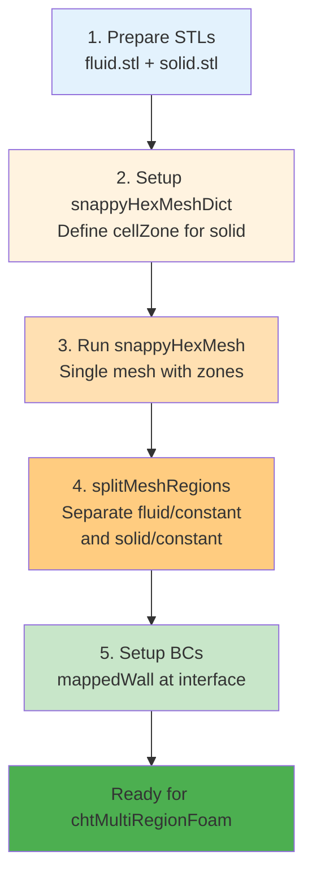

# การสร้างเมชหลายโดเมน (Multi-Region Meshing)

> [!TIP] ทำไมการสร้าง Multi-Region Mesh ถึงสำคัญ?
> การสร้าง Mesh หลายโดเมนในเคสเดียวเป็นเทคนิคที่จำเป็นสำหรับโจทย์ Conjugate Heat Transfer (CHT) หรือ Porous Media ซึ่งช่วยให้เราสามารถจำลองปฏิสัมพันธ์ระหว่างของไหลและของแข็งได้อย่างแม่นยำ โดยไม่ต้องสร้าง Case แยกกัน การเชื่อมต่อ Zone ต่างๆ ผ่าน CellZones และ FaceZones ทำให้การส่งผ่านความร้อนและโมเมนตัมระหว่างโดเมนเกิดขึ้นอย่างสมบูรณ์ ซึ่งเป็นหัวใจสำคัญของการทำ CFD ระดับมืออาชีพ
>
> **Domain D: Meshing** → `system/snappyHexMeshDict`

ในโจทย์ที่ซับซ้อน เช่น **Conjugate Heat Transfer (CHT)** (ของไหล + ของแข็ง) หรือ **Porous Media** เราจำเป็นต้องสร้าง Mesh ที่มีหลาย "Zone" อยู่ในเคสเดียวกัน โดยที่แต่ละ Zone เชื่อมต่อกันอย่างสมบูรณ์

`snappyHexMesh` รองรับการทำ Multi-Region แบบอัตโนมัติผ่านฟีเจอร์ **CellZones** และ **FaceZones**

> **ลิงก์ที่เกี่ยวข้อง**:
> - ดูการใช้ TopoSet จัดการ Zones → [../05_MESH_QUALITY_AND_MANIPULATION/02_Using_TopoSet_and_CellZones.md](../05_MESH_QUALITY_AND_MANIPULATION/02_Using_TopoSet_and_CellZones.md)

## 1. แนวคิด FaceZone vs CellZone

> [!NOTE] **📂 OpenFOAM Context**
> แนวคิดเรื่อง CellZone และ FaceZone เป็นพื้นฐานของโครงสร้าง Mesh ใน OpenFOAM:
> - **CellZones** → เก็บอยู่ใน `constant/polyMesh/cellZones` ใช้จัดกลุ่ม Cell สำหรับ Multi-region simulation (เช่น chtMultiRegionFoam) หรือกำหนด Porous zone
> - **FaceZones** → เก็บอยู่ใน `constant/polyMesh/faceZones` ใช้สร้าง Baffle, Fan, หรือ Interface ระหว่าง Region
>
> เมื่อรัน `splitMeshRegions` แต่ละ CellZone จะถูกแยกเป็น Mesh อิสระใน `constant/<regionName>/polyMesh`

*   **CellZone:** กลุ่มของ Cell (ปริมาตร) เช่น "กลุ่ม Cell ที่เป็น Heatsink" (Solid) และ "กลุ่ม Cell ที่เป็นอากาศ" (Fluid)
*   **FaceZone:** กลุ่มของ Face (ผิว) ภายในโดเมน มักใช้เป็น Baffle (แผ่นกั้นบาง) หรือ Fan (พัดลม)

## 2. การเตรียม Geometry สำหรับ Multi-Region

> [!NOTE] **📂 OpenFOAM Context**
> การเตรียม STL สำหรับ Multi-Region:
> - **ไฟล์ STL** → วางไว้ใน `constant/triSurface/` หรือ `geometry/` (ถ้าใช้ `includeEmesh "geometry";`)
> - **Keywords ใน snappyHexMeshDict**: `type triSurfaceMesh; name <surfaceName>;`
> - สำหรับ CHT ควรเตรียม STL แยกชัดเจนระหว่าง Fluid และ Solid เพื่อให้ง่ายต่อการกำหนด CellZone

สมมติเรามีท่อ (Fluid) ที่มีครีบระบายความร้อน (Solid) อยู่ข้างใน
เราต้องเตรียมไฟล์ STL 2 ไฟล์ (หรือไฟล์เดียวแยก Solid):
1.  `pipe_fluid.stl` (โดเมนหลัก)
2.  `fins.stl` (โดเมนย่อยข้างใน)

## 3. การตั้งค่าใน `snappyHexMeshDict`

> [!NOTE] **📂 OpenFOAM Context**
> **ไฟล์**: `system/snappyHexMeshDict`
>
> **Keywords สำคัญ**:
> - `geometry` → โหลด STL ด้วย `type triSurfaceMesh;`
> - `refinementSurfaces` → กำหนด `faceZone`, `cellZone`, และ `cellZoneInside`
> - `locationInMesh` (ใน `castellatedMeshControls`) → ระบุจุดใน Fluid domain
>
> เมื่อรัน `snappyHexMesh` เสร็จ จะได้ Mesh ที่มีหลาย CellZones อยู่ใน `constant/polyMesh/cellZones`

### ขั้นตอนที่ 1: Geometry Section
โหลดไฟล์เข้ามาตามปกติ

```cpp
geometry
{
    fins.stl
    {
        type triSurfaceMesh;
        name fins;
    }
    ...
};
```

### ขั้นตอนที่ 2: RefinementSurfaces (สร้าง FaceZone)
เราต้องบอกให้ sHM สร้าง FaceZone ตรงผิวของ Fins และเก็บ Cell ข้างในไว้ (ไม่ลบทิ้ง)

```cpp
refinementSurfaces
{
    fins
    {
        level (3 3);
        faceZone finsZone;      // ตั้งชื่อ FaceZone
        cellZone finsRegion;    // ตั้งชื่อ CellZone (สำคัญมาก!)
        cellZoneInside inside;  // บอกว่า CellZone นี้คือส่วนที่อยู่ "ข้างใน" STL นี้
        insidePoint (0.1 0.1 0.1); // (Optional) ระบุจุดข้างในถ้า STL ไม่ปิดสนิทดี
    }
}
```

### ขั้นตอนที่ 3: CastellatedMeshControls
ในส่วน `locationInMesh` เราจะระบุจุดที่อยู่ใน **Fluid Domain** ตามปกติ
sHM จะรู้เองว่า:
*   พื้นที่ Fluid -> Keep
*   พื้นที่ Fins (ที่มี `cellZone` กำหนดไว้) -> Keep (ไม่ลบ แม้จะไม่ได้ contain `locationInMesh`)
*   พื้นที่อื่น -> Delete

## 4. ผลลัพธ์ที่ได้

> [!NOTE] **📂 OpenFOAM Context**
> **Output files** หลังจากรัน `snappyHexMesh`:
> - `constant/polyMesh/cellZones` → บันทึก Cell ที่อยู่ในแต่ละ Zone (เช่น `finsRegion`)
> - `constant/polyMesh/faceZones` → บันทึก Face ที่เป็น Interface
> - ใช้ `checkMesh -topology` ตรวจสอบว่า Zone ถูกต้อง

เมื่อรันเสร็จ คุณจะได้ Mesh เดียวที่มี 2 Regions:
1.  Default Region (Fluid)
2.  `finsRegion` (Solid)

ในไฟล์ `constant/polyMesh/cellZones` จะมีรายชื่อ Cell ที่อยู่ใน Fins

## 5. การแยก Region ไปเป็นแยก Folder (SplitMeshRegions)

> [!NOTE] **📂 OpenFOAM Context**
> **คำสั่ง**: `splitMeshRegions -cellZones -overwrite`
>
> **Output structure**:
> - `constant/fluid/polyMesh/` → Mesh สำหรับ Fluid region
> - `constant/solid/polyMesh/` → Mesh สำหรับ Solid region
> - `0/fluid/` → Boundary conditions สำหรับ Fluid (U, p, T, k, epsilon, etc.)
> - `0/solid/` → Boundary conditions สำหรับ Solid (T, etc.)
>
> **Boundary type ที่เกิดขึ้น**:
> - `mappedWall` → Interface ระหว่าง Fluid-Solid (ใช้ `sampleMode nearestCell` หรือ `nearestPatchFace`)
> - สำหรับ CHT ต้อง set BC เป็น `compressible::turbulentTemperatureCoupledBaffleMixed` หรือ `externalWallHeatFlux`

สำหรับ CHT solver (เช่น `chtMultiRegionFoam`) เราต้องการแยก 2 zones นี้ออกจากกันเป็นคนละ Mesh (แต่ละ Mesh มี Boundary `T`, `U`, `p` ของตัวเอง)

คำสั่ง:
```bash
splitMeshRegions -cellZones -overwrite
```

ผลลัพธ์:
จะเกิดโฟลเดอร์ `constant/fluid/polyMesh` และ `constant/solid/polyMesh`
และที่รอยต่อระหว่าง Fluid-Solid จะเกิด Boundary type ใหม่ชื่อ **`mappedWall`** (ทำหน้าที่ส่งผ่านความร้อนระหว่างกัน)

## 6. สรุป Workflow สำหรับ CHT

> [!NOTE] **📂 OpenFOAM Context**
> **สรุป Case Structure สำหรับ chtMultiRegionFoam**:
> ```
> case/
> ├── 0/
> │   ├── fluid/
> │   │   ├── U, p, T, k, epsilon, ...
> │   │   └── fluid_to_solid (mappedWall)
> │   └── solid/
> │       ├── T
> │       └── solid_to_fluid (mappedWall)
> ├── constant/
> │   ├── fluid/
> │   │   ├── polyMesh/
> │   │   ├── thermophysicalProperties
> │   │   └── turbulenceProperties
> │   └── solid/
> │       ├── polyMesh/
> │       └── thermophysicalProperties
> └── system/
>     ├── controlDict
>     ├── fvSchemes
>     └── fvSolution
> ```
>
> **Boundary Conditions สำคัญ**:
> - ที่ Interface: ใช้ `compressible::turbulentTemperatureCoupledBaffleMixed` สำหรับ CHT
> - หรือ `externalWallHeatFlux` สำหรับ conjugate heat transfer กับ ambient
>
> **Solver**: `chtMultiRegionFoam` (สำหรับ compressible) หรือ custom solver

1.  เตรียม STL แยกชิ้น (Fluid.stl, Solid.stl)
2.  ตั้งค่า `snappyHexMeshDict`:
    *   กำหนด `cellZone` ให้กับ Solid STL
    *   `locationInMesh` อยู่ใน Fluid
3.  รัน `snappyHexMesh`
4.  รัน `splitMeshRegions -cellZones -overwrite`
5.  ตั้งค่า Boundary Condition ใน `0/fluid/...` และ `0/solid/...` ให้รอยต่อเป็น `turbulentTemperatureCoupledBaffleMixed`

**Multi-Region Meshing Workflow:**


นี่คือวิธีที่มืออาชีพใช้ทำ Simulation หม้อน้ำ, Heat Exchanger, หรือมอเตอร์ไฟฟ้า!

---

## 🧠 Concept Check: ทดสอบความเข้าใจ

### แบบฝึกหัดระดับง่าย (Easy)
1. **True/False**: `splitMeshRegions` สร้าง Mesh แยกกันสำหรับแต่ละ Region
   <details>
   <summary>คำตอบ</summary>
   ✅ จริง - สร้าง `constant/fluid/polyMesh` และ `constant/solid/polyMesh` แยกกัน
   </details>

2. **เลือกตอบ**: Boundary type ไหนที่เกิดขึ้นอัตโนมัติระหว่าง Fluid-Solid interface หลังจาก `splitMeshRegions`?
   - a) wall
   - b) patch
   - c) mappedWall
   - d) cyclic
   <details>
   <summary>คำตอบ</summary>
   ✅ c) mappedWall - สำหรับส่งผ่านความร้อนระหว่างกัน
   </details>

### แบบฝึกหัดระดับปานกลาง (Medium)
3. **อธิบาย**: ทำไมต้องกำหนด `cellZoneInside inside` ใน `refinementSurfaces`?
   <details>
   <summary>คำตอบ</summary>
   เพื่อบอก sHM ว่า Cell ที่อยู่ข้างใน STL นี้คือ "Solid region" ที่ต้องเก็บไว้ ไม่ให้ลบทิ้ง
   </details>

4. **สร้าง**: จงเขียน `refinementSurfaces` block สำหรับ `heatsink.stl` ที่กำหนด cellZone ชื่อ `heatsinkZone`
   <details>
   <summary>คำตอบ</summary>
   ```cpp
   refinementSurfaces
   {
       heatsink.stl
       {
           level (2 3);
           faceZone heatsinkZone;
           cellZone heatsinkRegion;
           cellZoneInside inside;
       }
   }
   ```
   </details>

### แบบฝึกหัดระดับสูง (Hard)
5. **Hands-on**: สร้าง Mesh 2 Regions (กล่อง + sphere ตรงกลาง) แล้วรัน `splitMeshRegions` และตรวจสอบผลลัพธ์


---

## 📖 เอกสารที่เกี่ยวข้อง

*   **บทก่อนหน้า**: [02_Refinement_Regions.md](02_Refinement_Regions.md)
*   **บทถัดไป**: [../05_MESH_QUALITY_AND_MANIPULATION/01_Mesh_Quality_Criteria.md](../05_MESH_QUALITY_AND_MANIPULATION/01_Mesh_Quality_Criteria.md)