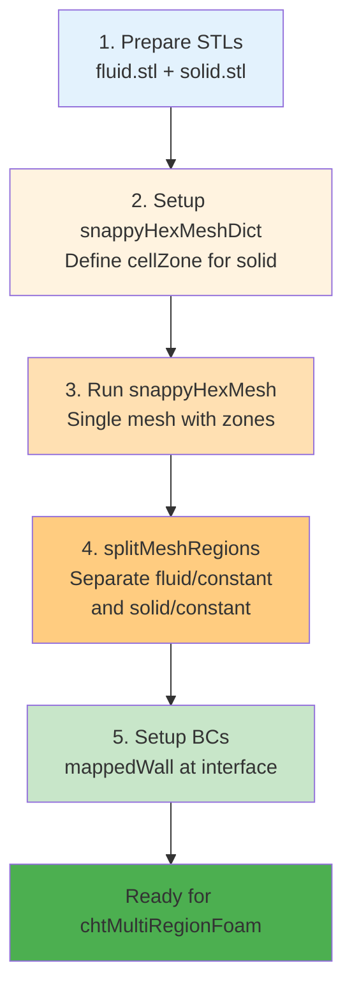

# การสร้างเมชหลายโดเมน (Multi-Region Meshing)

> [!TIP] **ทำไมการสร้าง Multi-Region Mesh ถึงสำคัญ?**
> การสร้าง Mesh หลายโดเมนในเคสเดียวเป็นเทคนิคที่จำเป็นสำหรับโจทย์ Conjugate Heat Transfer (CHT) หรือ Porous Media ซึ่งช่วยให้เราสามารถจำลองปฏิสัมพันธ์ระหว่างของไหลและของแข็งได้อย่างแม่นยำ โดยไม่ต้องสร้าง Case แยกกัน การเชื่อมต่อ Zone ต่างๆ ผ่าน CellZones และ FaceZones ทำให้การส่งผ่านความร้อนและโมเมนตัมระหว่างโดเมนเกิดขึ้นอย่างสมบูรณ์ ซึ่งเป็นหัวใจสำคัญของการทำ CFD ระดับมืออาชีพ
>
> **Domain D: Meshing** → `system/snappyHexMeshDict`

## 🎯 Learning Objectives

หลังจากศึกษาบทนี้ คุณจะสามารถ:

1. **เข้าใจความแตกต่าง** ระหว่าง CellZone และ FaceZone และบทบาทของแต่ละประเภทใน Multi-Region simulation
2. **ตั้งค่า snappyHexMeshDict** เพื่อสร้าง CellZone และ FaceZone อัตโนมัติจาก STL geometry
3. **ดำเนินการ splitMeshRegions** เพื่อแยก Multi-Region mesh เป็น separate mesh directories
4. **ตั้งค่า Boundary Conditions** สำหรับ CHT simulation โดยใช้ `mappedWall` และ `turbulentTemperatureCoupledBaffleMixed`
5. **แก้ปัญหา** ที่เกิดขึ้นได้จากการสร้าง Multi-Region mesh

## 📋 Prerequisites

ก่อนเริ่มบทนี้ คุณควรมีความรู้เบื้องต้นเกี่ยวกับ:

- ✅ การใช้งาน `snappyHexMesh` ขั้นพื้นฐาน (จากบท [01_Layer_Addition_Strategy.md](01_Layer_Addition_Strategy.md))
- ✅ ความเข้าใจเรื่อง Boundary Conditions ใน OpenFOAM
- ✅ โครงสร้างไฟล์ Case ของ OpenFOAM (`0/`, `constant/`, `system/`)
- ✅ แนวคิดเรื่อง Mesh topology (Cell, Face, Point)

---

## 📚 Background: CHT Workflow

ในโจทย์ที่ซับซ้อน เช่น **Conjugate Heat Transfer (CHT)** (ของไหล + ของแข็ง) หรือ **Porous Media** เราจำเป็นต้องสร้าง Mesh ที่มีหลาย "Zone" อยู่ในเคสเดียวกัน โดยที่แต่ละ Zone เชื่อมต่อกันอย่างสมบูรณ์

`snappyHexMesh` รองรับการทำ Multi-Region แบบอัตโนมัติผ่านฟีเจอร์ **CellZones** และ **FaceZones**

> **ลิงก์ที่เกี่ยวข้อง**:
> - ดูการใช้ TopoSet จัดการ Zones → [../05_MESH_QUALITY_AND_MANIPULATION/02_Using_TopoSet_and_CellZones.md](../05_MESH_QUALITY_AND_MANIPULATION/02_Using_TopoSet_and_CellZones.md)

---

## 1. แนวคิด FaceZone vs CellZone

> [!NOTE] **📂 OpenFOAM Context**
> แนวคิดเรื่อง CellZone และ FaceZone เป็นพื้นฐานของโครงสร้าง Mesh ใน OpenFOAM:
> - **CellZones** → เก็บอยู่ใน `constant/polyMesh/cellZones` ใช้จัดกลุ่ม Cell สำหรับ Multi-region simulation (เช่น chtMultiRegionFoam) หรือกำหนด Porous zone
> - **FaceZones** → เก็บอยู่ใน `constant/polyMesh/faceZones` ใช้สร้าง Baffle, Fan, หรือ Interface ระหว่าง Region
>
> เมื่อรัน `splitMeshRegions` แต่ละ CellZone จะถูกแยกเป็น Mesh อิสระใน `constant/<regionName>/polyMesh`

### CellZone vs FaceZone: ความแตกต่าง

| คุณลักษณะ | **CellZone** | **FaceZone** |
|------------|-------------|--------------|
| **นิยาม** | กลุ่มของ Cell (ปริมาตร 3D) | กลุ่มของ Face (ผิว 2D) |
| **ตัวอย่าง** | "กลุ่ม Cell ที่เป็น Heatsink" (Solid) <br/> "กลุ่ม Cell ที่เป็นอากาศ" (Fluid) | Baffle (แผ่นกั้นบาง) <br/> Fan (พัดลม) <br/> Interface ระหว่าง Region |
| **ไฟล์เก็บ** | `constant/polyMesh/cellZones` | `constant/polyMesh/faceZones` |
| **การใช้งาน** | Multi-region simulation (CHT) <br/> Porous zone | Baffle conditions <br/> Fan boundary <br/> Internal interfaces |
| **การแยก Region** | แยกเป็น `constant/<regionName>/` | ใช้เชื่อมระหว่าง Region |

---

## 2. การเตรียม Geometry สำหรับ Multi-Region

> [!NOTE] **📂 OpenFOAM Context**
> การเตรียม STL สำหรับ Multi-Region:
> - **ไฟล์ STL** → วางไว้ใน `constant/triSurface/` หรือ `geometry/` (ถ้าใช้ `includeEmesh "geometry";`)
> - **Keywords ใน snappyHexMeshDict**: `type triSurfaceMesh; name <surfaceName>;`
> - สำหรับ CHT ควรเตรียม STL แยกชัดเจนระหว่าง Fluid และ Solid เพื่อให้ง่ายต่อการกำหนด CellZone

### 2.1 หลักการเตรียม STL

**สมมติเรามีท่อ (Fluid) ที่มีครีบระบายความร้อน (Solid) อยู่ข้างใน**

เราต้องเตรียมไฟล์ STL 2 ไฟล์ (หรือไฟล์เดียวแยก Solid):

| ไฟล์ | บทบาท | คำอธิบาย |
|------|--------|----------|
| `pipe_fluid.stl` | โดเมนหลัก | กำหนดขอบเขตภายนอกของพื้นที่ Flow |
| `fins.stl` | โดเมนย่อย | Solid region ที่จะถูกกำหนดเป็น CellZone |

### 2.2 Best Practices สำหรับ STL

1. **STL ควรปิดสนิท (Watertight)**: ไม่มีรูหรือช่องว่างระหว่าง faces
2. **แยก Fluid กับ Solid ชัดเจน**: หลีกเลี่ยงการทับซ้อน (overlap) ระหว่าง STL
3. **ใช้ชื่อที่เป็นระบบ**: เช่น `<component>_<type>.stl` (เช่น `pipe_fluid.stl`, `heatsink_solid.stl`)
4. **ตรวจสอบคุณภาพ STL**: ใช้ `surfaceCheck` หรือเครื่องมืออื่นก่อนนำเข้า sHM

---

## 3. การตั้งค่าใน `snappyHexMeshDict`

> [!NOTE] **📂 OpenFOAM Context**
> **ไฟล์**: `system/snappyHexMeshDict`
>
> **Keywords สำคัญ**:
> - `geometry` → โหลด STL ด้วย `type triSurfaceMesh;`
> - `refinementSurfaces` → กำหนด `faceZone`, `cellZone`, และ `cellZoneInside`
> - `locationInMesh` (ใน `castellatedMeshControls`) → ระบุจุดใน Fluid domain
>
> เมื่อรัน `snappyHexMesh` เสร็จ จะได้ Mesh ที่มีหลาย CellZones อยู่ใน `constant/polyMesh/cellZones`

### 3.1 ขั้นตอนที่ 1: Geometry Section

โหลดไฟล์ STL เข้ามาตามปกติ

```cpp
geometry
{
    fins.stl
    {
        type triSurfaceMesh;
        name fins;
    }
    pipe_fluid.stl
    {
        type triSurfaceMesh;
        name pipe;
    }
    ...
};
```

### 3.2 ขั้นตอนที่ 2: RefinementSurfaces (สร้าง FaceZone และ CellZone)

เราต้องบอกให้ sHM สร้าง FaceZone ตรงผิวของ Fins และเก็บ Cell ข้างในไว้ (ไม่ลบทิ้ง)

```cpp
refinementSurfaces
{
    fins
    {
        level (3 3);              // Refinement level
        faceZone finsZone;        // ตั้งชื่อ FaceZone
        cellZone finsRegion;      // ตั้งชื่อ CellZone (สำคัญมาก!)
        cellZoneInside inside;    // บอกว่า CellZone นี้คือส่วนที่อยู่ "ข้างใน" STL นี้
        insidePoint (0.1 0.1 0.1); // (Optional) ระบุจุดข้างในถ้า STL ไม่ปิดสนิทดี
    }
    pipe
    {
        level (2 2);
        faceZone pipeZone;
    }
}
```

#### คำอธิบาย Keywords สำคัญ:

| Keyword | คำอธิบาย | ตัวอย่าง |
|---------|-----------|----------|
| `faceZone` | ชื่อของ FaceZone ที่จะสร้างที่ผิว STL | `finsZone` |
| `cellZone` | ชื่อของ CellZone ที่จะเก็บ Cell ข้างใน STL | `finsRegion` |
| `cellZoneInside` | บอกว่า CellZone นี้อยู่ภายใน STL | `inside` |
| `insidePoint` | จุดอ้างอิงภายใน STL (ถ้า STL ไม่ปิดสนิท) | `(0.1 0.1 0.1)` |

### 3.3 ขั้นตอนที่ 3: CastellatedMeshControls

ในส่วน `locationInMesh` เราจะระบุจุดที่อยู่ใน **Fluid Domain** ตามปกติ

```cpp
castellatedMeshControls
{
    locationInMesh (5.0 5.0 5.0);  // จุดที่อยู่ใน Fluid region
    ...
}
```

sHM จะรู้เองว่า:
*   พื้นที่ Fluid → Keep (เพราะมี `locationInMesh`)
*   พื้นที่ Fins (ที่มี `cellZone` กำหนดไว้) → Keep (ไม่ลบ แม้จะไม่ได้ contain `locationInMesh`)
*   พื้นที่อื่น → Delete

---

## 4. ผลลัพธ์หลังจากรัน snappyHexMesh

> [!NOTE] **📂 OpenFOAM Context**
> **Output files** หลังจากรัน `snappyHexMesh`:
> - `constant/polyMesh/cellZones` → บันทึก Cell ที่อยู่ในแต่ละ Zone (เช่น `finsRegion`)
> - `constant/polyMesh/faceZones` → บันทึก Face ที่เป็น Interface
> - ใช้ `checkMesh -topology` ตรวจสอบว่า Zone ถูกต้อง

### 4.1 โครงสร้าง Mesh ที่ได้

เมื่อรันเสร็จ คุณจะได้ Mesh เดียวที่มี 2 Regions:

1.  **Default Region** (Fluid) → Cell ทั่วไปในพื้นที่ Flow
2.  **`finsRegion`** (Solid) → Cell ที่อยู่ภายใน STL ของ Fins

### 4.2 การตรวจสอบ Zones

ตรวจสอบไฟล์ `constant/polyMesh/cellZones`:

```bash
# ดูรายชื่อ CellZones
cat constant/polyMesh/cellZones

# หรือใช้ checkMesh
checkMesh -topology
```

ผลลัพธ์ควรแสดงว่ามี CellZones ที่ถูกต้อง:

```
CellZones:
    finsRegion
    {
        cellLabels List<cell>
        ...
    }
```

---

## 5. การแยก Region ไปเป็นแยก Folder (SplitMeshRegions)

> [!NOTE] **📂 OpenFOAM Context**
> **คำสั่ง**: `splitMeshRegions -cellZones -overwrite`
>
> **Output structure**:
> - `constant/fluid/polyMesh/` → Mesh สำหรับ Fluid region
> - `constant/solid/polyMesh/` → Mesh สำหรับ Solid region
> - `0/fluid/` → Boundary conditions สำรับ Fluid (U, p, T, k, epsilon, etc.)
> - `0/solid/` → Boundary conditions สำหรับ Solid (T, etc.)
>
> **Boundary type ที่เกิดขึ้น**:
> - `mappedWall` → Interface ระหว่าง Fluid-Solid (ใช้ `sampleMode nearestCell` หรือ `nearestPatchFace`)
> - สำหรับ CHT ต้อง set BC เป็น `compressible::turbulentTemperatureCoupledBaffleMixed` หรือ `externalWallHeatFlux`

### 5.1 รันคำสั่ง splitMeshRegions

สำหรับ CHT solver (เช่น `chtMultiRegionFoam`) เราต้องการแยก 2 zones นี้ออกจากกันเป็นคนละ Mesh (แต่ละ Mesh มี Boundary `T`, `U`, `p` ของตัวเอง)

```bash
splitMeshRegions -cellZones -overwrite
```

### 5.2 โครงสร้าง Case หลังจาก splitMeshRegions

```
case/
├── 0/
│   ├── fluid/
│   │   ├── U
│   │   ├── p
│   │   ├── T
│   │   ├── k
│   │   ├── epsilon
│   │   └── fluid_to_solid (mappedWall)
│   └── solid/
│       ├── T
│       └── solid_to_fluid (mappedWall)
├── constant/
│   ├── fluid/
│   │   ├── polyMesh/
│   │   ├── thermophysicalProperties
│   │   └── turbulenceProperties
│   └── solid/
│       ├── polyMesh/
│       └── thermophysicalProperties
└── system/
    ├── controlDict
    ├── fvSchemes
    └── fvSolution
```

### 5.3 Boundary Type ที่เกิดขึ้น

ที่รอยต่อระหว่าง Fluid-Solid จะเกิด Boundary type ใหม่ชื่อ **`mappedWall`** ซึ่งทำหน้าที่:
- ส่งผ่านความร้อนระหว่างกัน
- แม็ปค่าจาก mesh หนึ่งไปยังอีก mesh หนึ่ง
- ใช้ `sampleMode nearestCell` หรือ `nearestPatchFace`

---

## 6. สรุป Workflow สำหรับ CHT

> [!NOTE] **📂 OpenFOAM Context**
> **Boundary Conditions สำคัญ**:
> - ที่ Interface: ใช้ `compressible::turbulentTemperatureCoupledBaffleMixed` สำหรับ CHT
> - หรือ `externalWallHeatFlux` สำหรับ conjugate heat transfer กับ ambient
>
> **Solver**: `chtMultiRegionFoam` (สำหรับ compressible) หรือ custom solver

### 6.1 5-Step Workflow สำหรับ CHT

| ขั้นตอน | การกระทำ | รายละเอียด |
|---------|----------|-------------|
| **1** | เตรียม STL แยกชิ้น | `fluid.stl`, `solid.stl` |
| **2** | ตั้งค่า `snappyHexMeshDict` | กำหนด `cellZone` ให้กับ Solid STL <br/> `locationInMesh` อยู่ใน Fluid |
| **3** | รัน `snappyHexMesh` | ได้ Mesh เดียวที่มีหลาย Zones |
| **4** | รัน `splitMeshRegions` | แยกเป็น `constant/fluid/` และ `constant/solid/` |
| **5** | ตั้งค่า BCs | รอยต่อเป็น `turbulentTemperatureCoupledBaffleMixed` |

### 6.2 Multi-Region Meshing Workflow Diagram



### 6.3 ตัวอย่าง Boundary Condition สำหรับ CHT

**ไฟล์**: `0/fluid/T` (ที่ interface)

```cpp
boundaryField
{
    fluid_to_solid
    {
        type            compressible::turbulentTemperatureCoupledBaffleMixed;
        value           uniform 300;
        Tnbr            T;
        kappa           fluidThermo;  // หรือ solidThermo สำหรับ solid side
    }
}
```

**ไฟล์**: `0/solid/T` (ที่ interface)

```cpp
boundaryField
{
    solid_to_fluid
    {
        type            compressible::turbulentTemperatureCoupledBaffleMixed;
        value           uniform 300;
        Tnbr            T;
        kappa           solidThermo;
    }
}
```

นี่คือวิธีที่มืออาชีพใช้ทำ Simulation หม้อน้ำ, Heat Exchanger, หรือมอเตอร์ไฟฟ้า!

---

## ⚠️ Common Pitfalls & Troubleshooting

> [!WARNING] **ปัญหาที่พบบ่อย**
> การสร้าง Multi-Region Mesh มีความซับซ้อนสูง และมีจุดที่ผิดพลาดได้ง่ายหลายจุด ตรวจสอบรายการด้านล่างอย่างละเอียดก่อนรัน simulation

### 1. ปัญหา splitMeshRegions ล้มเหลว

| อาการ | สาเหตุที่เป็นไปได้ | วิธีแก้ |
|--------|-----------------|----------|
| `splitMeshRegions` ไม่พบ CellZone | ไม่ได้กำหนด `cellZone` ใน `refinementSurfaces` | ตรวจสอบว่ามี `cellZone finsRegion;` ใน `snappyHexMeshDict` |
| Cell จำนวน 0 ใน Region | STL ไม่ได้ปิดสนิท หรือ `insidePoint` ผิด | ใช้ `insidePoint` หรือตรวจสอบ STL ด้วย `surfaceCheck` |
| Boundary `mappedWall` ไม่เกิด | CellZones ไม่ได้สัมผัสกัน | ตรวจสอบว่า Fluid และ Solid แชร์ผิวร่วมกัน |
| Error: `cannot find sampleMode` | BC ไม่ได้ตั้งค่าอย่างถูกต้อง | ตรวจสอบ BC ให้มี `sampleMode nearestCell;` |

### 2. ปัญหา CellZone ไม่ถูกสร้าง

**ตรวจสอบด้วย:**

```bash
# ตรวจสอบว่า CellZone ถูกสร้างหรือไม่
foamListTimes
cat constant/polyMesh/cellZones

# หรือใช้ checkMesh
checkMesh -topology | grep -A 10 "CellZones"
```

**วิธีแก้:**
- ตรวจสอบ `snappyHexMeshDict` ว่า `cellZone` และ `cellZoneInside inside` ถูกกำหนด
- ตรวจสอบว่า `locationInMesh` อยู่ในพื้นที่ที่ถูกต้อง
- รัน `snappyHexMesh` ใหม่ด้วย `-overwrite`

### 3. ปัญหา Boundary Conditions สำหรับ CHT

| ปัญหา | สาเหตุ | วิธีแก้ |
|-------|--------|----------|
| Temperature ไม่ลู่เข้า | BC ที่ interface ผิด | ใช้ `turbulentTemperatureCoupledBaffleMixed` และตรวจสอบ `kappa` |
| Heat flux ผิดปกติ | `Tnbr` ไม่ตรงกัน | ตรวจสอบว่า `Tnbr T` ชี้ไปที่ field ที่ถูกต้อง |
| Simulation diverge | Mesh คุณภาพต่ำที่ interface | เพิ่ม refinement ที่ interface หรือเพิ่ม layer cells |

### 4. การ Debug ทีละขั้นตอน

```bash
# 1. ตรวจสอบ CellZomes
cat constant/polyMesh/cellZones

# 2. ตรวจสอบ FaceZones
cat constant/polyMesh/faceZones

# 3. ตรวจสอบ Boundary types หลัง splitMeshRegions
ls -la 0/fluid/
ls -la 0/solid/

# 4. ตรวจสอบ mesh quality
checkMesh -topology

# 5. ทดสอบ BC โดยรันแค่ 1 timestep
chtMultiRegionFoam -postProcess -func singleGraph
```

---

## 📝 Key Takeaways

### หลักการสำคัญ

1. **CellZone vs FaceZone**: CellZone ใช้จัดกลุ่ม Cell (ปริมาตร) สำหรับ Multi-region simulation ส่วน FaceZone ใช้จัดกลุ่ม Face (ผิว) สำหรับ Baffle, Fan, หรือ Interface

2. **5-Step CHT Workflow**:
   - เตรียม STL แยกชิ้น → ตั้งค่า sHM (cellZone) → รัน sHM → รัน splitMeshRegions → ตั้งค่า BCs

3. **Keywords สำคัญใน snappyHexMeshDict**:
   - `cellZone <name>`: ตั้งชื่อ CellZone ที่จะสร้าง
   - `cellZoneInside inside`: บอก sHM ว่า Cell ข้างใน STL เป็น Region แยก
   - `faceZone <name>`: สร้าง FaceZone ที่ผิว STL

4. **splitMeshRegions**: แยก CellZones เป็น separate mesh directories (`constant/fluid/`, `constant/solid/`)

5. **Boundary Condition สำหรับ CHT**: ใช้ `compressible::turbulentTemperatureCoupledBaffleMixed` ที่ interface ระหว่าง Fluid-Solid

### สิ่งที่ต้องจำ

- ✅ เตรียม STL แยกชัดเจนระหว่าง Fluid และ Solid
- ✅ กำหนด `cellZone` และ `cellZoneInside inside` ใน `refinementSurfaces`
- ✅ `locationInMesh` ต้องอยู่ในพื้นที่ Fluid (ไม่ใช่ Solid)
- ✅ ใช้ `checkMesh -topology` ตรวจสอบ Zones หลังจากรัน sHM
- ✅ ใช้ `splitMeshRegions -cellZones -overwrite` แยก Regions
- ✅ ตั้งค่า BC ให้ถูกต้องที่ mappedWall interface

---

## 🎯 Expected Outcomes

หลังจากศึกษาและปฏิบัติตามบทนี้ คุณควรสามารถ:

1. **สร้าง Multi-Region Mesh** สำเร็จโดยใช้ `snappyHexMesh` และ `splitMeshRegions`
2. **แยกวิเคราะห์ CellZone กับ FaceZone** และใช้งานได้อย่างถูกต้อง
3. **ตั้งค่า CHT Case** ตั้งแต่เริ่มต้นจนถึงการรัน simulation
4. **แก้ปัญหา** ที่เกิดขึ้นได้จากการสร้าง Multi-Region Mesh
5. **ประยุกต์ใช้** กับโจทย์จริง เช่น Heat Exchanger, Heatsink, Electric Motor

---

## 🧠 Concept Check: ทดสอบความเข้าใจ

### แบบฝึกหัดระดับง่าย (Easy)

1. **True/False**: `splitMeshRegions` สร้าง Mesh แยกกันสำหรับแต่ละ Region
   <details>
   <summary>คำตอบ</summary>
   ✅ จริง - สร้าง `constant/fluid/polyMesh` และ `constant/solid/polyMesh` แยกกัน
   </details>

2. **เลือกตอบ**: Boundary type ไหนที่เกิดขึ้นอัตโนมัติระหว่าง Fluid-Solid interface หลังจาก `splitMeshRegions`?
   - a) wall
   - b) patch
   - c) mappedWall
   - d) cyclic
   <details>
   <summary>คำตอบ</summary>
   ✅ c) mappedWall - สำหรับส่งผ่านความร้อนระหว่างกัน
   </details>

3. **เลือกตอบ**: Keyword ไหนใน `snappyHexMeshDict` ที่บอกให้เก็บ Cell ภายใน STL?
   - a) faceZone
   - b) cellZone
   - c) cellZoneInside
   - d) locationInMesh
   <details>
   <summary>คำตอบ</summary>
   ✅ c) cellZoneInside - ใช้ร่วมกับ `cellZone` เพื่อบอกว่า Cell ข้างใน STL เป็น Region แยก
   </details>

### แบบฝึกหัดระดับปานกลาง (Medium)

4. **อธิบาย**: ทำไมต้องกำหนด `cellZoneInside inside` ใน `refinementSurfaces`?
   <details>
   <summary>คำตอบ</summary>
   เพื่อบอก sHM ว่า Cell ที่อยู่ข้างใน STL นี้คือ "Solid region" ที่ต้องเก็บไว้ ไม่ให้ลบทิ้ง โดยปกติ sHM จะลบ Cell ที่อยู่นอก `locationInMesh` แต่ถ้ากำหนด `cellZoneInside inside` ไว้ Cell เหล่านั้นจะถูกเก็บไว้เป็น CellZone แยก
   </details>

5. **สร้าง**: จงเขียน `refinementSurfaces` block สำหรับ `heatsink.stl` ที่กำหนด cellZone ชื่อ `heatsinkZone`
   <details>
   <summary>คำตอบ</summary>
   ```cpp
   refinementSurfaces
   {
       heatsink.stl
       {
           level (2 3);
           faceZone heatsinkZone;
           cellZone heatsinkRegion;
           cellZoneInside inside;
       }
   }
   ```
   </details>

6. **อธิบาย**: ทำไม `locationInMesh` ต้องอยู่ในพื้นที่ Fluid ไม่ใช่ Solid?
   <details>
   <summary>คำตอบ</summary>
   เพราะ sHM จะเก็บ Cell ที่อยู่รอบๆ `locationInMesh` และลบส่วนที่เหลือออก ถ้าระบุจุดใน Solid พื้นที่ Fluid อาจจะถูกลบทิ้ง การระบุจุดใน Fluid ทำให้แน่ใจว่าพื้นที่หลักถูกเก็บไว้ ส่วน Solid ที่มี `cellZone` กำหนดไว้จะถูกเก็บอัตโนมัติ
   </details>

### แบบฝึกหัดระดับสูง (Hard)

7. **Hands-on**: สร้าง Mesh 2 Regions (กล่อง + sphere ตรงกลาง) แล้วรัน `splitMeshRegions` และตรวจสอบผลลัพธ์
   <details>
   <summary>เฉลย (Guidelines)</summary>
   - เตรียม `box.stl` และ `sphere.stl`
   - กำหนด `cellZoneInside inside` สำหรับ sphere
   - `locationInMesh` อยู่ระหว่าง box และ sphere
   - รัน `snappyHexMesh` และตรวจสอบ `constant/polyMesh/cellZones`
   - รัน `splitMeshRegions -cellZones -overwrite`
   - ตรวจสอบว่ามี `constant/box/` และ `constant/sphere/`
   </details>

8. **Debug**: ถ้า `splitMeshRegions` แจ้งว่า "No cellZones found" คุณจะตรวจสอบอะไรบ้าง (อธิบาย 3 ขั้นตอน)?
   <details>
   <summary>คำตอบ</summary>
   1. ตรวจสอบ `constant/polyMesh/cellZones` ว่ามีอยู่จริงหรือไม่
   2. ตรวจสอบ `snappyHexMeshDict` ว่ามีการกำหนด `cellZone` และ `cellZoneInside inside` หรือไม่
   3. รัน `snappyHexMesh` ใหม่ แล้วตรวจสอบ log ว่า CellZones ถูกสร้างหรือไม่
   </details>

---

## 💻 Practical Exercises

### แบบฝึกหัด 1: สร้าง CHT Mesh อย่างง่าย

**เป้าหมาย**: สร้าง Mesh 2 Regions (Fluid + Solid) สำหรับ Heatsink อย่างง่าย

**ขั้นตอน**:
1. เตรียม STL 2 ไฟล์: `channel.stl` (Fluid) และ `heatsink.stl` (Solid)
2. สร้าง `snappyHexMeshDict` ที่กำหนด:
   - `cellZone heatsinkSolid` สำหรับ heatsink.stl
   - `locationInMesh` อยู่ใน channel
3. รัน `snappyHexMesh` และตรวจสอบ `constant/polyMesh/cellZones`
4. รัน `splitMeshRegions -cellZones -overwrite`
5. ตรวจสอบโครงสร้าง `constant/fluid/` และ `constant/solid/`

**Expected Output**:
- `constant/polyMesh/cellZones` มี `heatsinkSolid` zone
- `constant/fluid/polyMesh/` และ `constant/solid/polyMesh/` ถูกสร้าง
- Boundary `fluid_to_solid` และ `solid_to_fluid` เป็น `mappedWall`

---

### แบบฝึกหัด 2: ตั้งค่า BC สำหรับ CHT

**เป้าหมาย**: ตั้งค่า Boundary Conditions สำหรับ CHT simulation

**ขั้นตอน**:
1. สร้างไฟล์ `0/fluid/T` และ `0/solid/T`
2. ตั้งค่า BC ที่ interface:
   - `fluid_to_solid`: `compressible::turbulentTemperatureCoupledBaffleMixed`
   - `solid_to_fluid`: `compressible::turbulentTemperatureCoupledBaffleMixed`
3. ตั้งค่า BC อื่นๆ (inlet, outlet, walls)
4. ตรวจสอบด้วย `foamListTimes` และ `cat 0/fluid/T`

**Expected Output**:
- BC ที่ interface มี `type compressible::turbulentTemperatureCoupledBaffleMixed;`
- `Tnbr T;` ถูกตั้งค่าอย่างถูกต้อง
- `kappa` ถูกตั้งค่า (`fluidThermo` หรือ `solidThermo`)

---

### แบบฝึกหัด 3: Debug splitMeshRegions Failures

**เป้าหมาย**: แก้ปัญหาที่เกิดจากการสร้าง Multi-Region Mesh

**สถานการณ์**: คุณรัน `splitMeshRegions` แต่ได้ error "No cellZones found"

**ขั้นตอนการแก้ปัญหา**:
1. ตรวจสอบ `constant/polyMesh/cellZones` ว่ามีอยู่หรือไม่
2. ตรวจสอบ `snappyHexMeshDict` ว่ามีการกำหนด `cellZone` หรือไม่
3. ตรวจสอบ log จาก `snappyHexMesh` ว่า CellZones ถูกสร้างหรือไม่
4. รัน `checkMesh -topology` เพื่อตรวจสอบ Zones
5. แก้ไข `snappyHexMeshDict` และรันใหม่

**Expected Output**:
- พบสาเหตุของปัญหา (เช่น ไม่ได้กำหนด `cellZone`, STL ไม่ปิดสนิท)
- แก้ไขได้สำเร็จและ `splitMeshRegions` ทำงานได้

---

## 📖 เอกสารที่เกี่ยวข้อง

*   **บทก่อนหน้า**: [02_Refinement_Regions.md](02_Refinement_Regions.md) - การกำหนด Refinement Regions สำหรับพื้นที่สนใจ
*   **บทถัดไป**: [../05_MESH_QUALITY_AND_MANIPULATION/01_Mesh_Quality_Criteria.md](../05_MESH_QUALITY_AND_MANIPULATION/01_Mesh_Quality_Criteria.md) - การประเมินคุณภาพ Mesh
*   **เอกสารเกี่ยวข้อง**: [../05_MESH_QUALITY_AND_MANIPULATION/02_Using_TopoSet_and_CellZones.md](../05_MESH_QUALITY_AND_MANIPULATION/02_Using_TopoSet_and_CellZones.md) - การใช้ TopoSet จัดการ Zones

---

## 🔄 Revision History

- **2024-12-30**: Refactored - เพิ่ม Learning Objectives, Key Takeaways, Expected Outcomes, Prerequisites, Common Pitfalls, Practical Exercises, ปรับปรุงโครงสร้างและคำอธิบาย