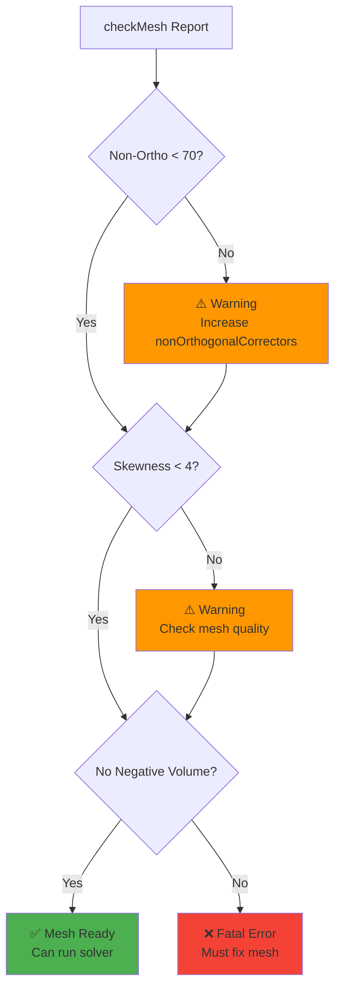

# เกณฑ์คุณภาพเมช (Mesh Quality Criteria)

## Learning Objectives

หลังจากอ่านบทนี้ คุณจะสามารถ:

1. **ระบุเกณฑ์คุณภาพเมชหลัก** (Key Mesh Quality Metrics) - รู้จักและเข้าใจ Non-orthogonality, Skewness, Aspect Ratio, และ Mesh Volume
2. **เข้าใจผลกระทบต่อความเสถียรของ Solver** (Understand Impact on Solver Stability) - ทราบว่าแต่ละเกณฑ์กระทบต่อความเสถียร ความแม่นยำ และความเร็วของการคำนวณอย่างไร
3. **ทราบค่าที่ยอมรับได้** (Know Acceptable Thresholds) - รู้ค่าที่เป็นเกณฑ์ว่า Mesh นั้นดีพอหรือต้องปรับปรุง

---

> [!TIP]
> **ทำไม Mesh Quality สำคัญต่อการจำลอง?**
>
> คุณภาพของ Mesh เป็นปัจจัยสำคัญที่สุดที่กำหนด **ความเสถียร (Stability)** และ **ความแม่นยำ (Accuracy)** ของการแก้สมการ:
> *   **Mesh ที่มี Non-orthogonality สูง:** ทำให้เกิด Error ในการคำนวณ Flux ผ่านหน้า Cell ต้องใช้ Non-orthogonal Correctors เพิ่ม ทำให้ Solver ช้าลงอย่างมหาศาล
> *   **Mesh ที่มี Skewness สูง:** ทำให้เสียการแม่นยำระดับ Second-order ลดเหลือ First-order ทำให้ผลลัพธ์มีความคลาดเคลื่อนสูง
> *   **Negative Volume:** Solver จะหยุดทำงานทันที (Diverge หรือ Crash) เพราะไม่สามารถคำนวณปริมาตรของ Cell ที่กลับด้านได้
>
> การตรวจสอบ Mesh Quality จึงเป็น **ขั้นตอนบังคับ** ก่อนรัน Simulation ทุกครั้ง

"Mesh ที่ดีคือ Mesh ที่ Solver ชอบ" แล้ว Solver ชอบแบบไหน? คำตอบคือ **Orthogonal, Low Skewness, Smooth Grading**

> **ลิงก์ที่เกี่ยวข้อง**:
> - ดู Layer Addition ที่กระทบคุณภาพ → [../04_SNAPPYHEXMESH_ADVANCED/01_Layer_Addition_Strategy.md](../04_SNAPPYHEXMESH_ADVANCED/01_Layer_Addition_Strategy.md)

> [!NOTE]
> **📂 OpenFOAM Context: checkMesh Overview**
>
> **คำสั่งพื้นฐาน:**
> *   `checkMesh` - ตรวจสอบพื้นฐาน
> *   `checkMesh -allGeometry -allTopology` - ตรวจสอบทั้งหมด (แนะนำ)
>
> **สิ่งที่ checkMesh สร้าง:**
> *   **รายงานค่าสถิติ** - ค่า Max/Avg/ของแต่ละเกณฑ์
> *   **CellSets** - กลุ่ม Cell/Faces ที่มีปัญหา (เช่น `nonOrthoFaces`, `skewFaces`, `negativeVolumeCells`)
> *   **Mesh Quality Report** - สรุปผลการตรวจสอบ
>
> **การดู CellSets ใน ParaView:**
> 1. เปิดไฟล์ `.foam` หรือ `.OpenFOAM`
> 2. ติ๊ก "Include Sets" ใน Properties panel
> 3. ใช้ "Extract Block" เพื่อดูเฉพาะ CellSets ที่มีปัญหา
> 4. ปรับ Opacity ของ Mesh หลักเพื่อให้เห็นตำแหน่งชัดเจน

---

## 1. Non-Orthogonality (ความไม่ตั้งฉาก)

<!-- IMAGE: IMG_02_001 -->
<!-- 
Purpose: เพื่ออธิบาย "ศัตรูตัวฉกาจที่สุด" ของ FVM: Non-Orthogonality. ภาพนี้ต้องแสดงให้เห็นชัดเจนว่าใน Mesh ที่บิดเบี้ยว เวกเตอร์เชื่อมศูนย์กลาง (d) ไม่ขนานกับเวกเตอร์พื้นที่หน้าตัด (n) ซึ่งทำให้การคำนวณ Flux ตรงๆ ผิดพลาด ต้องเปรียบเทียบกรณี Ideal (90 องศา) กับ Realistic (Skewed มุม theta) เพื่อให้ผู้เรียนเข้าใจว่าทำไมต้องมี "corrector loops" ใน fvSolution
Prompt: "2D Engineering Diagram comparing Mesh Orthogonality. **Left Panel (Orthogonal):** Two perfect square cells (P and N), flux vector 'd' parallel to surface normal 'n'. Label: 'Good: theta = 0 deg'. **Right Panel (Non-Orthogonal):** Skewed cells, vector 'd' misaligned with 'n'. Red arc showing angle 'theta'. Label: 'Bad: theta > 70 deg'. **Style:** Clean technical drawing, black lines, white background, mathematical labels."
-->
![[IMG_02_001.jpg]]

นี่คือศัตรูตัวฉกาจที่สุดของ FVM

*   **นิยาม:** มุมระหว่างเส้นเชื่อมจุดศูนย์กลางเซลล์ ($d$) กับ Normal vector ($n$) ของหน้า
*   **ทำไมถึงแย่:** สมการ Diffusion ($\nabla^2 \phi$) ต้องการคำนวณ Flux ผ่านหน้า หาก $d$ กับ $n$ ไม่ขนานกัน Flux จะถูกคำนวณผิด
*   **การแก้ไขของ Solver:** OpenFOAM มี "Non-orthogonal Corrector" (ใน `fvSolution` -> `nNonOrthogonalCorrectors`)
    *   Mesh ดี (< 70): ใช้ 0 รอบ (เร็วสุด)
    *   Mesh พอใช้ (70-80): ใช้ 1 รอบ
    *   Mesh แย่ (80-85): ใช้ 2-3 รอบ (ช้าลง 2-3 เท่า!)
    *   Mesh พัง (> 85): มักจะ Diverge หรือต้องใช้ `nonOrthogonalCorrectors` สูงมากจนไม่คุ้ม

> [!NOTE]
> **📂 OpenFOAM Context**
>
> **การตั้งค่า Non-orthogonal Correctors:**
> *   **File:** `system/fvSolution`
> *   **Keyword:** `nNonOrthogonalCorrectors` (อยู่ภายใต้ `SIMPLE` / `PISO` / `PIMPLE`)
>
> ```cpp
> SIMPLE
> {
>     nNonOrthogonalCorrectors 2;  // เพิ่มถ้า Non-ortho > 70
> }
> ```
>
> **การวินิจฉัย:**
> *   ดูค่าสูงสุดของ `Max: nonOrthogonality` ในรายงาน checkMesh
> *   ใช้ ParaView เปิดดู `nonOrthoFaces` CellSet

**วิธีแก้ที่ต้นเหตุ:**
*   ใน `blockMesh`: พยายามให้เส้น Grid ตัดกันเป็นมุมฉาก
*   ใน `snappyHexMesh`: เพิ่ม `nCellsBetweenLevels` เพื่อให้การเปลี่ยนขนาด Cell นุ่มนวลขึ้น

---

## 2. Skewness (ความเบ้)

<!-- IMAGE: IMG_02_002 -->
<!-- 
Purpose: เพื่ออธิบายความหมายของ Skewness ที่คนมักเข้าใจผิด (ไม่ใช่แค่รูปร่างเบี้ยว แต่คือ "จุดตัดไม่ตรงศูนย์กลางหน้า"). ภาพต้องซูมไปที่หน้าตัด (Face) ระหว่าง 2 Cells และโชว์ระยะห่าง (Needle/Error vector) ระหว่างจุดที่เส้นเชื่อมศูนย์กลางเจาะทะลุ ($f_i$) กับจุดกึ่งกลางทางเรขาคณิต ($f_c$)
Prompt: "2D Technical Diagram of Skewness Error. **Geometry:** Two adjacent irregular quadrilateral cells sharing a face. **Key Elements:** 1. A dashed line connecting cell centers P and N. 2. A Blue Point at the true geometric center of the specific shared face (labeled 'fc'). 3. A Red 'X' where the P-N line intersects the face (labeled 'fi'). 4. A distinct Red Vector arrow showing the distance between 'fc' and 'fi', labeled 'Error'. **Style:** 2D flat schematic, zoom-in view, white background, black lines. No 3D."
-->
![[IMG_02_002.jpg]]

*   **นิยาม:** ระยะห่างระหว่างจุดที่เส้นเชื่อม Cell ตัดผ่านหน้า ($P_{intersect}$) กับจุด Centroid ของหน้า ($P_{face}$)
*   **ทำไมถึงแย่:** การคำนวณค่าที่หน้า (Interpolation) จะใช้สมมติฐานว่าค่าอยู่ที่กลางหน้า ถ้าจุดตัดมันเบี้ยวไปไกล Error จะสูง (Second-order accuracy ลดลงเหลือ First-order)
*   **Internal Skewness:** ยอมรับได้ไม่เกิน 4 (OpenFOAM definition)
*   **Boundary Skewness:** มักเกิดที่ผิวขรุขระ หรือมุมแหลม

> [!NOTE]
> **📂 OpenFOAM Context**
>
> **การป้องกันใน Mesh Generation:**
> *   **File:** `system/snappyHexMeshDict`
> *   **Keywords:**
>     *   `nCellsBetweenLevels` - การเปลี่ยนระดับขนาด Cell ที่นุ่มนวล
>     *   `featureAngle` - ควบคุมการจับมุมที่แหลม
>     *   `snapControls` -> `nSmoothPatch` - การปรับพื้นผิวให้เรียบ
>
> **การตรวจสอบ:**
> *   ดูค่า `Max: skewness` ในรายงาน
> *   ใช้ ParaView เพื่อดู `skewFaces` set

**วิธีแก้:**
*   ตรวจสอบ `snappyHexMesh` ขั้นตอน Snap ว่าดึงจุดแรงเกินไปไหม
*   ลด `featureAngle` ไม่ให้พยายามจับมุมที่แหลมเกินไป

---

## 3. Aspect Ratio (อัตราส่วนกว้างยาว)

<!-- IMAGE: IMG_02_003 -->
<!-- 
Purpose: เพื่อแสดงความสัมพันธ์ระหว่าง Aspect Ratio และทิศทางการไหล (Flow Alignment). ภาพนี้ต้องแก้ความเข้าใจผิดว่า "Cell ผอมๆ ไม่ดีเสมอไป" — จริงๆ แล้วดีมากใน Boundary Layer ตราบใดที่ Flow ไหลขนานด้านยาว. ต้องเปรียบเทียบกรณี "Good High AR" (Aligned) กับ "Bad High AR" (Misaligned/Cross-flow)
Prompt: "Comparative diagram of Cell Aspect Ratio vs Flow Direction. **Top Panel (Boundary Layer - Good):** A row of very thin, stretched prism cells (Aspect Ratio > 50) near a wall. Streamlines (Flow arrows) run **parallel** to the long axis of cells. Green checkmark 'Acceptable'. **Bottom Panel (Free Shear - Bad):** The same thin cells, but Streamlines cut **across** them perpendicularly (Cross-flow). Red cross 'Inaccurate/Diffusive'. STYLE: Engineering flow visualization, streamline arrows in blue, mesh lines in black, clear Good/Bad indicators."
-->
![[IMG_02_003.jpg]]

*   **นิยาม:** ด้านยาวสุด / ด้านสั้นสุด
*   **ผลกระทบ:**
    *   ถ้า Flow ไหลขนานกับด้านยาว (เช่น Boundary Layer): **ไม่เป็นไร** (Aspect Ratio 1000 ก็รับได้)
    *   ถ้า Flow ไหลตั้งฉากหรือเฉียง (เช่น หมุนวน): Aspect Ratio สูงจะทำให้ Error กระจายตัวไม่เท่ากัน (Anisotropic error)
*   **คำแนะนำ:** พยายามเลี้ยงให้ต่ำกว่า 20-50 ในบริเวณที่มีการหมุนวน (Vortices)

> [!NOTE]
> **📂 OpenFOAM Context**
>
> **การควบคุมใน Mesh Generation:**
> *   **File:** `system/snappyHexMeshDict`
> *   **Keywords:**
>     *   `layers` -> `thickness` -> `finalLayerThickness` - ควบคุมความบางของ Boundary Layer
>     *   `layers` -> `nSurfaceLayers` - จำนวนเลเยอร์ที่ใช้
>     *   `expansionRatio` - อัตราการขยายตัวของ Cell แต่ละเลเยอร์
>
> **คำแนะนำ:**
> *   Boundary Layer: Aspect Ratio สูงถึง 1000 ยังรับได้ (ถ้าไหลขนาน)
> *   บริเวณที่มี Vortex: ควรเก็บต่ำกว่า 20-50

---

## 4. Mesh Volume (Negative Volume)

ถ้า `checkMesh` บอกว่า **"Failed with ... negative volume cells"**

*   **ความหมาย:** Cell กลับตะศิลา (Inside-out) หรือบิดจนพับ
*   **สาเหตุ:**
    *   `blockMesh`: เรียงจุดผิดกฎมือขวา
    *   `snappyHexMesh`: การ Snap ผิดพลาด (จุดถูกดึงทะลุอีกฝั่ง)
    *   Dynamic Mesh: Mesh เคลื่อนที่จนทับกัน
*   **ทางแก้:** ต้องแก้ที่ Mesh เท่านั้น Solver รันไม่ได้แน่นอน 100%

> [!NOTE]
> **📂 OpenFOAM Context**
>
> **การวินิจฉัยและการแก้ไข:**
> *   **CellSets ที่เกิดขึ้น:** `negativeVolumeCells`
> *   **การดูตำแหน่ง:** ใช้ ParaView เปิด Mesh และเลือก "Include Sets"
>
> **สาเหตุที่เป็นไปได้:**
> *   **File:** `system/blockMeshDict` - การเรียงจุด (vertices) ผิดกฎมือขวา
> *   **File:** `system/snappyHexMeshDict`:
>     *   `snapControls` -> `nSnapPatch` - Snap จัดเกินไปทำให้จุดทะลุ
>     *   `locationInMesh` - ตั้งค่าผิดตำแหน่ง
> *   **File:** `dynamicMeshDict` (ถ้าใช้ Dynamic Mesh) - Mesh เคลื่อนที่จนทับกัน

---

## 5. Mesh Quality Acceptance Criteria

**Mesh Quality Acceptance Criteria:**


> [!SUMMARY]
> **ค่าที่ยอมรับได้ (Acceptable Thresholds):**
> *   **Orthogonality:** < 70 (Safe), < 85 (Manageable)
> *   **Skewness:** < 4
> *   **Aspect Ratio:** < 1000 (Boundary Layer), < 20 (Free stream)
> *   **Volume:** Must be Positive!

---

## 🧠 Concept Check: ทดสอบความเข้าใจ

### แบบฝึกหัดระดับง่าย (Easy)
1. **True/False**: Non-orthogonality = 80° ถือว่า Mesh คุณภาพดีมาก
   <details>
   <summary>คำตอบ</summary>
   ❌ เท็จ - 80° อยู่ในช่วง "Manageable" (ต้องเพิ่ม nonOrthogonalCorrectors)
   </details>

2. **เลือกตอบ**: Aspect Ratio สูงๆ (เช่น 1000) ยอมรับได้ที่สุดในส่วนไหนของ Mesh?
   - a) Boundary Layer
   - b) Free stream
   - c) Vortex region
   - d) ทุกที่
   <details>
   <summary>คำตอบ</summary>
   ✅ a) Boundary Layer - ถ้า Flow ไหลขนานกับด้านยาวของ Cell
   </details>

### แบบฝึกหัดระดับปานกลาง (Medium)
3. **อธิบาย**: ทำไม Non-orthogonality สูงทำให้ Solver ช้าลง?
   <details>
   <summary>คำตอบ</summary>
   เพราะต้องใช้ nonOrthogonalCorrectors เพิ่ม ซ้ำการคำนวณ ทำให้ใช้เวลา CPU มากขึ้น
   </details>

4. **วิเคราะห์**: ถ้า `checkMesh` รายงานว่ามี 10 cells ที่มี Negative volume คุณควรทำอย่างไร?
   <details>
   <summary>คำตอบ</summary>
   ต้องแก้ Mesh ทันที Solver จะรันไม่ได้ 100% ให้ตรวจสอบจุดนั้นด้วย ParaView แล้วแก้ปัญหาต้นเหตุ
   </details>

### แบบฝึกหัดระดับสูง (Hard)
5. **Hands-on**: รัน `checkMesh` กับ Tutorial case ใดๆ แล้วตรวจสอบว่ามี cells ที่มีปัญหา Non-ortho หรือ Skewness กี่ cell และอยู่ตรงไหน

---

## Key Takeaways

**🎯 สรุปสิ่งสำคัญ (Key Takeaways):**

1. **Mesh Quality คือปัจจัยสำคัญที่สุด** - กำหนดความเสถียรและความแม่นยำของการจำลอง
   - Non-orthogonality สูง → ต้องใช้ Correctors เพิ่ม → Solver ช้าลง
   - Skewness สูง → Second-order accuracy ลดเหลือ First-order → ความแม่นยำลดลง
   - Negative Volume → Solver Crash ทันที

2. **เกณฑ์ค่าที่ยอมรับได้:**
   - **Non-orthogonality:** < 70° (ดีมาก), < 85° (ยอมรับได้)
   - **Skewness:** < 4 (OpenFOAM definition)
   - **Aspect Ratio:** < 1000 สำหรับ Boundary Layer, < 20 สำหรับ Vortex regions
   - **Volume:** ต้องเป็นค่าบวกเสมอ

3. **การใช้ checkMesh:**
   - รัน `checkMesh -allGeometry -allTopology` ก่อนเริ่ม Simulation ทุกครั้ง
   - ตรวจสอบค่า Max/Avg ของแต่ละเกณฑ์
   - ใช้ ParaView เปิดดู CellSets (`nonOrthoFaces`, `skewFaces`, `negativeVolumeCells`) เพื่อหาตำแหน่งที่ต้องแก้

4. **การแก้ปัญหาที่ต้นเหตุ:**
   - Non-orthogonality: เพิ่ม `nNonOrthogonalCorrectors` หรือปรับ Mesh ให้ตัดกันเป็นมุมฉาก
   - Skewness: ปรับ `nCellsBetweenLevels`, `featureAngle`, และ `snapControls`
   - Negative Volume: ตรวจสอบการเรียงจุดใน `blockMeshDict` หรือลด `nSnapPatch`

5. **Aspect Ratio ไม่ใช่ปัญหาเสมอไป** - ถ้า Flow ไหลขนานกับด้านยาวของ Cell (เช่น Boundary Layer) ค่าสูงถึง 1000 ก็ยอมรับได้

---

## 📖 เอกสารที่เกี่ยวข้อง

*   **บทก่อนหน้า**: [../04_SNAPPYHEXMESH_ADVANCED/03_Multi_Region_Meshing.md](../04_SNAPPYHEXMESH_ADVANCED/03_Multi_Region_Meshing.md)
*   **บทถัดไป**: [02_Using_TopoSet_and_CellZones.md](02_Using_TopoSet_and_CellZones.md)