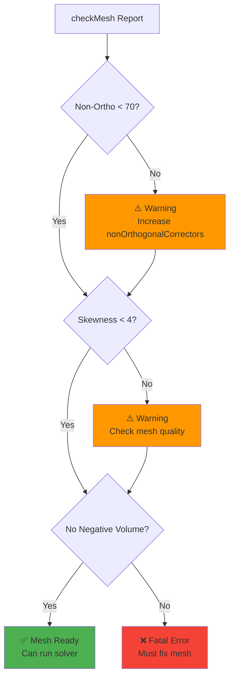

# เกณฑ์คุณภาพเมช (Mesh Quality Criteria)

"Mesh ที่ดีคือ Mesh ที่ Solver ชอบ" แล้ว Solver ชอบแบบไหน? คำตอบคือ **Orthogonal, Low Skewness, Smooth Grading**

> **ลิงก์ที่เกี่ยวข้อง**:
> - ดู Layer Addition ที่กระทบคุณภาพ → [../04_SNAPPYHEXMESH_ADVANCED/01_Layer_Addition_Strategy.md](../04_SNAPPYHEXMESH_ADVANCED/01_Layer_Addition_Strategy.md)

เมื่อคุณรันคำสั่ง `checkMesh` (หรือ `checkMesh -allGeometry -allTopology`) OpenFOAM จะรายงานค่าสถิติต่างๆ หากเข้าใจความหมาย คุณจะรู้ทันทีว่าต้องแก้ตรงไหน

## 1. Non-Orthogonality (ความไม่ตั้งฉาก)

นี่คือศัตรูตัวฉกาจที่สุดของ FVM

*   **นิยาม:** มุมระหว่างเส้นเชื่อมจุดศูนย์กลางเซลล์ ($d$) กับ Normal vector ($n$) ของหน้า
*   **ทำไมถึงแย่:** สมการ Diffusion ($
abla^2 \phi$) ต้องการคำนวณ Flux ผ่านหน้า หาก $d$ กับ $n$ ไม่ขนานกัน Flux จะถูกคำนวณผิด
*   **การแก้ไขของ Solver:** OpenFOAM มี "Non-orthogonal Corrector" (ใน `fvSolution` -> `nNonOrthogonalCorrectors`)
    *   Mesh ดี (< 70): ใช้ 0 รอบ (เร็วสุด)
    *   Mesh พอใช้ (70-80): ใช้ 1 รอบ
    *   Mesh แย่ (80-85): ใช้ 2-3 รอบ (ช้าลง 2-3 เท่า!)
    *   Mesh พัง (> 85): มักจะ Diverge หรือต้องใช้ `nonOrthogonalCorrectors` สูงมากจนไม่คุ้ม

**วิธีแก้ที่ต้นเหตุ:**
*   ใน `blockMesh`: พยายามให้เส้น Grid ตัดกันเป็นมุมฉาก
*   ใน `snappyHexMesh`: เพิ่ม `nCellsBetweenLevels` เพื่อให้การเปลี่ยนขนาด Cell นุ่มนวลขึ้น

## 2. Skewness (ความเบ้)

*   **นิยาม:** ระยะห่างระหว่างจุดที่เส้นเชื่อม Cell ตัดผ่านหน้า ($P_{intersect}$) กับจุด Centroid ของหน้า ($P_{face}$)
*   **ทำไมถึงแย่:** การคำนวณค่าที่หน้า (Interpolation) จะใช้สมมติฐานว่าค่าอยู่ที่กลางหน้า ถ้าจุดตัดมันเบี้ยวไปไกล Error จะสูง (Second-order accuracy ลดลงเหลือ First-order)
*   **Internal Skewness:** ยอมรับได้ไม่เกิน 4 (OpenFOAM definition)
*   **Boundary Skewness:** มักเกิดที่ผิวขรุขระ หรือมุมแหลม

**วิธีแก้:**
*   ตรวจสอบ `snappyHexMesh` ขั้นตอน Snap ว่าดึงจุดแรงเกินไปไหม
*   ลด `featureAngle` ไม่ให้พยายามจับมุมที่แหลมเกินไป

## 3. Aspect Ratio (อัตราส่วนกว้างยาว)

*   **นิยาม:** ด้านยาวสุด / ด้านสั้นสุด
*   **ผลกระทบ:**
    *   ถ้า Flow ไหลขนานกับด้านยาว (เช่น Boundary Layer): **ไม่เป็นไร** (Aspect Ratio 1000 ก็รับได้)
    *   ถ้า Flow ไหลตั้งฉากหรือเฉียง (เช่น หมุนวน): Aspect Ratio สูงจะทำให้ Error กระจายตัวไม่เท่ากัน (Anisotropic error)
*   **คำแนะนำ:** พยายามเลี้ยงให้ต่ำกว่า 20-50 ในบริเวณที่มีการหมุนวน (Vortices)

## 4. Mesh Volume (Negative Volume)

ถ้า `checkMesh` บอกว่า **"Failed with ... negative volume cells"**
*   **ความหมาย:** Cell กลับตะศิลา (Inside-out) หรือบิดจนพับ
*   **สาเหตุ:**
    *   `blockMesh`: เรียงจุดผิดกฎมือขวา
    *   `snappyHexMesh`: การ Snap ผิดพลาด (จุดถูกดึงทะลุอีกฝั่ง)
    *   Dynamic Mesh: Mesh เคลื่อนที่จนทับกัน
*   **ทางแก้:** ต้องแก้ที่ Mesh เท่านั้น Solver รันไม่ได้แน่นอน 100%

**Mesh Quality Acceptance Criteria:**

## 5. วิธีตรวจสอบตำแหน่ง Cell ที่มีปัญหา

เมื่อ `checkMesh` เจอ Error มันจะสร้าง **CellSet** ชื่อ `nonOrthoFaces`, `skewFaces` ฯลฯ ไว้ให้

**วิธีดูใน ParaView:**
1.  รัน `foamToVTK -cellSet nonOrthoFaces` (หรือเปิด .foam ปกติ)
2.  ใน ParaView เลือก "Include Sets" (ติ๊กถูก)
3.  เปลี่ยน Opacity ของ Mesh หลักให้จางลง
4.  คุณจะเห็นจุดสีแดงๆ โผล่ขึ้นมา นั่นคือตำแหน่งที่ต้องแก้!

> [!SUMMARY]
> *   **Orthogonality:** < 70 (Safe), < 85 (Manageable)
> *   **Skewness:** < 4
> *   **Aspect Ratio:** < 1000 (Boundary Layer), < 20 (Free stream)
> *   **Volume:** Must be Positive!

---

## 📝 แบบฝึกหัด (Exercises)

### แบบฝึกหัดระดับง่าย (Easy)
1. **True/False**: Non-orthogonality = 80° ถือว่า Mesh คุณภาพดีมาก
   

   
คำตอบ

   ❌ เท็จ - 80° อยู่ในช่วง "Manageable" (ต้องเพิ่ม nonOrthogonalCorrectors)
   

2. **เลือกตอบ**: Aspect Ratio สูงๆ (เช่น 1000) ยอมรับได้ที่สุดในส่วนไหนของ Mesh?
   - a) Boundary Layer
   - b) Free stream
   - c) Vortex region
   - d) ทุกที่
   

   
คำตอบ

   ✅ a) Boundary Layer - ถ้า Flow ไหลขนานกับด้านยาวของ Cell
   

### แบบฝึกหัดระดับปานกลาง (Medium)
3. **อธิบาย**: ทำไม Non-orthogonality สูงทำให้ Solver ช้าลง?
   

   
คำตอบ

   เพราะต้องใช้ nonOrthogonalCorrectors เพิ่ม ซ้ำการคำนวณ ทำให้ใช้เวลา CPU มากขึ้น
   

4. **วิเคราะห์**: ถ้า `checkMesh` รายงานว่ามี 10 cells ที่มี Negative volume คุณควรทำอย่างไร?
   

   
คำตอบ

   ต้องแก้ Mesh ทันที Solver จะรันไม่ได้ 100% ให้ตรวจสอบจุดนั้นด้วย ParaView แล้วแก้ปัญหาต้นเหตุ
   

### แบบฝึกหัดระดับสูง (Hard)
5. **Hands-on**: รัน `checkMesh` กับ Tutorial case ใดๆ แล้วตรวจสอบว่ามี cells ที่มีปัญหา Non-ortho หรือ Skewness กี่ cell และอยู่ตรงไหน

6. **วิเคราะห์**: เปรียบเทียบ Mesh quality criteria ระหว่าง OpenFOAM กับ Commercial CFD software (เช่น ANSYS Fluent) ว่าแตกต่างกันอย่างไรบ้าง?