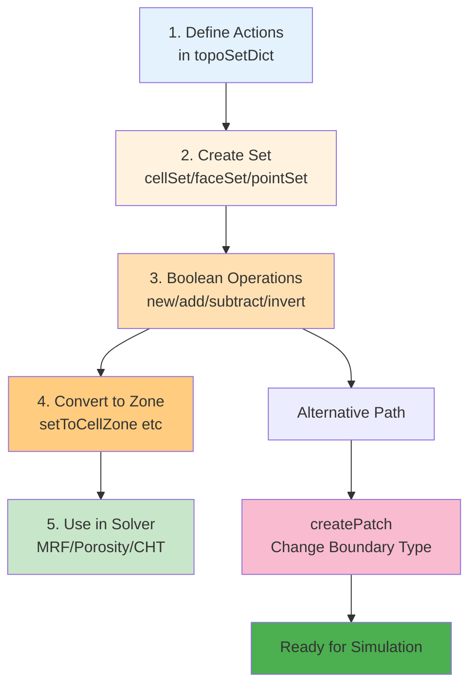

# การใช้งาน TopoSet และ CellZones (Using TopoSet and CellZones)

`topoSet` คือ "มีดพับ Swiss Army" ของ OpenFOAM สำหรับการจัดการกลุ่มของ Cell, Face, และ Point หากคุณต้องการ:
*   กำหนด Porous Media ในโซนเฉพาะ
*   กำหนดแหล่งกำเนิดความร้อน (Heat Source) ตรงกลางห้อง
*   เปลี่ยน Type ของ Boundary จาก Wall เป็น Inlet บางส่วน

คุณต้องใช้ `topoSet`

> **ลิงก์ที่เกี่ยวข้อง**:
> - ดู Mesh Manipulation Tools → [03_Mesh_Manipulation_Tools.md](./03_Mesh_Manipulation_Tools.md)
> - ดู Multi-Region Meshing → [../04_SNAPPYHEXMESH_ADVANCED/03_Multi_Region_Meshing.md](../04_SNAPPYHEXMESH_ADVANCED/03_Multi_Region_Meshing.md)

## 1. โครงสร้างไฟล์ `system/topoSetDict`

ไฟล์นี้ทำงานเป็น List ของคำสั่ง (Actions) ที่ทำตามลำดับ

```cpp
actions
(
    // Action 1: สร้าง CellSet จากกล่อง
    {
        name    c0;             // ชื่อ Set ที่จะสร้าง
        type    cellSet;        // ประเภท (cellSet, faceSet, pointSet)
        action  new;            // คำสั่ง (new, add, subtract, delete, invert)
        source  boxToCell;      // แหล่งที่มา (Box)
        sourceInfo
        {
            min (0 0 0);
            max (1 1 1);
        }
    }

    // Action 2: เอา c0 มาทำเป็น Zone
    {
        name    c0Zone;
        type    cellZoneSet;    // สร้าง Zone (ถาวรกว่า Set)
        action  new;
        source  setToCellZone;
        sourceInfo
        {
            set c0;             // เอามาจาก Set c0
        }
    }
);
```

## 2. Set vs Zone ต่างกันอย่างไร?

*   **Set (ชั่วคราว):** เก็บเป็นไฟล์ list ธรรมดาใน `constant/polyMesh/sets/` ใช้สำหรับเป็นตัวกลางในการเลือก หรือใช้ใน `topoSet` step ถัดไป
*   **Zone (ถาวร):** เก็บเป็นส่วนหนึ่งของ Mesh (`constant/polyMesh/cellZones`) ใช้สำหรับ Solver (เช่น กำหนด MRF, Porosity, Baffle)

> **Rule of Thumb:** ใช้ Set เพื่อเลือกพื้นที่ แล้วจบด้วยการเปลี่ยน Set เป็น Zone เพื่อใช้งานจริง

## 3. Sources ยอดนิยม (ท่าไม้ตาย)

### 3.1 `boxToCell`
เลือก Cell ที่ศูนย์กลางอยู่ในกล่อง

### 3.2 `cylinderToCell`
เลือก Cell ในทรงกระบอก (เหมาะกับถัง, ท่อ)
```cpp
p1 (0 0 0); // จุดเริ่มแกน
p2 (0 1 0); // จุดปลายแกน
radius 0.5;
```

### 3.3 `stlToCell` (Advanced)
เลือก Cell ที่อยู่ข้างใน (หรือข้างนอก) ไฟล์ STL
*   ต้องใช้ `surfaceToCell` แล้วเลือก `useSurfaceOrientation true`

### 3.4 `boundaryToFace`
เลือก Face ทั้งหมดที่เป็นของ Patch ที่กำหนด
```cpp
source boundaryToFace;
sourceInfo { name "inlet.*"; } // ใช้ Regex ได้
```

## 4. Logical Operations

ความเจ๋งของ `topoSet` คือการทำ Boolean Operation:

1.  **new:** สร้าง Set ใหม่ (ล้างของเก่าทิ้งถ้าชื่อซ้ำ)
2.  **add:** เอามาเพิ่มใส่ Set เดิม (Union)
3.  **subtract:** เอาออกจาก Set เดิม (Difference)
    *   *ตัวอย่าง:* เลือกกล่องใหญ่ (`new`) แล้วลบกล่องเล็กตรงกลางออก (`subtract`) -> ได้กล่องกลวง
4.  **invert:** กลับด้าน (เลือกทุกอย่างที่ไม่อยู่ใน Set)

## 5. การประยุกต์ใช้: `createPatch`

หลังจากได้ FaceSet แล้ว เรามักใช้คู่กับ `createPatch` เพื่อเปลี่ยน Boundary Condition

**ตัวอย่าง:** เปลี่ยนผนังบางส่วนเป็น Inlet
1.  `topoSet`: สร้าง `faceSet` ชื่อ `myInletFaces` จากกล่องที่ครอบผนังส่วนนั้น
2.  `createPatchDict`:
    ```cpp
    patchInfo
    (
        {
            name newInlet;
            dictionary { type patch; }
            constructFrom set;
            set myInletFaces;
        }
    );
    ```
3.  รัน `createPatch -overwrite`

นี่คือวิธีที่ยืดหยุ่นที่สุดในการจัดการ Boundary โดยไม่ต้องแก้ Geometry ใหม่!

**topoSet Workflow (Set → Zone):**


---

## 📝 แบบฝึกหัด (Exercises)

### แบบฝึกหัดระดับง่าย (Easy)
1. **True/False**: Set คือโครงสร้างถาวรใน Mesh ใช้สำหรับ Solver
   <details>
   <summary>คำตอบ</summary>
   ❌ เท็จ - Set คือชั่วคราว (เก็บใน constant/polyMesh/sets/) ส่วน Zone คือถาวร
   </details>

2. **เลือกตอบ**: Action ไหนที่ใช้เพื่อสร้าง Set ใหม่ทับของเก่า?
   - a) add
   - b) new
   - c) subtract
   - d) invert
   <details>
   <summary>คำตอบ</summary>
   ✅ b) new - สร้าง Set ใหม่ (ล้างของเก่าทิ้งถ้าชื่อซ้ำ)
   </details>

### แบบฝึกหัดระดับปานกลาง (Medium)
3. **อธิบาย**: แตกต่างระหว่าง `add` และ `subtract` ใน action คืออะไร?
   <details>
   <summary>คำตอบ</summary>
   - add: เอา Set ใหม่มารวมกับ Set เดิม (Union)
   - subtract: เอา elements ออกจาก Set เดิม (Difference)
   </details>

4. **สร้าง**: จงเขียน topoSetDict action สำหรับสร้าง CellZone ชื่อ `porousZone` จาก CellSet ชื่อ `c0`
   <details>
   <summary>คำตอบ</summary>
   ```cpp
   {
       name    porousZone;
       type    cellZoneSet;
       action  new;
       source  setToCellZone;
       sourceInfo
       {
           set c0;
       }
   }
   ```
   </details>

### แบบฝึกหัดระดับสูง (Hard)
5. **Hands-on**: ใช้ topoSet สร้าง Box กลวง (โดยเลือกกล่องใหญ่แล้วลบกล่องเล็กตรงกลางออก)

6. **วิเคราะห์**: เปรียบเทียบวิธีการกำหนด Boundary Condition ระหว่าง:
   - แก้ไขใน blockMeshDict ตั้งแต่แรก
   - ใช้ topoSet + createPatch ภายหลัง
   ในแง่ของความยืดหยุ่นและความเร็วในการทำงาน