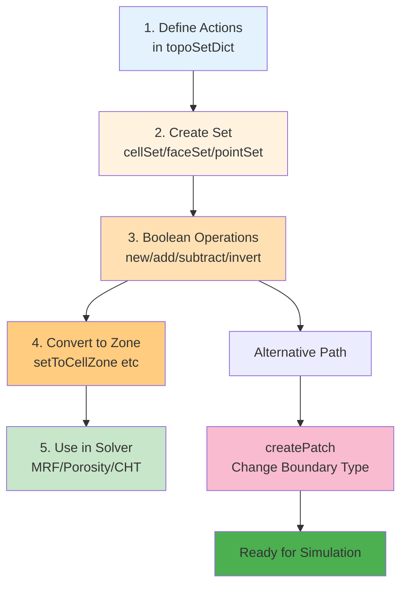

# Using TopoSet and CellZones (การใช้งาน TopoSet และ CellZones)

## Learning Objectives (เป้าหมายการเรียนรู้)

After completing this section, you will be able to:
- **Distinguish** between Sets and Zones, and know when to use each
- **Create** `topoSetDict` configurations for common mesh selection scenarios
- **Apply** logical operations (new, add, subtract, invert) to build complex mesh regions
- **Convert** Sets to Zones for solver integration (MRF, Porosity, CHT)
- **Use** `createPatch` to modify boundary conditions without re-meshing

---

## Why This Matters (ทำไมเรื่องนี้สำคัญ)

> [!TIP] **Core Value**
> TopoSet and CellZones are essential tools for **defining computational sub-regions** within an existing mesh without modifying the original geometry. This enables:
> - **Porous Media Modeling** - Define zones with specific porosity
> - **MRF (Multiple Reference Frame)** - Define rotating zones (fans, propellers)
> - **Conjugate Heat Transfer (CHT)** - Separate Solid and Fluid zones
> - **Source Terms** - Define heat/mass sources in specific regions
> - **Dynamic Mesh Manipulation** - Change boundary types without re-meshing
>
> Understanding TopoSet enables **flexible post-meshing manipulation** to address complex simulation requirements.

`topoSet` is the "Swiss Army knife" of OpenFOAM for managing groups of Cells, Faces, and Points. Use it when you need to:
- Define Porous Media in specific zones
- Define Heat Sources in the middle of a room
- Change Boundary Types from Wall to Inlet for specific sections

---

## 📂 OpenFOAM Context

**File Location**: `system/topoSetDict`

**Run Command**: `topoSet` (reads from `system/topoSetDict`)

**Key Keywords**:
- `actions` - List of commands executed in sequence
- `name` - Name of Set/Zone to create
- `type` - Type: `cellSet`, `faceSet`, `pointSet`, `cellZoneSet`, `faceZoneSet`
- `action` - Operation type: `new`, `add`, `subtract`, `delete`, `invert`
- `source` - Selection method: `boxToCell`, `cylinderToCell`, `boundaryToFace`, `setToCellZone`

**Output Files**:
- Sets stored in: `constant/polyMesh/sets/`
- Zones stored in: `constant/polyMesh/cellZones` and `constant/polyMesh/faceZones`

---

## 1. File Structure: `system/topoSetDict`

The file works as a sequential list of commands (Actions):

```cpp
actions
(
    // Action 1: Create CellSet from box
    {
        name    c0;             // Name of Set to create
        type    cellSet;        // Type (cellSet, faceSet, pointSet)
        action  new;            // Command (new, add, subtract, delete, invert)
        source  boxToCell;      // Source (Box)
        sourceInfo
        {
            min (0 0 0);
            max (1 1 1);
        }
    }

    // Action 2: Convert c0 to Zone
    {
        name    c0Zone;
        type    cellZoneSet;    // Create Zone (more permanent than Set)
        action  new;
        source  setToCellZone;
        sourceInfo
        {
            set c0;             // Take from Set c0
        }
    }
);
```

---

## 2. Set vs Zone: Key Differences

| Aspect | **Set (Temporary)** | **Zone (Permanent)** |
|--------|---------------------|----------------------|
| **Storage** | `constant/polyMesh/sets/<setName>` | `constant/polyMesh/cellZones` or `faceZones` |
| **Purpose** | Intermediate step for mesh element selection | Directly read by Solver and Boundary Conditions |
| **Tools** | `topoSet`, `subsetMesh`, `refineMesh` | `fvOptions`, `MRFProperties`, `regionProperties` |
| **Advantages** | Fast to create/delete, doesn't affect main mesh structure | Solver recognizes and applies physics directly |
| **Use Cases** | Building complex regions through boolean operations | Porous Media, MRF zones, CHT regions, Baffles |

> **Rule of Thumb:** Use Sets to select regions, then finish by converting Sets to Zones for actual solver use.

**Decision Tree:**
```
Need to define a mesh region?
    ↓
Is it for intermediate processing? → Use Set
    ↓
Is it for solver/physics? → Convert to Zone first
```

---

## 3. Popular Sources (Selection Methods)

### 3.1 For Cell Selection

| Source | Description | Common Use Cases |
|--------|-------------|------------------|
| `boxToCell` | Select cells in rectangular box | Rectangular porous zones, room heat sources |
| `cylinderToCell` | Select cells in cylinder | Pipes, tanks, axial fans |
| `sphereToCell` | Select cells in sphere | Spherical heat sources, isotropic media |
| `surfaceToCell` | Select cells inside/outside STL surface | Complex imported geometries |

### 3.2 For Face Selection

| Source | Description | Common Use Cases |
|--------|-------------|------------------|
| `boundaryToFace` | Select all faces on a patch | Change BCs, create baffles |
| `boxToFace` | Select faces intersecting box | Internal boundaries within domain |

### 3.3 For Point Selection

| Source | Description | Common Use Cases |
|--------|-------------|------------------|
| `boxToPoint` | Select points in box | Probe locations, sampling points |

### 3.4 For Zone Conversion

| Source | Description |
|--------|-------------|
| `setToCellZone` | Convert CellSet → CellZone |
| `setToFaceZone` | Convert FaceSet → FaceZone |

### Code Examples

**`boxToCell`** - Select cells whose centers are in a box:
```cpp
source  boxToCell;
sourceInfo
{
    min (0 0 0);
    max (1 1 1);
}
```

**`cylinderToCell`** - Select cells in a cylinder (for tanks, pipes):
```cpp
source  cylinderToCell;
sourceInfo
{
    p1 (0 0 0);      // Axis start point
    p2 (0 1 0);      // Axis end point
    radius 0.5;
}
```

**`boundaryToFace`** - Select all faces belonging to a patch:
```cpp
source  boundaryToFace;
sourceInfo 
{ 
    name "inlet.*";  // Regex supported
}
```

**`surfaceToCell`** (Advanced) - Select cells inside/outside an STL file:
```cpp
source  surfaceToCell;
sourceInfo
{
    file "geometry.stl";
    useSurfaceOrientation true;  // true = inside, false = outside
}
```

---

## 4. Logical Operations

The power of `topoSet` lies in its Boolean operations:

### Action Types

| Action | Description | Use Case |
|--------|-------------|----------|
| `new` | Create new Set (clears existing if name repeats) | Create base selection |
| `add` | Add to existing Set (Union) | Combine two regions |
| `subtract` | Remove from existing Set (Difference) | Create holes/cavities |
| `invert` | Reverse selection (select everything not in Set) | Select exterior region |

### Common Workflows

**Hollow Box**: Create large box (`new` + `boxToCell`) → Subtract small center (`subtract` + `boxToCell`)

```cpp
// Create large box
{
    name    porousBox;
    type    cellSet;
    action  new;
    source  boxToCell;
    sourceInfo { min (0 0 0); max (1 1 1); }
}
// Subtract center (create hollow box)
{
    name    porousBox;
    type    cellSet;
    action  subtract;
    source  boxToCell;
    sourceInfo { min (0.3 0.3 0.3); max (0.7 0.7 0.7); }
}
```

**Porous Catalyst Bed**: Create cylinder (`new` + `cylinderToCell`) → Subtract small center cylinder (for air tube)

**Complex Boundary**: Select main patch (`new` + `boundaryToFace`) → Subtract inlet/outlet portions (`subtract` + `boundaryToFace`)

---

## 5. Advanced Application: `createPatch`

After creating FaceSets, use `createPatch` to change boundary conditions.

### Complete Workflow

1. **Step 1**: Create `system/topoSetDict` → Run `topoSet` → Get FaceSet (e.g., `myInletFaces`)
2. **Step 2**: Create `system/createPatchDict` → Specify patch changes
3. **Step 3**: Run `createPatch -overwrite`

### Related Files

- `system/topoSetDict` - Defines FaceSet to use
- `system/createPatchDict` - Defines new patch creation
- `0/<patchName>` - Boundary conditions created/modified
- `constant/polyMesh/boundary` - Updated patch list

### `createPatchDict` Keywords

```cpp
patchInfo
(
    {
        name newInlet;           // New patch name
        dictionary {
            type patch;          // BC type (patch, wall, cyclic, etc.)
        }
        constructFrom set;       // Build from Set
        set myInletFaces;        // FaceSet name from topoSet
        zone myInletFaces;       // FaceZone name (optional)
    }
);
```

### Common Use Cases

- **Split Inlet**: Separate inlet into multiple parts (e.g., 50% normal, 50% high velocity)
- **Add Outlet**: Add outlet in area that was previously a wall
- **Create Baffle**: Create internal baffle by selecting faces inside mesh
- **Cyclic BC**: Create cyclic patch for periodic flow

### Example: Convert Wall Section to Inlet

```cpp
// Step 1: topoSetDict - Create FaceSet
{
    name    myInletFaces;
    type    faceSet;
    action  new;
    source  boxToFace;
    sourceInfo { min (0 0 0); max (0.5 1 0); }
}

// Step 2: createPatchDict
patchInfo
(
    {
        name newInlet;
        dictionary { type patch; }
        constructFrom set;
        set myInletFaces;
    }
);

// Step 3: Run
createPatch -overwrite
```

This is the most flexible way to manage boundaries without re-meshing!

---

## Workflow Diagram



---

## 📚 Key Takeaways

1. **Sets are temporary, Zones are permanent** - Use Sets for building selections, convert to Zones for solver use
2. **Workflow**: Create Set → Apply Boolean Operations → Convert to Zone → Use in Solver
3. **Sources match geometry** - Use `boxToCell` for rectangles, `cylinderToCell` for pipes/tanks, `surfaceToCell` for complex STL
4. **Boolean operations enable complex shapes** - Combine `new`, `add`, `subtract`, `invert` to create hollow regions, composite shapes
5. **createPatch extends functionality** - Modify boundary types without re-meshing by using topoSet + createPatch together

---

## 🧠 Concept Check

### Easy Level
1. **True/False**: Sets are permanent structures in the mesh used by solvers.
   <details>
   <summary>Answer</summary>
   ❌ False - Sets are temporary (stored in `constant/polyMesh/sets/`), while Zones are permanent.
   </details>

2. **Multiple Choice**: Which action creates a new Set, replacing any existing Set with the same name?
   - a) add
   - b) new
   - c) subtract
   - d) invert
   <details>
   <summary>Answer</summary>
   ✅ b) new - Creates new Set (clears existing if name repeats)
   </details>

### Medium Level
3. **Explain**: What is the difference between `add` and `subtract` actions?
   <details>
   <summary>Answer</summary>
   - add: Combine new Set with existing Set (Union)
   - subtract: Remove elements from existing Set (Difference)
   </details>

4. **Create**: Write a topoSetDict action to create a CellZone named `porousZone` from a CellSet named `c0`.
   <details>
   <summary>Answer</summary>
   ```cpp
   {
       name    porousZone;
       type    cellZoneSet;
       action  new;
       source  setToCellZone;
       sourceInfo
       {
           set c0;
       }
   }
   ```
   </details>

### Hard Level
5. **Hands-on**: Use topoSet to create a hollow box (select large box, then subtract small center box).

   <details>
   <summary>Answer</summary>
   ```cpp
   actions
   (
       // Create large box
       {
           name    hollowBox;
           type    cellSet;
           action  new;
           source  boxToCell;
           sourceInfo { min (0 0 0); max (1 1 1); }
       }
       // Subtract center box
       {
           name    hollowBox;
           type    cellSet;
           action  subtract;
           source  boxToCell;
           sourceInfo { min (0.3 0.3 0.3); max (0.7 0.7 0.7); }
       }
       // Convert to Zone
       {
           name    hollowBoxZone;
           type    cellZoneSet;
           action  new;
           source  setToCellZone;
           sourceInfo { set hollowBox; }
       }
   );
   ```
   </details>

---

## 📖 Related Documents

- **Previous**: [01_Mesh_Quality_Criteria.md](01_Mesh_Quality_Criteria.md)
- **Next**: [03_Mesh_Manipulation_Tools.md](03_Mesh_Manipulation_Tools.md)
- **Multi-Region Meshing**: [../04_SNAPPYHEXMESH_ADVANCED/03_Multi_Region_Meshing.md](../04_SNAPPYHEXMESH_ADVANCED/03_Multi_Region_Meshing.md)