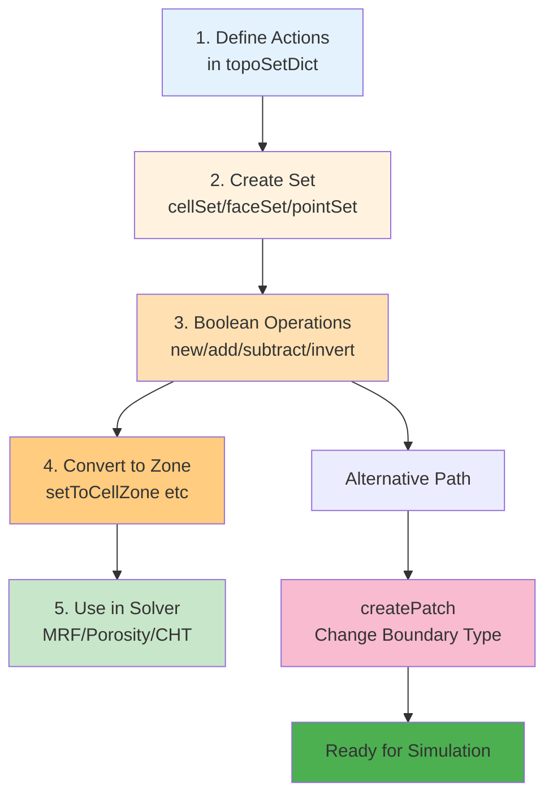

# การใช้งาน TopoSet และ CellZones (Using TopoSet and CellZones)

> [!TIP] 为什么这很重要？（ทำไมเรื่องนี้สำคัญ？）
> TopoSet และ CellZones เป็นเครื่องมือสำคัญในการ **กำหนดเขตการคำนวณเฉพาะส่วน** ภายใน Mesh ที่สร้างไว้แล้วโดยไม่ต้องแก้ Geometry เดิม ซึ่งมีประโยชน์อย่างมากใน:
> - **Porous Media Modeling** - กำหนดโซนที่มีความพรุน (Porosity) เฉพาะจุด
> - **MRF (Multiple Reference Frame)** - กำหนดโซนที่หมุนเป็นพิเศษ (เช่พัดลม, ใบพัด)
> - **Conjugate Heat Transfer (CHT)** - กำหนดโซนที่เป็น Solid และ Fluid แยกกัน
> - **Source Terms** - กำหนดแหล่งกำเนิดความร้อน/มวลในพื้นที่เฉพาะ
> - **Dynamic Mesh Manipulation** - เปลี่ยน Boundary Type บางส่วนโดยไม่ต้อง Re-mesh
>
> การเข้าใจ TopoSet จะช่วยให้คุณสามารถ **ปรับแต่ง Mesh ที่สร้างแล้ว** (Post-meshing manipulation) เพื่อตอบโจทย์การจำลองที่ซับซ้อนได้อย่างยืดหยุ่น

`topoSet` คือ "มีดพับ Swiss Army" ของ OpenFOAM สำหรับการจัดการกลุ่มของ Cell, Face, และ Point หากคุณต้องการ:
*   กำหนด Porous Media ในโซนเฉพาะ
*   กำหนดแหล่งกำเนิดความร้อน (Heat Source) ตรงกลางห้อง
*   เปลี่ยน Type ของ Boundary จาก Wall เป็น Inlet บางส่วน

คุณต้องใช้ `topoSet`

> **ลิงก์ที่เกี่ยวข้อง**:
> - ดู Mesh Manipulation Tools → [03_Mesh_Manipulation_Tools.md](./03_Mesh_Manipulation_Tools.md)
> - ดู Multi-Region Meshing → [../04_SNAPPYHEXMESH_ADVANCED/03_Multi_Region_Meshing.md](../04_SNAPPYHEXMESH_ADVANCED/03_Multi_Region_Meshing.md)

## 1. โครงสร้างไฟล์ `system/topoSetDict`

> [!NOTE] **📂 OpenFOAM Context**
> ใน OpenFOAM Case Directory คุณจะสร้างไฟล์ชื่อ `system/topoSetDict` เพื่อกำหนด Actions สำหรับการเลือกและจัดการกลุ่มของ Mesh Elements
>
> **คำสั่งรัน**: `topoSet` (จะอ่านค่าจาก `system/topoSetDict`)
>
> **Keywords สำคัญในไฟล์**:
> - `actions` - List ของคำสั่งที่จะ execute ตามลำดับ
> - `name` - ชื่อของ Set/Zone ที่จะสร้าง
> - `type` - ประเภท: `cellSet`, `faceSet`, `pointSet`, `cellZoneSet`, `faceZoneSet`
> - `action` - ประเภทการกระทำ: `new`, `add`, `subtract`, `delete`, `invert`
> - `source` - แหล่งที่มาของการเลือก: `boxToCell`, `cylinderToCell`, `boundaryToFace`, `setToCellZone` เป็นต้น
>
> **Output Files**:
> - Sets จะถูกเก็บใน `constant/polyMesh/sets/`
> - Zones จะถูกเก็บใน `constant/polyMesh/cellZones` และ `constant/polyMesh/faceZones`

ไฟล์นี้ทำงานเป็น List ของคำสั่ง (Actions) ที่ทำตามลำดับ

```cpp
actions
(
    // Action 1: สร้าง CellSet จากกล่อง
    {
        name    c0;             // ชื่อ Set ที่จะสร้าง
        type    cellSet;        // ประเภท (cellSet, faceSet, pointSet)
        action  new;            // คำสั่ง (new, add, subtract, delete, invert)
        source  boxToCell;      // แหล่งที่มา (Box)
        sourceInfo
        {
            min (0 0 0);
            max (1 1 1);
        }
    }

    // Action 2: เอา c0 มาทำเป็น Zone
    {
        name    c0Zone;
        type    cellZoneSet;    // สร้าง Zone (ถาวรกว่า Set)
        action  new;
        source  setToCellZone;
        sourceInfo
        {
            set c0;             // เอามาจาก Set c0
        }
    }
);
```

## 2. Set vs Zone ต่างกันอย่างไร?

> [!NOTE] **📂 OpenFOAM Context**
> ความแตกต่างระหว่าง Set และ Zone สำคัญมากต่อการใช้งานจริง:
>
> **Set (ชั่วคราว)**:
> - เก็บใน: `constant/polyMesh/sets/<setName>`
> - ใช้สำหรับ: เป็น Intermediate step ในการเลือก Mesh Elements
> - ใช้งานร่วมกับ: `topoSet` (เพื่อสร้าง Set ใหม่จาก Set เดิม), `subsetMesh`, ` refineMesh`
> - **ข้อดี**: สร้างและลบได้เร็ว ไม่กระทบ Mesh โครงสร้างหลัก
>
> **Zone (ถาวร)**:
> - เก็บใน: `constant/polyMesh/cellZones` หรือ `constant/polyMesh/faceZones`
> - ใช้สำหรับ: **Solver และ Boundary Conditions** อ่านค่าโดยตรง
> - ใช้งานร่วมกับ:
>   - `constant/fvOptions` - สำหรับ Porous Media, Source Terms
>   - `constant/MRFProperties` - สำหรับ Moving Reference Frame
>   - `constant/regionProperties` - สำหรับ Multi-region CHT
>   - `0/` Boundary Conditions - สำหรับ FaceZones
> - **ข้อดี**: Solver รู้จักและสามารถ apply Physics ได้โดยตรง

*   **Set (ชั่วคราว):** เก็บเป็นไฟล์ list ธรรมดาใน `constant/polyMesh/sets/` ใช้สำหรับเป็นตัวกลางในการเลือก หรือใช้ใน `topoSet` step ถัดไป
*   **Zone (ถาวร):** เก็บเป็นส่วนหนึ่งของ Mesh (`constant/polyMesh/cellZones`) ใช้สำหรับ Solver (เช่น กำหนด MRF, Porosity, Baffle)

> **Rule of Thumb:** ใช้ Set เพื่อเลือกพื้นที่ แล้วจบด้วยการเปลี่ยน Set เป็น Zone เพื่อใช้งานจริง

## 3. Sources ยอดนิยม (ท่าไม้ตาย)

> [!NOTE] **📂 OpenFOAM Context**
> Sources คือวิธีการเลือก Mesh Elements ที่แตกต่างกัน ใน `system/topoSetDict` แต่ละ Source จะมีการใช้งานที่เหมาะสมกับ Geometry และ Use Case ที่แตกต่างกัน:
>
> **สำหรับ Cell Selection**:
> - `boxToCell` - เลือก Cell ในกล่องสี่เหลี่ยม → ใช้กับ: Porous zone แบบทรงสี่เหลี่ยม, Heat source ในห้อง
> - `cylinderToCell` - เลือก Cell ในทรงกระบอก → ใช้กับ: ท่อ, ถัง, พัดลมแบบ axial
> - `sphereToCell` - เลือก Cell ในทรงกลม → ใช้กับ: Heat source แบบทรงกลม, ตัวกลางแบบ isotropic
> - `stlToCell` (ผ่าน `surfaceToCell`) - เลือก Cell ภายใน/นอก STL surface → ใช้กับ: Complex geometry ที่ import มา
>
> **สำหรับ Face Selection**:
> - `boundaryToFace` - เลือก Face ทั้งหมดบน Patch → ใช้กับ: เปลี่ยน Boundary Condition, สร้าง Baffle
> - `boxToFace` - เลือก Face ที่ตัดกล่อง → ใช้กับ: Internal boundary ภายใน domain
>
> **สำหรับ Point Selection**:
> - `boxToPoint` - เลือก Point ในกล่อง → ใช้กับ: Probe locations, Sampling points
>
> **สำหรับ Zone Conversion**:
> - `setToCellZone` - แปลง CellSet → CellZone
> - `setToFaceZone` - แปลง FaceSet → FaceZone

### 3.1 `boxToCell`
เลือก Cell ที่ศูนย์กลางอยู่ในกล่อง

### 3.2 `cylinderToCell`
เลือก Cell ในทรงกระบอก (เหมาะกับถัง, ท่อ)
```cpp
p1 (0 0 0); // จุดเริ่มแกน
p2 (0 1 0); // จุดปลายแกน
radius 0.5;
```

### 3.3 `stlToCell` (Advanced)
เลือก Cell ที่อยู่ข้างใน (หรือข้างนอก) ไฟล์ STL
*   ต้องใช้ `surfaceToCell` แล้วเลือก `useSurfaceOrientation true`

### 3.4 `boundaryToFace`
เลือก Face ทั้งหมดที่เป็นของ Patch ที่กำหนด
```cpp
source boundaryToFace;
sourceInfo { name "inlet.*"; } // ใช้ Regex ได้
```

## 4. Logical Operations

> [!NOTE] **📂 OpenFOAM Context**
> Logical Operations ใน `topoSet` ช่วยให้คุณสร้าง Complex Selection ได้อย่างยืดหยุ่นโดยไม่ต้องสร้าง Geometry ใหม่:
>
> **Workflow ทั่วไป**:
> 1. `new` - สร้าง Base Set แรก (เช่น กล่องใหญ่)
> 2. `add` - เพิ่มพื้นที่อื่นเข้ามา (Union 2 กล่อง)
> 3. `subtract` - ลบพื้นที่ที่ไม่ต้องการ (สร้างรู/โพรง)
> 4. `invert` - กลับด้าน (เลือกทุกอย่างนอกเหนือจากที่เลือกไว้)
>
> **Use Cases ที่พบบ่อย**:
> - **Hollow Box**: สร้างกล่องใหญ่ (`new` + `boxToCell`) → ลบกล่องเล็กตรงกลาง (`subtract` + `boxToCell`)
> - **Porous Catalyst Bed**: สร้างทรงกระบอก (`new` + `cylinderToCell`) → ลบทรงกระบอกเล็กตรงกลาง (เพื่อทำเป็นท่อลม)
> - **Complex Boundary**: เลือก Patch หลัก (`new` + `boundaryToFace`) → ลบส่วนที่เป็น Inlet/Outlet (`subtract` + `boundaryToFace`)
>
> **ตัวอย่างการใช้งานจริง**:
> ```cpp
> // สร้าง Porous Zone แบบกล่องกลวง
> {
>     name    porousBox;
>     type    cellSet;
>     action  new;
>     source  boxToCell;
>     sourceInfo { min (0 0 0); max (1 1 1); }
> }
> {
>     name    porousBox;
>     type    cellSet;
>     action  subtract;
>     source  boxToCell;
>     sourceInfo { min (0.3 0.3 0.3); max (0.7 0.7 0.7); }
> }
> ```

ความเจ๋งของ `topoSet` คือการทำ Boolean Operation:

1.  **new:** สร้าง Set ใหม่ (ล้างของเก่าทิ้งถ้าชื่อซ้ำ)
2.  **add:** เอามาเพิ่มใส่ Set เดิม (Union)
3.  **subtract:** เอาออกจาก Set เดิม (Difference)
    *   *ตัวอย่าง:* เลือกกล่องใหญ่ (`new`) แล้วลบกล่องเล็กตรงกลางออก (`subtract`) -> ได้กล่องกลวง
4.  **invert:** กลับด้าน (เลือกทุกอย่างที่ไม่อยู่ใน Set)

## 5. การประยุกต์ใช้: `createPatch`

> [!NOTE] **📂 OpenFOAM Context**
> `createPatch` เป็นเครื่องมือที่ทำงานคู่กับ `topoSet` เพื่อเปลี่ยนแปลง Boundary Conditions โดยไม่ต้อง Re-mesh:
>
> **Workflow แบบเต็ม**:
> 1. **Step 1**: สร้าง `system/topoSetDict` → รัน `topoSet` → ได้ FaceSet (เช่น `myInletFaces`)
> 2. **Step 2**: สร้าง `system/createPatchDict` → ระบุการเปลี่ยน Patch
> 3. **Step 3**: รัน `createPatch -overwrite`
>
> **ไฟล์ที่เกี่ยวข้อง**:
> - `system/topoSetDict` - กำหนด FaceSet ที่ต้องการ
> - `system/createPatchDict` - กำหนดการสร้าง Patch ใหม่
> - `0/<patchName>` - Boundary Conditions ที่ถูกสร้าง/เปลี่ยนแปลง
> - `constant/polyMesh/boundary` - รายชื่อ Patch ที่อัปเดตแล้ว
>
> **Keywords ใน `createPatchDict`**:
> ```cpp
> patchInfo
> (
>     {
>         name newInlet;           // ชื่อ Patch ใหม่
>         dictionary {
>             type patch;          // ประเภท BC (patch, wall, cyclic, etc.)
>         }
>         constructFrom set;       // สร้างจาก Set
>         set myInletFaces;        // ชื่อ FaceSet จาก topoSet
>         zone myInletFaces;       // ชื่อ FaceZone (optional)
>     }
> );
> ```
>
> **Use Cases ที่พบบ่อย**:
> - **Split Inlet**: แยก Inlet ออกเป็นหลายส่วน (เช่น 50% ปกติ, 50% สูง)
> - **Add Outlet**: เพิ่ม Outlet ในพื้นที่ที่เดิมเป็น Wall
> - **Create Baffle**: สร้าง Internal Baffle โดยเลือก Face ภายใน Mesh
> - **Cyclic BC**: สร้าง Cyclic Patch สำหรับ Periodic Flow

หลังจากได้ FaceSet แล้ว เรามักใช้คู่กับ `createPatch` เพื่อเปลี่ยน Boundary Condition

**ตัวอย่าง:** เปลี่ยนผนังบางส่วนเป็น Inlet
1.  `topoSet`: สร้าง `faceSet` ชื่อ `myInletFaces` จากกล่องที่ครอบผนังส่วนนั้น
2.  `createPatchDict`:
    ```cpp
    patchInfo
    (
        {
            name newInlet;
            dictionary { type patch; }
            constructFrom set;
            set myInletFaces;
        }
    );
    ```
3.  รัน `createPatch -overwrite`

นี่คือวิธีที่ยืดหยุ่นที่สุดในการจัดการ Boundary โดยไม่ต้องแก้ Geometry ใหม่!

**topoSet Workflow (Set → Zone):**


---

## 🧠 Concept Check: ทดสอบความเข้าใจ

### แบบฝึกหัดระดับง่าย (Easy)
1. **True/False**: Set คือโครงสร้างถาวรใน Mesh ใช้สำหรับ Solver
   <details>
   <summary>คำตอบ</summary>
   ❌ เท็จ - Set คือชั่วคราว (เก็บใน constant/polyMesh/sets/) ส่วน Zone คือถาวร
   </details>

2. **เลือกตอบ**: Action ไหนที่ใช้เพื่อสร้าง Set ใหม่ทับของเก่า?
   - a) add
   - b) new
   - c) subtract
   - d) invert
   <details>
   <summary>คำตอบ</summary>
   ✅ b) new - สร้าง Set ใหม่ (ล้างของเก่าทิ้งถ้าชื่อซ้ำ)
   </details>

### แบบฝึกหัดระดับปานกลาง (Medium)
3. **อธิบาย**: แตกต่างระหว่าง `add` และ `subtract` ใน action คืออะไร?
   <details>
   <summary>คำตอบ</summary>
   - add: เอา Set ใหม่มารวมกับ Set เดิม (Union)
   - subtract: เอา elements ออกจาก Set เดิม (Difference)
   </details>

4. **สร้าง**: จงเขียน topoSetDict action สำหรับสร้าง CellZone ชื่อ `porousZone` จาก CellSet ชื่อ `c0`
   <details>
   <summary>คำตอบ</summary>
   ```cpp
   {
       name    porousZone;
       type    cellZoneSet;
       action  new;
       source  setToCellZone;
       sourceInfo
       {
           set c0;
       }
   }
   ```
   </details>

### แบบฝึกหัดระดับสูง (Hard)
5. **Hands-on**: ใช้ topoSet สร้าง Box กลวง (โดยเลือกกล่องใหญ่แล้วลบกล่องเล็กตรงกลางออก)


---

## 📖 เอกสารที่เกี่ยวข้อง

*   **บทก่อนหน้า**: [01_Mesh_Quality_Criteria.md](01_Mesh_Quality_Criteria.md)
*   **บทถัดไป**: [03_Mesh_Manipulation_Tools.md](03_Mesh_Manipulation_Tools.md)