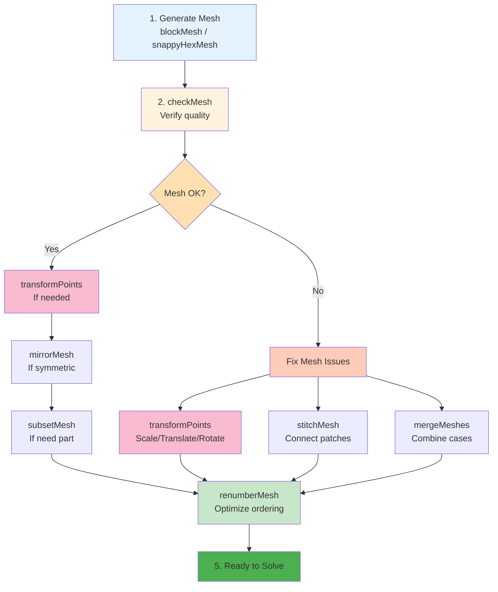

# เครื่องมือจัดการเมช (Mesh Manipulation Tools)

> [!TIP] **ทำไมเรื่องนี้สำคัญ?**
> เครื่องมือจัดการ Mesh (Mesh Manipulation Utilities) เป็น "กองทัพมด" ที่ช่วยให้คุณปรับแก้ Mesh ที่สร้างเสร็จแล้วได้อย่างยืดหยุ่น ไม่ว่าจะเป็นการเปลี่ยน Scale, หมุน, รวม Mesh, หรือปรับปรุง Topology การเข้าใจเครื่องมือเหล่านี้จะช่วยให้คุณ:
> - แก้ปัญหา Mesh ที่ไม่ตรงกับที่ต้องการโดยไม่ต้องสร้างใหม่ทั้งหมด
> - ปรับหน่วยของระบบ (เช่น mm → m) ได้อย่างรวดเร็ว
> - ปรับปรุงประสิทธิภาพการคำนวณด้วย `renumberMesh`
> - รวมหรือตัดส่วน Mesh ได้ตามความต้องการของเคส
>
> **📍 ตำแหน่งใน OpenFOAM Case:** เครื่องมือเหล่านี้เป็น **Command-line Utilities** ที่รันใน Terminal โดยตรง ไม่ใช่ไฟล์ Dictionary (`dict`) แต่มีบางเครื่องมือที่ต้องการไฟล์คอนฟิกใน `system/` directory

นอกจาก `blockMesh` และ `snappyHexMesh` แล้ว OpenFOAM ยังมีชุดเครื่องมือ Utility (กองทัพมด) เพื่อจัดการ Mesh ที่สร้างเสร็จแล้ว ให้พร้อมใช้งานหรือแก้ไขปัญหาเฉพาะหน้า

> **ลิงก์ที่เกี่ยวข้อง**:
> - ดู Mesh Quality Criteria → [01_Mesh_Quality_Criteria.md](./01_Mesh_Quality_Criteria.md)
> - ดู TopoSet และ CellZones → [02_Using_TopoSet_and_CellZones.md](./02_Using_TopoSet_and_CellZones.md)

## 1. การแปลงพิกัด (Transformations)

> [!NOTE] **📂 OpenFOAM Context**
> **Utility:** `transformPoints` (Command-line tool)
> - **รันจาก:** Terminal ใน Case directory
> - **หน้าที่:** แก้ไขไฟล์ `constant/polyMesh/points` โดยตรง
> - **ผลลัพธ์:** เปลี่ยนค่าพิกัด (x, y, z) ของทุกจุดใน Mesh ทันที
> - **ใช้เมื่อ:** Geometry จาก CAD มาผิด Scale, ต้องย้ายตำแหน่ง หรือหมุน Model
> - **ไม่มีไฟล์ dict:** เป็น utility ที่รันโดยตรง ไม่ต้องตั้งค่าในไฟล์
>
> **Domain D: Meshing** - การแก้ไข Geometry ของ Mesh ที่สร้างเสร็จแล้ว

### `transformPoints`
เครื่องมือสารพัดประโยชน์สำหรับ ย่อ/ขยาย, หมุน, และย้ายตำแหน่ง Mesh

*   **Scale (ย่อ/ขยาย):** เปลี่ยนหน่วยจาก mm เป็น m
    ```bash
    transformPoints -scale '(0.001 0.001 0.001)'
    ```
*   **Translate (ย้าย):** ย้ายจุด (0,0,0) ไปที่อื่น
    ```bash
    transformPoints -translate '(10 0 0)'
    ```
*   **Rotate (หมุน):** หมุนรอบแกน
    ```bash
    # หมุนรอบแกน Z 45 องศา (Roll)
    transformPoints -rollPitchYaw '(0 0 45)' 
    ```

## 2. การรวมและผสม (Merging & Stitching)

> [!NOTE] **📂 OpenFOAM Context**
> **Utilities:** `mergeMeshes` และ `stitchMesh` (Command-line tools)
> - **รันจาก:** Terminal
> - **ไฟล์ที่ถูกแก้:** `constant/polyMesh/` และ `constant/polyMesh/sets/`
> - **ผลลัพธ์:**
>   - `mergeMeshes`: รวม 2 Case ให้มี Cell Zones หรือ Regions แยกกัน
>   - `stitchMesh`: รวม Patches ให้เป็น Internal Faces (Topologically connected)
> - **การใช้งาน:**
>   - `mergeMeshes`: สำหรับ Multi-region simulation (เช่น Fluid + Solid)
>   - `stitchMesh`: สำหรับเชื่อม Patch ที่ติดกันแต่สร้างแยกกัน
> - **ไม่มีไฟล์ dict:** เป็น utility ที่รันโดยตรง
>
> **Domain D: Meshing** - การรวม Mesh หลายๆ อันเข้าด้วยกัน

### `mergeMeshes`
เอา 2 Case มารวมกันเป็น 1 Case (แต่ยังแยก Region กัน หรือ Mesh ไม่ต่อกัน)
```bash
mergeMeshes . case1 . case2
# ผลลัพธ์จะอยู่ที่ case1 (Master)
```

### `stitchMesh`
เย็บ Patch 2 อันที่อยู่ติดกันให้เนื้อ Mesh เชื่อมกัน (Topologically merge)
*   **เงื่อนไข:** จุดบน Patch ทั้งสองต้องตรงกันเป๊ะ (Perfect match) หรือใช้ Tolerance
*   **การใช้งาน:** `stitchMesh masterPatch slavePatch`

## 3. การจัดการ Topology

> [!NOTE] **📂 OpenFOAM Context**
> **Utilities:** `renumberMesh`, `mirrorMesh`, `subsetMesh` (Command-line tools)
> - **รันจาก:** Terminal
> - **ไฟล์ที่ถูกแก้:** `constant/polyMesh/` (Owner, Neighbour, Points)
> - **ผลลัพธ์:**
>   - `renumberMesh`: จัดเรียง Cell Index ใหม่ → ลด Matrix Bandwidth → Solver เร็วขึ้น
>   - `mirrorMesh`: สร้าง Mesh สะท้อน → ต้องมี `system/mirrorMeshDict` ระบุระนาบ
>   - `subsetMesh`: ตัด Mesh บางส่วน → ใช้กับ CellSet จาก `topoSet`
> - **Connection to Domain E:**
>   - `mirrorMeshDict`: ตั้งค่าระนาบสะท้อน (Plane equation)
>   - `topoSet`: สร้าง CellSet ก่อนใช้ `subsetMesh`
>
> **Domain D: Meshing** + **Domain E: Customization** - การปรับ Topology และจัดระเบียบ Mesh

### `renumberMesh`
จัดเรียงลำดับ Index ของ Cell ใหม่ (Reordering) เพื่อลด Bandwidth ของ Sparse Matrix
*   **ผลลัพธ์:** ทำให้ Solver รันเร็วขึ้น (Cache efficiency ดีขึ้น) และไฟล์ผลลัพธ์เล็กลงเล็กน้อย
*   **คำแนะนำ:** **ควรทำเสมอ** ก่อนรันเคสใหญ่ๆ!

### `mirrorMesh`
สะท้อน Mesh ข้ามระนาบ (Mirror)
*   เหมาะกับงานสมมาตร (Symmetric) สร้างแค่ครึ่งเดียว แล้ว Mirror เอา
*   ต้องระบุระนาบใน `system/mirrorMeshDict`

### `subsetMesh`
ตัดเอาเฉพาะส่วนของ Mesh ที่ต้องการออกมา (ตาม CellSet)
*   มีประโยชน์มากเวลา Mesh ใหญ่เกินไป แล้วอยากตัดมา Test รันแค่ส่วนเล็กๆ
```bash
# ตัดเฉพาะ CellSet c0 มาสร้าง Mesh ใหม่
subsetMesh c0 -patch outerWall
```

## 4. การตรวจสอบ (Inspection)

> [!NOTE] **📂 OpenFOAM Context**
> **Utilities:** `checkMesh`, `patchSummary` (Command-line tools)
> - **รันจาก:** Terminal
> - **ไฟล์ที่อ่าน:** `constant/polyMesh/`, `constant/polyMesh/sets/`
> - **Output:**
>   - `checkMesh`: ตรวจคุณภาพ Mesh → แจ้ง Warning/Error พร้อมสถิติ
>   - `patchSummary`: แสดง Patch info → ชื่อ, จำนวน Face, ประเภท BC
> - **Connection to Domain C:**
>   - ข้อมูลจาก `checkMesh` ใช้ตัดสินใจเรื่อง Time step ใน `controlDict`
>   - ข้อมูลจาก `patchSummary` ช่วยตั้งค่า Boundary Conditions ใน `0/`
> - **ไม่มีไฟล์ dict:** เป็น utility ที่รันโดยตรง
>
> **Domain D: Meshing** → การตรวจสอบคุณภาพก่อนรัน Simulation
>
> **Domain A: Physics & Fields** → ข้อมูล Patch ใช้ตั้งค่า BC ใน `0/` directory

### `checkMesh`
(กล่าวไปแล้วในบท Mesh Quality) แต่อย่าลืม Option เสริม:
*   `-allGeometry`: เช็คละเอียดเรื่อง Geometric error
*   `-allTopology`: เช็คละเอียดเรื่องการเชื่อมต่อ
*   `-constant`: เช็ค Mesh ใน folder constant (ไม่ต้องรอ time 0)

### `patchSummary`
ดูข้อมูลสรุปของแต่ละ Patch (จำนวนหน้า, พื้นที่, ประเภท)
*   ช่วยเช็คว่าเราตั้งชื่อ Patch ถูกไหม หรือพื้นที่หน้าตัด Inlet ถูกต้องตามทฤษฎีไหม

---
**สรุป Workflow ของโปร:**
1.  Generate Mesh (`blockMesh`/`snappyHexMesh`)
2.  `checkMesh` (ตรวจสอบคุณภาพ)
3.  `transformPoints` (ถ้าขนาดผิด หรือต้องย้ายที่)
4.  `renumberMesh` (เพื่อความเร็ว)
5.  Ready to solve!

**Mesh Manipulation Tools Workflow:**


---

## 🧠 Concept Check: ทดสอบความเข้าใจ

### แบบฝึกหัดระดับง่าย (Easy)
1. **True/False**: `renumberMesh` ช่วยเพิ่มความเร็วในการคำนวณของ Solver
   <details>
   <summary>คำตอบ</summary>
   ✅ จริง - จัดเรียงลำดับ Cell ใหม่เพื่อลด Bandwidth ของ Sparse Matrix
   </details>

2. **เลือกตอบ**: คำสั่งไหนใช้สำหรับเปลี่ยนหน่วย Mesh จาก mm เป็น m?
   - a) stitchMesh
   - b) transformPoints -scale
   - c) mergeMeshes
   - d) mirrorMesh
   <details>
   <summary>คำตอบ</summary>
   ✅ b) transformPoints -scale '(0.001 0.001 0.001)'
   </details>

### แบบฝึกหัดระดับปานกลาง (Medium)
3. **อธิบาย**: แตกต่างระหว่าง `mergeMeshes` และ `stitchMesh` คืออะไร?
   <details>
   <summary>คำตอบ</summary>
   - mergeMeshes: รวม 2 Case เข้าด้วยกัน แต่ Mesh ยังแยกกัน (ไม่ต่อกัน)
   - stitchMesh: เย็บ Patch 2 อันให้เชื่อมต่อกันทาง Topology
   </details>

4. **เขียนคำสั่ง**: จงเขียนคำสั่งเพื่อหมุน Mesh รอบแกน Z 45 องศา
   <details>
   <summary>คำตอบ</summary>
   ```bash
   transformPoints -rollPitchYaw '(0 0 45)'
   ```
   </details>

### แบบฝึกหัดระดับสูง (Hard)
5. **Hands-on**: สร้าง Mesh แล้วทดลองใช้ `renumberMesh` เปรียบเทียบขนาดไฟล์ก่อน/หลัง


---

## 📖 เอกสารที่เกี่ยวข้อง

*   **บทก่อนหน้า**: [02_Using_TopoSet_and_CellZones.md](02_Using_TopoSet_and_CellZones.md)
*   **บทถัดไป**: [../06_RUNTIME_POST_PROCESSING/01_Introduction_to_FunctionObjects.md](../06_RUNTIME_POST_PROCESSING/01_Introduction_to_FunctionObjects.md)