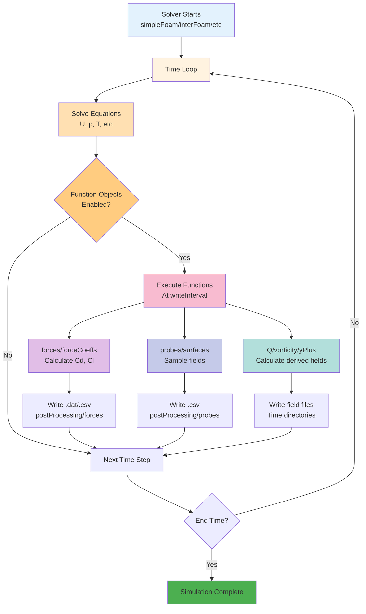

# บทนำสู่ Function Objects (Introduction to Function Objects)

ในยุคแรกของ OpenFOAM หากเราต้องการค่าแรงต้าน (Drag) เราต้องรอให้รันเสร็จ แล้วใช้โปรแกรมอื่นคำนวณ หรือต้องเขียน Code แทรกใน Solver เอง

แต่ปัจจุบัน เรามี **Function Objects** ซึ่งเป็นเหมือน "Plugin" ที่สามารถเสียบเข้าไปทำงานระหว่างที่ Solver กำลังรันอยู่ (Runtime) โดยไม่ต้องแก้ Code หลัก

> **ลิงก์ที่เกี่ยวข้อง**:
> - ดู Forces and Coefficients → [02_Forces_and_Coefficients.md](./02_Forces_and_Coefficients.md)
> - ดู Sampling and Probes → [03_Sampling_and_Probes.md](./03_Sampling_and_Probes.md)

## 1. ทำไมต้องใช้ Function Objects?

1.  **Online Monitoring:** เห็นค่า $C_d, C_l$ หรือ Mass Flow Rate แบบ Real-time (ผ่านไฟล์ .dat/.csv) รู้ได้ทันทีว่า Simulation นิ่ง (Converge) หรือยัง
2.  **Space Saving:** แทนที่จะ Save ผลลัพธ์ทั้งก้อน (Volumetric Field) ทุกๆ 1 วินาที เราสามารถ Save เฉพาะจุดที่สนใจ (Probes) ถี่ๆ ได้โดยไม่เปลือง Harddisk
3.  **On-the-fly Calculation:** คำนวณค่าทางฟิสิกส์ที่ซับซ้อน (เช่น Q-criterion, Vorticity) ไว้เลย ไม่ต้องเสียเวลามาคำนวณซ้ำตอน Post-processing

## 2. การใช้งานใน `controlDict`

เราสามารถเพิ่ม Block `functions { ... }` ท้ายไฟล์ `system/controlDict`

### แบบ Classic (เขียนเต็ม)
```cpp
functions
{
    forces1
    {
        type        forces;
        libs        ("libforces.so");
        ...
    }
}
```

### แบบ Modern (`#includeFunc`) - แนะนำ!
OpenFOAM รุ่นใหม่มี Pre-configured function ไว้ให้แล้ว เราแค่เรียกใช้และ Overwrite ค่าที่ต้องการเปลี่ยน

```cpp
functions
{
    // เรียกใช้ฟังก์ชัน forces
    #includeFunc forces
    
    // เรียกใช้ฟังก์ชัน probes
    myProbe
    {
        #includeFunc probes
        // แก้ไขค่า default
        fields (p U);
        probeLocations ((0 0 0) (1 0 0));
    }
}
```

## 3. Function Objects ยอดนิยม

### Field Calculation
*   `Q`: คำนวณ Q-criterion (ดูโครงสร้าง Turbulence)
*   `vorticity`: คำนวณ Vorticity field
*   `yPlus`: คำนวณค่า $y+$ ที่ผนัง (เช็คความละเอียด Mesh)
*   `wallShearStress`: คำนวณแรงเฉือนที่ผนัง

### Monitoring
*   `forces`: คำนวณแรงและโมเมนต์
*   `forceCoeffs`: คำนวณ $C_l, C_d, C_m$
*   `probes`: ดึงค่าที่จุดพิกัด
*   `residuals`: เขียนค่า Residuals ออกเป็นไฟล์ (เพื่อเอาไปพล็อตกราฟ)

### Sampling
*   `surfaces`: ตัด Slice หรือ Isosurface และบันทึกผล
*   `sets`: ดึงค่าตามเส้น (Line plotting)

## 4. การรันแบบ Post-Process (ทำย้อนหลัง)

ถ้าลืมใส่ Function Objects ตอนรัน ไม่ต้องเสียใจ! เราสามารถสั่งรันย้อนหลังได้ด้วย Utility `postProcess`

```bash
# คำนวณ y+ ย้อนหลังทุก Time step
postProcess -func yPlus

# คำนวณเฉพาะ Time ล่าสุด
postProcess -func vorticity -latestTime
```

นี่คือความยืดหยุดสูงสุดของระบบ OpenFOAM ที่แยกส่วน Solver กับ Post-processing ออกจากกันอย่างชัดเจน

**Function Objects Workflow:**


---

## 📝 แบบฝึกหัด (Exercises)

### แบบฝึกหัดระดับง่าย (Easy)
1. **True/False**: Function Objects ต้องแก้ไข Source Code ของ Solver
   <details>
   <summary>คำตอบ</summary>
   ❌ เท็จ - Function Objects ทำงานเป็น Plugin ไม่ต้องแก้ Solver
   </details>

2. **เลือกตอบ**: คำสั่งไหนใช้คำนวณ y+ ย้อนหลังหลังจากรันเสร็จ?
   - a) foamRun yPlus
   - b) postProcess -func yPlus
   - c) calcYPlus
   - d) yPlus -post
   <details>
   <summary>คำตอบ</summary>
   ✅ b) postProcess -func yPlus
   </details>

### แบบฝึกหัดระดับปานกลาง (Medium)
3. **อธิบาย**: ข้อดีของการใช้ `#includeFunc` มากกว่าการเขียน Function Objects แบบเต็มคืออะไร?
   <details>
   <summary>คำตอบ</summary>
   #includeFunc ใช้ Pre-configured function ที่มีอยู่แล้ว ลดข้อผิดพลาด และง่ายต่อการ维护 (maintenance)
   </details>

4. **สร้าง**: จงเขียน `functions` block ใน controlDict สำหรับคำนวณ Q-criterion และ vorticity
   <details>
   <summary>คำตอบ</summary>
   ```cpp
   functions
   {
       #includeFunc Q
       #includeFunc vorticity
   }
   ```
   </details>

### แบบฝึกหัดระดับสูง (Hard)
5. **Hands-on**: เพิ่ม Function Objects ใน Tutorial case ใดๆ แล้วรัน ตรวจสอบไฟล์ output ใน `postProcessing/`

6. **วิเคราะห์**: เปรียบเทียบการคำนวณ derived fields (เช่น vorticity) ระหว่าง:
   - ใช้ Function Objects ระหว่างรัน (Runtime)
   - คำนวณด้วย ParaView หลังรันเสร็จ (Post-processing)
   ในแง่ของเวลาและความยืดหยุ่น