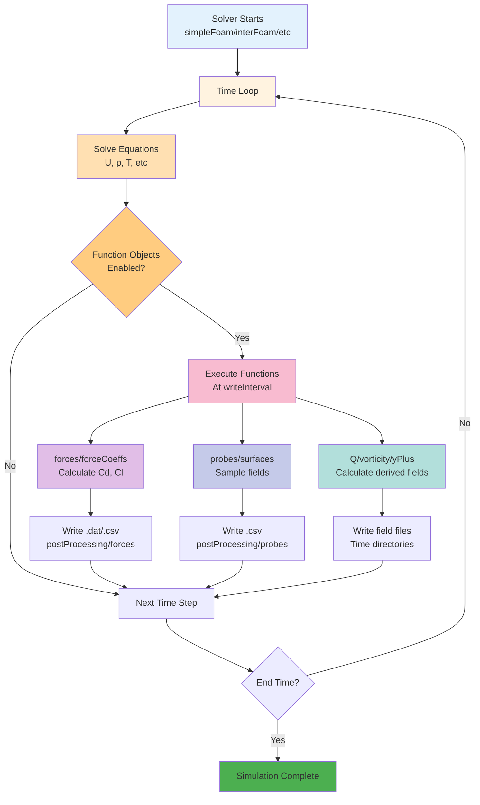
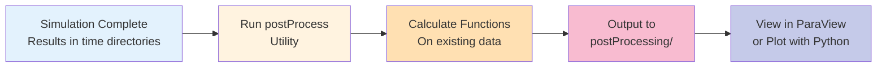

# บทนำสู่ Function Objects (Introduction to Function Objects)

> [!TIP] ทำไม Function Objects สำคัญ?
> Function Objects เป็นเครื่องมือพลังงานที่ช่วยให้คุณ **ติดตามผลลัพธ์แบบ Real-time** ระหว่างการจำลอง โดยไม่ต้องรอให้รันเสร็จก่อน ช่วยประหยัดเวลาและพื้นที่จัดเก็บ ทำให้คุณรู้ได้ทันทีว่า Simulation กำลังไปในทิศทางที่ถูกต้องหรือไม่ และสามารถคำนวณค่าทางฟิสิกส์ที่ซับซ้อนได้โดยอัตโนมัติ

ในยุคแรกของ OpenFOAM หากเราต้องการค่าแรงต้าน (Drag) เราต้องรอให้รันเสร็จ แล้วใช้โปรแกรมอื่นคำนวณ หรือต้องเขียน Code แทรกใน Solver เอง

แต่ปัจจุบัน เรามี **Function Objects** ซึ่งเป็นเหมือน "Plugin" ที่สามารถเสียบเข้าไปทำงานระหว่างที่ Solver กำลังรันอยู่ (Runtime) โดยไม่ต้องแก้ Code หลัก

> **ลิงก์ที่เกี่ยวข้อง**:
> - ดู Forces and Coefficients → [02_Forces_and_Coefficients.md](./02_Forces_and_Coefficients.md)
> - ดู Sampling and Probes → [03_Sampling_and_Probes.md](./03_Sampling_and_Probes.md)

## 🎯 Learning Objectives

หลังจากอ่านบทนี้ คุณควรจะสามารถ:

1. **อธิบาย** (Explain) ได้ว่า Function Objects คืออะไร และทำไมถึงสำคัญใน workflow ของ OpenFOAM
2. **เขียน** (Write) Function Objects ใน `system/controlDict` ได้ทั้งแบบ Classic และ Modern (`#includeFunc`)
3. **ใช้งาน** (Use) Function Objects ยอดนิยม เช่น `forces`, `probes`, `yPlus`, `Q`, และ `vorticity` ได้อย่างถูกต้อง
4. **รัน** (Execute) Function Objects แบบ Post-process ด้วย utility `postProcess` เพื่อคำนวณย้อนหลัง
5. **แยกแยะ** (Distinguish) ความแตกต่างระหว่าง Runtime execution และ Post-processing execution ของ Function Objects

> [!NOTE] **📂 OpenFOAM Context**
> **Prerequisites:** ควรมีความเข้าใจพื้นฐานเกี่ยวกับ OpenFOAM case structure และได้รัน Tutorial case พื้นฐานมาแล้ว เช่น Lid-driven cavity หรือ Pipe flow
> **Related Files:** `system/controlDict`, `postProcessing/` directory, Time directories

---

## 1. ทำไมต้องใช้ Function Objects?

> [!NOTE] **📂 OpenFOAM Context**
> **File:** `system/controlDict`
> **Keywords:** `functions`, `#includeFunc`, `type`, `libs`, `writeInterval`
>
> Function Objects ถูกกำหนดใน `system/controlDict` ภายใต้ block `functions { ... }` เป็นการตั้งค่าการทำงานของ Solver ที่ระบุว่าต้องการคำนวณค่าอะไรเพิ่มเติมระหว่างการรัน Simulation

### 1.1 Online Monitoring: ติดตามผลลัพธ์แบบ Real-time

เห็นค่า $C_d, C_l$ หรือ Mass Flow Rate แบบ Real-time (ผ่านไฟล์ .dat/.csv) รู้ได้ทันทีว่า Simulation นิ่ง (Converge) หรือยัง

**ประโยชน์:**
- ตรวจสอบ Convergence ได้ทันทีโดยไม่ต้องเปิด ParaView
- สังเกต Trend ของค่าทางฟิสิกส์ในขณะที่ Simulation กำลังรัน
- ตัดสินใจหยุดรันก่อนกำหนดได้หากผลลัพธ์ไม่น่าพอใจ

### 1.2 Space Saving: ประหยัดพื้นที่จัดเก็บ

แทนที่จะ Save ผลลัพธ์ทั้งก้อน (Volumetric Field) ทุกๆ 1 วินาที เราสามารถ Save เฉพาะจุดที่สนใจ (Probes) ถี่ๆ ได้โดยไม่เปลือง Harddisk

**ตัวอย่างเปรียบเทียบ:**
- **Volumetric Output:** `writeInterval 1;` สำหรับ 3D case ขนาด 1M cells → ~100 MB ต่อ time step
- **Probes Output:** 100 probes ทุก 0.1 วินาที → ~10 KB ต่อ output

### 1.3 On-the-fly Calculation: คำนวณค่าซับซ้อนโดยอัตโนมัติ

คำนวณค่าทางฟิสิกส์ที่ซับซ้อน (เช่น Q-criterion, Vorticity, Wall shear stress) ไว้เลย ไม่ต้องเสียเวลามาคำนวณซ้ำตอน Post-processing

**ข้อดี:**
- ลดเวลา Post-processing ลงได้มาก
- ผลลัพธ์พร้อมใช้ทันทีหลังจากรันเสร็จ
- สามารถ Visualize ค่าเหล่านี้ใน ParaView ได้เลย

---

## 2. การใช้งานใน `controlDict`

> [!NOTE] **📂 OpenFOAM Context**
> **File:** `system/controlDict`
> **Keywords:** `functions`, `type`, `libs`, `enabled`, `writeControl`, `writeInterval`
>
> Section นี้แสดงวิธีการเขียน Function Objects ใน `system/controlDict` สองแบบ: แบบเต็ม (Classic) และแบบย่อ (Modern) โดยมี Keywords สำคัญ ได้แก่ `type` (ชนิดของ function), `libs` (library ที่ต้องโหลด), และการควบคุมการเขียนผลลัพธ์ด้วย `writeControl` และ `writeInterval`

เราสามารถเพิ่ม Block `functions { ... }` ท้ายไฟล์ `system/controlDict`

### แบบ Classic (เขียนเต็ม)

วิธีนี้ให้ความยืดหยุ่นสูงสุด แต่ต้องระบุทุก parameter:

```cpp
functions
{
    forces1
    {
        type        forces;
        libs        ("libforces.so");
        
        // กำหนด patches ที่จะคำนวณ
        patches     ("inlet" "outlet" "walls");
        
        // ควบคุมการเขียน output
        writeControl    writeTime;
        writeInterval   1;
    }
}
```

**Pros:** ควบคุมได้ละเอียด  
**Cons:** เขียนยาว ง่ายเกิด typo

### แบบ Modern (`#includeFunc`) - แนะนำ!

OpenFOAM รุ่นใหม่มี Pre-configured function ไว้ให้แล้ว เราแค่เรียกใช้และ Overwrite ค่าที่ต้องการเปลี่ยน

```cpp
functions
{
    // เรียกใช้ฟังก์ชัน forces ด้วยค่า default
    #includeFunc forces
    
    // เรียกใช้ฟังก์ชัน probes และแก้ไขค่าบางตัว
    myProbe
    {
        #includeFunc probes
        
        // Overwrite ค่า default
        fields          (p U);
        probeLocations  ((0 0 0) (1 0 0));
    }
    
    // ปิดการทำงานของ function ชั่วคราว
    disabledFunc
    {
        #includeFunc Q
        enabled    off;
    }
}
```

**Pros:** สั้น อ่านง่าย ลดข้อผิดพลาด ใช้ค่า default ที่ optimized มาแล้ว  
**Cons:** อาจไม่รู้ว่า default parameters คืออะไร (แต่สามารถดูได้จาก documentation)

> [!TIP] **💡 Best Practice**
> เริ่มต้นด้วย `#includeFunc` เสมอ แล้วค่อย Overwrite เฉพาะค่าที่จำเป็นต้องเปลี่ยน หากต้องการ custom parameters มากๆ ค่อยเปลี่ยนไปใช้แบบ Classic

---

## 3. Function Objects ยอดนิยม

> [!NOTE] **📂 OpenFOAM Context**
> **File:** `system/controlDict`
> **Keywords:** `type` (Q, vorticity, yPlus, wallShearStress, forces, forceCoeffs, probes, surfaces, sets), `libs ("libfieldFunctionObjects.so")`, `fields`, `probeLocations`, `writeControl`
>
> Function Objects แต่ละประเภทใช้ Keyword ที่แตกต่างกัน เช่น `Q`, `vorticity`, `yPlus` สำหรับ Field Calculation, `forces`, `forceCoeffs` สำหรับ Monitoring, และ `probes`, `surfaces` สำหรับ Sampling โดยปกติจะโหลด library จาก `libfieldFunctionObjects.so` หรือ `libforces.so`

### 3.1 Field Calculation Functions

| Function | คำอธิบาย | Library | Output |
|----------|-----------|---------|--------|
| `Q` | คำนวณ Q-criterion (ดูโครงสร้าง Turbulence) | libfieldFunctionObjects.so | VolScalarField |
| `vorticity` | คำนวณ Vorticity field ($\vec{\omega} = \nabla \times \vec{U}$) | libfieldFunctionObjects.so | VolVectorField |
| `yPlus` | คำนวณค่า $y+$ ที่ผนัง (เช็คความละเอียด Mesh) | libfieldFunctionObjects.so | volScalarField |
| `wallShearStress` | คำนวณแรงเฉือนที่ผนัง ($\tau_w$) | libfieldFunctionObjects.so | volSymmTensorField |

**ตัวอย่างการใช้งาน:**
```cpp
functions
{
    #includeFunc Q
    #includeFunc vorticity
    
    yPlus
    {
        #includeFunc yPlus
        writeControl    writeTime;
        writeInterval   10;  // เขียนทุก 10 ครั้ง
    }
}
```

### 3.2 Monitoring Functions

| Function | คำอธิบาย | Library | Output |
|----------|-----------|---------|--------|
| `forces` | คำนวณแรงและโมเมนต์บน patches | libforces.so | `postProcessing/forces/0/forces.dat` |
| `forceCoeffs` | คำนวณ $C_l, C_d, C_m$ | libforces.so | `postProcessing/forceCoeffs/0/forceCoeffs.dat` |
| `probes` | ดึงค่าที่จุดพิกัดตามเวลา | libfieldFunctionObjects.so | `postProcessing/probes/0/*.csv` |
| `residuals` | เขียนค่า Residuals ออกเป็นไฟล์ | libutilityFunctionObjects.so | `postProcessing/residuals/0/residuals.dat` |

**ตัวอย่างการใช้งาน:**
```cpp
functions
{
    forcesObject
    {
        #includeFunc forces
        patches     ("cylinder");
    }
    
    coeffsObject
    {
        #includeFunc forceCoeffs
        patches     ("cylinder");
        liftDir     (0 1 0);
        dragDir     (1 0 0);
        pitchAxis   (0 0 1);
        magUInf     10.0;
        lRef        1.0;
        Aref        1.0;
    }
}
```

### 3.3 Sampling Functions

| Function | คำอธิบาย | Library | Output |
|----------|-----------|---------|--------|
| `surfaces` | ตัด Slice หรือ Isosurface และบันทึกผล | libsampling.so | VTK files in `postProcessing/` |
| `sets` | ดึงค่าตามเส้น (Line plotting) | libsampling.so | `.xy` files |

**ตัวอย่างการใช้งาน:**
```cpp
functions
{
    // สร้าง Slice plane
    cuttingPlane
    {
        type        surfaces;
        libs        ("libsampling.so");
        
        surfaceFormat   vtk;
        fields          (p U);
        
        surfaces
        (
            "zPlane"
            {
                type            plane;
                planeType       pointAndNormal;
                pointAndNormalDict
                {
                    point       (0 0 0.5);
                    normal      (0 0 1);
                }
            }
        );
        
        writeControl    writeTime;
        writeInterval   1;
    }
}
```

---

## 4. การรันแบบ Post-Process (ทำย้อนหลัง)

> [!NOTE] **📂 OpenFOAM Context**
> **Utility:** `postProcess` (Command Line)
> **Keywords:** `-func`, `-latestTime`, `-dirs`, `-region`, `-time`
>
> Section นี้แสดงการใช้ Utility `postProcess` ซึ่งเป็นคำสั่ง Command Line ที่ทำงานแยกจาก Solver ช่วยให้สามารถคำนวณ Function Objects ย้อนหลังได้โดยใช้ Flag `-func` ตามด้วยชื่อ function ที่ต้องการ และสามารถระบุเวลาที่ต้องการคำนวณด้วย `-latestTime` หรือ `-time`

ถ้าลืมใส่ Function Objects ตอนรัน ไม่ต้องเสียใจ! เราสามารถสั่งรันย้อนหลังได้ด้วย Utility `postProcess`

### 4.1 Basic Usage

```bash
# คำนวณ y+ ย้อนหลังทุก Time step
postProcess -func yPlus

# คำนวณเฉพาะ Time ล่าสุด
postProcess -func vorticity -latestTime

# คำนวณหลาย functions พร้อมกัน
postProcess -func '(Q vorticity yPlus)'

# ระบุช่วงเวลาที่ต้องการ
postProcess -func yPlus -time '0:10'      # ตั้งแต่ 0 ถึง 10
postProcess -func yPlus -time 5:10        # ตั้งแต่ 5 ถึง 10
```

### 4.2 Advanced Options

```bash
# ใช้ functions จาก controlDict ที่ define ไว้แล้ว
postProcess -latestTime

# ระบุ case directory อื่น
postProcess -case /path/to/case -func yPlus

# รันบน region เฉพาะ (สำหรับ multi-region cases)
postProcess -region fluid -func yPlus

# รันหลาย functions จาก dictionary file
postProcess -dict system/myPostProcessDict
```

### 4.3 When to Use Post-Process vs Runtime

| Scenario | Runtime (in controlDict) | Post-Process |
|----------|--------------------------|--------------|
| Monitoring convergence | ✅ แนะนำ | ❌ ไม่ได้ |
| ประหยัด disk space | ✅ แนะนำ | N/A |
| ลืมใส่ function | ❌ สาย | ✅ ช่วยได้ |
| คำนวณย้อนหลัง | ❌ ไม่ได้ | ✅ แนะนำ |
| ทดลองค่าต่างๆ | ✅ รันใหม่ทุกครั้ง | ✅ รันครั้งเดียว |

นี่คือความยืดหยุ่สูงสุดของระบบ OpenFOAM ที่แยกส่วน Solver กับ Post-processing ออกจากกันอย่างชัดเจน

### 4.4 Function Objects Workflow



### 4.5 Post-Process Workflow



---

## 🧠 Concept Check: ทดสอบความเข้าใจ

### แบบฝึกหัดระดับง่าย (Easy)

1. **True/False**: Function Objects ต้องแก้ไข Source Code ของ Solver
   <details>
   <summary>คำตอบ</summary>
   ❌ เท็จ - Function Objects ทำงานเป็น Plugin ไม่ต้องแก้ Solver
   </details>

2. **เลือกตอบ**: คำสั่งไหนใช้คำนวณ y+ ย้อนหลังหลังจากรันเสร็จ?
   - a) foamRun yPlus
   - b) postProcess -func yPlus
   - c) calcYPlus
   - d) yPlus -post
   <details>
   <summary>คำตอบ</summary>
   ✅ b) postProcess -func yPlus
   </details>

3. **เติมคำ**: Function Objects ถูกกำหนดในไฟล์ `________` ภายใต้ block `functions { ... }`
   <details>
   <summary>คำตอบ</summary>
   system/controlDict
   </details>

### แบบฝึกหัดระดับปานกลาง (Medium)

4. **อธิบาย**: ข้อดีของการใช้ `#includeFunc` มากกว่าการเขียน Function Objects แบบเต็มคืออะไร?
   <details>
   <summary>คำตอบ</summary>
   #includeFunc ใช้ Pre-configured function ที่มีอยู่แล้ว ซึ่งถูก optimized มาอย่างดี ลดโอกาสเกิดข้อผิดพลาดจากการเขียนเอง (typo, missing parameters) และทำให้ code สั้นกระชับอ่านง่ายขึ้น นอกจากนี้ยังง่ายต่อการ maintenance เมื่อ OpenFOAM มีการอัปเดต
   </details>

5. **สร้าง**: จงเขียน `functions` block ใน controlDict สำหรับคำนวณ Q-criterion และ vorticity โดยใช้ `#includeFunc`
   <details>
   <summary>คำตอบ</summary>
   ```cpp
   functions
   {
       #includeFunc Q
       #includeFunc vorticity
   }
   ```
   </details>

6. **อธิบาย**: แตกต่างระหว่าง `forces` และ `forceCoeffs` อย่างไร?
   <details>
   <summary>คำตอบ</summary>
   `forces` คำนวณแรงและโมเมนต์ในหน่วย [N] และ [N·m] ตามลำดับ ในขณะที่ `forceCoeffs` คำนวณค่า dimensionless coefficients ($C_l, C_d, C_m$) โดยต้องระบุ reference velocity, reference length, และ reference area เพื่อทำการ normalize ค่าแรง
   </details>

### แบบฝึกหัดระดับสูง (Hard)

7. **Hands-on**: เพิ่ม Function Objects ใน Tutorial case ใดๆ (เช่น `tutorials/incompressible/simpleFoam/airFoil2D`) เพื่อ:
   - คำนวณ Drag และ Lift coefficients ด้วย `forceCoeffs`
   - ติดตามค่า pressure ที่จุดพิกัด (0, 0, 0) ด้วย `probes`
   - บันทึกผลลัพธ์ทุกๆ 10 time steps
   - รัน Simulation และตรวจสอบไฟล์ output ใน `postProcessing/`

   <details>
   <summary>เฉลย (ตัวอย่าง controlDict)</summary>
   ```cpp
   functions
   {
       forceCoeffs1
       {
           #includeFunc forceCoeffs
           patches     ("airfoil");
           liftDir     (0 1 0);
           dragDir     (1 0 0);
           pitchAxis   (0 0 1);
           magUInf     10.0;
           lRef        1.0;
           Aref        1.0;
           writeControl    timeStep;
           writeInterval   10;
       }
       
       probe1
       {
           #includeFunc probes
           fields          (p);
           probeLocations  ((0 0 0));
           writeControl    timeStep;
           writeInterval   10;
       }
   }
   ```
   </details>

8. **อธิบาย**: ถ้าคุณต้องการคำนวณ yPlus เฉพาะที่ time step ล่าสุดหลังจากรัน Simulation เสร็จแล้ว คุณจะเขียนคำสั่งอย่างไร? และ output จะถูกเก็บไว้ที่ไหน?
   <details>
   <summary>คำตอบ</summary>
   คำสัั่ง: `postProcess -func yPlus -latestTime`  
   Output: จะถูกเก็บใน `postProcessing/yPlus/<latest_time>/yPlus` เป็นไฟล์ field แบบเดียวกับ primary variables (U, p, etc.) ซึ่งสามารถเปิดใน ParaView ได้
   </details>

9. **วิเคราะห์**: สมมติคุณกำลัง Simulation กรณี unsteady flow และต้องการ monitor ค่า $C_d$ และ $C_l$ แบบ real-time แต่เพื่อประหยัดพื้นที่คุณไม่ต้องการบันทึก volumetric fields ทุก time step จงเขียน controlDict configuration ที่เหมาะสม
   <details>
   <summary>คำตอบ</summary>
   ```cpp
   application simpleFoam; // หรือ solver ที่เหมาะสม
   
   startFrom latestTime;
   
   // บันทึก volumetric fields ไม่บ่อย (เช่น ทุกๆ 100 steps)
   writeControl    timeStep;
   writeInterval   100;
   
   functions
   {
       forceCoeffs1
       {
           #includeFunc forceCoeffs
           patches     ("body");
           // ... parameters อื่นๆ ...
           
           // บันทึก coefficients บ่อยๆ (ทุกๆ 1 step)
           writeControl    timeStep;
           writeInterval   1;
       }
   }
   ```
   การตั้งค่านี้ทำให้คุณได้ข้อมูล $C_d, C_l$ แบบละเอียด แต่ volumetric fields ถูกบันทึกน้อยลง ช่วยประหยัด disk space ได้มาก
   </details>

---

## 📋 Key Takeaways

สรุปสิ่งสำคัญที่ควรนำไปใช้:

1. ✅ **Function Objects คือเครื่องมือพลังงาน** ช่วยให้คำนวณค่าเพิ่มเติมระหว่าง runtime โดยไม่ต้องแก้ solver
2. ✅ **ใช้ `#includeFunc` เป็นค่า default** เพื่อลดข้อผิดพลาดและประหยัดเวลาในการเขียน
3. ✅ **3 ประโยชน์หลัก**: Online monitoring, Space saving, On-the-fly calculation
4. ✅ **`postProcess` utility ช่วยได้มาก** หากลืมใส่ function objects ตอนรัน สามารถคำนวณย้อนหลังได้
5. ✅ **Output ถูกเก็บใน `postProcessing/`** สำหรับ monitoring data และ time directories สำหรับ field data
6. ✅ **เลือกใช้ function ที่เหมาะสม** กับงาน: `forces/forceCoeffs` สำหรับ aerodynamics, `probes` สำหรับ monitoring, `Q/vorticity` สำหรับ visualization

---

## 📖 เอกสารที่เกี่ยวข้อง

*   **บทก่อนหน้า**: [../05_MESH_QUALITY_AND_MANIPULATION/03_Mesh_Manipulation_Tools.md](../05_MESH_QUALITY_AND_MANIPULATION/03_Mesh_Manipulation_Tools.md)
*   **บทถัดไป**: [02_Forces_and_Coefficients.md](02_Forces_and_Coefficients.md) - ศึกษาเชิงลึกเกี่ยวกับการคำนวณแรงและสัมประสิทธิ์
*   **บทถัดไป**: [03_Sampling_and_Probes.md](03_Sampling_and_Probes.md) - ศึกษาการใช้งาน probes และ sampling อย่างละเอียด