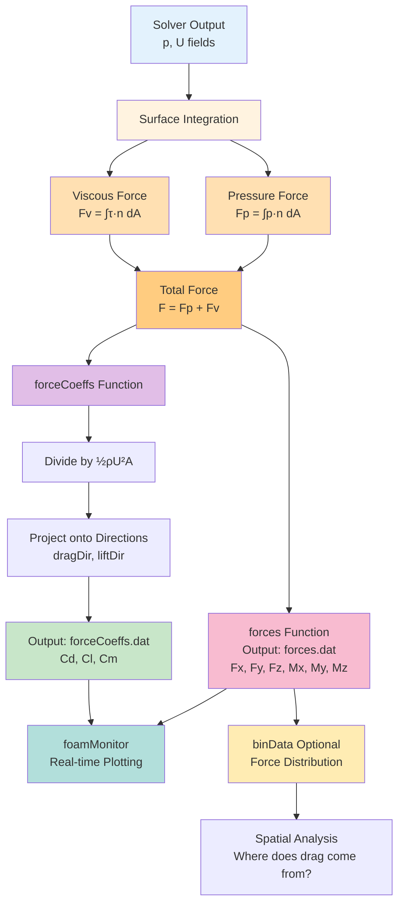

# การคำนวณแรงและสัมประสิทธิ์ (Forces and Coefficients)

สำหรับงาน External Aerodynamics (รถยนต์, เครื่องบิน, อาคาร) ข้อมูลที่สำคัญที่สุดคือแรงต้าน (**Drag**) และแรงยก (**Lift**)

OpenFOAM มี Function objects 2 ตัวหลักสำหรับงานนี้: `forces` และ `forceCoeffs`

> **ลิงก์ที่เกี่ยวข้อง**:
> - ดู Introduction to Function Objects → [01_Introduction_to_FunctionObjects.md](./01_Introduction_to_FunctionObjects.md)
> - ดู Sampling and Probes → [03_Sampling_and_Probes.md](./03_Sampling_and_Probes.md)

## 1. Forces (`forces`)

คำนวณแรงรวม (Pressure + Viscous) และโมเมนต์ที่กระทำต่อ Patch ที่กำหนด

```cpp
functions
{
    forces1
    {
        type            forces;
        libs            ("libforces.so");
        writeControl    timeStep;
        writeInterval   1;
        
        patches         (car_body wheels); // Patch ที่ต้องการคิดแรง
        
        rho             rhoInf;      // ชื่อตัวแปรความหนาแน่น (ถ้า Incompressible ให้ระบุค่า เช่น rhoInf 1.225;)
        CofR            (0.5 0 0);   // Center of Rotation (สำหรับ Moment)
    }
}
```
*   **Output:** ไฟล์ `postProcessing/forces1/0/forces.dat`
*   **Data:** Time, Pressure Force (x y z), Viscous Force (x y z), Moment (x y z)

## 2. Force Coefficients (`forceCoeffs`)

คำนวณเป็นค่าไร้มิติ ($C_d, C_l, C_m$) โดยหารด้วย Dynamic Pressure ($rac{1}{2}
ho U^2 A$)

```cpp
functions
{
    forceCoeffs1
    {
        type            forceCoeffs;
        libs            ("libforces.so");
        writeControl    timeStep;
        writeInterval   1;

        patches         (car_body);
        
        rho             rhoInf;
        rhoInf          1.225;  // ความหนาแน่น (kg/m3)
        magUInf         20;     // ความเร็วลม (m/s)
        lRef            3.5;    // ความยาวอ้างอิง (m) - สำหรับ Moment
        Aref            2.0;    // พื้นที่หน้าตัดอ้างอิง (m2) - Frontal Area
        
        liftDir         (0 1 0); // ทิศทางแรงยก
        dragDir         (1 0 0); // ทิศทางแรงต้าน
        pitchAxis       (0 0 1); // แกนหมุน (Pitch)
        CofR            (0 0 0); // จุดหมุน
    }
}
```

> [!WARNING] **กับดัก Aref**
> OpenFOAM **ไม่คำนวณพื้นที่หน้าตัด (Frontal Area) ให้คุณอัตโนมัติ!**
> คุณต้องวัดพื้นที่หน้าตัดของรถ (Projected Area) ด้วย ParaView หรือ CAD แล้วเอาตัวเลขมาใส่ใน `Aref` เอง ถ้าใส่ผิด ค่า $C_d$ ก็ผิดทันที

## 3. Binning (การแบ่งช่วงแรง)

ฟีเจอร์ `binData` ช่วยให้เราดูการกระจายตัวของแรงตามแกนต่างๆ ได้ (เช่น อยากรู้ว่าแรงต้านเกิดที่ส่วนหน้ารถ หรือท้ายรถมากกว่ากัน)

```cpp
        binData
        {
            nBin        20;      // แบ่งเป็น 20 ช่อง
            direction   (1 0 0); // ตลอดความยาวแกน X
            cumul       yes;
        }
```

## 4. การ Plot กราฟ Real-time

เราสามารถใช้ `gnuplot` หรือ `foamMonitor` เพื่อดูกราฟขณะรัน:

```bash
foamMonitor -l postProcessing/forceCoeffs1/0/forceCoeffs.dat
```
(ต้องติดตั้ง gnuplot ก่อน) กราฟจะเด้งขึ้นมาและ Update ทุกครั้งที่ไฟล์มีการเขียนข้อมูล ช่วยให้เราตัดสินใจได้ว่า "กราฟนิ่งหรือยัง" (Convergence Judgement)

**Forces and Coefficients Calculation Flow:**


---

## 📝 แบบฝึกหัด (Exercises)

### แบบฝึกหัดระดับง่าย (Easy)
1. **True/False**: `forceCoeffs` คำนวณพื้นที่หน้าตัด (Aref) ให้อัตโนมัติ
   <details>
   <summary>คำตอบ</summary>
   ❌ เท็จ - ต้องระบุ Aref เอง ถ้าผิด ค่า Cd ก็ผิด
   </details>

2. **เลือกตอบ**: ไฟล์ output ของ `forces` function object อยู่ที่ไหน?
   - a) postProcessing/forces/0/forces.dat
   - b) postProcessing/forces1/0/forces.dat
   - c) forces/forces.dat
   - d) processing/forces.dat
   <details>
   <summary>คำตอบ</summary>
   ✅ b) postProcessing/forces1/0/forces.dat (ชื่อขึ้นกับชื่อ function)
   </details>

### แบบฝึกหัดระดับปานกลาง (Medium)
3. **อธิบาย**: แตกต่างระหว่าง `forces` และ `forceCoeffs` คืออะไร?
   <details>
   <summary>คำตอบ</summary>
   - forces: คำนวณแรงหน่วย [N] และโมเมนต์ [N·m]
   - forceCoeffs: คำนวณค่าไร้มิติ (Cd, Cl, Cm) โดยหารด้วย Dynamic Pressure
   </details>

4. **สร้าง**: จงเขียน `forceCoeffs1` block สำหรับคำนวณ Drag ทิศทาง X และ Lift ทิศทาง Y
   <details>
   <summary>คำตอบ</summary>
   ```cpp
   forceCoeffs1
   {
       type            forceCoeffs;
       libs            ("libforces.so");
       patches         (object_name);
       rho             rhoInf;
       rhoInf          1.225;
       magUInf         20;
       lRef            3.5;
       Aref            2.0;
       liftDir         (0 1 0);
       dragDir         (1 0 0);
       pitchAxis       (0 0 1);
       CofR            (0 0 0);
   }
   ```
   </details>

### แบบฝึกหัดระดับสูง (Hard)
5. **Hands-on**: เพิ่ม `binData` ใน forces function object และวิเคราะห์การกระจายตัวของแรงตามแกน X

6. **วิเคราะห์**: เปรียบเทียบค่า Cd ที่ได้จาก CFD กับค่า Cd จริงจาก Wind tunnel ในแง่ของ:
   - แหล่งที่มาของความคลาดเคลื่อน (Uncertainty)
   - ปัจจัยที่ทำให้ต่าง (Mesh quality, Turbulence model, Boundary conditions)