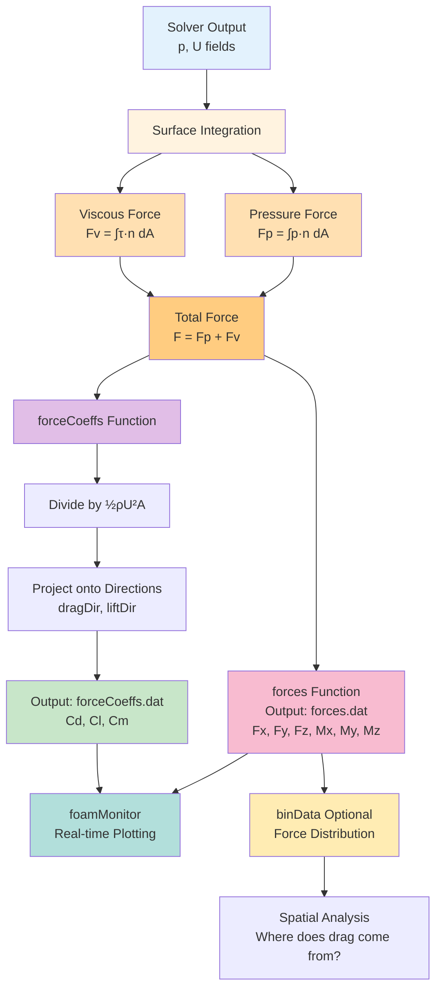

# การคำนวณแรงและสัมประสิทธิ์ (Forces and Coefficients)

## 🎯 Learning Objectives

หลังจากศึกษาบทนี้ คุณจะสามารถ:

- **อธิบาย** ความแตกต่างระหว่างการคำนวณแรง (forces) และสัมประสิทธิ์แรง (force coefficients) ใน OpenFOAM
- **ตั้งค่า** function objects `forces` และ `forceCoeffs` ใน `system/controlDict` ได้อย่างถูกต้อง
- **คำนวณ** ค่า Drag ($C_d$), Lift ($C_l$), และ Moment ($C_m$) จาก Simulation
- **ประยุกต์** ใช้ `binData` เพื่อวิเคราะห์การกระจายตัวของแรงตามตำแหน่ง
- **ตรวจสอบ** Convergence ของแรงและสัมประสิทธิ์แบบ Real-time ด้วย `foamMonitor`

---

## What: แรงและสัมประสิทธิ์คืออะไร?

> [!TIP] **ทำไมต้องคำนวณแรงและสัมประสิทธิ์?**
> ในงาน External Aerodynamics เช่น การวิเคราะห์แรงต้านของรถยนต์ (Drag) หรือแรงยกของปีกเครื่องบิน (Lift) การเฝ้าดูค่าสนามความดันและความเร็วเป็นรายบุคคลนั้นทำได้ยาก การคำนวณแรงรวมที่กระทำต่อพื้นผิววัตถุจึงเป็นวิธีที่มีประสิทธิภาพที่สุดในการประเมินสมรรถนะ และการแปลงเป็นค่าไร้มิติ (Coefficients) ทำให้เราสามารถเปรียบเทียบผลลัพธ์ระหว่างสเกลที่ต่างกันหรือเปรียบเทียบกับข้อมูลทดลองได้
>
> **การบูรณาการ Function Objects**: การใช้ `forces` และ `forceCoeffs` ช่วยให้เราเฝ้าดู Convergence ของแรงได้แบบ Real-time โดยไม่ต้องหยุดการคำนวณ ช่วยประหยัดเวลาและทรัพยากรในการรัน Simulation ที่อาจใช้เวลานานหลายวัน

สำหรับงาน External Aerodynamics (รถยนต์, เครื่องบิน, อาคาร) ข้อมูลที่สำคัญที่สุดคือแรงต้าน (**Drag**) และแรงยก (**Lift**)

OpenFOAM มี Function objects 2 ตัวหลักสำหรับงานนี้: `forces` และ `forceCoeffs`

> **ลิงก์ที่เกี่ยวข้อง**:
> - ดู Introduction to Function Objects → [01_Introduction_to_FunctionObjects.md](./01_Introduction_to_FunctionObjects.md)
> - ดู Sampling and Probes → [03_Sampling_and_Probes.md](./03_Sampling_and_Probes.md)

## Why: ทำไมต้องแบ่งเป็น 2 วิธี?

**Forces (หน่วย N)** เหมาะสมเมื่อ:
- ต้องการทราบค่าแรงจริงที่กระทำต่อวัตถุ
- ใช้ในการออกแบบโครงสร้าง (Structural Design)
- ต้องการคำนวณ Stress หรือ Deformation

**Force Coefficients (ไร้มิติ)** เหมาะสมเมื่อ:
- ต้องการเปรียบเทียบกับข้อมูลทดลอง (Wind Tunnel Data)
- ต้องการ Scaling ไปยังสเกลอื่น
- ต้องการเปรียบเทียบระหว่าง Geometries ที่ต่างกัน
- ต้องการตรวจสอบ Convergence ของ Simulation

## How: การใช้งาน

### 1. Forces (`forces`)

> [!NOTE] **📂 OpenFOAM Context: Function Object ใน controlDict**
> การคำนวณแรงด้วย `forces` function object ถูกกำหนดในไฟล์ `system/controlDict` ภายใต้ dictionary `functions`
>
> **ไฟล์ที่เกี่ยวข้อง:**
> - `system/controlDict` - บรรจุ function object definitions
>
> **Keywords หลัก:**
> - `type forces` - ระบุประเภท function object
> - `libs ("libforces.so")` - โหลด library ที่จำเป็น
> - `patches (...)` - ระบุ patch ที่จะคำนวณแรง
> - `rho` - ชื่อ field ความหนาแน่น (ใช้ `rhoInf` สำหรับ incompressible)
> - `CofR` - Center of Rotation สำหรับคำนวณ Moment
> - `writeControl` / `writeInterval` - ควบคุมความถี่ในการเขียน output
>
> **Output Location:** `postProcessing/<functionName>/<time>/forces.dat`

คำนวณแรงรวม (Pressure + Viscous) และโมเมนต์ที่กระทำต่อ Patch ที่กำหนด

```cpp
functions
{
    forces1
    {
        type            forces;
        libs            ("libforces.so");
        writeControl    timeStep;
        writeInterval   1;
        
        patches         (car_body wheels); // Patch ที่ต้องการคิดแรง
        
        rho             rhoInf;      // ชื่อตัวแปรความหนาแน่น (ถ้า Incompressible ให้ระบุค่า เช่น rhoInf 1.225;)
        CofR            (0.5 0 0);   // Center of Rotation (สำหรับ Moment)
    }
}
```
*   **Output:** ไฟล์ `postProcessing/forces1/0/forces.dat`
*   **Data:** Time, Pressure Force (x y z), Viscous Force (x y z), Moment (x y z)

### 2. Force Coefficients (`forceCoeffs`)

> [!NOTE] **📂 OpenFOAM Context: Non-Dimensional Coefficients**
> การคำนวณสัมประสิทธิ์แรงด้วย `forceCoeffs` function object ถูกกำหนดในไฟล์ `system/controlDict` เหมือนกับ `forces` แต่มี parameters เพิ่มเติมสำหรับการทำให้เป็นค่าไร้มิติ
>
> **ไฟล์ที่เกี่ยวข้อง:**
> - `system/controlDict` - บรรจุ function object definitions
>
> **Keywords เพิ่มเติม (เทียบกับ forces):**
> - `type forceCoeffs` - ระบุประเภทเป็น coefficient calculator
> - `rhoInf` - ค่าความหนาแน่นอ้างอิง (kg/m³)
> - `magUInf` - ความเร็วลมอ้างอิง (m/s)
> - `lRef` - ความยาวอ้างอิง (m) สำหรับ normalization ของ Moment
> - `Aref` - **พื้นที่หน้าตัดอ้างอิง (m²)** - ค่าที่สำคัญที่สุด!
> - `liftDir` / `dragDir` / `pitchAxis` - ทิศทางการฉายภาพแรง
> - `CofR` - จุดอ้างอิงสำหรับ Moment calculation
>
> **Output Location:** `postProcessing/<functionName>/<time>/forceCoeffs.dat`
>
> **⚠️ ข้อควรระวัง:** ค่า `Aref` ต้องเป็นค่าที่คำนวณจาก CAD หรือวัดจาก ParaView เท่านั้น OpenFOAM ไม่สามารถคำนวณให้ได้

คำนวณเป็นค่าไร้มิติ ($C_d, C_l, C_m$) โดยหารด้วย Dynamic Pressure ($\frac{1}{2}\rho U^2 A$)

**สมการ Drag Coefficient:**

$$C_d = \frac{F_d}{\frac{1}{2}\rho U^2 A_{ref}}$$

เมื่อ:
- $F_d$ = แรงต้านที่วัดได้จาก Simulation (N)
- $\rho$ = ความหนาแน่นของไหล (kg/m³)
- $U$ = ความเร็วลมอ้างอิง (m/s)
- $A_{ref}$ = พื้นที่หน้าตัดอ้างอิง (m²)

```cpp
functions
{
    forceCoeffs1
    {
        type            forceCoeffs;
        libs            ("libforces.so");
        writeControl    timeStep;
        writeInterval   1;

        patches         (car_body);
        
        rho             rhoInf;
        rhoInf          1.225;  // ความหนาแน่น (kg/m3)
        magUInf         20;     // ความเร็วลม (m/s)
        lRef            3.5;    // ความยาวอ้างอิง (m) - สำหรับ Moment
        Aref            2.0;    // พื้นที่หน้าตัดอ้างอิง (m2) - Frontal Area
        
        liftDir         (0 1 0); // ทิศทางแรงยก
        dragDir         (1 0 0); // ทิศทางแรงต้าน
        pitchAxis       (0 0 1); // แกนหมุน (Pitch)
        CofR            (0 0 0); // จุดหมุน
    }
}
```

> [!WARNING] **กับดัก Aref**
> OpenFOAM **ไม่คำนวณพื้นที่หน้าตัด (Frontal Area) ให้คุณอัตโนมัติ!**
> คุณต้องวัดพื้นที่หน้าตัดของรถ (Projected Area) ด้วย ParaView หรือ CAD แล้วเอาตัวเลขมาใส่ใน `Aref` เอง ถ้าใส่ผิด ค่า $C_d$ ก็ผิดทันที

**ตัวอย่างการคำนวณ:**

สมมติได้ผลลัพธ์จาก Simulation:
- Drag Force ($F_d$) = 250 N
- ความเร็วลม ($U$) = 20 m/s
- ความหนาแน่น ($\rho$) = 1.225 kg/m³
- พื้นที่หน้าตัด ($A_{ref}$) = 2.0 m²

$$C_d = \frac{250}{\frac{1}{2} \times 1.225 \times 20^2 \times 2.0} = \frac{250}{490} = 0.51$$

### 3. Binning (การแบ่งช่วงแรง)

> [!NOTE] **📂 OpenFOAM Context: Spatial Force Distribution**
> การใช้ `binData` ช่วยวิเคราะห์การกระจายตัวของแรงตามตำแหน่ง โดยจะแบ่งแรงออกเป็น bins ตามแกนที่กำหนด
>
> **ไฟล์ที่เกี่ยวข้อง:**
> - `system/controlDict` - บรรจุ binData sub-dictionary ภายใต้ forces/forceCoeffs
>
> **Keywords หลัก:**
> - `binData` - Sub-dictionary สำหรับการแบ่งช่วง
> - `nBin` - จำนวน bins ที่ต้องการแบ่ง
> - `direction` - แกนที่ใช้แบ่ง (เช่น (1 0 0) สำหรับแกน X)
> - `cumul` - ตัวเลือก cumulative (yes/no)
>
> **การประยุกต์ใช้:**
> - วิเคราะห์ว่าส่วนไหนของ vehicle มีส่วนช่วยให้เกิด drag มากที่สุด
> - ตรวจสอบการกระจายตัวของ lift ตาม span ของ wing
> - ดูการกระจายตัวของ moment ตามความยาวรถ
>
> **Output Location:** `postProcessing/<functionName>/<time>/forces.dat` (เพิ่มคอลัมน์ bin data)

ฟีเจอร์ `binData` ช่วยให้เราดูการกระจายตัวของแรงตามแกนต่างๆ ได้ (เช่น อยากรู้ว่าแรงต้านเกิดที่ส่วนหน้ารถ หรือท้ายรถมากกว่ากัน)

```cpp
        binData
        {
            nBin        20;      // แบ่งเป็น 20 ช่อง
            direction   (1 0 0); // ตลอดความยาวแกน X
            cumul       yes;
        }
```

### 4. การ Plot กราฟ Real-time

> [!NOTE] **📂 OpenFOAM Context: Runtime Monitoring**
> การ Plot กราฟแบบ Real-time ช่วยให้เราสามารถตรวจสอบ Convergence ของค่าแรงและสัมประสิทธิ์ได้ทันทีขณะที่ Solver กำลังทำงาน
>
> **เครื่องมือที่ใช้:**
> - `foamMonitor` - Script สำหรับ Plot กราฟ Real-time (ต้องการ gnuplot)
> - `gnuplot` - Software สำหรับการ Plot กราฟ (ติดตั้งแยก)
>
> **การใช้งาน:**
> ```bash
> foamMonitor -l postProcessing/forceCoeffs1/0/forceCoeffs.dat
> ```
>
> **ข้อดี:**
> - ตัดสินใจได้ทันทีว่า Simulation นิ่ง (Converged) หรือยัง
> - ประหยัดเวลา ไม่ต้องรอจนจบ Simulation ถึงรู้ว่าผิดพลาด
> - สามารถ Stop การคำนวณได้ถ้าพบว่าผิดพลาดตั้งแต่แรก
>
> **Output Location:** กราฟจะแสดงในหน้าต่าง X11 และ Update ทุกครั้งที่มีการเขียนข้อมูล

เราสามารถใช้ `gnuplot` หรือ `foamMonitor` เพื่อดูกราฟขณะรัน:

```bash
foamMonitor -l postProcessing/forceCoeffs1/0/forceCoeffs.dat
```
(ต้องติดตั้ง gnuplot ก่อน) กราฟจะเด้งขึ้นมาและ Update ทุกครั้งที่ไฟล์มีการเขียนข้อมูล ช่วยให้เราตัดสินใจได้ว่า "กราฟนิ่งหรือยัง" (Convergence Judgement)

**Forces and Coefficients Calculation Flow:**


---

## 🔧 Troubleshooting: ปัญหาที่พบบ่อย

| ปัญหา | สาเหตุที่เป็นไปได้ | วิธีแก้ไข |
|--------|------------------|-------------|
| ค่า $C_d$ ผิดปกติ (มาก/น้อยเกินไป) | ใส่ `Aref` ผิด | ตรวจสอบค่า Aref จาก CAD/ParaView |
| Output เป็นค่าศูนย์ทั้งหมด | ระบุ patch ผิด หรือชื่อไม่ตรง | ตรวจสอบชื่อ patch ใน `boundary` file |
| Moment ค่าผิด | `CofR` อยู่ไกลจากวัตถุเกินไป | ปรับ `CofR` ให้อยู่ใกล้จุดศูนย์กลางมวล |
| foamMonitor ไม่ทำงาน | ไม่ได้ติดตั้ง gnuplot | ติดตั้ง gnuplot: `sudo apt install gnuplot` |
| ไฟล์ output ไม่ถูกสร้าง | `writeInterval` ใหญ่เกินไป | ลด `writeInterval` ให้เหมาะสม (เช่น 1) |

---

## 🧠 Concept Check: ทดสอบความเข้าใจ

### แบบฝึกหัดระดับง่าย (Easy)
1. **True/False**: `forceCoeffs` คำนวณพื้นที่หน้าตัด (Aref) ให้อัตโนมัติ
   <details>
   <summary>คำตอบ</summary>
   ❌ เท็จ - ต้องระบุ Aref เอง ถ้าผิด ค่า Cd ก็ผิด
   </details>

2. **เลือกตอบ**: ไฟล์ output ของ `forces` function object อยู่ที่ไหน?
   - a) postProcessing/forces/0/forces.dat
   - b) postProcessing/forces1/0/forces.dat
   - c) forces/forces.dat
   - d) processing/forces.dat
   <details>
   <summary>คำตอบ</summary>
   ✅ b) postProcessing/forces1/0/forces.dat (ชื่อขึ้นกับชื่อ function)
   </details>

### แบบฝึกหัดระดับปานกลาง (Medium)
3. **อธิบาย**: แตกต่างระหว่าง `forces` และ `forceCoeffs` คืออะไร?
   <details>
   <summary>คำตอบ</summary>
   - forces: คำนวณแรงหน่วย [N] และโมเมนต์ [N·m]
   - forceCoeffs: คำนวณค่าไร้มิติ (Cd, Cl, Cm) โดยหารด้วย Dynamic Pressure
   </details>

4. **สร้าง**: จงเขียน `forceCoeffs1` block สำหรับคำนวณ Drag ทิศทาง X และ Lift ทิศทาง Y
   <details>
   <summary>คำตอบ</summary>
   ```cpp
   forceCoeffs1
   {
       type            forceCoeffs;
       libs            ("libforces.so");
       patches         (object_name);
       rho             rhoInf;
       rhoInf          1.225;
       magUInf         20;
       lRef            3.5;
       Aref            2.0;
       liftDir         (0 1 0);
       dragDir         (1 0 0);
       pitchAxis       (0 0 1);
       CofR            (0 0 0);
   }
   ```
   </details>

### แบบฝึกหัดระดับสูง (Hard)
5. **คำนวณ**: จาก Simulation หนึ่ง ได้ค่า Drag Force = 320 N, ความเร็วลม = 25 m/s, ความหนาแน่น = 1.225 kg/m³, พื้นที่หน้าตัด = 2.2 m² จงคำนวณ $C_d$
   <details>
   <summary>คำตอบ</summary>
   
   $$C_d = \frac{F_d}{\frac{1}{2}\rho U^2 A_{ref}}$$
   
   $$C_d = \frac{320}{\frac{1}{2} \times 1.225 \times 25^2 \times 2.2}$$
   
   $$C_d = \frac{320}{0.5 \times 1.225 \times 625 \times 2.2} = \frac{320}{842.97} = 0.38$$
   </details>

6. **Hands-on**: เพิ่ม `binData` ใน forces function object และวิเคราะห์การกระจายตัวของแรงตามแกน X


---

## 📝 Key Takeaways

- **Forces vs Coefficients**: `forces` ให้ค่าแรงหน่วย N, `forceCoeffs` ให้ค่าไร้มิติ (Cd, Cl, Cm)
- **Aref เป็นค่าสำคัญ**: OpenFOAM ไม่คำนวณให้ ต้องวัดจาก CAD/ParaView เอง
- **Real-time Monitoring**: ใช้ `foamMonitor` เพื่อตรวจสอบ Convergence และประหยัดเวลา
- **binData**: ช่วยวิเคราะห์การกระจายตัวของแรงตามตำแหน่ง ทำให้รู้ว่าส่วนไหนเป็นต้นตอของ drag/lift
- **สมการ Drag Coefficient**: $C_d = \frac{F_d}{\frac{1}{2}\rho U^2 A_{ref}}$ - จำสมการนี้ให้ดีเพื่อตรวจสอบค่า

---

## 📖 เอกสารที่เกี่ยวข้อง

*   **บทก่อนหน้า**: [01_Introduction_to_FunctionObjects.md](01_Introduction_to_FunctionObjects.md)
*   **บทถัดไป**: [03_Sampling_and_Probes.md](03_Sampling_and_Probes.md)