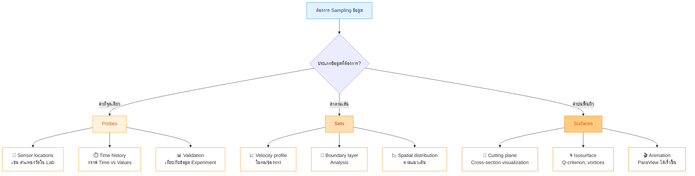
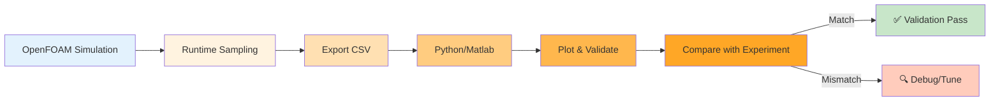
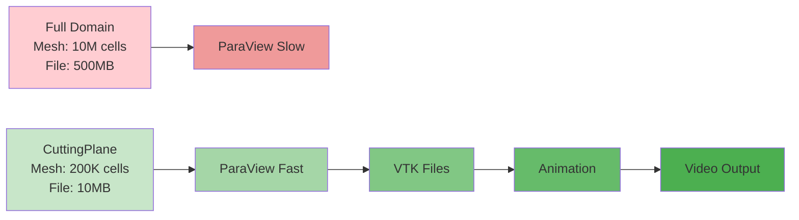
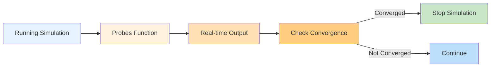

# การสุ่มเก็บข้อมูล (Sampling and Probes)

> [!TIP] ทำไม Sampling สำคัญใน OpenFOAM?
> Sampling เป็นเทคนิคการเก็บข้อมูลแบบ **Runtime Post-Processing** ที่ช่วยให้คุณ:
> 1. **ลดขนาดไฟล์**: เก็บเฉพาะพื้นที่สนใจแทน Save ทั้ง Domain (บางครั้งลดได้ 99%!)
> 2. **ตรวจสอบแบบเรียลไทม์**: ดู Time history ที่จุดวัดโดยไม่ต้องรอ Simulation จบ
> 3. **เปรียบเทียบกับ Experiment**: Export เป็น CSV เพื่อ Validation กับข้อมูล Lab ได้ทันที
>
> **📍 อยู่ใน:** `system/controlDict` → ส่วน `functions`
> **🔧 หมวดหมู่:** Simulation Control (Runtime Post-Processing)

---

## 🎯 Learning Objectives

หลังจากอ่านบทนี้ คุณควรจะสามารถ:

1. **เข้าใจความแตกต่าง** ระหว่างสามวิธีหลักในการ Sampling: Probes, Sets, และ Surfaces
2. **เลือกใช้วิธีที่เหมาะสม** สำหรับปัญหาที่ต้องการแก้ไข (Point vs Line vs Surface)
3. **เขียน Configuration** ใน `system/controlDict` สำหรับแต่ละวิธี Sampling
4. **ตีความ Output** และนำไปใช้กับ Workflow ต่างๆ (Validation, Visualization, Monitoring)
5. **เปรียบเทียบข้อดีข้อเสีย** ของแต่ละวิธีเพื่อการใช้งานที่เหมาะสม

บางครั้งเราไม่ได้ต้องการค่า Force รวม แต่ต้องการรู้ค่า $U, P, T$ ณ **จุดใดจุดหนึ่ง** หรือ **เส้นใดเส้นหนึ่ง** เพื่อนำไปเทียบกับผลการทดลอง (Experiment Validation)

> **ลิงก์ที่เกี่ยวข้อง**:
> - ดู Introduction to Function Objects → [01_Introduction_to_FunctionObjects.md](./01_Introduction_to_FunctionObjects.md)
> - ดู Forces and Coefficients → [02_Forces_and_Coefficients.md](./02_Forces_and_Coefficients.md)

---

## 📊 Sampling Methods Overview

| วิธีการ | ประเภทข้อมูล | รูปแบบ Output | กรณีใช้งานหลัก | Interpolation |
|---------|-------------|---------------|-------------------|--------------|
| **Probes** | จุดวัด (Points) | `.csv`, `.dat` | Sensor locations, Time history | ❌ ไม่มี (Default) |
| **Sets** | เส้น (Lines) | `.csv`, `.raw`, `.xmgr` | Velocity profiles, Boundary layer | ✅ `cellPoint` |
| **Surfaces** | พื้นผิว (Surfaces) | `.vtk`, `.stl`, `.obj` | Cross-sections, Isosurfaces | ✅ ใช่ |



---

## 1. Probes (จุดตรวจสอบ)

> [!NOTE] **📂 OpenFOAM Context**
> **📍 อยู่ใน:** `system/controlDict` → ส่วน `functions`
> **🔑 คีย์เวิร์ดหลัก:**
> - `type probes;` - ประเภท Function Object
> - `libs ("libsampling.so");` - Library ที่ต้องโหลด
> - `fields (p U T);` - ฟิลด์ที่ต้องการเก็บ
> - `probeLocations` - พิกัดจุดวัด (x y z)
> - `writeControl` / `writeInterval` - ควบคุมความถี่ในการเขียนผล
>
> **💡 ใช้เมื่อ:** ต้องการดู Time history ของค่าตัวแปร ณ จุดเฉพาะ (เช่น ตำแหน่ง Sensor ในการทดลอง)

ใช้ดึงค่าตัวแปร ณ พิกัดที่ระบุ (เหมือนเอา Sensor ไปจิ้มวัด)

### 1.1 ตัวอย่าง Configuration

```cpp
functions
{
    probes1
    {
        type            probes;
        libs            ("libsampling.so");
        writeControl    timeStep;
        writeInterval   1;

        fields          (p U T); // ตัวแปรที่ต้องการ

        probeLocations
        (
            (0 0 0)     // Point 1: กึ่งกลาง
            (1 0.5 0)   // Point 2: ห่างจาก inlet
            (2 1 0.5)   // Point 3: ใกล้ outlet
        );
    }
}
```

### 1.2 Output และการตีความ

- **Output Location:** `postProcessing/probes1/<time>/`
- **File Format:** Text file (Space-separated values)
- **Structure:** คอลัมน์แรกคือ Time คอลัมน์ถัดไปคือค่าของแต่ละจุด

```
# Probe 1 (0 0 0)
Time         p           U_x         U_y         U_z         T
0.001        101325      1.2         0.0         0.0         300
0.002        101320      1.3         0.1         0.0         301
...
```

### 1.3 ข้อควรระวัง

> [!WARNING] ⚠️ **ข้อควรระวัง: Probes ไม่มี Interpolation**
> - ถ้าจุดที่ระบุไม่ตรงกับ Cell Center เป๊ะๆ โปรแกรมจะหา Cell ที่จุดนั้นตกอยู่ (Owner Cell) แล้วเอาค่ามาตอบ
> - **ไม่มีการ Interpolate** ใน Probes ปกติ (เว้นแต่ระบุ `interpolationScheme`)
> - สำหรับ Mesh ที่หยาบ อาจเกิด **Jump** ในกราฟได้

---

## 2. Sets (การเก็บข้อมูลตามเส้น)

> [!NOTE] **📂 OpenFOAM Context**
> **📍 อยู่ใน:** `system/controlDict` → ส่วน `functions`
> **🔑 คีย์เวิร์ดหลัก:**
> - `type sets;` - ประเภท Function Object
> - `libs ("libsampling.so");` - Library ที่ต้องโหลด
> - `interpolationScheme cellPoint;` - วิธี Interpolation (cellPoint, cell, pointMVC)
> - `setFormat csv;` - รูปแบบไฟล์ (csv, xmgr, gnuplot, raw)
> - `sets` - กำหนดเส้นที่จะสุ่ม (uniform, cloud, face)
> - `axis distance;` - แกน X ของกราฟเป็นระยะทาง
>
> **💡 ใช้เมื่อ:** ต้องการดู Profile ตามแนวเส้น (เช่น Velocity Profile ในท่อ, Boundary Layer Profile)

ใช้สำหรับวาดกราฟ Profile (เช่น Velocity Profile ในท่อ)

### 2.1 ตัวอย่าง Configuration

```cpp
functions
{
    lineSampling
    {
        type            sets;
        libs            ("libsampling.so");
        writeControl    writeTime; // ทำเฉพาะตอน write interval ก็พอ

        interpolationScheme cellPoint; // วิธีเกลี่ยค่า (cellPoint, cell, pointMVC)
        setFormat       csv;           // รูปแบบไฟล์ (csv, xmgr, gnuplot, raw)

        sets
        (
            midLine
            {
                type    uniform;  // แบ่งจุดเท่าๆ กัน
                axis    distance; // แกน X ของกราฟคือระยะทาง
                start   (0 0 0);
                end     (0 1 0);
                nPoints 100;      // จำนวนจุด
            }

            cloudPoints
            {
                type    cloud;    // ระบุจุดอิสระ
                points  ((0 0 0) (0.1 0 0) (0.2 0 0));
            }
        );

        fields          (U p k epsilon);
    }
}
```

### 2.2 Interpolation Schemes

| Scheme | คำอธิบาย | ความเรียบ | ความแม่นยำ |
|--------|----------|-----------|------------|
| `cell` | ใช้ค่า Cell Center โดยตรง | ต่ำ (Staircase) | ต่ำ |
| `cellPoint` | Interpolate จาก Cell ไปยัง Point กลับ | ปานกลาง | ปานกลาง |
| `pointMVC` | Mean Value Coordinates | สูง | สูง |

> [!TIP] 💡 **คำแนะนำ:** ใช้ `cellPoint` สำหรับส่วนใหญ่ ให้ผลเรียบพอสมควรและเร็ว

### 2.3 Set Types

| Type | คำอธิบาย | ตัวอย่างการใช้ |
|------|----------|----------------|
| `uniform` | แบ่งจุดเท่าๆ กันตามเส้น | Velocity profile ในท่อ |
| `cloud` | ระบุจุดอิสระหลายจุด | Sampling บนพื้นผิวที่ไม่สม่ำเสมอ |
| `face` | ตาม Face บน Mesh | Sampling ตาม Boundary |

---

## 3. Surfaces (การเก็บข้อมูลตามพื้นผิว)

> [!NOTE] **📂 OpenFOAM Context**
> **📍 อยู่ใน:** `system/controlDict` → ส่วน `functions`
> **🔑 คีย์เวิร์ดหลัก:**
> - `type surfaces;` - ประเภท Function Object
> - `libs ("libsampling.so");` - Library ที่ต้องโหลด
> - `surfaceFormat vtk;` - รูปแบบไฟล์ (vtk, stl, obj, dx)
> - `surfaces` - กำหนดพื้นผิวที่จะสุ่ม
> - `type cuttingPlane;` - ตัดแบบระนาบ (Cross-section)
> - `type isoSurface;` - ตัดแบบ Isosurface (เช่น Q-criterion)
> - `interpolate true;` - เปิดการ Interpolation ให้ผิวเรียบ
>
> **💡 ใช้เมื่อ:** ต้องการ Visualize ผลลัพธ์บนพื้นผิวบางส่วน (Slice หรือ Isosurface) แทนการโหลดทั้ง Domain

ใช้สำหรับตัด Slice (Cross-section) หรือสกัดผิว Isosurface เพื่อ Save เป็นไฟล์ VTK แยกออกมา (ไฟล์เล็กกว่า Save ทั้งโดเมนมาก)

### 3.1 ตัวอย่าง Configuration

```cpp
functions
{
    cuttingPlane
    {
        type            surfaces;
        libs            ("libsampling.so");
        writeControl    writeTime;
        surfaceFormat   vtk;

        fields          (U p);

        surfaces
        (
            zNormal
            {
                type        cuttingPlane;
                planeType   pointAndNormal;
                pointAndNormalDict
                {
                    point   (0 0 0.5); // ตัดที่ z=0.5
                    normal  (0 0 1);   // ระนาบตั้งฉากแกน Z
                }
                interpolate true;
            }

            isoQ
            {
                type        isoSurface;
                isoField    Q;         // Isosurface ของค่า Q
                isoValue    100;
                interpolate true;
            }
        );
    }
}
```

### 3.2 Surface Types

| Type | คำอธิบาย | ตัวอย่างการใช้ |
|------|----------|----------------|
| `cuttingPlane` | ตัดด้วยระนาบ | Cross-section ในแนวต่างๆ |
| `isoSurface` | Isosurface ของฟิลด์ | Q-criterion, Pressure surface |
| `plane` | ระนาบที่ระบุ | Sampling บนพื้นผิวเฉพาะ |

### 3.3 Surface Formats

| Format | นามสกุล | ความสามารถ | โปรแกรมที่เปิดได้ |
|--------|---------|-------------|-------------------|
| `vtk` | `.vtk` | Vector/Scalar ได้ | ParaView |
| `stl` | `.stl` | เฉพาะ Geometry | ParaView, Blender |
| `obj` | `.obj` | เฉพาะ Geometry | ParaView, Blender |
| `dx` | `.dx` | Scalar ได้ | ParaView |

---

## 4. Practical Workflows

### 4.1 Validation Workflow



### 4.2 Animation Workflow



### 4.3 Monitoring Workflow



---

## 5. ประโยชน์ของการ Sampling

> [!NOTE] **📂 OpenFOAM Context**
> **📍 อยู่ใน:** `system/controlDict` → ส่วน `functions`
> **🔑 คีย์เวิร์ดหลัก:**
> - `writeControl timeStep;` / `writeControl writeTime;` - ควบคุมเวลาเขียน
> - `writeInterval 1;` - ความถี่ในการเขียน
> - `setFormat csv;` / `surfaceFormat vtk;` - รูปแบบไฟล์ Output
> - Output ไฟล์อยู่ที่ `postProcessing/` directory
>
> **💡 เชื่อมโยงกับ Workflow:**
> - **Validation:** Export → Excel/Python → เทียบกับข้อมูล Lab
> - **Visualization:** ParaView → Animation → ลดเวลาโหลดไฟล์
> - **Monitoring:** ดูแนวโน้มแบบ Real-time ระหว่าง Simulation

### 5.1 การใช้งานจริง

1. **Validation:** Export เป็น CSV แล้วเอาไป plot เทียบกับผล Lab ใน Excel/Python ได้เลย
2. **Animation:** Save พื้นผิว `cuttingPlane` เป็น VTK ถี่ๆ แล้วเอาไปทำวิดีโอใน ParaView ได้เร็วกว่าโหลด Mesh เต็มๆ 100 เท่า!
3. **Monitoring:** ใช้ `probes` ดูค่าที่จุดสำคัญระหว่าง Simulation แบบ Real-time เพื่อดู Convergence

### 5.2 เปรียบเทียบ Output Size

| วิธี | ขนาดไฟล์ต่อ Time Step | ความถี่ในการเขียน | การใช้งาน |
|------|----------------------|-------------------|-------------|
| **Full Domain** | ~500 MB - 5 GB | เฉพาะ Write time | Post-processing ภายหลัง |
| **Surfaces (VTK)** | ~5 - 50 MB | ทุก Write time | Animation, Visualization |
| **Sets (CSV)** | ~10 - 100 KB | ทุก Write time | Validation, Profiling |
| **Probes (CSV)** | ~1 - 10 KB | ทุก Time step | Real-time monitoring |

> [!TIP] 💡 **เคล็ดลับ:** การเลือกวิธี Sampling ที่เหมาะสมสามารถลดเวลา Post-processing ได้ถึง 90%!

---

## 6. Troubleshooting

> [!WARNING] ⚠️ **ปัญหาที่พบบ่อย**

### 6.1 Probes ไม่พบข้อมูล

**อาการ:** Output file ว่างเป็น หรือไม่มีค่า

**สาเหตุ:**
- จุดที่ระบุอยู่นอก Computational Domain
- Mesh ยังไม่ถูกต้องหรือมี Holes

**วิธีแก้:**
```cpp
// 1. ตรวจสอบพิกัด
probeLocations
(
    (0 0 0)  // ตรวจสอบว่าอยู่ใน Domain จริงไหม
)

// 2. ใช้ samplingDict เพื่อ Debug
debugSampler 1;  // เปิด Debug mode
```

### 6.2 Sets Output เป็นค่าคงที่

**อาการ:** ค่าทุกจุดเหมือนกันหมด

**สาเหตุ:**
- ไม่ได้เปิด Interpolation
- เส้นที่วาดอยู่ใน Cell เดียว

**วิธีแก้:**
```cpp
// เปิด Interpolation
interpolationScheme cellPoint;  // เปลี่ยนจาก cell
```

### 6.3 Surfaces ไฟล์ใหญ่เกินไป

**อาการ:** VTK files ยังใหญ่อยู่

**สาเหตุ:**
- เก็บทุก Time step
- Resolution สูงเกินไป

**วิธีแก้:**
```cpp
// 1. เก็บเฉพาะ Write time
writeControl writeTime;  // เปลี่ยนจาก timeStep

// 2. ลด Sampling zones
surfaces
(
    zNormal1  // เก็บบาง plane เท่านั้น
    {
        type cuttingPlane;
        ...
    }
    // ลบ plane อื่นๆ ที่ไม่จำเป็น
)
```

### 6.4 Performance Impact

**อาการ:** Simulation ช้าลงมาก

**สาเหตุ:**
- Sampling ถี่เกินไป
- Interpolation Scheme ซับซ้อน

**วิธีแก้:**
```cpp
// 1. ลดความถี่
writeControl    writeTime;  // เปลี่ยนจาก timeStep
writeInterval   5;          // เพิ่ม interval

// 2. ใช้ Interpolation ง่ายๆ
interpolationScheme cell;  // เร็วกว่า cellPoint
```

---

## 📋 Key Takeaways

### สรุปสิ่งสำคัญ

1. **🎯 เลือกวิธีที่เหมาะสมกับปัญหา**
   - **Probes**: สำหรับ Point locations และ Time history
   - **Sets**: สำหรับ Line profiles และ Spatial distributions
   - **Surfaces**: สำหรับ Visualization และ Animation

2. **💾 Sampling ลดเวลา Post-processing ได้มาก**
   - Full domain: 500 MB - 5 GB per step
   - Surfaces: 5 - 50 MB per step
   - Sets/Probes: 1 - 100 KB per step
   - **ลดได้ถึง 99%!**

3. **⚙️ Configuration อยู่ใน `system/controlDict`**
   - อยู่ในส่วน `functions`
   - ใช้ Library `libsampling.so`
   - Output ไปที่ `postProcessing/`

4. **🔍 Interpolation สำคัญสำหรับความเรียบ**
   - Probes: ไม่มี interpolation (default)
   - Sets: ใช้ `cellPoint` สำหรับผลที่เรียบ
   - Surfaces: ใช้ `interpolate true` เสมอ

5. **📊 Output Formats ต่างกันตามวัตถุประสงค์**
   - CSV: สำหรับ Validation และ Plotting
   - VTK: สำหรับ Visualization ใน ParaView
   - Raw: สำหรับ Custom post-processing

### เชื่อมโยงกับหัวข้ออื่น

- **Function Objects** → [01_Introduction_to_FunctionObjects.md](./01_Introduction_to_FunctionObjects.md)
- **Forces** → [02_Forces_and_Coefficients.md](./02_Forces_and_Coefficients.md)
- **Boundary Conditions** → [../../MODULE_01_CFD_FUNDAMENTALS/CONTENT/03_BOUNDARY_CONDITIONS/00_Overview.md](../../MODULE_01_CFD_FUNDAMENTALS/CONTENT/03_BOUNDARY_CONDITIONS/00_Overview.md)

---

## 🧠 Concept Check: ทดสอบความเข้าใจ

### แบบฝึกหัดระดับง่าย (Easy)

1. **True/False**: `probes` ใช้ Interpolation โดย Default
   <details>
   <summary>📝 คำตอบ</summary>

   ❌ **เท็จ** - probes ใช้ค่าจาก Owner cell โดยตรง ไม่มีการ Interpolate (เว้นแต่ระบุ `interpolationScheme`)

   **คำอธิบายเพิ่มเติม:**
   - ค่าที่ได้คือค่าจาก Cell ที่จุดนั้นตกอยู่
   - อาจเกิด Jump ในกราฟถ้า Mesh หยาบ
   - ต้องระบุ `interpolationScheme` ถ้าต้องการค่าที่เรียบ
   </details>

2. **เลือกตอบ**: Function object ไหนที่เหมาะสำหรับสร้าง Velocity Profile ในท่อ?
   - a) probes
   - b) sets
   - c) surfaces
   - d) forces

   <details>
   <summary>📝 คำตอบ</summary>

   ✅ **b) sets**

   **คำอธิบายเพิ่มเติม:**
   - `sets` ใช้สำหรับเก็บข้อมูลตามเส้น (Line sampling)
   - สามารถสร้าง Profile ตามแนวเส้นได้
   - มี Interpolation ทำให้กราฟเรียบ
   - Output เป็น CSV สามารถ Plot ได้ทันที
   </details>

### แบบฝึกหัดระดับปานกลาง (Medium)

3. **อธิบาย**: แตกต่างระหว่าง `probes` และ `sets` คืออะไร?

   <details>
   <summary>📝 คำตอบ</summary>

   | คุณสมบัติ | Probes | Sets |
   |-----------|--------|------|
   | **ประเภทข้อมูล** | จุดวัด (Points) | เส้น (Lines) |
   | **การใช้งาน** | Time history ณ จุดเฉพาะ | Spatial profile ตามเส้น |
   | **Interpolation** | ไม่มี (default) | มี (cellPoint) |
   | **Output** | Time vs Values | Distance vs Values |
   | **ตัวอย่าง** | Sensor locations | Velocity profile ในท่อ |
   </details>

4. **สร้าง**: จงเขียน `sets` function block สำหรับสร้าง line จาก (0,0,0) ถึง (0,1,0) แบ่ง 50 จุด

   <details>
   <summary>📝 คำตอบ</summary>

   ```cpp
   functions
   {
       lineSampling
       {
           type            sets;
           libs            ("libsampling.so");
           writeControl    writeTime;

           interpolationScheme cellPoint;
           setFormat       csv;

           sets
           (
               midLine
               {
                   type    uniform;
                   axis    distance;
                   start   (0 0 0);
                   end     (0 1 0);
                   nPoints 50;
               }
           );

           fields (U p);
       }
   }
   ```

   **คำอธิบายเพิ่มเติม:**
   - `type uniform`: แบ่งจุดเท่าๆ กันตามเส้น
   - `axis distance`: แกน X คือระยะทางจากจุดเริ่มต้น
   - `nPoints 50`: แบ่งเป็น 50 จุด
   - `interpolationScheme cellPoint`: ให้ค่าที่เรียบ
   </details>

### แบบฝึกหัดระดับสูง (Hard)

5. **Hands-on**: สร้าง `surfaces` function ด้วย `cuttingPlane` และ `isoSurface` แล้วเปิดใน ParaView

   <details>
   <summary>📝 คำตอบและขั้นตอน</summary>

   **Step 1: เขียน Configuration**

   ```cpp
   functions
   {
       flowVisualization
       {
           type            surfaces;
           libs            ("libsampling.so");
           writeControl    writeTime;
           surfaceFormat   vtk;

           fields          (U p Q);  // Q สำหรับ Q-criterion

           surfaces
           {
               // Cutting Plane ตัดแนวตั้ง
               verticalPlane
               {
                   type        cuttingPlane;
                   planeType   pointAndNormal;
                   pointAndNormalDict
                   {
                       point   (0.5 0.5 0);
                       normal  (1 0 0);  // ตั้งฉากกับแกน X
                   }
                   interpolate true;
               }

               // Cutting Plane ตัดแนวนอน
               horizontalPlane
               {
                   type        cuttingPlane;
                   planeType   pointAndNormal;
                   pointAndNormalDict
                   {
                       point   (0 0 0.5);
                       normal  (0 0 1);  // ตั้งฉากกับแกน Z
                   }
                   interpolate true;
               }

               // Isosurface สำหรับ Q-criterion
               qCriterion
               {
                   type        isoSurface;
                   isoField    Q;
                   isoValue    100;  // ปรับค่านี้ตามกรณีศึกษา
                   interpolate true;
               }
           };
       }
   }
   ```

   **Step 2: Run Simulation**

   ```bash
   # Run ตามปกติ
   simpleFoam

   # หรือ
   pimpleFoam
   ```

   **Step 3: เปิดใน ParaView**

   ```bash
   # เปิด ParaView
   paraFoam -builtin

   # หรือเปิด VTK files โดยตรง
   paraView postProcessing/flowVisualization/*//*.vtk
   ```

   **Step 4: Visualization Tips**

   - **Cutting Planes**: ใช้ `Slice` filter หรือเปิด VTK files โดยตรง
   - **Isosurface**: ใช้ `Contour` filter หรือเปิด VTK files โดยตรง
   - **Animation**: ใช้ `Animation` view เพื่อดู Time evolution

   **Step 5: Troubleshooting**

   ```cpp
   // ถ้า Isosurface ไม่ปรากฏ
   isoValue    50;   // ลดค่า isoValue

   // ถ้า Surfaces ไม่สวย
   interpolate true;  // ตรวจสอบว่าเปิด interpolation

   // ถ้า Performance ช้า
   writeControl writeTime;  // เปลี่ยนจาก timeStep
   ```
   </details>

---

## 📖 เอกสารที่เกี่ยวข้อง

*   **บทก่อนหน้า**: [02_Forces_and_Coefficients.md](./02_Forces_and_Coefficients.md)
*   **บทถัดไป**: [../00_Overview.md](../00_Overview.md)
*   **Module ที่เกี่ยวข้อง**:
    - [Module 1: CFD Fundamentals](../../MODULE_01_CFD_FUNDAMENTALS/CONTENT/00_Overview.md)
    - [Module 3: Turbulence Modeling](../../MODULE_03_TURBULENCE_MODELING/CONTENT/00_Overview.md)