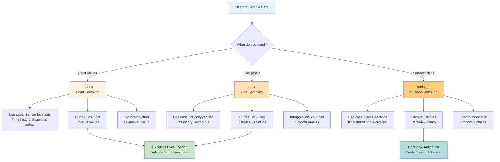

# การสุ่มเก็บข้อมูล (Sampling and Probes)

> [!TIP] ทำไม Sampling สำคัญใน OpenFOAM?
> Sampling เป็นเทคนิคการเก็บข้อมูลแบบ **Runtime Post-Processing** ที่ช่วยให้คุณ:
> 1. **ลดขนาดไฟล์**: เก็บเฉพาะพื้นที่สนใจแทน Save ทั้ง Domain (บางครั้งลดได้ 99%!)
> 2. **ตรวจสอบแบบเรียลไทม์**: ดู Time history ที่จุดวัดโดยไม่ต้องรอ Simulation จบ
> 3. **เปรียบเทียบกับ Experiment**: Export เป็น CSV เพื่อ Validation กับข้อมูล Lab ได้ทันที
>
> **📍 อยู่ใน:** `system/controlDict` → ส่วน `functions`
> **🔧 หมวดหมู่:** Simulation Control (Runtime Post-Processing)

บางครั้งเราไม่ได้ต้องการค่า Force รวม แต่ต้องการรู้ค่า $U, P, T$ ณ **จุดใดจุดหนึ่ง** หรือ **เส้นใดเส้นหนึ่ง** เพื่อนำไปเทียบกับผลการทดลอง (Experiment Validation)

> **ลิงก์ที่เกี่ยวข้อง**:
> - ดู Introduction to Function Objects → [01_Introduction_to_FunctionObjects.md](./01_Introduction_to_FunctionObjects.md)
> - ดู Forces and Coefficients → [02_Forces_and_Coefficients.md](./02_Forces_and_Coefficients.md)

## 1. Probes (จุดตรวจสอบ)

> [!NOTE] **📂 OpenFOAM Context**
> **📍 อยู่ใน:** `system/controlDict` → ส่วน `functions`
> **🔑 คีย์เวิร์ดหลัก:**
> - `type probes;` - ประเภท Function Object
> - `libs ("libsampling.so");` - Library ที่ต้องโหลด
> - `fields (p U T);` - ฟิลด์ที่ต้องการเก็บ
> - `probeLocations` - พิกัดจุดวัด (x y z)
> - `writeControl` / `writeInterval` - ควบคุมความถี่ในการเขียนผล
>
> **💡 ใช้เมื่อ:** ต้องการดู Time history ของค่าตัวแปร ณ จุดเฉพาะ (เช่น ตำแหน่ง Sensor ในการทดลอง)

ใช้ดึงค่าตัวแปร ณ พิกัดที่ระบุ (เหมือนเอา Sensor ไปจิ้มวัด)

```cpp
functions
{
    probes1
    {
        type            probes;
        libs            ("libsampling.so");
        writeControl    timeStep;
        writeInterval   1;
        
        fields          (p U T); // ตัวแปรที่ต้องการ
        
        probeLocations
        (
            (0 0 0)     // Point 1
            (1 0.5 0)   // Point 2
            (2 1 0.5)   // Point 3
        );
    }
}
```
*   **Output:** ไฟล์ Text ตาราง (Time vs Values)
*   **Note:** ถ้าจุดที่ระบุไม่ตรงกับ Cell Center เป๊ะๆ โปรแกรมจะหา Cell ที่จุดนั้นตกอยู่ (Owner Cell) แล้วเอาค่ามาตอบ (ไม่มีการ Interpolate ใน Probes ปกติ เว้นแต่จะใช้ interpolation mode)

## 2. Sets (การเก็บข้อมูลตามเส้น)

> [!NOTE] **📂 OpenFOAM Context**
> **📍 อยู่ใน:** `system/controlDict` → ส่วน `functions`
> **🔑 คีย์เวิร์ดหลัก:**
> - `type sets;` - ประเภท Function Object
> - `libs ("libsampling.so");` - Library ที่ต้องโหลด
> - `interpolationScheme cellPoint;` - วิธี Interpolation (cellPoint, cell, pointMVC)
> - `setFormat csv;` - รูปแบบไฟล์ (csv, xmgr, gnuplot, raw)
> - `sets` - กำหนดเส้นที่จะสุ่ม (uniform, cloud, face)
> - `axis distance;` - แกน X ของกราฟเป็นระยะทาง
>
> **💡 ใช้เมื่อ:** ต้องการดู Profile ตามแนวเส้น (เช่น Velocity Profile ในท่อ, Boundary Layer Profile)

ใช้สำหรับวาดกราฟ Profile (เช่น Velocity Profile ในท่อ)

```cpp
functions
{
    lineSampling
    {
        type            sets;
        libs            ("libsampling.so");
        writeControl    writeTime; // ทำเฉพาะตอน write interval ก็พอ (ไม่ต้องทุก step)
        
        interpolationScheme cellPoint; // วิธีเกลี่ยค่า (cellPoint, cell, pointMVC)
        setFormat       csv;           // รูปแบบไฟล์ (csv, xmgr, gnuplot, raw)
        
        sets
        (
            midLine
            {
                type    uniform;  // แบ่งจุดเท่าๆ กัน
                axis    distance; // แกน X ของกราฟคือระยะทาง
                start   (0 0 0);
                end     (0 1 0);
                nPoints 100;      // จำนวนจุด
            }
            
            cloudPoints
            {
                type    cloud;    // ระบุจุดอิสระ
                points  ((0 0 0) (0.1 0 0) ...);
            }
        );
        
        fields          (U p k epsilon);
    }
}
```

## 3. Surfaces (การเก็บข้อมูลตามพื้นผิว)

> [!NOTE] **📂 OpenFOAM Context**
> **📍 อยู่ใน:** `system/controlDict` → ส่วน `functions`
> **🔑 คีย์เวิร์ดหลัก:**
> - `type surfaces;` - ประเภท Function Object
> - `libs ("libsampling.so");` - Library ที่ต้องโหลด
> - `surfaceFormat vtk;` - รูปแบบไฟล์ (vtk, stl, obj, dx)
> - `surfaces` - กำหนดพื้นผิวที่จะสุ่ม
> - `type cuttingPlane;` - ตัดแบบระนาบ (Cross-section)
> - `type isoSurface;` - ตัดแบบ Isosurface (เช่น Q-criterion)
> - `interpolate true;` - เปิดการ Interpolation ให้ผิวเรียบ
>
> **💡 ใช้เมื่อ:** ต้องการ Visualize ผลลัพธ์บนพื้นผิวบางส่วน (Slice หรือ Isosurface) แทนการโหลดทั้ง Domain

ใช้สำหรับตัด Slice (Cross-section) หรือสกัดผิว Isosurface เพื่อ Save เป็นไฟล์ VTK แยกออกมา (ไฟล์เล็กกว่า Save ทั้งโดเมนมาก)

```cpp
functions
{
    cuttingPlane
    {
        type            surfaces;
        libs            ("libsampling.so");
        writeControl    writeTime;
        surfaceFormat   vtk;
        
        fields          (U p);
        
        surfaces
        (
            zNormal
            {
                type        cuttingPlane;
                planeType   pointAndNormal;
                pointAndNormalDict
                {
                    point   (0 0 0.5); // ตัดที่ z=0.5
                    normal  (0 0 1);   // ระนาบตั้งฉากแกน Z
                }
                interpolate true;
            }
            
            isoQ
            {
                type        isoSurface;
                isoField    Q;         // Isosurface ของค่า Q
                isoValue    100;
                interpolate true;
            }
        );
    }
}
```

## 4. ประโยชน์ของการ Sampling

> [!NOTE] **📂 OpenFOAM Context**
> **📍 อยู่ใน:** `system/controlDict` → ส่วน `functions`
> **🔑 คีย์เวิร์ดหลัก:**
> - `writeControl timeStep;` / `writeControl writeTime;` - ควบคุมเวลาเขียน
> - `writeInterval 1;` - ความถี่ในการเขียน
> - `setFormat csv;` / `surfaceFormat vtk;` - รูปแบบไฟล์ Output
> - Output ไฟล์อยู่ที่ `postProcessing/` directory
>
> **💡 เชื่อมโยงกับ Workflow:**
> - **Validation:** Export → Excel/Python → เทียบกับข้อมูล Lab
> - **Visualization:** ParaView → Animation → ลดเวลาโหลดไฟล์
> - **Monitoring:** ดูแนวโน้มแบบ Real-time ระหว่าง Simulation

1.  **Validation:** Export เป็น CSV แล้วเอาไป plot เทียบกับผล Lab ใน Excel/Python ได้เลย
2.  **Animation:** Save พื้นผิว `cuttingPlane` เป็น VTK ถี่ๆ แล้วเอาไปทำวิดีโอใน ParaView ได้เร็วกว่าโหลด Mesh เต็มๆ 100 เท่า!

**Sampling Methods Comparison:**


---

## 🧠 Concept Check: ทดสอบความเข้าใจ

### แบบฝึกหัดระดับง่าย (Easy)
1. **True/False**: `probes` ใช้ Interpolation โดย Default
   <details>
   <summary>คำตอบ</summary>
   ❌ เท็จ - probes ใช้ค่าจาก Owner cell ไม่มีการ Interpolate (เว้นแต่ระบุ interpolationScheme)
   </details>

2. **เลือกตอบ**: Function object ไหนที่เหมาะสำหรับสร้าง Velocity Profile ในท่อ?
   - a) probes
   - b) sets
   - c) surfaces
   - d) forces
   <details>
   <summary>คำตอบ</summary>
   ✅ b) sets - ใช้สำหรับเก็บข้อมูลตามเส้น (Line sampling)
   </details>

### แบบฝึกหัดระดับปานกลาง (Medium)
3. **อธิบาย**: แตกต่างระหว่าง `probes` และ `sets` คืออะไร?
   <details>
   <summary>คำตอบ</summary>
   - probes: เก็บค่าที่จุดเดียว (Point) ดู Time history
   - sets: เก็บค่าตามเส้น (Line) ดู Spatial profile
   </details>

4. **สร้าง**: จงเขียน `sets` function block สำหรับสร้าง line จาก (0,0,0) ถึง (0,1,0) แบ่ง 50 จุด
   <details>
   <summary>คำตอบ</summary>
   ```cpp
   lineSampling
   {
       type            sets;
       libs            ("libsampling.so");
       interpolationScheme cellPoint;
       setFormat       csv;

       sets
       (
           midLine
           {
               type    uniform;
               axis    distance;
               start   (0 0 0);
               end     (0 1 0);
               nPoints 50;
           }
       );

       fields (U p);
   }
   ```
   </details>

### แบบฝึกหัดระดับสูง (Hard)
5. **Hands-on**: สร้าง `surfaces` function ด้วย `cuttingPlane` และ `isoSurface` แล้วเปิดใน ParaView


---

## 📖 เอกสารที่เกี่ยวข้อง

*   **บทก่อนหน้า**: [02_Forces_and_Coefficients.md](02_Forces_and_Coefficients.md)
*   **บทถัดไป**: [../00_Overview.md](../00_Overview.md)