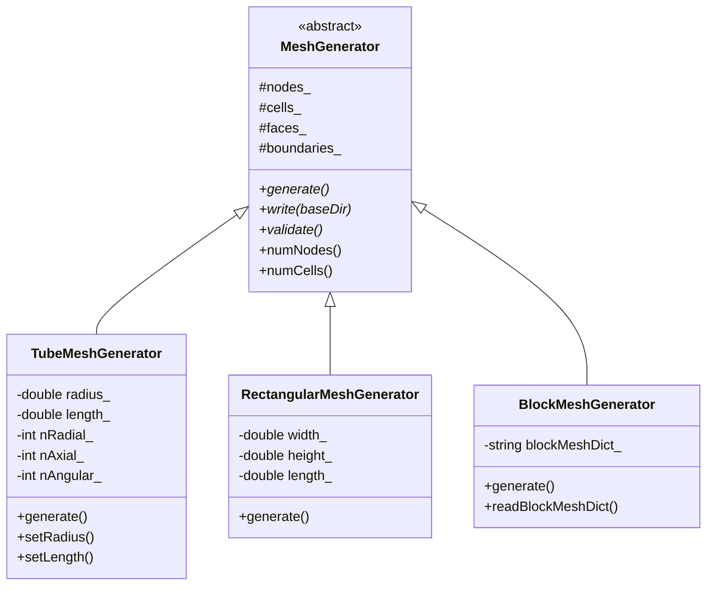

# Custom Tube Mesh Generator (ตัวสร้าง Mesh ท่อแบบกำหนดเอง)

> **[!INFO]** 📚 Learning Objective
> ออกแบบและ implement คลาสสำหรับสร้าง mesh สำหรับท่อ (tube) โดยใช้หลักการ OOP และ modern C++ สำหรับ R410A evaporator simulation

---

## 📋 Table of Contents (สารบัญ)

1. [Mesh Generator Requirements](#mesh-generator-requirements)
2. [Base Class Design](#base-class-design)
3. [Tube Mesh Generator Implementation](#tube-mesh-generator-implementation)
4. [OpenFOAM Integration](#openfoam-integration)
5. [R410A Evaporator Mesh Example](#r410a-evaporator-mesh-example)

---

## Mesh Generator Requirements

### Why Custom Mesh Generator?

**⭐ Standard meshing tools (blockMesh, snappyHexMesh):**
- Generic purpose: not optimized for specific geometry
- Complex setup: require many parameters
- Limited control: hard to automate

**⭐ Custom mesh generator:**
- Purpose-built: optimized for tubes
- Simple API: just specify geometry parameters
- Full control: implement exact requirements
- Automation-ready: easy to integrate in workflow

### Requirements for Tube Mesh

**⭐ Geometric requirements:**
1. **Cylindrical geometry:** Circular cross-section
2. **Length parameter:** Adjustable tube length
3. **Radial grading:** Fine mesh near wall for boundary layer
4. **Axial resolution:** Control axial cell size
5. **Boundary identification:** Inlet, outlet, wall patches

**⭐ Quality requirements:**
1. **Orthogonality:** Near-orthogonal cells
2. **Aspect ratio:** Bounded (< 100 for boundary layer)
3. **Smoothness:** Gradual size changes
4. **Validity:** Positive volumes, non-degenerate

**⭐ OpenFOAM requirements:**
1. **polyMesh format:** Compatible with OpenFOAM
2. **Boundary patches:** Named for BCs
3. **Cell zones:** For region-specific operations
4. **Parallel support:** Decomposable for MPI

---

## Base Class Design

### Abstract Base Class

**⭐ Design principle:** Program to interface, not implementation

```cpp
// Base class for all mesh generators
class MeshGenerator {
public:
    virtual ~MeshGenerator() = default;

    // Pure virtual: must be implemented by derived classes
    virtual void generate() = 0;

    // Virtual: can be overridden
    virtual void write(const std::string& baseDir) const;
    virtual void validate() const;

    // Concrete: common to all generators
    size_t numNodes() const { return nodes_.size(); }
    size_t numCells() const { return cells_.size(); }
    size_t numFaces() const { return faces_.size(); }

    // Accessors
    const std::vector<Node>& getNodes() const { return nodes_; }
    const std::vector<Cell>& getCells() const { return cells_; }
    const std::vector<Face>& getFaces() const { return faces_; }
    const std::vector<BoundaryPatch>& getBoundaries() const { return boundaries_; }

protected:
    // Data structures
    struct Node {
        double x, y, z;
        size_t id;

        Node(size_t id_, double x_, double y_, double z_)
            : id(id_), x(x_), y(y_), z(z_) {}
    };

    struct Face {
        std::vector<size_t> nodeIds;
        size_t owner;
        size_t neighbour;
        size_t id;

        Face(size_t id_, std::vector<size_t> nodes)
            : id(id_), nodeIds(std::move(nodes)) {}
    };

    struct Cell {
        std::vector<size_t> faceIds;
        size_t id;

        Cell(size_t id_) : id(id_) {}
    };

    struct BoundaryPatch {
        std::string name;
        std::vector<size_t> faceIds;
        PatchType type;

        enum PatchType {
            WALL,
            INLET,
            OUTLET,
            SYMMETRY,
            EMPTY
        };
    };

    // Protected data members
    std::vector<Node> nodes_;
    std::vector<Cell> cells_;
    std::vector<Face> faces_;
    std::vector<BoundaryPatch> boundaries_;

    // Protected helper methods
    void addNode(double x, double y, double z);
    void addCell(const std::vector<size_t>& faceIds);
    void addFace(const std::vector<size_t>& nodeIds, size_t owner, size_t neighbour);
    void addBoundaryPatch(const std::string& name, BoundaryPatch::PatchType type);

private:
    size_t nextNodeId_ = 0;
    size_t nextFaceId_ = 0;
    size_t nextCellId_ = 0;
};
```

### Class Hierarchy



---

## Tube Mesh Generator Implementation

### Constructor and Parameters

```cpp
class TubeMeshGenerator : public MeshGenerator {
public:
    // Constructor with geometry parameters
    TubeMeshGenerator(
        double radius,      // Tube radius (m)
        double length,      // Tube length (m)
        int nRadial,        // Number of cells in radial direction
        int nAxial,         // Number of cells in axial direction
        int nAngular = 8    // Number of cells in angular direction
    ) : radius_(radius),
        length_(length),
        nRadial_(nRadial),
        nAxial_(nAxial),
        nAngular_(nAngular) {

        validateParameters();
    }

    // Setters for mesh grading
    void setRadialGrading(double expansionRatio) {
        radialExpansionRatio_ = expansionRatio;
    }

    void setAxialGrading(const std::vector<double>& grading) {
        if (grading.size() != static_cast<size_t>(nAxial_)) {
            throw std::invalid_argument("Grading vector size must match nAxial");
        }
        axialGrading_ = grading;
    }

private:
    void validateParameters() {
        if (radius_ <= 0) {
            throw std::invalid_argument("Radius must be positive");
        }
        if (length_ <= 0) {
            throw std::invalid_argument("Length must be positive");
        }
        if (nRadial_ < 5) {
            throw std::invalid_argument("Need at least 5 radial cells");
        }
        if (nAxial_ < 2) {
            throw std::invalid_argument("Need at least 2 axial cells");
        }
        if (nAngular_ < 6) {
            throw std::invalid_argument("Need at least 6 angular cells");
        }
    }

protected:
    double radius_;
    double length_;
    int nRadial_;
    int nAxial_;
    int nAngular_;

    // Optional grading
    double radialExpansionRatio_ = 1.0;  // 1.0 = uniform
    std::vector<double> axialGrading_;    // Empty = uniform
};
```

### Mesh Generation Algorithm

**⭐ Strategy:** Structured grid using cylindrical coordinates

```cpp
void TubeMeshGenerator::generate() {
    // Step 1: Generate nodes
    generateNodes();

    // Step 2: Generate faces
    generateFaces();

    // Step 3: Generate cells
    generateCells();

    // Step 4: Generate boundary patches
    generateBoundaries();

    // Step 5: Validate mesh
    validate();
}
```

### Node Generation

```cpp
void TubeMeshGenerator::generateNodes() {
    nodes_.clear();
    nodes_.reserve((nRadial_ + 1) * (nAngular_ + 1) * (nAxial_ + 1));

    // Radial positions (with grading)
    std::vector<double> rPositions(nRadial_ + 1);
    if (radialExpansionRatio_ == 1.0) {
        // Uniform spacing
        for (int i = 0; i <= nRadial_; ++i) {
            rPositions[i] = radius_ * i / nRadial_;
        }
    } else {
        // Grading: fine near wall
        double sum = 0.0;
        std::vector<double> dr(nRadial_);
        for (int i = 0; i < nRadial_; ++i) {
            dr[i] = std::pow(radialExpansionRatio_, i);
            sum += dr[i];
        }
        rPositions[0] = 0.0;
        for (int i = 1; i <= nRadial_; ++i) {
            rPositions[i] = rPositions[i-1] + radius_ * dr[i-1] / sum;
        }
    }

    // Axial positions
    std::vector<double> zPositions(nAxial_ + 1);
    if (axialGrading_.empty()) {
        // Uniform spacing
        for (int j = 0; j <= nAxial_; ++j) {
            zPositions[j] = length_ * j / nAxial_;
        }
    } else {
        // Custom grading
        zPositions[0] = 0.0;
        for (int j = 1; j <= nAxial_; ++j) {
            zPositions[j] = zPositions[j-1] + axialGrading_[j-1];
        }
    }

    // Angular positions
    std::vector<double> thetaPositions(nAngular_ + 1);
    for (int k = 0; k <= nAngular_; ++k) {
        thetaPositions[k] = 2.0 * M_PI * k / nAngular_;
    }

    // Generate nodes in cylindrical order: (i, j, k) = (radial, axial, angular)
    for (int j = 0; j <= nAxial_; ++j) {      // Axial
        for (int k = 0; k <= nAngular_; ++k) { // Angular
            for (int i = 0; i <= nRadial_; ++i) { // Radial
                double r = rPositions[i];
                double theta = thetaPositions[k];
                double z = zPositions[j];

                // Convert to Cartesian
                double x = r * std::cos(theta);
                double y = r * std::sin(theta);

                addNode(x, y, z);
            }
        }
    }
}
```

**Node indexing:**

```
Node ID = i + (nRadial_ + 1) * (k + (nAngular_ + 1) * j)
```

### Face Generation

```cpp
void TubeMeshGenerator::generateFaces() {
    faces_.clear();

    // For each cell, create 6 faces
    for (int j = 0; j < nAxial_; ++j) {      // Axial
        for (int k = 0; k < nAngular_; ++k) { // Angular
            for (int i = 0; i < nRadial_; ++i) { // Radial

                size_t cellId = i + nRadial_ * (k + nAngular_ * j);

                // Get node indices
                size_t n000 = getNodeIndex(i, j, k);
                size_t n100 = getNodeIndex(i + 1, j, k);
                size_t n010 = getNodeIndex(i, j + 1, k);
                size_t n110 = getNodeIndex(i + 1, j + 1, k);
                size_t n001 = getNodeIndex(i, j, k + 1);
                size_t n101 = getNodeIndex(i + 1, j, k + 1);
                size_t n011 = getNodeIndex(i, j + 1, k + 1);
                size_t n111 = getNodeIndex(i + 1, j + 1, k + 1);

                // Face 0: Radial inner (r = r[i])
                if (i == 0) {
                    // Boundary face: no neighbour
                    addFace({n000, n010, n011, n001}, cellId, SIZE_MAX);
                } else {
                    // Internal face
                    size_t owner = cellId - 1;
                    addFace({n000, n010, n011, n001}, owner, cellId);
                }

                // Face 1: Radial outer (r = r[i+1])
                if (i == nRadial_ - 1) {
                    // Boundary face: wall
                    addFace({n101, n111, n110, n100}, cellId, SIZE_MAX);
                } else {
                    // Internal face
                    size_t neighbour = cellId + 1;
                    addFace({n101, n111, n110, n100}, cellId, neighbour);
                }

                // Face 2: Axial lower (z = z[j])
                if (j == 0) {
                    // Boundary face: inlet
                    addFace({n000, n100, n110, n010}, SIZE_MAX, cellId);
                } else {
                    // Internal face
                    size_t owner = cellId - nRadial_ * nAngular_;
                    addFace({n000, n100, n110, n010}, owner, cellId);
                }

                // Face 3: Axial upper (z = z[j+1])
                if (j == nAxial_ - 1) {
                    // Boundary face: outlet
                    addFace({n001, n011, n111, n101}, cellId, SIZE_MAX);
                } else {
                    // Internal face
                    size_t neighbour = cellId + nRadial_ * nAngular_;
                    addFace({n001, n011, n111, n101}, cellId, neighbour);
                }

                // Face 4: Angular lower (theta = theta[k])
                if (k == 0) {
                    // Periodic face
                    size_t neighbour = cellId + nRadial_ * (nAngular_ - 1);
                    addFace({n000, n001, n101, n100}, neighbour, cellId);
                } else {
                    // Internal face
                    size_t owner = cellId - nRadial_;
                    addFace({n000, n001, n101, n100}, owner, cellId);
                }

                // Face 5: Angular upper (theta = theta[k+1])
                if (k == nAngular_ - 1) {
                    // Periodic face
                    size_t neighbour = cellId - nRadial_ * (nAngular_ - 1);
                    addFace({n010, n110, n111, n011}, cellId, neighbour);
                } else {
                    // Internal face
                    size_t neighbour = cellId + nRadial_;
                    addFace({n010, n110, n111, n011}, cellId, neighbour);
                }
            }
        }
    }
}

size_t TubeMeshGenerator::getNodeIndex(int i, int j, int k) const {
    return i + (nRadial_ + 1) * (k + (nAngular_ + 1) * j);
}
```

### Cell Generation

```cpp
void TubeMeshGenerator::generateCells() {
    cells_.clear();
    cells_.reserve(nRadial_ * nAngular_ * nAxial_);

    // Each cell has 6 faces
    for (int j = 0; j < nAxial_; ++j) {
        for (int k = 0; k < nAngular_; ++k) {
            for (int i = 0; i < nRadial_; ++i) {
                size_t cellId = i + nRadial_ * (k + nAngular_ * j);

                // Face indices: 6 faces per cell
                std::vector<size_t> faceIds;
                faceIds.reserve(6);

                // Faces are stored in order generated above
                size_t baseFaceId = 6 * cellId;
                for (size_t f = 0; f < 6; ++f) {
                    faceIds.push_back(baseFaceId + f);
                }

                addCell(faceIds);
            }
        }
    }
}
```

### Boundary Patch Generation

```cpp
void TubeMeshGenerator::generateBoundaries() {
    boundaries_.clear();

    // Inlet patch (z = 0)
    BoundaryPatch inlet;
    inlet.name = "inlet";
    inlet.type = BoundaryPatch::INLET;
    for (int k = 0; k < nAngular_; ++k) {
        for (int i = 0; i < nRadial_; ++i) {
            size_t cellId = i + nRadial_ * k;
            inlet.faceIds.push_back(6 * cellId + 2); // Face 2: axial lower
        }
    }
    boundaries_.push_back(inlet);

    // Outlet patch (z = length)
    BoundaryPatch outlet;
    outlet.name = "outlet";
    outlet.type = BoundaryPatch::OUTLET;
    for (int k = 0; k < nAngular_; ++k) {
        for (int i = 0; i < nRadial_; ++i) {
            size_t cellId = i + nRadial_ * (k + nAngular_ * (nAxial_ - 1));
            outlet.faceIds.push_back(6 * cellId + 3); // Face 3: axial upper
        }
    }
    boundaries_.push_back(outlet);

    // Wall patch (r = radius)
    BoundaryPatch wall;
    wall.name = "wall";
    wall.type = BoundaryPatch::WALL;
    for (int j = 0; j < nAxial_; ++j) {
        for (int k = 0; k < nAngular_; ++k) {
            size_t cellId = (nRadial_ - 1) + nRadial_ * (k + nAngular_ * j);
            wall.faceIds.push_back(6 * cellId + 1); // Face 1: radial outer
        }
    }
    boundaries_.push_back(wall);
}
```

---

## OpenFOAM Integration

### Write to OpenFOAM Format

```cpp
void MeshGenerator::write(const std::string& baseDir) const {
    // Create polyMesh directory
    std::string meshDir = baseDir + "/constant/polyMesh";
    createDirectory(meshDir);

    // Write points
    writePoints(meshDir + "/points");

    // Write faces
    writeFaces(meshDir + "/faces");

    // Write owner
    writeOwner(meshDir + "/owner");

    // Write neighbour
    writeNeighbour(meshDir + "/neighbour");

    // Write boundary
    writeBoundary(meshDir + "/boundary");
}

void TubeMeshGenerator::writePoints(const std::string& filename) const {
    std::ofstream out(filename);
    out << "/* Points file */\n";
    out << "\n";
    out << "dimensions\n";
    out << nodes_.size() << ";\n";
    out << "\n";
    out << "(\n";
    for (const auto& node : nodes_) {
        out << "  (" << node.x << " " << node.y << " " << node.z << ")\n";
    }
    out << ");\n";
}

void TubeMeshGenerator::writeFaces(const std::string& filename) const {
    std::ofstream out(filename);
    out << "/* Faces file */\n";
    out << "\n";
    out << "dimensions\n";
    out << faces_.size() << ";\n";
    out << "\n";
    out << "(\n";
    for (const auto& face : faces_) {
        out << "  " << face.nodeIds.size() << "(";
        for (size_t nodeId : face.nodeIds) {
            out << " " << nodeId;
        }
        out << " )\n";
    }
    out << ");\n";
}

void TubeMeshGenerator::writeBoundary(const std::string& filename) const {
    std::ofstream out(filename);
    out << "/* Boundary file */\n";
    out << "\n";
    out << "dimensions\n";
    out << boundaries_.size() << ";\n";
    out << "\n";
    out << "(\n";
    for (const auto& patch : boundaries_) {
        out << "  " << patch.name << "\n";
        out << "  {\n";
        out << "    type    ";
        switch (patch.type) {
            case BoundaryPatch::WALL:    out << "wall";    break;
            case BoundaryPatch::INLET:   out << "patch";   break;
            case BoundaryPatch::OUTLET:  out << "patch";   break;
            case BoundaryPatch::SYMMETRY:out << "symmetryPlane"; break;
            case BoundaryPatch::EMPTY:   out << "empty";   break;
        }
        out << ";\n";
        out << "    faces   " << patch.faceIds.size() << "(\n";
        for (size_t faceId : patch.faceIds) {
            out << "        " << faceId << "\n";
        }
        out << "    );\n";
        out << "  }\n";
    }
    out << ");\n";
}
```

---

## R410A Evaporator Mesh Example

### Complete Example

```cpp
// Generate mesh for R410A evaporator tube
void generateR410AEvaporatorMesh() {
    // Geometry parameters (typical evaporator tube)
    double radius = 0.005;      // 5 mm radius (10 mm diameter)
    double length = 0.5;        // 50 cm length

    // Mesh resolution
    int nRadial = 20;           // Fine near wall for boundary layer
    int nAxial = 50;            // 1 cm axial resolution
    int nAngular = 12;          // 30-degree angular resolution

    // Create mesh generator
    TubeMeshGenerator generator(radius, length, nRadial, nAxial, nAngular);

    // Set radial grading (fine near wall)
    // Expansion ratio: 1.2 (gradual increase toward center)
    generator.setRadialGrading(1.2);

    // Set axial grading (finer at inlet)
    std::vector<double> axialGrading(nAxial);
    for (int i = 0; i < nAxial; ++i) {
        // Linear grading: 0.5 cm at inlet → 1.5 cm at outlet
        axialGrading[i] = 0.005 + 0.010 * i / (nAxial - 1);
    }
    generator.setAxialGrading(axialGrading);

    // Generate mesh
    generator.generate();

    // Validate
    generator.validate();

    // Write to OpenFOAM format
    generator.write("./R410A_evaporator");

    std::cout << "Mesh generated successfully!\n";
    std::cout << "  Nodes: " << generator.numNodes() << "\n";
    std::cout << "  Cells: " << generator.numCells() << "\n";
    std::cout << "  Faces: " << generator.numFaces() << "\n";
}
```

### Boundary Condition Setup

**File:** `0/U` (Velocity)

```cpp
dimensions      [0 1 -1 0 0 0 0];

internalField   uniform (0 0 0);

boundaryField
{
    inlet
    {
        type            fixedValue;
        value           uniform (0.1 0 0);  // 10 cm/s axial velocity
    }

    outlet
    {
        type            zeroGradient;
    }

    wall
    {
        type            noSlip;
    }
}
```

**File:** `0/T` (Temperature)

```cpp
dimensions      [0 0 0 1 0 0 0];

internalField   uniform 280;  // Initial temp: 280 K

boundaryField
{
    inlet
    {
        type            fixedValue;
        value           uniform 280;  // Cold liquid inlet
    }

    outlet
    {
        type            zeroGradient;
    }

    wall
    {
        type            fixedValue;
        value           uniform 310;  // Hot wall: 310 K (evaporation)
    }
}
```

**File:** `0/alpha` (Phase fraction)

```cpp
dimensions      [0 0 0 0 0 0 0];

internalField   uniform 1;  // Initially all liquid

boundaryField
{
    inlet
    {
        type            fixedValue;
        value           uniform 1;  // Liquid inlet
    }

    outlet
    {
        type            zeroGradient;
    }

    wall
    {
        type            zeroGradient;
    }
}
```

---

## 📚 Summary (สรุป)

### Key Concepts

1. **⭐ Base class design:** Abstract interface for all mesh generators
2. **⭐ Structured grid:** Cylindrical coordinates for tube
3. **⭐ Mesh grading:** Fine near wall, customizable axial resolution
4. **⭐ OpenFOAM format:** Compatible with OpenFOAM polyMesh
5. **⭐ Boundary patches:** Inlet, outlet, wall identification

### Implementation

1. **Node generation:** Cylindrical coordinates with grading
2. **Face generation:** Hexahedral faces with owner/neighbour
3. **Cell generation:** 6 faces per cell
4. **Boundary patches:** Named for BC application

### R410A Application

1. **⭐ Geometry:** 5 mm radius, 50 cm length
2. **⭐ Resolution:** 20 radial, 50 axial, 12 angular
3. **⭐ Grading:** Fine near wall (expansion ratio 1.2)
4. **⭐ BCs:** Cold liquid inlet, hot wall evaporation

---

## 🔍 References (อ้างอิง)

| Topic | Reference |
|-------|-----------|
| OpenFOAM mesh format | OpenFOAM User Guide, Section 5.3 |
| Cylindrical mesh generation | "Computational Fluid Dynamics" by Anderson |
| Boundary layer meshing | "Mesh Generation for CFD" by Thompson |
| OpenFOAM blockMesh | `utilities/mesh/generation/blockMesh/` |

---

*Last Updated: 2026-01-28*
