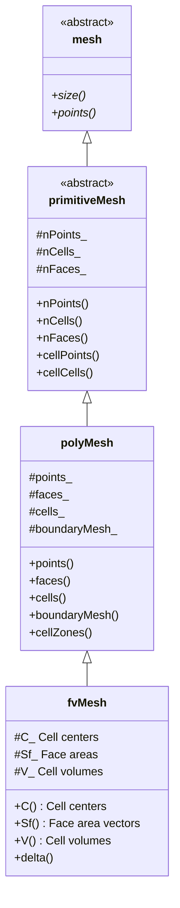
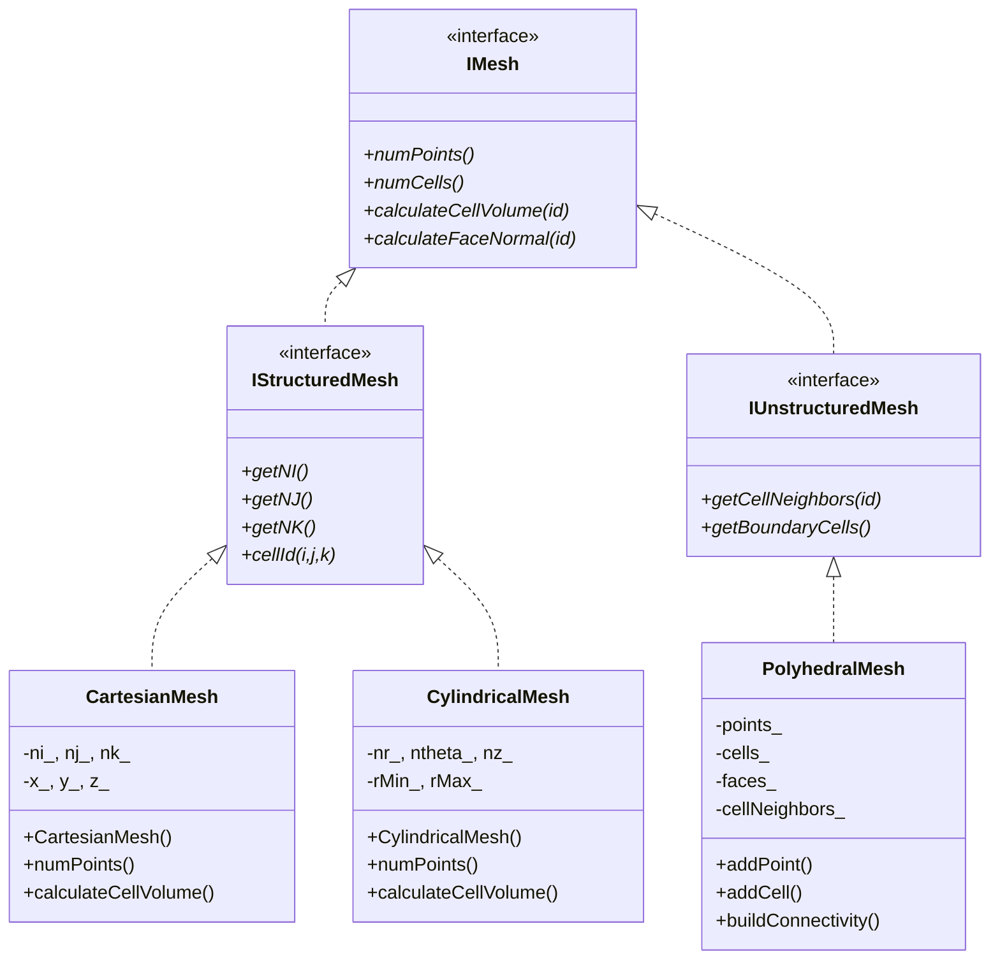

# Mesh Hierarchy and Design Patterns (ลำดับชั้น Mesh และ Design Patterns)

> **[!INFO]** 📚 Learning Objective
> ออกแบบลำดับชั้นของคลาส mesh โดยใช้ design patterns (Factory, Builder) เพื่อความยืดหยุ่นและ reuseability สำหรับ R410A evaporator simulation

---

## 📋 Table of Contents (สารบัญ)

1. [Mesh Class Hierarchy](#mesh-class-hierarchy-ลำดับชั้นของคลาส-mesh)
2. [Factory Pattern](#factory-pattern-รูปแบบ-factory)
3. [Builder Pattern](#builder-pattern-รูปแบบ-builder)
4. [Composite Pattern](#composite-pattern-รูปแบบ-composite)
5. [R410A Mesh Factory](#r410a-mesh-factory-factory-mesh-สำหรับ-r410a)

---

## Mesh Class Hierarchy (ลำดับชั้นของคลาส Mesh)

### Why Hierarchy?

**⭐ Benefits:**
1. **Code reuse:** Common functionality in base class
2. **Polymorphism:** Treat all meshes uniformly
3. **Extensibility:** Add new mesh types without modifying existing code
4. **Type safety:** Compile-time checks for mesh operations

### OpenFOAM Mesh Hierarchy

**⭐ Verified from:** `openfoam_temp/src/OpenFOAM/meshes/`



**⭐ Key inheritance points:**

1. **mesh**: Base interface for all meshes
2. **primitiveMesh**: Topology-only mesh (cells, faces, points)
3. **polyMesh**: Polygonal mesh with boundary info
4. **fvMesh**: Finite Volume mesh with geometric data

### Custom Mesh Hierarchy

```cpp
// Base mesh interface
class IMesh {
public:
    virtual ~IMesh() = default;

    // Pure virtual interface
    virtual size_t numPoints() const = 0;
    virtual size_t numCells() const = 0;
    virtual size_t numFaces() const = 0;
    virtual size_t numBoundaries() const = 0;

    virtual const Point& getPoint(size_t id) const = 0;
    virtual const Cell& getCell(size_t id) const = 0;
    virtual const Face& getFace(size_t id) const = 0;
    virtual const BoundaryPatch& getBoundary(size_t id) const = 0;

    // Geometric calculations
    virtual double calculateCellVolume(size_t cellId) const = 0;
    virtual Vector calculateFaceNormal(size_t faceId) const = 0;
    virtual double calculateFaceArea(size_t faceId) const = 0;

    // Validation
    virtual bool isValid() const = 0;
    virtual void validate() const = 0;
};

// Structured mesh base (grids)
class IStructuredMesh : public IMesh {
public:
    virtual ~IStructuredMesh() = default;

    // Structured-specific operations
    virtual size_t getNI() const = 0;  // Cells in i-direction
    virtual size_t getNJ() const = 0;  // Cells in j-direction
    virtual size_t getNK() const = 0;  // Cells in k-direction

    virtual size_t cellId(size_t i, size_t j, size_t k) const = 0;
};

// Unstructured mesh base
class IUnstructuredMesh : public IMesh {
public:
    virtual ~IUnstructuredMesh() = default;

    // Unstructured-specific operations
    virtual std::vector<size_t> getCellNeighbors(size_t cellId) const = 0;
    virtual std::vector<size_t> getBoundaryCells() const = 0;
};
```

### Concrete Mesh Implementations

```cpp
// Structured Cartesian mesh
class CartesianMesh : public IStructuredMesh {
private:
    size_t ni_, nj_, nk_;
    std::vector<double> x_, y_, z_;

public:
    CartesianMesh(size_t ni, size_t nj, size_t nk,
                  double xMin, double xMax,
                  double yMin, double yMax,
                  double zMin, double zMax)
        : ni_(ni), nj_(nj), nk_(nk),
          x_(ni + 1), y_(nj + 1), z_(nk + 1) {

        // Generate uniform grid
        for (size_t i = 0; i <= ni_; ++i) {
            x_[i] = xMin + i * (xMax - xMin) / ni_;
        }
        for (size_t j = 0; j <= nj_; ++j) {
            y_[j] = yMin + j * (yMax - yMin) / nj_;
        }
        for (size_t k = 0; k <= nk_; ++k) {
            z_[k] = zMin + k * (zMax - zMin) / nk_;
        }
    }

    size_t numPoints() const override {
        return (ni_ + 1) * (nj_ + 1) * (nk_ + 1);
    }

    size_t numCells() const override {
        return ni_ * nj_ * nk_;
    }

    size_t cellId(size_t i, size_t j, size_t k) const override {
        return i + ni_ * (j + nj_ * k);
    }

    double calculateCellVolume(size_t cellId) const override {
        // Uniform volume
        double dx = x_[1] - x_[0];
        double dy = y_[1] - y_[0];
        double dz = z_[1] - z_[0];
        return dx * dy * dz;
    }
};

// Cylindrical mesh (for tubes)
class CylindricalMesh : public IStructuredMesh {
private:
    size_t nr_, ntheta_, nz_;
    double rMin_, rMax_;
    double thetaMin_, thetaMax_;
    double zMin_, zMax_;

public:
    CylindricalMesh(size_t nr, size_t ntheta, size_t nz,
                    double rMin, double rMax,
                    double zMin, double zMax)
        : nr_(nr), ntheta_(ntheta), nz_(nz),
          rMin_(rMin), rMax_(rMax),
          thetaMin_(0.0), thetaMax_(2.0 * M_PI),
          zMin_(zMin), zMax_(zMax) {}

    size_t cellId(size_t r, size_t theta, size_t z) const override {
        return r + nr_ * (theta + ntheta_ * z);
    }

    double calculateCellVolume(size_t cellId) const override {
        // Map cellId to (r, theta, z)
        size_t k = cellId / (nr_ * ntheta_);
        size_t j = (cellId % (nr_ * ntheta_)) / nr_;
        size_t i = cellId % nr_;

        double dr = (rMax_ - rMin_) / nr_;
        double dtheta = (thetaMax_ - thetaMin_) / ntheta_;
        double dz = (zMax_ - zMin_) / nz_;

        double r = rMin_ + (i + 0.5) * dr;
        return r * dr * dtheta * dz;
    }
};

// Unstructured polyhedral mesh
class PolyhedralMesh : public IUnstructuredMesh {
private:
    std::vector<Point> points_;
    std::vector<Cell> cells_;
    std::vector<Face> faces_;
    std::vector<BoundaryPatch> boundaries_;

    // Connectivity
    std::vector<std::vector<size_t>> cellNeighbors_;

public:
    PolyhedralMesh() = default;

    void addPoint(const Point& p) {
        points_.push_back(p);
    }

    void addCell(const Cell& c) {
        cells_.push_back(c);
    }

    void buildConnectivity() {
        // Build neighbor list
        cellNeighbors_.resize(cells_.size());
        for (size_t faceId = 0; faceId < faces_.size(); ++faceId) {
            const auto& face = faces_[faceId];
            if (face.neighbour != SIZE_MAX) {
                cellNeighbors_[face.owner].push_back(face.neighbour);
                cellNeighbors_[face.neighbour].push_back(face.owner);
            }
        }
    }

    std::vector<size_t> getCellNeighbors(size_t cellId) const override {
        return cellNeighbors_[cellId];
    }

    double calculateCellVolume(size_t cellId) const override {
        // Use divergence theorem: V = (1/3) ∑ (r·n·A)
        double volume = 0.0;
        const auto& cell = cells_[cellId];

        for (size_t faceId : cell.faceIds) {
            const auto& face = faces_[faceId];
            Vector r = getCellCenter(cellId);
            Vector n = calculateFaceNormal(faceId);
            double A = calculateFaceArea(faceId);
            volume += r.dot(n) * A;
        }

        return std::abs(volume) / 3.0;
    }
};
```

### Mesh Hierarchy Diagram



---

## Factory Pattern (รูปแบบ Factory)

### What is Factory Pattern?

**⭐ Definition:** Create objects without specifying exact class

**⭐ Why use for meshes:**
1. **Decouple creation:** Don't need to know concrete type
2. **Centralized:** Single place for mesh creation logic
3. **Configurable:** Choose mesh type from config file
4. **Extensible:** Add new mesh types without changing client code

### Simple Factory

```cpp
// Simple factory for mesh creation
class MeshFactory {
public:
    enum class MeshType {
        CARTESIAN,
        CYLINDRICAL,
        POLYHEDRAL,
        TUBE
    };

    // Factory method
    static std::unique_ptr<IMesh> createMesh(MeshType type) {
        switch (type) {
            case MeshType::CARTESIAN:
                return std::make_unique<CartesianMesh>(
                    10, 10, 10,  // ni, nj, nk
                    0.0, 1.0,    // x range
                    0.0, 1.0,    // y range
                    0.0, 1.0     // z range
                );

            case MeshType::CYLINDRICAL:
                return std::make_unique<CylindricalMesh>(
                    20, 12, 50,   // nr, ntheta, nz
                    0.0, 0.005,   // r range
                    0.0, 0.5      // z range
                );

            case MeshType::POLYHEDRAL:
                return std::make_unique<PolyhedralMesh>();

            case MeshType::TUBE:
                // Specialized tube mesh
                return createTubeMesh();

            default:
                throw std::invalid_argument("Unknown mesh type");
        }
    }

private:
    static std::unique_ptr<IMesh> createTubeMesh() {
        auto mesh = std::make_unique<CylindricalMesh>(
            20, 12, 50,
            0.0, 0.005,
            0.0, 0.5
        );
        return mesh;
    }
};

// Usage
void runSimulation() {
    auto mesh = MeshFactory::createMesh(MeshType::TUBE);

    // Use mesh (doesn't care about concrete type)
    std::cout << "Mesh has " << mesh->numCells() << " cells\n";
}
```

### Factory with Parameters

```cpp
// Factory that reads from configuration
class ConfigurableMeshFactory {
public:
    struct MeshConfig {
        std::string type;          // "cartesian", "cylindrical", "tube"
        std::map<std::string, double> params;
        std::map<std::string, int> resolution;
    };

    static std::unique_ptr<IMesh> createFromConfig(const MeshConfig& config) {
        if (config.type == "cartesian") {
            double xMin = config.params.at("xMin");
            double xMax = config.params.at("xMax");
            double yMin = config.params.at("yMin");
            double yMax = config.params.at("yMax");
            double zMin = config.params.at("zMin");
            double zMax = config.params.at("zMax");
            int ni = config.resolution.at("ni");
            int nj = config.resolution.at("nj");
            int nk = config.resolution.at("nk");

            return std::make_unique<CartesianMesh>(
                ni, nj, nk,
                xMin, xMax,
                yMin, yMax,
                zMin, zMax
            );
        }
        else if (config.type == "cylindrical" || config.type == "tube") {
            double rMin = config.params.at("rMin");
            double rMax = config.params.at("rMax");
            double zMin = config.params.at("zMin");
            double zMax = config.params.at("zMax");
            int nr = config.resolution.at("nr");
            int ntheta = config.resolution.at("ntheta");
            int nz = config.resolution.at("nz");

            return std::make_unique<CylindricalMesh>(
                nr, ntheta, nz,
                rMin, rMax,
                zMin, zMax
            );
        }
        else if (config.type == "polyhedral") {
            std::string filename = config.params.at("filename");
            return loadPolyhedralMesh(filename);
        }
        else {
            throw std::invalid_argument("Unknown mesh type: " + config.type);
        }
    }

private:
    static std::unique_ptr<IMesh> loadPolyhedralMesh(const std::string& filename) {
        // Load from file (e.g., OpenFOAM, GMSH, etc.)
        // ...
        return std::make_unique<PolyhedralMesh>();
    }
};

// Usage: read from file
MeshConfig readConfigFromFile(const std::string& filename) {
    // Parse JSON/YAML config file
    MeshConfig config;
    config.type = "tube";
    config.params["rMin"] = 0.0;
    config.params["rMax"] = 0.005;
    config.params["zMin"] = 0.0;
    config.params["zMax"] = 0.5;
    config.resolution["nr"] = 20;
    config.resolution["ntheta"] = 12;
    config.resolution["nz"] = 50;
    return config;
}

void runSimulationFromConfig(const std::string& configFile) {
    auto config = readConfigFromFile(configFile);
    auto mesh = ConfigurableMeshFactory::createFromConfig(config);

    std::cout << "Mesh: " << config.type
              << ", Cells: " << mesh->numCells() << "\n";
}
```

### Abstract Factory

```cpp
// Abstract factory for mesh families
class IMeshFactory {
public:
    virtual ~IMeshFactory() = default;

    virtual std::unique_ptr<IMesh> createMesh() = 0;
    virtual std::unique_ptr<IMesh> createCoarseMesh() = 0;
    virtual std::unique_ptr<IMesh> createFineMesh() = 0;
};

// Concrete factory for R410A evaporator meshes
class R410AMeshFactory : public IMeshFactory {
public:
    std::unique_ptr<IMesh> createMesh() override {
        // Standard resolution
        return std::make_unique<CylindricalMesh>(
            20, 12, 50,
            0.0, 0.005,
            0.0, 0.5
        );
    }

    std::unique_ptr<IMesh> createCoarseMesh() override {
        // Coarse: 50% cells
        return std::make_unique<CylindricalMesh>(
            14, 8, 35,
            0.0, 0.005,
            0.0, 0.5
        );
    }

    std::unique_ptr<IMesh> createFineMesh() override {
        // Fine: 200% cells
        return std::make_unique<CylindricalMesh>(
            28, 16, 70,
            0.0, 0.005,
            0.0, 0.5
        );
    }
};

// Usage: mesh refinement study
void meshRefinementStudy(IMeshFactory& factory) {
    auto coarse = factory.createCoarseMesh();
    auto standard = factory.createMesh();
    auto fine = factory.createFineMesh();

    // Run simulation on each mesh
    double errorCoarse = runSimulation(*coarse);
    double errorStandard = runSimulation(*standard);
    double errorFine = runSimulation(*fine);

    // Analyze convergence
    std::cout << "Error coarse: " << errorCoarse << "\n";
    std::cout << "Error standard: " << errorStandard << "\n";
    std::cout << "Error fine: " << errorFine << "\n";
}
```

---

## Builder Pattern (รูปแบบ Builder)

### What is Builder Pattern?

**⭐ Definition:** Separate construction of complex object from representation

**⭐ Why use for meshes:**
1. **Step-by-step:** Build mesh incrementally
2. **Fluent interface:** Chain method calls
3. **Immutable:** Mesh is ready after build
4. **Validation:** Validate during construction

### Mesh Builder

```cpp
// Builder for tube mesh
class TubeMeshBuilder {
private:
    double radius_ = 0.005;
    double length_ = 0.5;
    int nRadial_ = 20;
    int nAxial_ = 50;
    int nAngular_ = 12;
    double radialExpansion_ = 1.0;
    std::vector<double> axialGrading_;

public:
    TubeMeshBuilder& setRadius(double radius) {
        radius_ = radius;
        return *this;
    }

    TubeMeshBuilder& setLength(double length) {
        length_ = length;
        return *this;
    }

    TubeMeshBuilder& setRadialResolution(int n) {
        nRadial_ = n;
        return *this;
    }

    TubeMeshBuilder& setAxialResolution(int n) {
        nAxial_ = n;
        return *this;
    }

    TubeMeshBuilder& setAngularResolution(int n) {
        nAngular_ = n;
        return *this;
    }

    TubeMeshBuilder& setRadialGrading(double expansion) {
        radialExpansion_ = expansion;
        return *this;
    }

    TubeMeshBuilder& setAxialGrading(const std::vector<double>& grading) {
        axialGrading_ = grading;
        return *this;
    }

    // Build the mesh
    std::unique_ptr<CylindricalMesh> build() {
        validate();

        auto mesh = std::make_unique<CylindricalMesh>(
            nRadial_, nAngular_, nAxial_,
            0.0, radius_,
            0.0, length_
        );

        // Apply grading
        if (radialExpansion_ != 1.0) {
            mesh->applyRadialGrading(radialExpansion_);
        }

        if (!axialGrading_.empty()) {
            mesh->applyAxialGrading(axialGrading_);
        }

        mesh->generate();
        mesh->validate();

        return mesh;
    }

private:
    void validate() {
        if (radius_ <= 0) {
            throw std::invalid_argument("Radius must be positive");
        }
        if (length_ <= 0) {
            throw std::invalid_argument("Length must be positive");
        }
        if (nRadial_ < 5) {
            throw std::invalid_argument("Need at least 5 radial cells");
        }
        if (nAxial_ < 2) {
            throw std::invalid_argument("Need at least 2 axial cells");
        }
        if (nAngular_ < 6) {
            throw std::invalid_argument("Need at least 6 angular cells");
        }
    }
};

// Usage: fluent interface
auto mesh = TubeMeshBuilder()
    .setRadius(0.005)
    .setLength(0.5)
    .setRadialResolution(20)
    .setAxialResolution(50)
    .setAngularResolution(12)
    .setRadialGrading(1.2)
    .build();
```

### Builder with Pre-configured Options

```cpp
// Builder with presets for common cases
class R410AMeshBuilder {
private:
    TubeMeshBuilder builder_;

public:
    // Preset: Boundary layer mesh
    static R410AMeshBuilder boundaryLayerMesh() {
        R410AMeshBuilder b;
        b.builder_
            .setRadialResolution(30)
            .setRadialGrading(1.3);  // Fine near wall
        return b;
    }

    // Preset: Coarse mesh for initial testing
    static R410AMeshBuilder coarseMesh() {
        R410AMeshBuilder b;
        b.builder_
            .setRadialResolution(10)
            .setAxialResolution(20)
            .setAngularResolution(8);
        return b;
    }

    // Preset: Fine mesh for production
    static R410AMeshBuilder fineMesh() {
        R410AMeshBuilder b;
        b.builder_
            .setRadialResolution(40)
            .setAxialResolution(100)
            .setAngularResolution(16)
            .setRadialGrading(1.15);
        return b;
    }

    // Allow customization
    R410AMeshBuilder& customize(std::function<void(TubeMeshBuilder&)> func) {
        func(builder_);
        return *this;
    }

    std::unique_ptr<CylindricalMesh> build() {
        return builder_.build();
    }
};

// Usage: preset with customization
auto mesh = R410AMeshBuilder::boundaryLayerMesh()
    .customize([](TubeMeshBuilder& b) {
        b.setLength(0.8);  // Longer tube
        b.setAxialResolution(80);  // Finer axial
    })
    .build();
```

---

## Composite Pattern (รูปแบบ Composite)

### What is Composite Pattern?

**⭐ Definition:** Compose objects into tree structures to represent part-whole hierarchies

**⭐ Why use for meshes:**
1. **Multi-region meshes:** Treat regions uniformly
2. **Mesh assembly:** Combine multiple meshes into one
3. **Hierarchical refinement:** Refine specific regions
4. **Parallel decomposition:** Domain decomposition

### Composite Mesh

```cpp
// Component interface
class IMeshComponent {
public:
    virtual ~IMeshComponent() = default;

    virtual size_t numCells() const = 0;
    virtual size_t numPoints() const = 0;
    virtual void write(const std::string& path) const = 0;

    // Composite operation
    virtual void addComponent(std::shared_ptr<IMeshComponent> component) {
        throw std::runtime_error("Not a composite mesh");
    }
};

// Leaf: Single mesh region
class MeshRegion : public IMeshComponent {
private:
    std::string name_;
    std::unique_ptr<IMesh> mesh_;

public:
    MeshRegion(const std::string& name, std::unique_ptr<IMesh> mesh)
        : name_(name), mesh_(std::move(mesh)) {}

    size_t numCells() const override {
        return mesh_->numCells();
    }

    size_t numPoints() const override {
        return mesh_->numPoints();
    }

    void write(const std::string& path) const override {
        mesh_->write(path + "/" + name_);
    }
};

// Composite: Collection of mesh regions
class CompositeMesh : public IMeshComponent {
private:
    std::string name_;
    std::vector<std::shared_ptr<IMeshComponent>> components_;

public:
    CompositeMesh(const std::string& name) : name_(name) {}

    void addComponent(std::shared_ptr<IMeshComponent> component) override {
        components_.push_back(component);
    }

    size_t numCells() const override {
        size_t total = 0;
        for (const auto& comp : components_) {
            total += comp->numCells();
        }
        return total;
    }

    size_t numPoints() const override {
        size_t total = 0;
        for (const auto& comp : components_) {
            total += comp->numPoints();
        }
        return total;
    }

    void write(const std::string& path) const override {
        for (const auto& comp : components_) {
            comp->write(path);
        }
    }

    // Composite-specific operations
    std::vector<std::shared_ptr<IMeshComponent>>& getComponents() {
        return components_;
    }
};
```

### Using Composite for Multi-Region Mesh

```cpp
// Create multi-region mesh for R410A evaporator
void createMultiRegionEvaporatorMesh() {
    // Create composite mesh
    auto evaporator = std::make_shared<CompositeMesh>("R410A_evaporator");

    // Region 1: Inlet section (finer mesh)
    auto inlet = std::make_shared<MeshRegion>(
        "inlet_section",
        TubeMeshBuilder()
            .setLength(0.1)
            .setRadialResolution(25)
            .setAxialResolution(20)
            .setRadialGrading(1.2)
            .build()
    );
    evaporator->addComponent(inlet);

    // Region 2: Middle section (coarser mesh)
    auto middle = std::make_shared<MeshRegion>(
        "middle_section",
        TubeMeshBuilder()
            .setLength(0.3)
            .setRadialResolution(20)
            .setAxialResolution(30)
            .setRadialGrading(1.1)
            .build()
    );
    evaporator->addComponent(middle);

    // Region 3: Outlet section (finer mesh)
    auto outlet = std::make_shared<MeshRegion>(
        "outlet_section",
        TubeMeshBuilder()
            .setLength(0.1)
            .setRadialResolution(25)
            .setAxialResolution(20)
            .setRadialGrading(1.2)
            .build()
    );
    evaporator->addComponent(outlet);

    // Write all regions
    evaporator->write("./R410A_evaporator");

    std::cout << "Total cells: " << evaporator->numCells() << "\n";
}
```

---

## R410A Mesh Factory (Factory Mesh สำหรับ R410A)

### Specialized Factory for R410A Evaporator

```cpp
class R410AMeshFactory {
public:
    enum class EvaporatorType {
        SINGLE_TUBE,        // Single horizontal tube
        MULTI_TUBE,         // Multiple tubes in parallel
        COAXIAL,            // Coaxial tube-in-tube
        MICRO_CHANNEL       // Micro-channel evaporator
    };

    static std::unique_ptr<IMesh> createEvaporatorMesh(
        EvaporatorType type,
        const R410AGeometry& geo
    ) {
        switch (type) {
            case EvaporatorType::SINGLE_TUBE:
                return createSingleTubeMesh(geo);

            case EvaporatorType::MULTI_TUBE:
                return createMultiTubeMesh(geo);

            case EvaporatorType::COAXIAL:
                return createCoaxialMesh(geo);

            case EvaporatorType::MICRO_CHANNEL:
                return createMicroChannelMesh(geo);

            default:
                throw std::invalid_argument("Unknown evaporator type");
        }
    }

private:
    static std::unique_ptr<IMesh> createSingleTubeMesh(const R410AGeometry& geo) {
        return TubeMeshBuilder()
            .setRadius(geo.tubeRadius)
            .setLength(geo.tubeLength)
            .setRadialResolution(geo.nRadial)
            .setAxialResolution(geo.nAxial)
            .setAngularResolution(geo.nAngular)
            .setRadialGrading(1.2)
            .build();
    }

    static std::unique_ptr<IMesh> createMultiTubeMesh(const R410AGeometry& geo) {
        auto composite = std::make_unique<CompositeMesh>("multi_tube");

        // Create multiple tubes
        for (int i = 0; i < geo.numTubes; ++i) {
            double offset = i * geo.tubeSpacing;

            auto tube = std::make_shared<MeshRegion>(
                "tube_" + std::to_string(i),
                createTubeWithOffset(offset, geo)
            );

            composite->addComponent(tube);
        }

        return composite;
    }

    static std::unique_ptr<IMesh> createCoaxialMesh(const R410AGeometry& geo) {
        // Inner tube (refrigerant)
        auto innerTube = TubeMeshBuilder()
            .setRadius(geo.innerRadius)
            .setLength(geo.tubeLength)
            .setRadialResolution(geo.nRadialInner)
            .setAxialResolution(geo.nAxial)
            .build();

        // Outer annulus (air/water)
        auto outerAnnulus = createAnnulusMesh(
            geo.innerRadius,
            geo.outerRadius,
            geo.tubeLength,
            geo.nRadialOuter,
            geo.nAxial
        );

        // Combine into composite
        auto coaxial = std::make_unique<CompositeMesh>("coaxial_evaporator");
        coaxial->addComponent(std::make_shared<MeshRegion>("inner", std::move(innerTube)));
        coaxial->addComponent(std::make_shared<MeshRegion>("outer", std::move(outerAnnulus)));

        return coaxial;
    }
};
```

### R410A Geometry Configuration

```cpp
struct R410AGeometry {
    // Tube dimensions
    double tubeRadius = 0.005;      // 5 mm
    double tubeLength = 0.5;        // 50 cm

    // Mesh resolution
    int nRadial = 20;
    int nAxial = 50;
    int nAngular = 12;

    // Multi-tube configuration
    int numTubes = 1;
    double tubeSpacing = 0.02;      // 2 cm center-to-center

    // Coaxial configuration
    double innerRadius = 0.005;
    double outerRadius = 0.015;
    int nRadialInner = 20;
    int nRadialOuter = 15;
};
```

---

## 📚 Summary (สรุป)

### Design Patterns

| Pattern | Purpose | CFD Application |
|---------|---------|-----------------|
| **Factory** | Create objects without specifying type | Generate different mesh types |
| **Builder** | Construct complex objects step-by-step | Configure mesh parameters |
| **Composite** | Treat individual and aggregate uniformly | Multi-region meshes |
| **Strategy** | Encapsulate algorithms | Different grading strategies |

### Hierarchy Benefits

1. **⭐ Code reuse:** Common operations in base class
2. **⭐ Type safety:** Compile-time checks
3. **⭐ Polymorphism:** Treat all meshes uniformly
4. **⭐ Extensibility:** Add new mesh types easily

### R410A Application

1. **⭐ Specialized factory:** Create evaporator-specific meshes
2. **⭐ Builder pattern:** Configure tube geometry easily
3. **⭐ Composite mesh:** Multi-region evaporator
4. **⭐ Configurable:** Read parameters from file

---

## 🔍 References (อ้างอิง)

| Topic | Reference |
|-------|-----------|
| Design Patterns | Gang of Four, "Design Patterns" (1994) |
| OpenFOAM mesh | `src/OpenFOAM/meshes/` |
| Factory pattern | "Modern C++ Design" by Alexandrescu |
| Builder pattern | "Effective C++" by Scott Meyers |

---

*Last Updated: 2026-01-28*
