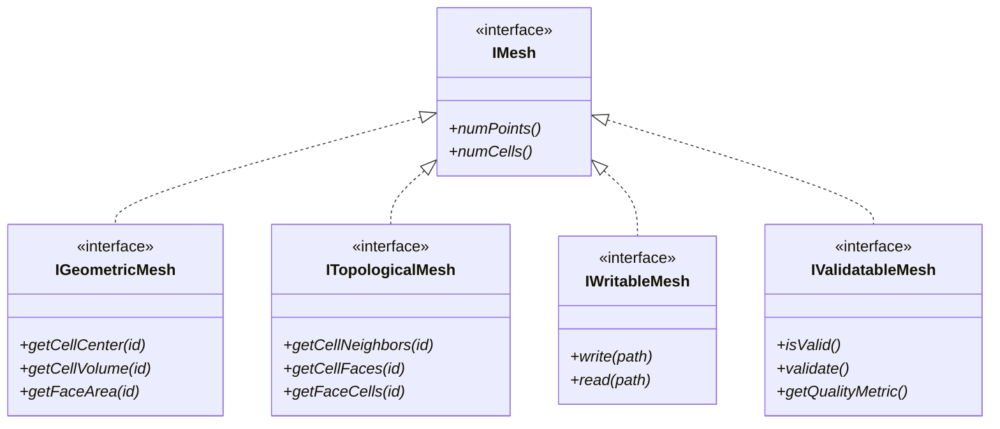

# Mesh Interface Design (การออกแบบอินเทอร์เฟซ Mesh)

> **[!INFO]** 📚 Learning Objective
> ออกแบบ abstract interfaces สำหรับ mesh operations โดยใช้ polymorphism เพื่อความยืดหยุ่นและ reuseability สำหรับ R410A evaporator simulation

---

## 📋 Table of Contents (สารบัญ)

1. [Interface Design Principles](#interface-design-principlesหลักการออกแบบอินเทอร์เฟซ)
2. [Abstract Mesh Interface](#abstract-mesh-interfaceอินเทอร์เฟซ-Mesh-แบบนามธรรม)
3. [Polymorphism in Mesh Operations](#polymorphism-in-mesh-operations-polymorphism-ในการดำเนินการ-mesh)
4. [Mesh Adapters](#mesh-adapters-adapters-สำหรับ-mesh)
5. [R410A Evaporator Mesh Interface](#r410a-evaporator-mesh-interfaceอินเทอร์เฟซ-mesh-สำหรับ-r410a-evaporator)

---

## Interface Design Principles (หลักการออกแบบอินเทอร์เฟซ)

### What Makes a Good Interface?

**⭐ Key principles:**

1. **Minimal:** Only essential methods, nothing more
2. **Complete:** Covers all use cases
3. **Cohesive:** Related functionality grouped together
4. **Stable:** Doesn't change frequently
5. **Documented:** Clear documentation for each method

### Interface Segregation

**⭐ Principle:** Clients shouldn't depend on interfaces they don't use



**Benefits:**
- **Specialized interfaces:** Each for specific purpose
- **Flexibility:** Implement only what's needed
- **Clarity:** Clear what each interface provides

### Dependency Inversion

**⭐ Principle:** Depend on abstractions, not concretions

```cpp
// ❌ BAD: Depends on concrete class
class Solver {
private:
    CylindricalMesh mesh_;  // Concrete dependency
};

// ✅ GOOD: Depends on abstraction
class Solver {
private:
    std::shared_ptr<IGeometricMesh> mesh_;  // Abstract dependency
};
```

**Benefits:**
- **Flexibility:** Swap implementations easily
- **Testability:** Mock interfaces for testing
- **Decoupling:** Reduced coupling between components

---

## Abstract Mesh Interface (อินเทอร์เฟซ Mesh แบบนามธรรม)

### Core Mesh Interface

```cpp
// Base interface: all meshes must implement
class IMesh {
public:
    virtual ~IMesh() = default;

    // Basic information
    virtual size_t numPoints() const = 0;
    virtual size_t numCells() const = 0;
    virtual size_t numFaces() const = 0;
    virtual size_t numBoundaries() const = 0;

    // Names
    virtual std::string getName() const = 0;
    virtual std::string getType() const = 0;

    // Validation
    virtual bool isValid() const = 0;
    virtual void validate() const = 0;
};
```

### Geometric Interface

```cpp
// Geometric operations: need cell/face geometry
class IGeometricMesh : public virtual IMesh {
public:
    // Point access
    virtual Point getPoint(size_t pointId) const = 0;
    virtual std::vector<Point> getAllPoints() const = 0;

    // Cell geometry
    virtual Point getCellCenter(size_t cellId) const = 0;
    virtual double getCellVolume(size_t cellId) const = 0;
    virtual Vector getCellVector(size_t cellId) const = 0;

    // Face geometry
    virtual Point getFaceCenter(size_t faceId) const = 0;
    virtual Vector getFaceNormal(size_t faceId) const = 0;
    virtual double getFaceArea(size_t faceId) const = 0;

    // Boundary patches
    virtual std::vector<std::string> getBoundaryNames() const = 0;
    virtual std::vector<size_t> getBoundaryFaceIds(const std::string& name) const = 0;
};
```

### Topological Interface

```cpp
// Topological operations: need connectivity
class ITopologicalMesh : public virtual IMesh {
public:
    // Cell-face connectivity
    virtual std::vector<size_t> getCellFaces(size_t cellId) const = 0;

    // Cell-point connectivity
    virtual std::vector<size_t> getCellPoints(size_t cellId) const = 0;

    // Cell-cell connectivity
    virtual std::vector<size_t> getCellNeighbors(size_t cellId) const = 0;

    // Face-cell connectivity
    virtual std::pair<size_t, size_t> getFaceCells(size_t faceId) const = 0;
    virtual size_t getFaceOwner(size_t faceId) const = 0;
    virtual size_t getFaceNeighbour(size_t faceId) const = 0;

    // Point-cell connectivity
    virtual std::vector<size_t> getPointCells(size_t pointId) const = 0;
};
```

### Writable Interface

```cpp
// I/O operations: read/write mesh
class IWritableMesh : public virtual IMesh {
public:
    // Write operations
    virtual void write(const std::string& baseDir) const = 0;
    virtual void writeOpenFOAM(const std::string& baseDir) const = 0;
    virtual void writeVTK(const std::string& filename) const = 0;

    // Read operations
    virtual void read(const std::string& baseDir) = 0;
    virtual void readOpenFOAM(const std::string& baseDir) = 0;
    virtual void readVTK(const std::string& filename) = 0;
};
```

### Query Interface

```cpp
// Query operations: search and filter
class IQueryableMesh : public virtual IMesh {
public:
    // Spatial queries
    virtual std::vector<size_t> findCellsNearPoint(const Point& p, double radius) const = 0;
    virtual std::vector<size_t> findCellsInBox(const Point& min, const Point& max) const = 0;

    // Boundary queries
    virtual bool isBoundaryCell(size_t cellId) const = 0;
    virtual std::vector<size_t> getBoundaryCells() const = 0;

    // Quality queries
    virtual double getMinCellVolume() const = 0;
    virtual double getMaxCellVolume() const = 0;
    virtual double getAverageCellVolume() const = 0;

    virtual double getMaxAspectRatio() const = 0;
    virtual std::vector<size_t> getHighAspectRatioCells(double threshold) const = 0;
};
```

### Modifiable Interface

```cpp
// Modification operations: change mesh structure
class IModifiableMesh : public virtual IMesh {
public:
    // Cell operations
    virtual void refineCell(size_t cellId) = 0;
    virtual void coarsenCells(const std::vector<size_t>& cellIds) = 0;

    // Boundary operations
    virtual void addBoundaryPatch(const std::string& name, const std::vector<size_t>& faceIds) = 0;
    virtual void removeBoundaryPatch(const std::string& name) = 0;

    // Point operations
    virtual void movePoint(size_t pointId, const Point& newPosition) = 0;
    virtual void smoothPoints(int iterations = 1) = 0;
};
```

---

## Polymorphism in Mesh Operations (Polymorphism ในการดำเนินการ Mesh)

### Runtime Polymorphism

**⭐ Use:** Different mesh types through same interface

```cpp
// Function that works with any mesh
void printMeshStatistics(const IGeometricMesh& mesh) {
    std::cout << "Mesh: " << mesh.getName() << "\n";
    std::cout << "  Type: " << mesh.getType() << "\n";
    std::cout << "  Points: " << mesh.numPoints() << "\n";
    std::cout << "  Cells: " << mesh.numCells() << "\n";
    std::cout << "  Faces: " << mesh.numFaces() << "\n";

    // Geometric info
    double minVol = mesh.getMinCellVolume();
    double maxVol = mesh.getMaxCellVolume();
    std::cout << "  Cell volume range: [" << minVol << ", " << maxVol << "]\n";
}

// Works with any mesh implementing IGeometricMesh
int main() {
    CartesianMesh cartesian(10, 10, 10, 0.0, 1.0, 0.0, 1.0, 0.0, 1.0);
    CylindricalMesh cylindrical(20, 12, 50, 0.0, 0.005, 0.0, 0.5);
    PolyhedralMesh polyhedral = loadMeshFromFile("mesh.obj");

    // Same function, different types
    printMeshStatistics(cartesian);
    printMeshStatistics(cylindrical);
    printMeshStatistics(polyhedral);

    return 0;
}
```

### Compile-time Polymorphism (Templates)

**⭐ Use:** Type-specific optimizations

```cpp
// Template function: resolved at compile time
template<typename MeshType>
double calculateTotalVolume(const MeshType& mesh) {
    double total = 0.0;
    for (size_t i = 0; i < mesh.numCells(); ++i) {
        total += mesh.getCellVolume(i);
    }
    return total;
}

// Specialization for structured mesh (faster)
template<>
double calculateTotalVolume<CartesianMesh>(const CartesianMesh& mesh) {
    // All cells have same volume
    double dx = mesh.getDX();
    double dy = mesh.getDY();
    double dz = mesh.getDZ();
    return dx * dy * dz * mesh.numCells();
}

// Usage
CartesianMesh cartesian(10, 10, 10, ...);
double vol1 = calculateTotalVolume(cartesian);  // Uses specialization

CylindricalMesh cylindrical(20, 12, 50, ...);
double vol2 = calculateTotalVolume(cylindrical);  // Uses generic version
```

### Strategy Pattern for Mesh Operations

```cpp
// Strategy interface for mesh refinement
class IMeshRefinementStrategy {
public:
    virtual ~IMeshRefinementStrategy() = default;
    virtual void refine(IModifiableMesh& mesh, const std::vector<size_t>& cellIds) = 0;
};

// Concrete strategy: uniform refinement
class UniformRefinement : public IMeshRefinementStrategy {
public:
    void refine(IModifiableMesh& mesh, const std::vector<size_t>& cellIds) override {
        for (size_t cellId : cellIds) {
            mesh.refineCell(cellId);
        }
    }
};

// Concrete strategy: adaptive refinement based on quality
class AdaptiveRefinement : public IMeshRefinementStrategy {
private:
    double qualityThreshold_;

public:
    AdaptiveRefinement(double threshold) : qualityThreshold_(threshold) {}

    void refine(IModifiableMesh& mesh, const std::vector<size_t>& cellIds) override {
        for (size_t cellId : cellIds) {
            double aspect = mesh.getCellAspectRatio(cellId);
            if (aspect > qualityThreshold_) {
                mesh.refineCell(cellId);
            }
        }
    }
};

// Use strategy
void refineMesh(IModifiableMesh& mesh, IMeshRefinementStrategy& strategy) {
    auto badCells = mesh.getHighAspectRatioCells(10.0);
    strategy.refine(mesh, badCells);
}
```

---

## Mesh Adapters (Adapters สำหรับ Mesh)

### What are Adapters?

**⭐ Definition:** Convert one interface to another

**⭐ Use cases:**
1. **Legacy code:** Old mesh format with new interface
2. **External libraries:** Third-party mesh formats
3. **Different standards:** OpenFOAM, GMSH, ANSYS

### Adapter for OpenFOAM Mesh

```cpp
// Adapter: OpenFOAM mesh to our interface
class OpenFOAMMeshAdapter : public IGeometricMesh,
                            public ITopologicalMesh,
                            public IWritableMesh {
private:
    // OpenFOAM mesh objects
    Foam::fvMesh* foamMesh_;
    bool ownsMesh_;

    // Cache for performance
    mutable std::vector<Point> pointCache_;
    mutable bool pointsCached_;

public:
    // Constructor: take ownership of OpenFOAM mesh
    OpenFOAMMeshAdapter(Foam::fvMesh* mesh, bool owns = true)
        : foamMesh_(mesh), ownsMesh_(owns), pointsCached_(false) {}

    // Destructor: clean up if we own it
    ~OpenFOAMMeshAdapter() {
        if (ownsMesh_ && foamMesh_) {
            delete foamMesh_;
        }
    }

    // Implement IGeometricMesh
    size_t numPoints() const override {
        return foamMesh_->points().size();
    }

    size_t numCells() const override {
        return foamMesh_->nCells();
    }

    size_t numFaces() const override {
        return foamMesh_->faces().size();
    }

    Point getPoint(size_t pointId) const override {
        const Foam::point& p = foamMesh_->points()[pointId];
        return Point(p.x(), p.y(), p.z());
    }

    Point getCellCenter(size_t cellId) const override {
        const Foam::vector& c = foamMesh_->C()[cellId];
        return Point(c.x(), c.y(), c.z());
    }

    double getCellVolume(size_t cellId) const override {
        return foamMesh_->V()[cellId];
    }

    Vector getFaceNormal(size_t faceId) const override {
        const Foam::vector& n = foamMesh_->Sf()[faceId];
        double mag = Foam::mag(n);
        return Vector(n.x()/mag, n.y()/mag, n.z()/mag);
    }

    double getFaceArea(size_t faceId) const override {
        return Foam::mag(foamMesh_->Sf()[faceId]);
    }

    // Implement ITopologicalMesh
    std::vector<size_t> getCellFaces(size_t cellId) const override {
        const Foam::cell& c = foamMesh_->cells()[cellId];
        std::vector<size_t> faceIds;
        faceIds.reserve(c.size());
        for (const Foam::label faceLabel : c) {
            faceIds.push_back(static_cast<size_t>(faceLabel));
        }
        return faceIds;
    }

    std::vector<size_t> getCellNeighbors(size_t cellId) const override {
        const Foam::cell& c = foamMesh_->cells()[cellId];
        std::set<size_t> neighbors;

        for (const Foam::label faceLabel : c) {
            const Foam::face& f = foamMesh_->faces()[faceLabel];
            if (f.owner() != cellId) {
                neighbors.insert(f.owner());
            }
            if (f.neighbour() != -1 && static_cast<size_t>(f.neighbour()) != cellId) {
                neighbors.insert(static_cast<size_t>(f.neighbour()));
            }
        }

        return std::vector<size_t>(neighbors.begin(), neighbors.end());
    }

    // Implement IWritableMesh
    void writeOpenFOAM(const std::string& baseDir) const override {
        foamMesh_->write();
    }

    void writeVTK(const std::string& filename) const override {
        // Use OpenFOAM's VTK writer
        Foam::vtkMesh fvVtk(foamMesh_);
        fvVtk.write(filename);
    }
};
```

### Adapter for GMSH Mesh

```cpp
// Adapter: GMSH mesh to our interface
class GMSHMeshAdapter : public IGeometricMesh,
                        public ITopologicalMesh {
private:
    gmsh::GModel* model_;

public:
    GMSHMeshAdapter(gmsh::GModel* model) : model_(model) {}

    size_t numPoints() const override {
        return model_->getMeshVertices().size();
    }

    size_t numCells() const override {
        size_t count = 0;
        for (auto region : model_->regions()) {
            count += region->tetrahedra.size();
        }
        return count;
    }

    Point getPoint(size_t pointId) const override {
        auto it = model_->getMeshVertices().begin();
        std::advance(it, pointId);
        MVertex* v = *it;
        return Point(v->x(), v->y(), v->z());
    }

    Point getCellCenter(size_t cellId) const override {
        // Find cell and compute center
        // ...
        return Point(0, 0, 0);
    }

    // ... other methods
};
```

### Adapter Factory

```cpp
// Factory to create adapters
class MeshAdapterFactory {
public:
    enum class MeshFormat {
        OPENFOAM,
        GMSH,
        ANSYS,
        VTK,
        STL
    };

    static std::unique_ptr<IGeometricMesh> loadMesh(
        const std::string& filename,
        MeshFormat format
    ) {
        switch (format) {
            case MeshFormat::OPENFOAM: {
                Foam::fvMesh* mesh = loadOpenFOAMMesh(filename);
                return std::make_unique<OpenFOAMMeshAdapter>(mesh, true);
            }
            case MeshFormat::GMSH: {
                gmsh::GModel* model = loadGMSHMesh(filename);
                return std::make_unique<GMSHMeshAdapter>(model);
            }
            default:
                throw std::invalid_argument("Unsupported format");
        }
    }

    static std::unique_ptr<IGeometricMesh> autoDetect(const std::string& filename) {
        // Detect format from file extension
        std::string ext = getFileExtension(filename);

        if (ext == "foam" || ext == "OpenFOAM") {
            return loadMesh(filename, MeshFormat::OPENFOAM);
        } else if (ext == "msh") {
            return loadMesh(filename, MeshFormat::GMSH);
        } else {
            throw std::runtime_error("Unknown mesh format: " + ext);
        }
    }

private:
    static Foam::fvMesh* loadOpenFOAMMesh(const std::string& filename) {
        // Load OpenFOAM mesh
        // ...
        return nullptr;
    }

    static gmsh::GModel* loadGMSHMesh(const std::string& filename) {
        // Load GMSH mesh
        // ...
        return nullptr;
    }

    static std::string getFileExtension(const std::string& filename) {
        size_t pos = filename.find_last_of('.');
        if (pos != std::string::npos) {
            return filename.substr(pos + 1);
        }
        return "";
    }
};
```

---

## R410A Evaporator Mesh Interface (อินเทอร์เฟซ Mesh สำหรับ R410A Evaporator)

### Specialized Interface for R410A

```cpp
// Specialized interface for R410A evaporator meshes
class IR410AMesh : public IGeometricMesh, public ITopologicalMesh {
public:
    // R410A-specific geometric queries
    virtual double getTubeRadius() const = 0;
    virtual double getTubeLength() const = 0;
    virtual double getWallSurfaceArea() const = 0;
    virtual double getFlowArea() const = 0;

    // Boundary-specific queries
    virtual std::vector<size_t> getInletCells() const = 0;
    virtual std::vector<size_t> getOutletCells() const = 0;
    virtual std::vector<size_t> getWallCells() const = 0;

    // R410A-specific operations
    virtual double getHydraulicDiameter() const = 0;
    virtual double getWettedPerimeter() const = 0;

    // Phase fraction queries (for two-phase)
    virtual std::vector<double> getLiquidVolumeFraction() const = 0;
    virtual std::vector<double> getVaporVolumeFraction() const = 0;
};
```

### Implementation: R410A Tube Mesh

```cpp
class R410ATubeMesh : public IR410AMesh {
private:
    std::unique_ptr<CylindricalMesh> mesh_;
    double tubeRadius_;
    double tubeLength_;

    // Boundary cell lists (cached)
    mutable std::vector<size_t> inletCells_;
    mutable std::vector<size_t> outletCells_;
    mutable std::vector<size_t> wallCells_;
    mutable bool boundariesCached_;

public:
    R410ATubeMesh(double radius, double length, int nr, int ntheta, int nz)
        : tubeRadius_(radius), tubeLength_(length),
          boundariesCached_(false) {

        mesh_ = std::make_unique<CylindricalMesh>(nr, ntheta, nz,
                                                   0.0, radius,
                                                   0.0, length);
    }

    // Implement IR410AMesh
    double getTubeRadius() const override {
        return tubeRadius_;
    }

    double getTubeLength() const override {
        return tubeLength_;
    }

    double getWallSurfaceArea() const override {
        return 2.0 * M_PI * tubeRadius_ * tubeLength_;
    }

    double getFlowArea() const override {
        return M_PI * tubeRadius_ * tubeRadius_;
    }

    std::vector<size_t> getInletCells() const override {
        cacheBoundaries();
        return inletCells_;
    }

    std::vector<size_t> getOutletCells() const override {
        cacheBoundaries();
        return outletCells_;
    }

    std::vector<size_t> getWallCells() const override {
        cacheBoundaries();
        return wallCells_;
    }

    double getHydraulicDiameter() const override {
        return 2.0 * tubeRadius_;  // For circular tube
    }

    double getWettedPerimeter() const override {
        return 2.0 * M_PI * tubeRadius_;
    }

    std::vector<double> getLiquidVolumeFraction() const override {
        // For single-phase mesh, return all liquid
        return std::vector<double>(mesh_->numCells(), 1.0);
    }

    std::vector<double> getVaporVolumeFraction() const override {
        // For single-phase mesh, return no vapor
        return std::vector<double>(mesh_->numCells(), 0.0);
    }

    // Delegate to base mesh for standard operations
    size_t numPoints() const override { return mesh_->numPoints(); }
    size_t numCells() const override { return mesh_->numCells(); }
    size_t numFaces() const override { return mesh_->numFaces(); }

    Point getCellCenter(size_t cellId) const override {
        return mesh_->getCellCenter(cellId);
    }

    double getCellVolume(size_t cellId) const override {
        return mesh_->getCellVolume(cellId);
    }

    // ... delegate other methods

private:
    void cacheBoundaries() const {
        if (boundariesCached_) return;

        int ntheta = mesh_->getNTheta();
        int nr = mesh_->getNR();
        int nz = mesh_->getNZ();

        // Inlet: cells at z = 0
        inletCells_.clear();
        for (int r = 0; r < nr; ++r) {
            for (int theta = 0; theta < ntheta; ++theta) {
                inletCells_.push_back(r + nr * theta);
            }
        }

        // Outlet: cells at z = length
        outletCells_.clear();
        for (int r = 0; r < nr; ++r) {
            for (int theta = 0; theta < ntheta; ++theta) {
                outletCells_.push_back(r + nr * (theta + ntheta * (nz - 1)));
            }
        }

        // Wall: cells at r = radius
        wallCells_.clear();
        for (int z = 0; z < nz; ++z) {
            for (int theta = 0; theta < ntheta; ++theta) {
                wallCells_.push_back((nr - 1) + nr * (theta + ntheta * z));
            }
        }

        boundariesCached_ = true;
    }
};
```

### Interface Usage Example

```cpp
// Function that works with any R410A mesh
void simulateR410AEvaporator(const IR410AMesh& mesh) {
    // Get mesh properties
    double D_h = mesh.getHydraulicDiameter();
    double A_flow = mesh.getFlowArea();
    double A_wall = mesh.getWallSurfaceArea();

    std::cout << "Hydraulic diameter: " << D_h << " m\n";
    std::cout << "Flow area: " << A_flow << " m²\n";
    std::cout << "Wall area: " << A_wall << " m²\n";

    // Get boundary cells
    auto inletCells = mesh.getInletCells();
    auto wallCells = mesh.getWallCells();

    std::cout << "Inlet cells: " << inletCells.size() << "\n";
    std::cout << "Wall cells: " << wallCells.size() << "\n";

    // Apply boundary conditions
    for (size_t cellId : inletCells) {
        // Set inlet velocity
        // ...
    }

    for (size_t cellId : wallCells) {
        // Set wall temperature (evaporation)
        // ...
    }
}

// Works with any mesh implementing IR410AMesh
int main() {
    R410ATubeMesh tube(0.005, 0.5, 20, 12, 50);
    simulateR410AEvaporator(tube);

    // Could also work with other R410A mesh types
    // R410AMultiTubeMesh multiTube(...);
    // simulateR410AEvaporator(multiTube);

    return 0;
}
```

---

## 📚 Summary (สรุป)

### Interface Design Principles

1. **⭐ Interface segregation:** Small, focused interfaces
2. **⭐ Dependency inversion:** Depend on abstractions
3. **⭐ Single responsibility:** Each interface has one purpose
4. **⭐ Open/closed:** Open for extension, closed for modification

### Key Interfaces

| Interface | Purpose | Methods |
|-----------|---------|---------|
| `IMesh` | Basic mesh info | `numCells()`, `numPoints()` |
| `IGeometricMesh` | Geometric queries | `getCellCenter()`, `getCellVolume()` |
| `ITopologicalMesh` | Connectivity | `getCellNeighbors()`, `getCellFaces()` |
| `IWritableMesh` | I/O operations | `write()`, `read()` |
| `IQueryableMesh` | Search operations | `findCellsNearPoint()` |
| `IR410AMesh` | R410A-specific | `getTubeRadius()`, `getWallCells()` |

### Polymorphism Benefits

1. **⭐ Flexibility:** Swap implementations without changing code
2. **⭐ Testability:** Mock interfaces for unit testing
3. **⭐ Reusability:** Same code works with different meshes
4. **⭐ Extensibility:** Add new mesh types easily

### R410A Application

1. **⭐ Specialized interface:** `IR410AMesh` for evaporator-specific operations
2. **⭐ Polymorphic usage:** Same simulation code for different mesh types
3. **⭐ Boundary queries:** Easy access to inlet/outlet/wall cells
4. **⭐ Geometric queries:** Hydraulic diameter, flow area, etc.

---

## 🔍 References (อ้างอิง)

| Topic | Reference |
|-------|-----------|
| Interface design | "Clean Architecture" by Robert C. Martin |
| SOLID principles | "Agile Software Development" by Robert C. Martin |
| Adapter pattern | Gang of Four, "Design Patterns" |
| Polymorphism | "The C++ Programming Language" by Stroustrup |
| OpenFOAM mesh | `src/OpenFOAM/meshes/` |

---

*Last Updated: 2026-01-28*
