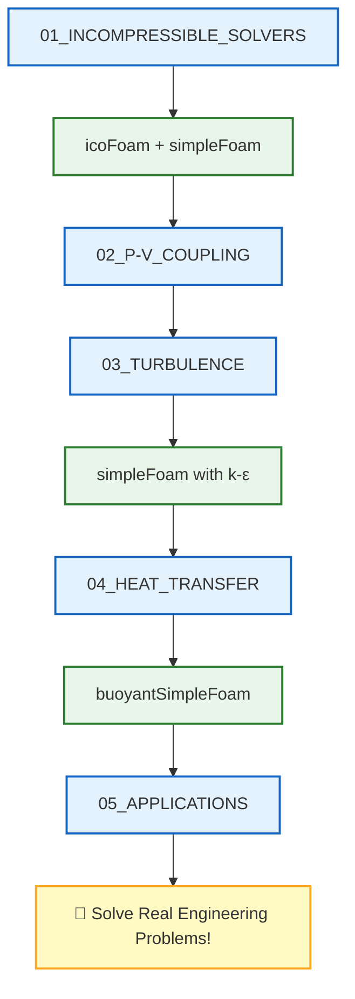

# 🗺️ Learning Navigator: Single Phase Flow

> **วัตถุประสงค์**: เอกสารนี้เป็น **เส้นทางการเรียนรู้แบบคู่ขนาน** ที่เชื่อมโยงเนื้อหาทฤษฎีการไหลเฟสเดียวกับ Solvers จริงใน OpenFOAM

---

## 📋 สารบัญ

1. [Incompressible Flow Solvers](#1-incompressible-flow-solvers)
2. [Pressure-Velocity Coupling](#2-pressure-velocity-coupling)
3. [Turbulence Modeling](#3-turbulence-modeling)
4. [Heat Transfer](#4-heat-transfer)
5. [Practical Applications](#5-practical-applications)
6. [Validation and Verification](#6-validation-and-verification)
7. [Advanced Topics](#7-advanced-topics)

---

## 1. Incompressible Flow Solvers

| 📖 เนื้อหา | 📝 คำอธิบาย | 🔧 Source Code ที่เกี่ยวข้อง |
|-----------|------------|---------------------------|
| [[01_INCOMPRESSIBLE_FLOW_SOLVERS/00_Overview]] | ภาพรวม Solvers | `solvers/incompressible/` |
| [[01_INCOMPRESSIBLE_FLOW_SOLVERS/01_Introduction]] | แนะนำการไหลแบบอัดตัวไม่ได้ | `solvers/incompressible/icoFoam/icoFoam.C` |
| [[01_INCOMPRESSIBLE_FLOW_SOLVERS/02_Standard_Solvers]] | Solvers มาตรฐาน | `solvers/incompressible/simpleFoam/` |
| [[01_INCOMPRESSIBLE_FLOW_SOLVERS/03_Simulation_Control]] | การควบคุม Simulation | `solvers/incompressible/pimpleFoam/` |

### 🎯 Study Guide

| ขั้นตอน | กิจกรรม | เวลาโดยประมาณ |
|--------|---------|--------------|
| 1 | อ่าน `00_Overview` เข้าใจ solver families | 20 นาที |
| 2 | เปิด `icoFoam.C` ศึกษาโครงสร้างพื้นฐาน | 30 นาที |
| 3 | เปรียบเทียบ `simpleFoam` vs `pimpleFoam` | 30 นาที |

---

## 2. Pressure-Velocity Coupling

| 📖 เนื้อหา | 📝 คำอธิบาย | 🔧 Source Code ที่เกี่ยวข้อง |
|-----------|------------|---------------------------|
| [[02_PRESSURE_VELOCITY_COUPLING/00_Overview]] | ภาพรวม P-V Coupling | `solvers/incompressible/` |
| [[02_PRESSURE_VELOCITY_COUPLING/01_Mathematical_Foundation]] | รากฐานทางคณิตศาสตร์ | `solvers/incompressible/icoFoam/icoFoam.C` |
| [[02_PRESSURE_VELOCITY_COUPLING/02_SIMPLE_Algorithm]] | อัลกอริทึม SIMPLE | `solvers/incompressible/simpleFoam/simpleFoam.C` |
| [[02_PRESSURE_VELOCITY_COUPLING/03_PISO_and_PIMPLE_Algorithms]] | PISO และ PIMPLE | `solvers/incompressible/pimpleFoam/pimpleFoam.C` |
| [[02_PRESSURE_VELOCITY_COUPLING/04_Rhie_Chow_Interpolation]] | Rhie-Chow Interpolation | `solvers/incompressible/` |
| [[02_PRESSURE_VELOCITY_COUPLING/05_Algorithm_Comparison]] | เปรียบเทียบ Algorithms | - |

---

## 3. Turbulence Modeling

| 📖 เนื้อหา | 📝 คำอธิบาย | 🔧 Source Code ที่เกี่ยวข้อง |
|-----------|------------|---------------------------|
| [[03_TURBULENCE_MODELING/00_Overview]] | ภาพรวม Turbulence | `solvers/incompressible/simpleFoam/` |
| [[03_TURBULENCE_MODELING/01_Turbulence_Fundamentals]] | พื้นฐาน Turbulence | `solvers/incompressible/pisoFoam/` |
| [[03_TURBULENCE_MODELING/02_RANS_Models]] | โมเดล RANS (k-ε, k-ω) | `solvers/incompressible/simpleFoam/` |
| [[03_TURBULENCE_MODELING/03_Wall_Treatment]] | Wall Functions | `solvers/incompressible/simpleFoam/` |
| [[03_TURBULENCE_MODELING/04_LES_Fundamentals]] | พื้นฐาน LES | `solvers/incompressible/pimpleFoam/` |

---

## 4. Heat Transfer

| 📖 เนื้อหา | 📝 คำอธิบาย | 🔧 Source Code ที่เกี่ยวข้อง |
|-----------|------------|---------------------------|
| [[04_HEAT_TRANSFER/00_Overview]] | ภาพรวม Heat Transfer | `solvers/heatTransfer/` |
| [[04_HEAT_TRANSFER/01_Energy_Equation_Fundamentals]] | สมการพลังงาน | `solvers/heatTransfer/buoyantSimpleFoam/` |
| [[04_HEAT_TRANSFER/02_Heat_Transfer_Mechanisms]] | กลไกการถ่ายเทความร้อน | `solvers/heatTransfer/buoyantPimpleFoam/` |
| [[04_HEAT_TRANSFER/03_Buoyancy_Driven_Flows]] | การไหลแบบ Buoyancy | `solvers/heatTransfer/buoyantBoussinesqSimpleFoam/` |
| [[04_HEAT_TRANSFER/04_Conjugate_Heat_Transfer]] | CHT | `solvers/heatTransfer/chtMultiRegionFoam/` |

---

## 5. Practical Applications

| 📖 เนื้อหา | 📝 คำอธิบาย | 🔧 Source Code ที่เกี่ยวข้อง |
|-----------|------------|---------------------------|
| [[05_PRACTICAL_APPLICATIONS/00_Overview]] | ภาพรวมการประยุกต์ใช้ | - |
| [[05_PRACTICAL_APPLICATIONS/01_External_Aerodynamics]] | อากาศพลศาสตร์ภายนอก | `solvers/incompressible/simpleFoam/` |
| [[05_PRACTICAL_APPLICATIONS/02_Internal_Flow_and_Piping]] | การไหลภายในและระบบท่อ | `solvers/incompressible/pimpleFoam/` |
| [[05_PRACTICAL_APPLICATIONS/03_Heat_Exchangers]] | เครื่องแลกเปลี่ยนความร้อน | `solvers/heatTransfer/` |

---

## 6. Validation and Verification

| 📖 เนื้อหา | 📝 คำอธิบาย | 🔧 Source Code ที่เกี่ยวข้อง |
|-----------|------------|---------------------------|
| [[06_VALIDATION_AND_VERIFICATION/00_Overview]] | ภาพรวม V&V | - |
| [[06_VALIDATION_AND_VERIFICATION/01_V_and_V_Principles]] | หลักการ V&V | - |
| [[06_VALIDATION_AND_VERIFICATION/02_Mesh_Independence]] | Mesh Independence Study | `utilities/mesh/manipulation/checkMesh/` |
| [[06_VALIDATION_AND_VERIFICATION/03_Experimental_Validation]] | การเปรียบเทียบกับการทดลอง | - |

---

## 7. Advanced Topics

| 📖 เนื้อหา | 📝 คำอธิบาย | 🔧 Source Code ที่เกี่ยวข้อง |
|-----------|------------|---------------------------|
| [[07_ADVANCED_TOPICS/00_Overview]] | ภาพรวมหัวข้อขั้นสูง | - |
| [[07_ADVANCED_TOPICS/01_High_Performance_Computing]] | HPC และ Parallel | `utilities/parallelProcessing/` |
| [[07_ADVANCED_TOPICS/02_Advanced_Turbulence]] | Turbulence ขั้นสูง | `solvers/DNS/` |
| [[07_ADVANCED_TOPICS/03_Numerical_Methods]] | วิธีเชิงตัวเลขขั้นสูง | `solvers/incompressible/` |
| [[07_ADVANCED_TOPICS/04_Multiphysics]] | ปัญหา Multiphysics | `solvers/heatTransfer/` |

---

## 📁 OpenFOAM Solver Structure

```
applications/solvers/
├── incompressible/
│   ├── icoFoam/           ← 🌟 Laminar, transient
│   ├── simpleFoam/        ← 🌟 Steady-state RANS
│   ├── pimpleFoam/        ← 🌟 Transient RANS/LES
│   ├── pisoFoam/          ← Transient PISO
│   └── adjointShapeOptimisationFoam/
│
├── heatTransfer/
│   ├── buoyantSimpleFoam/     ← Steady buoyancy
│   ├── buoyantPimpleFoam/     ← Transient buoyancy
│   └── chtMultiRegionFoam/    ← Conjugate heat transfer
│
└── DNS/                   ← Direct Numerical Simulation
```

---

## 🎓 Learning Path



---

*Last Updated: 2025-12-26*
