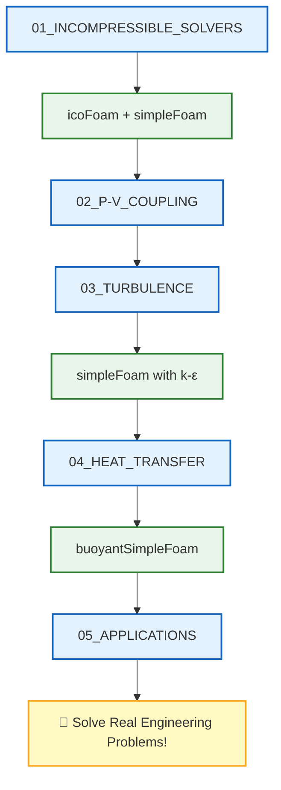

# 🗺️ Learning Navigator: Single Phase Flow

> [!TIP] ## ทำไมเราต้องเรียนรู้ Single Phase Flow?
> การไหลแบบเฟสเดียว (Single Phase Flow) เป็น **พื้นฐานที่สำคัญที่สุด** ในการจำลอง CFD ด้วย OpenFOAM เนื่องจาก:
> - **Solvers ส่วนใหญ่** ใน OpenFOAM ถูกออกแบบมาสำหรับปัญหานี้ (เช่น `simpleFoam`, `pimpleFoam`, `icoFoam`)
> - การทำความเข้าใจ **Pressure-Velocity Coupling** และ **Turbulence Modeling** จะช่วยให้เลือก Solver ที่เหมาะสมกับปัญหา
> - **Numerical Schemes** และ **Solver Settings** ที่ถูกต้องจะช่วยให้ Simulation ที่ **Converge** และ **Stable**
>
> ถ้าไม่เข้าใจหัวข้อนี้ คุณอาจเจอปัญหา:
> - Simulation **Diverge** หรือไม่ Converge
> - ผลลัพธ์ไม่ **Physically realistic** (เช่น ค่าที่ไม่สมเหตุสมผล)
> - ใช้เวลา **Compute** นานเกินไป

> **วัตถุประสงค์**: เอกสารนี้เป็น **เส้นทางการเรียนรู้แบบคู่ขนาน** ที่เชื่อมโยงเนื้อหาทฤษฎีการไหลเฟสเดียวกับ Solvers จริงใน OpenFOAM

---

## 📋 สารบัญ

1. [Incompressible Flow Solvers](#1-incompressible-flow-solvers)
2. [Pressure-Velocity Coupling](#2-pressure-velocity-coupling)
3. [Turbulence Modeling](#3-turbulence-modeling)
4. [Heat Transfer](#4-heat-transfer)
5. [Practical Applications](#5-practical-applications)
6. [Validation and Verification](#6-validation-and-verification)
7. [Advanced Topics](#7-advanced-topics)

---

## 1. Incompressible Flow Solvers

> [!NOTE] ## 📂 OpenFOAM Context: Solver Selection
> หัวข้อนี้เกี่ยวข้องกับ **Domain C: Simulation Control** และ **Domain E: Coding/Customization**
>
> **สิ่งที่คุณต้องรู้ใน OpenFOAM:**
> - **File:** `system/controlDict` → ระบุ `application` ที่ต้องการใช้ (เช่น `simpleFoam`, `pimpleFoam`)
> - **Keywords:** `application`, `startFrom`, `startTime`, `stopAt`, `endTime`
> - **Solver Families:**
>   - `icoFoam` → Laminar, transient (PISO)
>   - `simpleFoam` → Steady-state RANS (SIMPLE)
>   - `pimpleFoam` → Transient RANS/LES (PIMPLE)
>   - `pisoFoam` → Transient (PISO)
>
> **ตัวอย่างการตั้งค่าใน `controlDict`:**
> ```cpp
> application     simpleFoam;
> startFrom       startTime;
> startTime       0;
> stopAt          endTime;
> endTime         1000;
> ```

| 📖 เนื้อหา | 📝 คำอธิบาย | 🔧 Source Code ที่เกี่ยวข้อง |
|-----------|------------|---------------------------|
| [[01_INCOMPRESSIBLE_FLOW_SOLVERS/00_Overview]] | ภาพรวม Solvers | `solvers/incompressible/` |
| [[01_INCOMPRESSIBLE_FLOW_SOLVERS/01_Introduction]] | แนะนำการไหลแบบอัดตัวไม่ได้ | `solvers/incompressible/icoFoam/icoFoam.C` |
| [[01_INCOMPRESSIBLE_FLOW_SOLVERS/02_Standard_Solvers]] | Solvers มาตรฐาน | `solvers/incompressible/simpleFoam/` |
| [[01_INCOMPRESSIBLE_FLOW_SOLVERS/03_Simulation_Control]] | การควบคุม Simulation | `solvers/incompressible/pimpleFoam/` |

### 🎯 Study Guide

| ขั้นตอน | กิจกรรม | เวลาโดยประมาณ |
|--------|---------|--------------|
| 1 | อ่าน `00_Overview` เข้าใจ solver families | 20 นาที |
| 2 | เปิด `icoFoam.C` ศึกษาโครงสร้างพื้นฐาน | 30 นาที |
| 3 | เปรียบเทียบ `simpleFoam` vs `pimpleFoam` | 30 นาที |

---

## 2. Pressure-Velocity Coupling

> [!NOTE] ## 📂 OpenFOAM Context: Numerical Algorithms
> หัวข้อนี้เกี่ยวข้องกับ **Domain B: Numerics & Linear Algebra** และ **Domain C: Simulation Control**
>
> **สิ่งที่คุณต้องรู้ใน OpenFOAM:**
> - **File:** `system/fvSolution` → ควบคุม Pressure-Velocity Coupling algorithms
> - **Keywords:**
>   - `SIMPLE` → สำหรับ `simpleFoam` (Steady-state)
>   - `PISO` → สำหรับ `icoFoam`, `pisoFoam` (Transient)
>   - `PIMPLE` → สำหรับ `pimpleFoam` (Hybrid)
>   - `nCorrectors`, `nNonOrthogonalCorrectors`, `pRefCell`, `pRefValue`
> - **File:** `system/fvSchemes` → ควบคุม Discretization schemes
>   - `ddtSchemes` → Temporal discretization
>   - `gradSchemes` → Gradient calculation
>   - `divSchemes` → Convection terms
>   - `laplacianSchemes` → Diffusion terms
>
> **ตัวอย่างการตั้งค่าใน `fvSolution` (SIMPLE):**
> ```cpp
> SIMPLE
> {
>     nCorrectors     2;
>     nNonOrthogonalCorrectors 0;
>     pRefCell        0;
>     pRefValue       0;
> }
>
> solvers
> {
>     p
>     {
>         solver          GAMG;
>         tolerance       1e-06;
>         relTol          0.1;
>     }
> }
> ```

| 📖 เนื้อหา | 📝 คำอธิบาย | 🔧 Source Code ที่เกี่ยวข้อง |
|-----------|------------|---------------------------|
| [[02_PRESSURE_VELOCITY_COUPLING/00_Overview]] | ภาพรวม P-V Coupling | `solvers/incompressible/` |
| [[02_PRESSURE_VELOCITY_COUPLING/01_Mathematical_Foundation]] | รากฐานทางคณิตศาสตร์ | `solvers/incompressible/icoFoam/icoFoam.C` |
| [[02_PRESSURE_VELOCITY_COUPLING/02_SIMPLE_Algorithm]] | อัลกอริทึม SIMPLE | `solvers/incompressible/simpleFoam/simpleFoam.C` |
| [[02_PRESSURE_VELOCITY_COUPLING/03_PISO_and_PIMPLE_Algorithms]] | PISO และ PIMPLE | `solvers/incompressible/pimpleFoam/pimpleFoam.C` |
| [[02_PRESSURE_VELOCITY_COUPLING/04_Rhie_Chow_Interpolation]] | Rhie-Chow Interpolation | `solvers/incompressible/` |
| [[02_PRESSURE_VELOCITY_COUPLING/05_Algorithm_Comparison]] | เปรียบเทียบ Algorithms | - |

---

## 3. Turbulence Modeling

> [!NOTE] ## 📂 OpenFOAM Context: Turbulence Properties
> หัวข้อนี้เกี่ยวข้องกับ **Domain A: Physics & Fields** และ **Domain D: Meshing**
>
> **สิ่งที่คุณต้องรู้ใน OpenFOAM:**
> - **File:** `constant/turbulenceProperties` → ระบุ Turbulence model
>   - Keywords: `simulationType` (RAS, LES, DNS), `RASModel`, `LESModel`
> - **File:** `constant/transportProperties` → คุณสมบัติของ Fluid
>   - Keywords: `transportModel` (Newtonian), `nu` (Kinematic viscosity)
> - **File:** `0/` directory → Boundary & Initial conditions สำหรับ Turbulence fields
>   - Fields: `k` (Turbulent kinetic energy), `epsilon`/`omega` (Dissipation), `nut` (Turbulent viscosity)
> - **File:** `system/fvSchemes` → Discretization สำหรับ Turbulence terms
>   - Keywords: `divSchemes` → `div(phi,k)`, `div(phi,epsilon)`
>
> **ตัวอย่างการตั้งค่าใน `turbulenceProperties`:**
> ```cpp
> simulationType RAS;
>
> RAS
> {
>     RASModel        kEpsilon;
>     turbulence      on;
>     printCoeffs     on;
> }
> ```
>
> **ตัวอย่าง Boundary Conditions สำหรับ `k` ใน `0/k`:**
> ```cpp
> dimensions      [0 2 -2 0 0 0 0];
>
> internalField   uniform 0.1;
>
> boundaryField
> {
>     inlet
>     {
>         type            fixedValue;
>         value           uniform 0.5;
>     }
>     outlet
>     {
>         type            zeroGradient;
>     }
>     walls
>     {
>         type            kqRWallFunction;
>         value           uniform 0;
>     }
> }
> ```

| 📖 เนื้อหา | 📝 คำอธิบาย | 🔧 Source Code ที่เกี่ยวข้อง |
|-----------|------------|---------------------------|
| [[03_TURBULENCE_MODELING/00_Overview]] | ภาพรวม Turbulence | `solvers/incompressible/simpleFoam/` |
| [[03_TURBULENCE_MODELING/01_Turbulence_Fundamentals]] | พื้นฐาน Turbulence | `solvers/incompressible/pisoFoam/` |
| [[03_TURBULENCE_MODELING/02_RANS_Models]] | โมเดล RANS (k-ε, k-ω) | `solvers/incompressible/simpleFoam/` |
| [[03_TURBULENCE_MODELING/03_Wall_Treatment]] | Wall Functions | `solvers/incompressible/simpleFoam/` |
| [[03_TURBULENCE_MODELING/04_LES_Fundamentals]] | พื้นฐาน LES | `solvers/incompressible/pimpleFoam/` |

---

## 4. Heat Transfer

> [!NOTE] ## 📂 OpenFOAM Context: Thermal Properties
> หัวข้อนี้เกี่ยวข้องกับ **Domain A: Physics & Fields** และ **Domain B: Numerics**
>
> **สิ่งที่คุณต้องรู้ใน OpenFOAM:**
> - **File:** `constant/thermophysicalProperties` → คุณสมบัติทาง Thermodynamics
>   - Keywords: `thermoType`, `mixture`, `transport`, `thermo`, `equationOfState`, `specie`, `energy`
> - **File:** `0/` directory → Thermal fields
>   - Fields: `T` (Temperature), `p` (Pressure), `h` (Enthalpy)
> - **File:** `constant/turbulenceProperties` → สำหรับ Buoyancy-driven flows
>   - Keywords: `turbulence` (on/off), `printCoeffs`
> - **File:** `system/fvSchemes` → Discretization สำหรับ Energy equation
>   - Keywords: `divSchemes` → `div(phi,T)`, `laplacianSchemes` → `laplacian(alpha,T)`
> - **File:** `system/fvSolution` → Solver settings สำหรับ Thermal problems
>   - Keywords: `solvers` → `T`, `h`
>
> **ตัวอย่างการตั้งค่าใน `thermophysicalProperties`:**
> ```cpp
> thermoType
> {
>     type            heRhoThermo;
>     mixture         pureMixture;
>     transport       const;
>     thermo          hConst;
>     equationOfState perfectGas;
>     specie          specie;
>     energy          sensibleEnthalpy;
> }
>
> mixture
> {
>     specie
>     {
>         nMoles          1;
>         molWeight       28.9;
>     }
>     thermodynamics
>     {
>         Cp              1007;
>         Hf              0;
>     }
>     transport
>     {
>         mu              1.8e-05;
>         Pr              0.7;
>     }
> }
> ```

| 📖 เนื้อหา | 📝 คำอธิบาย | 🔧 Source Code ที่เกี่ยวข้อง |
|-----------|------------|---------------------------|
| [[04_HEAT_TRANSFER/00_Overview]] | ภาพรวม Heat Transfer | `solvers/heatTransfer/` |
| [[04_HEAT_TRANSFER/01_Energy_Equation_Fundamentals]] | สมการพลังงาน | `solvers/heatTransfer/buoyantSimpleFoam/` |
| [[04_HEAT_TRANSFER/02_Heat_Transfer_Mechanisms]] | กลไกการถ่ายเทความร้อน | `solvers/heatTransfer/buoyantPimpleFoam/` |
| [[04_HEAT_TRANSFER/03_Buoyancy_Driven_Flows]] | การไหลแบบ Buoyancy | `solvers/heatTransfer/buoyantBoussinesqSimpleFoam/` |
| [[04_HEAT_TRANSFER/04_Conjugate_Heat_Transfer]] | CHT | `solvers/heatTransfer/chtMultiRegionFoam/` |

---

## 5. Practical Applications

> [!NOTE] ## 📂 OpenFOAM Context: Real-World Case Setup
> หัวข้อนี้เกี่ยวข้องกับ **Domain A, B, C, D: All Domains** (การประยุกต์ใช้ในสถานการณ์จริง)
>
> **สิ่งที่คุณต้องรู้ใน OpenFOAM:**
> - **File:** `0/` directory → Boundary conditions ที่เหมาะสมกับปัญหา
>   - Keywords: `inlet` (velocityFixedValue, flowRateInletVelocity), `outlet` (zeroGradient, fixedValue), `walls` (noSlip, wallFunction)
> - **File:** `system/controlDict` → Runtime monitoring และ Output control
>   - Keywords: `application`, `writeControl`, `writeInterval`, `purgeWrite`, `functions`
> - **File:** `system/fvSchemes` → Discretization ที่เหมาะสมกับปัญหา
>   - Keywords: `divSchemes` → `div(phi,U)` (Gauss linearUpwind, Gauss limitedLinearV)
> - **File:** `constant/transportProperties` → Physical properties ของ Fluid
>   - Keywords: `nu` (Viscosity), `rho` (Density)
>
> **ตัวอย่าง Function Object สำหรับ Monitoring ใน `controlDict`:**
> ```cpp
> functions
> {
>     forces
>     {
>         type            forces;
>         functionObjectLibs ("libforces.so");
>         writeControl    timeStep;
>         writeInterval   1;
>         patches         (cylinder);
>         rho             rhoInf;
>         rhoInf          1.225;
>         CofR            (0 0 0);
>         pitchAxis       (0 1 0);
>     }
>
>     probes
>     {
>         type            probes;
>         functionObjectLibs ("libsampling.so");
>         writeControl    timeStep;
>         writeInterval   1;
>         probeLocations
>         (
>             (0.1 0 0)
>             (0.2 0 0)
>             (0.3 0 0)
>         );
>         fields          (p U);
>     }
> }
> ```

| 📖 เนื้อหา | 📝 คำอธิบาย | 🔧 Source Code ที่เกี่ยวข้อง |
|-----------|------------|---------------------------|
| [[05_PRACTICAL_APPLICATIONS/00_Overview]] | ภาพรวมการประยุกต์ใช้ | - |
| [[05_PRACTICAL_APPLICATIONS/01_External_Aerodynamics]] | อากาศพลศาสตร์ภายนอก | `solvers/incompressible/simpleFoam/` |
| [[05_PRACTICAL_APPLICATIONS/02_Internal_Flow_and_Piping]] | การไหลภายในและระบบท่อ | `solvers/incompressible/pimpleFoam/` |
| [[05_PRACTICAL_APPLICATIONS/03_Heat_Exchangers]] | เครื่องแลกเปลี่ยนความร้อน | `solvers/heatTransfer/` |

---

## 6. Validation and Verification

> [!NOTE] ## 📂 OpenFOAM Context: Quality Assurance
> หัวข้อนี้เกี่ยวข้องกับ **Domain B: Numerics** และ **Domain C: Simulation Control**
>
> **สิ่งที่คุณต้องรู้ใน OpenFOAM:**
> - **File:** `system/controlDict` → Convergence criteria และ Monitoring
>   - Keywords: `residuals`, `convergence`, `writeControl`, `writeInterval`
> - **Utility:** `checkMesh` → ตรวจสอบคุณภาพของ Mesh
>   - Command: `checkMesh -allTopology -allGeometry`
> - **Utility:** `foamListTimes` → ตรวจสอบ Time directories
> - **File:** `log.` files → Log files สำหรับ Monitoring convergence
>   - Check: `Initial residual`, `Final residual`, `Iterations`
> - **File:** `system/fvSolution` → Solver tolerances
>   - Keywords: `tolerance`, `relTol`, `solver`
>
> **ตัวอย่าง Function Object สำหรับ Residual Monitoring:**
> ```cpp
> functions
> {
>     residuals
>     {
>         type            residuals;
>         functionObjectLibs ("libutilityFunctionObjects.so");
>         writeControl    timeStep;
>         writeInterval   1;
>         fields          (p U k epsilon);
>         field           0.001;
>     }
>
>     convergenceCheck
>     {
>         type            sets;
>         functionObjectLibs ("libsampling.so");
>         writeControl    timeStep;
>         writeInterval   1;
>         setFormat       raw;
>         sets
>         (
>             centerline
>         );
>         fields          (p U);
>     }
> }
> ```

| 📖 เนื้อหา | 📝 คำอธิบาย | 🔧 Source Code ที่เกี่ยวข้อง |
|-----------|------------|---------------------------|
| [[06_VALIDATION_AND_VERIFICATION/00_Overview]] | ภาพรวม V&V | - |
| [[06_VALIDATION_AND_VERIFICATION/01_V_and_V_Principles]] | หลักการ V&V | - |
| [[06_VALIDATION_AND_VERIFICATION/02_Mesh_Independence]] | Mesh Independence Study | `utilities/mesh/manipulation/checkMesh/` |
| [[06_VALIDATION_AND_VERIFICATION/03_Experimental_Validation]] | การเปรียบเทียบกับการทดลอง | - |

---

## 7. Advanced Topics

> [!NOTE] ## 📂 OpenFOAM Context: Advanced Features
> หัวข้อนี้เกี่ยวข้องกับ **Domain E: Coding/Customization** และ **Domain B: Numerics**
>
> **สิ่งที่คุณต้องรู้ใน OpenFOAM:**
> - **File:** `system/decomposeParDict` → Parallel processing setup
>   - Keywords: `numberOfSubdomains`, `method` (scotch, metis, hierarchical), `coeffs`
> - **File:** `Make/` directory → Custom solver compilation
>   - Files: `Make/files`, `Make/options`
> - **Directory:** `src/` → Source code structure
>   - Paths: `src/finiteVolume/`, `src/transportModels/`, `src/turbulenceModels/`
> - **File:** `system/fvSchemes` → Advanced discretization
>   - Keywords: `divSchemes` (High-resolution schemes), `interpolationSchemes`
> - **File:** `system/fvSolution` → Advanced linear solvers
>   - Keywords: `solver` (GAMG, PBiCGStab, smoothSolver), `preconditioner` (DIC, DILU, GAMG)
> - **File:** `Allrun`, `Allclean` → Automation scripts
>
> **ตัวอย่างการตั้งค่าใน `decomposeParDict`:**
> ```cpp
> numberOfSubdomains 4;
>
> method hierarchical;
>
> coeffs
> {
>     n               (2 2 1);
>     delta           0.001;
> }
>
> // หรือใช้ method scotch;
> // method scotch;
> ```
>
> **ตัวอย่างการสร้าง Custom Solver (Make/files):**
> ```cpp
> myCustomFoam.C
>
> EXE =1$(FOAM_USER_APPBIN)/myCustomFoam
> ```
>
> **ตัวอย่าง Advanced Solver Settings:**
> ```cpp
> solvers
> {
>     p
>     {
>         solver          GAMG;
>         tolerance       1e-08;
>         relTol          0.05;
>         smoother        GaussSeidel;
>         nPreSweeps      0;
>         nPostSweeps     2;
>         cacheAgglomeration on;
>         agglomerator    faceAreaPair;
>         nCellsInCoarsestLevel 10;
>         mergeLevels     1;
>     }
>
>     "(U|k|epsilon)"
>     {
>         solver          PBiCGStab;
>         preconditioner  DILU;
>         tolerance       1e-05;
>         relTol          0.1;
>     }
> }
> ```

| 📖 เนื้อหา | 📝 คำอธิบาย | 🔧 Source Code ที่เกี่ยวข้อง |
|-----------|------------|---------------------------|
| [[07_ADVANCED_TOPICS/00_Overview]] | ภาพรวมหัวข้อขั้นสูง | - |
| [[07_ADVANCED_TOPICS/01_High_Performance_Computing]] | HPC และ Parallel | `utilities/parallelProcessing/` |
| [[07_ADVANCED_TOPICS/02_Advanced_Turbulence]] | Turbulence ขั้นสูง | `solvers/DNS/` |
| [[07_ADVANCED_TOPICS/03_Numerical_Methods]] | วิธีเชิงตัวเลขขั้นสูง | `solvers/incompressible/` |
| [[07_ADVANCED_TOPICS/04_Multiphysics]] | ปัญหา Multiphysics | `solvers/heatTransfer/` |

---

## 📁 OpenFOAM Solver Structure

```
applications/solvers/
├── incompressible/
│   ├── icoFoam/           ← 🌟 Laminar, transient
│   ├── simpleFoam/        ← 🌟 Steady-state RANS
│   ├── pimpleFoam/        ← 🌟 Transient RANS/LES
│   ├── pisoFoam/          ← Transient PISO
│   └── adjointShapeOptimisationFoam/
│
├── heatTransfer/
│   ├── buoyantSimpleFoam/     ← Steady buoyancy
│   ├── buoyantPimpleFoam/     ← Transient buoyancy
│   └── chtMultiRegionFoam/    ← Conjugate heat transfer
│
└── DNS/                   ← Direct Numerical Simulation
```

---

## 🎓 Learning Path



---

*Last Updated: 2025-12-26*
