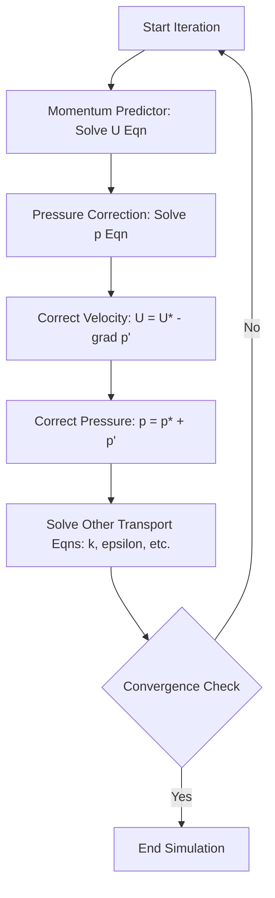

# **Incompressible Flow Solvers ใน OpenFOAM: ภาพรวมและพื้นฐานทางเทคนิค**

> [!INFO] **ภาพรวมโมดูล**
> โมดูลนี้สำรวจรากฐานทางทฤษฎี อัลกอริทึมเชิงตัวเลข และการนำไปใช้งานจริงของ **incompressible flow solvers** ใน OpenFOAM ซึ่งเป็นรากฐานสำคัญของการจำลอง CFD เมื่อความหนาแน่นของของไหลคงที่ ($Ma < 0.3$)

---

## 🎯 วัตถุประสงค์การเรียนรู้ (Learning Objectives)

เมื่อจบโมดูลนี้ คุณจะสามารถ:

1. **ระบุ Solver ที่เหมาะสม**: เลือก OpenFOAM Solver ที่ถูกต้องสำหรับปัญหาการไหลที่กำหนด (Steady vs Transient, Laminar vs Turbulent)
2. **กำหนดค่า `fvSolution`**: ตั้งค่า Linear Solver, Tolerance และอ้างอิง Algorithm (SIMPLE, PISO, PIMPLE) ได้อย่างถูกต้อง
3. **ตรวจสอบการลู่เข้า (Convergence)**: ตรวจสอบและตีความ Residuals และปริมาณทางกายภาพ (Drag, Lift, Pressure Drop)
4. **แก้ไขปัญหา (Troubleshooting)**: วินิจฉัยและแก้ไขปัญหาการลู่ออก (Divergence) หรือการลู่เข้าช้า
5. **ตั้งค่า Case พื้นฐาน**: จัดการโครงสร้าง Directory (`0/`, `constant/`, `system/`) สำหรับการไหลแบบอัดตัวไม่ได้

---

## 🌊 1. พื้นฐานทางฟิสิกส์และสมมติฐาน (Physical Foundations)

### 1.1 สมมติฐานการไหลแบบอัดตัวไม่ได้ (Incompressibility Assumption)

**สมมติฐานการไหลแบบอัดตัวไม่ได้** เป็นการทำให้ง่ายขึ้นขั้นพื้นฐานในพลศาสตร์ของไหล ซึ่งถือว่าความหนาแน่นของของไหลคงที่ตลอดสนามการไหล

Incompressible flow ถือว่าความหนาแน่นของของไหล ($\rho$) คงที่ตลอดสนามการไหล:
$$\frac{D\rho}{Dt} = 0 \quad \Rightarrow \quad \rho = \text{constant}$$

**เงื่อนไขความเหมาะสม:**
- **Mach Number** ($Ma$) < 0.3
- ความแปรผันของความดันและอุณหภูมิไม่ส่งผลต่อความหนาแน่นอย่างมีนัยสำคัญ

ในทางคณิตศาสตร์ สมมติฐานนี้ทำให้สมการความต่อเนื่องง่ายขึ้นจาก:
$$\frac{\partial \rho}{\partial t} + \nabla \cdot (\rho \mathbf{u}) = 0$$

ไปสู่รูปแบบที่ง่ายกว่า:
$$\nabla \cdot \mathbf{u} = 0$$

เงื่อนไขที่ไม่มี Divergence นี้หมายความว่าอัตราการไหลเชิงปริมาตรที่เข้าสู่ปริมาตรควบคุมใด ๆ จะต้องเท่ากับอัตราการไหลเชิงปริมาตรที่ออกจากปริมาตรควบคุมนั้น

### 1.2 สมการควบคุม (Governing Equations)

**สมการความต่อเนื่อง (Continuity Equation):**
$$\nabla \cdot \mathbf{u} = 0$$

**สมการโมเมนตัม (Momentum Equation):**
$$\rho \frac{\partial \mathbf{u}}{\partial t} + \rho (\mathbf{u} \cdot \nabla) \mathbf{u} = -\nabla p + \mu \nabla^2 \mathbf{u} + \mathbf{f}$$

**นิยามตัวแปร:**
- $\mathbf{u}$: Velocity vector $[m/s]$
- $p$: Pressure $[Pa]$
- $\rho$: Density (คงที่) $[kg/m^3]$
- $\mu$: Dynamic viscosity $[Pa \cdot s]$
- $\mathbf{f}$: Body forces $[N/m^3]$

### 1.3 การทำให้ไร้มิติ (Non-dimensionalization)

สำหรับการวิเคราะห์ Incompressible flow เรามักใช้ Reynolds number:
$$\Re = \frac{\rho U L}{\mu} = \frac{U L}{\nu}$$

โดยที่ $\nu = \mu/\rho$ คือ ความหนืดจลนศาสตร์ (kinematic viscosity)

---

## ⚙️ 2. อัลกอริทึมการเชื่อมโยงความดัน-ความเร็ว (Pressure-Velocity Coupling)

OpenFOAM ใช้อัลกอริทึมแบบ Segregated เพื่อแก้ปัญหาความท้าทายที่ไม่มีสมการความดันโดยตรง

### 2.1 ความท้าทายในการเชื่อมโยงความดัน-ความเร็ว

**การเชื่อมโยงความดัน-ความเร็ว** เป็นความท้าทายที่สำคัญในการจำลองการไหลแบบอัดตัวไม่ได้ เนื่องจากสมการความต่อเนื่องมีเพียงความเร็วเท่านั้น ในขณะที่สมการโมเมนตัมมีทั้งความดันและความเร็ว

**การพึ่งพาแบบวงกลม:**
1. **ความดัน** ส่งผลต่อ **ความเร็ว** ผ่านสมการโมเมนตัม
2. **ความเร็ว** ส่งผลต่อ **ความดัน** ผ่านสมการความต่อเนื่อง

**ความท้าทายหลัก:**
- **Pressure gradient** $-\nabla p$ เป็นตัวขับเคลื่อนการเร่งความเร็วของของไหล
- ไม่มี **explicit evolution equation** สำหรับ pressure
- **Continuity equation** ($\nabla \cdot \mathbf{u} = 0$) ให้ข้อจำกัดที่เชื่อมโยง velocity และ pressure

### 2.2 เปรียบเทียบอัลกอริทึมหลัก

| Algorithm | ประเภทปัญหา | ลักษณะเด่น |
|-----------|-----------|-----------|
| **SIMPLE** | Steady-state | ใช้ Under-relaxation เพื่อความเสถียร |
| **PISO** | Transient | แก้สมการความดันหลายรอบต่อ Time Step เพื่อ Temporal Accuracy |
| **PIMPLE** | Transient (Hybrid) | รวมข้อดีของ PISO และ SIMPLE รองรับ Large Time Steps ($Co > 1$) |

#### SIMPLE Algorithm (Steady-state)

**Semi-Implicit Method for Pressure-Linked Equations**

**ขั้นตอนการทำงาน:**
1. **การทำนายโมเมนตัม**: แก้สมการโมเมนตัมโดยใช้ความดันจากการวนซ้ำครั้งก่อน
2. **การแก้ไขความดัน**: แก้สมการการแก้ไขความดัน
3. **การแก้ไขความเร็ว**: อัปเดตสนามความเร็วโดยใช้การแก้ไขความดัน
4. **การตรวจสอบการลู่เข้า**: ทำซ้ำจนกว่าจะลู่เข้า

**OpenFOAM Code Implementation:**
```cpp
// SIMPLE loop in simpleFoam
while (pimple.loop())
{
    // Momentum predictor: Solve momentum equation with turbulence
    tmp<fvVectorMatrix> tUEqn
    (
        fvm::div(phi, U)
      + turbulence->divDevReff(U)
     ==
        fvOptions(U)
    );

    // Pressure-velocity coupling with non-orthogonal correction
    while (pimple.correctNonOrthogonal())
    {
        fvScalarMatrix pEqn
        (
            fvm::laplacian(rAU, p) == fvc::div(phiHbyA)
        );

        // Solve pressure equation
        pEqn.solve();

        // Update flux on final non-orthogonal iteration
        if (pimple.finalNonOrthogonalIter())
        {
            phi -= pEqn.flux();
        }
    }

    // Correct velocity field using pressure gradient
    U -= rAU*fvc::grad(p);
    U.correctBoundaryConditions();
}
```

> **💡 คำอธิบาย (Thai Explanation)**
>
> **แหล่งที่มา (Source):** อัลกอริทึม SIMPLE ถูกนำไปใช้ใน solver ต่างๆ ของ OpenFOAM ที่ต้องการแก้ปัญหา Steady-state โดยเฉพาะ `simpleFoam` สำหรับการไหลแบบ Turbulent
>
> **การอธิบาย (Explanation):** โค้ดนี้แสดงการทำงานของอัลกอริทึม SIMPLE ใน OpenFOAM เริ่มจากการแก้สมการโมเมนตัมเพื่อทำนายความเร็วเบื้องต้น จากนั้นวนลูปเพื่อแก้สมการความดันและแก้ไขความเร็วซ้ำจนกว่าจะลู่เข้า ความพิเศษคือการมี `correctNonOrthogonal()` loop ที่ช่วยจัดการกับ Mesh ที่มีความ Non-orthogonal
>
> **แนวคิดสำคัญ (Key Concepts):**
> - **Momentum Predictor**: การทำนายความเร็วเบื้องต้นจากสมการโมเมนตัม
> - **Pressure Equation**: สมการ Laplacian ของความดันที่ได้จากการแทนที่ความเร็ว
> - **Flux Correction**: การแก้ไข Flux ผ่านหน้า Mesh เพื่อให้สอดคล้องกับสมการความต่อเนื่อง
> - **Under-relaxation**: การใช้ค่าสัมประสิทธิ์ผ่อนคลายเพื่อความเสถียรของการวนซ้ำ

#### PISO Algorithm (Transient)

**Pressure-Implicit with Splitting of Operators algorithm**

**ขั้นตอนการทำงาน:**
1. **การทำนายโมเมนตัม**: คล้ายกับ SIMPLE
2. **การแก้ไขความดัน**: มีการแก้ไขความดันหลายครั้งต่อหนึ่ง Time step
3. **การแก้ไขความเร็ว**: อัปเดตความเร็วหลังจากการแก้ไขความดันแต่ละครั้ง
4. **การแก้ไขแบบ Explicit**: ใช้การแก้ไขแบบ Explicit เพื่อความแม่นยำที่ดีขึ้น

**OpenFOAM Code Implementation:**
```cpp
// PISO loop in icoFoam
while (pimple.loop())
{
    // Momentum equation: Solve for velocity with transient term
    fvVectorMatrix UEqn
    (
        fvm::ddt(U) + fvm::div(phi, U)
      - fvm::laplacian(nu, U)
     ==
        fvc::ddt(phi, U) - fvc::div(phi, U)
    );

    // PISO corrections: Multiple pressure-velocity corrections per timestep
    while (pimple.correct())
    {
        // Pressure equation: Solve for pressure correction
        fvScalarMatrix pEqn
        (
            fvm::laplacian(rAU, p) == fvc::div(phi)
        );

        pEqn.solve();

        // Correct velocity flux using pressure gradient
        phi -= pEqn.flux();
    }

    // Explicit velocity correction: Update final velocity field
    U -= rAU*fvc::grad(p);
    U.correctBoundaryConditions();
}
```

> **💡 คำอธิบาย (Thai Explanation)**
>
> **แหล่งที่มา (Source):** อัลกอริทึม PISO ถูกนำไปใช้ใน `icoFoam` สำหรับการไหลแบบ Laminar Transient และยังเป็นส่วนหนึ่งของ `pimpleFoam` สำหรับการไหลแบบ Turbulent
>
> **การอธิบาย (Explanation):** โค้ดนี้แสดงการทำงานของอัลกอริทึม PISO ซึ่งออกแบบมาสำหรับปัญหา Transient ความแตกต่างหลักจาก SIMPLE คือการมีหลายรอบของการแก้ไขความดัน-ความเร็วต่อ Time step เดียว เพื่อให้ได้ความแม่นยำทางเวลาที่ดีขึ้น
>
> **แนวคิดสำคัญ (Key Concepts):**
> - **Transient Term**: เทอม `fvm::ddt(U)` แสดงถึงการเปลี่ยนแปลงตามเวลา
> - **PISO Loop**: การวนซ้ำหลายครั้งต่อ Time step เพื่อแก้ไขความดันและความเร็ว
> - **Flux Correction**: การแก้ไข Flux ทุกรอบเพื่อให้สอดคล้องกับสมการความต่อเนื่อง
> - **Explicit Correction**: การแก้ไขความเร็วแบบ Explicit หลังจากได้ความดันที่ถูกต้อง

#### PIMPLE Algorithm

**การรวมกันแบบไฮบริดของ SIMPLE และ PISO**

**คุณสมบัติ:**
- ใช้ Under-relaxation แบบ SIMPLE เพื่อความเสถียร
- อนุญาตให้มีการแก้ไขความดันหลายครั้งเหมือน PISO
- เหมาะสำหรับการจำลอง Transient ที่มี Time step ขนาดใหญ่

### 2.3 SIMPLE Algorithm Workflow



> **Figure 1:** แผนผังลำดับขั้นตอนการทำงานของอัลกอริทึม SIMPLE (SIMPLE Algorithm Workflow) สำหรับการแก้ปัญหาการไหลแบบอัดตัวไม่ได้ในสภาวะคงที่ ซึ่งแสดงกระบวนการวนซ้ำตั้งแต่การทำนายโมเมนตัม การแก้ไขความดันและความเร็ว ไปจนถึงการตรวจสอบการลู่เข้า

---

## 🚀 3. Core Incompressible Solvers ใน OpenFOAM

### 3.1 ตารางเปรียบเทียบ Solver หลัก

| Solver | Flow Regime | Algorithm | การใช้งาน |
|--------|-------------|-----------|-----------|
| **icoFoam** | Transient Laminar | PISO | ปัญหาพื้นฐาน, Low Reynolds number |
| **simpleFoam** | Steady Turbulent | SIMPLE | อากาศพลศาสตร์สถานะคงตัว, แรงต้าน/แรงยก |
| **pimpleFoam** | Transient Turbulent | PIMPLE | ปัญหาที่มีการเปลี่ยนแปลงตามเวลา, Mesh เคลื่อนที่ |
| **nonNewtonianIcoFoam** | Transient Non-Newtonian | PISO | ของไหลที่มีความหนืดแปรผันตาม Shear Rate |
| **SRFSimpleFoam** | Steady Rotating Frame | SIMPLE | เครื่องจักรกลหมุน (Pumps, Turbines) |

### 3.2 รายละเอียด Solver แต่ละตัว

#### **icoFoam**

**วัตถุประสงค์**: Solver สำหรับ Transient incompressible laminar flow

**คุณสมบัติหลัก:**
- ใช้อัลกอริทึม PISO สำหรับการเชื่อมโยงความดัน-ความเร็ว
- การกำหนด Time step แบบคงที่
- เหมาะสำหรับ Low Reynolds number flows
- ไม่มีการจำลอง Turbulence

**OpenFOAM Code Implementation:**
```cpp
// Simplified algorithm structure for icoFoam
while (runTime.loop())
{
    // Momentum equation solve: Solve transient momentum equation
    fvVectorMatrix UEqn
    (
        fvm::ddt(U) + fvm::div(phi, U)
      - fvm::laplacian(nu, U)
    );

    // Solve momentum equation with pressure gradient
    solve(UEqn == -fvc::grad(p));

    // PISO loop for pressure-velocity coupling
    for (int corr = 0; corr < nCorr; corr++)
    {
        // Pressure correction: Solve pressure Poisson equation
        // Velocity correction: Update velocity using pressure gradient
    }
}
```

> **💡 คำอธิบาย (Thai Explanation)**
>
> **แหล่งที่มา (Source):** icoFoam เป็น solver พื้นฐานสำหรับการไหลแบบ Laminar Transient ใน OpenFOAM อยู่ในไดเรกทอรี `applications/solvers/incompressible/icoFoam`
>
> **การอธิบาย (Explanation):** โค้ดนี้แสดงโครงสร้างพื้นฐานของ `icoFoam` solver ซึ่งใช้อัลกอริทึม PISO ในการแก้ปัญหาการเชื่อมโยงความดัน-ความเร็ว สำหรับการไหลแบบ Laminar ที่ไม่มี Turbulence model
>
> **แนวคิดสำคัญ (Key Concepts):**
> - **Transient Solver**: Solver ที่คำนวณการเปลี่ยนแปลงตามเวลา
> - **PISO Algorithm**: ใช้การแก้ไขความดันหลายครั้งต่อ Time step
> - **Laminar Flow**: การไหลที่ไม่มี Turbulence (Reynolds number ต่ำ)
> - **Pressure-Velocity Coupling**: การเชื่อมโยงระหว่างความดันและความเร็วผ่าน PISO loop

#### **simpleFoam**

**วัตถุประสงค์**: Solver สำหรับ Steady-state incompressible turbulent flow

**คุณสมบัติหลัก:**
- ใช้อัลกอริทึม SIMPLE
- มี Turbulence models
- Under-relaxation เพื่อความเสถียร
- การตรวจสอบการลู่เข้า

**OpenFOAM Code Implementation:**
```cpp
// Simplified SIMPLE loop for simpleFoam
while (simple.loop())
{
    // Momentum equation with under-relaxation and turbulence
    tmp<fvVectorMatrix> UEqn
    (
        fvm::div(phi, U) + turbulence->divDevRhoReff(U)
    );

    // Apply under-relaxation to momentum equation
    UEqn().relax();
    
    // Solve momentum equation with pressure gradient source
    solve(UEqn() == -fvc::grad(p));

    // Simple pressure correction: Solve pressure Poisson equation
    pEqn = fvm::laplacian(UEqn().A(), p) == fvc::div(UEqn().flux());
    pEqn.setReference(pRefCell, pRefValue);
    pEqn.solve();

    // Velocity correction: Update velocity using pressure gradient
    U -= UEqn().H()/UEqn().A()*fvc::grad(p);
    U.correctBoundaryConditions();
}
```

> **💡 คำอธิบาย (Thai Explanation)**
>
> **แหล่งที่มา (Source):** simpleFoam เป็น solver หลักสำหรับการไหลแบบ Steady-state Turbulent ใน OpenFOAM อยู่ในไดเรกทอรี `applications/solvers/incompressible/simpleFoam`
>
> **การอธิบาย (Explanation):** โค้ดนี้แสดงการทำงานของอัลกอริทึม SIMPLE ใน `simpleFoam` solver ซึ่งออกแบบมาสำหรับปัญหา Steady-state ที่มี Turbulence โดยใช้ Under-relaxation เพื่อความเสถียรของการวนซ้ำ
>
> **แนวคิดสำคัญ (Key Concepts):**
> - **SIMPLE Algorithm**: ใช้ Under-relaxation เพื่อความเสถียรในการวนซ้ำ
> - **Turbulence Model**: ใช้ `turbulence->divDevRhoReff(U)` สำหรับการจำลอง Turbulence
> - **Under-relaxation**: การผ่อนคลายค่าตัวแปรเพื่อป้องกันการ Divergence
> - **Pressure Reference**: การกำหนดค่า Reference pressure เพื่อแก้ปัญหา Singular matrix

#### **pimpleFoam**

**วัตถุประสงค์**: Solver สำหรับ Transient incompressible turbulent flow ที่มี Time step ขนาดใหญ่

**คุณสมบัติหลัก:**
- อัลกอริทึม PIMPLE (SIMPLE + PISO)
- การปรับ Time step ได้
- Multiple outer correctors
- รองรับ Turbulence modeling

#### **nonNewtonianIcoFoam**

**วัตถุประสงค์**: Solver สำหรับ Transient incompressible non-Newtonian flow

**คุณสมบัติหลัก:**
- รองรับความหนืดที่แปรผันตาม shear rate
- ใช้อัลกอริทึม PISO
- เหมาะสำหรับของไหลที่ซับซ้อน (เลือด, พอลิเมอร์, ฯลฯ)

#### **SRFSimpleFoam**

**วัตถุประสงค์**: Solver สำหรับ Steady-state incompressible flow ใน Single Rotating Reference Frame

**คุณสมบัติหลัก:**
- ใช้อัลกอริทึม SIMPLE
- รองรับกรอบอ้างอิงที่หมุน
- เหมาะสำหรับ เครื่องจักรกลหมุน (Pumps, Turbines, Compressors)

---

## 🏗️ 4. การตั้งค่ากรณีศึกษา (Case Setup)

### 4.1 โครงสร้าง Directory

```bash
case/
├── 0/                 # Initial & Boundary Conditions (U, p, k, epsilon)
│   ├── U             # สนามความเร็ว
│   ├── p             # สนามความดัน
│   ├── k             # Turbulent kinetic energy
│   └── epsilon       # Turbulent dissipation
├── constant/         # Physical properties (transportProperties), Mesh (polyMesh)
│   ├── polyMesh/     # การนิยาม Mesh
│   └── transportProperties # คุณสมบัติของไหล
└── system/           # Numerical schemes (fvSchemes), Solver control (fvSolution, controlDict)
    ├── controlDict   # Time stepping control
    ├── fvSchemes     # Discretization schemes
    └── fvSolution    # Solver settings
```

### 4.2 ตัวอย่าง Boundary Conditions

#### **Velocity (`0/U`)**

ประเภท Boundary Condition ทั่วไป:
- `fixedValue`: กำหนดความเร็ว (ใช้ที่ inlet)
- `noSlip`: ผนัง No-slip (ใช้ที่ walls)
- `zeroGradient`: การไหลที่พัฒนาเต็มที่ (ใช้ที่ outlet)
- `inletOutlet`: Inlet/Outlet ที่ขึ้นอยู่กับทิศทาง

**ตัวอย่าง:**
```cpp
dimensions      [0 1 -1 0 0 0 0];
internalField   uniform 0;
boundaryField
{
    inlet
    {
        type            fixedValue;
        value           uniform (10 0 0);    // Inlet velocity [m/s]
    }
    outlet
    {
        type            zeroGradient;
    }
    walls
    {
        type            noSlip;
    }
}
```

#### **Pressure (`0/p`)**

ประเภท Boundary Condition ทั่วไป:
- `fixedValue`: กำหนดความดัน (ใช้ที่ outlet)
- `zeroGradient`: Zero pressure gradient (ใช้ที่ inlet/walls)
- `calculated`: คำนวณจากความเร็ว

**ตัวอย่าง:**
```cpp
dimensions      [1 -1 -2 0 0 0 0];
internalField   uniform 0;
boundaryField
{
    inlet
    {
        type            zeroGradient;
    }
    outlet
    {
        type            fixedValue;
        value           uniform 0;          // Reference pressure
    }
    walls
    {
        type            zeroGradient;
    }
}
```

### 4.3 Transport Properties

การนิยามคุณสมบัติของไหลใน `constant/transportProperties`:

```cpp
transportModel  Newtonian;
nu              [0 2 -1 0 0 0 0] 1e-6;  // Kinematic Viscosity [m²/s]
```

### 4.4 Solver Configuration (`system/fvSolution`)

#### **Linear Solver Configuration**

```cpp
solvers
{
    p
    {
        solver          GAMG;           // Geometric-algebraic multigrid
        tolerance       1e-07;          // Convergence tolerance
        relTol          0.01;           // Relative tolerance
        smoother        GaussSeidel;    // Smoothing method
        nPreSweeps      0;              // Pre-smoothing sweeps
        nPostSweeps     2;              // Post-smoothing sweeps
        nFinestSweeps   2;              // Finest level sweeps
    }

    U
    {
        solver          smoothSolver;   // Conjugate gradient with smoothing
        tolerance       1e-08;
        relTol          0;
        smoother        GaussSeidel;
    }
}
```

**ตัวแปรควบคุม Linear Solver:**
- `solver`: ประเภทของ Linear Solver (GAMG, smoothSolver, PCG, PBiCG)
- `tolerance`: ค่า Absolute tolerance สำหรับการลู่เข้า
- `relTol`: ค่า Relative tolerance สำหรับการลู่เข้า
- `smoother`: วิธีการ smoothing (GaussSeidel, DILU, DIC)

#### **Algorithm Configuration**

```cpp
SIMPLE
{
    nNonOrthogonalCorrectors 0;    // Non-orthogonal correction loops
    nCorrectors      2;             // Pressure-momentum coupling iterations
    pRefCell         0;             // Pressure reference cell
    pRefValue        0;             // Reference pressure value
}

relaxationFactors
{
    fields
    {
        p               0.3;         // Pressure relaxation
        U               0.7;         // Momentum relaxation
    }
    equations
    {
        k               0.7;         // Turbulent kinetic energy
        epsilon         0.7;         // Turbulent dissipation
    }
}
```

**ตัวแปรควบคุม SIMPLE Algorithm:**
- `nCorrectors`: จำนวนรอบการแก้ไข pressure-velocity coupling
- `nNonOrthogonalCorrectors`: จำนวนรอบการแก้ไขสำหรับ non-orthogonal mesh
- `relaxationFactors`: ค่า under-relaxation สำหรับความเสถียร

### 4.5 Control Parameters (`system/controlDict`)

```cpp
application     simpleFoam;
startFrom       startTime;
startTime       0;
stopAt          endTime;
endTime         1000;
deltaT          1;
adjustTimeStep  no;
maxCo           1;
maxDeltaT       1;

functions
{
    residuals
    {
        type            residuals;
        functionObjectLibs ("libutilityFunctionObjects.so");
        fields          (p U k epsilon);
    }
}
```

### 4.6 การรัน Workflow

```bash
# 1. สร้าง Mesh (หากใช้ blockMesh)
blockMesh

# 2. ตรวจสอบคุณภาพ Mesh
checkMesh

# 3. รัน Solver
simpleFoam

# 4. ประมวลผลผลลัพธ์
paraFoam
```

---

## 🛠️ 5. การแก้ไขปัญหาและประสิทธิภาพ (Troubleshooting & Optimization)

### 5.1 เกณฑ์การ Convergence (Convergence Criteria)

**เกณฑ์การ Convergence** กำหนดว่าการจำลอง CFD ได้บรรลุผลลัพธ์เมื่อใด

#### **1. Convergence โดยอิงตาม Residual**

ตรวจสอบความไม่สมดุลในสมการควบคุม:
$$\text{Residual} = \| \mathbf{A}x - \mathbf{b} \|$$

**เกณฑ์ Convergence ทั่วไป:**
- **Residual สัมบูรณ์**: $10^{-6}$ ถึง $10^{-8}$ สำหรับสมการโมเมนตัม
- **Residual สัมพัทธ์**: $10^{-3}$ ถึง $10^{-5}$ ของ Residual เริ่มต้น

**ตัวแปร:**
- $\mathbf{A}$ = Matrix of coefficients
- $x$ = Solution vector
- $\mathbf{b}$ = Source vector

#### **2. การตรวจสอบ Solution (Solution Monitoring)**

ติดตามปริมาณทางกายภาพที่สำคัญ:

| ปริมาณ | สูตรการคำนวณ | การใช้งาน |
|---------|----------------|-------------|
| Drag coefficient | $C_D = \frac{F_D}{0.5\rho U^2 A}$ | แรงต้าน |
| Lift coefficient | $C_L = \frac{F_L}{0.5\rho U^2 A}$ | แรงยก |
| Pressure drop | $\Delta p = p_{in} - p_{out}$ | การไหล |
| Mass flow rate | $\dot{m} = \rho \int \mathbf{u} \cdot \mathbf{n} \, \mathrm{d}A$ | มวล |

#### **3. การตรวจสอบ Global Balance**

ตรวจสอบหลักการอนุรักษ์:
- **สมดุลมวล**: $\dot{m}_{in} - \dot{m}_{out} < \epsilon_m$
- **สมดุลพลังงาน**: $Q_{in} - Q_{out} < \epsilon_e$

#### **เกณฑ์ Convergence**

| เกณฑ์ | ค่าที่แนะนำ | การประยุกต์ใช้ |
|--------|---------------|---------------|
| **Absolute Tolerance** | $10^{-6}$ ถึง $10^{-8}$ | Residual ต่ำกว่าค่า Absolute |
| **Relative Tolerance** | 0.1% ของ Initial Residual | ปัจจัยการลดลงของ Residual |
| **Solution Independence** | ปริมาณทางกายภาพไม่เปลี่ยนแปลง | ตรวจสอบ Drag, Lift, Flow rate |
| **Continuity Error** | < 1% ของ inlet mass flow | การอนุรักษ์มวลอยู่ในขีดจำกัด |

### 5.2 ปัญหาที่พบบ่อย

#### **1. การลู่ออก (Divergence)**

| อาการ | สาเหตุที่เป็นไปได้ | การวินิจฉัย | วิธีแก้ไข |
|---------|-------------------|---------------|-----------|
| **Residual เพิ่มขึ้น** | Initial Conditions ไม่ดี | ตรวจสอบ Field Bounds | กำหนด Initial Conditions ที่ดีขึ้น |
| **Residual แกว่ง** | Under-relaxation ไม่เพียงพอ | ตรวจสอบ Relaxation Factors | ลดค่า Relaxation |
| **Convergence ช้า** | Matrix ที่มีสภาพไม่ดี | ตรวจสอบคุณภาพ Mesh | ปรับปรุง Mesh Orthogonality |
| **Convergence หยุดนิ่ง** | Corrections ไม่เพียงพอ | ทบทวน Solver Settings | เพิ่ม nCorrectors |

#### **2. การตรวจสอบคุณภาพ Mesh**

```bash
checkMesh -allGeometry -allTopology
```

**เกณฑ์คุณภาพ Mesh:**
- **Aspect Ratio**: < 1000
- **Non-orthogonality**: < 70°
- **Skewness**: < 0.5
- **Expansion Ratio**: < 5

#### **3. การปรับปรุงความเสถียรเชิงตัวเลข**

```cpp
relaxationFactors
{
    fields
    {
        p           0.2;     // ลดลงเพื่อความเสถียร
        U           0.5;
    }
    equations
    {
        k           0.6;
        epsilon     0.6;
    }
}
```

#### **4. การปรับ Discretization Schemes**

```cpp
fvSchemes
{
    divSchemes
    {
        div(phi,U)    Gauss upwind;      // อันดับหนึ่งเพื่อความเสถียร
        div(phi,k)    Gauss upwind;
        div(phi,epsilon) Gauss upwind;
    }

    interpolationSchemes
    {
        interpolate(U)      linear;
    }
}
```

#### **5. CFL Condition**

สำหรับ Transient, รักษา:
$$\text{CFL} = \frac{|\mathbf{u}| \Delta t}{\Delta x} < 1$$

**Best Practices:**
- Adaptive time stepping เพื่อประสิทธิภาพ
- Time steps ที่เล็กลงสำหรับปรากฏการณ์ความถี่สูง
- Monitor maximum Courant number during simulation

### 5.3 การเพิ่มประสิทธิภาพ

#### **การเลือก Linear Solver**

การเลือก Solvers ที่เหมาะสมตามลักษณะของปัญหา:

- **GAMG**: ดีที่สุดสำหรับ Pressure equation (Elliptic)
- **PBiCG/PBiCGStab**: ดีสำหรับ Momentum equations
- **SmoothSolver**: ยอดเยี่ยมสำหรับระบบที่มีเงื่อนไขไม่ดี
- **Diagonal**: สำหรับ Diagonal systems เท่านั้น

#### **Preconditioners**

| Preconditioner | Characteristics | Memory Usage | Best For |
|----------------|----------------|--------------|----------|
| Diagonal | Simple, fast | Low | Well-conditioned systems |
| DILU | Diagonal incomplete LU | Medium | General purpose |
| FDIC | Faster diagonal incomplete Cholesky | Medium-High | Symmetric systems |
| GaussSeidel | Classic iterative | Low | Preprocessing |

#### **ประสิทธิภาพแบบขนาน**

OpenFOAM ใช้ Domain decomposition สำหรับการคำนวณแบบขนาน:

```bash
# Decompose case
decomposePar

# Run parallel simulation
mpirun -np 4 icoFoam -case case

# Reconstruct results
reconstructPar
```

#### **การจัดการหน่วยความจำ**

- ใช้ `tmp` objects สำหรับ Temporary fields
- ล้าง Fields ที่ไม่ได้ใช้จากหน่วยความจำ
- เพิ่มประสิทธิภาพ Mesh quality เพื่อประสิทธิภาพ Solver ที่ดีขึ้น
- ใช้ Cache settings ที่เหมาะสมสำหรับ GAMG

### 5.4 Under-Relaxation

**Under-Relaxation** เป็นเทคนิคความเสถียรที่จำกัดการเปลี่ยนแปลงของตัวแปร Solution ระหว่าง Iteration:

$$\phi^{n+1} = \phi^n + \alpha (\phi^{new} - \phi^n)$$

โดยที่ $\alpha$ คือ Under-Relaxation Factor (0 < $\alpha$ ≤ 1)

**ค่า Under-Relaxation ทั่วไป:**

| ตัวแปร | ช่วงค่าที่แนะนำ | ผลกระทบ |
|---------|-----------------|----------|
| ความดัน | 0.3 - 0.7 | ค่าต่ำ = เสถียรขึ้น, ช้าลง |
| ความเร็ว | 0.5 - 0.8 | ค่าต่ำ = เสถียรขึ้น, ช้าลง |
| Turbulence | 0.4 - 0.8 | ค่าต่ำ = เสถียรขึ้น, ช้าลง |
| อุณหภูมิ | 0.6 - 0.9 | ค่าต่ำ = เสถียรขึ้น, ช้าลง |
| ความหนาแน่น | 0.6 - 1.0 | สำหรับการไหลแบบอัดตัวได้ |

**OpenFOAM Code Implementation:**
```cpp
// fvSolution: Under-relaxation factors for stability
relaxationFactors {
    fields {
        p               0.3;    // Pressure under-relaxation
        rho             0.8;    // Density under-relaxation
    }
    equations {
        U               0.7;    // Velocity under-relaxation
        k               0.6;    // Turbulent kinetic energy
        epsilon         0.6;    // Turbulent dissipation
    }
}
```

> **💡 คำอธิบาย (Thai Explanation)**
>
> **แหล่งที่มา (Source):** การตั้งค่า Under-relaxation อยู่ในไฟล์ `system/fvSolution` ซึ่งเป็นส่วนสำคัญของการควบคุม Solver ใน OpenFOAM
>
> **การอธิบาย (Explanation):** Under-relaxation เป็นเทคนิคที่ใช้เพื่อเพิ่มความเสถียรในการวนซ้ำของอัลกอริทึม SIMPLE โดยการจำกัดการเปลี่ยนแปลงของตัวแปรระหว่าง Iteration ค่าที่ต่ำกว่า 1 จะช่วยให้การลู่เข้ามีความเสถียรมากขึ้น แต่จะช้าลง
>
> **แนวคิดสำคัญ (Key Concepts):**
> - **Under-relaxation Factor**: ค่าสัมประสิทธิ์ที่คูณกับการเปลี่ยนแปลงของตัวแปร
> - **Pressure Relaxation**: ค่าที่ต่ำช่วยป้องกันการ Oscillation ของความดัน
> - **Momentum Relaxation**: ค่าที่ต่ำช่วยป้องกันการ Divergence ของความเร็ว
> - **Stability vs Speed**: การ Trade-off ระหว่างความเสถียรและความเร็วในการลู่เข้า

### 5.5 การตรวจสอบ Residual (Residual Monitoring)

**Residual** ให้ข้อมูลเชิงปริมาณเกี่ยวกับ Convergence ของ Solution และประสิทธิภาพของ Solver

**ประเภทของ Residual:**

#### **1. Residual เริ่มต้น (Initial Residuals)**
$$\text{Res}_0 = \| \mathbf{A}x_0 - \mathbf{b} \|$$
แสดงถึงจุดเริ่มต้นสำหรับแต่ละ Iteration

#### **2. Residual สุดท้าย (Final Residuals)**
$$\text{Res}_f = \| \mathbf{A}x_n - \mathbf{b} \|$$
แสดงให้เห็นว่า Solution ปัจจุบันเป็นไปตามสมการได้ดีเพียงใด

#### **3. Residual แบบ Normalized (Normalized Residuals)**
$$\text{Res}_{norm} = \frac{\text{Res}_f}{\text{Res}_0}$$
ช่วยให้สามารถเปรียบเทียบระหว่างสมการและ Scale ที่แตกต่างกันได้

#### **4. Residual แบบ Scaled (Scaled Residuals)**
$$\text{Res}_{scaled} = \frac{\| \mathbf{A}x_n - \mathbf{b} \|}{\| \mathbf{b} \|}$$
ทำให้เป็นมาตรฐานโดยขนาดของ Source Term

**รูปแบบ Convergence:**

| รูปแบบ | ลักษณะ | การจัดการ |
|---------|---------|-------------|
| ลดลงอย่างต่อเนื่อง | Convergence ในอุดมคติ | ดำเนินการต่อ |
| Convergence แบบแกว่ง | Amplitude ลดลง | ยอมรับได้หากลดลง |
| คงที่ (Plateau) | ค่าต่ำสุดเฉพาะที่ | ปรับพารามิเตอร์ |
| Divergence | Residual เพิ่มขึ้น | ต้องแก้ไขทันที |

**OpenFOAM Code Implementation:**
```cpp
// controlDict: Residual control for convergence checking
residualControl {
    p               1e-6;      // Convergence criteria for pressure
    U               1e-6;      // Convergence criteria for velocity
    "(k|epsilon|omega)" 1e-5;  // Turbulence equations
}

// Convergence check in solver code
if (finalResidual < tolerance)
{
    Info << "Converged!" << endl;
    break;
}
```

> **💡 คำอธิบาย (Thai Explanation)**
>
> **แหล่งที่มา (Source):** การตรวจสอบ Residual เป็นส่วนสำคัญของการควบคุม Solver ใน OpenFOAM อยู่ในไฟล์ `system/controlDict` และถูกใช้ใน code ของ solver ต่างๆ
>
> **การอธิบาย (Explanation):** Residual monitoring เป็นวิธีหลักในการตรวจสอบว่าการแก้สมการของ Solver ลู่เข้าหาคำตอบที่ถูกต้องหรือไม่ โดยการติดตามความแตกต่างระหว่าง Solution ปัจจุบันกับสมการที่ต้องแก้
>
> **แนวคิดสำคัญ (Key Concepts):**
> - **Initial Residual**: ความแตกต่างเริ่มต้นก่อนการแก้สมการ
> - **Final Residual**: ความแตกต่างหลังจากการแก้สมการ
> - **Convergence Criteria**: ค่าที่กำหนดไว้ล่วงหน้าสำหรับการตัดสินใจว่าลู่เข้าแล้ว
> - **Normalized Residual**: ค่าที่ normalize เพื่อเปรียบเทียบระหว่างสมการที่ Scale ต่างกัน

**เทคนิคการตรวจสอบ:**
- **การวิเคราะห์ Log File**: ติดตามการเปลี่ยนแปลงของ Residual
- **การพล็อตกราฟ**: แสดงแนวโน้ม Convergence ด้วยภาพ
- **การหยุดอัตโนมัติ**: ใช้เกณฑ์ Residual ในการหยุดการทำงานอัตโนมัติ
- **เกณฑ์แบบปรับได้**: ปรับเกณฑ์ตามความคืบหน้าของ Solution

**ตัวอย่าง Log File Analysis:**
```bash
# ตัวอย่างข้อความใน log file
Time = 1
smoothSolver: Solving for Ux, Initial residual = 0.00123, Final residual = 3.45e-06, No Iterations 4
smoothSolver: Solving for Uy, Initial residual = 0.000987, Final residual = 2.76e-06, No Iterations 4
GAMG: Solving for p, Initial residual = 0.0456, Final residual = 1.23e-07, No Iterations 12
```

จากข้อมูลนี้สามารถตรวจสอบว่า:
- ความเร็วมีการลดลงจาก 0.00123 เหลือ 3.45e-06
- ความดันมีการลดลงจาก 0.0456 เหลือ 1.23e-07
- จำนวน Iteration ยังอยู่ในช่วงที่ยอมรับได้

---

## ⏱️ 6. ระยะเวลาเรียนโดยประมาณ

- **ภาคทฤษฎี**: 1-2 ชั่วโมง (อ่านบทนำและพื้นฐานคณิตศาสตร์)
- **ภาคปฏิบัติ**: 1-2 ชั่วโมง (ตั้งค่าและรัน Case ตัวอย่าง)
- **รวม**: 2-4 ชั่วโมง

### 📊 ความลึกของโมดูลเทียบกับการลงทุนเวลา

| **ส่วนประกอบ** | **เวลาขั้นต่ำ** | **เวลาที่แนะนำ** | **การศึกษาอย่างละเอียด** |
| :--- | :--- | :--- | :--- |
| แนวคิดหลัก | 30 นาที | 45 นาที | 60 นาที |
| พื้นฐานทางคณิตศาสตร์ | 20 นาที | 35 นาที | 50 นาที |
| รายละเอียดการนำไปใช้งาน | 25 นาที | 40 นาที | 60 นาที |
| แบบฝึกหัดเชิงปฏิบัติ | 45 นาที | 75 นาที | 120 นาที |
| การวิเคราะห์และการทบทวน | 20 นาที | 35 นาที | 50 นาที |

---

## 🔗 การเชื่อมโยงไปยังไฟล์อื่น ๆ

### **ข้อกำหนดเบื้องต้น**

**MODULE_01_CFD_FUNDAMENTALS (สมการควบคุม)**
- โมดูลนี้สร้างขึ้นโดยตรงจากสมการ CFD พื้นฐาน
- สมการ Navier-Stokes, สมการความต่อเนื่อง และสมการพลังงานเป็นรากฐานทางคณิตศาสตร์ที่ Solver ทั้งหมดของ OpenFOAM นำไปใช้

**MODULE_02_OPENFOAM_BASICS (โครงสร้าง Case)**
- **ความรู้เกี่ยวกับการจัดระเบียบ OpenFOAM Case** เป็นสิ่งสำคัญอย่างยิ่งสำหรับการทำความเข้าใจว่า Solver มีปฏิสัมพันธ์กับข้อมูลอินพุตอย่างไร

### **นำไปสู่**

**02_PRESSURE_VELOCITY_COUPLING.md (รายละเอียด Algorithm)**
หลังจากทำความเข้าใจสถาปัตยกรรม Solver พื้นฐานแล้ว ขั้นตอนเชิงตรรกะถัดไปคือการตรวจสอบ Algorithm การเชื่อมโยงความดัน-ความเร็วอย่างละเอียด

### **ที่เกี่ยวข้องกับ**

**03_TURBULENCE_MODELING.md (การรวม Solver+Turbulence)**
การทำความเข้าใจ Turbulence Modeling ต้องอาศัยความรู้ว่า Solver ผสานรวมกับ Turbulence Model อย่างไร

---

**Next Topic**: [[02_PRESSURE_VELOCITY_COUPLING.md|Introduction to Pressure-Velocity Coupling]]