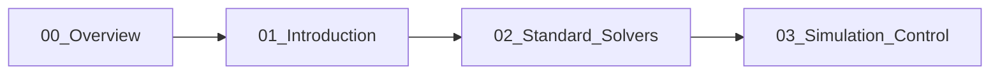

# Incompressible Flow Solvers: Overview

ภาพรวมของ Solvers สำหรับการไหลแบบ Incompressible ใน OpenFOAM

---

## ทำไมต้องเรียนโมดูลนี้?

การเลือก Solver ที่ถูกต้องช่วยให้:
- **Convergence เร็ว** — ลดเวลาคำนวณ
- **ผลลัพธ์แม่นยำ** — ตรงตามฟิสิกส์
- **เสถียร** — ไม่ diverge

---

## Incompressibility Assumption

$$\nabla \cdot \mathbf{u} = 0$$

**ใช้ได้เมื่อ:**
- Mach number < 0.3
- ความหนาแน่นคงที่

**Governing Equations:**

$$\rho \frac{\partial \mathbf{u}}{\partial t} + \rho (\mathbf{u} \cdot \nabla) \mathbf{u} = -\nabla p + \mu \nabla^2 \mathbf{u}$$

---

## Pressure-Velocity Coupling Algorithms

| Algorithm | Type | Key Feature |
|-----------|------|-------------|
| **SIMPLE** | Steady | Under-relaxation |
| **PISO** | Transient | Multiple corrections per dt |
| **PIMPLE** | Transient | SIMPLE + PISO hybrid |

### SIMPLE (Steady-state)

```cpp
// system/fvSolution
SIMPLE
{
    nNonOrthogonalCorrectors 1;
    consistent yes;
    
    residualControl
    {
        p       1e-4;
        U       1e-4;
    }
}

relaxationFactors
{
    fields    { p 0.3; }
    equations { U 0.7; k 0.7; epsilon 0.7; }
}
```

### PISO (Transient)

```cpp
PISO
{
    nCorrectors              2;
    nNonOrthogonalCorrectors 1;
}
```

### PIMPLE (Large time-step)

```cpp
PIMPLE
{
    nOuterCorrectors         2;
    nCorrectors              2;
    nNonOrthogonalCorrectors 1;
}
```

---

## Core Solvers

| Solver | Flow | Algorithm | Use Case |
|--------|------|-----------|----------|
| `icoFoam` | Transient Laminar | PISO | Low Re, educational |
| `simpleFoam` | Steady Turbulent | SIMPLE | Industrial CFD |
| `pimpleFoam` | Transient Turbulent | PIMPLE | LES, moving mesh |
| `pisoFoam` | Transient Turbulent | PISO | Small dt |

---

## Case Structure

```
case/
├── 0/                    # Initial & Boundary Conditions
│   ├── U                # Velocity
│   ├── p                # Pressure  
│   ├── k                # Turbulent kinetic energy
│   └── epsilon          # Dissipation rate
├── constant/            # Physical Properties
│   ├── polyMesh/        # Mesh files
│   └── transportProperties  # nu
└── system/              # Numerical Settings
    ├── controlDict      # Time control
    ├── fvSchemes        # Discretization
    └── fvSolution       # Solver settings
```

---

## Essential Files

### controlDict

```cpp
application     simpleFoam;
startFrom       startTime;
startTime       0;
stopAt          endTime;
endTime         1000;
deltaT          1;
writeControl    timeStep;
writeInterval   100;
```

### transportProperties

```cpp
transportModel  Newtonian;
nu              [0 2 -1 0 0 0 0] 1e-6;  // ν [m²/s]
```

### Boundary Conditions

```cpp
// 0/U
boundaryField
{
    inlet  { type fixedValue; value uniform (10 0 0); }
    outlet { type zeroGradient; }
    walls  { type noSlip; }
}

// 0/p
boundaryField
{
    inlet  { type zeroGradient; }
    outlet { type fixedValue; value uniform 0; }
    walls  { type zeroGradient; }
}
```

---

## Convergence Monitoring

### Residuals

```cpp
// system/controlDict
functions
{
    residuals
    {
        type            residuals;
        writeControl    timeStep;
        writeInterval   1;
        fields          (p U k epsilon);
    }
}
```

### Target Values

| Variable | Target Residual |
|----------|-----------------|
| Pressure | < 1e-4 |
| Velocity | < 1e-4 |
| Turbulence | < 1e-3 |

---

## Workflow

```bash
# 1. Create mesh
blockMesh

# 2. Check mesh quality
checkMesh

# 3. Run solver
simpleFoam > log.simpleFoam &

# 4. Monitor
tail -f log.simpleFoam

# 5. Visualize
paraFoam
```

---

## Concept Check

<details>
<summary><b>1. เมื่อไหร่ใช้ SIMPLE vs PISO?</b></summary>

- **SIMPLE:** ปัญหา steady-state — iterate จนค่าคงที่
- **PISO:** ปัญหา transient — ต้องการ temporal accuracy ทุก time step
</details>

<details>
<summary><b>2. Under-relaxation ช่วยอะไร?</b></summary>

ป้องกัน divergence โดยจำกัดการเปลี่ยนแปลงของตัวแปรในแต่ละ iteration:
$$\phi^{new} = \phi^{old} + \alpha (\phi^{calculated} - \phi^{old})$$
ค่า α ต่ำ = เสถียรแต่ช้า, ค่า α สูง = เร็วแต่อาจ diverge
</details>

<details>
<summary><b>3. nNonOrthogonalCorrectors คืออะไร?</b></summary>

จำนวนรอบที่แก้ไข pressure equation สำหรับ mesh ที่ไม่ orthogonal — mesh คุณภาพดี (non-orthogonality < 40°) ใช้ 0-1, mesh คุณภาพต่ำใช้ 2-3
</details>

---

## Learning Path



---

## Related Documents

- **บทถัดไป:** [01_Introduction.md](01_Introduction.md)
- **Solvers:** [02_Standard_Solvers.md](02_Standard_Solvers.md)