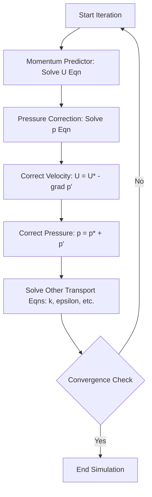

# Incompressible Flow Solvers ใน OpenFOAM: ภาพรวมและพื้นฐานทางเทคนิค

> [!INFO] **ภาพรวมโมดูล**
> โมดูลนี้สำรวจรากฐานทางทฤษฎี อัลกอริทึมเชิงตัวเลข และการนำไปใช้งานจริงของ incompressible flow solvers ใน OpenFOAM ซึ่งเป็นรากฐานสำคัญของการจำลอง CFD เมื่อความหนาแน่นของของไหลคงที่ ($Ma < 0.3$)

## 🎯 วัตถุประสงค์การเรียนรู้ (Learning Objectives) 

เมื่อจบโมดูลนี้ คุณจะสามารถ:
1. **ระบุ Solver ที่เหมาะสม**: เลือก OpenFOAM Solver ที่ถูกต้องสำหรับปัญหาการไหลที่กำหนด (Steady vs Transient, Laminar vs Turbulent)
2. **กำหนดค่า `fvSolution`**: ตั้งค่า Linear Solver, Tolerance และอ้างอิง Algorithm (SIMPLE, PISO, PIMPLE) ได้อย่างถูกต้อง
3. **ตรวจสอบการลู่เข้า (Convergence)**: ตรวจสอบและตีความ Residuals และปริมาณทางกายภาพ (Drag, Lift, Pressure Drop)
4. **แก้ไขปัญหา (Troubleshooting)**: วินิจฉัยและแก้ไขปัญหาการลู่ออก (Divergence) หรือการลู่เข้าช้า
5. **ตั้งค่า Case พื้นฐาน**: จัดการโครงสร้าง Directory (`0/`, `constant/`, `system/`) สำหรับการไหลแบบอัดตัวไม่ได้

---

## 🌊 1. พื้นฐานทางฟิสิกส์และสมมติฐาน (Physical Foundations)

### 1.1 สมมติฐานการไหลแบบอัดตัวไม่ได้ (Incompressibility Assumption)
Incompressible flow ถือว่าความหนาแน่นของของไหล ($
ho$) คงที่ตลอดสนามการไหล:
$$\frac{D\rho}{Dt} = 0 \quad \Rightarrow \quad \rho = \text{constant}$$ 

**เงื่อนไขความเหมาะสม:**
- **Mach Number** ($Ma$) < 0.3
- ความแปรผันของความดันและอุณหภูมิไม่ส่งผลต่อความหนาแน่นอย่างมีนัยสำคัญ

### 1.2 สมการควบคุม (Governing Equations)

**สมการความต่อเนื่อง (Continuity Equation):**
$$\nabla \cdot \mathbf{u} = 0$$ 

**สมการโมเมนตัม (Momentum Equation):**
$$\rho \frac{\partial \mathbf{u}}{\partial t} + \rho (\mathbf{u} \cdot \nabla) \mathbf{u} = -\nabla p + \mu \nabla^2 \mathbf{u} + \mathbf{f}$$ 

**นิยามตัวแปร:**
- $\mathbf{u}$: Velocity vector $[m/s]$
- $p$: Pressure $[Pa]$
- $\rho$: Density (คงที่) $[kg/m^3]$
- $\mu$: Dynamic viscosity $[Pa \cdot s]$
- $\mathbf{f}$: Body forces $[N/m^3]$

---

## ⚙️ 2. อัลกอริทึมการเชื่อมโยงความดัน-ความเร็ว (Pressure-Velocity Coupling)

OpenFOAM ใช้อัลกอริทึมแบบ Segregated เพื่อแก้ปัญหาความท้าทายที่ไม่มีสมการความดันโดยตรง:

| Algorithm | ประเภทปัญหา | ลักษณะเด่น |
|-----------|-----------|-----------|
| **SIMPLE** | Steady-state | ใช้ Under-relaxation เพื่อความเสถียร |
| **PISO** | Transient | แก้สมการความดันหลายรอบต่อ Time Step เพื่อ Temporal Accuracy |
| **PIMPLE** | Transient (Hybrid) | รวมข้อดีของ PISO และ SIMPLE รองรับ Large Time Steps ($Co > 1$) |

### SIMPLE Algorithm Workflow


---

## 🚀 3. Core Incompressible Solvers ใน OpenFOAM

| Solver | Flow Regime | Algorithm | การใช้งาน |
|--------|-------------|-----------|-----------|
| **icoFoam** | Transient Laminar | PISO | ปัญหาพื้นฐาน, Low Reynolds number |
| **simpleFoam** | Steady Turbulent | SIMPLE | อากาศพลศาสตร์สถานะคงตัว, แรงต้าน/แรงยก |
| **pimpleFoam** | Transient Turbulent | PIMPLE | ปัญหาที่มีการเปลี่ยนแปลงตามเวลา, Mesh เคลื่อนที่ |
| **nonNewtonianIcoFoam** | Transient Non-Newtonian | PISO | ของไหลที่มีความหนืดแปรผันตาม Shear Rate |
| **SRFSimpleFoam** | Steady Rotating Frame | SIMPLE | เครื่องจักรกลหมุน (Pumps, Turbines) |

--- 

## 🏗️ 4. การตั้งค่ากรณีศึกษา (Case Setup)

### 4.1 โครงสร้าง Directory
```bash
case/
    ├── 0/                 # Initial & Boundary Conditions (U, p, k, epsilon)
    ├── constant/         # Physical properties (transportProperties), Mesh (polyMesh)
    └── system/           # Numerical schemes (fvSchemes), Solver control (fvSolution, controlDict)
```

### 4.2 ตัวอย่าง Boundary Conditions
- **Velocity (`0/U`)**: `fixedValue`, `noSlip`, `zeroGradient`, `inletOutlet`
- **Pressure (`0/p`)**: `fixedValue` (ที่ outlet), `zeroGradient` (ที่ inlet/walls)

### 4.3 Solver Configuration (`system/fvSolution`)
```cpp
solvers
{
    p { solver GAMG; tolerance 1e-07; relTol 0.01; }
    U { solver PBiCG; preconditioner DILU; tolerance 1e-05; relTol 0; }
}
relaxationFactors
{
    fields { p 0.3; }
    equations { U 0.7; }
}
```

---

## 🛠️ 5. การแก้ไขปัญหาและประสิทธิภาพ (Troubleshooting & Optimization)

### 5.1 ปัญหาที่พบบ่อย
1. **Divergence**: ตรวจสอบ Mesh Quality (Skewness, Non-orthogonality) และลด Relaxation Factors
2. **Slow Convergence**: ปรับปรุง Mesh Grading หรือใช้ Linear Solver ที่เหมาะสม เช่น GAMG สำหรับความดัน
3. **CFL Limit**: สำหรับ Transient, รักษา $Co = \frac{|\mathbf{u}| \Delta t}{\Delta x} < 1$ (สำหรับ PISO)

### 5.2 การเพิ่มประสิทธิภาพ
- **Linear Solvers**: **GAMG** (ดีที่สุดสำหรับ Pressure), **PBiCG** (ดีสำหรับ Momentum)
- **Parallel Computing**: ใช้ `decomposePar` สำหรับการคำนวณแบบหลาย Core

---

## ⏱️ ระยะเวลาเรียนโดยประมาณ
- **ภาคทฤษฎี**: 1-2 ชั่วโมง (อ่านบทนำและพื้นฐานคณิตศาสตร์)
- **ภาคปฏิบัติ**: 1-2 ชั่วโมง (ตั้งค่าและรัน Case ตัวอย่าง)
- **รวม**: 2-4 ชั่วโมง

---
**Next Topic**: [Introduction to Incompressible Flow](./01_Introduction.md)