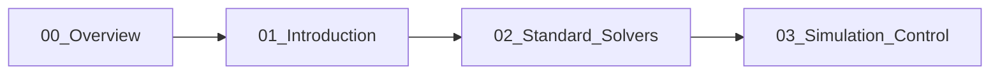

# Incompressible Flow Solvers: Overview

Overview of Solvers for Incompressible Flow in OpenFOAM

## Learning Objectives

By the end of this module, you will be able to:
- **Identify** when to apply incompressible solvers based on Mach number and flow physics
- **Select** the appropriate solver (simpleFoam, icoFoam, pimpleFoam, pisoFoam) for your application
- **Understand** the case directory structure and essential configuration files
- **Execute** a complete incompressible flow simulation workflow from mesh to visualization
- **Monitor** convergence and diagnose common simulation issues

---

## WHAT: Incompressible Flow Fundamentals

### Governing Equations

**Continuity (Incompressibility):**

$$\nabla \cdot \mathbf{u} = 0$$

**Momentum Conservation:**

$$\rho \frac{\partial \mathbf{u}}{\partial t} + \rho (\mathbf{u} \cdot \nabla) \mathbf{u} = -\nabla p + \mu \nabla^2 \mathbf{u}$$

### When to Use Incompressible Solvers

| Criterion | Requirement |
|-----------|-------------|
| Mach number | $Ma < 0.3$ |
| Density variation | $< 5\%$ |
| Compressibility effects | Negligible |

**Physics:** At low Mach numbers, density changes due to pressure variations are negligible → fluid behaves as incompressible

### Solver Overview

| Solver | Flow Type | Algorithm | Typical Use |
|--------|-----------|-----------|-------------|
| `icoFoam` | Transient Laminar | PISO | Educational, low Re |
| `simpleFoam` | Steady Turbulent | SIMPLE | Industrial CFD |
| `pimpleFoam` | Transient Turbulent | PIMPLE | Large time-steps, LES |
| `pisoFoam` | Transient Turbulent | PISO | Small time-steps |

---

## WHY: Physical Reasoning & Benefits

### Pressure-Velocity Coupling Challenge

Incompressible flow lacks a density-based pressure equation → pressure must enforce continuity constraint $\nabla \cdot \mathbf{u} = 0$

| Algorithm | Key Feature | Stability Mechanism |
|-----------|-------------|---------------------|
| **SIMPLE** | Under-relaxation | Limits variable updates per iteration |
| **PISO** | Multiple corrections | Improves temporal accuracy |
| **PIMPLE** | Hybrid approach | Combines stability + accuracy |

### Convergence & Accuracy Trade-offs

- **Correct solver selection** → Faster convergence (hours vs days)
- **Appropriate algorithm** → Physical accuracy (no artificial diffusion)
- **Proper configuration** → Numerical stability (no divergence)

---

## HOW: Case Structure & Workflow

### Standard Case Directory

```
case/
├── 0/                          # Initial & Boundary Conditions
│   ├── U                      # Velocity [m/s]
│   ├── p                      # Pressure [m²/s²]
│   ├── k                      # Turbulent kinetic energy (if turbulent)
│   └── epsilon                # Dissipation rate (if turbulent)
├── constant/                   # Physical Properties
│   ├── polyMesh/              # Mesh files (points, faces, cells)
│   └── transportProperties    # Kinematic viscosity ν
└── system/                     # Numerical Settings
    ├── controlDict            # Time control, I/O
    ├── fvSchemes              # Discretization schemes
    └── fvSolution             # Solver & algorithm settings
```

### Essential Configuration Files

#### 1. controlDict (Time Control)

```cpp
application     simpleFoam;
startFrom       startTime;
startTime       0;
stopAt          endTime;
endTime         1000;
deltaT          1;
writeControl    timeStep;
writeInterval   100;
```

#### 2. transportProperties (Fluid Properties)

```cpp
transportModel  Newtonian;
nu              [0 2 -1 0 0 0 0] 1e-6;  // ν [m²/s]
```

#### 3. Boundary Conditions (0/U and 0/p)

```cpp
// 0/U - Velocity
dimensions      [0 1 -1 0 0 0 0];
internalField   uniform (0 0 0);
boundaryField
{
    inlet  { type fixedValue; value uniform (10 0 0); }
    outlet { type zeroGradient; }
    walls  { type noSlip; }
}

// 0/p - Pressure
dimensions      [0 2 -2 0 0 0 0];
internalField   uniform 0;
boundaryField
{
    inlet  { type zeroGradient; }
    outlet { type fixedValue; value uniform 0; }
    walls  { type zeroGradient; }
}
```

### Complete Simulation Workflow

```bash
# 1. Generate mesh
blockMesh

# 2. Verify mesh quality
checkMesh -allGeometry -allTopology

# 3. Initialize fields (optional)
# - Set initial conditions in 0/ directory
# - Map from previous case if needed

# 4. Run solver in background
simpleFoam > log.simpleFoam &

# 5. Monitor convergence
tail -f log.simpleFoam

# 6. Visualize results
paraFoam
```

### Convergence Monitoring

#### Residual Function Object

```cpp
// system/controlDict
functions
{
    residuals
    {
        type            residuals;
        writeControl    timeStep;
        writeInterval   1;
        fields          (p U k epsilon);
    }
}
```

#### Target Residual Values

| Variable | Steady Target | Transient Target |
|----------|---------------|------------------|
| Pressure | $< 10^{-5}$ | Monitor for trend |
| Velocity | $< 10^{-5}$ | Monitor for trend |
| Turbulence (k, ε, ω) | $< 10^{-4}$ | Monitor for trend |

**Note:** For transient simulations, residuals should plateau at acceptable levels rather than drop to machine precision.

---

## Concept Check

<details>
<summary><b>Q1: When should you use an incompressible solver?</b></summary>

**Answer:** Use incompressible solvers when **Mach number < 0.3** (flow speed < 30% of sound speed) and density variations are minimal (< 5%). This covers most liquid flows and low-speed gas flows (e.g., air at < 100 m/s). For higher Mach numbers, use compressible solvers like `rhoSimpleFoam` or `rhoPimpleFoam`.
</details>

<details>
<summary><b>Q2: What is the main difference between simpleFoam and icoFoam?</b></summary>

**Answer:** 
- **simpleFoam**: Steady-state, turbulent, uses SIMPLE algorithm with under-relaxation. Suitable for industrial applications where time-averaged flow is needed.
- **icoFoam**: Transient, laminar-only, uses PISO algorithm. Suitable for low Reynolds number flows where temporal evolution matters.

The key distinction: steady vs transient, and turbulent vs laminar capability.
</details>

<details>
<summary><b>Q3: Why does the pressure equation not have a time derivative in incompressible flow?</b></summary>

**Answer:** In incompressible flow, pressure is **not a thermodynamic variable** but a **mathematical Lagrange multiplier** that enforces the continuity constraint $\nabla \cdot \mathbf{u} = 0$. Pressure adjusts instantaneously (infinite speed of sound assumption) to maintain mass conservation. This is why pressure-velocity coupling algorithms (SIMPLE/PISO/PIMPLE) are required — there's no independent pressure evolution equation.
</details>

---

## Key Takeaways

1. **Mach number criterion**: $Ma < 0.3$ is the primary condition for using incompressible solvers
2. **Solver selection** depends on:
   - Steady vs transient flow
   - Laminar vs turbulent flow
   - Time-step size requirements
3. **Case structure** follows standard OpenFOAM organization: `0/`, `constant/`, `system/`
4. **Boundary conditions**: Pressure needs one fixed value (usually outlet = 0), velocity needs proper inlets/outlets
5. **Convergence monitoring** via residuals is essential — use function objects for automated tracking
6. **Algorithm choice** (SIMPLE/PISO/PIMPLE) is covered in detail in [01_Introduction.md](01_Introduction.md)
7. **Detailed solver configurations** (fvSolution settings, under-relaxation) are covered in [03_Simulation_Control.md](03_Simulation_Control.md)

---

## Learning Path



---

## Related Documents

- **Next:** [01_Introduction.md](01_Introduction.md) — Detailed solver selection and algorithm comparison
- **Solvers:** [02_Standard_Solvers.md](02_Standard_Solvers.md) — In-depth solver-specific documentation
- **Control:** [03_Simulation_Control.md](03_Simulation_Control.md) — fvSolution, fvSchemes, and convergence strategies