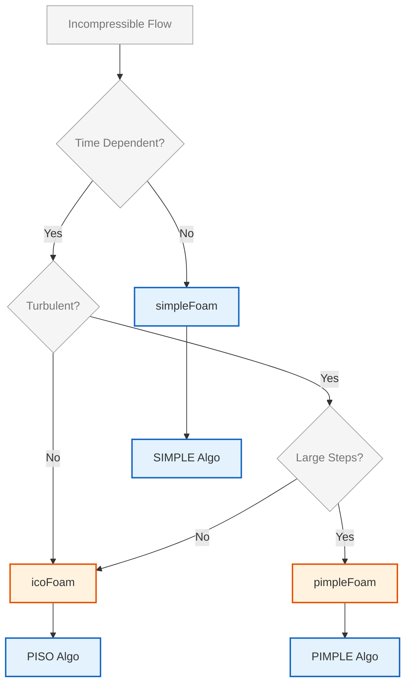

# บทนำสู่ Incompressible Flow Solvers

## 🎯 วัตถุประสงค์ของไฟล์

ไฟล์นี้แนะนำ **incompressible flow solvers** ของ OpenFOAM และให้คำแนะนำในการเลือก solver ที่เหมาะสมสำหรับ flow regimes ที่แตกต่างกัน

OpenFOAM นำเสนอชุด solvers ที่ครอบคลุมซึ่งออกแบบมาเพื่อจัดการกับปัญหา incompressible flow ประเภทต่างๆ ตั้งแต่ **simple steady-state laminar flows** ไปจนถึง **complex transient turbulent simulations**

จุดเน้นหลักอยู่ที่ **fundamental incompressible flow solvers** ที่เป็นรากฐานของการวิเคราะห์ CFD ใน OpenFOAM โดย solvers เหล่านี้ใช้ **numerical algorithms** และ **solution strategies** ที่แตกต่างกัน

---

## 📊 ภาพรวม Core Incompressible Flow Solvers

| Solver | ชนิดการไหล | Algorithm | คุณสมบัติหลัก |
|--------|-------------|-----------|--------------|
| **icoFoam** | Transient laminar | PISO | Low Reynolds number, viscous forces dominant |
| **simpleFoam** | Steady-state | SIMPLE | Stationary flow, turbulent models |
| **pimpleFoam** | Transient | PIMPLE | Large time-steps, enhanced stability |
| **nonNewtonianIcoFoam** | Transient non-Newtonian | PISO | Shear-rate dependent viscosity |
| **SRFSimpleFoam** | Steady-state rotating | SIMPLE | Single Rotating Reference Frames |

### รายละเอียด Solver หลัก

#### 1. **icoFoam**
- **ประเภท**: Transient laminar incompressible flow solver
- **Algorithm**: PISO (Pressure Implicit with Splitting of Operators)
- **การใช้งาน**: Low Reynolds number flows
- **ลักษณะเด่น**: Viscous forces มีอิทธิพลเหนือ inertial forces

#### 2. **simpleFoam**
- **ประเภท**: Steady-state incompressible flow solver
- **Algorithm**: SIMPLE (Semi-Implicit Method for Pressure-Linked Equations)
- **การใช้งาน**: Stationary flow problems, turbulent flow simulations
- **ลักษณะเด่น**: ใช้ turbulence models ได้

#### 3. **pimpleFoam**
- **ประเภท**: Transient incompressible flow solver
- **Algorithm**: PIMPLE (PISO + SIMPLE combination)
- **การใช้งาน**: Large time-step simulations
- **ลักษณะเด่น**: ความยืดหยุ่นและเสถียรภาพที่เพิ่มขึ้น



> **Figure 1:** แผนผังการเลือกใช้ตัวแก้ปัญหา (Solver Selection Flowchart) สำหรับการไหลแบบอัดตัวไม่ได้ใน OpenFOAM โดยพิจารณาจากปัจจัยด้านเวลา (Steady vs Transient) ลักษณะการไหล (Laminar vs Turbulent) และขนาดของก้าวเวลา เพื่อเลือกอัลกอริทึมที่เหมาะสมที่สุดระหว่าง SIMPLE, PISO และ PIMPLE

---

## 🌊 1. สมมติฐานการไหลแบบอัดตัวไม่ได้ (Incompressibility Assumption)

**Incompressible flow** คือการไหลที่ความหนาแน่นของอนุภาคของไหลไม่เปลี่ยนแปลงตามการเคลื่อนที่:

$$\frac{D\rho}{Dt} = 0 \quad \Rightarrow \quad \rho = \text{constant}$$

### 1.1 เงื่อนไขที่ใช้ได้ (Validity Conditions)

สมมติฐานนี้เป็นจริงเมื่อ **Mach number** (\(Ma\)) มีค่าต่ำ:

$$Ma = \frac{|\mathbf{u}|}{c} < 0.3$$

โดยที่ \(c\) คือความเร็วเสียงในตัวกลาง

**เงื่อนไขเพิ่มเติม:**
- ความแปรผันของความดันมีค่าน้อยมากจนการเปลี่ยนแปลงความหนาแน่นมีค่าน้อยมากจนละเลยได้
- ความแปรผันของอุณหภูมิไม่ส่งผลกระทบต่อความหนาแน่นอย่างมีนัยสำคัญ

### 1.2 ข้อจำกัดทางกายภาพ (Physical Limitations)

สมมติฐานนี้จะ **ไม่สามารถใช้ได้** ในกรณีต่อไปนี้:
- **High-speed flows**: เมื่อ \(Ma > 0.3\) (ผลกระทบจากการอัดตัวมีนัยสำคัญ)
- **Acoustics**: ไม่สามารถจับคลื่นเสียงได้เนื่องจากความเร็วเสียงถือเป็นอนันต์ (\(c \to \infty\))
- **Significant Heating**: เมื่อมีการถ่ายเทความร้อนที่ทำให้ความหนาแน่นเปลี่ยนแปลงอย่างมาก (ต้องใช้ Solver ที่รองรับ Boussinesq approximation หรือ Compressible solver)

---

## 📐 2. สมการควบคุม (Governing Equations)

ภายใต้สมมติฐาน Incompressibility สมการ Navier-Stokes จะถูกปรับปรุงดังนี้:

### 2.1 สมการความต่อเนื่อง (Continuity Equation)

ในทางคณิตศาสตร์ สิ่งนี้แสดงออกผ่าน **continuity equation** สำหรับ incompressible flow:

$$\nabla \cdot \mathbf{u} = 0$$

การลดความซับซ้อนนี้ช่วยขจัด **energy equation** ออกจากระบบ **momentum equation** เมื่อผลกระทบจากอุณหภูมิมีน้อย ซึ่งช่วยลดความซับซ้อนในการคำนวณได้อย่างมาก

สมการนี้หมายความว่าอัตราการไหลเข้าสู่ปริมาตรควบคุมใดๆ จะต้องเท่ากับอัตราการไหลออกเสมอ

### 2.2 สมการโมเมนตัม (Momentum Equation)

สำหรับการไหลของของไหล Newtonian ที่มีความหนาแน่นและความหนืดคงที่:

$$\rho \left( \frac{\partial \mathbf{u}}{\partial t} + (\mathbf{u} \cdot \nabla) \mathbf{u} \right) = -\nabla p + \mu \nabla^2 \mathbf{u} + \mathbf{f}$$

**นิยามตัวแปร:**
- \(\mathbf{u}\): Velocity vector [m/s]
- \(p\): Static pressure [Pa]
- \(\rho\): Density [kg/m³]
- \(\mu\): Dynamic viscosity [Pa·s]
- \(\mathbf{f}\): External forces (เช่น แรงโน้มถ่วง) [N/m³]

### 2.3 การวิเคราะห์ไร้มิติ (Dimensionless Analysis)

พารามิเตอร์ที่กำหนดพฤติกรรมการไหลคือ **Reynolds Number (\(Re\))**:

$$Re = \frac{\text{Inertial Forces}}{\text{Viscous Forces}} = \frac{\rho U L}{\mu} = \frac{U L}{\nu}$$

โดยที่ \(\nu = \mu/\rho\) คือ ความหนืดจลนศาสตร์ (Kinematic viscosity) [m²/s]

---

## 🔗 3. ความท้าทาย: Pressure-Velocity Coupling

ในระบบ Incompressible, **ความดัน (\(p\))** ไม่ได้มีความสัมพันธ์โดยตรงกับความหนาแน่นผ่านสมการสถานะ (Equation of State) แต่ทำหน้าที่เป็นตัวแปรเพื่อบังคับให้สนามความเร็วเป็นไปตามสมการความต่อเนื่อง (\(\nabla \cdot \mathbf{u} = 0\))

**ความยากทางคณิตศาสตร์:**
1. ไม่มีสมการวิวัฒนาการ (Evolution equation) สำหรับความดันโดยเฉพาะ
2. ความดันปรากฏเฉพาะในรูปของ Gradient (\(-\nabla p\)) ในสมการโมเมนตัม
3. การเปลี่ยนแปลงความดันส่งผลต่อความเร็วทันทีทั่วทั้งโดเมน (\(c \to \infty\))

**OpenFOAM Implementation:**
OpenFOAM แก้ปัญหานี้โดยการสร้างสมการความดัน (Pressure Poisson Equation) จากการรวมสมการโมเมนตัมและสมการความต่อเนื่องเข้าด้วยกัน

### 3.1 การไหลแบบ Steady-State เทียบกับการไหลแบบ Transient

**การไหลแบบ Steady-state** คือการไหลที่ไม่ขึ้นกับเวลา โดยที่คุณสมบัติการไหลทั้งหมดคงที่ ณ จุดใด ๆ ในสนามการไหล:
$$\frac{\partial \phi}{\partial t} = 0$$

**การไหลแบบ Transient** (หรือการไหลแบบไม่คงที่) มีคุณสมบัติที่แปรผันตามเวลา:
$$\frac{\partial \phi}{\partial t} \neq 0$$

---

## ⚙️ 4. อัลกอริทึมเชิงตัวเลข

### 4.1 SIMPLE Algorithm (Steady-state)

Semi-Implicit Method for Pressure-Linked Equations:

**ขั้นตอนการทำงาน:**
```
for each iteration:
    1. Guess pressure field (p*)
    2. Solve momentum equations using p* → u*
    3. Solve pressure correction equation → p'
    4. Correct pressure: p = p* + p'
    5. Correct velocity: u = u* + u'
    6. Update other scalar fields
    7. Check convergence
```

```cpp
// SIMPLE loop in simpleFoam
// Main iteration loop for steady-state incompressible flow
while (simple.loop())
{
    // Momentum predictor - solve momentum equation
    tmp<fvVectorMatrix> tUEqn
    (
        fvm::div(phi, U)                    // Convective term
      + turbulence->divDevReff(U)           // Turbulent diffusion term
     ==
        fvOptions(U)                         // Source terms
    );

    // Pressure-velocity coupling using non-orthogonal correctors
    while (pimple.correctNonOrthogonal())
    {
        // Pressure Poisson equation
        fvScalarMatrix pEqn
        (
            fvm::laplacian(rAU, p) == fvc::div(phiHbyA)
        );

        pEqn.solve();

        // Update flux on final non-orthogonal iteration
        if (pimple.finalNonOrthogonalIter())
        {
            phi -= pEqn.flux();
        }
    }

    // Correct velocity field using pressure gradient
    U -= rAU*fvc::grad(p);
    U.correctBoundaryConditions();
}
```

**📂 Source:** `.applications/solvers/incompressible/adjointShapeOptimisationFoam/adjointShapeOptimisationFoam.C`

**คำอธิบาย:** อัลกอริทึม SIMPLE ใช้สำหรับการแก้ปัญหาการไหลแบบ Steady-state โดยใช้การปรับค่าความดันและความเร็วแบบซ้ำ (Iterative) จนกว่าจะถึงการลู่เข้า (Convergence)

**แนวคิดสำคัญ:**
- **Momentum Predictor**: คาดการณ์สนามความเร็วจากสมการโมเมนตัม
- **Pressure Correction**: แก้ไขสนามความดันเพื่อให้เป็นไปตามสมการความต่อเนื่อง
- **Under-relaxation**: ใช้ค่าสัมประสิทธิ์การผ่อนคลายเพื่อความเสถียรของการคำนวณ

**คุณสมบัติ:**
- ✅ เหมาะสำหรับ **steady-state problems**
- ✅ **Computational cost** ต่ำต่อ iteration
- ✅ **Convergence** เร็วสำหรับปัญหาที่ไม่ขึ้นกับเวลา
- ❌ ต้องการ **under-relaxation** สำหรับความเสถียร
- ❌ ไม่เหมาะสำหรับ transient problems

### 4.2 PISO Algorithm (Transient)

Pressure-Implicit with Splitting of Operators algorithm:

**ขั้นตอนการทำงาน:**
```
for each time step:
    for each PISO correction:
        1. Solve momentum equations → u*
        2. Solve pressure correction → p'
        3. Correct velocity and pressure
        4. Optional: solve additional equations
```

```cpp
// PISO loop in icoFoam
// Main time loop for transient incompressible laminar flow
while (pimple.loop())
{
    // Momentum equation with transient term
    fvVectorMatrix UEqn
    (
        fvm::ddt(U)                    // Time derivative
      + fvm::div(phi, U)               // Convective term
      - fvm::laplacian(nu, U)          // Diffusive term
     ==
        fvc::ddt(phi, U) - fvc::div(phi, U)  // Explicit terms
    );

    // PISO corrections for pressure-velocity coupling
    while (pimple.correct())
    {
        // Pressure equation derived from continuity
        fvScalarMatrix pEqn
        (
            fvm::laplacian(rAU, p) == fvc::div(phi)
        );

        pEqn.solve();

        // Correct velocity flux using pressure gradient
        phi -= pEqn.flux();
    }

    // Explicit velocity correction
    U -= rAU*fvc::grad(p);
    U.correctBoundaryConditions();
}
```

**📂 Source:** `.applications/solvers/multiphase/compressibleInterFoam/pEqn.H`

**คำอธิบาย:** อัลกอริทึม PISO ออกแบบมาสำหรับการจำลองแบบ Transient โดยทำการแก้ไขความดันหลายครั้งในแต่ละ Time step เพื่อให้ได้ความแม่นยำตามเวลา

**แนวคิดสำคัญ:**
- **Split Operator**: แยกสมการโมเมนตัมและความดันออกจากกัน
- **Multiple Corrections**: ทำการแก้ไขความดันหลายรอบเพื่อความถูกต้อง
- **Temporal Accuracy**: รักษาความแม่นยำของการคำนวณเชิงเวลา

**คุณสมบัติ:**
- ✅ เหมาะสำหรับ **transient simulations**
- ✅ รักษา **temporal accuracy**
- ❌ ต้องการ computational resources สูง
- ❌ มี corrector loops หลายรอบต่อ time step

### 4.3 PIMPLE Algorithm

การรวมกันแบบไฮบริดของ SIMPLE และ PISO:

**คุณสมบัติ:**
- ใช้ Under-relaxation แบบ SIMPLE เพื่อความเสถียร
- อนุญาตให้มีการแก้ไขความดันหลายครั้งเหมือน PISO
- เหมาะสำหรับการจำลอง Transient ที่มี Time step ขนาดใหญ่
- ✅ **รวมข้อดี**ของ PISO และ SIMPLE
- ✅ **Flexible** pressure correctors
- ✅ **Enhanced numerical stability**
- ✅ **Large time-steps** ได้
- ❌ **ซับซ้อน** ที่สุดในบรรดา algorithms

---

## 📊 5. การเลือก Solver ตามระบอบการไหล

| สภาพการไหล | Solver แนะนำ | อัลกอริทึม |
|------------|--------------|-----------|
| Steady-state, Laminar/Turbulent | `simpleFoam` | SIMPLE |
| Transient, Laminar | `icoFoam` | PISO |
| Transient, Turbulent, Small \(\Delta t\) | `pisoFoam` | PISO |
| Transient, Turbulent, Large \(\Delta t\) | `pimpleFoam` | PIMPLE |

### 5.1 Quick Reference Guide

| สถานการณ์ | Solver แนะนำ | เหตุผล |
|-----------|-------------|---------|
| **Low Reynolds, Transient** | **icoFoam** | Laminar flow, PISO stability |
| **Steady Turbulent Flow** | **simpleFoam** | Fast convergence, SIMPLE efficiency |
| **Large Time-step Transient** | **pimpleFoam** | PIMPLE stability, flexibility |
| **Non-Newtonian Fluid** | **nonNewtonianIcoFoam** | Shear-rate viscosity handling |
| **Rotating Machinery** | **SRFSimpleFoam** | Rotating reference frame |

### 5.2 Decision Flow

1. **Check Time Dependency**
   - Transient → ไปขั้นตอน 2
   - Steady → ไปขั้นตอน 3

2. **Check Fluid Properties**
   - Newtonian → ไปขั้นตอน 4
   - Non-Newtonian → **nonNewtonianIcoFoam**

3. **Check Flow Type**
   - Laminar → **simpleFoam** (ถ้า steady)
   - Turbulent → **simpleFoam**

4. **Check Time-step Requirements**
   - Small time-steps → **icoFoam**
   - Large time-steps → **pimpleFoam**

5. **Special Cases**
   - Rotating reference → **SRFSimpleFoam**

---

## ✅ แนวทางปฏิบัติที่ดีที่สุด (Best Practices)

1. **ตรวจสอบ Mach Number**: มั่นใจว่า \(Ma < 0.3\) ก่อนใช้ Incompressible solvers

2. **Mesh Quality**: คุณภาพของ Mesh (โดยเฉพาะ Orthogonality) ส่งผลอย่างมากต่อการคำนวณ Pressure Gradient

   **เกณฑ์คุณภาพ Mesh:**
   - **Aspect Ratio**: < 1000
   - **Non-orthogonality**: < 70°
   - **Skewness**: < 0.5
   - **Expansion Ratio**: < 5

3. **Boundary Conditions**: ตรวจสอบความสอดคล้องของ BC ระหว่าง \(U\) และ \(p\) (เช่น `fixedValue` สำหรับ \(U\) มักใช้คู่กับ `zeroGradient` สำหรับ \(p\))

4. **เริ่มต้นด้วย Low-order schemes**: เพื่อความเสถียร ใช้ **Under-relaxation** สำหรับปัญหาที่ซับซ้อน

5. **Monitor Multiple convergence criteria**: ไม่ใช่เพียง Residuals แต่ตรวจสอบ Drag, Lift, Flow rate ด้วย

---

## 📋 สรุปหลักการสำคัญ

### ขั้นตอนการเลือกและตั้งค่า Solver:

1. **🔍 จำแนกปัญหา** → เลือก Solver ที่เหมาะสม
2. **🏗️ สร้างโครงสร้าง Case** → จัดระเบียบไฟล์อย่างถูกต้อง
3. **⚙️ ตั้งค่า fvSolution** → กำหนดพฤติกรรม Solver
4. **🏃 รันการจำลอง** → ตรวจสอบ Convergence
5. **🛠️ แก้ไขปัญหา** → ปรับปรุงความเสถียรและประสิทธิภาพ

### คำแนะนำเชิงปฏิบัติ:
- เริ่มต้นด้วย **Low-order schemes** เพื่อความเสถียร
- ใช้ **Under-relaxation** สำหรับปัญหาที่ซับซ้อน
- ตรวจสอบ **Mesh quality** ก่อนรันเสมอ
- Monitor **Multiple convergence criteria** ไม่ใช่เพียง Residuals
- **Document** การเปลี่ยนแปลงและผลลัพธ์

---

**Next Topic**: [[Standard Solvers in OpenFOAM|./02_Standard_Solvers.md]]