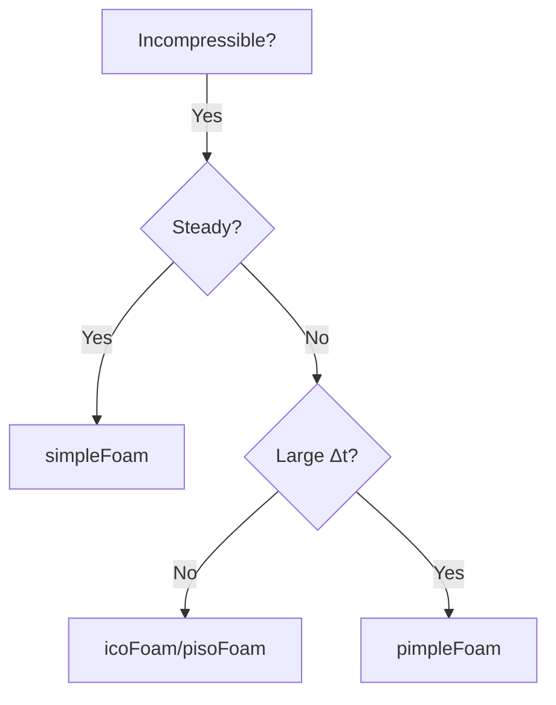

# Incompressible Flow Solvers

การเลือก Solver สำหรับ Incompressible Flow

> **ทำไมต้องเลือก Solver ให้ถูก?**
> - **Ma < 0.3** → ใช้ incompressible solver ได้
> - **Steady vs Transient** → เลือกระหว่าง SIMPLE และ PISO/PIMPLE
> - Solver ผิด = ผลลัพธ์ผิด หรือ diverge

---

## Overview

**Incompressible Flow:** $\nabla \cdot \mathbf{u} = 0$ (ใช้ได้เมื่อ $Ma < 0.3$)



---

## 1. Core Solvers

| Solver | Algorithm | Type | Use Case |
|--------|-----------|------|----------|
| **simpleFoam** | SIMPLE | Steady | Industrial, turbulent |
| **icoFoam** | PISO | Transient | Laminar only |
| **pimpleFoam** | PIMPLE | Transient | Large time-steps, turbulent |
| **pisoFoam** | PISO | Transient | Small time-steps, turbulent |

---

## 2. Governing Equations

### Continuity

$$\nabla \cdot \mathbf{u} = 0$$

### Momentum

$$\frac{\partial \mathbf{u}}{\partial t} + \nabla \cdot (\mathbf{u}\mathbf{u}) = -\nabla p + \nu \nabla^2 \mathbf{u}$$

### Reynolds Number

$$Re = \frac{UL}{\nu}$$

---

## 3. Algorithm Comparison

### SIMPLE (Steady)

- Under-relaxation required
- One pressure correction per iteration
- No time accuracy

### PISO (Transient)

- Multiple pressure corrections per time-step
- Time-accurate
- Requires small $\Delta t$

### PIMPLE (Hybrid)

- SIMPLE loops + PISO corrections
- Large time-steps possible
- Most flexible

---

## 4. Solver Selection Guide

| Scenario | Solver | Why |
|----------|--------|-----|
| Steady turbulent | `simpleFoam` | Fast convergence |
| Transient laminar | `icoFoam` | Simple, accurate |
| Transient turbulent, small $\Delta t$ | `pisoFoam` | Time-accurate |
| Transient, large $\Delta t$ | `pimpleFoam` | Stable with outer iterations |

---

## 5. Key Settings

### fvSolution (SIMPLE)

```cpp
SIMPLE
{
    nNonOrthogonalCorrectors 1;
    pRefCell    0;
    pRefValue   0;
    
    residualControl { p 1e-5; U 1e-5; }
}

relaxationFactors
{
    fields    { p 0.3; }
    equations { U 0.7; }
}
```

### fvSolution (PIMPLE)

```cpp
PIMPLE
{
    nOuterCorrectors    2;   // SIMPLE-like outer loops
    nCorrectors         2;   // PISO pressure corrections
    nNonOrthogonalCorrectors 1;
}
```

### controlDict

```cpp
// Steady
application     simpleFoam;
deltaT          1;
endTime         1000;  // iterations

// Transient
application     pimpleFoam;
deltaT          0.001;
endTime         10;     // seconds
adjustTimeStep  yes;
maxCo           0.8;
```

---

## 6. Mesh Quality Check

```bash
checkMesh -allGeometry -allTopology
```

| Metric | Target |
|--------|--------|
| Non-orthogonality | < 70° |
| Skewness | < 4 |
| Aspect ratio | < 1000 |

---

## 7. Turbulence Model Selection

```cpp
// constant/turbulenceProperties
simulationType RAS;

RAS
{
    RASModel    kOmegaSST;
    turbulence  on;
}
```

| Solver | Turbulence Support |
|--------|-------------------|
| icoFoam | Laminar only |
| simpleFoam | RAS |
| pimpleFoam | RAS, LES |

---

## Concept Check

<details>
<summary><b>1. เมื่อไหร่ใช้ PIMPLE แทน PISO?</b></summary>

เมื่อต้องการใช้ **time-step ใหญ่** ($Co > 1$) โดย PIMPLE ใช้ outer iterations เพื่อรักษา stability ที่ PISO ไม่มี
</details>

<details>
<summary><b>2. ทำไม simpleFoam ต้องใช้ under-relaxation?</b></summary>

เพราะ SIMPLE ไม่มี time derivative → ไม่มี natural time-stepping stability → ต้องใช้ relaxation เพื่อป้องกัน overshoot
</details>

<details>
<summary><b>3. icoFoam ใช้กับ turbulent flow ได้ไหม?</b></summary>

**ไม่ได้** — icoFoam ไม่มี turbulence model implementation ต้องใช้ pisoFoam หรือ pimpleFoam แทน
</details>

---

## Related Documents

- **บทถัดไป:** [02_Standard_Solvers.md](02_Standard_Solvers.md)
- **Algorithms:** [../02_PRESSURE_VELOCITY_COUPLING/02_SIMPLE_Algorithm.md](../02_PRESSURE_VELOCITY_COUPLING/02_SIMPLE_Algorithm.md)