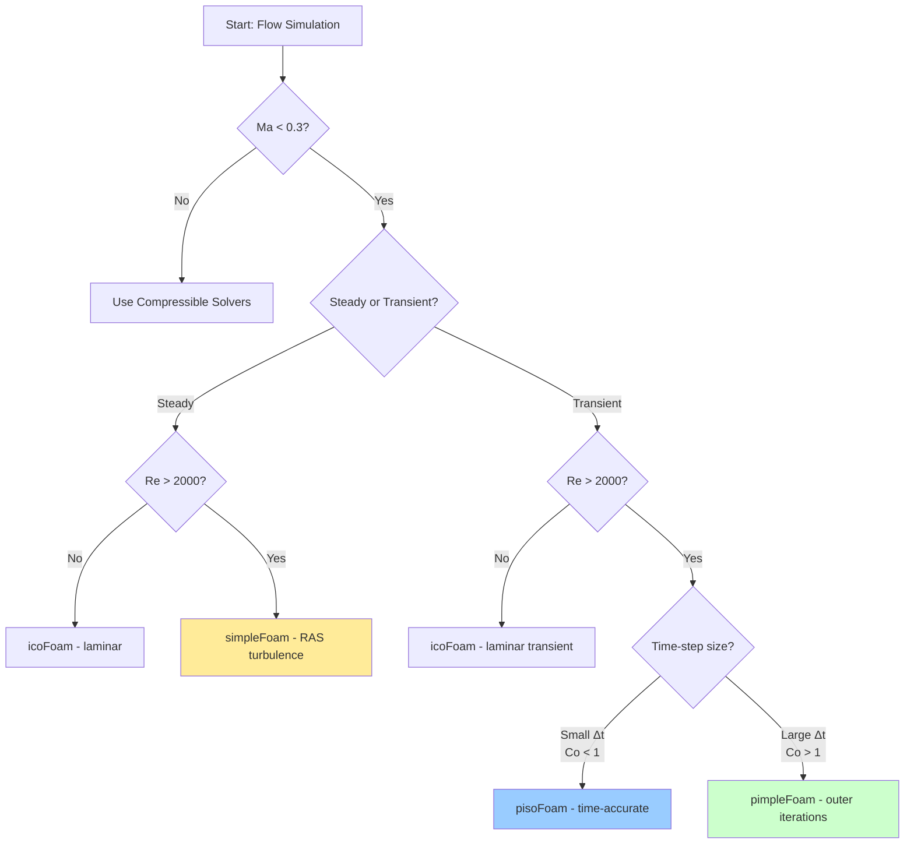

# Incompressible Flow Solvers

## Learning Objectives

By the end of this section, you will be able to:
- Identify when to use incompressible vs compressible solvers based on Mach number
- Select the appropriate solver (simpleFoam, icoFoam, pisoFoam, pimpleFoam) for your application
- Understand the differences between SIMPLE, PISO, and PIMPLE algorithms
- Configure solver settings in `fvSolution` and `controlDict`

---

## 1. WHAT: Core Concepts

### 1.1 What is Incompressible Flow?

**Incompressible flow** assumes constant density, characterized by:

$$\nabla \cdot \mathbf{u} = 0$$

**Validity Criterion:** $Ma < 0.3$

| Mach Number | Flow Regime | Solver Type |
|-------------|-------------|-------------|
| $Ma < 0.3$ | Incompressible | Incompressible solvers |
| $Ma \geq 0.3$ | Compressible | Compressible solvers |

### 1.2 Core Solvers Overview

| Solver | Algorithm | Type | Turbulence | Time-Step | Primary Use Case |
|--------|-----------|------|------------|-----------|------------------|
| **simpleFoam** | SIMPLE | Steady-state | RAS | N/A | Industrial applications, turbulent flows |
| **icoFoam** | PISO | Transient | Laminar only | Small $\Delta t$ | Transient laminar flows, educational |
| **pisoFoam** | PISO | Transient | RAS/LES | Small $\Delta t$ | Time-accurate turbulent flows |
| **pimpleFoam** | PIMPLE | Transient | RAS/LES | Large $\Delta t$ | Large time-step simulations |

### 1.3 Governing Equations

**Continuity Equation (Mass Conservation):**

$$\nabla \cdot \mathbf{u} = 0$$

**Momentum Equation:**

$$\frac{\partial \mathbf{u}}{\partial t} + \nabla \cdot (\mathbf{u}\mathbf{u}) = -\nabla p + \nu \nabla^2 \mathbf{u}$$

**Reynolds Number:**

$$Re = \frac{UL}{\nu}$$

Where $U$ is characteristic velocity, $L$ is characteristic length, and $\nu$ is kinematic viscosity.

### 1.4 Algorithm Fundamentals

**SIMPLE (Semi-Implicit Method for Pressure-Linked Equations):**
- Designed for **steady-state** simulations
- Uses **under-relaxation** to ensure stability
- One pressure correction per iteration
- No time accuracy (pseudo-time stepping)

**PISO (Pressure-Implicit with Splitting of Operators):**
- Designed for **transient** simulations
- Multiple pressure corrections per time-step
- Time-accurate formulation
- Requires small time-steps ($Co < 1$)

**PIMPLE (PISO + SIMPLE):**
- Hybrid approach combining SIMPLE outer loops with PISO corrections
- Enables **large time-steps** through outer iterations
- Most flexible for complex transient simulations

---

## 2. WHY: Physical Reasoning and Selection

### 2.1 Why Solver Selection Matters

**Consequences of Wrong Solver Choice:**
- Diverged solutions (instability)
- Unphysical results
- Excessive computation time
- Missing physics (e.g., turbulence effects)

### 2.2 Why Choose Incompressible Solvers?

**Physical Justification:**
- Density variations negligible for $Ma < 0.3$
- Computational efficiency (simpler equations)
- Faster convergence for low-speed applications
- Well-validated for industrial applications

**Common Applications:**
- HVAC systems
- Civil engineering (wind loading, ventilation)
- Automotive aerodynamics (low-speed)
- Marine applications (submerged flows)
- Pipeline flows

### 2.3 Why Algorithm Choice Affects Stability

| Aspect | SIMPLE | PISO | PIMPLE |
|--------|--------|------|--------|
| **Under-relaxation needed?** | Yes | No | Optional |
| **Time-step constraint** | None (pseudo-time) | $Co < 1$ | Relaxed by outer loops |
| **Convergence mechanism** | Residual reduction | Time accuracy | Both |
| **Typical use** | Steady design | Transient physics | Flexible transient |

### 2.4 Why Turbulence Modeling Matters

**Physical Reality:**
- $Re > 4000$ → Turbulent flow (pipes)
- $Re > 10^5$ → Typically turbulent in practice
- Laminar solvers (icoFoam) **cannot** capture turbulent physics

**Solver Support:**
| Solver | Laminar | RAS | LES | DES |
|--------|---------|-----|-----|-----|
| icoFoam | ✅ | ❌ | ❌ | ❌ |
| simpleFoam | ✅ | ✅ | ❌ | ❌ |
| pisoFoam | ✅ | ✅ | ✅ | ❌ |
| pimpleFoam | ✅ | ✅ | ✅ | ✅ |

---

## 3. HOW: Implementation Guide

### 3.1 Solver Selection Flowchart



**Decision Gates:**
1. **Mach Number:** $Ma = U / c$ where $c$ is speed of sound
2. **Reynolds Number:** Determines turbulence requirement
3. **Courant Number:** $Co = U \Delta t / \Delta x$ determines time-step constraint

### 3.2 Scenario-Based Selection Guide

| Scenario | Recommended Solver | Rationale |
|----------|-------------------|-----------|
| Steady-state turbulent flow | `simpleFoam` | Fastest convergence, under-relaxation prevents divergence |
| Steady-state laminar flow | `simpleFoam` or `icoFoam` | `simpleFoam` typically more robust; `icoFoam` simpler |
| Transient laminar, small $\Delta t$ | `icoFoam` | Lightweight, no turbulence overhead |
| Transient turbulent, small $\Delta t$ | `pisoFoam` | Time-accurate with PISO corrections |
| Transient turbulent, large $\Delta t$ | `pimpleFoam` | Outer iterations enable stability |
| DES/LES simulations | `pimpleFoam` | Only solver supporting advanced turbulence models |

### 3.3 Configuring SIMPLE (simpleFoam)

**system/fvSolution**

```cpp
SIMPLE
{
    nNonOrthogonalCorrectors 1;
    
    pRefCell    0;
    pRefValue   0;
    
    residualControl
    {
        p       1e-5;
        U       1e-5;
        k       1e-5;      // if turbulent
        omega   1e-5;      // if turbulent
    }
}

relaxationFactors
{
    fields
    {
        p       0.3;       // Typical: 0.2-0.5
        rho     1;         // Not used (incompressible)
    }
    equations
    {
        U       0.7;       // Typical: 0.5-0.8
        k       0.7;       // if turbulent
        omega   0.7;       // if turbulent
    }
}
```

**Key Parameters:**
- `nNonOrthogonalCorrectors`: Increase for highly non-orthogonal meshes (> 60°)
- `pRefCell`/`pRefValue`: Fix pressure at one cell to prevent drift
- Under-relaxation factors: Reduce if diverging, increase if converging slowly

### 3.4 Configuring PISO (icoFoam, pisoFoam)

**system/fvSolution**

```cpp
PISO
{
    nCorrectors         2;      // Pressure corrections (typically 2-4)
    nNonOrthogonalCorrectors 1;
    
    pRefCell    0;
    pRefValue   0;
}
```

**Time-Step Control (system/controlDict):**

```cpp
application     pisoFoam;

startFrom       startTime;
startTime       0;

stopAt          endTime;
endTime         10;         // seconds

deltaT          0.001;      // Initial time-step

adjustTimeStep  yes;
maxCo           0.8;        // Courant < 1 for stability

writeControl    timeStep;
writeInterval   100;
```

### 3.5 Configuring PIMPLE (pimpleFoam)

**system/fvSolution**

```cpp
PIMPLE
{
    // Outer SIMPLE-like loops
    nOuterCorrectors    2;      // Increase for larger Δt (typically 2-10)
    
    // Inner PISO corrections
    nCorrectors         2;      // Pressure corrections per outer loop
    
    nNonOrthogonalCorrectors 1;
    
    pRefCell    0;
    pRefValue   0;
    
    // Convergence criteria for outer loops
    residualControl
    {
        p       1e-4;
        U       1e-4;
    }
}

relaxationFactors
{
    fields
    {
        p       0.3;       // Can use with PIMPLE
    }
    equations
    {
        U       0.7;
    }
}
```

**Large Time-Step Strategy:**

```cpp
// system/controlDict
application     pimpleFoam;

deltaT          0.01;       // Can use larger Δt than PISO
endTime         10;

adjustTimeStep  yes;
maxCo           2.0;        // Can exceed 1.0 with outer corrections

// Optional: time-step acceleration
maxAlphaCo      0.5;        // For implicit multi-material
```

### 3.6 Turbulence Configuration

**constant/turbulenceProperties**

```cpp
simulationType RAS;     // or laminar, LES, DES

RAS
{
    RASModel        kOmegaSST;      // Popular choice
    turbulence       on;
    
    // Optional coefficients
    kOmegaSSTCoeffs
    {
        alphaK1     0.85034;
        alphaK2     1.0;
        alphaOmega1 0.5;
        alphaOmega2 0.85616;
        // ... (defaults usually sufficient)
    }
}
```

**Model Selection Guide:**
| Model | Accuracy | Robustness | Use Case |
|-------|----------|------------|----------|
| `kEpsilon` | Medium | High | Free shear flows, external aerodynamics |
| `kOmegaSST` | High | High | General purpose, adverse pressure gradients |
| `SpalartAllmaras` | Low-Medium | Very High | Aerodynamics, wall-bounded flows |
| `LES` | Very High | Low | Detailed turbulence, small domains |

### 3.7 Mesh Quality Verification

**Essential Pre-Simulation Check:**

```bash
checkMesh -allGeometry -allTopology
```

**Required Mesh Quality Metrics:**

| Metric | Excellent | Good | Acceptable | Problematic |
|--------|-----------|------|------------|-------------|
| Non-orthogonality | < 40° | < 60° | < 70° | > 70° |
| Skewness | < 1 | < 2 | < 4 | > 4 |
| Aspect ratio | < 100 | < 500 | < 1000 | > 1000 |
| Concavity (%) | 0 | < 50 | < 80 | > 80 |

**If Problematic:**
- Increase `nNonOrthogonalCorrectors` to 2-3
- Improve mesh generation parameters
- Use mesh manipulation tools (see Module 2)

### 3.8 Complete Case Setup Workflow

```bash
# 1. Copy template
cp -r $FOAM_TUTORIALS/incompressible/simpleFoam/pitzDaily myCase
cd myCase

# 2. Check mesh
checkMesh

# 3. Verify turbulence settings
cat constant/turbulenceProperties

# 4. Review solver settings
cat system/fvSolution

# 5. Run simulation
simpleFoam

# 6. Monitor convergence
tail -f log.simpleFoam | grep "time step continuity"

# 7. Post-process
paraFoam
```

---

## 4. CONCEPT CHECK

<details>
<summary><b>Q1: When should you use pimpleFoam instead of pisoFoam?</b></summary>

**Answer:** Use `pimpleFoam` when you need **large time-steps** ($Co > 1$) for faster simulation turnaround. PIMPLE provides outer iterations that maintain stability at larger time-steps where PISO would diverge. This is particularly useful for:
- Long-duration transients
- Coarse mesh transient simulations
- Cases where physical time accuracy is less critical than stability

**Key difference:** PIMPLE = PISO corrections within SIMPLE outer loops
</details>

<details>
<summary><b>Q2: Why does simpleFoam require under-relaxation factors?</b></summary>

**Answer:** `simpleFoam` uses the SIMPLE algorithm which is designed for **steady-state** solutions without time derivatives. This means:
- No natural time-stepping stability mechanism
- Pressure-velocity coupling can overshoot without damping
- Under-relaxation factors prevent divergence by limiting variable updates

Typical values:
- Pressure: 0.2-0.5 (more conservative)
- Velocity: 0.5-0.8 (less conservative)

Without under-relaxation, SIMPLE iterations would typically oscillate and diverge.
</details>

<details>
<summary><b>Q3: Can icoFoam simulate turbulent flows? Why or why not?</b></summary>

**Answer:** **No**, `icoFoam` cannot simulate turbulent flows because:

1. **No turbulence model implementation:** icoFoam only solves the laminar Navier-Stokes equations
2. **Missing turbulence equations:** No transport equations for $k$, $\omega$, $\epsilon$, etc.
3. **DNS requirement:** Resolving all turbulence scales would require impractically fine meshes

**Correct alternatives:**
- `pisoFoam` for transient turbulent with small $\Delta t$
- `pimpleFoam` for transient turbulent with large $\Delta t$
- `simpleFoam` for steady-state turbulent

**Exception:** Direct Numerical Simulation (DNS) at very low $Re$ where flow is laminar by definition.
</details>

<details>
<summary><b>Q4: What is the physical significance of the Mach number threshold Ma < 0.3?</b></summary>

**Answer:** The $Ma < 0.3$ threshold corresponds to **< 5% density variation** for air:

$$\frac{\Delta \rho}{\rho} \approx \frac{1}{2} Ma^2$$

At $Ma = 0.3$:
- $\Delta \rho / \rho \approx 0.5 \times 0.3^2 = 4.5\%$

**Physical interpretation:**
- Below $Ma = 0.3$: Pressure waves propagate much faster than flow → negligible compression
- Above $Ma = 0.3$: Compressibility effects become significant → need compressible solvers

**Practical examples:**
- Car at 100 km/h: $Ma \approx 0.08$ → incompressible ✅
- Commercial aircraft: $Ma \approx 0.8$ → compressible ✈️
- Water flow: $Ma \approx 0.001$ (speed of sound ~ 1500 m/s) → always incompressible 💧
</details>

---

## 5. KEY TAKEAWAYS

✅ **Incompressible solvers** are valid for $Ma < 0.3$ (density variations < 5%)

✅ **Solver selection decision tree:**
- Steady + turbulent → `simpleFoam`
- Steady + laminar → `simpleFoam` or `icoFoam`
- Transient + turbulent + small $\Delta t$ → `pisoFoam`
- Transient + turbulent + large $\Delta t$ → `pimpleFoam`
- Transient + laminar → `icoFoam`

✅ **Algorithm choice affects stability:**
- SIMPLE requires under-relaxation for steady convergence
- PISO provides time accuracy with small time-steps
- PIMPLE enables large time-steps through outer iterations

✅ **Turbulence support varies by solver:**
- `icoFoam`: laminar only
- `simpleFoam`: RAS models
- `pisoFoam`/`pimpleFoam`: RAS, LES, DES

✅ **Always verify mesh quality** before simulation (non-orthogonality < 70°)

✅ **Configure Courant number** appropriately: $Co < 1$ for PISO, $Co$ can exceed 1 for PIMPLE with outer corrections

---

## 6. RELATED DOCUMENTS

**Next:** [02_Standard_Solvers.md](02_Standard_Solvers.md) — Detailed configurations for standard incompressible solvers

**Algorithm Deep Dives:**
- [SIMPLE Algorithm](../02_PRESSURE_VELOCITY_COUPLING/02_SIMPLE_Algorithm.md)
- [PISO Algorithm](../02_PRESSURE_VELOCITY_COUPLING/03_PISO_Algorithm.md)
- [PIMPLE Algorithm](../02_PRESSURE_VELOCITY_COUPLING/04_PIMPLE_Algorithm.md)

**Turbulence Modeling:**
- [RAS Models](../03_TURBULENCE_MODELING/01_RAS_Introduction.md)
- [LES Models](../03_TURBULENCE_MODELING/02_LES_Introduction.md)

**Practical Examples:**
- [Lid-Driven Cavity](../../MODULE_01_CFD_FUNDAMENTALS/CONTENT/04_FIRST_SIMULATION/04_Step-by-Step_Tutorial.md)
- [Pipe Flow Tutorial](../../MODULE_03_SINGLE_PHASE_FLOW/CONTENT/02_STANDARD_WALL_FUNCTIONS/02_Pipe_Flow_Tutorial.md)