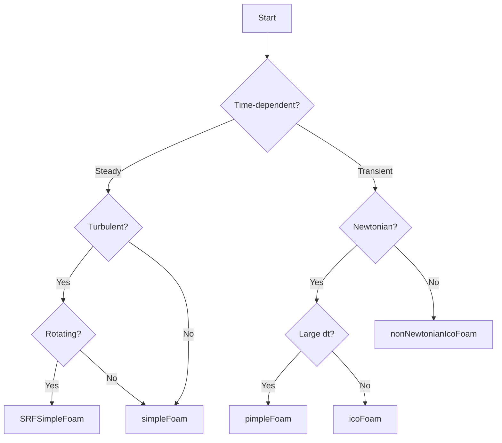

# Standard Incompressible Flow Solvers

Solvers หลักสำหรับการไหลแบบ incompressible ใน OpenFOAM

---

## Quick Reference

| Solver | Flow Type | Algorithm | Best For |
|--------|-----------|-----------|----------|
| `icoFoam` | Transient Laminar | PISO | Low Re, simple |
| `simpleFoam` | Steady Turbulent | SIMPLE | Aerodynamics |
| `pimpleFoam` | Transient Turbulent | PIMPLE | Large dt, moving mesh |
| `nonNewtonianIcoFoam` | Transient Non-Newtonian | PISO | Blood, polymer |
| `SRFSimpleFoam` | Steady Rotating | SIMPLE | Pumps, turbines |

---

## 1. icoFoam (Transient Laminar)

### Use Case
- Re < 2000 (laminar)
- No turbulence model
- Small time steps (Co < 1)

### Algorithm: PISO

```cpp
while (runTime.loop())
{
    // Momentum predictor
    fvVectorMatrix UEqn
    (
        fvm::ddt(U)
      + fvm::div(phi, U)
      - fvm::laplacian(nu, U)
    );
    solve(UEqn == -fvc::grad(p));
    
    // PISO loop
    while (piso.correct())
    {
        // Pressure equation
        fvScalarMatrix pEqn(fvm::laplacian(rAU, p) == fvc::div(phiHbyA));
        pEqn.solve();
        
        // Correct velocity
        U = HbyA - rAU*fvc::grad(p);
    }
}
```

### fvSolution

```cpp
PISO
{
    nCorrectors              2;
    nNonOrthogonalCorrectors 0;
}
```

---

## 2. simpleFoam (Steady Turbulent)

### Use Case
- Steady-state only
- Industrial aerodynamics
- External/internal flows

### Algorithm: SIMPLE

```cpp
while (simple.loop(runTime))
{
    #include "UEqn.H"   // Momentum + turbulence
    #include "pEqn.H"   // Pressure correction
    
    turbulence->correct();
}
```

### Under-Relaxation

```cpp
// system/fvSolution
relaxationFactors
{
    fields
    {
        p       0.3;
    }
    equations
    {
        U       0.7;
        k       0.7;
        epsilon 0.7;
    }
}
```

| Variable | Typical Range | Note |
|----------|---------------|------|
| p | 0.2 - 0.4 | Lower = more stable |
| U | 0.5 - 0.8 | |
| k, ε, ω | 0.4 - 0.8 | |

### SIMPLE Settings

```cpp
SIMPLE
{
    nNonOrthogonalCorrectors 1;
    consistent               yes;  // Improves convergence
    
    residualControl
    {
        p       1e-4;
        U       1e-4;
        "(k|epsilon|omega)" 1e-4;
    }
}
```

---

## 3. pimpleFoam (Transient Turbulent)

### Use Case
- Transient with large time steps (Co > 1)
- Moving mesh / FSI
- LES simulations

### Algorithm: PIMPLE = SIMPLE + PISO

```cpp
while (pimple.run(runTime))
{
    while (pimple.loop())        // Outer (SIMPLE-like)
    {
        #include "UEqn.H"
        
        while (pimple.correct()) // Inner (PISO)
        {
            #include "pEqn.H"
        }
        
        turbulence->correct();
    }
}
```

### PIMPLE Settings

```cpp
PIMPLE
{
    nOuterCorrectors    2;    // Outer iterations per dt
    nCorrectors         2;    // PISO corrections
    nNonOrthogonalCorrectors 1;
}
```

| nOuterCorrectors | Behavior |
|------------------|----------|
| 1 | Pure PISO (Co < 1) |
| 2-5 | Standard PIMPLE |
| >5 | Near steady-state |

---

## 4. nonNewtonianIcoFoam

### Use Case
- Variable viscosity μ(γ̇)
- Blood, polymers, food

### Viscosity Models

```cpp
// constant/transportProperties
transportModel  CrossPowerLaw;

CrossPowerLawCoeffs
{
    nu0     [0 2 -1 0 0 0 0] 1e-3;  // Zero-shear
    nuInf   [0 2 -1 0 0 0 0] 1e-5;  // Infinite-shear
    m       0.8;                     // Power index
    n       0.5;                     // Cross index
}
```

| Model | Equation | Use |
|-------|----------|-----|
| PowerLaw | $\mu = K \dot{\gamma}^{n-1}$ | Simple shear-thinning |
| Cross | $\mu = \frac{\mu_0}{1 + (K\dot{\gamma})^m}$ | Polymer melts |
| Carreau | $\mu = \mu_\infty + (\mu_0 - \mu_\infty)[1 + (\lambda\dot{\gamma})^2]^{(n-1)/2}$ | General |

---

## 5. SRFSimpleFoam (Rotating Frame)

### Use Case
- Pumps, fans, turbines
- Single rotating reference frame

### Additional Terms

$$-2\rho \boldsymbol{\Omega} \times \mathbf{u} - \rho \boldsymbol{\Omega} \times (\boldsymbol{\Omega} \times \mathbf{r})$$

- **Coriolis force:** $-2\rho \boldsymbol{\Omega} \times \mathbf{u}$
- **Centrifugal force:** $-\rho \boldsymbol{\Omega} \times (\boldsymbol{\Omega} \times \mathbf{r})$

### SRFProperties

```cpp
// constant/SRFProperties
SRFModel    rpm;

rpm
{
    axis    (0 0 1);           // Rotation axis
    origin  (0 0 0);           // Center of rotation
    rpm     1000;              // RPM value
}
```

---

## 6. Solver Selection Flowchart



---

## Concept Check

<details>
<summary><b>1. ความแตกต่างระหว่าง PISO กับ SIMPLE คืออะไร?</b></summary>

- **PISO:** ใช้หลาย pressure corrections ต่อ 1 time step → temporal accuracy ดี, ต้องการ Co < 1
- **SIMPLE:** ใช้ under-relaxation + iterate จน converge → steady-state, ไม่มี temporal accuracy
</details>

<details>
<summary><b>2. เมื่อไหร่ใช้ nOuterCorrectors > 1?</b></summary>

เมื่อต้องการ large time step (Co > 1) — outer correctors ทำให้ pressure-velocity coupling converge ภายใน 1 time step ป้องกัน divergence
</details>

<details>
<summary><b>3. ทำไม simpleFoam ต้องใช้ under-relaxation?</b></summary>

เพราะ SIMPLE algorithm ไม่มี time derivative → ต้องจำกัดการเปลี่ยนแปลงแต่ละ iteration เพื่อป้องกัน divergence — ค่าต่ำ = stable แต่ช้า
</details>

---

## Related Documents

- **บทก่อนหน้า:** [01_Introduction.md](01_Introduction.md)
- **บทถัดไป:** [03_Simulation_Control.md](03_Simulation_Control.md)