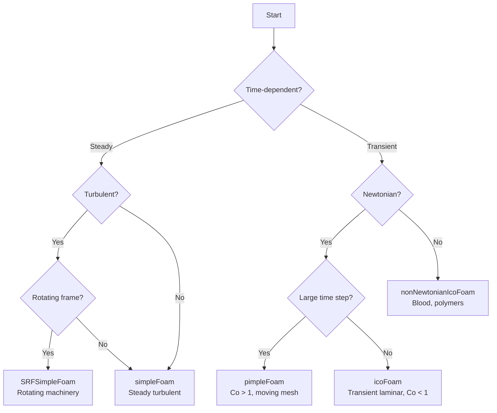

# Standard Incompressible Flow Solvers

สำรวจ solvers หลักสำหรับการไหลแบบ incompressible ใน OpenFOAM พร้อมวิธีการเลือกใช้ที่เหมาะสมกับแต่ละปัญหา

## Learning Objectives

หลังจากอ่านบทนี้ คุณจะสามารถ:
- **เปรียบเทียบ** ความแตกต่างระหว่าง PISO, SIMPLE และ PIMPLE algorithms
- **เลือกใช้** solver ที่เหมาะสมกับปัญหา (transient/steady, laminar/turbulent, Newtonian/non-Newtonian)
- **ตั้งค่า** under-relaxation factors และ iteration parameters อย่างเหมาะสม
- **อธิบาย** ข้อดีข้อเสียของแต่ละ solver และเมื่อไหร่ควรใช้ตัวไหน

---

## 1. WHAT — Quick Solver Reference

| Solver | Flow Type | Algorithm | Best For | Limitations |
|--------|-----------|-----------|----------|-------------|
| `icoFoam` | Transient Laminar | PISO | Low Re (<2000), simple flows | No turbulence, Co < 1 required |
| `simpleFoam` | Steady Turbulent | SIMPLE | Aerodynamics, industrial flows | Transient only as pseudo-steady |
| `pimpleFoam` | Transient Turbulent | PIMPLE | Large dt, moving mesh, LES | More expensive per time step |
| `nonNewtonianIcoFoam` | Transient Non-Newtonian | PISO | Blood, polymers, food | Laminar only |
| `SRFSimpleFoam` | Steady Rotating | SIMPLE | Pumps, turbines, fans | Single rotating frame only |

---

## 2. WHY — Physical Reasoning & Selection

### Why Multiple Solvers?

Different physical problems require different numerical approaches:

1. **Temporal Accuracy vs. Stability**
   - PISO maintains temporal accuracy → requires small time steps (Co < 1)
   - SIMPLE sacrifices temporal accuracy for steady-state convergence
   - PIMPLE blends both: allows large time steps with multiple outer corrections

2. **Computational Cost**
   - `icoFoam`: Cheapest (no turbulence model, small meshes)
   - `simpleFoam`: Medium cost (turbulence + under-relaxation iterations)
   - `pimpleFoam`: Most expensive (outer iterations × PISO corrections)

3. **Physical Complexity**
   - Non-Newtonian fluids require variable viscosity transport models
   - Rotating machinery needs Coriolis and centrifugal force terms

### Solver Selection Flowchart



---

## 3. HOW — Detailed Solver Configurations

### 3.1 icoFoam — Transient Laminar

**Physical Regime:** Re < 2000, no turbulence modeling

**Algorithm:** PISO (Pressure-Implicit with Splitting of Operators)

**Case Directory Structure:**
```
icoFoam_case/
├── 0/
│   ├── p          # Pressure field
│   └── U          # Velocity field
├── constant/
│   └── transportProperties  # kinematic viscosity ν
├── system/
│   ├── controlDict     # Time step, write interval
│   ├── fvSchemes       # Temporal/spatial discretization
│   └── fvSolution      # PISO settings
└── Allrun              # Execution script
```

**PISO Algorithm Implementation:**
```cpp
while (runTime.loop())
{
    // Momentum predictor
    fvVectorMatrix UEqn
    (
        fvm::ddt(U)              // Time derivative
      + fvm::div(phi, U)         // Convection
      - fvm::laplacian(nu, U)    // Diffusion
    );
    solve(UEqn == -fvc::grad(p)); // Pressure gradient source
    
    // PISO loop for pressure-velocity coupling
    while (piso.correct())
    {
        // Pressure equation: ∇²p = ∇·(H/A)
        fvScalarMatrix pEqn(fvm::laplacian(rAU, p) == fvc::div(phiHbyA));
        pEqn.solve();
        
        // Correct velocity field
        U = HbyA - rAU*fvc::grad(p);
    }
}
```

**system/fvSolution:**
```cpp
PISO
{
    nCorrectors              2;      // Pressure corrections per timestep
    nNonOrthogonalCorrectors 0;      // For non-orthogonal meshes
    pRefCell                 0;      // Reference cell for pressure
    pRefValue                0;      // Reference pressure value
}
```

**Key Parameters:**
- `nCorrectors = 2-4`: Typical range for most cases
- Courant number `Co < 1`: Required for stability
- Time step: `Δt < Δx / U_max`

---

### 3.2 simpleFoam — Steady Turbulent

**Physical Regime:** High Re (Re > 10⁴), steady-state statistical solution

**Algorithm:** SIMPLE (Semi-Implicit Method for Pressure-Linked Equations)

**Case Directory Structure:**
```
simpleFoam_case/
├── 0/
│   ├── p              # Pressure (kinematic, p/ρ)
│   ├── U              # Velocity
│   ├── k              # Turbulent kinetic energy
│   ├── epsilon        # Dissipation rate (or omega)
│   └── nut            # Turbulent viscosity
├── constant/
│   ├── transportProperties
│   └── turbulenceProperties
└── system/
    ├── fvSchemes
    └── fvSolution
```

**SIMPLE Algorithm Core:**
```cpp
while (simple.loop(runTime))
{
    #include "UEqn.H"   // Momentum + turbulence dispersion
    
    // Pressure correction with under-relaxation
    #include "pEqn.H"   // Solve: ∇²(p/ρ) = ∇·(U*/A)
    
    turbulence->correct();  // Update k, ε, ω
}
```

**Under-Relaxation Factors (CRITICAL):**

```cpp
// system/fvSolution
relaxationFactors
{
    fields
    {
        p       0.3;      // Pressure: most sensitive
    }
    equations
    {
        U       0.7;      // Velocity
        k       0.7;      // TKE
        epsilon 0.7;      // Dissipation
        omega   0.7;      // Specific dissipation
    }
}
```

**Under-Relaxation Guidelines:**

| Variable | Typical Range | Physical Reason |
|----------|---------------|-----------------|
| p | 0.2 - 0.4 | Pressure coupling is most sensitive; lower = more stable but slower |
| U | 0.5 - 0.8 | Velocity can tolerate larger changes |
| k, ε, ω | 0.4 - 0.8 | Turbulence quantities need stability |

**Convergence Control:**
```cpp
SIMPLE
{
    nNonOrthogonalCorrectors 1;
    consistent               yes;  // Use consistent SIMPLE algorithm
    
    residualControl
    {
        p       1e-4;      // Pressure residual target
        U       1e-4;      // Velocity residual target
        "(k|epsilon|omega)" 1e-4;  // Turbulence residual
    }
}
```

**Stability Tips:**
1. Start with low relaxation (p=0.2, U=0.5)
2. Gradually increase as convergence improves
3. Monitor residuals every 100 iterations
4. Use `consistent yes` for difficult cases

---

### 3.3 pimpleFoam — Transient Turbulent

**Physical Regime:** Transient turbulent with large time steps

**Algorithm:** PIMPLE = PISO (inner) + SIMPLE (outer)

**Case Directory Structure:**
```
pimpleFoam_case/
├── 0/
│   ├── p, U, k, epsilon
│   └── pointMotion (for moving mesh)
├── constant/
│   └── dynamicMeshDict (if moving)
└── system/
    └── fvSolution
```

**PIMPLE Algorithm:**
```cpp
while (pimple.run(runTime))
{
    // Outer loop: SIMPLE-like convergence per timestep
    while (pimple.loop())
    {
        #include "UEqn.H"
        
        // Inner loop: PISO pressure corrections
        while (pimple.correct())
        {
            #include "pEqn.H"
        }
        
        turbulence->correct();
    }
}
```

**PIMPLE Settings:**
```cpp
PIMPLE
{
    nOuterCorrectors    2;    // Outer iterations per dt (SIMPLE-like)
    nCorrectors         2;    // PISO corrections per outer iteration
    nNonOrthogonalCorrectors 1;
    
    // Optional: residual control per timestep
    residualControl
    {
        p       1e-3;
        U       1e-3;
        "(k|epsilon|omega)" 1e-3;
    }
}
```

**nOuterCorrectors Strategy:**

| nOuterCorrectors | Behavior | When to Use |
|------------------|----------|-------------|
| 1 | Pure PISO | Co < 1, explicit transient accuracy needed |
| 2-5 | Standard PIMPLE | Co = 1-10, balance speed/accuracy |
| 5-20 | Near steady-state | Pseudo-transient approach to steady solution |

**Time Step Guidelines:**
- Co < 1: Use `nOuterCorrectors 1` (pure PISO, cheaper)
- Co = 1-5: Use `nOuterCorrectors 2-3`
- Co > 10: Use `nOuterCorrectors 5-10` (may become unstable)

---

### 3.4 nonNewtonianIcoFoam — Non-Newtonian Fluids

**Physical Regime:** Variable viscosity μ(γ̇), typically laminar

**Viscosity Models in `constant/transportProperties`:**

```cpp
transportModel  CrossPowerLaw;

CrossPowerLawCoeffs
{
    nu0     [0 2 -1 0 0 0 0] 1e-3;  // Zero-shear viscosity
    nuInf   [0 2 -1 0 0 0 0] 1e-5;  // Infinite-shear viscosity
    m       0.8;                     // Power law index
    n       0.5;                     // Cross rate index
}
```

**Common Viscosity Models:**

| Model | Equation | Typical Applications |
|-------|----------|---------------------|
| PowerLaw |1$\mu = K \dot{\gamma}^{n-1}1| Simple shear-thinning/thickening fluids |
| Cross |1$\mu = \frac{\mu_0}{1 + (K\dot{\gamma})^m}1| Polymer melts, suspensions |
| Carreau |1$\mu = \mu_\infty + (\mu_0 - \mu_\infty)[1 + (\lambda\dot{\gamma})^2]^{(n-1)/2}1| Blood, general non-Newtonian |
| BirdCarreau | Similar to Carreau with different parameters | Viscoelastic fluids |

**Case-Specific Notes:**
- Always check shear rate range in your domain
- Validate viscosity model against experimental data
- Use finer mesh near walls (high shear gradients)

---

### 3.5 SRFSimpleFoam — Rotating Reference Frame

**Physical Regime:** Steady-state in rotating frame

**Additional Momentum Terms:**

$$\frac{\partial \mathbf{u}}{\partial t} + \nabla \cdot (\mathbf{u}\mathbf{u}) = -\nabla p + \nu \nabla^2 \mathbf{u} \underbrace{- 2\boldsymbol{\Omega} \times \mathbf{u} - \boldsymbol{\Omega} \times (\boldsymbol{\Omega} \times \mathbf{r})}_{\text{SRF terms}}$$

- **Coriolis force:**1$-2\boldsymbol{\Omega} \times \mathbf{u}1— Deflects moving fluid
- **Centrifugal force:**1$-\boldsymbol{\Omega} \times (\boldsymbol{\Omega} \times \mathbf{r})1— Pushes outward

**Configuration in `constant/SRFProperties`:**
```cpp
SRFModel    rpm;  // or SRFModel explicitRPM;

rpm
{
    axis    (0 0 1);           // Rotation axis direction
    origin  (0 0 0);           // Center of rotation
    rpm     1000;              // Angular velocity in RPM
}
```

**When to Use SRF vs. MRF:**
- **SRF:** Entire domain rotates (single reference frame)
- **MRF:** Multiple zones (stationary + rotating) — see advanced tutorials

**Boundary Conditions for SRF:**
```cpp
// Inlet: relative velocity
inlet
{
    type            fixedValue;
    value           uniform (0 0 0);  // Relative to rotating frame
}

// Walls: no-slip (relative)
walls
{
    type            noSlip;
}
```

---

## 4. Practical Case Setup Examples

### Example 1: icoFoam — Lid-Driven Cavity

```bash
# Case structure
cavity/
├── 0/
│   ├── p       # zeroGradient everywhere
│   └── U       # fixedValue (1 0 0) on lid, noSlip elsewhere
├── constant/
│   └── transportProperties
│       nu              nu [0 2 -1 0 0 0 0] 0.01;  # Re = 100
└── system/
    ├── controlDict
        application     icoFoam;
        deltaT          0.001;      # Ensure Co < 1
        endTime         1.0;
    └── fvSolution
        PISO
        {
            nCorrectors 2;
        }
```

### Example 2: simpleFoam — Backward Facing Step

```bash
# Case structure
backwardStep/
├── 0/
│   ├── p       # zeroGradient outlet, fixedFluxPressure inlet
│   ├── U       # uniform (0 0 0) inlet, zeroGradient outlet
│   ├── k       # calculated inlet, zeroGradient outlet
│   └── epsilon # similar to k
├── constant/
│   └── turbulenceProperties
        simulationType  RAS;
        RAS
        {
            RASModel        kEpsilon;
            turbulence      on;
        }
└── system/
    └── fvSolution
        SIMPLE
        {
            nNonOrthogonalCorrectors 1;
        }
        relaxationFactors
        {
            p       0.3;
            U       0.7;
            k       0.7;
            epsilon 0.7;
        }
```

### Example 3: pimpleFoam — Moving Mesh

```bash
# Case structure
movingCone/
├── constant/
│   └── dynamicMeshDict
        motionSolverLibs ("libfvMotionSolvers.so");
        solver          displacementLaplacian;
        displacementLaplacianCoeffs
        {
            diffusivity uniform 1;
        }
└── system/
    └── fvSolution
        PIMPLE
        {
            nOuterCorrectors    3;
            nCorrectors         2;
        }
```

---

## 5. Troubleshooting Guide

| Symptom | Likely Cause | Solution |
|---------|--------------|----------|
| Diverging pressure | Under-relaxation too high | Reduce p to 0.2, U to 0.5 |
| Slow convergence | Under-relaxation too low | Gradually increase factors |
| Oscillating residuals | Inconsistent pressure-velocity | Check boundary conditions |
| Time step blowup | Co > 1 in pure PISO | Reduce Δt or use PIMPLE |
| Non-physical viscosity | Wrong viscosity model | Verify shear rate range |

---

## Concept Check

<details>
<summary><b>Q1: PISO vs SIMPLE — ทำงานต่างกันอย่างไร และเมื่อไหร่ควรใช้ตัวไหน?</b></summary>

**คำตอบ:**
- **PISO:** ใช้หลาย pressure corrections ต่อ 1 time step → เก็บ temporal accuracy ได้ดี, ต้องการ Co < 1 เพื่อเสถียร
- **SIMPLE:** ใช้ under-relaxation + iterate จน converge → ไม่มี temporal accuracy, ใช้สำหรับ steady-state เท่านั้น

**เมื่อไหร่ใช้:**
- PISO → transient ที่ต้องการ temporal accuracy (icoFoam, transient pimpleFoam)
- SIMPLE → steady-state (simpleFoam, SRFSimpleFoam)
</details>

<details>
<summary><b>Q2: เมื่อไหร่ควรตั้งค่า nOuterCorrectors > 1 ใน PIMPLE?</b></summary>

**คำตอบ:**

เมื่อต้องการใช้ large time step (Co > 1) — outer correctors ทำให้ pressure-velocity coupling converge ภายใน 1 time step:

- **nOuterCorrectors = 1:** Pure PISO mode → Co < 1, temporal accuracy สูงสุด
- **nOuterCorrectors = 2-5:** Standard PIMPLE → Co = 1-5, สมดุลระหว่างความเร็วและความแม่นยำ
- **nOuterCorrectors > 10:** Pseudo-transient → ใช้เมื่อ converge สู่ steady-state

**ข้อควรระวัง:** เพิ่ม outer correctors มากเกินไปอาจทำให้ computational cost สูงกว่าลด time step ใน pure PISO
</details>

<details>
<summary><b>Q3: ปรับค่า under-relaxation factors อย่างไรใน simpleFoam?</b></summary>

**คำตอบ:**

**กลยุทธ์การปรับ:**
1. **เริ่มต้น:** p=0.2, U=0.5 (conservative)
2. **หาก converge แล้ว:** เพิ่มเป็น p=0.3, U=0.7
3. **หาก diverge:** ลดค่าลง (p=0.15, U=0.3)

**หลักการ:**
- **pressure (p):** ไวที่สุด → ค่าน้อย (0.2-0.4)
- **velocity (U):** ทนทานกว่า → ค่ามากกว่า (0.5-0.8)
- **turbulence (k, ε, ω):** ค่าปานกลาง (0.4-0.8)

**Monitoring:** ดู residual curve — ถ้าสวยงาม (ลดต่อเนื่อง) แปลว่าค่าเหมาะสม
</details>

<details>
<summary><b>Q4: จะเลือกระหว่าง simpleFoam กับ pimpleFoam อย่างไร?</b></summary>

**คำตอบ:**

| Criterion | simpleFoam | pimpleFoam |
|-----------|------------|------------|
| **Time dependence** | Steady-state only | Transient |
| **Moving mesh** | No | Yes |
| **Large time steps** | N/A | Yes (Co > 1) |
| **LES** | No | Yes |
| **Computational cost** | Lower per iteration | Higher per timestep |

**Decision flow:**
1. Problem truly steady? → **simpleFoam**
2. Need transient physics? → **pimpleFoam**
3. Only need steady result but poor initial guess? → Use pimpleFoam as pseudo-transient

**Note:** simpleFoam สามารถทำ transient ได้โดยใช้ pseudo-time stepping แต่จะไม่มี temporal accuracy
</details>

---

## Key Takeaways

✓ **icoFoam** = transient laminar, Co < 1, pure PISO, cheapest

✓ **simpleFoam** = steady turbulent, under-relaxation critical, monitor residuals

✓ **pimpleFoam** = transient turbulent, Co > 1 possible, PIMPLE = PISO (inner) + SIMPLE (outer)

✓ **nonNewtonianIcoFoam** = variable viscosity, validate viscosity model against experiment

✓ **SRFSimpleFoam** = rotating frame, adds Coriolis + centrifugal terms

✓ **Under-relaxation:** pressure sensitive (0.2-0.4), velocity tolerant (0.5-0.8)

✓ **nOuterCorrectors:** 1 for PISO (Co < 1), 2-5 for PIMPLE (Co > 1), >10 for pseudo-steady

---

## Related Documents

- **บทก่อนหน้า:** [01_Introduction.md](01_Introduction.md) — Solver comparison tables, algorithm fundamentals
- **บทถัดไป:** [03_Simulation_Control.md](03_Simulation_Control.md) — fvSchemes discretization, detailed convergence control