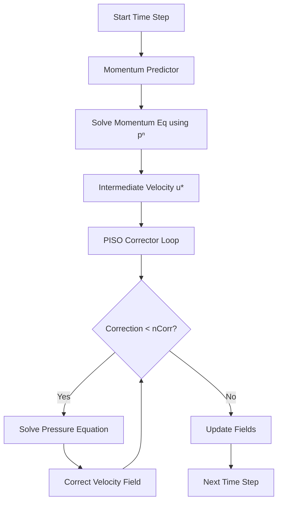
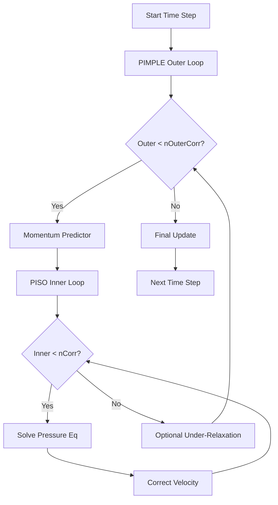
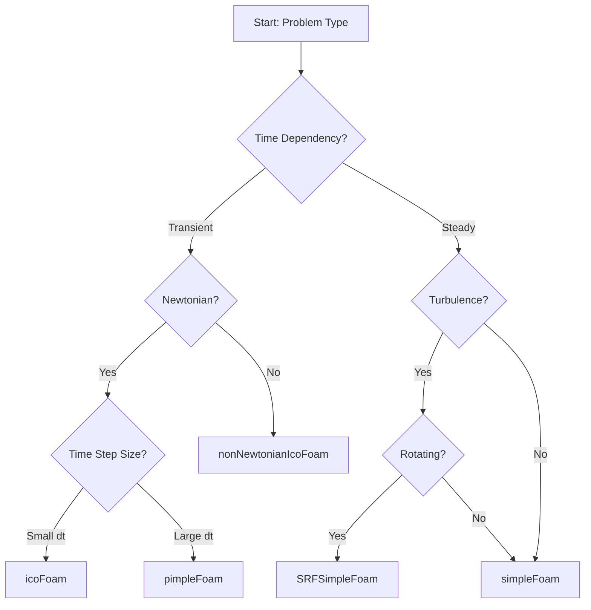

# Standard Incompressible Flow Solvers ใน OpenFOAM

เอกสารนี้นำเสนอ **รายละเอียดเชิงเทคนิค** ของ Incompressible flow solvers หลักใน OpenFOAM โดยเน้นที่สถาปัตยกรรมของ Algorithm การนำไปใช้งาน และแนวทางการเลือก Solver ที่เหมาะสม

---

## 1 ภาพรวม Core Solvers

| Solver | ชนิดการไหล | Algorithm | คุณสมบัติเด่น |
|--------|-------------|-----------|--------------|
| **icoFoam** | Transient Laminar | PISO | เรียบง่าย, Low Re, ไม่รองรับ Turbulence |
| **simpleFoam** | Steady-state Turbulent | SIMPLE | สำหรับปัญหาคงตัว, มี Under-relaxation |
| **pimpleFoam** | Transient Turbulent | PIMPLE | เสถียรสูง, รองรับ Large time-step ($Co > 1$) |
| **nonNewtonianIcoFoam** | Transient Non-Newtonian | PISO | ความหนืดแปรผันตาม Shear rate |
| **SRFSimpleFoam** | Steady Rotating Frame | SIMPLE | สำหรับเครื่องจักรกลหมุน |

---

## 2 icoFoam: Transient Laminar Flow Solver

### 2.1 คุณสมบัติหลัก

`icoFoam` เป็น Solver ที่เรียบง่ายที่สุดใน OpenFOAM สำหรับจำลองการไหลแบบ **Laminar** ที่ขึ้นกับเวลา

> [!INFO] ขอบเขตการใช้งาน
> - เหมาะสำหรับ **Reynolds number ต่ำ** ($Re < 2000$)
> - ไม่รองรับ **Turbulence modeling**
> - ใช้ **PISO algorithm** สำหรับ Pressure-velocity coupling
> - Time step แบบคงที่หรือแปรผันได้

### 2.2 สมการควบคุม

**สมการความต่อเนื่อง (Continuity Equation):**
$$\nabla \cdot \mathbf{u} = 0$$

**สมการโมเมนตัม (Momentum Equation):**
$$\rho \frac{\partial \mathbf{u}}{\partial t} + \rho (\mathbf{u} \cdot \nabla) \mathbf{u} = -\nabla p + \mu \nabla^2 \mathbf{u} + \mathbf{f}$$

**นิยามตัวแปร:**
- $\mathbf{u}$ = เวกเตอร์ความเร็ว
- $p$ = ความดัน
- $\rho$ = ความหนาแน่น (คงที่)
- $\mu$ = ความหนืดพลวัต
- $\mathbf{f}$ = แรงภายนอกต่อหน่วยปริมาตร
- $\nu = \mu/\rho$ = ความหนืดจลนศาสตร์

### 2.3 PISO Algorithm

**Pressure-Implicit with Splitting of Operators** ใช้วิธี Predictor-Corrector:


> **Figure 1:** แผนผังลำดับขั้นตอนของอัลกอริทึม PISO (Pressure-Implicit with Splitting of Operators) ซึ่งใช้กระบวนการ Predictor-Corrector เพื่อรักษาความแม่นยำเชิงเวลาและความต่อเนื่องของมวลในก้าวเวลาเดียว

**ขั้นตอนอัลกอริทึม:**

1. **Predictor Step**: แก้สมการโมเมนตัมหาความเร็วคาดการณ์ ($\mathbf{u}^*$) โดยใช้ความดันเก่า
2. **Corrector Loop**: แก้สมการความดันและอัปเดตความเร็วเพื่อให้เป็นไปตามเงื่อนไข Divergence-free ($\nabla \cdot \mathbf{u} = 0$)

### 2.4 OpenFOAM Implementation

```cpp
// Main time loop - iterate through each time step
while (runTime.loop())
{
    Info<< "Time = " << runTime.userTimeName() << nl << endl;

    // Calculate and display Courant number for stability monitoring
    #include "CourantNo.H"

    // Momentum predictor: Build and solve momentum equation
    // Constructs the implicit momentum matrix with time derivative,
    // convection, and diffusion terms
    fvVectorMatrix UEqn
    (
        fvm::ddt(U)              // Time derivative term
      + fvm::div(phi, U)         // Convection term (implicit)
      - fvm::laplacian(nu, U)    // Diffusion term (viscous)
    );

    // Solve momentum equation with pressure gradient as source term
    if (piso.momentumPredictor())
    {
        solve(UEqn == -fvc::grad(p));
    }

    // --- PISO loop: Pressure-velocity coupling correction
    while (piso.correct())
    {
        // Calculate reciprocal of diagonal coefficients for pressure equation
        volScalarField rAU(1.0/UEqn.A());
        
        // Compute HbyA = H(U)/A, where H contains off-diagonal terms
        // This represents the velocity field excluding pressure gradient
        volVectorField HbyA(constrainHbyA(rAU*UEqn.H(), U, p));
        
        // Calculate flux from HbyA and add time derivative correction
        surfaceScalarField phiHbyA
        (
            "phiHbyA",
            fvc::flux(HbyA)
          + fvc::interpolate(rAU)*fvc::ddtCorr(U, phi)
        );

        // Adjust mass flux to ensure global mass conservation
        adjustPhi(phiHbyA, U, p);

        // Update pressure boundary conditions for flux consistency
        constrainPressure(p, U, phiHbyA, rAU);

        // Non-orthogonal pressure corrector loop
        while (piso.correctNonOrthogonal())
        {
            // Pressure equation: Laplacian of pressure equals divergence of flux
            fvScalarMatrix pEqn
            (
                fvm::laplacian(rAU, p) == fvc::div(phiHbyA)
            );

            // Set reference cell and value for pressure (fixes pressure level)
            pEqn.setReference(pRefCell, pRefValue);

            // Solve pressure equation
            pEqn.solve();

            // On final non-orthogonal iteration, correct the flux
            if (piso.finalNonOrthogonalIter())
            {
                phi = phiHbyA - pEqn.flux();
            }
        }

        // Check and report continuity error
        #include "continuityErrs.H"

        // Correct velocity field using updated pressure gradient
        U = HbyA - rAU*fvc::grad(p);
        U.correctBoundaryConditions();
    }

    // Write results to disk
    runTime.write();

    Info<< "ExecutionTime = " << runTime.elapsedCpuTime() << " s"
        << "  ClockTime = " << runTime.elapsedClockTime() << " s"
        << nl << endl;
}
```

> **📂 Source:** `.applications/solvers/incompressible/icoFoam/icoFoam.C`
>
> **คำอธิบาย (Explanation):**
> โค้ดด้านบนแสดงการนำอัลกอริทึม PISO ไปใช้ใน OpenFOAM โดยเริ่มจากการสร้างเมทริกซ์สมการโมเมนตัมที่ประกอบด้วยเทอมอนุพันธ์เวลา Convection และ Diffusion จากนั้นทำการวนซ้ำ PISO loop เพื่อแก้สมการความดันและปรับค่าความเร็วให้สอดคล้องกับเงื่อนไขการอนุรักษ์มวล ขั้นตอนนี้ใช้เทคนิค HbyA (H divided by A) ซึ่งเป็นวิธีการทางพีชคณิตเพื่อแยกส่วนประกอบของความเร็วที่ไม่ได้รับอิทธิพลจากความดันออกมาก่อน แล้วจึงเติมเทอมความดันกลับเข้าไปในภายหลัง
>
> **แนวคิดสำคัญ (Key Concepts):**
> - **`fvm` vs `fvc`**: `fvm` (finite volume method) ใช้สำหรับ implicit terms ที่จะถูกนำไปประกอบเป็นเมทริกซ์ ส่วน `fvc` (finite volume calculus) ใช้สำหรับ explicit terms ที่คำนวณโดยตรง
> - **`UEqn.A()` และ `UEqn.H()`**: `A()` คือสัมประสิทธิ์บนเส้นทแยงมุมของเมทริกซ์ และ `H()` คือเทอม off-diagonal ที่เก็บผลรวมของ convection และ diffusion
> - **PISO loop**: วนซ้ำหลายครั้งภายใน time step เดียวเพื่อให้ความดันและความเร็วลู่เข้าสู่ค่าที่สอดคล้องกัน (coupling)
> - **Mass flux correction**: `phi = phiHbyA - pEqn.flux()` เป็นการปรับ mass flux ให้สอดคล้องกับความดันใหม่

**คำอธิบายโค้ด:**
- `fvm::ddt(U)` = เทอมอนุพันธ์เวลาของความเร็ว
- `fvm::div(phi, U)` = เทอม Convection
- `fvm::laplacian(nu, U)` = เทอม Diffusion
- `UEqn.A()` = สัมประสิทธิ์ Diagonal ของเมทริกซ์
- `rAU` = ค่าผกผันของสัมประสิทธิ์

---

## 3 simpleFoam: Steady-State Turbulent Flow Solver

### 3.1 คุณสมบัติหลัก

`simpleFoam` ใช้สำหรับหาผลเฉลยที่ **สภาวะคงตัว (Steady-state)** โดยรวมผลของ **Turbulence** ผ่านแบบจำลอง RANS

> [!TIP] ข้อดีของ SIMPLE
> - เหมาะสำหรับปัญหา **Stady-state**
> - **Computational cost** ต่ำต่อ iteration
> - รองรับ **Turbulence models** ได้หลากหลาย
> - Convergence เร็วสำหรับปัญหาที่ไม่ขึ้นกับเวลา

### 3.2 SIMPLE Algorithm

**Semi-Implicit Method for Pressure-Linked Equations** ใช้ **Under-Relaxation** เพื่อเสถียรภาพ:

**สมการ Under-Relaxation:**
$$\phi^{n+1} = \phi^n + \alpha_{\phi} (\phi^{new} - \phi^n)$$

โดยที่:
- $\phi$ = ตัวแปรใด ๆ (ความดัน, ความเร็ว, ฯลฯ)
- $\alpha_{\phi}$ = Under-relaxation factor ($0 < \alpha_{\phi} \leq 1$)
- $n$ = จำนวน iteration

**ค่า Under-Relaxation ทั่วไป:**

| ตัวแปร | ช่วงค่าแนะนำ | ผลกระทบ |
|---------|----------------|----------|
| ความดัน ($p$) | 0.2 - 0.4 | ค่าต่ำ = เสถียรขึ้น, ช้าลง |
| ความเร็ว ($\mathbf{u}$) | 0.5 - 0.8 | ค่าต่ำ = เสถียรขึ้น, ช้าลง |
| Turbulence ($k, \epsilon, \omega$) | 0.4 - 0.8 | ขึ้นกับปัญหา |

### 3.3 OpenFOAM Implementation

```cpp
// Main SIMPLE iteration loop - runs until steady-state convergence
while (simple.loop(runTime))
{
    Info<< "Time = " << runTime.userTimeName() << nl << endl;

    // Update any finite volume models (sources, constraints)
    fvModels.correct();

    // --- Pressure-velocity SIMPLE corrector
    {
        // Include and execute UEqn.H (momentum equation)
        // This file constructs the momentum equation matrix with turbulence
        #include "UEqn.H"
        
        // Include and execute pEqn.H (pressure equation)
        // This solves for pressure and corrects velocity
        #include "pEqn.H"
    }

    // Update viscosity and turbulence models
    viscosity->correct();
    turbulence->correct();

    // Write results if convergence criteria met
    runTime.write();

    Info<< "ExecutionTime = " << runTime.elapsedCpuTime() << " s"
        << "  ClockTime = " << runTime.elapsedClockTime() << " s"
        << nl << endl;
}
```

> **📂 Source:** `.applications/solvers/incompressible/simpleFoam/simpleFoam.C`
>
> **คำอธิบาย (Explanation):**
> โค้ดด้านบนแสดงโครงสร้างหลักของ simpleFoam ซึ่งใช้อัลกอริทึม SIMPLE สำหรับปัญหาสภาวะคงที่ โดยสมการโมเมนตัมและสมการความดันถูกแยกออกเป็นไฟล์ `UEqn.H` และ `pEqn.H` ตามลำดับ การวนซ้ำแต่ละครั้งจะแก้สมการโมเมนตัมด้วยความดันปัจจุบัน จากนั้นแก้สมการความดัน และปรับค่าความเร็วจนกว่าจะลู่เข้าสู่สภาวะคงที่ ความแตกต่างจาก PISO คือ SIMPLE ใช้ under-relaxation เพื่อรักษาเสถียรภาพของการวนซ้ำ
>
> **แนวคิดสำคัญ (Key Concepts):**
> - **SIMPLE loop**: ทำงานจนกว่าจะถึงสภาวะคงที่ (steady-state) ไม่ใช่การเดินทางข้ามเวลาแบบ transient
> - **UEqn.H และ pEqn.H**: แยกสมการออกเป็นไฟล์ Include เพื่อให้โค้ดเป็น modular และอ่านง่ายขึ้น
> - **Under-relaxation**: ใช้ใน UEqn.H และ pEqn.H เพื่อค่อยๆ อัปเดตค่าตัวแปร ป้องกันการ diverge
> - **Turbulence models**: `turbulence->correct()` อัปเดตค่าพารามิเตอร์ความปั่นไป เช่น k, epsilon, omega

**คำอธิบายโค้ด:**
- `turbulence->divDevReff(U)` = เทอม Reynolds stresses
- `UEqn().relax()` = ใช้ under-relaxation
- `UEqn().A()` = Diagonal coefficients
- `UEqn().H()` = Off-diagonal contributions
- `UEqn().flux()` = Face flux field

### 3.4 การตั้งค่า fvSolution

```cpp
solvers
{
    p
    {
        solver          GAMG;
        tolerance       1e-06;
        relTol          0.05;
        smoother        GaussSeidel;
    }

    U
    {
        solver          PBiCG;
        preconditioner  DILU;
        tolerance       1e-05;
        relTol          0;
    }
}

relaxationFactors
{
    fields
    {
        p               0.3;
    }
    equations
    {
        U               0.7;
    }
}

SIMPLE
{
    nNonOrthogonalCorrectors 0;
}
```

---

## 4 pimpleFoam: Robust Transient Turbulent Flow Solver

### 4.1 คุณสมบัติหลัก

`pimpleFoam` รวมข้อดีของ **PISO** (Temporal Accuracy) และ **SIMPLE** (Stability) เข้าด้วยกัน

> [!WARNING] ข้อดีและข้อจำกัด
> **ข้อดี:**
> - ใช้ Time-step ขนาดใหญ่ได้ ($Co > 1$)
> - เสถียรกว่า PISO ล้วน
> - ยืดหยุ่นในการตั้งค่า
>
> **ข้อจำกัด:**
> - ซับซ้อนที่สุดในบรรดา algorithms
> - ต้องการพารามิเตอร์เพิ่มเติม

### 4.2 PIMPLE Algorithm Characteristics

**ขั้นตอนการทำงาน:**



**คุณสมบัติสำคัญ:**

1. **Outer Correctors**: อนุญาตให้ทำซ้ำขั้นตอนทั้งหมดภายในหนึ่ง Time-step (คล้าย SIMPLE loops)
2. **Inner Correctors**: PISO corrections ภายในแต่ละ outer loop
3. **Stability**: ใช้ Under-relaxation ภายใน Time-step ได้
4. **Flexibility**: ปรับค่า $Co > 1$ ได้อย่างปลอดภัย

### 4.3 OpenFOAM Implementation

```cpp
// Main PIMPLE time loop - iterate through each time step
while (pimple.run(runTime))
{
    // Read dynamic mesh controls if mesh motion is enabled
    #include "readDyMControls.H"

    // Use Local Time Stepping (LTS) if enabled for faster pseudo-transient
    if (LTS)
    {
        #include "setRDeltaT.H"
    }
    else
    {
        // Calculate Courant number and adjust time step
        #include "CourantNo.H"
        #include "setDeltaT.H"
    }

    // Prepare mesh for possible motion
    fvModels.preUpdateMesh();

    // Update the mesh for topology change, mesh to mesh mapping
    mesh.update();

    // Increment time
    runTime++;

    Info<< "Time = " << runTime.userTimeName() << nl << endl;

    // --- Pressure-velocity PIMPLE corrector loop
    while (pimple.loop())
    {
        // Move mesh on first outer iteration or if configured
        if (pimple.firstPimpleIter() || moveMeshOuterCorrectors)
        {
            // Move the mesh
            mesh.move();

            if (mesh.changing())
            {
                // Update Multiple Reference Frame (MRF) zones
                MRF.update();

                // Correct fluxes after mesh motion
                if (correctPhi)
                {
                    #include "correctPhi.H"
                }

                // Check mesh Courant number for moving mesh
                if (checkMeshCourantNo)
                {
                    #include "meshCourantNo.H"
                }
            }
        }

        // Update any finite volume models
        fvModels.correct();

        // Include and execute momentum equation (UEqn.H)
        #include "UEqn.H"

        // --- Pressure corrector loop (PISO inner loop)
        while (pimple.correct())
        {
            // Include and execute pressure equation (pEqn.H)
            #include "pEqn.H"
        }

        // Update turbulence models on outer correction
        if (pimple.turbCorr())
        {
            viscosity->correct();
            turbulence->correct();
        }
    }

    // Write results to disk
    runTime.write();

    Info<< "ExecutionTime = " << runTime.elapsedCpuTime() << " s"
        << "  ClockTime = " << runTime.elapsedClockTime() << " s"
        << nl << endl;
}
```

> **📂 Source:** `.applications/solvers/incompressible/pimpleFoam/pimpleFoam.C`
>
> **คำอธิบาย (Explanation):**
> โค้ดด้านบนแสดงการนำอัลกอริทึม PIMPLE ไปใช้ซึ่งรวมความสามารถของทั้ง PISO และ SIMPLE โดยมี Outer loop (`pimple.loop()`) เพื่อทำซ้ำขั้นตอนทั้งหมดหลายครั้งภายใน time step เดียวเพื่อเสถียรภาพ และ Inner loop (`pimple.correct()`) เพื่อแก้สมการความดันด้วย PISO corrections โค้ดยังรองรับ mesh motion ผ่าน `mesh.move()` และ `correctPhi.H` ซึ่งปรับ fluxes หลังจาก mesh เคลื่อนที่ ทำให้เหมาะสำหรับปัญหา FSI (Fluid-Structure Interaction)
>
> **แนวคิดสำคัญ (Key Concepts):**
> - **Outer vs Inner loops**: Outer loop ทำหน้าที่เหมือน SIMPLE iteration ภายใน time step เดียว ส่วน Inner loop คือ PISO corrections
> - **Mesh motion**: รองรับ moving mesh ผ่าน `mesh.move()` และ flux correction ผ่าน `correctPhi.H`
> - **LTS (Local Time Stepping)**: ใช้ time step ที่แตกต่างกันในแต่ละ cell เพื่อเร่งการลู่เข้าสู่สภาวะคงที่
> - **MRF (Multiple Reference Frame)**: รองรับโซนหมุนและโซนนิ่งใน computational domain เดียว

### 4.4 การตั้งค่า fvSolution

```cpp
PIMPLE
{
    nOuterCorrectors    2;      // จำนวนรอบ SIMPLE ภายใน time-step
    nCorrectors         2;      // จำนวนรอบ PISO
    nNonOrthogonalCorrectors 0;

    // ใช้ under-relaxation ภายใน time-step (เป็นทางเลือก)
    consistent          yes;    // สำหรับความเสถียรสูง
}

relaxationFactors
{
    fields
    {
        p               0.3;
    }
    equations
    {
        U               0.7;
        k               0.7;     // Turbulence kinetic energy
        epsilon         0.7;     // Dissipation rate
    }
}
```

---

## 5 nonNewtonianIcoFoam: Non-Newtonian Fluid Solver

### 5.1 คุณสมบัติหลัก

Solver นี้จัดการกับของไหล **Non-Newtonian** ที่ความหนืดแปรผันตาม Shear rate

> [!INFO] Non-Newtonian Behavior
> ความหนืด ($\mu$) ไม่คงที่ แต่ขึ้นกับ **Shear rate** ($\dot{\gamma}$):
>
> $$\mu(\dot{\gamma}) = f(\dot{\gamma})$$
>
> ตัวอย่าง: เลือด, พอลิเมอร์, สารหล่อลื่น

**Non-Newtonian Models ทั่วไป:**

| Model | สมการ | การใช้งาน |
|-------|---------|-------------|
| Power-law | $\mu = K \dot{\gamma}^{n-1}$ | พอลิเมอร์, อาหาร |
| Carreau | $\mu = \mu_{\infty} + (\mu_0 - \mu_{\infty})(1 + \lambda^2 \dot{\gamma}^2)^{(n-1)/2}$ | ทั่วไป |
| Cross | $\mu = \frac{\mu_0}{1 + (K \dot{\gamma})^m}$ | พอลิเมอร์หลอม |

### 5.2 การตั้งค่า transportProperties

```cpp
transportModel  Cross;

CrossCoeffs
{
    nu0             [0 2 -1 0 0 0 0] 1e-4;    // Zero-shear viscosity
    nuInf           [0 2 -1 0 0 0 0] 1e-6;    // Infinite-shear viscosity
    m               0.4;                       // Power index
    K               [0 0 1 0 0 0 0] 10;        // Time constant
}
```

---

## 6 SRFSimpleFoam: Single Rotating Reference Frame Solver

### 6.1 คุณสมบัติหลัก

Solver สำหรับ **Steady-state** บนกรอบอ้างอิงหมุนเดียว (Single Rotating Reference Frame)

> [!TIP] การใช้งาน
> - พัดลม (Fans)
> - ปั๊ม (Pumps)
> - เทอร์ไบน์ (Turbines)
> - Propellers

### 6.2 สมการบนกรอบหมุน

**สมการโมเมนตัมบน Rotating Frame:**
$$\rho \left( \frac{\partial \mathbf{u}}{\partial t} + (\mathbf{u} \cdot \nabla) \mathbf{u} \right) = -\nabla p + \mu \nabla^2 \mathbf{u} + \mathbf{f} - \rho \left( 2 \boldsymbol{\Omega} \times \mathbf{u} + \boldsymbol{\Omega} \times (\boldsymbol{\Omega} \times \mathbf{r}) \right)$$

**เทอมเพิ่มเติม:**
- **Coriolis Force**: $-2\rho \boldsymbol{\Omega} \times \mathbf{u}$
- **Centrifugal Force**: $-\rho \boldsymbol{\Omega} \times (\boldsymbol{\Omega} \times \mathbf{r})$

โดยที่:
- $\boldsymbol{\Omega}$ = เวกเตอร์ความเร็วเชิงมุมเครื่องจักร
- $\mathbf{r}$ = เวกเตอร์ตำแหน่งจากแกนหมุน

### 6.3 การตั้งค่า SRFProperties

```cpp
SRFModel    SRFVelocity;

SRFCoeffs
{
    origin      (0 0 0);              // จุดกำเนิดการหมุน
    axis        (0 0 1);              // แกนหมุน
    omega       [0 0 -1 0 0 0 0] 104.72;  // เรด/วินาที (1000 RPM)
}
```

---

## 7 แนวทางการเลือก Solver

### 7.1 Quick Reference Guide

| สถานการณ์ | Solver แนะนำ | เหตุผล |
|-----------|-------------|---------|
| **Low Re, Transient** | `icoFoam` | เรียบง่ายและแม่นยำสำหรับ Laminar |
| **Steady Aerodynamics** | `simpleFoam` | ประสิทธิภาพสูงสุดสำหรับสภาวะคงที่ |
| **Large Time-step Transient** | `pimpleFoam` | รันได้เร็วและเสถียรที่ $Co > 1$ |
| **Non-Newtonian Fluid** | `nonNewtonianIcoFoam` | จัดการ Shear-rate viscosity |
| **Rotating Pump/Fan** | `SRFSimpleFoam` | รองรับ Coriolis และ Centrifugal |

### 7.2 Decision Flow



### 7.3 Flow Regime Characteristics

| ปัจจัย | Laminar | Turbulent | Steady | Transient | Newtonian | Non-Newtonian |
|--------|---------|-----------|--------|-----------|-----------|----------------|
| **icoFoam** | ✅ | ❌ | ❌ | ✅ | ✅ | ❌ |
| **simpleFoam** | ❌ | ✅ | ✅ | ❌ | ✅ | ❌ |
| **pimpleFoam** | ✅ | ✅ | ❌ | ✅ | ✅ | ❌ |
| **nonNewtonianIcoFoam** | ✅ | ❌ | ❌ | ✅ | ❌ | ✅ |
| **SRFSimpleFoam** | ❌ | ✅ | ✅ | ❌ | ✅ | ❌ |

---

## 8 เกณฑ์ Convergence และการตรวจสอบ

### 8.1 Convergence Criteria

**1. Residual-Based Convergence:**

$$\text{Residual} = \| \mathbf{A}x - \mathbf{b} \|$$

**เกณฑ์ทั่วไป:**
- **Residual สัมบูรณ์**: $10^{-6}$ ถึง $10^{-8}$ สำหรับสมการโมเมนตัม
- **Residual สัมพัทธ์**: $10^{-3}$ ถึง $10^{-5}$ ของ Residual เริ่มต้น

**2. การตรวจสอบ Solution Monitoring:**

| ปริมาณ | สูตร | การใช้งาน |
|---------|------|-------------|
| Drag coefficient | $C_D = \frac{F_D}{0.5\rho U^2 A}$ | แรงต้าน |
| Lift coefficient | $C_L = \frac{F_L}{0.5\rho U^2 A}$ | แรงยก |
| Mass flow rate | $\dot{m} = \rho \int \mathbf{u} \cdot \mathbf{n} \, dA$ | มวล |

**3. Global Balance:**
- สมดุลมวล: $\dot{m}_{in} - \dot{m}_{out} < \epsilon_m$
- สมดุลโมเมนตัม: $\mathbf{P}_{in} - \mathbf{P}_{out} < \epsilon_p$

### 8.2 การตรวจสอบ Residual

**รูปแบบ Convergence:**

| รูปแบบ | ลักษณะ | การจัดการ |
|---------|---------|-------------|
| ลดลงอย่างต่อเนื่อง | Convergence ในอุดมคติ | ดำเนินการต่อ |
| Convergence แบบแกว่ง | Amplitude ลดลง | ยอมรับได้หากลดลง |
| คงที่ (Plateau) | ค่าต่ำสุดเฉพาะที่ | ปรับพารามิเตอร์ |
| Divergence | Residual เพิ่มขึ้น | ต้องแก้ไขทันที |

**ตัวอย่าง Log File:**

```bash
Time = 1
smoothSolver: Solving for Ux, Initial residual = 0.00123, Final residual = 3.45e-06, No Iterations 4
smoothSolver: Solving for Uy, Initial residual = 0.000987, Final residual = 2.76e-06, No Iterations 4
GAMG: Solving for p, Initial residual = 0.0456, Final residual = 1.23e-07, No Iterations 12
```

---

## 9 การเพิ่มประสิทธิภาพ Solver

### 9.1 การเลือก Linear Solver

| Solver | ประเภทสมการ | ความเร็ว | หน่วยความจำ | การใช้งาน |
|--------|-------------|----------|-------------|-------------|
| **GAMG** | Elliptic | สูงมาก | ปานกลาง | Pressure equation |
| **PBiCGStab** | Non-symmetric | สูง | ต่ำ | Momentum equations |
| **smoothSolver** | General | ปานกลาง | ต่ำ | Bad conditioned systems |
| **PCG** | Symmetric | สูง | ต่ำ | Symmetric systems |

### 9.2 Preconditioners

| Preconditioner | Characteristics | Memory Usage | Best For |
|----------------|----------------|--------------|----------|
| **Diagonal** | Simple, fast | ต่ำ | Well-conditioned systems |
| **DILU** | Diagonal incomplete LU | ปานกลาง | General purpose |
| **FDIC** | Faster diagonal incomplete Cholesky | ปานกลาง-สูง | Symmetric systems |
| **GaussSeidel** | Classic iterative | ต่ำ | Preprocessing |

### 9.3 Parallel Processing

```bash
# Decompose case
decomposePar

# Run parallel simulation
mpirun -np 4 icoFoam -parallel

# Reconstruct results
reconstructPar
```

---

## 10 การแก้ไขปัญหา

### 10.1 ปัญหาทั่วไป

**1. การลู่ออก (Divergence)**
- ตรวจสอบ Mesh quality
- ตรวจสอบ Boundary conditions
- ปรับ Relaxation factors ให้ต่ำลง

**2. การลู่เข้าช้า**
- ปรับการตั้งค่า Solver tolerances
- ปรับปรุง Mesh quality
- ตรวจสอบ Initial conditions

**3. ปัญหา Pressure-Velocity Coupling**
- เพิ่มจำนวน PISO correctors
- ปรับค่า Under-relaxation
- ตรวจสอบสมการความดัน

### 10.2 เทคนิค Debugging

```cpp
// Enable debugging output for key variables
Info<< "Max U = " << max(mag(U)).value() << endl;
Info<< "Min p = " << min(p).value() << endl;
Info<< "Continuity error = " << continuityError << endl;
```

---

## 11 สรุป

> [!SUMMARY] สรุป Core Incompressible Solvers
>
> **icoFoam**: Simple PISO-based solver สำหรับ transient laminar flows
>
> **simpleFoam**: Efficient SIMPLE-based solver สำหรับ steady turbulent flows
>
> **pimpleFoam**: Robust PIMPLE-based solver สำหรับ large time-step transient flows
>
> **nonNewtonianIcoFoam**: Specialized solver สำหรับ shear-rate dependent viscosity
>
> **SRFSimpleFoam**: Rotating reference frame solver สำหรับ turbomachinery

**การเลือก Solver ที่เหมาะสมขึ้นอยู่กับ:**
1. **Flow characteristics** (Laminar/Turbulent, Steady/Transient)
2. **Fluid properties** (Newtonian/Non-Newtonian)
3. **Computational requirements** (Time-step size, Stability)
4. **Physical domain** (Rotating/Non-rotating frames)

---

**หัวข้อถัดไป**: [[Simulation Control and Management]] | และ [[Turbulence Modeling Integration]]