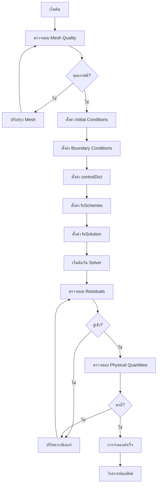

# การควบคุมและการจัดการการจำลอง (Simulation Control and Management)

การรันการจำลองที่ประสบความสำเร็จใน OpenFOAM ไม่ได้ขึ้นอยู่กับ Solver ที่เลือกเท่านั้น แต่ยังรวมถึงการตั้งค่าพารามิเตอร์เชิงตัวเลขและการตรวจสอบการลู่เข้าอย่างเป็นระบบ

---

## 🏗️ 1. โครงสร้าง Directory ของ Case

Case ของ OpenFOAM ต้องมีโครงสร้างที่เป็นมาตรฐานเพื่อให้ Solver เข้าถึงข้อมูลได้ถูกต้อง:

```bash
incompressibleCase/
├── 0/                       # Boundary & Initial Conditions
│   ├── U                   # Velocity [m/s]
│   ├── p                   # Pressure [m²/s²] (สำหรับ incompressible คือ p/rho)
│   └── (k, epsilon, omega)  # Turbulence quantities
├── constant/                # Physical & Mesh Data
│   ├── polyMesh/           # Mesh topology
│   ├── transportProperties # nu (kinematic viscosity)
│   └── turbulenceProperties # Turbulence model selection
└── system/                  # Numerical Control
    ├── controlDict         # Time/Output control
    ├── fvSchemes           # Discretization schemes
    └── fvSolution          # Solver settings & algorithms
```

> [!INFO] ความสำคัญของโครงสร้าง Directory
> โครงสร้างนี้เป็นมาตรฐานที่ OpenFOAM ใช้เพื่อระบุตำแหน่งของข้อมูลทั้งหมดที่จำเป็นสำหรับการจำลอง การจัดระเบียบที่ถูกต้องช่วยให้ Solver ทำงานได้อย่างมีประสิทธิภาพ

---

## ⚙️ 2. การควบคุมหลัก (`system/controlDict`)

ไฟล์ `controlDict` ทำหน้าที่กำหนดช่วงเวลาการคำนวณและความถี่ในการเขียนไฟล์ผลลัพธ์:

### 2.1 การตั้งค่าพื้นฐาน

```cpp
application     simpleFoam;
startFrom       startTime;
startTime       0;
stopAt          endTime;
endTime         1000;
deltaT          1;

writeControl    timeStep;
writeInterval   100;
purgeWrite      3;              // เก็บไฟล์ผลลัพธ์ล่าสุดไว้เพียง 3 ไฟล์
runTimeModifiable true;         // อนุญาตให้แก้ไขค่าในไฟล์ขณะรันอยู่ได้
```

### 2.2 การตั้งค่า Time Stepping สำหรับ Transient Flow

สำหรับการจำลองแบบ Transient การเลือก **Time step** ที่เหมาะสมเป็นสิ่งสำคัญ:

```cpp
application     pimpleFoam;
startFrom       latestTime;
startTime       0;
stopAt          endTime;
endTime         10.0;

deltaT          0.001;          // ขนาด time step เริ่มต้น
adjustTimeStep  yes;            // ปรับ time step อัตโนมัติ
maxCo           1.0;            // ค่า Courant number สูงสุด
maxDeltaT       0.01;           // ขนาด time step สูงสุด
```

**เงื่อนไข CFL (Courant-Friedrichs-Lewy):**

สำหรับความเสถียรของการคำนวณ:
$$\text{CFL} = \frac{|\mathbf{u}| \Delta t}{\Delta x} < 1$$

โดยที่:
- $\mathbf{u}$ = ความเร็วของไหล (m/s)
- $\Delta t$ = ขนาด time step (s)
- $\Delta x$ = ขนาดเซลล์ mesh (m)

### 2.3 การตรวจสอบค่าระหว่างรัน (Runtime Monitoring)

```cpp
functions
{
    // ตรวจสอบ Residual ของสมการ
    residuals
    {
        type            residuals;
        functionObjectLibs ("libutilityFunctionObjects.so");
        fields          (p U k epsilon);
        writeControl    timeStep;
        writeInterval   1;
    }

    // ตรวจสอบแรงที่กระทำต่อผนัง
    forces
    {
        type            forces;
        libs            (fieldFunctionObjects);
        patches         (walls);
        rho             rhoInf;
        rhoInf          1.225;
        writeControl    timeStep;
        writeInterval   1;
    }

    // ตรวจสอบค่า Courant number
    CourantNumber
    {
        type            CourantNumber;
        libs            (fieldFunctionObjects);
        writeControl    timeStep;
        writeInterval   1;
    }
}
```

---

## 🔧 3. การตั้งค่าความละเอียดเชิงตัวเลข (`system/fvSolution`)

### 3.1 Linear Solvers

OpenFOAM แก้ระบบสมการ $Ax=b$ โดยใช้ Linear Solvers ที่แตกต่างกันตามประเภทของสมการ:

```cpp
solvers
{
    p
    {
        solver          GAMG;
        tolerance       1e-07;
        relTol          0.01;
        smoother        GaussSeidel;
        nPreSweeps      0;
        nPostSweeps     2;
        cacheAgglomerator true;
    }

    pFinal
    {
        $p;
        relTol          0;
    }

    U
    {
        solver          smoothSolver;
        smoother        GaussSeidel;
        tolerance       1e-08;
        relTol          0;
    }

    "(k|epsilon|omega)"
    {
        solver          PBiCGStab;
        preconditioner  DILU;
        tolerance       1e-06;
        relTol          0;
    }
}
```

**การเลือก Linear Solver ที่เหมาะสม:**

| Solver | ประเภทสมการ | ความเร็ว | หน่วยความจำ | การใช้งานที่เหมาะสม |
|--------|----------------|------------|----------------|---------------------|
| **GAMG** | Elliptic (Pressure) | เร็วมาก | ปานกลาง | Pressure equation |
| **PBiCGStab** | Non-symmetric | ปานกลาง | ต่ำ | Momentum, Turbulence |
| **PCG** | Symmetric | ปานกลาง | ต่ำ | Symmetric systems |
| **smoothSolver** | ทั่วไป | ช้ากว่า | ต่ำมาก | กรณีที่มีเงื่อนไขไม่ดี |

### 3.2 Under-Relaxation (สำหรับ SIMPLE)

เพื่อรักษาความเสถียรใน `simpleFoam` จำเป็นต้องใช้ **Relaxation factors**:

$$\phi^{n+1} = \phi^n + \alpha (\phi^{new} - \phi^n)$$

โดยที่ $\alpha$ คือ Under-Relaxation Factor (0 < $\alpha$ ≤ 1)

```cpp
relaxationFactors
{
    fields
    {
        p               0.3;    // ความดัน: ค่าต่ำ = เสถียรขึ้น
    }
    equations
    {
        U               0.7;    // ความเร็ว
        "(k|epsilon|omega)" 0.7; // ค่า Turbulence
    }
}
```

**ค่าแนะนำสำหรับ Under-Relaxation:**

| ตัวแปร | ช่วงค่า | ผลกระทบของค่าต่ำ | ผลกระทบของค่าสูง |
|---------|-----------|---------------------|---------------------|
| **ความดัน (p)** | 0.2 - 0.5 | เสถียรขึ้น, ช้าลง | ลู่เข้าเร็วขึ้น, อาจ diverge |
| **ความเร็ว (U)** | 0.5 - 0.8 | เสถียรขึ้น, ช้าลง | ลู่เข้าเร็วขึ้น, เสี่ยง oscillation |
| **Turbulence** | 0.5 - 0.8 | เสถียรขึ้น | ลู่เข้าเร็วขึ้น |

### 3.3 การตั้งค่า Algorithm

#### SIMPLE Algorithm (Steady-State)

```cpp
SIMPLE
{
    nNonOrthogonalCorrectors 0;
    nCorrectors      2;         // จำนวนรอบ pressure-velocity coupling
    pRefCell         0;         // Cell สำหรับอ้างอิงความดัน
    pRefValue        0;         // ค่าความดันอ้างอิง
}
```

#### PIMPLE Algorithm (Transient ที่มี Time step ขนาดใหญ่)

```cpp
PIMPLE
{
    nCorrectors      2;         // จำนวนรอบ outer
    nNonOrthogonalCorrectors 0;
    nAlphaCorr       1;         // สำหรับ multiphase flow
    nAlphaSubCycles  2;         // Sub-cycling สำหรับ volume of fluid

    // การควบคุมการลู่เข้า
    residualControl
    {
        p               1e-6;
        U               1e-6;
        "(k|epsilon)"   1e-5;
    }
}
```

---

## 🔄 4. การตรวจสอบการลู่เข้า (Convergence Monitoring)

### 4.1 Residual Analysis

**Residual** คือตัววัดความไม่สมดุลของสมการเชิงตัวเลข:

$$\text{Residual} = \| \mathbf{A}\mathbf{x} - \mathbf{b} \|$$

โดยที่:
- $\mathbf{A}$ = Coefficient matrix
- $\mathbf{x}$ = Solution vector
- $\mathbf{b}$ = Right-hand side vector

**ประเภทของ Residual:**

1. **Initial Residual**: ค่าก่อนเริ่มแก้ในแต่ละ Iteration
   $$\text{Res}_0 = \| \mathbf{A}x_0 - \mathbf{b} \|$$

2. **Final Residual**: ค่าหลังจาก Solver ทำงานเสร็จในรอบนั้น
   $$\text{Res}_f = \| \mathbf{A}x_n - \mathbf{b} \|$$

3. **Normalized Residual**:
   $$\text{Res}_{norm} = \frac{\text{Res}_f}{\text{Res}_0}$$

**เกณฑ์แนะนำ:**

| ตัวแปร | Initial Residual | Final Residual | ความหมาย |
|---------|------------------|----------------|-------------|
| **ความดัน ($p$)** | - | $10^{-6}$ ถึง $10^{-7}$ | Pressure field ลู่เข้าแล้ว |
| **ความเร็ว ($U$)** | - | $10^{-7}$ ถึง $10^{-8}$ | Velocity field ลู่เข้าแล้ว |
| **Turbulence ($k, \varepsilon$)** | - | $10^{-5}$ ถึง $10^{-6}$ | Turbulence ลู่เข้าแล้ว |

**ตัวอย่าง Log Output:**

```bash
Time = 100

smoothSolver: Solving for Ux, Initial residual = 0.00123, Final residual = 3.45e-06, No Iterations 4
smoothSolver: Solving for Uy, Initial residual = 0.000987, Final residual = 2.76e-06, No Iterations 4
GAMG: Solving for p, Initial residual = 0.0456, Final residual = 1.23e-07, No Iterations 12
time step continuity errors : sum local = 2.34e-05, global = 1.23e-06, cumulative = 2.34e-06
SIMPLE iteration converged
```

**การวิเคราะห์:**
- Residual ลดลงจาก 0.00123 → 3.45e-06 (Ux)
- Residual ลดลงจาก 0.0456 → 1.23e-07 (p)
- Continuity error อยู่ในระดับที่ยอมรับได้

### 4.2 รูปแบบการลู่เข้า

| รูปแบบ | ลักษณะ | การจัดการ |
|---------|---------|-------------|
| **ลดลงอย่างต่อเนื่อง** | Convergence ในอุดมคติ | ดำเนินการต่อ |
| **Convergence แบบแกว่ง** | Amplitude ลดลง | ยอมรับได้หากลดลง |
| **คงที่ (Plateau)** | ค่าต่ำสุดเฉพาะที่ | ปรับพารามิเตอร์ |
| **Divergence** | Residual เพิ่มขึ้น | ต้องแก้ไขทันที |

### 4.3 Physical Quantity Monitoring

นอกเหนือจาก Residual ควรติดตามปริมาณทางกายภาพผ่าน `functions` ใน `controlDict`:

```cpp
functions
{
    // ตรวจสอบสัมประสิทธิ์แรง
    forceCoeffs
    {
        type            forceCoeffs;
        libs            (forces);
        patches         (airfoil);
        rho             rhoInf;
        rhoInf          1.225;
        CofR            (0.25 0 0);    // Center of rotation
        liftDir         (0 1 0);      // ทิศทางแรงยก
        dragDir         (1 0 0);      // ทิศทางแรงลาก
        pitchAxis       (0 0 1);      // แกน pitch
        magUInf         10.0;         // ความเร็วอนันต์
        lRef            1.0;          // ความยาวอ้างอิง
        Aref            1.0;          // พื้นที่อ้างอิง
        writeControl    timeStep;
        writeInterval   1;
    }

    // ตรวจสอบอัตราการไหล
    massFlowRate
    {
        type            surfaceRegion;
        libs            (libfieldFunctionObjects.so);
        operation       sum;
        regionType      patch;
        name            inlet;
        surfaceField    phi;          // Mass flux
        writeControl    timeStep;
        writeInterval   1;
    }
}
```

**สูตรการคำนวณปริมาณทางกายภาพ:**

| ปริมาณ | สูตร | การใช้งาน |
|---------|-------|-------------|
| Drag coefficient | $C_D = \frac{F_D}{0.5\rho U^2 A}$ | แรงต้าน |
| Lift coefficient | $C_L = \frac{F_L}{0.5\rho U^2 A}$ | แรงยก |
| Mass flow rate | $\dot{m} = \rho \int \mathbf{u} \cdot \mathbf{n} \, dA$ | การไหลของมวล |
| Pressure drop | $\Delta p = p_{in} - p_{out}$ | การไหล |

### 4.4 เกณฑ์ Convergence ที่ครอบคลุม

**เกณฑ์การตรวจสอบ Convergence ที่ดี:**

1. ✅ **Residual ลดลง** ถึงค่าที่กำหนด (10⁻⁶ ถึง 10⁻⁸)
2. ✅ **ปริมาณทางกายภาพคงที่** (Drag, Lift ไม่เปลี่ยนแปลงมาก)
3. ✅ **สมดุลมวล** (mass balance < 1%)
4. ✅ **Continuity errors** ต่ำ (cumulative < 10⁻⁵)

---

## 🛠️ 5. แนวทางปฏิบัติที่ดีที่สุด (Best Practices)

### 5.1 กลยุทธ์การเริ่มต้น

1. **เริ่มต้นจากสิ่งง่ายๆ**: ใช้ Scheme อันดับหนึ่ง (เช่น `upwind`) ในช่วงแรกเพื่อให้การจำลองเสถียร แล้วจึงเปลี่ยนเป็นอันดับสอง (เช่น `linearUpwind`) เพื่อความแม่นยำ

```cpp
// ใน fvSchemes - เริ่มต้นด้วย first-order
divSchemes
{
    div(phi,U)    Gauss upwind;
    div(phi,k)    Gauss upwind;
    div(phi,epsilon) Gauss upwind;
}

// หลังจากลู่เข้าแล้ว เปลี่ยนเป็น second-order
divSchemes
{
    div(phi,U)    Gauss linearUpwindV grad(U);
    div(phi,k)    Gauss linearUpwindV grad(k);
    div(phi,epsilon) Gauss linearUpwindV grad(epsilon);
}
```

### 5.2 การตรวจสอบคุณภาพ Mesh

```bash
# รัน checkMesh เสมอก่อนเริ่มจำลอง
checkMesh -allGeometry -allTopology
```

**เกณฑ์คุณภาพ Mesh:**

| พารามิเตอร์ | ค่าที่ยอมรับได้ | ผลกระทบหากเกิน |
|--------------|-----------------|-------------------|
| **Aspect Ratio** | < 1000 | การลู่เข้าช้า |
| **Non-orthogonality** | < 70° | ความเสถียรลดลง |
| **Skewness** | < 0.5 | ความแม่นยำลดลง |
| **Expansion Ratio** | < 5 | Convergence แย่ลง |

> [!WARNING] คำเตือนเรื่อง Mesh Quality
> หากค่า **Non-orthogonality** > 70° จำเป็นต้องเพิ่ม `nNonOrthogonalCorrectors` ใน `fvSolution`

### 5.3 การตรวจสอบสมดุลมวล

ตรวจสอบค่า `time step continuity errors` ในไฟล์ Log:

```bash
# ค่าที่ดีควรเป็น:
time step continuity errors : sum local = 2.34e-05, global = 1.23e-06, cumulative = 2.34e-06

# cumulative ควรมีค่าน้อยมาก (< 1e-4)
```

### 5.4 การปรับปรุงความเสถียร

**หากเกิด Divergence:**

1. **ลด Under-relaxation factors**
   ```cpp
   relaxationFactors
   {
       fields { p 0.2; }      // ลดจาก 0.3
       equations { U 0.5; }   // ลดจาก 0.7
   }
   ```

2. **เปลี่ยนเป็น First-order schemes**
   ```cpp
   divSchemes
   {
       div(phi,U)    Gauss upwind;  // จาก linearUpwind
   }
   ```

3. **ตรวจสอบ Boundary Conditions**
   - ตรวจสอบความสอดคล้องของ Inlet/Outlet
   - ตรวจสอบการกำหนด Pressure Reference
   - ตรวจสอบความเข้ากันได้ของ Wall Functions

### 5.5 การเพิ่มประสิทธิภาพการคำนวณ

**การใช้งานแบบขนาน (Parallel Processing):**

```bash
# 1. แบ่ง case ออกเป็นส่วนๆ
decomposePar

# 2. รันแบบขนาน
mpirun -np 4 simpleFoam -parallel

# 3. รวมผลลัพธ์
reconstructPar
```

**การปรับแต่ง GAMG Solver:**

```cpp
p
{
    solver          GAMG;
    tolerance       1e-07;
    relTol          0.01;
    smoother        GaussSeidel;
    nPreSweeps      0;
    nPostSweeps     2;
    cacheAgglomerator true;     // เพิ่มประสิทธิภาพ
    nCellsInCoarsestLevel 50;   // ปรับจำนวนเซลล์ระดับหยาบ
}
```

---

## 📋 6. สรุป Workflow การจำลอง


> **Figure 1:** แผนผังลำดับขั้นตอนการจำลองพลศาสตร์ของไหลเชิงคำนวณ (CFD Simulation Workflow) ใน OpenFOAM ตั้งแต่การตรวจสอบคุณภาพของเมช การตั้งค่าเงื่อนไขต่างๆ ไปจนถึงกระบวนการวนซ้ำเพื่อตรวจสอบความลู่เข้าของทั้งค่า Residual และปริมาณทางกายภาพ เพื่อให้มั่นใจในความถูกต้องและความเสถียรของผลลัพธ์ความปลอดภัยทางฟิสิกส์ไม่ส่งผลกระทบต่อความเร็วในการจำลอง ผ่านการใช้พลังของ C++ Template Metaprogramming ในการตรวจสอบความสอดคล้องทางมิติทั้งหมดที่ขั้นตอนการคอมไพล์โปรแกรมเพียงครั้งเดียว

---

## 🎯 7. สรุปหลักการสำคัญ

### ขั้นตอนการจัดการการจำลองที่มีประสิทธิภาพ:

1. **🏗️ เตรียมโครงสร้าง Case** ให้ถูกต้องตามมาตรฐาน OpenFOAM
2. **⚙️ ตั้งค่า controlDict** สำหรับการควบคุมเวลาและ output
3. **🔧 ตั้งค่า fvSolution** ด้วย Linear solvers และ Algorithm ที่เหมาะสม
4. **🏃 รับการจำลอง** พร้อมตรวจสอบ Convergence อย่างใกล้ชิด
5. **🛠️ แก้ไขปัญหา** ด้วยกลยุทธ์ที่เหมาะสมหากเกิด Divergence
6. **✅ ตรวจสอบผลลัพธ์** ด้วยหลายเกณฑ์ (Residuals + Physical quantities)

### คำแนะนำเชิงปฏิบัติ:

- ✅ เริ่มต้นด้วย **Low-order schemes** เพื่อความเสถียร
- ✅ ใช้ **Under-relaxation** สำหรับปัญหาที่ซับซ้อน
- ✅ ตรวจสอบ **Mesh quality** ก่อนรันเสมอ
- ✅ Monitor **Multiple convergence criteria** ไม่ใช่เพียง Residuals
- ✅ **Document** การเปลี่ยนแปลงและผลลัพธ์
- ✅ ใช้ **Parallel processing** สำหรับ Case ขนาดใหญ่
- ✅ เปิดใช้ **Run-time modifiable** สำหรับการปรับแต่งขณะรัน

---

**จบเนื้อหาโมดูล Incompressible Flow Solvers**
