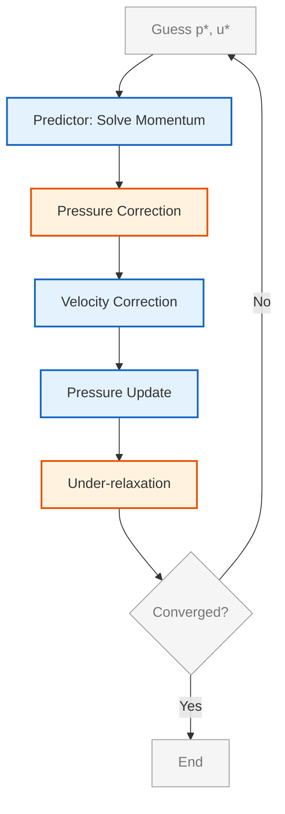
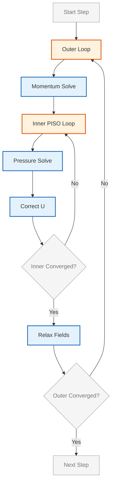

# การเชื่อมโยงความดัน-ความเร็ว (Pressure-Velocity Coupling)

## 🔍 ภาพรวม (Overview)

**การเชื่อมโยงความดัน-ความเร็ว (Pressure-velocity coupling)** เป็นความท้าทายเชิงตัวเลขที่สำคัญที่สุดใน Computational Fluid Dynamics (CFD) สำหรับการไหลที่อัดตัวไม่ได้ (incompressible flows) เนื่องจากสมการความต่อเนื่อง (continuity equation) ไม่มีพจน์ความดันที่ชัดเจน ความดันจึงทำหน้าที่เป็น "Lagrange multiplier" เพื่อบังคับให้สนามความเร็วเป็นไปตามเงื่อนไข Divergence-free

---

## 📐 รากฐานทางคณิตศาสตร์ (Mathematical Foundation)

### 1.1 ปัญหาการเชื่อมโยง (The Coupling Problem)

สำหรับของไหล Newtonian ที่อัดตัวไม่ได้ (incompressible Newtonian fluids) สมการควบคุมคือ:

**สมการความต่อเนื่อง (การอนุรักษ์มวล):**
$$\nabla \cdot \mathbf{u} = 0$$

**สมการโมเมนตัม (Navier-Stokes):**
$$\rho \frac{\partial \mathbf{u}}{\partial t} + \rho (\mathbf{u} \cdot \nabla) \mathbf{u} = -\nabla p + \mu \nabla^2 \mathbf{u} + \mathbf{f}$$

โดยที่:
- $\mathbf{u}$: เวกเตอร์สนามความเร็ว (velocity vector field) [m/s]
- $p$: สนามความดัน (pressure field) [Pa]
- $\rho$: ความหนาแน่นคงที่ (constant density) [kg/m³]
- $\mu$: ความหนืดพลวัต (dynamic viscosity) [Pa·s]
- $\mathbf{f}$: แรงภายนอก (body forces) [N/m³]

**ความท้าทายพื้นฐาน:**

1. **ความดันปรากฏเป็นเพียง Gradient เท่านั้น** ในสมการโมเมนตัม ($-\nabla p$) → ความดันถูกกำหนดได้ถึงค่าคงที่บวก (additive constant)

2. **ไม่มีสมการความดันที่เป็นอิสระ** สำหรับการไหลที่อัดตัวไม่ได้

3. **ความเร็วต้องเป็นไปตามสมการความต่อเนื่อง** (เงื่อนไข divergence-free) แต่สมการโมเมนตัมเพียงอย่างเดียวไม่สามารถบังคับใช้เงื่อนไขนี้ได้

4. **บน Collocated Grid** หากไม่จัดการอย่างเหมาะสมจะเกิดปัญหา **Checkerboard oscillations**

สิ่งนี้สร้าง **ปัญหาจุดอานม้า (saddle-point problem)**: ความดันทำหน้าที่เป็นตัวคูณ Lagrange (Lagrange multiplier) ที่บังคับใช้ข้อจำกัด divergence-free กับความเร็ว

> [!TIP] **Physical Analogy: The Event Manager (ผู้จัดการงานอีเวนต์)**
>
> ลองนึกภาพฝูงชนในงานคอนเสิร์ต (Velocity Field) ที่กำลังเต้น:
> - **Velocity ($\mathbf{u}$):** คือคนที่พยายามจะเคลื่อนที่ไปข้างหน้าตามแรงผลักดัน (Momentum)
> - **Continuity ($\nabla \cdot \mathbf{u} = 0$):**คือกฎความปลอดภัยที่ห้ามคนทับกัน (Overcrowding) หรือห้ามมีที่ว่างโหว่จนน่าเกลียด
> - **Pressure ($p$):** คือ **ผู้จัดการ (Manager)** ที่คอยมองภาพรวม เขาไม่ได้เต้นเอง แต่เขาคอยตะโกนสั่ง (Gradient) ว่า "ตรงนั้นแน่นไปแล้ว! ขยับไปทางซ้ายหน่อย!" หรือ "ตรงนั้นว่างเกินไป! ขยับเข้ามา!"
>
> **The Saddle Point:** ผู้จัดการ (Pressure) ต้องพยายามหา "คำสั่งที่เบาที่สุด" (Minimum adjustment) ที่ทำให้ทุกคนเต้นได้โดยไม่ผิดกฎความปลอดภัย (Constraint Satisfied) นี่คือหน้าที่ของ Pressure ในสมการ Navier-Stokes แบบ Incompressible

### 1.2 รูปแบบดิสครีต (Discretized Form)

เมื่อถูกทำให้เป็นดิสครีตโดยใช้วิธี Finite Volume สมการโมเมนตัมที่เซลล์ $P$ จะกลายเป็น:

$$a_P \mathbf{u}_P + \sum_N a_N \mathbf{u}_N = \mathbf{b}_P - (\nabla p)_P$$

โดยที่:
- $a_P$: สัมประสิทธิ์แนวทแยง (รวมส่วนประกอบเชิงเวลาและการพา/การแพร่)
- $a_N$: สัมประสิทธิ์เพื่อนบ้าน
- $\mathbf{b}_P$: เทอมแหล่งกำเนิด (source terms) (ไม่รวมความดัน)

ซึ่งสามารถจัดรูปใหม่ได้เป็น:

$$\mathbf{u}_P = \frac{\mathbf{H}(\mathbf{u})}{a_P} - \frac{1}{a_P} \nabla p$$

โดยที่ $\mathbf{H}(\mathbf{u}) = \frac{\mathbf{b}_P - \sum_N a_N \mathbf{u}_N}{a_P}$ บรรจุเทอมเพื่อนบ้านและเทอมแหล่งกำเนิด

---

## ⚙️ อัลกอริทึมหลักใน OpenFOAM

OpenFOAM นำเสนอสามอัลกอริทึมหลักเพื่อแก้ปัญหาการเชื่อมโยงนี้:

### 2.1 SIMPLE (Semi-Implicit Method for Pressure-Linked Equations)

**วัตถุประสงค์**: สำหรับสภาวะคงที่ (Steady-state)

**กลไก**: ใช้การทำนายโมเมนตัมตามด้วยการแก้ไขความดัน (Pressure Correction)

**ความเสถียร**: จำเป็นต้องใช้ **Under-relaxation** ($\alpha_p \approx 0.3, \alpha_U \approx 0.7$)

**ขั้นตอนอัลกอริทึม:**

1. **การทำนายโมเมนตัม (Momentum Prediction)**: แก้สมการโมเมนตัมโดยใช้สนามความดันที่คาดเดา $p^*$

$$\mathbf{u}_P^* = \mathbf{H}(\mathbf{u}^*) - \frac{1}{a_P}(\nabla p^*)_P$$

2. **การแก้ไขความดัน (Pressure Correction)**: สมการแก้ไขความดันได้มาจากการบังคับใช้ความต่อเนื่อง

$$\nabla \cdot \left( \frac{1}{a_P} \nabla p' \right) = \nabla \cdot \mathbf{u}^*$$

3. **การแก้ไขความเร็ว (Velocity Correction)**: แก้ไขความเร็วโดยใช้การแก้ไขความดัน

$$\mathbf{u}^{n} = \mathbf{u}^* - \frac{1}{a_P}\nabla p'$$
$$p^{n} = p^* + \alpha_p p'$$


> **Figure 1:** แผนผังลำดับขั้นตอนของอัลกอริทึม SIMPLE (Semi-Implicit Method for Pressure-Linked Equations) สำหรับการหาผลเฉลยในสภาวะคงที่ (Steady-state) ซึ่งแสดงกระบวนการวนซ้ำตั้งแต่การทำนายโมเมนตัม การแก้ไขความดันและความเร็ว ไปจนถึงการใช้การผ่อนคลาย (Under-relaxation) เพื่อให้ระบบเข้าสู่จุดที่บรรจบกัน

### 2.2 PISO (Pressure-Implicit with Splitting of Operators)

**วัตถุประสงค์**: สำหรับสภาวะชั่วคราว (Transient) ที่ต้องการความแม่นยำเชิงเวลาสูง

**กลไก**: ใช้ขั้นตอน Corrector หลายรอบภายในหนึ่ง Time-step เพื่อรักษา Temporal Accuracy

**ข้อจำกัด**: มักต้องการ $Co < 1$ เพื่อความเสถียร

**ขั้นตอนอัลกอริทึม:**

1. **ขั้นตอนการทำนาย (Predictor Step)**: แก้สมการโมเมนตัมโดยใช้ความดันจาก Time Step ก่อนหน้า $p^n$

2. **ขั้นตอนการแก้ไข (Corrector Steps)**: การแก้ไขความดัน-ความเร็วหลายครั้ง ($k = 1, 2, ..., n_{corr}$)

$$\nabla \cdot \left( \frac{\Delta t}{a_P} \nabla p'^{(k)} \right) = \nabla \cdot \mathbf{u}^{(k)}$$
$$\mathbf{u}^{(k+1)} = \mathbf{u}^{(k)} - \frac{\Delta t}{a_P} \nabla p'^{(k)}$$
$$p^{(k+1)} = p^{(k)} + p'^{(k)}$$

3. **Face Flux Update**: อัปเดต Face Flux $\phi$ เพื่อให้แน่ใจว่ามวลถูกอนุรักษ์

**คุณสมบัติหลัก:**
- **ไม่จำเป็นต้องใช้ under-relaxation** สำหรับขั้นตอนการแก้ไข
- **ขั้นตอนการแก้ไขหลายครั้ง** ช่วยปรับปรุงความแม่นยำเชิงเวลา (temporal accuracy)
- **มีประสิทธิภาพเป็นพิเศษ** สำหรับการไหลแบบชั่วคราว (transient flows) ที่มีช่วงเวลาขนาดเล็ก

### 2.3 PIMPLE (PISO + SIMPLE Hybrid)

**วัตถุประสงค์**: สำหรับสภาวะชั่วคราวที่ต้องการความแข็งแกร่ง (Robustness) สูง

**กลไก**: รวมลูปภายนอก (Outer loops) แบบ SIMPLE เข้ากับลูปภายในแบบ PISO

**จุดเด่น**: สามารถรันด้วย Time-step ขนาดใหญ่ได้ ($Co > 1$)

**โครงสร้าง:**
```
for nOuterCorrectors (SIMPLE-like):
    solve momentum equation
    for nCorrectors (PISO-like):
        pressure correction
        velocity correction
```


> **Figure 2:** แผนผังโครงสร้างของอัลกอริทึม PIMPLE ซึ่งเป็นการผสมผสานระหว่างลูปภายนอกแบบ SIMPLE (Outer loop) และลูปภายในแบบ PISO (Inner loop) เพื่อเพิ่มความเสถียรในการคำนวณสภาวะไม่คงที่ที่มีช่วงเวลาขนาดใหญ่ (Large time steps) โดยอนุญาตให้ค่า Courant number สูงกว่า 1 ได้โดยไม่สูญเสียความแม่นยำทางฟิสิกส์

**ประโยชน์ของ PIMPLE:**
- ความเสถียรสำหรับ time step ขนาดใหญ่
- การลู่เข้าที่แข็งแกร่งสำหรับปัญหา strongly coupled
- ยืดหยุ่นสำหรับทั้งสภาวะคงที่และชั่วคราว

---

## 🛠️ เทคนิคพิเศษใน OpenFOAM

### 3.1 Rhie-Chow Interpolation

เพื่อป้องกันปัญหาสนามความดันแบบตารางหมากรุกบน Collocated Grid OpenFOAM ใช้การประมาณค่าความเร็วที่หน้าเซลล์ ($\mathbf{u}_f$) แบบพิเศษ:

$$\mathbf{u}_f = \overline{\mathbf{u}}_f - \mathbf{D}_f (\nabla p_f - \overline{\nabla p}_f)$$

โดยที่:
- $\overline{\mathbf{u}}_f$ คือความเร็วที่ประมาณค่าในช่วงเชิงเส้น
- $\mathbf{D}_f$ คือเมทริกซ์สัมประสิทธิ์ที่จุดศูนย์กลางหน้าเซลล์
- $\nabla p_f$ คือเกรเดียนต์ความดันที่หน้าเซลล์
- $\overline{\nabla p}_f$ คือเกรเดียนต์ความดันที่ประมาณค่าในช่วง

เทอมที่เพิ่มเข้ามาทำหน้าที่เป็น Numerical Diffusion ที่ช่วยเชื่อมโยงความดันและความเร็วในระดับเซลล์

**OpenFOAM Code Implementation:**
```cpp
// Rhie-Chow interpolation implementation
// Interpolate velocity field to cell faces using linear interpolation
surfaceScalarField phiU
(
    fvc::interpolate(U, "interpolate(U)") & mesh.Sf()
);

// Pressure gradient correction term
// Calculate pressure gradient contribution at cell faces
surfaceScalarField gradpByA
(
    (fvc::interpolate(rAU)*fvc::snGrad(p))*mesh.magSf()
);

// Final flux calculation combining velocity and pressure correction
phi = phiU - gradpByA;
```

<details>
<summary>📖 คำอธิบายเชิงลึก (Thai Deep Dive)</summary>

**แหล่งที่มา (Source):** เทคนิค Rhie-Chow Interpolation ถูกนำไปใช้ใน OpenFOAM solvers หลายตัว โดยเฉพาะใน `applications/solvers/multiphase/multiphaseEulerFoam` ซึ่งต้องการความแม่นยำสูงในการคำนวณ Face Flux สำหรับระบบหลายเฟส

**คำอธิบาย (Explanation):**
- **`fvc::interpolate(U)`**: ฟังก์ชันสำหรับ interpolate ความเร็วจากจุดศูนย์กลางเซลล์ไปยังหน้าเซลล์ โดยใช้ linear interpolation เป็นค่าเริ่มต้น
- **`mesh.Sf()`**: เวกเตอร์พื้นที่หน้าเซลล์ (face area vector) ใช้ในการคำนวณ flux
- **`rAU`**: Reciprocal of diagonal coefficient ($1/a_P$) จากการแก้สมการโมเมนตัม
- **`fvc::snGrad(p)`**: Surface normal gradient ของความดัน คำนวณที่หน้าเซลล์โดยตรง
- **`mesh.magSf()`**: ขนาด (magnitude) ของเวกเตอร์พื้นที่หน้าเซลล์

**แนวคิดสำคัญ (Key Concepts):**
1. **Prevention of Checkerboard Oscillations**: การเพิ่ม pressure gradient correction term ช่วยกำจัดปัญหาการสั่นของสนามความดันแบบ checkerboard ซึ่งเกิดจากการใช้ collocated grid arrangement
2. **Mass Conservation**: การคำนวณผ่าน Rhie-Chow ช่วยให้การอนุรักษ์มวลเป็นไปอย่างถูกต้องที่หน้าเซลล์
3. **Coupling Strength**: เทอม correction ทำหน้าที่เชื่อมโยงความดันระหว่างเซลล์ข้างเคียง ทำให้การแก้สมการความดันมีความเสถียรมากขึ้น

</details>

### 3.2 Non-Orthogonal Correction

สำหรับ Mesh ที่ไม่ตั้งฉาก ($\theta > 0$) OpenFOAM จะทำการวนซ้ำเพื่อแก้ไขความคลาดเคลื่อนของ Laplacian operator

**เกรเดียนต์หน้าเซลล์ที่แก้ไขแล้ว:**
$$\nabla \phi_f \cdot \mathbf{S}_f = \underbrace{\frac{\phi_N - \phi_P}{d_{PN}} |\mathbf{S}_f|}_{\text{orthogonal term}} + \underbrace{\overline{(\nabla \phi)}_f \cdot (\mathbf{S}_f - \mathbf{d}_{PN})}_{\text{non-orthogonal correction}}$$

**OpenFOAM Code Implementation:**
```cpp
// Non-orthogonal correction loop
// Iteratively correct for mesh non-orthogonality errors
while (pimple.correctNonOrthogonal())
{
    // Solve pressure equation with Laplacian operator
    // The operator automatically handles non-orthogonal correction
    fvScalarMatrix pEqn
    (
        fvm::laplacian(rAU, p) == fvc::div(phiHbyA)
    );
    pEqn.solve();
}
```

<details>
<summary>📖 คำอธิบายเชิงลึก (Thai Deep Dive)</summary>

**แหล่งที่มา (Source):** การจัดการ Mesh non-orthogonality เป็นเทคนิคพื้นฐานใน OpenFOAM ที่ใช้ใน solvers เกือบทุกตัว โดยเฉพาะใน `applications/solvers/multiphase/multiphaseEulerFoam` ซึ่งมักต้องจัดการกับ Mesh ที่ซับซ้อน

**คำอธิบาย (Explanation):**
- **`pimple.correctNonOrthogonal()`**: ฟังก์ชันที่ตรวจสอบว่าจำเป็นต้องทำ non-orthogonal correction อีกครั้งหรือไม่ โดยอิงจาก `nNonOrthogonalCorrectors` ใน `fvSolution`
- **`fvm::laplacian(rAU, p)`**: Finite Volume Method Laplacian operator ซึ่งรวมถึง:
  - **Orthogonal part**: เกรเดียนต์แบบตั้งฉากกับหน้าเซลล์ (direct neighbor contribution)
  - **Non-orthogonal part**: เกรเดียนต์จากการแก้ไขเมื่อ Mesh ไม่ตั้งฉาก (explicit correction term)
- **`fvc::div(phiHbyA)`**: Divergence ของ flux ที่คำนวณจากความเร็วที่แก้ไขแล้ว (H-by-A)

**แนวคิดสำคัญ (Key Concepts):**
1. **Mesh Quality Dependency**: Mesh ที่ไม่ตั้งฉาก ($\theta > 70^\circ$) จะต้องการจำนวน correction loops มากขึ้น ซึ่งเพิ่มเวลาคำนวณ
2. **Explicit Correction**: เทอม non-orthogonal correction ถูกจัดการแบบ explicit ทำให้อาจต้องการ under-relaxation สำหรับ Mesh ที่มีคุณภาพต่ำ
3. **Convergence Acceleration**: การวนซ้ำแก้ไขช่วยให้ pressure equation ลู่เข้าได้ดีขึ้นแม้บน Mesh ที่ไม่สมบูรณ์

</details>

**แนวทางปฏิบัติที่แนะนำ:**

| คุณภาพ Mesh | จำนวนการแก้ไขที่แนะนำ | เหตุผล |
|-------------|----------------------|---------|
| **ดีเยี่ยม (non-orthogonality < 30°)** | 0-1 ครั้ง | ข้อผิดพลาดต่ำมาก |
| **ดี (30°-60°)** | 1-2 ครั้ง | ข้อผิดพลาดปานกลาง |
| **ยอมรับได้ (60°-70°)** | 2-3 ครั้ง | ต้องการการแก้ไขมากขึ้น |
| **ไม่ดี (> 70°)** | 3+ ครั้งหรือปรับปรุง Mesh | ข้อผิดพลาดสูงมาก |

---

## 📋 สรุปพารามิเตอร์ที่แนะนำ (Recommended Parameters)

| อัลกอริทึม | Pressure Relaxation | Velocity Relaxation | nCorrectors | nOuterCorrectors |
|------------|---------------------|---------------------|-------------|------------------|
| **SIMPLE** | 0.2 - 0.3 | 0.5 - 0.7 | 1 | N/A |
| **PISO** | 1.0 (No relax) | 1.0 (No relax) | 2 - 3 | N/A |
| **PIMPLE** | 0.3 - 0.7 (Outer) | 0.6 - 0.9 (Outer) | Inner: 2 | Outer: 2-5 |

### ตัวอย่างการตั้งค่าใน `fvSolution`

**SIMPLE:**
```cpp
SIMPLE
{
    // Number of non-orthogonal correctors
    nNonOrthogonalCorrectors 0;
    
    // Reference cell for pressure level fixing
    pRefCell        0;
    pRefValue       0;

    // Under-relaxation factors for stability
    relaxationFactors
    {
        fields
        {
            p               0.3;
        }
        equations
        {
            U               0.7;
            k               0.7;
            epsilon         0.7;
        }
    }
}
```

<details>
<summary>📖 คำอธิบายเชิงลึก (Thai Deep Dive)</summary>

**แหล่งที่มา (Source):** การตั้งค่า SIMPLE algorithm ใน OpenFOAM ถูกใช้ใน `applications/solvers/incompressible/simpleFoam` และ solvers อื่นๆ สำหรับ steady-state simulations

**คำอธิบาย (Explanation):**
- **`nNonOrthogonalCorrectors`**: จำนวนรอบการแก้ไขสำหรับ Mesh ที่ไม่ตั้งฉาก ค่า 0 หมายถึงไม่มีการแก้ไข
- **`pRefCell` / `pRefValue`**: ใช้กำหนดระดับความดันอ้างอิง เนื่องจากความดันในสมการ incompressible ถูกกำหนดได้เฉพาะค่าสัมพัทธ์เท่านั้น
- **`relaxationFactors`**: Under-relaxation factors สำหรับเสถียรภาพเชิงตัวเลข
  - **Fields**: ใช้กับสนามตัวแปรโดยตรง (เช่น pressure)
  - **Equations**: ใช้กับสมการ (เช่น momentum equation)

**แนวคิดสำคัญ (Key Concepts):**
1. **Pressure Reference Problem**: สำหรับการไหลแบบ incompressible ความดันถูกกำหนดได้เฉพาะค่าสัมพัทธ์ ดังนั้นต้องมีการ fix ค่าความดันที่เซลล์หนึ่งเพื่อกำจัด singular matrix
2. **Under-relaxation Necessity**: อัลกอริทึม SIMPLE จำเป็นต้องใช้ under-relaxation เพื่อให้แน่ใจว่าการวนซ้ำจะลู่เข้า เนื่องจาก nonlinear coupling ที่แข็งแกร่ง
3. **Field vs Equation Relaxation**: Field relaxation ถูกใช้ก่อนการแก้สมการ ในขณะที่ equation relaxation ถูกใช้ระหว่างการแก้สมการ

</details>

**PISO:**
```cpp
PISO
{
    // Number of pressure-velocity correction loops
    nCorrectors          2;
    
    // Non-orthogonal correction iterations
    nNonOrthogonalCorrectors 0;
    
    // Pressure reference cell and value
    pRefCell             0;
    pRefValue            0;
}
```

<details>
<summary>📖 คำอธิบายเชิงลึก (Thai Deep Dive)</summary>

**แหล่งที่มา (Source):** การตั้งค่า PISO algorithm ใช้ใน `applications/solvers/incompressible/pisoFoam` และ solvers อื่นๆ สำหรับ transient simulations

**คำอธิบาย (Explanation):**
- **`nCorrectors`**: จำนวนรอบการแก้ไขความดัน-ความเร็วภายในหนึ่ง time step โดยทั่วไปใช้ 2-3 รอบสำหรับความแม่นยำเชิงเวลาที่ดี
- **ไม่มี relaxation factors**: อัลกอริทึม PISO ไม่ต้องการ under-relaxation เนื่องจากใช้ correction steps หลายครั้งแทน

**แนวคิดสำคัญ (Key Concepts):**
1. **Temporal Accuracy**: จำนวน correctors ส่งผลต่อความแม่นยำเชิงเวลา มากเกินไปอาจทำให้การคำนวณไม่มีประสิทธิภาพ
2. **Mass Conservation Enforcement**: แต่ละ correction loop ช่วยบังคับใช้เงื่อนไขความต่อเนื่อง (divergence-free condition) ให้แม่นยำขึ้น
3. **Courant Number Limitation**: PISO โดยทั่วไปต้องการ Co < 1 สำหรับความเสถียร ยกเว้นกรณีที่มีการปรับปรุงพิเศษ

</details>

**PIMPLE:**
```cpp
PIMPLE
{
    // Number of outer correctors (SIMPLE-like loops)
    nOuterCorrectors    2;
    
    // Number of inner correctors (PISO-like loops)
    nCorrectors         2;
    
    // Non-orthogonal correction iterations
    nNonOrthogonalCorrectors 0;
    
    // Pressure reference cell and value
    pRefCell            0;
    pRefValue           0;

    // Relaxation factors for outer loops
    relaxationFactors
    {
        fields
        {
            p           0.3;
        }
        equations
        {
            U           0.7;
        }
    }
}
```

<details>
<summary>📖 คำอธิบายเชิงลึก (Thai Deep Dive)</summary>

**แหล่งที่มา (Source):** การตั้งค่า PIMPLE algorithm ใช้ใน `applications/solvers/incompressible/pimpleFoam` และ solvers ขั้นสูง เช่น `multiphaseEulerFoam`

**คำอธิบาย (Explanation):**
- **`nOuterCorrectors`**: จำนวนลูปภายนอกแบบ SIMPLE ที่ทำให้สามารถใช้ time step ขนาดใหญ่ได้
- **`nCorrectors`**: จำนวนลูปภายในแบบ PISO ภายในแต่ละ outer loop
- **`relaxationFactors`**: ใช้เฉพาะกับ outer loops เท่านั้น เพื่อเสถียรภาพ

**แนวคิดสำคัญ (Key Concepts):**
1. **Large Time Step Capability**: Outer loops ช่วยให้สามารถใช้ time step ขนาดใหญ่ (Co > 1) ได้โดยยังคงความแม่นยำ
2. **Hybrid Approach**: การผสมผสาน SIMPLE และ PISO ช่วยให้ได้ทั้งความเสถียรและความแม่นยำเชิงเวลา
3. **Computational Cost**: การเพิ่ม outer correctors จะเพิ่มเวลาคำนวณ แต่ช่วยลดจำนวน time steps ที่ต้องการ

</details>

---

## 🎯 การเลือกอัลกอริทึมที่เหมาะสม

### ตารางการเปรียบเทียบ

| คุณสมบัติ | SIMPLE | PISO | PIMPLE |
|---------|--------|------|---------|
| **ชื่อเต็ม** | Semi-Implicit Method for Pressure-Linked Equations | Pressure-Implicit with Splitting of Operators | Merged PISO-SIMPLE |
| **ความแม่นยำเชิงเวลา** | สภาวะคงที่ (pseudo-time) | Transient อันดับ 2 | อันดับ 1–2 (ขึ้นอยู่กับ outer loops) |
| **Relaxation factors** | จำเป็น (α_u ≈ 0.7, α_p ≈ 0.3) | ไม่มี | Outer: จำเป็น, Inner: ไม่มี |
| **การแก้ไขต่อขั้นตอน** | 1 | 2–4 (nCorrectors) | Outer × Inner (nOuter × nCorr) |
| **ขีดจำกัด Courant number** | ไม่มี (pseudo-time) | Co < 1 โดยทั่วไป | Co > 1 เป็นไปได้ด้วย outer relaxation |
| **เหมาะที่สุดสำหรับ** | Steady RANS, natural convection | LES, DNS, startup transients | Large Time Steps, Moving Mesh, Multiphase |
| **OpenFOAM solver** | `simpleFoam` | `pisoFoam` | `pimpleFoam` |

### แนวทางการเลือก

1. **การไหลเป็นแบบ Steady หรือไม่?** → ใช้ **SIMPLE**
2. **ความแม่นยำเชิงเวลาสำคัญหรือไม่เมื่อใช้ Δt ขนาดเล็ก?** → ใช้ **PISO**
3. **ต้องการ Time Step ขนาดใหญ่หรือฟิสิกส์ที่ซับซ้อนหรือไม่?** → ใช้ **PIMPLE**

### การใช้งานที่แนะนำ

| การใช้งาน | อัลกอริทึมหลัก | เหตุผล |
|-------------|-------------------|-----------|
| **Steady-state aerodynamics** | SIMPLE | มีประสิทธิภาพสูงสุดสำหรับ steady RANS |
| **Transient vortex shedding** | PISO | จับความถี่ได้อย่างแม่นยำ |
| **Multiphase VOF** | PIMPLE | จัดการอัตราส่วนความหนาแน่นขนาดใหญ่ได้ |
| **Moving mesh (FVM)** | PIMPLE | Outer relaxation ทำให้การเคลื่อนที่ของ Mesh เสถียร |
| **Buoyancy-driven flow** | PIMPLE | เชื่อมโยงความดันกับการเปลี่ยนแปลงความหนาแน่น |
| **LES/DNS** | PISO | ความแม่นยำเชิงเวลาเป็นสิ่งสำคัญ |

---

## 📊 การตรวจสอบความลู่เข้า (Convergence Monitoring)

### การตั้งค่า Solver ใน OpenFOAM

```cpp
solvers
{
    p
    {
        // Generalized Geometric-Algebraic Multi-grid solver
        solver          GAMG;
        
        // Absolute and relative convergence tolerances
        tolerance       1e-7;
        relTol          0.01;
        
        // Smoother for multi-grid levels
        smoother        GaussSeidel;
        
        // Number of pre and post smoothing sweeps
        nPreSweeps      0;
        nPostSweeps     2;
        
        // Cache agglomeration for efficiency
        cacheAgglomeration on;
    }

    U
    {
        // Smooth solver for velocity
        solver          smoothSolver;
        
        // Gauss-Seidel smoother
        smoother        GaussSeidel;
        
        // Absolute tolerance only (no relative tolerance)
        tolerance       1e-8;
        relTol          0;
        
        // Number of smoothing sweeps
        nSweeps         1;
    }
}
```

<details>
<summary>📖 คำอธิบายเชิงลึก (Thai Deep Dive)</summary>

**แหล่งที่มา (Source):** การตั้งค่า linear solvers ใน OpenFOAM ถูกใช้ในทุก solver ที่ใช้ Finite Volume Method

**คำอธิบาย (Explanation):**
- **`GAMG` (Generalized Algebraic Multi-Grid)**: Solver ประเภท multi-grid ที่มีประสิทธิภาพสูงสำหรับสมการ elliptic เช่น pressure equation
- **`smoothSolver`**: Solver ที่ใช้ iterative smoothing เหมาะสำหรับ hyperbolic/parabolic equations เช่น momentum equation
- **`tolerance` / `relTol`**: เกณฑ์การหยุดคำนวณ
  - **Absolute tolerance**: ค่าความคลาดเคลื่อนสัมบูรณ์
  - **Relative tolerance**: ค่าความคลาดเคลื่อนสัมพัทธ์จาก initial residual
- **`smoother`**: วิธีการ smooth สำหรับ multi-grid (Gauss-Seidel, DIC, etc.)

**แนวคิดสำคัญ (Key Concepts):**
1. **Solver Selection**: GAMG เหมาะสำหรับ pressure equation เนื่องจากเป็น elliptic equation ที่มี global coupling สูง
2. **Convergence Criteria**: การตั้งค่า `relTol` ต่ำ (0.01) ช่วยให้การแก้สมการมีความแม่นยำสูงในแต่ละ time step
3. **Efficiency vs Accuracy**: การเพิ่ม `nPostSweeps` ช่วยเพิ่มความแม่นยำ แต่เพิ่มเวลาคำนวณ

</details>

### การตรวจสอบการลู่เข้าโดยรวม

```cpp
SIMPLE
{
    // Convergence flag for overall algorithm
    converged       false;
    
    // Residual-based convergence criteria
    residualControl
    {
        p               1e-6;
        U               1e-5;
        '(k|epsilon|omega)'  1e-5;
    }
}
```

<details>
<summary>📖 คำอธิบายเชิงลึก (Thai Deep Dive)</summary>

**แหล่งที่มา (Source):** การตรวจสอบการลู่เข้าของอัลกอริทึม SIMPLE ใน OpenFOAM

**คำอธิบาย (Explanation):**
- **`converged`**: Flag สำหรับบอกว่าอัลกอริทึมลู่เข้าแล้วหรือไม่
- **`residualControl`**: กำหนดค่า residual สูงสุดที่ยอมรับได้สำหรับแต่ละตัวแปร
- **Regex Pattern**: `'(k|epsilon|omega)'` ใช้ regular expression เพื่อใช้ค่าเดียวกันกับ turbulence quantities หลายตัว

**แนวคิดสำคัญ (Key Concepts):**
1. **Residual Definition**: Initial residual เป็นความแตกต่างระหว่าง solution ปัจจุบันกับ solution ก่อนหน้า
2. **Convergence Hierarchy**: Pressure ต้องการ residual ต่ำกว่า velocity เนื่องจาก sensitivity ต่อ mass conservation
3. **Physical Convergence**: นอกเหนือจาก numerical residuals ควรตรวจสอบ physical quantities ด้วย

</details>

### ตัวบ่งชี้การลู่เข้าทางกายภาพ

| ตัวบ่งชี้ | วิธีการตรวจสอบ | เกณฑ์ที่ยอมรับได้ |
|------------|-------------------|-------------------|
| **การลู่เข้าของแรง/โมเมนตัม** | ตรวจสอบ drag, lift, moment | ΔF/F < 1% |
| **การอนุรักษ์อัตราการไหลเชิงมวล** | เปรียบเทียบอัตราการไหลทางเข้า/ออก | < 1% |
| **การลดลงของความดัน** | ตรวจสอบความแตกต่างของความดัน | คงที่ |

---

## 🔗 การเชื่อมโยงกับไฟล์อื่น ๆ

### การพึ่งพาโดยตรง

**จาก: `../01_INCOMPRESSIBLE_FLOW_SOLVERS/00_Overview.md`**

เนื้อหาเกี่ยวกับการเชื่อมโยงความดัน-ความเร็วนี้สร้างขึ้นโดยตรงบนพื้นฐานของ **Incompressible Flow Solver**

| Solver | Algorithm | ประเภทการจำลอง |
|--------|-----------|------------------|
| **simpleFoam** | SIMPLE algorithm | สภาวะคงที่ (steady-state) |
| **pimpleFoam** | PIMPLE algorithm | สภาวะไม่คงที่พร้อมช่วงเวลาขนาดใหญ่ |
| **icoFoam** | เฉพาะ pressure-velocity coupling | Transient Laminar Flow |

### ความก้าวหน้าต่อไป

**ถึง: `../03_TURBULENCE_MODELING/00_Overview.md`**

กรอบการทำงานการเชื่อมโยงความดัน-ความเร็วเป็น **รากฐานสำหรับการนำ Turbulence Model ไปใช้งาน**

**Reynolds-Averaged Navier-Stokes (RANS):**
$$\frac{\partial \bar{\mathbf{u}}}{\partial t} + \bar{\mathbf{u}} \cdot \nabla \bar{\mathbf{u}} = -\frac{1}{\rho} \nabla \bar{p} + \nu \nabla^2 \bar{\mathbf{u}} - \nabla \cdot \mathbf{R}$$

**ผลกระทบของ Turbulence ต่อ Coupling:**
- **Turbulent Stresses** $\mathbf{R} = \overline{\mathbf{u}' \otimes \mathbf{u}'}$ สร้าง Additional Coupling Terms
- **Modified Pressure** รวมถึง Turbulence Kinetic Energy: $p^* = \bar{p} + \frac{2}{3}\rho k$

---

## 🧠 5. Concept Check (ทดสอบความเข้าใจ)

1. **ทำไมความดันใน Incompressible Flow ถึงถูกเรียกว่า Lagrange Multiplier?**
   <details>
   <summary>เฉลย</summary>
   เพราะความดันไม่ได้เป็นตัวแปรทางอุณหพลศาสตร์ที่ขึ้นกับความหนาแน่นโดยตรง แต่เป็นตัวแปรทางคณิตศาสตร์ที่เกิดขึ้นมาเพื่อ "บังคับ" (Enforce) ให้สนามความเร็วเป็นไปตามข้อจำกัด (Constraint) ของสมการความต่อเนื่อง ($\nabla \cdot \mathbf{u} = 0$) เท่านั้น
   </details>

2. **ใน SIMPLE Algorithm, ทำไมเราถึงต้องแก้สมการ Pressure Correction ($p'$) แทนที่จะแก้หา $p$ ตรงๆ ในรอบแรก?**
   <details>
   <summary>เฉลย</summary>
   เพราะเราเริ่มจากการเดา $p^*$ เพื่อหา $u^*$ ก่อน แต่ $u^*$ ที่ได้มักจะไม่สอดคล้องกับ Continuity เราจึงต้องหา "ส่วนแก้" ($p'$) ที่จะไปปรับ $u^*$ ให้เข้าสู่ Continuity ได้พอดี
   </details>

3. **Rhie-Chow Interpolation แก้ปัญหาอะไร และถ้าไม่มีจะเกิดอะไรขึ้น?**
   <details>
   <summary>เฉลย</summary>
   แก้ปัญหา **Checkerboard Pressure** (ความดันลายตารางหมากรุก) บน Collocated Grid ถ้าไม่มี Rhie-Chow ความดันอาจจะแกว่งเป็นค่าสูง-ต่ำสลับกันระหว่างเซลล์โดยที่ Solver ไม่รู้ตัว เพราะ Average Gradient ระหว่างเซลล์ยังดูปกติ
   </details>

**หัวข้อถัดไป**: [[01_Mathematical_Foundation.md|รากฐานทางคณิตศาสตร์อย่างละเอียด]]