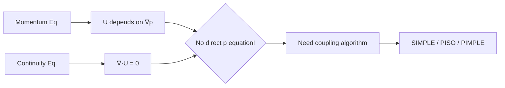

# ภาพรวมการเชื่อมโยงความดัน-ความเร็วใน OpenFOAM

Pressure-Velocity Coupling Overview

---

## 🎯 Learning Objectives

**ทำไมต้องเข้าใจ Pressure-Velocity Coupling?**

หลังจากอ่านบทนี้ คุณจะสามารถ:

- **อธิบาย** ปัญหาพื้นฐานของการไม่มีสมการความดันโดยตรงใน incompressible flow
- **แยกแยะ** ความแตกต่างระหว่าง SIMPLE, PISO และ PIMPLE algorithms
- **เลือกใช้** algorithm ที่เหมาะสมกับปัญหาที่กำลังแก้ (steady vs transient, mesh quality, Co limit)
- **ตั้งค่า** fvSolution parameters อย่างเหมาะสม (nCorrectors, relaxationFactors, nNonOrthogonalCorrectors)
- **เข้าใจ** แนวคิด Rhie-Chow interpolation และ non-orthogonal correction
- **ป้องกัน** ปัญหา divergence ที่เกิดจากการตั้งค่าผิดพลาด

---

## 📚 Core Content

### The Core Problem: Why Coupling is Needed

#### ปัญหาหลัก: ไม่มีสมการความดันโดยตรง!

ใน incompressible Navier-Stokes equations เราเผชิญกับปัญหาพื้นฐาน:

- **Momentum equation** → ต้องการความดัน ∇p เพื่อหาความเร็ว U
- **Continuity equation** → ∇·U = 0 (เป็น constraint ไม่ใช่สมการ)
- **กล่องดำ:** ไม่มีสมการที่บอกค่า p โดยตรง

**Continuity Equation:**
$$\nabla \cdot \mathbf{u} = 0$$

**Momentum Equation:**
$$\rho \frac{\partial \mathbf{u}}{\partial t} + \rho (\mathbf{u} \cdot \nabla) \mathbf{u} = -\nabla p + \mu \nabla^2 \mathbf{u}$$

**แนวคิดสำคัญ:** ความดันทำหน้าที่เป็น **Lagrange multiplier** — มันไม่ใช่ thermodynamic variable แต่เป็นตัวแปรที่ "บังคับ" ให้สอดคล้องกับ continuity constraint

---

### Algorithm Comparison at a Glance

| Algorithm | Type | Use Case | Key Feature |
|-----------|------|----------|-------------|
| **SIMPLE** | Steady-state | RANS, natural convection | Under-relaxation required |
| **PISO** | Transient | LES, DNS, accurate time resolution | Multiple correctors, Co < 1 |
| **PIMPLE** | Transient | Large Δt, multiphase, moving mesh | Hybrid: outer SIMPLE + inner PISO |

**Solver Selection Guide:**

| Application | Recommended Solver | Why? |
|-------------|-------------------|------|
| Steady aerodynamics | `simpleFoam` | Efficient for RANS, no time accuracy needed |
| Vortex shedding | `pisoFoam` | Accurate time resolution, Co < 1 enforced |
| Multiphase VOF | `pimpleFoam` | Handles density ratio, stable with large Δt |
| Moving mesh (FSI) | `pimpleFoam` | Outer relaxation stabilizes mesh motion |
| LES/DNS | `pisoFoam` | Time accuracy critical for turbulence spectra |
| Natural convection | `simpleFoam` | Strong buoyancy coupling needs steady iteration |

---

### Key Numerical Concepts

#### 1. Rhie-Chow Interpolation (แนวคิดพื้นฐาน)

**ทำหน้าที่:** ป้องกัน checkerboard pressure บน collocated grid

**แนวคิด:** ความดันอาจแกว่งสูง-ต่ำสลับกันระหว่างเซลล์โดยที่ average gradient ยังดูปกติ — Rhie-Chow แก้ปัญหานี้โดยใช้ velocity difference

$$\mathbf{u}_f = \overline{\mathbf{u}}_f - \mathbf{D}_f (\nabla p_f - \overline{\nabla p}_f)$$

> **หมายเหตุ:** รายละเอียดการพัฒนาและการใช้งานจะอธิบายใน [01_Mathematical_Foundation.md](01_Mathematical_Foundation.md)

---

#### 2. Non-Orthogonal Correction

**เมื่อ mesh ไม่ orthogonal → gradient calculation มี error → ต้อง iterate**

| Mesh Quality | Max Non-orthogonality | Recommended `nNonOrthogonalCorrectors` |
|--------------|----------------------|----------------------------------------|
| Excellent | < 30° | 0-1 |
| Good | 30-60° | 1-2 |
| Acceptable | 60-70° | 2-3 |
| Poor | > 70° | 3+ **or consider remeshing** |

> **หมายเหตุ:** รายละเอียด non-orthogonal correction จะอธิบายในไฟล์ algorithm-specific files

---

#### 3. Relaxation Factors

**Under-relaxation** ช่วยทำให้ converge ได้ใน steady problems:

- **α_p (pressure):** 0.2-0.3 (SIMPLE), 0.3-0.7 (PIMPLE), 1.0 (PISO)
- **α_U (velocity):** 0.5-0.7 (SIMPLE), 0.6-0.9 (PIMPLE), 1.0 (PISO)

> **หมายเหตุ:** คำแนะนำการตั้งค่า relaxation factors แบบละเอียดจะอยู่ใน [02_SIMPLE_Algorithm.md](02_SIMPLE_Algorithm.md)

---

### Quick Reference Parameter Table

| Parameter | SIMPLE | PISO | PIMPLE | หมายเหตุ |
|-----------|--------|------|--------|----------|
| **α_p** | 0.2-0.3 | 1.0 | 0.3-0.7 | Pressure under-relaxation |
| **α_U** | 0.5-0.7 | 1.0 | 0.6-0.9 | Velocity under-relaxation |
| **nCorrectors** | 1 | 2-3 | 2-3 | Inner pressure corrector loops |
| **nOuterCorrectors** | N/A | N/A | 2-5 | Outer loops (PIMPLE only) |
| **Max Co** | ∞ (pseudo-transient) | < 1 | > 1 OK | Courant number limit |
| **Typical Solver** | `simpleFoam` | `pisoFoam` | `pimpleFoam` | ไม่จำเป็นต้องใช้ solver เหล่านี้ |

---

## 🎯 Key Takeaways

1. **ปัญหาหลัก:** Incompressible flow ไม่มีสมการความดันโดยตรง → ต้องใช้ coupling algorithm เพื่อ derive pressure equation จาก continuity + momentum

2. **SIMPLE = Steady, PISO = Transient-Accurate, PIMPLE = Transient-Stable**
   - SIMPLE: ใช้ under-relaxation ช่วยให้ converge ใน steady problems
   - PISO: Multiple correctors per time step, ต้อง Co < 1
   - PIMPLE: Hybrid approach ที่รองรับ large time steps

3. **Rhie-Chow interpolation** ป้องกัน checkerboard pressure บน collocated grid — เป็นเทคนิคมาตรฐานใน OpenFOAM

4. **Non-orthogonal meshes** ต้องการ multiple corrector loops (`nNonOrthogonalCorrectors`) — ยิ่ง mesh เสีย ยิ่งต้อง iterate มาก

5. **การเลือก algorithm:** ขึ้นอยู่กับ (1) steady vs transient, (2) mesh quality, (3) time step constraint, (4) physics complexity

6. **การตั้งค่า fvSolution ผิด** =  divergence หรือช้า → เข้าใจ principles จะช่วยตั้งค่าได้ถูกต้อง

---

## 🧪 Concept Check

<b>1. ทำไมความดันใน incompressible flow ถึงเรียกว่า Lagrange multiplier?</b>

เพราะความดันไม่ได้มาจาก equation of state แต่เป็นตัวแปรที่ "บังคับ" ให้1$\nabla \cdot \mathbf{u} = 01— มันไม่ใช่ thermodynamic variable แต่เป็น mathematical constraint enforcer ที่เกิดจากการพยายามบังคับให้ velocity field สอดคล้องกับ continuity equation

<b>2. Rhie-Chow interpolation แก้ปัญหาอะไร?</b>

แก้ปัญหา **checkerboard pressure** บน collocated grid — ถ้าไม่มี ความดันอาจแกว่งสูง-ต่ำสลับกันระหว่างเซลล์โดยที่ solver ไม่รู้ตัว เพราะ average gradient ยังดูปกติ แต่การคำนวณ face velocity จะใช้ความดันจากเซลล์ข้างเคียงโดยตรง ทำให้เกิด oscillation

<b>3. PIMPLE ดีกว่า PISO อย่างไรสำหรับ large time steps?</b>

PIMPLE มี **outer corrector loops** ที่ทำงานเหมือน SIMPLE — ช่วยให้ลู่เข้าได้แม้1$Co > 11โดย PISO จะ diverge ถ้า time step ใหญ่เกินไป เพราะ PISO อาศัยการที่ time step เล็กพอที่ pressure change ระหว่าง time steps จะไม่มาก แต่ PIMPLE ใช้ under-relaxation และ outer iterations ในการแก้ปัญหานี้

<b>4. เมื่อไหร่ควรใช้ nNonOrthogonalCorrectors > 0?</b>

เมื่อ mesh มี non-orthogonality > 30 องศา หรือเมื่อเห็นว่า pressure solution ไม่ converge แม้จะเพิ่ม nCorrectors แล้ว การเพิ่ม nNonOrthogonalCorrectors ช่วยให้ solver iterate คำนวณ pressure gradient บน mesh ที่ไม่ orthogonal ได้ถูกต้องขึ้น

---

## 📖 Related Documents

**บทถัดไปใน Module นี้:**

- **[01_Mathematical_Foundation.md](01_Mathematical_Foundation.md)** — รายละเอียดการพัฒนา pressure equation, Rhie-Chow interpolation
- **[02_SIMPLE_Algorithm.md](02_SIMPLE_Algorithm.md)** — Algorithm ละเอียด, relaxation strategies, convergence criteria
- **[03_PISO_and_PIMPLE_Algorithms.md](03_PISO_and_PIMPLE_Algorithms.md)** — Transient algorithms, time step control, outer loops

**เอกสารที่เกี่ยวข้อง:**

- **[Module 01: Governing Equations](../../MODULE_01_CFD_FUNDAMENTALS/CONTENT/01_GOVERNING_EQUATIONS/01_Introduction.md)** — Navier-Stokes equations fundamentals
- **[Module 02: Boundary Conditions](../../MODULE_02_MESHING_AND_CASE_SETUP/CONTENT/05_MESH_QUALITY_AND_MANIPULATION/01_Mesh_Quality_Criteria.md)** — Mesh quality assessment, non-orthogonality
- **[fvSolution dictionary reference](../../MODULE_03_SINGLE_PHASE_FLOW/CONTENT/01_INCOMPRESSIBLE_FLOW_SOLVERS/03_Simulation_Control.md)** — การตั้งค่า simulation parameters